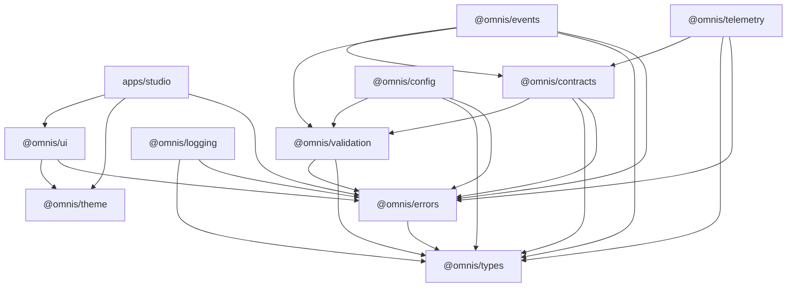

# OMNIS

**AI Operating System · Agent OS · Digital Human OS · Content Factory · Audience Intelligence · Growth Platform**

OMNIS is an autonomous, continuously learning operating system for digital media. It researches, plans,
produces, publishes, measures and improves content for social platforms — and it does so through persistent
**Digital Humans** that keep their identity, memory, knowledge, appearance, relationships and skills
continuous across months of output.

> One intelligent operating system for digital humans, content production, audience intelligence, growth
> and continuous learning.

---

## Current status

**Sprint 0 — foundation, audit and production architecture bootstrap — is complete.**

Sprint 0 deliberately builds no product features. It builds the typed foundation every later Sprint stands
on: identifiers, errors, validation, contracts, events, configuration, logging, telemetry, design tokens,
a component library and the Studio operator surface. Everything here is real, tested implementation —
there are no placeholder packages, no stubbed core paths and no `TODO` throws.

| Gate             | Result                             |
| ---------------- | ---------------------------------- |
| `pnpm build`     | 11/11 packages                     |
| `pnpm typecheck` | 11/11 packages                     |
| `pnpm lint`      | 11/11 packages, `--max-warnings=0` |
| `pnpm test`      | **815 tests**, 11/11 packages      |
| `pnpm verify`    | workspace health + secret scan     |

See [docs/PROJECT_STATUS.md](docs/PROJECT_STATUS.md) for the authoritative snapshot and
[docs/ROADMAP.md](docs/ROADMAP.md) for what comes next.

---

## Quickstart

Requirements: **Node ≥ 22.12** (see [.nvmrc](.nvmrc)) and **pnpm 11** (`corepack enable`). pnpm is the
only package manager in this repository — see
[ADR-0001](docs/07-decisions/ADR-0001-monorepo-and-toolchain.md).

```bash
corepack enable
pnpm install          # workspace install (frozen lockfile in CI)
pnpm build            # topological build of every package
pnpm test             # 815 tests across 11 packages
pnpm lint             # eslint, zero warnings tolerated
pnpm typecheck        # tsc, strict + NodeNext
pnpm check            # verify + lint + typecheck + test + build (the CI gate)
pnpm dev              # start Studio with HMR
```

Studio runs at the URL Vite prints (default `http://localhost:5173`).

---

## Repository layout

```text
Omnis/
├── apps/
│   └── studio/            Operator surface: React 19 + Vite, the AI Studio aesthetic
├── packages/
│   ├── types/             Branded identifiers, value types, the identifier codec
│   ├── errors/            13-class typed error hierarchy, stable codes, secret-safe serialization
│   ├── validation/        The single validation door (Zod 4) wrapped into typed failures
│   ├── contracts/         Event envelopes, commands, results, actor/tenant/execution context
│   ├── events/            Versioned event registry, Sprint 0 definitions, in-memory bus
│   ├── config/            Schema-validated configuration, fail-fast in production
│   ├── logging/           Structured, correlation-aware, redacting logger interfaces
│   ├── telemetry/         Meters, counters, gauges, histograms, tracers, spans + no-ops
│   ├── theme/             Design tokens and themes — pure data, framework-agnostic
│   └── ui/                Accessible React components + ThemeProvider
├── docs/                  Numbered documentation set (see docs/SUMMARY.md)
├── scripts/               Workspace health, secret scanning, package cleaning
└── .github/workflows/     CI
```

### Package dependency rules

Dependencies point **downward only**; nothing in the platform layer may import from `apps/`, and no cycle
is permitted. `pnpm verify:workspace` enforces this mechanically.



`@omnis/types` and `@omnis/theme` are the two leaves: they depend on nothing inside the workspace. Zod
appears **only** in `@omnis/validation`, so the validation technology can be changed in exactly one place.

---

## Architectural invariants

These are enforced by code and tests, not by convention:

1. **Every identifier is branded and parseable.** `<prefix>_<26-char Crockford base32 ULID>`; 20 kinds.
   A string is never an identifier until it has been through the codec.
2. **Every record is attributable.** Events, commands, logs and spans carry `tenantId` and
   `correlationId`. There is no code path that produces an unattributed record.
3. **Contracts are versioned and validated at the boundary.** `CONTRACT_VERSION = 1.0.0`; envelopes are
   forward-compatible (unknown fields are stripped, not rejected).
4. **Errors are typed, coded and secret-safe.** 13 classes, stable codes, redaction before serialization —
   a message never carries a credential, token or secret-looking value.
5. **Events are owned.** Every event type belongs to exactly one namespace owner; publishing a type nobody
   has defined is a `NotFoundError`, not a silent drop.
6. **`null` is not `undefined`, and `null` is not `0`.** Payloads use `T | null`, never optional keys, so
   "the producer asserted there is none" is distinguishable from "the producer omitted this".
7. **Configuration fails fast in production.** A missing or invalid variable in `production` aborts
   startup rather than degrading silently.
8. **Telemetry never invents dimensions.** Metric labels are restricted to a bounded vocabulary;
   identifiers live on spans, never on metrics.
9. **The theme is data.** `@omnis/theme` has no React, no CSS pipeline and no runtime dependency, so it
   can serve web, desktop and mobile clients.
10. **The UI is presentational.** `@omnis/ui` contains no domain logic and no data fetching.

---

## Documentation

Start at [docs/README.md](docs/README.md); the complete map is [docs/SUMMARY.md](docs/SUMMARY.md).

| Document                                                              | What it settles                                   |
| --------------------------------------------------------------------- | ------------------------------------------------- |
| [ARCHITECTURE.md](docs/01-architecture/ARCHITECTURE.md)               | Domains, layers and cross-cutting rules           |
| [PLATFORM_FOUNDATION.md](docs/01-architecture/PLATFORM_FOUNDATION.md) | The monorepo, packages and module system          |
| [EVENT_ARCHITECTURE.md](docs/01-architecture/EVENT_ARCHITECTURE.md)   | Event ownership, envelopes and delivery semantics |
| [SECURITY_BOUNDARIES.md](docs/01-architecture/SECURITY_BOUNDARIES.md) | Redaction, personal data, tenancy, approval gates |
| [IDENTIFIERS.md](docs/03-contracts/IDENTIFIERS.md)                    | The identifier scheme and its invariants          |
| [VERSIONING.md](docs/03-contracts/VERSIONING.md)                      | Compatibility rules and deprecation policy        |
| [docs/07-decisions/](docs/07-decisions)                               | ADRs — every architecture change starts here      |

Coding agents: read [AGENTS.md](AGENTS.md) and
[docs/05-implementation/AI_BUILD_GUIDE.md](docs/05-implementation/AI_BUILD_GUIDE.md) before changing code.

---

## Contributing

See [CONTRIBUTING.md](CONTRIBUTING.md). In short: work in small vertical slices, keep every gate green,
write an ADR before changing a boundary, and never commit a secret
([SECURITY.md](SECURITY.md)).

## License

MIT — see [LICENSE](LICENSE).
