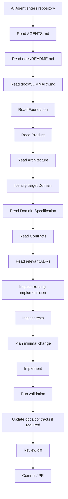
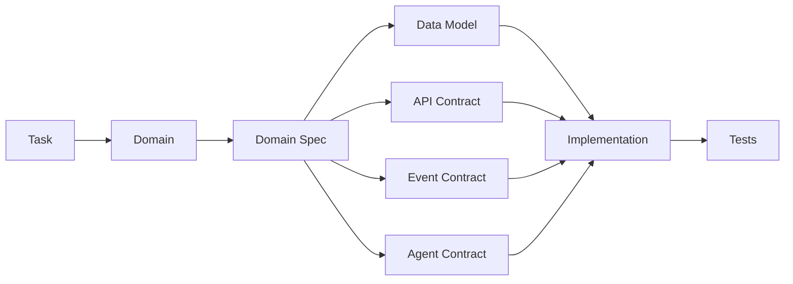
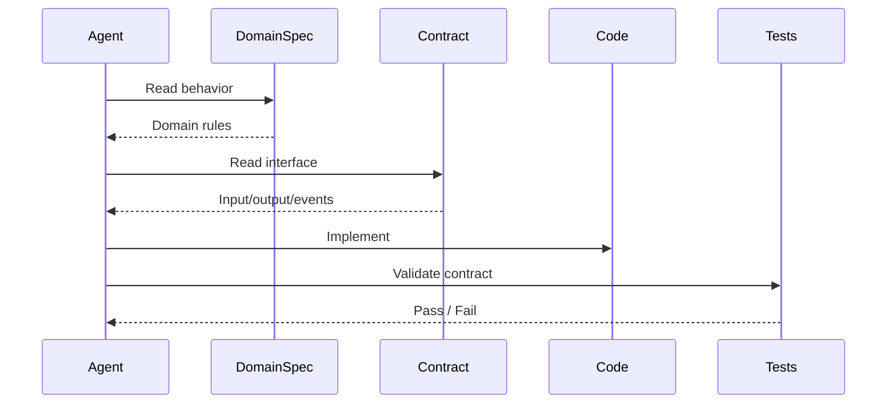
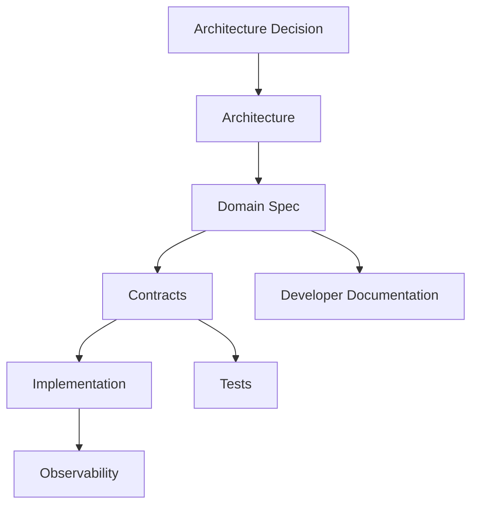
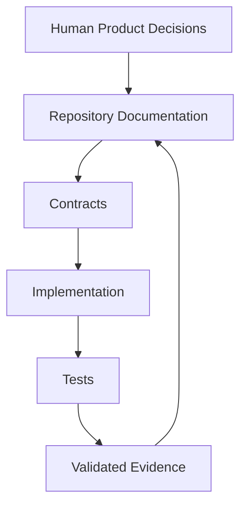

# AI Agent Read Order

> **Status:** Accepted
>
> **Purpose:** deterministic onboarding contract for Codex, Claude Code, and other AI coding agents working on OMNIS.

## 1. Objective

An AI coding agent must be able to enter the repository without access to previous conversations and reconstruct the intended architecture, constraints, terminology, contracts, and implementation status from repository artifacts alone.

The repository is therefore treated as a persistent engineering memory.



## 2. Mandatory first-pass documents

The following documents are mandatory before an agent makes architectural or cross-domain changes:

1. `AGENTS.md`
2. `docs/README.md`
3. `docs/SUMMARY.md`
4. `docs/00-foundation/DOCUMENTATION_GOVERNANCE.md`
5. `docs/00-foundation/DOCUMENTATION_STANDARD.md`
6. `docs/01-product/README.md`
7. `docs/02-architecture/README.md`

If any of these documents is missing, contradictory, or clearly stale, the agent must stop before making a high-impact architectural decision.

## 3. Targeted read set

After the mandatory first pass, the agent should read only the documentation required for the task, while preserving dependency order.



This avoids forcing an AI model to consume thousands of unrelated lines while still providing deterministic context.

## 4. Architecture decision rule

An agent must not infer an architecture decision solely from source code if a specification or ADR exists.

Priority order:

```text
Accepted ADR
    >
Accepted Contract
    >
Domain Specification
    >
Architecture Specification
    >
Product Specification
    >
Tests
    >
Current Implementation
    >
Comments / Examples
    >
Agent Assumption
```

When implementation and documentation disagree, the agent must not silently choose one. It must identify the conflict and either update the implementation according to an accepted contract or propose an ADR/documentation correction.

## 5. Scope discipline

Agents must distinguish between:

- local implementation details;
- domain behavior;
- public contracts;
- cross-domain architecture;
- infrastructure behavior;
- product requirements.

A local task must not become an architectural rewrite without evidence and an appropriate ADR.

## 6. Unknowns

When information is missing, an agent must mark the uncertainty explicitly.

Allowed forms include:

- `UNKNOWN`
- `TBD`
- `PROPOSED`
- `NEEDS_DECISION`

An agent must not convert an unknown requirement into a permanent architecture rule merely because a convenient implementation exists.

## 7. Contract-first behavior

Before creating a cross-domain dependency, inspect the relevant contract directory.



## 8. Definition of done for AI-generated changes

A change is not complete merely because the code compiles.

Minimum completion requirements are:

- implementation is scoped;
- relevant tests exist or are updated;
- public contracts remain valid;
- architecture boundaries remain valid;
- security implications were considered;
- observability requirements were considered;
- documentation is updated when behavior or contracts changed;
- no unrelated files were modified;
- validation commands are recorded when useful.

## 9. Context efficiency

OMNIS documentation is deliberately hierarchical.

```text
Repository
  └── Global rules
      └── Product
          └── Architecture
              └── Domain
                  └── Contract
                      └── Implementation
                          └── Tests
```

This hierarchy is designed to reduce context-window waste and increase implementation precision.

## 10. Human readability

The same documentation must remain understandable to engineers and operators. AI-oriented structure must never replace clear human explanations.

Visual material should be used where it improves comprehension:

- architecture diagrams;
- sequence diagrams;
- state machines;
- entity relationships;
- lifecycle diagrams;
- decision trees;
- dependency graphs;
- tables;
- schemas;
- examples.

## 11. Change propagation

When a foundational rule changes, dependent documentation must be reviewed.



## 12. No hidden project memory

Important project decisions must not remain only in chat history, personal notes, or model memory.

If a decision matters to implementation, it belongs in the repository.

## 13. Repository as persistent memory



The repository therefore acts as the durable memory of OMNIS engineering intent.

## 14. AI agent handoff

An incoming agent should be able to answer these questions before implementation:

1. What is OMNIS?
2. What problem does the current task solve?
3. Which domain owns the behavior?
4. Which contracts are affected?
5. Which events are involved?
6. Which data models are involved?
7. Which agents or services participate?
8. Which ADRs constrain the design?
9. Which tests prove the behavior?
10. What documentation must change?

If these questions cannot be answered from repository artifacts, the documentation is incomplete for that task.

## 15. Final rule

> **Read before reasoning. Contract before implementation. Test before completion. Document before forgetting.**
