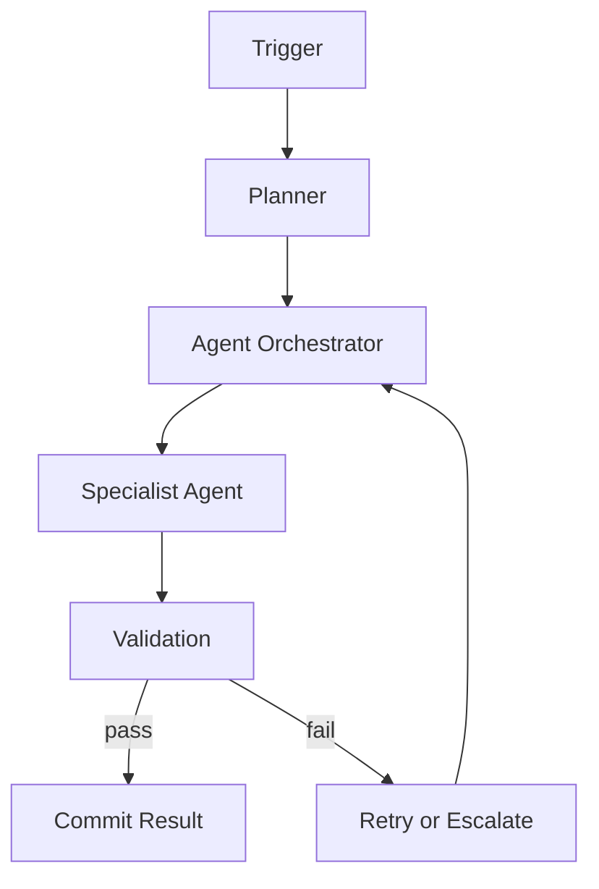
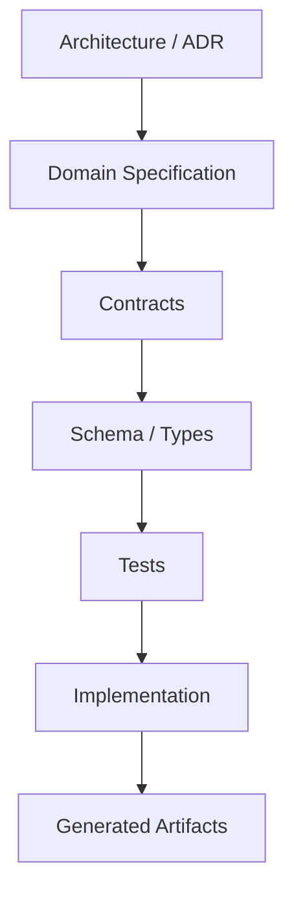
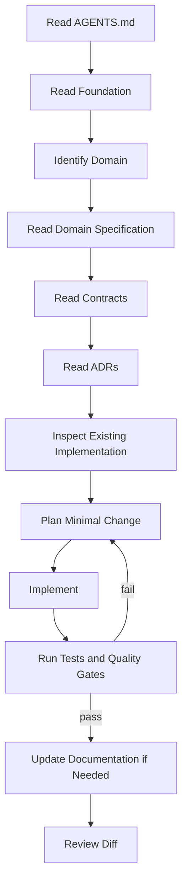

# OMNIS Documentation Standard

**Status:** Accepted
**Version:** 1.0.0
**Scope:** Every file under `docs/` and every implementation-facing specification in the repository.

---

## 1. Purpose

OMNIS documentation is an executable design system for humans and AI coding agents. It must explain not only what the system is, but why it exists, how its parts interact, what contracts they expose, what states they can enter, how failures are handled, and how implementation can be verified.

Documentation is therefore treated as a first-class engineering artifact.

The target reader is simultaneously:

1. A human architect who needs a coherent mental model.
2. A senior engineer who needs implementation constraints.
3. A new contributor who needs local context.
4. An AI coding agent that needs deterministic instructions without relying on conversation history.
5. An evaluator that needs objective evidence that an implementation matches the specification.

---

## 2. Minimum completeness standard

A documentation file is not considered complete merely because it is long. It is complete when it covers the concepts required for its scope and provides enough structured evidence to implement and verify them.

For major architecture and domain documents:

- Target several thousand lines when the subject genuinely requires that depth.
- Do not add filler prose merely to satisfy a line count.
- Prefer explicit contracts, examples, tables, diagrams, state machines, schemas, decision records, and verification criteria over repetitive prose.
- Every major concept must have a concrete implementation interpretation.
- Every important interaction must be represented visually when a visual representation improves comprehension.

### Visualization density

As a project-wide readability target, no more than approximately **50 consecutive explanatory lines** should pass without a meaningful visual or structured comprehension aid when the subject supports one.

Acceptable aids include:

- Mermaid architecture diagrams.
- Mermaid sequence diagrams.
- Mermaid state diagrams.
- Mermaid flowcharts.
- Mermaid ER diagrams.
- Mermaid class diagrams.
- Mermaid timelines.
- Mermaid mindmaps.
- Decision tables.
- Comparison tables.
- JSON/YAML examples.
- TypeScript interfaces.
- Pseudocode.
- Formula blocks.
- Charts and metrics definitions.
- Embedded project diagrams.
- Screenshots or UI mockups where useful.

The 50-line target is a readability heuristic, not permission to insert meaningless diagrams.

---

## 3. Required document anatomy

Major documents should normally follow this structure:

```text
Title
Metadata
Executive Summary
Purpose
Scope
Non-Goals
Terminology
Mental Model
Architecture
Responsibilities
Data Model
State Model
Lifecycle
Interactions
Events
Contracts
Failure Modes
Security
Observability
Performance
Cost
Testing
Examples
Operational Procedures
Decision Log
Open Questions
Acceptance Criteria
Related Documents
```

The exact order may change when the subject requires it, but omissions must be intentional.

---

## 4. Mermaid standard

Mermaid is the default textual diagram language for repository documentation because it is version-controlled, reviewable, editable by AI agents, and renderable by common documentation platforms.

Use diagrams for:

- Component relationships.
- Runtime topology.
- Request flows.
- Event flows.
- Agent orchestration.
- State transitions.
- Data relationships.
- Deployment topology.
- User journeys.
- Decision logic.
- Lifecycle progression.

Example:



Diagrams must remain semantically synchronized with the surrounding text.

---

## 5. Images and external visual assets

Use images when they communicate information that would be materially harder to understand as text.

Preferred order:

1. Mermaid or repository-native diagrams when possible.
2. Generated SVG/PNG diagrams stored in the repository.
3. Screenshots of the actual OMNIS UI.
4. External images only when licensing and provenance are documented.

Every non-trivial image should have:

- Descriptive alt text.
- A short caption.
- Source/provenance when applicable.
- Version or date when the image represents a changing system.

Do not use decorative images merely to increase document length.

---

## 6. Charts and quantitative material

Charts must answer a specific question.

Every chart should identify:

- Metric.
- Unit.
- Time range.
- Population or sample.
- Source.
- Interpretation.

For system metrics, define the metric before using it.

Example:

```text
Metric: Agent Task Success Rate
Definition: successful terminal tasks / all terminal tasks
Unit: percentage
Window: rolling 24 hours
```

---

## 7. Tables

Use tables for dense comparisons and contracts.

Recommended columns include:

| Field | Meaning | Type | Required | Default | Constraints | Example |
|---|---|---|---|---|---|---|
| `id` | Stable entity identifier | string | yes | — | globally unique | `char_01` |

Tables must not become substitutes for explanations. Explain important semantics in prose or diagrams.

---

## 8. Code examples

Code in documentation must be:

- Syntactically plausible.
- Consistent with the repository stack.
- Explicit about whether it is illustrative or normative.
- Small enough to understand.
- Free of fake APIs unless clearly marked as pseudocode.

Normative examples should be kept synchronized with implementation contracts.

---

## 9. AI-agent readability

Every implementation-facing document must answer:

```text
What is this?
Why does it exist?
What owns it?
What does it depend on?
What depends on it?
What inputs does it accept?
What outputs does it produce?
What states can it have?
What events does it emit?
What events does it consume?
What can fail?
How should failure be handled?
What security rules apply?
How is it observed?
How is it tested?
What must an AI agent never assume?
```

Use explicit language such as:

- MUST
- MUST NOT
- SHOULD
- SHOULD NOT
- MAY

These words are normative and must be used consistently.

---

## 10. Source-of-truth hierarchy

When sources disagree, use this order unless an ADR explicitly overrides it:



The intended architecture is defined by accepted documentation and ADRs. Tests validate implementation behavior. Implementation must not silently redefine architecture.

If implementation and specification disagree:

1. Determine whether implementation or documentation is stale.
2. Do not silently choose one.
3. Update the appropriate artifact.
4. Create an ADR when architecture changes.

---

## 11. Cross-linking

Documents must link to related documents using repository-relative paths.

A major domain specification should link to:

- Its architecture section.
- Its data model.
- Its contracts.
- Its agents.
- Its events.
- Its tests.
- Relevant ADRs.
- Dependent domains.

Avoid isolated documentation islands.

---

## 12. Versioning

Architecture and contracts use explicit versions.

Breaking changes require:

- An ADR.
- Migration notes.
- Compatibility impact.
- Updated diagrams.
- Updated tests.
- Updated agent instructions where applicable.

---

## 13. AI implementation workflow

An AI coding agent implementing a task must follow:



An agent MUST NOT infer missing requirements from aesthetics or personal preference when the specification is explicit.

---

## 14. Documentation quality gate

A major document is ready for acceptance only when:

- Scope is explicit.
- Non-goals are explicit.
- Terminology is defined.
- Architecture is diagrammed.
- Major flows are diagrammed.
- Important states are diagrammed.
- Data contracts are described.
- Failure behavior is described.
- Security implications are described.
- Observability requirements are described.
- Testing strategy is described.
- Acceptance criteria are measurable.
- Cross-links are present.
- No unresolved contradiction exists with accepted ADRs.

---

## 15. Anti-patterns

Do not:

- Inflate line count with repetitive prose.
- Add decorative diagrams with no semantic value.
- Copy implementation code into documentation without purpose.
- Describe behavior that cannot be tested.
- Hide critical requirements in casual prose.
- Use undocumented magic values.
- Invent APIs or services as if they already exist.
- Allow documentation and contracts to drift silently.
- Treat AI-generated text as authoritative without repository validation.

---

## 16. Definition of Done for documentation

A document is DONE when a competent engineer who has never seen OMNIS can use it to understand the relevant subsystem and an AI coding agent can use it to implement the subsystem without relying on private conversation history.

The strongest documentation is therefore:

```text
Readable by humans
        +
Structured for machines
        +
Linked across domains
        +
Visually explained
        +
Contractually precise
        +
Testable
        =
OMNIS Engineering Documentation
```
