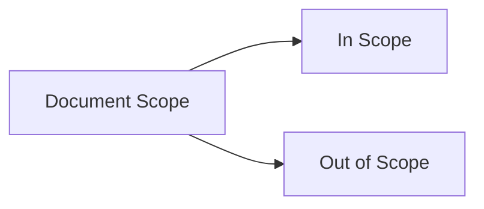
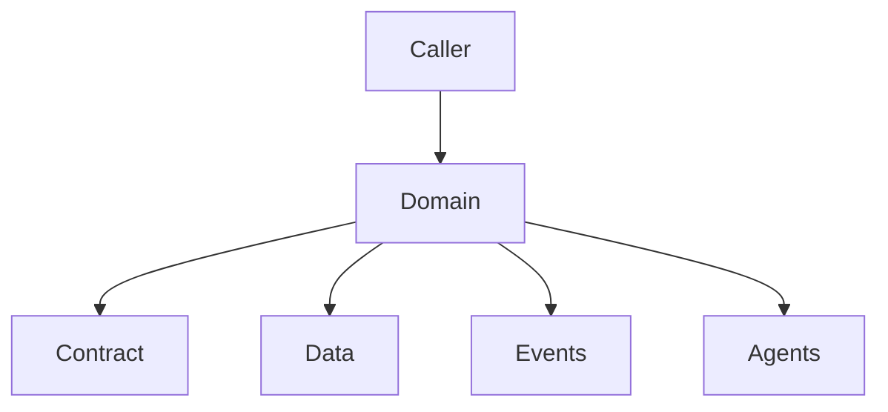
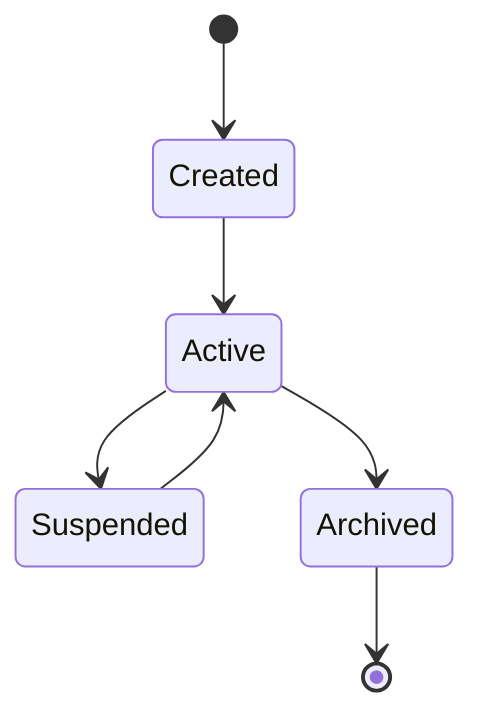
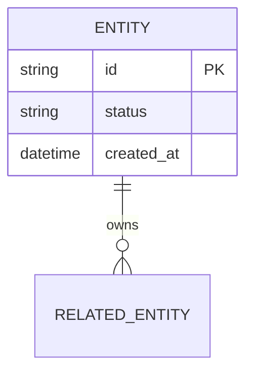
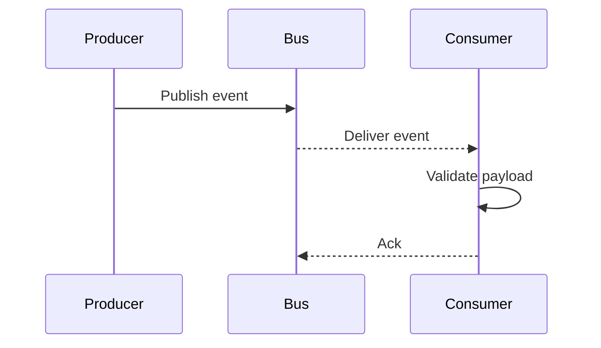
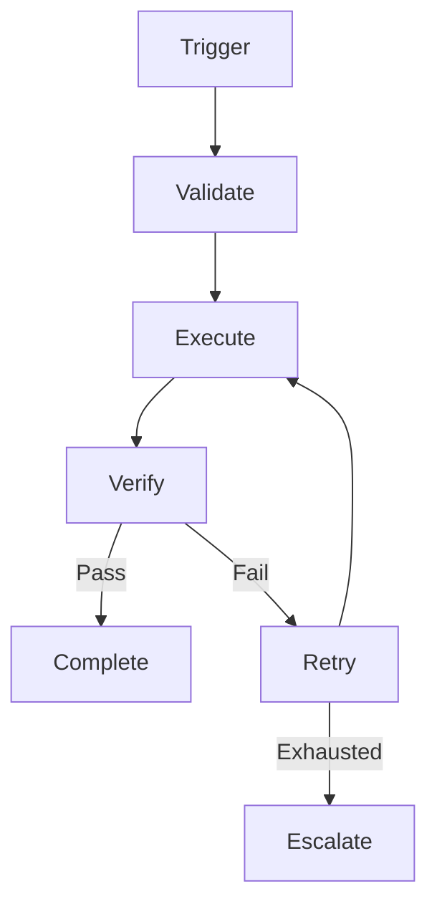
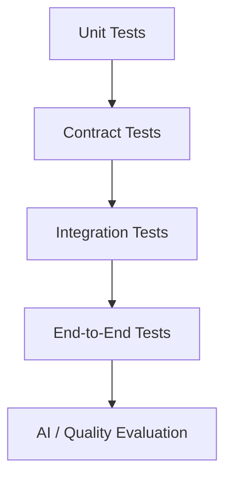

# OMNIS Documentation Template

> **Status:** Accepted
> **Audience:** Human engineers, product owners, operators, AI coding agents

## 1. Document Metadata

| Field | Value |
|---|---|
| Document ID | `DOC-XXXX` |
| Domain | `DOMAIN-NAME` |
| Status | `Proposed / Draft / Accepted / Implemented / Deprecated` |
| Owner | `TEAM / ROLE` |
| Version | `0.1.0` |
| Last Updated | `YYYY-MM-DD` |
| Review Cadence | `PERIOD` |
| Dependencies | `DOC-ID / CONTRACT-ID / ADR-ID` |

## 2. Purpose

State exactly why this document exists and what implementation decisions it governs.

## 3. Scope

### In scope

- item
- item
- item

### Out of scope

- item
- item
- item



## 4. Terminology

| Term | Definition | Notes |
|---|---|---|
| Term | Canonical definition | Context |

## 5. Problem Statement

Describe the problem in operational terms.

## 6. Goals

1. Goal
2. Goal
3. Goal

## 7. Non-Goals

1. Non-goal
2. Non-goal

## 8. Architecture Context

Explain where the documented capability lives in OMNIS.



## 9. Actors

| Actor | Responsibility | Permissions |
|---|---|---|
| Human | ... | ... |
| Agent | ... | ... |
| Service | ... | ... |

## 10. Core Concepts

Define each concept independently before describing interactions.

## 11. Lifecycle



Replace states with domain-specific states.

## 12. State Model

Define all states, transitions, guards, side effects, and terminal conditions.

| State | Entry condition | Allowed transitions | Exit condition |
|---|---|---|---|
| State | Condition | States | Condition |

## 13. Data Model

Provide canonical fields, types, invariants, ownership, and lifecycle.



## 14. API Contract

For every public operation specify:

- method;
- endpoint or RPC;
- authentication;
- authorization;
- input schema;
- output schema;
- errors;
- idempotency;
- rate limits;
- observability.

```text
REQUEST
  -> AUTH
  -> VALIDATE
  -> EXECUTE
  -> PERSIST
  -> EMIT EVENT
  -> RESPONSE
```

## 15. Event Contract

| Event | Producer | Consumers | Payload | Delivery | Ordering |
|---|---|---|---|---|---|
| `DOMAIN.EVENT` | Service | Agents | Schema | At-least-once | Partition key |



## 16. Agent Contract

Define:

- agent identity;
- purpose;
- capabilities;
- tools;
- permissions;
- memory access;
- input;
- output;
- failure behavior;
- escalation;
- evaluation;
- cost limits.

## 17. Workflow



## 18. Invariants

List rules that must always remain true.

Example:

```text
INVARIANT-001:
An entity cannot transition from ARCHIVED to ACTIVE without an explicit restoration operation.
```

## 19. Failure Modes

| Failure | Detection | Recovery | Escalation |
|---|---|---|---|
| Failure | Signal | Strategy | Target |

## 20. Security

Document:

- authentication;
- authorization;
- data classification;
- secrets;
- audit;
- abuse prevention;
- privacy;
- retention.

## 21. Safety & Governance

Document policy constraints, AI safety constraints, provenance, rights, and platform requirements.

## 22. Observability

Define:

- logs;
- metrics;
- traces;
- events;
- dashboards;
- alerts;
- SLOs;
- cost telemetry.

## 23. Testing Strategy



## 24. Performance

Specify latency, throughput, concurrency, resource limits, and scaling expectations where relevant.

## 25. Cost

Document expensive operations and expected cost-control mechanisms.

## 26. Compatibility

Define versioning and backward-compatibility requirements.

## 27. Examples

Provide realistic examples and counterexamples.

## 28. Operational Runbook

Describe diagnosis, recovery, rollback, and escalation.

## 29. Security / Privacy Checklist

- [ ] Authentication reviewed
- [ ] Authorization reviewed
- [ ] Secrets reviewed
- [ ] PII reviewed
- [ ] Audit reviewed
- [ ] Retention reviewed

## 30. AI Implementation Checklist

- [ ] Relevant specification read
- [ ] Contracts read
- [ ] ADRs read
- [ ] Existing implementation inspected
- [ ] Tests inspected
- [ ] No assumptions silently introduced
- [ ] Documentation updated
- [ ] Validation completed

## 31. Decision Log

| Date | Decision | Reason | Owner | ADR |
|---|---|---|---|---|
| YYYY-MM-DD | Decision | Reason | Role | ADR-XXXX |

## 32. Open Questions

| ID | Question | Impact | Owner | Status |
|---|---|---|---|---|
| Q-001 | Question | High/Medium/Low | Role | Open |

## 33. References

List internal documents, contracts, ADRs, standards, source material, and external references.

## 34. Change History

| Version | Date | Change |
|---|---|---|
| 0.1.0 | YYYY-MM-DD | Initial draft |

## 35. Visual Density Rule

The document should use a visual explanation whenever a visual representation materially improves understanding. As a project documentation guideline, avoid long stretches of prose without diagrams, tables, schemas, examples, or other structured material.

The purpose of the visual-density rule is comprehension, not artificial line-count inflation.
