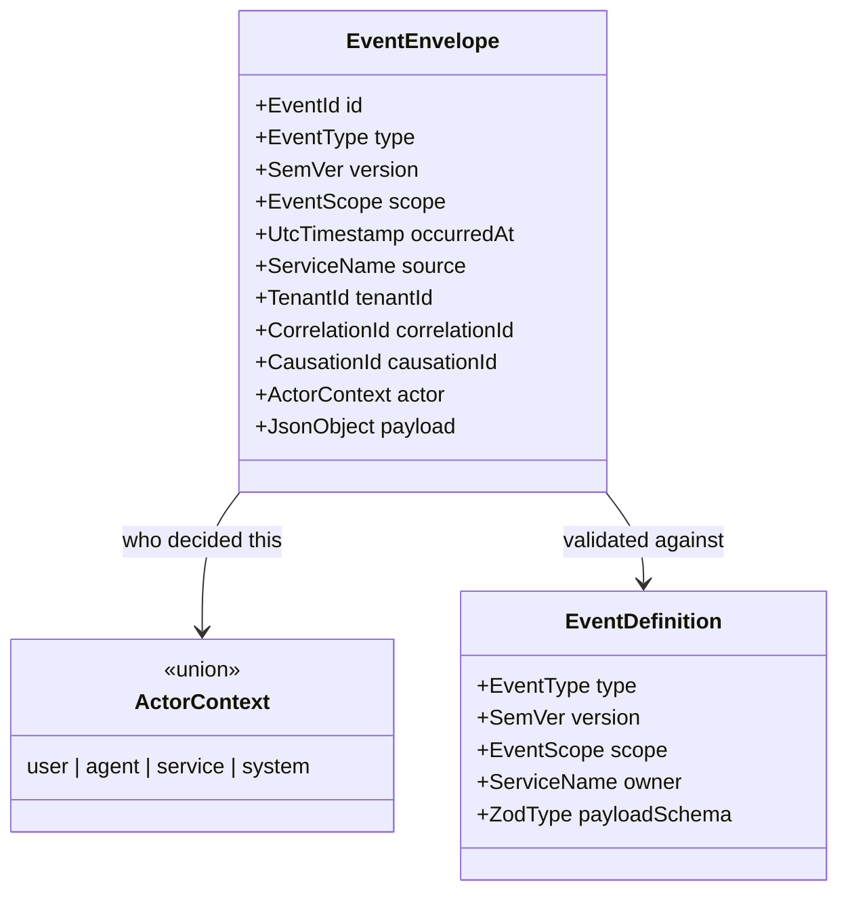

# Event Architecture

Status: Accepted · Owner: `@omnis/events` · Contract version: 1.0.0

Events are how OMNIS domains talk without depending on each other. This document is the
authority for the event **grammar**, the **ownership map**, the **envelope**, the
**registry** and the **delivery semantics** of the reference bus. Implementation:
[`packages/events/src`](../../packages/events/src), contracts in
[`packages/contracts/src/envelope.ts`](../../packages/contracts/src/envelope.ts).

## 1. Why events and not calls

One business operation — "turn an audience request into a published video" — crosses
Audience Intelligence, Content Strategy, the Content Factory, several model providers,
Publishing and Analytics, and may take hours. Direct calls would make every domain
depend on the availability, latency and deployment schedule of every other domain, and
would leave no record of what happened when something did not.

Events give three things calls cannot: a durable record of what occurred, temporal
decoupling between producer and consumer, and a place to attach the correlation chain
that makes a multi-hour operation debuggable end to end.

## 2. Naming grammar

```text
<domain>.<subject>[.<qualifier>...]        e.g. character.experience.recorded
```

Enforced by `parseEventType` against `^[a-z][a-z0-9]*(?:\.[a-z][a-z0-9]*)+$`:

- lowercase alphanumeric segments, dot-separated, **at least two** segments;
- no underscores, no hyphens, no camelCase, no version suffix;
- the first segment must be one of the seven recognised namespaces.

The shape is validated rather than conventional because the event type is the primary
routing and versioning key of the platform: the registry indexes by it, consumers
subscribe by it, dashboards group by it, and the first segment determines ownership. If
the shape were unconstrained, `character.created`, `CharacterCreated`,
`character_created` and `character.created.v2` would all appear in the same stream and
none of those mechanisms would work.

This is not a theoretical risk. `audience.loyalty.tier_changed` was defined with an
underscore during Sprint 0; `parseEventType` threw **at module load**, which made the
whole package unimportable. It is now `audience.loyalty.tier.changed`, and a regression
test asserts the grammar for every declared type.

Segments are stable: renaming one is a breaking contract change requiring an ADR,
because persisted events already carry it. Versions belong in the `version` field, never
in the name.

## 3. Ownership map

Every event belongs to exactly one owning domain. The namespace is how that ownership is
visible on the wire, and `EVENT_OWNERS` is the authoritative table.

| Namespace      | Owner (`source`)        | Sprint 0 definitions                                                                         | Scope               |
| -------------- | ----------------------- | -------------------------------------------------------------------------------------------- | ------------------- |
| `system.*`     | `omnis.platform`        | `system.initialized`, `system.configuration.loaded`                                          | integration, domain |
| `agent.*`      | `ai-core`               | `agent.execution.started`, `agent.execution.completed`, `agent.execution.failed`             | integration         |
| `character.*`  | `character-os`          | `character.created`, `character.experience.recorded`                                         | integration, domain |
| `audience.*`   | `audience-intelligence` | `audience.comment.received`, `audience.dm.received`, `audience.request.detected`             | integration         |
| `content.*`    | `content-factory`       | `content.production.requested`, `content.production.started`, `content.production.completed` | integration         |
| `publishing.*` | `publishing`            | `publishing.job.created`, `publishing.job.completed`                                         | integration         |
| `analytics.*`  | `analytics`             | `analytics.performance.recorded`                                                             | integration         |

Sixteen definitions in total. Additional types are declared in the namespace tables
(`agent.tool.invoked`, `publishing.approval.requested`, `audience.loyalty.tier.changed`,
…) but are **not registered** yet: a type may exist in the vocabulary before it has an
agreed payload contract, and registering it is what makes it publishable.

`content-strategy` is a declared owner with no Sprint 0 definitions; strategy events
arrive with the Strategy & Growth domain.

### Ownership rules

1. Only the owner _defines_ events in its namespace, and the owner is recorded on the
   definition — a payload validation failure names the owner, so a mismatch is
   diagnosable from the error alone. The envelope's `source` is validated as a service
   name, but Sprint 0 deliberately does **not** reject an envelope whose `source` differs
   from the definition's owner: a gateway or bridge may legitimately republish on another
   service's behalf. Ownership is therefore an authoring and review rule at this stage,
   and deciding whether to enforce it at the boundary belongs to the Policy Engine rather
   than to the envelope parser.
2. A consumer may subscribe to any namespace, but may not define events in it.
3. Adding a namespace is an ADR-level change: it adds a domain boundary, not a topic.
4. `scope` distinguishes **domain** events (internal to a domain's own reasoning, safe to
   change more freely) from **integration** events (cross a domain boundary and are part
   of the platform's public contract).

## 4. The envelope



Every field is mandatory except `causationId` and `actor`, which are nullable — and
nullable is not optional (see [VERSIONING.md](../03-contracts/VERSIONING.md)).

Two chains are carried, because they have different lifetimes:

- **business**: `correlationId` ties every record produced by one end-to-end operation
  together across many executions and possibly many days; `causationId` names the
  specific command or event that directly caused this one. A causation identifier may be
  an `evt_`, `cmd_` or `cau_` value, and `asCausationId` re-labels an event or command
  identifier **without changing its value**, so the join back to the cause still works.
- **technical**: `traceId` / `spanId` live in `@omnis/telemetry` and are W3C-compatible.
  A trace typically ends when a request ends; a business correlation can span days of
  scheduled production work.

## 5. Registry semantics

`EventRegistry` is the single source of truth for what may be published.

| Behaviour | Rule                                                                                                | Why                                                                                                                                                         |
| --------- | --------------------------------------------------------------------------------------------------- | ----------------------------------------------------------------------------------------------------------------------------------------------------------- |
| register  | `type@version` must be unique; re-registering throws `ConflictError`                                | An overwrite would change the meaning of a type consumers already validated against — the most confusing class of bug to diagnose across a process boundary |
| resolve   | `find(type)` returns the **highest** registered version; `find(type, version)` returns that version | Emitting the newest contract is right for a producer; a consumer that only understands an older shape must ask for its version explicitly                   |
| require   | throws `NotFoundError` when absent                                                                  | Failing loudly at the call site beats discovering the gap in production                                                                                     |
| validate  | envelope shape **then** payload against the definition's schema                                     | A structurally valid envelope with a wrong payload is still a broken event                                                                                  |
| version   | an envelope whose major differs from the build's `CONTRACT_VERSION` is rejected (`ContractError`)   | Same-major is the compatibility promise; a different major may have changed field meanings                                                                  |

The registry stores definitions in a `Map` keyed by type, then by version, and exposes
copies (`types()`, `list()`) rather than its internals, so a consumer cannot mutate the
vocabulary it is validating against.

## 6. Reference bus semantics

`InMemoryEventBus` is not a production transport. It is the **reference implementation**
every durable transport will be judged against, and its semantics are pinned by tests:

1. **Validate before dispatch.** An unregistered type is a `NotFoundError` and an invalid
   payload is a `ValidationError`; in both cases **no handler is called** and
   `publishedCount` does not advance.
2. **Sequential, in subscription order.** Deliberate for the reference implementation: it
   makes causality observable and reproducible. A durable transport delivers concurrently
   across processes, so anything needing order must derive it from the event's own
   identifiers and timestamps rather than from delivery sequence.
3. **Failure isolation.** One throwing handler does not prevent the others from receiving
   the event. When any handler failed, `publish` throws an `ExecutionError` reporting
   `failureCount` of `handlerCount`, carrying `eventId`, `correlationId` and
   `eventType`, marked **not retryable** — re-dispatching to the same broken consumer
   would fail identically and would double-apply every handler that succeeded. In a
   durable transport this isolation is what makes per-consumer retry and dead-lettering
   possible.
4. **No subscribers is not an error.** A producer must not have to know who consumes its
   events.
5. **`publishedCount` counts dispatched events**, including those where a handler failed —
   the number an operator compares against the producer's own count.
6. **Subscriptions are handles.** `subscribe` returns a `Subscription` bound to its type;
   `subscribeAll` returns one bound to `null`. Unsubscribing twice is harmless, because
   cleanup paths run in `finally` blocks and throwing there would mask the original
   failure.

```mermaid
sequenceDiagram
  participant P as Producer
  participant B as InMemoryEventBus
  participant R as EventRegistry
  participant H1 as Handler A
  participant H2 as Handler B
  P->>B: publish(envelope)
  B->>R: require(type) — NotFoundError if undefined
  B->>R: validate envelope + payload — ValidationError if invalid
  B->>H1: handle(event)
  H1-->>B: ok
  B->>H2: handle(event)
  H2--xB: throws
  B-->>P: ExecutionError (1 of 2 failed, not retryable)
  Note over B,H2: Handler A already received the event;<br/>the failure is reported, not swallowed.
```

## 7. Payload modelling rules

These are not stylistic; each prevents a specific failure. Full rationale in
[`packages/events/src/payloads.ts`](../../packages/events/src/payloads.ts).

1. **No optional properties — use `T | null`.** An optional key disappears under
   `JSON.stringify`, so a consumer cannot tell "omitted" from "asserted none".
2. **No nested serialized errors.** A failed execution carries the error's
   _classification_ (`errorCode`, `errorMessage`, `retryable`), not a whole
   `SerializedOmnisError`. Events state facts; a consumer needing the full diagnostic
   follows `correlationId` to the execution record. This also keeps payloads flat enough
   to index in an analytics store.
3. **No duplicated envelope fields.** `actor`, `tenantId`, `correlationId` and
   `occurredAt` already live on the envelope; repeating them creates two sources of truth
   that will disagree.
4. **No secrets, and no more personal data than the domain needs.** See
   [SECURITY_BOUNDARIES.md](SECURITY_BOUNDARIES.md).
5. **`null` is not `0`.** `costUsd: null` means "not yet priced"; `0` means "free".
   Budget enforcement depends on that difference. The same rule makes an unreported
   analytics metric `null` rather than `0`, because zero views and "the platform did not
   report views" lead to opposite strategic conclusions.

## 8. Adding an event

1. Choose the namespace — it decides the owner. If no namespace fits, that is an ADR, not
   a new topic name.
2. Add the type to the namespace table in
   [`event-types.ts`](../../packages/events/src/event-types.ts) via `parseEventType`.
3. Write the payload schema in
   [`payloads.ts`](../../packages/events/src/payloads.ts) following the rules above, and
   add the inferred type to `PayloadJsonSafetyAssertion`.
4. Register a definition in
   [`definitions.ts`](../../packages/events/src/definitions.ts) with `owner`, `scope` and
   `version: CONTRACT_VERSION`.
5. Add tests: a valid payload, the rejection case for each rule the payload encodes, and
   a bus round-trip.
6. Update the ownership table in this document and [CHANGELOG.md](../../CHANGELOG.md).

## 9. What Sprint 0 deliberately does not do

No durable transport, no partitioning, no consumer groups, no at-least-once delivery
guarantees, no dead-letter queue, no schema registry service, no outbox. The in-memory
bus is single-process and loses everything on restart, and it says so. What Sprint 0
fixes is the part that is expensive to change later: the grammar, the envelope, the
ownership map, the registry semantics and the payload rules. A transport can be replaced;
a persisted event format cannot.
