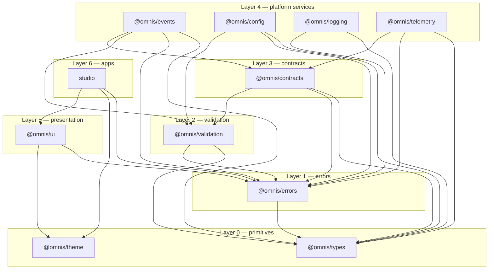

# Platform Foundation

Status: Accepted · Sprint 0 · Owners: all `packages/*`

[ARCHITECTURE.md](ARCHITECTURE.md) describes **what** OMNIS is: its domains, layers and
cross-cutting rules. This document describes **how the repository realises it** — the
packages, the dependency rules between them, the module system, and the machinery that
keeps the structure from rotting. If you are about to add a package, move a module or
change a dependency, read this first.

## 1. Design goals

1. **A change in one domain must not require understanding another.** Enforced by package
   boundaries, not by folder conventions.
2. **The foundation must be testable without infrastructure.** No database, queue,
   provider or browser is needed to run 815 tests; the in-memory bus and the no-op
   telemetry are real implementations of real interfaces, not mocks.
3. **Technology choices must be replaceable in one place.** Zod lives only in
   `@omnis/validation`; React lives only in `@omnis/ui` and `apps/studio`; no vendor SDK
   lives anywhere.
4. **Structure must be checked mechanically.** Every rule below is asserted by
   `scripts/check-workspace-health.mjs`, which runs in `pnpm verify` and in CI.

## 2. The packages

| Package             | Responsibility                                                                | Source LOC | Depends on                              |
| ------------------- | ----------------------------------------------------------------------------- | ---------- | --------------------------------------- |
| `@omnis/types`      | Branded identifiers, value types, identifier codec, vocabularies, JSON guards | 1 895      | —                                       |
| `@omnis/theme`      | Design tokens and themes as pure data                                         | 1 647      | —                                       |
| `@omnis/errors`     | 13-class error hierarchy, stable codes, redaction, serialization              | 1 341      | types                                   |
| `@omnis/validation` | The single validation door (Zod 4) → typed `ValidationError`                  | 676        | errors, types                           |
| `@omnis/contracts`  | Event envelope, commands, results, actor/tenant/execution context             | 1 120      | validation, errors, types               |
| `@omnis/events`     | Event registry, Sprint 0 definitions, payload schemas, reference bus          | 1 416      | contracts, validation, errors, types    |
| `@omnis/config`     | Schema-validated configuration, fail-fast in production                       | 517        | validation, errors, types               |
| `@omnis/logging`    | Structured, correlation-aware, redacting logging interfaces                   | 571        | errors, types                           |
| `@omnis/telemetry`  | Meters, counters, gauges, histograms, tracers, spans + no-ops                 | 648        | contracts, errors, types                |
| `@omnis/ui`         | 15 accessible React components, `ThemeProvider`, `cn`/`composeRefs`           | 3 403      | theme, errors, react                    |
| `studio`            | The operator surface (React 19 + Vite)                                        | 899        | ui, theme, errors, react, framer-motion |

## 3. Layering

Dependencies point **strictly downward**. A member may depend only on members of a lower
layer; same-layer and upward dependencies are rejected by the health checker, which makes
a cycle structurally impossible rather than merely unlikely.



Two leaves sit at layer 0: `@omnis/types` and `@omnis/theme` depend on nothing inside the
workspace, which is what allows both to be consumed by any client — web, desktop, mobile,
or a build script.

Note what the graph does **not** contain: `@omnis/telemetry` → `@omnis/logging`. A trace
and a log line are correlated by identifiers, not by a dependency; coupling them would
force every telemetry consumer to accept a logging implementation.

### Technology ownership

| Technology              | Allowed in               | Enforced by                    |
| ----------------------- | ------------------------ | ------------------------------ |
| `zod`                   | `@omnis/validation` only | health checker                 |
| `react`, `react-dom`    | `@omnis/ui`, `studio`    | health checker                 |
| `framer-motion`, `vite` | `studio`                 | health checker                 |
| vendor AI SDKs          | nowhere in Sprint 0      | review + Sprint 1 health rules |

Zod is wrapped rather than re-exported from every package: `@omnis/validation` is the only
door, so schemas are named, failures become typed `ValidationError`s, and the validation
technology can be replaced in exactly one place.

## 4. Module system

| Decision                      | Value                    | Why                                                                                                                                             |
| ----------------------------- | ------------------------ | ----------------------------------------------------------------------------------------------------------------------------------------------- |
| Module format                 | ESM only                 | One format; no dual-package hazard, no interop surprises                                                                                        |
| `module`/`moduleResolution`   | `NodeNext` for libraries | Libraries are consumed by Node and must resolve like Node                                                                                       |
| App resolution                | `Bundler` for `studio`   | Vite resolves extensionless and `.tsx`; NodeNext would fight it                                                                                 |
| Relative imports in libraries | explicit `.js` extension | Required by NodeNext at runtime; the emitted file is `.js` even though the source is `.ts`                                                      |
| Bundler for libraries         | none — plain `tsc`       | `tsup`/`rollup` add a build step, a second source of truth for types and a peer-dependency constraint, to produce output `tsc` already produces |
| `verbatimModuleSyntax`        | on                       | Type-only imports stay type-only; nothing accidental reaches runtime                                                                            |
| `erasableSyntaxOnly`          | on                       | No `enum`, no parameter properties — anything emitted must be erasable by a transpiler, which keeps esbuild/Vite compatible                     |

### Two tsconfigs per library

- `tsconfig.json` — `noEmit: true`. Used by `pnpm typecheck`, editors and CI. Includes
  tests, so test code is typechecked too.
- `tsconfig.build.json` — `noEmit: false`, `dist` output, excludes tests. Used by
  `pnpm build`.

Separating them is what allows the typecheck gate to cover test files without shipping
them, and it is why a `dist` that is stale relative to `src` cannot hide a type error.

## 5. Strictness

`tsconfig.base.json` is a ratchet: options may be added or tightened, never relaxed to
make a build pass.

```text
strict · noUncheckedIndexedAccess · noImplicitOverride · noImplicitReturns
noFallthroughCasesInSwitch · noUnusedLocals · noUnusedParameters
useUnknownInCatchVariables · isolatedModules · verbatimModuleSyntax
erasableSyntaxOnly · forceConsistentCasingInFileNames
```

`noUncheckedIndexedAccess` is the one that changes how code is written: every index access
is `T | undefined`, so a lookup must be handled rather than assumed. That is a real class
of production failure removed at compile time, and it is the reason the health checker
forbids `any`, `@ts-ignore` and `@ts-expect-error` — with those available, the option is
decorative.

## 6. Task graph

Turborepo runs `build`, `typecheck`, `test`, `lint`, `dev` and `clean`. `build`,
`typecheck`, `test` and `dev` all `dependsOn: ["^build"]`, so a package is always checked
against the **built output** of its dependencies rather than their source. Global
dependencies are `tsconfig.base.json`, `eslint.config.mjs` and `.prettierrc.json`; global
env is `NODE_ENV`, `CI`, `OMNIS_ENV`.

Practical consequence: after changing a library, run `pnpm build` before running a
downstream package's tests, or you will be testing yesterday's types.

## 7. Version discipline

Every version used by more than one member is declared once in the `catalog` of
[`pnpm-workspace.yaml`](../../pnpm-workspace.yaml) and referenced as `catalog:`; internal
dependencies use `workspace:*`. This is a direct response to the Sprint 0 audit, which
found TypeScript 6.0.3 and 7.0.2 installed side by side — a combination that breaks
`typescript-eslint`, whose peer range is `>=4.8.4 <6.1.0`. The health checker fails on any
member that pins a version directly, so skew cannot be reintroduced by one package.

Toolchain pins and the reasoning behind them:
[ADR-0001](../07-decisions/ADR-0001-monorepo-and-toolchain.md). Frontend choices:
[ADR-0004](../07-decisions/ADR-0004-frontend-stack.md).

## 8. Testing

| Layer             | Tooling                              | Scope                                                       |
| ----------------- | ------------------------------------ | ----------------------------------------------------------- |
| Platform packages | Vitest 5, Node environment           | Contracts, vocabularies, registries, redaction, state       |
| `@omnis/ui`       | Vitest + happy-dom + Testing Library | Rendered DOM, keyboard interaction, ARIA, theme consumption |
| `studio`          | Vitest + happy-dom + Testing Library | Composition of theme + UI, motion tokens, global styles     |

Tests are colocated (`src/*.test.ts`). They assert **rules**, not just happy paths: a
payload test explains why `null` is not `undefined`, a bus test explains what a failing
handler may not do to its neighbours, and vocabulary tests fail when two packages disagree
about a name. 815 tests across 11 packages, ~10 000 lines of test code.

## 9. Gates

```bash
pnpm verify      # workspace health + secret scan
pnpm lint        # eslint --max-warnings=0 (syntax-only in Sprint 0)
pnpm typecheck   # tsc, strict, includes tests
pnpm test        # 815 tests
pnpm build       # topological emit
pnpm check       # all of the above
```

The workflow for changing anything in this repository is in
[DEVELOPMENT_WORKFLOW.md](../05-implementation/DEVELOPMENT_WORKFLOW.md); the mechanics of
installing, building and debugging are in [MONOREPO.md](../05-implementation/MONOREPO.md).

## 10. Adding a package

1. Choose its layer. If it does not fit an existing layer, that is an ADR
   ([ADR-0002](../07-decisions/ADR-0002-domain-boundaries.md)).
2. Copy the manifest shape of an existing library: `private: true`, `type: "module"`,
   `main`/`types`/`exports` pointing at `dist`, the five required scripts, `catalog:`
   versions, `workspace:*` internals.
3. Add `tsconfig.json` (`noEmit: true`) and `tsconfig.build.json` (`noEmit: false`).
4. Add `src/index.ts` as the only public entry point; keep implementation modules
   unexported unless a consumer genuinely needs them.
5. Register the package in the `LAYERS` table of
   [`scripts/check-workspace-health.mjs`](../../scripts/check-workspace-health.mjs). A new
   package that is not assigned a layer fails the health gate on purpose — the layer
   assignment is the architectural decision, and it should be made explicitly.
6. Write tests before opening the pull request. A package with source and no tests fails
   the health gate.
