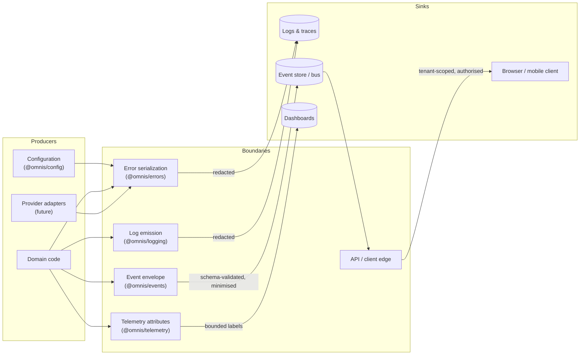

# Security Boundaries

Status: Accepted · Owners: `@omnis/errors`, `@omnis/logging`, `@omnis/config`, `@omnis/events`, `@omnis/telemetry`

OMNIS holds three things worth stealing: platform credentials (YouTube, Instagram),
model-provider keys, and audience data that is personal by nature. This document states
where those things may travel, what must happen to them at each boundary, and which
code enforces it. Every rule here is implemented and tested — a rule that is only
written down is a rule that will be broken.

## 1. The boundaries

The rule at every arrow: **secrets stop at the boundary, personal data is minimised
before it crosses, and nothing crosses without a tenant.**

## 2. Secrets

### 2.1 They never enter the repository

`pnpm verify:secrets`
([`scripts/scan-secrets.mjs`](../../scripts/scan-secrets.mjs)) scans every tracked file
for twelve credential shapes and fails the build on a match. The only sanctioned
exception is a _fictitious_ credential inside a redaction test, marked inline with
`// omnis-secret-scan:allow <reason>`; every suppression is printed in the scan report,
so the allowlist is visible rather than buried.

### 2.2 They never enter a log line, an error or an event

Redaction lives in
[`packages/errors/src/redaction.ts`](../../packages/errors/src/redaction.ts) and is
applied by the error hierarchy **before** serialization and by the logger **on emit** —
not by each call site, because a call site will eventually forget.

Detection has two independent layers, and both run on everything:

1. **Key-based.** A key is sensitive when one of its tokens is in the sensitive set
   (`token`, `secret`, `password`, `apiKey`, `authorization`, `private`, `signature`,
   `session`, `cookie`, `credential`, `pin`, `otp`, `cvv`, `ssn`, …). Tokenisation
   happens on the _original_ casing, because collapsing `privateKey` to `privatekey`
   first would match nothing and let the value through. Two exception lists keep this
   usable:
   - `BENIGN_EXACT_KEYS` — a bare `keys` is not sensitive. `ConfigurationError.keys`
     carries the _names_ of the environment variables that were missing, which is the
     only actionable content that error has; redacting it left `keys: "[REDACTED]"` on
     the wire and made the failure undiagnosable. Anything modified — `apiKeys`,
     `signingKeys`, `privateKeys` — still trips the token scan.
   - `SENSITIVE_EXACT_KEYS` — `access_token`, `refresh_token`, `id_token`,
     `client_secret`, `x-api-key` are sensitive even though their individual tokens look
     innocuous.
2. **Value-based.** Every string is tested against high-confidence credential shapes:
   PEM private-key headers, `sk-…`, `ghp_`/`gho_`/`github_pat_…`, `AKIA…`, `xox*…`,
   `AIza…`, `Bearer …`, and three-segment JWTs. This is what catches a credential pasted
   into a message under a harmless key — the common leak is a _message_, not a field.

Matched material is replaced with `[REDACTED]`, in place, recursively, to a bounded
depth (`redactSecrets(value, maxDepth = 8)`) so a cyclic or deeply nested structure
cannot turn redaction into a stack overflow or an unbounded walk. The span-based
replacement preserves surrounding text: `"request failed with key sk-… for tenant ten_1"`
becomes diagnosable without becoming a leak.

Two implementation details are load-bearing and tested: the `g`-flagged redaction regex
is built separately from the detection patterns because a shared stateful `RegExp`
advances `lastIndex` between calls and would make detection depend on how often it had
already been used; and `OmnisError.message` itself is **not** redacted at construction,
because messages are authored by OMNIS code from known-safe parts — redaction is applied
when a value of unknown provenance is serialized.

### 2.3 Configuration reports names, never values

`system.configuration.loaded` carries `keys` (the _names_ loaded) and `usedDefaults`.
Values are never included, not even redacted ones: an event is broadcast and persisted,
so a redaction bug in one place would become a leak in every subscriber. Key names alone
are enough to diagnose a missing-variable incident, which is the only reason the event
exists. `listOmnisEnvKeys` is tested to prove the value never reaches the stream.

### 2.4 Production fails closed

`@omnis/config` validates against a schema and, in `production`, a missing or invalid
variable aborts startup with a `ConfigurationError` naming the missing keys. Silent
fallback to a default in production is how a service ends up talking to the wrong
tenant's storage or publishing with the wrong credentials. Development may use
documented defaults; production may not.

## 3. Personal data

Audience Intelligence cannot work without comment text, so text is retained — but it is
the _only_ personal data retained, and the author is referenced by an opaque platform
handle (`authorRef`), never by name, email address or profile URL. The payload schema
does not merely omit those fields: unknown fields are stripped on parse, so a producer
that adds `authorEmail` cannot succeed in broadcasting it.

Recognising a returning commenter and building a loyalty tier requires a stable
reference, not an identity. Holding less personal data is both a smaller breach surface
and a smaller compliance surface.

Comment text is still sensitive in the sense that it is user-generated content: it is
tenant-scoped, it is never used as a metric label, and it never appears in an error
message (error messages are authored, not echoed — and validation failures deliberately
do not echo the rejected value, because an email address is personal data and must not be
written into a log line or an API response).

## 4. Tenancy and attribution

Every event, command, log record and span carries `tenantId` and `correlationId`. There
is no code path that produces an unattributed record; the envelope schema makes both
mandatory. Consequences:

- a record found in isolation can always be traced to a tenant and an operation;
- cross-tenant leakage is detectable, because the tenant is on the record rather than
  implied by the connection it arrived on;
- authorization is checked at the service boundary **and again** before a sensitive
  autonomous action, because the first check proves who is calling, not what this call
  may do.

## 5. Autonomous action gates

Publishing and spending are high-impact and autonomous. Two rules keep them safe:

1. **Approval is decided at creation time.** `publishing.job.created` carries
   `approvalRequired`, decided by the policy engine when the job is queued — not at
   execution time, so a retry path that bypasses the original decision cannot quietly
   publish something a human was supposed to sign off.
2. **Completion means confirmed.** `publishing.job.completed` is emitted only when the
   platform has confirmed the publication, and requires the platform's own
   `externalPublicationId`. A job that was submitted but not confirmed is not complete;
   claiming otherwise would poison analytics, audience feedback and strategy learning
   with content that does not exist.

## 6. Telemetry cardinality is a security control

Identifiers (`tenantId`, `correlationId`, `executionId`, `actorId`) are permitted as
**span attributes** and forbidden as **metric labels**. `metricAttributesFromContext`
returns only `omnis.environment`, `omnis.actor.kind` and `omnis.service`; the test suite
asserts that no identifier appears in a metric label set whatever the context holds. An
unbounded label set is a denial-of-service against the metrics backend and an accidental
publication of per-tenant activity — both are prevented structurally rather than by
review.

## 7. Client boundary

Studio is an operator surface. It receives tenant-scoped, authorised data through the
API edge; it never receives credentials, and no provider key may reach a browser bundle.
Provider access happens exclusively behind adapters on the server side. Sprint 0
contains no provider integration at all, which is the strongest form of this guarantee;
Sprint 1 introduces the provider abstraction that keeps it true as adapters are added.

## 8. Reporting

See [SECURITY.md](../../SECURITY.md) for how to report a vulnerability. A committed
credential is treated as compromised the moment it is pushed: rotate first, remove
second, and record the incident in [CHANGELOG.md](../../CHANGELOG.md).
