# OMNIS Product Specification

> **Document ID:** PROD-001
>
> **Status:** Draft — Product Foundation
>
> **Version:** 0.1.0
>
> **Audience:** Product engineers, architects, designers, operators, AI coding agents
>
> **Purpose:** Define what OMNIS is, what it must become, what it explicitly does not attempt to be, and the product concepts that constrain all later architecture and implementation work.

---

## 1. Executive Definition

OMNIS is an intelligent digital-media operating system designed to create, operate, learn from, and grow large-scale digital content businesses across social platforms.

The system combines two capabilities that are normally separated:

1. an autonomous content and media production platform;
2. a persistent Digital Human platform capable of creating and operating fictional digital influencers with coherent identities, personalities, memories, skills, relationships, behaviors, and evolving experience.

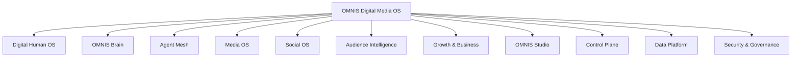

OMNIS is therefore not merely an image generator, video generator, chatbot, scheduler, social-media dashboard, or workflow automation product.

Its defining product characteristic is the integration of **persistent digital identity, intelligent agents, media production, audience feedback, learning, and business optimization into one operating system**.

---

## 2. Product Vision

The long-term vision is to provide an environment in which a human operator can define a media business objective and OMNIS can coordinate the research, creative strategy, Digital Humans, production workflows, publishing, community interaction, analytics, experimentation, and learning required to pursue that objective.

The system should progressively reduce repetitive operator work without turning the product into an uncontrollable black box.

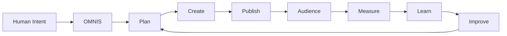

The product must preserve meaningful human control over high-impact decisions while allowing routine decisions to become increasingly automated when they have been validated.

---

## 3. Product Mission

OMNIS exists to make sophisticated digital-media operations programmable.

The mission can be expressed as:

> **Turn ideas, identities, knowledge, audience signals, and creative capabilities into continuously improving digital-media businesses.**

The system should make the following loop executable rather than merely conceptual:

```text
Observe → Understand → Decide → Create → Publish → Interact → Measure → Learn → Improve
```

---

## 4. Core Product Principles

### 4.1 Persistent identity

A Digital Human is not a prompt template.

A Digital Human is a persistent product entity with state, history, constraints, memory, preferences, skills, and relationships.

### 4.2 Continuity

The system must preserve continuity across content items.

If a character changes hairstyle, grows a beard, changes clothing style, develops a preference, learns a skill, experiences an event, or forms a relationship, later outputs should reflect the relevant state unless an explicit transition occurs.

### 4.3 Experience creates learning

A character or channel should not remain static after repeated activity.

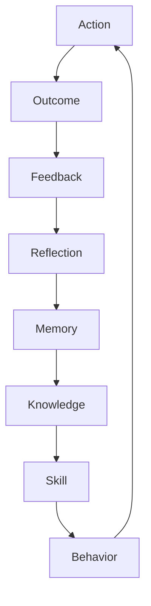

Learning must be evidence-driven. A single anomalous result should not automatically rewrite a character's identity or the global strategy.

### 4.4 Audience is a first-class input

Audience members are not simply engagement statistics.

Comments, direct messages, requests, recurring questions, viewing behavior, retention, saves, shares, and community activity are product signals that can influence future content decisions.

### 4.5 Multi-agent specialization

OMNIS should prefer specialized agents with explicit responsibilities over one unrestricted agent that performs everything.

### 4.6 Model abstraction

The product must not become permanently coupled to one AI provider.

AI capabilities should be accessed through provider-independent contracts and a model-routing layer.

### 4.7 Human-readable and machine-readable

Every major product concept must be understandable by a human engineer and sufficiently explicit for an AI coding agent to implement without guessing.

---

## 5. Product Scope

OMNIS contains the following major product surfaces:

| Surface | Primary responsibility |
|---|---|
| Digital Human OS | Create and operate persistent fictional influencers |
| OMNIS Brain | Context, reasoning, memory, knowledge and planning |
| Agent Mesh | Specialized autonomous capabilities |
| Automation Fabric | Workflows, events, queues and scheduling |
| Media OS | End-to-end content creation |
| Social OS | Platform operations and community interaction |
| Audience Intelligence | Understand audience demand and behavior |
| Growth & Business | Optimize reach, experimentation and revenue |
| AI Model Platform | Route tasks to appropriate AI models |
| Control Plane | Identity, permissions, configuration and governance |
| Data Platform | Persistent state and analytics |
| Security & Governance | Safety, rights, privacy and audit |
| Infrastructure | Runtime and scaling |
| Observability | Operational and AI-system visibility |
| OMNIS Studio | Human command center |

---

## 6. Product Entity Model

The following entities form the conceptual backbone of the product.

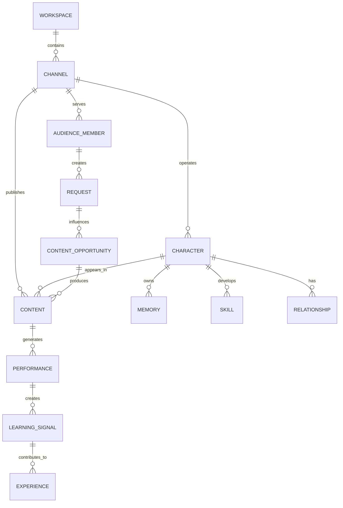

These are product-level concepts. Their concrete persistence models belong in the Data documentation.

---

## 7. Workspace

A Workspace is the top-level operational boundary for an OMNIS installation or tenant.

It contains configuration, channels, characters, integrations, policies, budgets, users, agents, and data-access boundaries.

A Workspace may operate one channel or many channels.

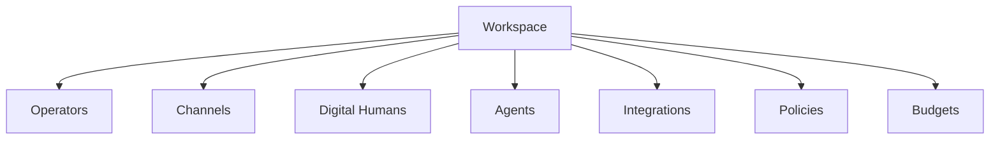

---

## 8. Channel

A Channel is a persistent media identity operating on one or more social platforms around a coherent audience and content strategy.

Examples include a gaming channel, automotive channel, fashion channel, educational channel, commentary channel, or fictional entertainment personality.

A channel owns strategy and publishing context.

A channel may use one Digital Human, multiple Digital Humans, or no Digital Human at all.

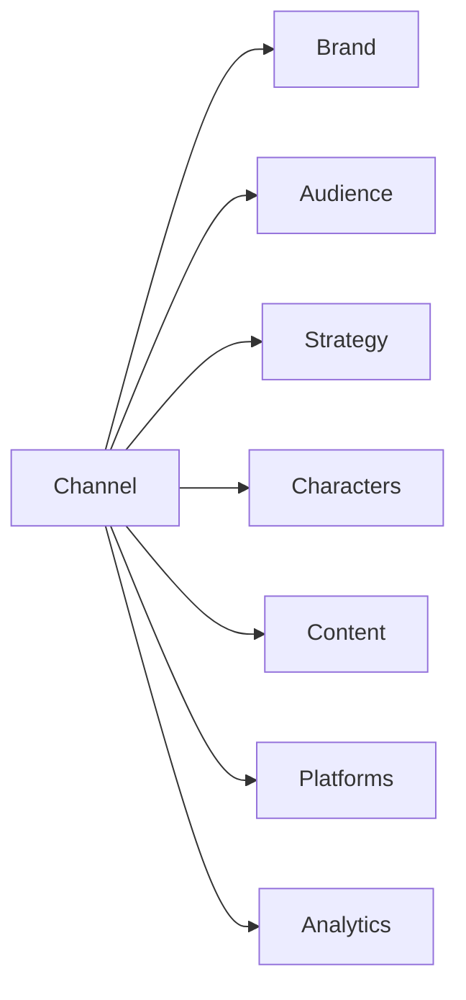

---

## 9. Digital Human

A Digital Human is a persistent fictional person represented by structured identity and state rather than a single prompt.

The product requirement is **coherence**, not merely visual realism.

A high-quality Digital Human should maintain consistency across:

- face;
- body characteristics;
- voice;
- speech style;
- personality;
- preferences;
- habits;
- relationships;
- clothing history;
- hair state;
- facial-hair state;
- knowledge;
- skills;
- memories;
- goals;
- emotional tendencies;
- experience;
- content history.

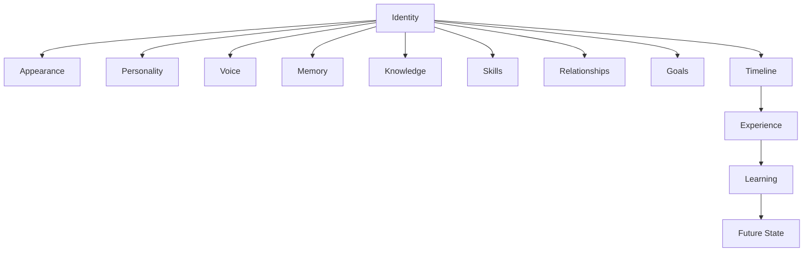

---

## 10. Digital Human Realism

OMNIS should produce fictional characters that can behave consistently enough to feel like persistent personalities to their audiences.

This does not mean that the product should falsely claim that a fictional character is a real human being.

The product must distinguish **high-fidelity fictional identity** from deceptive real-person impersonation.

The identity and governance system must therefore preserve provenance and policy state while the creative system focuses on realism and continuity.

---

## 11. Character Personality

Personality is represented as a structured collection of traits, tendencies, preferences, behavioral rules, habits, values, fears, motivations, and contextual responses.

A personality should contain both strengths and weaknesses.

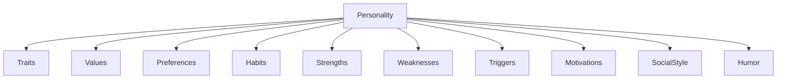

A character should not behave identically in every context.

The personality system should allow contextual modulation while preserving stable identity traits.

---

## 12. Character Imperfection

Human-like behavior requires controlled imperfection.

Possible examples include:

- occasional tiredness;
- temporary voice changes;
- seasonal changes;
- minor preferences;
- hesitation;
- changing enthusiasm;
- small mistakes;
- temporary illness-like states when appropriate and governed;
- changing fashion preferences;
- learning from failed attempts;
- occasional disagreement with audience assumptions.

These are product requirements for believable continuity, not instructions to fabricate medical claims about real people.

The implementation must distinguish fictional state from factual health claims.

---

## 13. Appearance Continuity

Appearance is temporal state.

It must not be regenerated independently for every video.

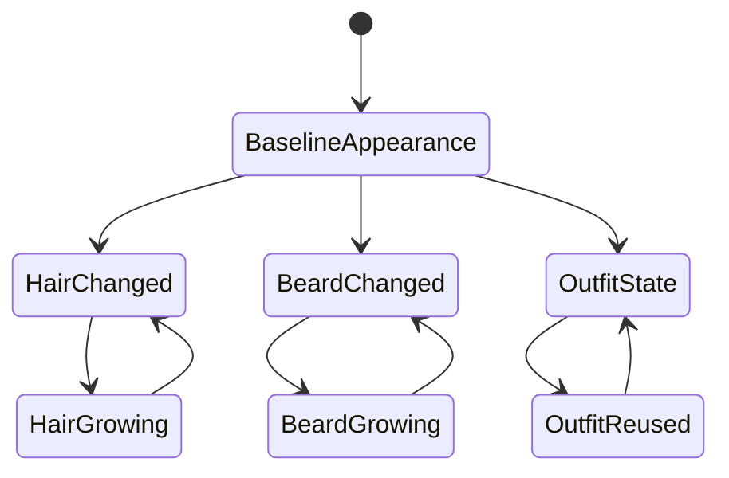

The product should model physical and stylistic changes with timestamps and transitions.

---

## 14. Wardrobe Intelligence

Wardrobe selection must balance continuity, freshness, context, weather, season, content topic, character preferences, and reuse.

The system must not make every appearance completely new.

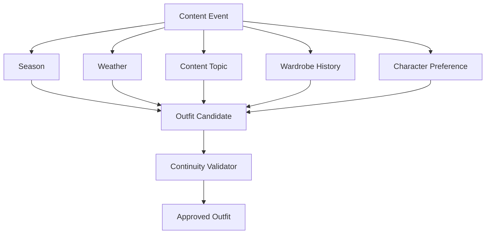

A clothing item should be reusable across multiple appearances while combinations can vary.

---

## 15. Hair and Facial Hair Continuity

Hair, hair color, beard, and moustache are persistent character state.

For example, if a character cuts a beard today, the next generated scene must not show a full beard unless a temporal transition explains it.

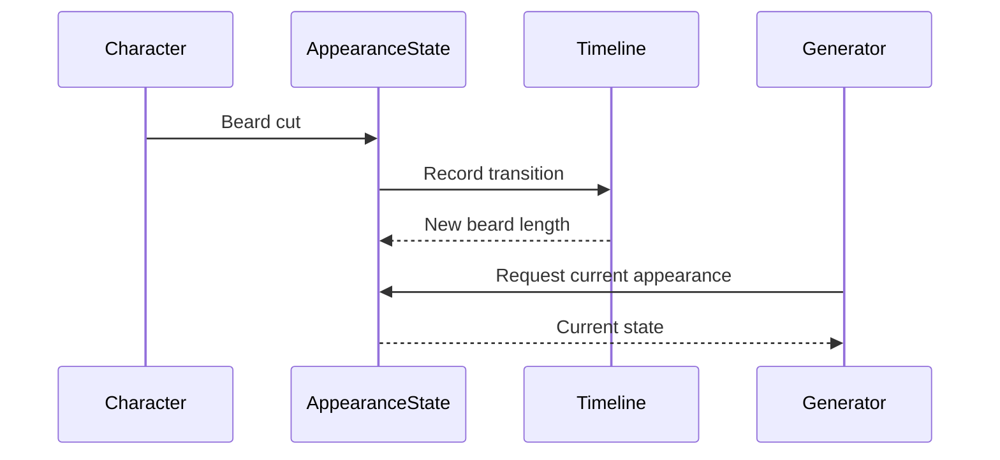

The same principle applies to hair dye, hair length, styling, and other persistent visual characteristics.

---

## 16. Voice Identity

A Digital Human's voice is a persistent identity capability.

The system must model:

- voice identity;
- speaking style;
- cadence;
- vocabulary;
- accent/style constraints;
- emotional expression;
- context-dependent energy;
- temporary permitted variations;
- pronunciation preferences.

Voice output must remain consistent with character identity.

---

## 17. Character Knowledge

Knowledge is domain-specific and probabilistic in practical operation.

A gaming influencer should have strong knowledge of games and gaming culture.

A car influencer should have strong automotive knowledge.

A character covering a historical game may use supporting historical knowledge without becoming a professional historian.

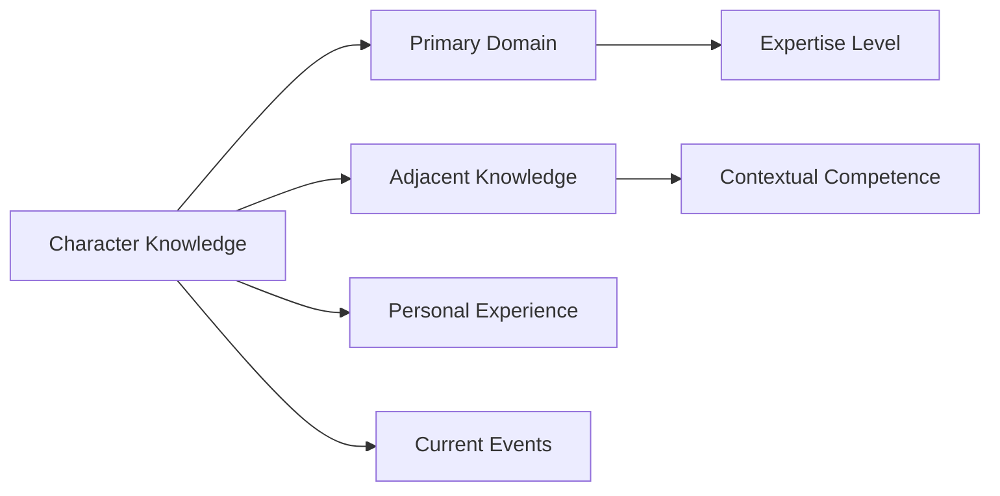

Knowledge must have provenance and freshness metadata when factual accuracy matters.

---

## 18. Character Skills

Skills differ from knowledge.

Knowledge describes what a character knows.

Skills describe what the character can consistently do.

Examples:

- gameplay;
- storytelling;
- interviewing;
- product presentation;
- cooking;
- photography;
- editing;
- comedic timing;
- analysis;
- improvisation.

Skills should have levels, evidence, confidence, and learning history.

---

## 19. Experience

Experience is generated by interactions between a character and its environment.

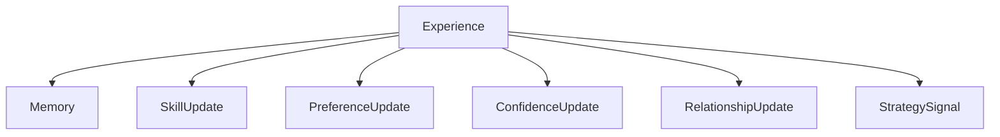

Not every experience should permanently alter identity.

The learning engine must determine whether an observation is:

- transient;
- repeated;
- meaningful;
- contradictory;
- identity-relevant;
- skill-relevant;
- channel-level;
- globally reusable.

---

## 20. Audience Interaction

Audience interaction is a core product capability.

OMNIS should process:

- comments;
- direct messages;
- community posts;
- requests;
- questions;
- feedback;
- recurring complaints;
- praise;
- topic demand;
- suggestions.

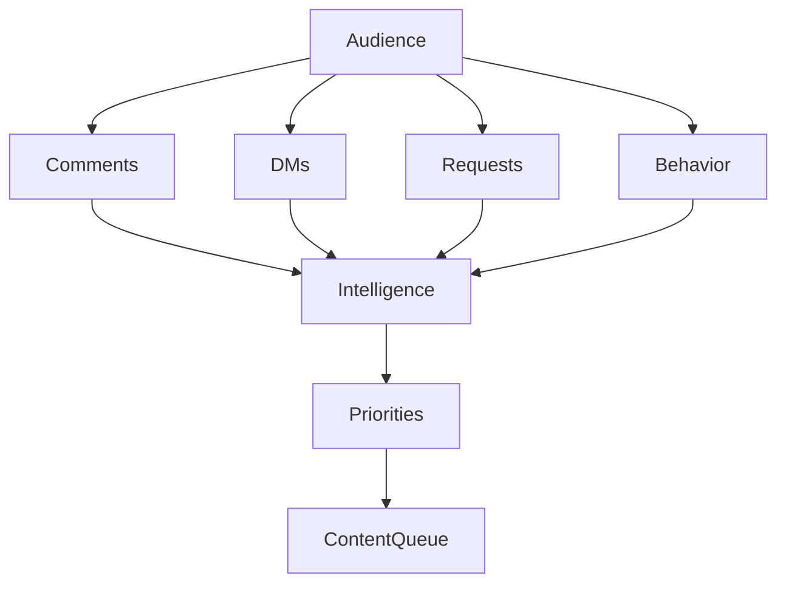

The system should identify repeated demand rather than treating every individual request as equally important.

---

## 21. Audience Request Queue

Audience requests can become content opportunities.

A request may be:

- ignored;
- answered directly;
- grouped with similar requests;
- added to a research queue;
- converted into a short;
- converted into a long-form video;
- converted into a playlist;
- converted into a recurring series;
- escalated to a human operator.

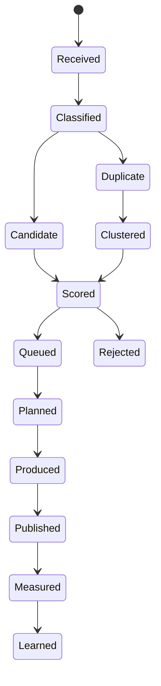

---

## 22. Content Production

The product content pipeline is:

```text
Discovery
→ Research
→ Opportunity
→ Strategy
→ Brief
→ Script
→ Storyboard
→ Voice
→ Visuals
→ Video
→ Editing
→ QA
→ Thumbnail
→ SEO
→ Publish
→ Distribution
→ Analytics
→ Learning
```

Each stage should be independently observable and replaceable.

---

## 23. Content Types

OMNIS should support multiple content formats:

| Format | Examples |
|---|---|
| Long-form video | Documentary, review, tutorial |
| Short-form video | Shorts, Reels, clips |
| Image | Posts, carousels |
| Text | Captions, community posts |
| Live | Streams and live sessions |
| Audio | Podcast-like content |
| Playlist | Curated thematic series |
| Interactive | Polls, Q&A, community activities |

---

## 24. Research

Research should discover:

- emerging topics;
- evergreen topics;
- audience questions;
- competitor activity;
- platform trends;
- relevant news;
- factual sources;
- domain knowledge;
- historical context.

Research results must carry source and freshness metadata when appropriate.

---

## 25. Content Opportunity

An opportunity is a scored hypothesis that content can produce value.

Potential dimensions include:

- audience demand;
- novelty;
- relevance;
- expected retention;
- production cost;
- competitive pressure;
- monetization potential;
- character fit;
- channel fit;
- timing.

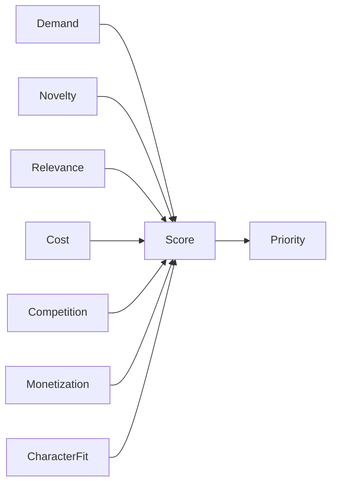

---

## 26. Publishing

Publishing must be treated as a controlled operation rather than a simple API call.

The system must consider:

- platform;
- account;
- content state;
- title;
- description;
- tags where relevant;
- thumbnail;
- schedule;
- audience context;
- policy checks;
- disclosure requirements;
- retry behavior.

---

## 27. Analytics

Analytics should measure both content performance and system performance.

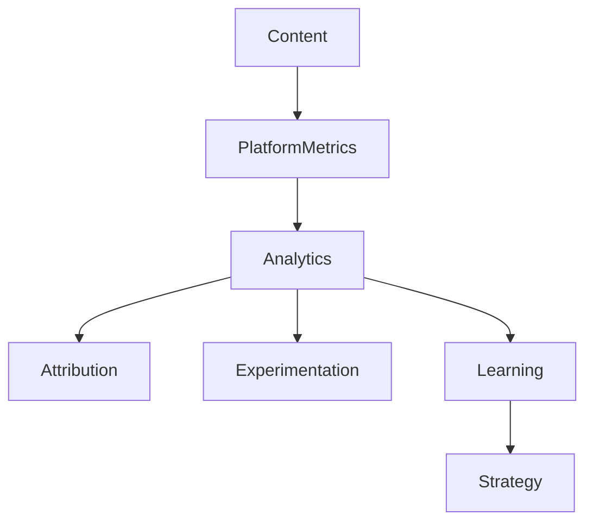

Metrics may include:

- impressions;
- click-through rate;
- views;
- average view duration;
- retention;
- completion;
- engagement;
- subscribers/followers gained;
- revenue;
- conversion;
- audience sentiment.

---

## 28. Growth

Growth is not synonymous with maximizing views.

The system should optimize toward declared business objectives.

Possible objectives include:

- audience growth;
- watch time;
- community quality;
- revenue;
- sponsorship value;
- product sales;
- memberships;
- brand development.

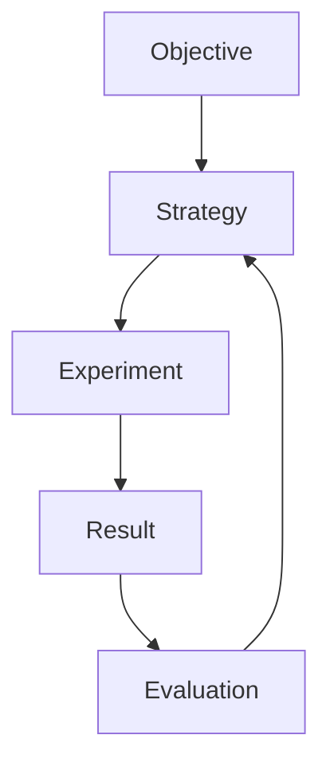

---

## 29. Business Model

OMNIS should support multiple revenue pathways rather than assuming advertising is the only source of revenue.

Potential mechanisms include:

- advertising;
- sponsorships;
- affiliate revenue;
- memberships;
- digital products;
- physical products;
- licensing;
- services;
- subscriptions;
- partnerships.

Business features must remain subject to applicable platform rules and legal constraints.

---

## 30. Human-in-the-loop

Autonomy is configurable.

Operations should support levels such as:

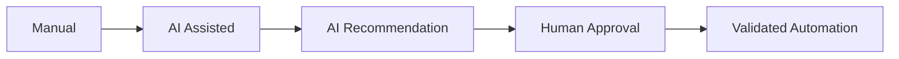

A Workspace can define which operations require approval.

Examples of higher-control operations include publishing sensitive material, financial changes, external communications with material consequences, identity changes, or policy exceptions.

---

## 31. Agent Product Model

An Agent is a bounded software intelligence component with explicit capabilities and permissions.

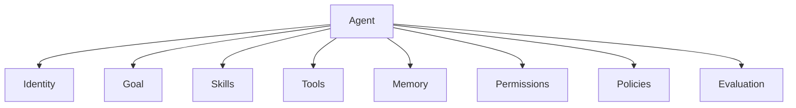

An Agent should have a clear purpose and should not receive unrestricted access by default.

---

## 32. Agent Specialization

Potential specialized agents include:

- Character Appearance Agent;
- Wardrobe Agent;
- Hair Agent;
- Facial Hair Agent;
- Voice Agent;
- Personality Agent;
- Research Agent;
- Trend Agent;
- Script Agent;
- Storyboard Agent;
- Production Agent;
- Editing Agent;
- Thumbnail Agent;
- SEO Agent;
- Publishing Agent;
- Community Agent;
- Comment Intelligence Agent;
- DM Intelligence Agent;
- Audience Demand Agent;
- Analytics Agent;
- Growth Agent;
- Learning Agent;
- Quality Agent;
- Governance Agent.

This is a product capability inventory, not a requirement to create every agent as a separate microservice.

---

## 33. OMNIS Brain

The Brain coordinates context, reasoning, planning, memory retrieval, knowledge, and model selection.

```mermaid
flowchart TD
    Request --> Context
    Context --> Memory
    Context --> Knowledge
    Context --> State
    Memory --> Reasoning
    Knowledge --> Reasoning
    State --> Reasoning
    Reasoning --> Plan
    Plan --> Agents
    Agents --> Result
```

The Brain should not own every domain behavior. Domain ownership remains with domain services and contracts.

---

## 34. Memory

Memory exists at multiple levels.

```mermaid
flowchart TD
    Event --> Working
    Event --> Episodic
    Event --> Semantic
    Event --> Procedural
    Event --> Relationship
    Working --> Decision
    Episodic --> Learning
    Semantic --> Knowledge
    Procedural --> Skill
    Relationship --> SocialState
```

The memory architecture must support retention policies, provenance, confidence, relevance, privacy, and deletion.

---

## 35. Knowledge

Knowledge must be separated from generated speculation.

The system should track:

- source;
- timestamp;
- confidence;
- domain;
- freshness;
- contradictions;
- applicability.

For high-stakes factual claims, provenance and validation requirements must be stricter.

---

## 36. Learning System

Learning operates at several scopes.

```mermaid
flowchart TD
    CharacterExperience --> CharacterLearning
    ChannelExperience --> ChannelLearning
    WorkspaceExperience --> WorkspaceLearning
    GlobalExperience --> GlobalLearning
    CharacterLearning --> CharacterBehavior
    ChannelLearning --> ChannelStrategy
    WorkspaceLearning --> WorkspaceOptimization
    GlobalLearning --> OMNISCapabilities
```

Global learning must not leak private tenant information across Workspace boundaries.

---

## 37. Evaluation

AI outputs must be evaluated rather than assumed correct.

Evaluation may consider:

- factual quality;
- visual continuity;
- voice consistency;
- character consistency;
- policy compliance;
- audience fit;
- production quality;
- cost;
- latency.

```mermaid
flowchart TD
    Output --> AutomatedChecks
    AutomatedChecks --> HumanReview
    HumanReview --> Score
    Score --> Accept
    Score --> Revise
    Score --> Reject
    Revise --> Output
```

---

## 38. Safety and Governance

OMNIS must support highly realistic fictional characters without providing an unrestricted system for impersonating real individuals.

The governance layer should distinguish:

- fictional character identity;
- licensed identity;
- user-owned identity;
- third-party identity;
- public figure references;
- prohibited impersonation.

The system should retain provenance and authorization information for identity-sensitive assets.

---

## 39. Privacy

Audience and operational data may contain sensitive information.

The product must support:

- data minimization;
- access controls;
- retention policies;
- deletion workflows;
- audit trails;
- tenant isolation.

Privacy architecture belongs to the Security and Data specifications.

---

## 40. Observability

Every important automated operation should produce enough telemetry to answer:

1. What happened?
2. Why did it happen?
3. Which agent or service acted?
4. Which model was used?
5. Which data influenced the decision?
6. What did it cost?
7. What was the result?
8. Was it accepted or rejected?

```mermaid
flowchart LR
    Operation --> Logs
    Operation --> Metrics
    Operation --> Trace
    Operation --> Cost
    Operation --> Evaluation
```

---

## 41. OMNIS Studio

OMNIS Studio is the human command center.

It should expose system state without forcing operators to understand every internal service.

Primary areas:

```mermaid
flowchart TD
    Studio --> Dashboard
    Studio --> CharacterStudio
    Studio --> ContentStudio
    Studio --> AgentCenter
    Studio --> AudienceCenter
    Studio --> Analytics
    Studio --> Business
    Studio --> Settings
```

The Studio must support both high-level orchestration and deep inspection.

---

## 42. Character Studio

Character Studio should allow operators to create and inspect Digital Humans.

Core capabilities include:

- identity creation;
- appearance configuration;
- personality configuration;
- voice configuration;
- knowledge domains;
- skill profiles;
- memory inspection;
- relationship graph;
- timeline;
- wardrobe history;
- hair and facial-hair state;
- generated media preview;
- behavior simulation;
- evaluation.

---

## 43. Content Studio

Content Studio should allow operators to inspect the entire content lifecycle.

```mermaid
flowchart LR
    Idea --> Research
    Research --> Brief
    Brief --> Script
    Script --> Production
    Production --> Review
    Review --> Schedule
    Schedule --> Publish
    Publish --> Analytics
```

The interface should support manual overrides without destroying automated state.

---

## 44. Audience Center

Audience Center should expose demand and community intelligence.

Examples:

- top requests;
- unanswered questions;
- recurring topics;
- loyal members;
- sentiment trends;
- content opportunities;
- request-to-content conversion;
- audience clusters.

---

## 45. Agent Center

Agent Center should provide:

- agent inventory;
- health;
- current tasks;
- queues;
- permissions;
- memory usage;
- cost;
- failures;
- evaluations;
- autonomy level.

```mermaid
flowchart TD
    AgentCenter --> Registry
    AgentCenter --> Tasks
    AgentCenter --> Permissions
    AgentCenter --> Evaluation
    AgentCenter --> Costs
    AgentCenter --> Failures
```

---

## 46. Automation Model

OMNIS should support event-driven automation.

```mermaid
sequenceDiagram
    participant Platform
    participant EventBus
    participant AudienceAgent
    participant OpportunityEngine
    participant ContentQueue
    participant Production

    Platform->>EventBus: New comment/request
    EventBus->>AudienceAgent: Analyze
    AudienceAgent->>OpportunityEngine: Demand signal
    OpportunityEngine->>ContentQueue: Create opportunity
    ContentQueue->>Production: Schedule production
```

This enables the system to respond to audience demand without requiring an operator to manually copy requests into a production spreadsheet.

---

## 47. Platform Abstraction

Social platforms must be accessed through adapters.

```mermaid
flowchart TD
    SocialOS --> AdapterContract
    AdapterContract --> YouTube
    AdapterContract --> Instagram
    AdapterContract --> TikTok
    AdapterContract --> X
    AdapterContract --> Reddit
```

Platform-specific behavior belongs inside adapters or platform-specific modules rather than leaking throughout the core domain.

---

## 48. AI Model Abstraction

AI providers must be replaceable.

```mermaid
flowchart TD
    Task --> ModelRouter
    ModelRouter --> LLM
    ModelRouter --> Vision
    ModelRouter --> Image
    ModelRouter --> Video
    ModelRouter --> Voice
    ModelRouter --> Embedding
```

Routing may consider quality, cost, latency, context requirements, availability, and policy.

---

## 49. Product Non-Goals

OMNIS is not intended to:

1. guarantee viral performance;
2. guarantee revenue;
3. replace every human creative decision;
4. impersonate real individuals without authorization;
5. bypass platform policies;
6. treat generated content as automatically factual;
7. hide uncertainty from operators;
8. make irreversible high-impact decisions without appropriate controls.

---

## 50. Product Success Criteria

Success should be evaluated at multiple levels.

### Platform success

- reliable automation;
- low operational friction;
- scalable agent execution;
- observable workflows;
- controlled cost.

### Creative success

- coherent characters;
- high-quality media;
- strong content consistency;
- efficient production.

### Audience success

- useful interactions;
- growing loyalty;
- strong content-market fit;
- high-quality community signals.

### Business success

- sustainable audience growth;
- diversified revenue;
- improving unit economics;
- measurable return on automation.

---

## 51. Product Evolution

OMNIS should be designed to grow from one Workspace to many Workspaces, from a small number of characters to hundreds or thousands, and from one platform to multiple platforms.

```mermaid
flowchart LR
    Prototype --> SingleWorkspace
    SingleWorkspace --> MultiChannel
    MultiChannel --> MultiCharacter
    MultiCharacter --> MultiPlatform
    MultiPlatform --> MultiWorkspace
    MultiWorkspace --> MediaNetwork
```

Scaling must preserve isolation, observability, governance, and cost control.

---

## 52. Architectural Consequence

The product specification implies that OMNIS must be:

- modular;
- event-driven;
- stateful;
- observable;
- contract-first;
- provider-agnostic;
- multi-tenant capable;
- security-aware;
- evaluation-driven;
- learning-capable.

These are product-derived constraints and will be formalized in the Architecture specification.

---

## 53. Open Product Questions

The following questions remain intentionally open until their corresponding design documents are completed:

| ID | Question | Owner document |
|---|---|---|
| PROD-Q001 | Exact autonomy levels and approval policy? | Control Plane |
| PROD-Q002 | Exact Digital Human state schema? | Digital Human OS |
| PROD-Q003 | Exact learning promotion rules? | AI / Learning |
| PROD-Q004 | Exact cross-tenant learning boundaries? | Data / Security |
| PROD-Q005 | Exact platform capability matrix? | Social OS |
| PROD-Q006 | Exact monetization accounting model? | Growth & Business |
| PROD-Q007 | Exact model-routing policy? | AI Platform |

Open questions are not implementation permissions. They must remain explicit until resolved.

---

## 54. Product Contract for AI Agents

An AI implementation agent must treat this document as the product-level source of truth.

Before implementing a feature, it must determine:

```mermaid
flowchart TD
    FeatureRequest --> ProductSpec
    ProductSpec --> Domain
    Domain --> Contract
    Contract --> ADR
    ADR --> Implementation
    Implementation --> Tests
    Tests --> Documentation
```

If the requested feature conflicts with this specification, the agent must identify the conflict rather than silently changing the product definition.

---

## 55. Final Product Statement

OMNIS is a programmable operating system for digital-media businesses.

Its unique product proposition is the combination of:

```text
Persistent Digital Humans
        +
Specialized Agent Intelligence
        +
Content Production
        +
Social Operations
        +
Audience Intelligence
        +
Continuous Learning
        +
Growth Optimization
        +
Business Automation
        +
Human Governance
```

The product is successful when these components operate as one coherent system rather than as a collection of unrelated AI tools.

---

## 56. Change History

| Version | Status | Change |
|---|---|---|
| 0.1.0 | Draft | Initial comprehensive product specification |

---

## 57. Next Specification Dependencies

After this document reaches `Accepted`, the next product-to-engineering specifications are:

1. `02-architecture/OMNIS_ARCHITECTURE.md`
2. `03-domains/DIGITAL_HUMAN_OS.md`
3. `03-domains/AGENT_MESH.md`
4. `03-domains/MEDIA_OS.md`
5. `03-domains/SOCIAL_OS.md`
6. `03-domains/AUDIENCE_INTELLIGENCE.md`
7. `04-contracts/DOMAIN_CONTRACTS.md`
8. `05-data/OMNIS_DATA_ARCHITECTURE.md`

These documents must refine the product specification rather than contradict it without an accepted ADR.
