# OMNIS Architecture

> **Document ID:** ARCH-001
>
> **Status:** Draft — Architecture Foundation
>
> **Version:** 0.1.0
>
> **Audience:** Architects, senior engineers, DevOps, security engineers, AI coding agents, technical operators
>
> **Depends on:** `docs/00-foundation/*`, `docs/01-product/OMNIS_PRODUCT_SPECIFICATION.md`

---

## 1. Architectural Mission

OMNIS is architected as a programmable digital-media operating system rather than a monolithic content generator.

The architecture must support persistent Digital Humans, specialized agents, media generation, social-platform operations, audience intelligence, continuous learning, business optimization, and human governance while remaining observable and replaceable at the component level.

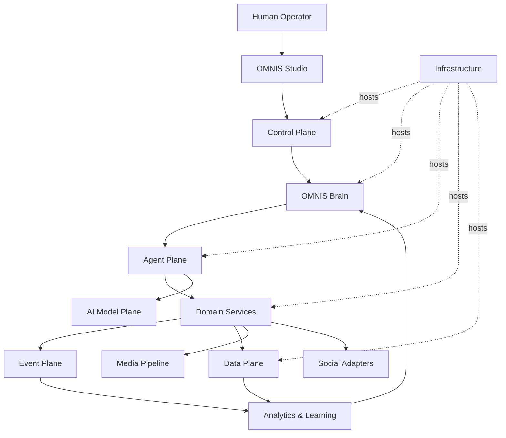

---

## 2. Architecture Principles

### 2.1 Domain ownership

Business behavior belongs to an explicit domain. Shared infrastructure must not become the hidden owner of business rules.

### 2.2 Contract-first integration

Cross-domain interactions use versioned contracts.

### 2.3 Event-driven where useful

Long-running, asynchronous, retryable, or fan-out operations should use events and queues rather than synchronous request chains.

### 2.4 Synchronous where necessary

Not every operation requires an event. Low-latency request/response interactions may remain synchronous when that simplifies the system without creating unacceptable coupling.

### 2.5 Provider independence

AI providers, media providers, and social platforms are integrations, not the core domain.

### 2.6 Explicit state

Persistent entities must have explicit state transitions. Important state cannot live only inside prompts or transient model context.

### 2.7 Observable autonomy

Autonomous execution must produce traceable decisions, tool calls, outputs, costs, and outcomes.

### 2.8 Least privilege

Agents receive only the tools and data required for their assigned capability.

### 2.9 Replaceability

A model, provider, agent implementation, queue, database component, or media engine should be replaceable behind a stable contract whenever practical.

### 2.10 Progressive autonomy

A capability may move from manual operation to recommendation to approved automation to validated autonomous operation based on evidence.

---

## 3. System Context

OMNIS sits between human intent, AI capabilities, digital-media production systems, external platforms, and audience feedback.

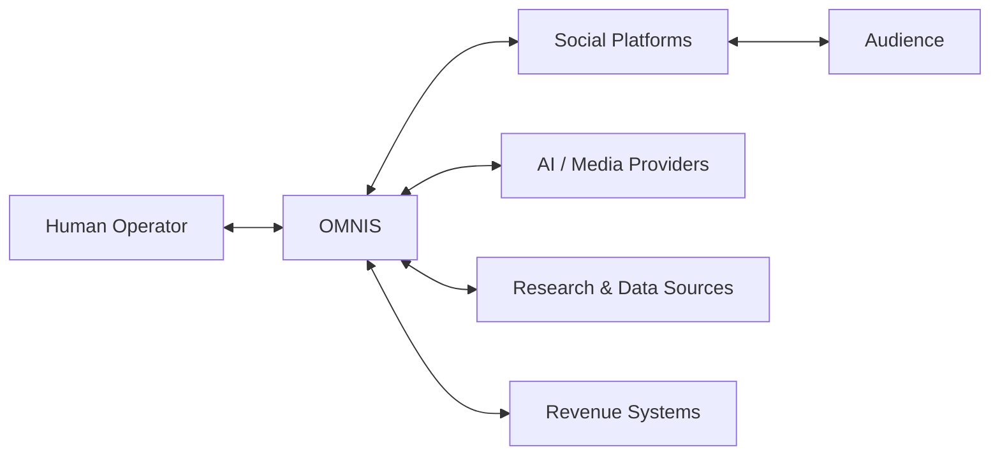

External systems must be isolated behind adapters and integration contracts.

---

## 4. Logical Planes

OMNIS is divided into logical planes. A plane is an architectural responsibility boundary, not necessarily a deployment boundary.

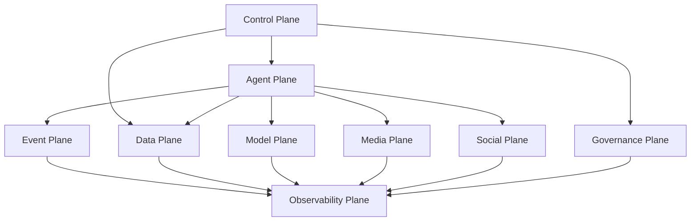

---

## 5. Control Plane

The Control Plane manages system configuration, identity, permissions, policies, workspace boundaries, agent registration, integration configuration, budgets, and operational controls.

It should not execute all media production work itself.

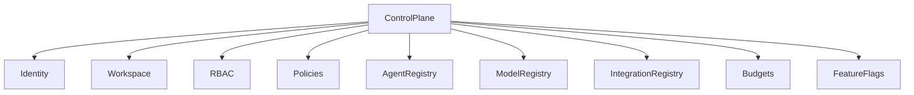

---

## 6. Agent Plane

The Agent Plane executes bounded intelligence capabilities.

An agent consists conceptually of:

```text
Identity
+ Goal
+ Instructions
+ Capabilities
+ Tools
+ Permissions
+ Memory Access
+ Policies
+ Runtime
+ Evaluation
+ Cost Controls
```

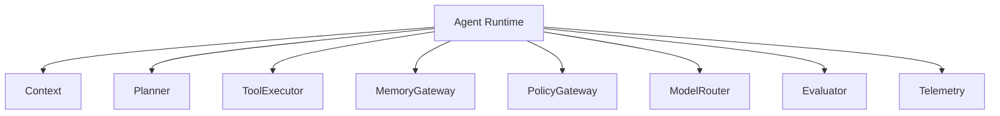

---

## 7. Domain Plane

Core product domains contain persistent business behavior.

Initial domain inventory:

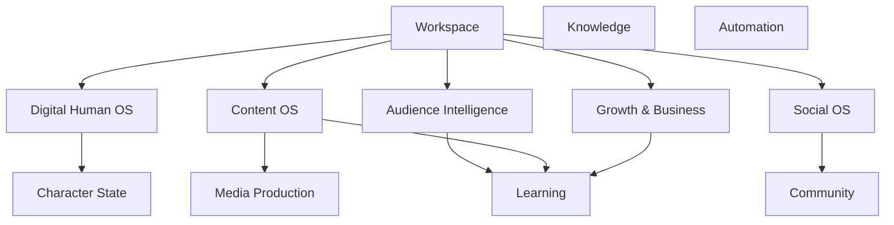

The final domain boundaries are refined in the Domain specifications.

---

## 8. Digital Human Architecture

The Digital Human system is stateful and temporal.

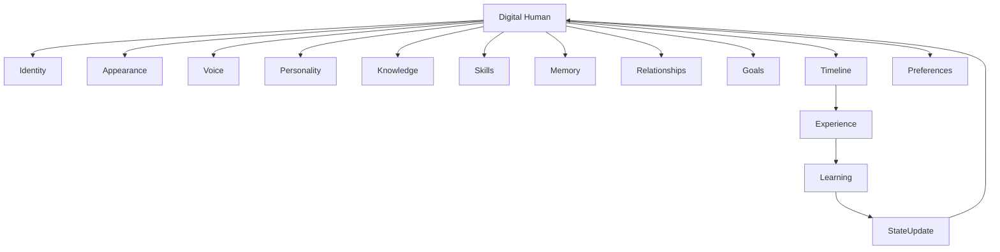

A generated image or video is an output of Digital Human state; it is not the authoritative source of identity.

---

## 9. Character State Authority

The architecture must maintain a canonical Character State service or domain repository.

Generators query the current state rather than independently inventing character attributes.

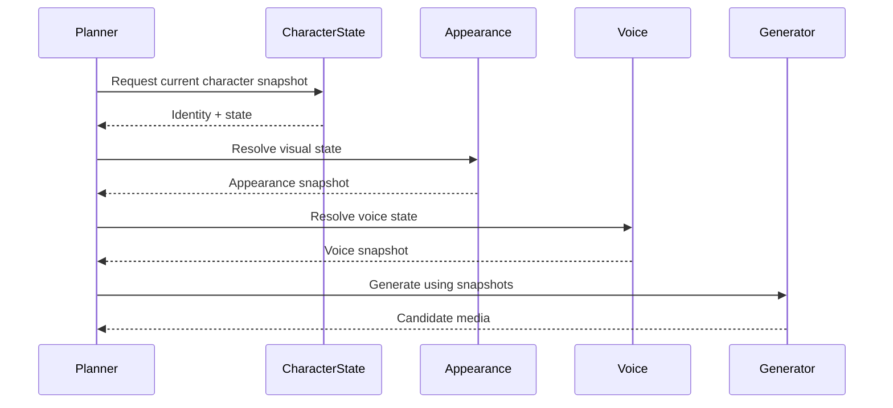

---

## 10. Temporal Consistency

Temporal consistency is a first-class architectural requirement.

Character state changes are represented as events or versioned transitions.


Media generation must query the state valid for the content's intended publication or scene timestamp.

---

## 11. Content Architecture

Content is treated as a lifecycle entity.

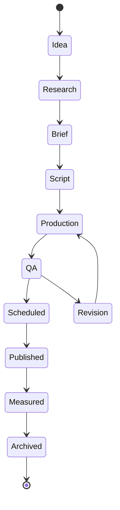

Every transition should have explicit ownership and validation rules.

---

## 12. Media Pipeline

The Media Plane handles expensive and asynchronous generation operations.

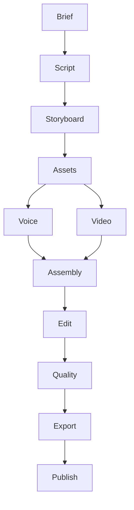

Individual stages should be independently retryable when possible.

---

## 13. Media Artifact Model

Generated media should be immutable artifacts identified by content hashes or stable artifact IDs.

Derived versions should reference their parents.

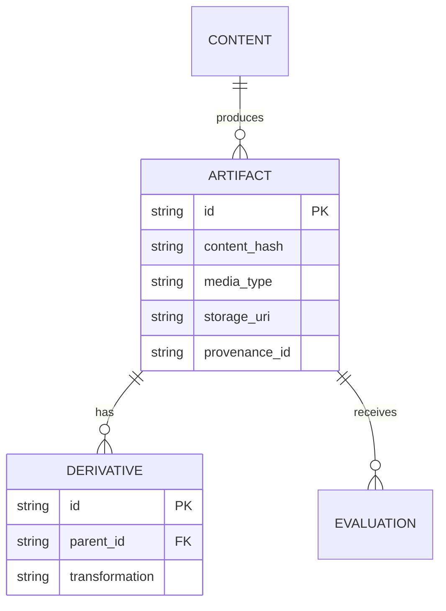

---

## 14. Social Plane

The Social Plane isolates platform-specific operations.

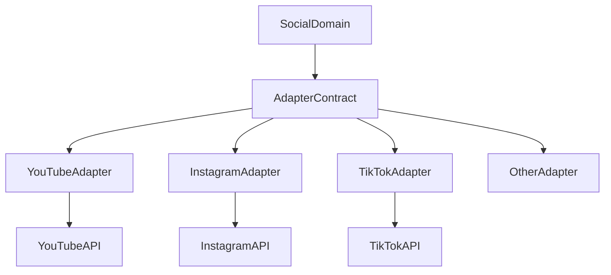

The core domain should not contain provider-specific request formats.

---

## 15. Audience Intelligence

Audience signals enter OMNIS through multiple channels.

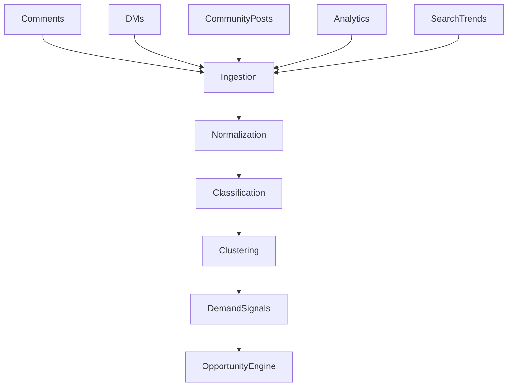

---

## 16. Audience Request Lifecycle

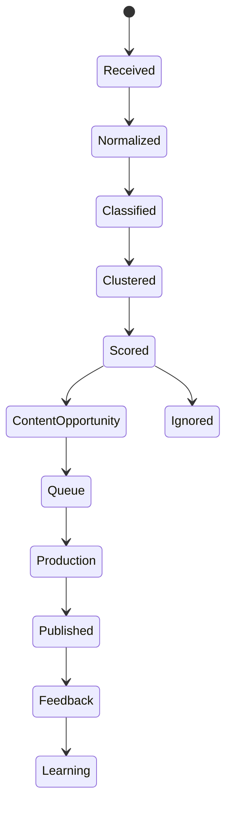

The system should aggregate repeated requests to prevent one highly active individual from dominating the queue unless configured otherwise.

---

## 17. Event Plane

The Event Plane provides asynchronous communication.

Typical event categories include:

- content lifecycle events;
- audience events;
- character state events;
- agent task events;
- publishing events;
- analytics events;
- learning events;
- governance events.

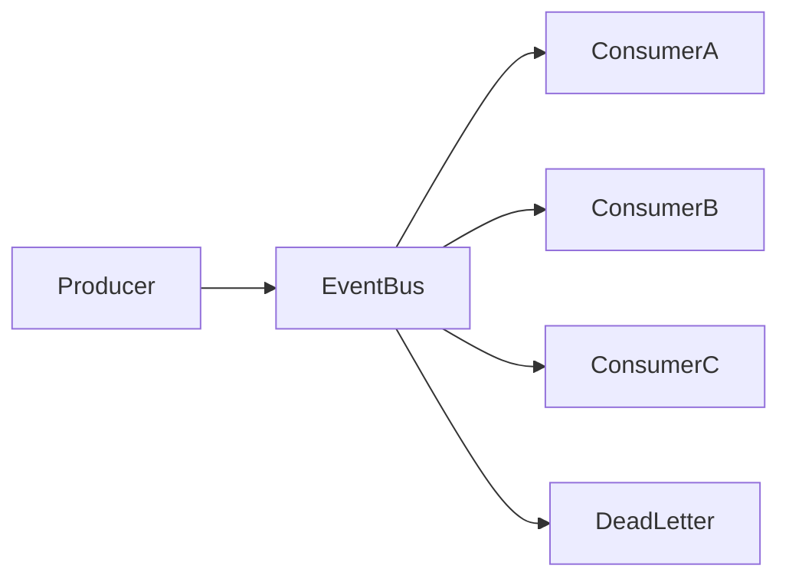

Events must be versioned and carry correlation information.

---

## 18. Event Envelope

A canonical event envelope should contain at least:

```json
{
  "event_id": "unique-id",
  "event_type": "domain.event",
  "event_version": 1,
  "occurred_at": "timestamp",
  "workspace_id": "workspace",
  "correlation_id": "correlation",
  "causation_id": "cause",
  "producer": "service",
  "payload": {}
}
```

Exact schemas belong in the Contracts documentation.

---

## 19. Data Plane

The Data Plane persists authoritative state and analytical data.

It should distinguish operational state from derived analytics.

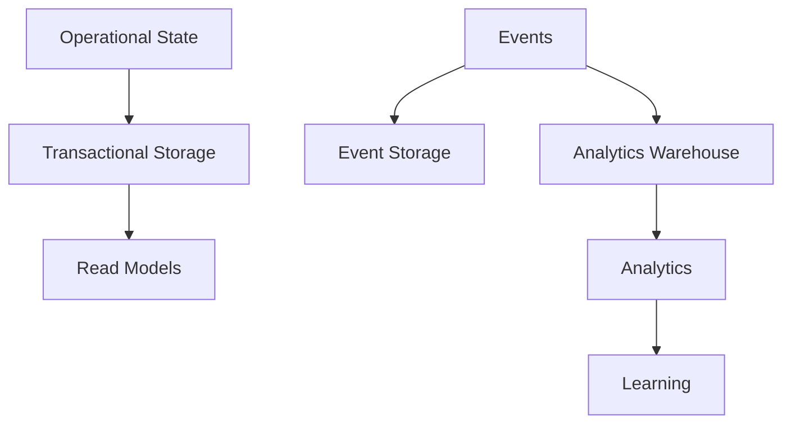

---

## 20. Data Categories

The architecture anticipates at least:

| Category | Examples |
|---|---|
| Identity | users, workspaces, characters |
| Operational | jobs, queues, content state |
| Temporal | character state transitions |
| Memory | episodic, semantic, procedural |
| Media | artifact metadata |
| Audience | comments, requests, relationships |
| Analytics | metrics, experiments |
| Governance | approvals, policies, audit |
| Billing | usage, cost, revenue |
| Observability | logs, traces, metrics |

---

## 21. Memory Architecture

Memory is not a single database table.

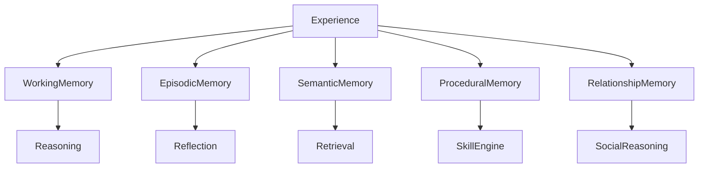

Memory access must be permission-aware and scoped to the relevant Workspace and Character.

---

## 22. Knowledge Architecture

Knowledge retrieval should be separated from free-form model generation.

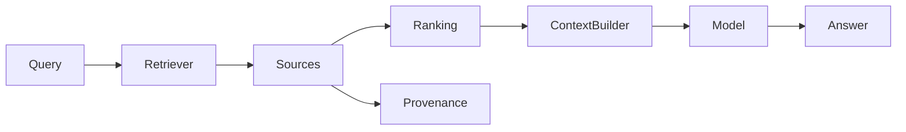

For factual tasks, provenance should remain available for validation and auditing.

---

## 23. AI Model Plane

The Model Plane abstracts providers and capabilities.

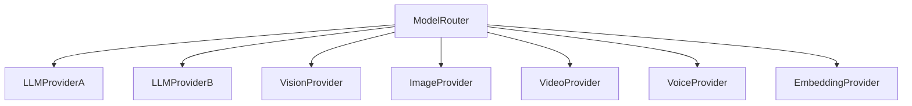

The router should consider:

- capability;
- quality;
- latency;
- cost;
- context size;
- availability;
- policy;
- workload priority.

---

## 24. Model Routing

A task should be expressed in capability terms rather than provider-specific terms.

```mermaid
sequenceDiagram
    participant Agent
    participant Router
    participant Registry
    participant Provider
    participant Evaluator

    Agent->>Router: Request capability
    Router->>Registry: Find eligible models
    Registry-->>Router: Candidates
    Router->>Provider: Execute
    Provider-->>Router: Result
    Router->>Evaluator: Evaluate
    Evaluator-->>Router: Score
    Router-->>Agent: Result + metadata
```

---

## 25. Agent Task Architecture

Agent work should be represented as durable tasks.

```mermaid
stateDiagram-v2
    [*] --> Created
    Created --> Queued
    Queued --> Running
    Running --> Waiting
    Waiting --> Running
    Running --> Succeeded
    Running --> Failed
    Failed --> Retryable
    Retryable --> Queued
    Failed --> Escalated
    Succeeded --> [*]
    Escalated --> [*]
```

Tasks should include idempotency and retry policies.

---

## 26. Agent Orchestration

A coordinator may decompose complex work into bounded tasks.

```mermaid
flowchart TD
    Goal --> Planner
    Planner --> ResearchTask
    Planner --> CharacterTask
    Planner --> ScriptTask
    Planner --> MediaTask
    Planner --> QA
    ResearchTask --> Join
    CharacterTask --> Join
    ScriptTask --> Join
    MediaTask --> Join
    QA --> Join
    Join --> Result
```

The coordinator should not bypass authorization or domain contracts.

---

## 27. Learning Architecture

Learning consumes validated evidence rather than every raw event.

```mermaid
flowchart TD
    RawEvents --> Signals
    Signals --> Evaluation
    Evaluation --> Evidence
    Evidence --> LearningEngine
    LearningEngine --> CharacterLearning
    LearningEngine --> ChannelLearning
    LearningEngine --> WorkspaceLearning
    LearningEngine --> GlobalLearning
```

Promotion rules determine whether a signal becomes persistent knowledge or behavior.

---

## 28. Character Learning

Character learning can update:

- preferences;
- skill confidence;
- communication style;
- recurring interests;
- audience relationships;
- content strengths.

It must not silently rewrite core identity without explicit rules.

```mermaid
flowchart LR
    Experience --> Signal
    Signal --> Confidence
    Confidence --> Threshold
    Threshold -->|Met| Update
    Threshold -->|Not Met| Observe
```

---

## 29. Channel Learning

Channel learning focuses on content strategy.

Potential learned variables include:

- topic affinity;
- audience segments;
- publishing windows;
- format performance;
- thumbnail patterns;
- title patterns;
- retention characteristics.

The system must avoid confusing correlation with causation.

---

## 30. Growth Experimentation

Growth decisions should be expressed as experiments when practical.

```mermaid
flowchart TD
    Hypothesis --> Experiment
    Experiment --> VariantA
    Experiment --> VariantB
    VariantA --> Metrics
    VariantB --> Metrics
    Metrics --> StatisticalReview
    StatisticalReview --> Decision
```

Experimentation policies belong to the Growth domain.

---

## 31. Security Architecture

Security is cross-cutting.

```mermaid
flowchart TD
    Identity --> Authentication
    Authentication --> Authorization
    Authorization --> Policy
    Policy --> DataAccess
    Policy --> ToolAccess
    DataAccess --> Audit
    ToolAccess --> Audit
    Audit --> Monitoring
```

The system should assume that an agent can make mistakes and therefore constrain blast radius.

---

## 32. Agent Permissions

Permissions should be capability-based where practical.

Examples:

```text
content.read
content.create
content.publish
character.read
character.modify
comments.read
messages.read
messages.reply
analytics.read
billing.read
billing.modify
policy.override
```

High-impact capabilities should require stronger authorization.

---

## 33. Tenant Isolation

Workspace boundaries must be enforced at the authorization and data-access layers.

```mermaid
flowchart TD
    Request --> Identity
    Identity --> WorkspaceContext
    WorkspaceContext --> PolicyEngine
    PolicyEngine --> Repository
    Repository --> ScopedData
```

Cross-Workspace learning must never occur implicitly.

---

## 34. Governance Architecture

Governance controls policy-sensitive operations.

```mermaid
flowchart TD
    Action --> PolicyCheck
    PolicyCheck --> Allowed
    PolicyCheck --> Approval
    PolicyCheck --> Denied
    Approval --> HumanReview
    HumanReview --> Approved
    HumanReview --> Denied
```

The governance system should support policy versioning and auditability.

---

## 35. Provenance

Important generated assets should retain provenance.

```mermaid
flowchart LR
    Source --> Research
    Research --> Prompt
    Prompt --> Model
    Model --> Artifact
    Artifact --> Evaluation
    Evaluation --> Publication
```

The provenance graph allows operators to reconstruct how an output was produced.

---

## 36. Observability Architecture

Observability must span human actions, agent decisions, services, models, media jobs, platform calls, and learning.

```mermaid
flowchart TD
    Operation --> Trace
    Operation --> Log
    Operation --> Metric
    Operation --> CostEvent
    Operation --> AuditEvent
    Trace --> Dashboard
    Log --> Dashboard
    Metric --> Dashboard
    CostEvent --> Dashboard
    AuditEvent --> Dashboard
```

---

## 37. Correlation IDs

A single user intent may generate dozens or thousands of downstream operations.

Every operation should preserve correlation information.

```text
Human Request
  correlation_id = C1
      ↓
Plan C1
      ↓
Research Task C1-R1
      ↓
Script Task C1-S1
      ↓
Media Task C1-M1
      ↓
Publish Task C1-P1
```

This enables end-to-end debugging and cost analysis.

---

## 38. Failure Architecture

Failures are expected system states, not exceptional impossibilities.

```mermaid
flowchart TD
    Operation --> Failure
    Failure --> Retry
    Failure --> Fallback
    Failure --> Escalation
    Failure --> DeadLetter
    Retry --> Operation
    Fallback --> Validation
    Escalation --> Human
```

Retries must use bounded policies and avoid duplicate external side effects.

---

## 39. Idempotency

External operations such as publishing, payments, and state transitions must be protected against accidental duplication.

An idempotency key should map logically equivalent requests to one effect.

```mermaid
sequenceDiagram
    participant Client
    participant Service
    participant Store
    Client->>Service: Request + Idempotency Key
    Service->>Store: Check key
    alt New
        Store-->>Service: Not found
        Service->>Store: Execute + record
        Store-->>Service: Result
    else Existing
        Store-->>Service: Previous result
    end
    Service-->>Client: Result
```

---

## 40. Scalability Model

The system should scale independently across workload classes.

```mermaid
flowchart TD
    Traffic --> APIWorkers
    AgentTasks --> AgentWorkers
    MediaTasks --> MediaWorkers
    Events --> EventWorkers
    Analytics --> AnalyticsWorkers
    ModelCalls --> ModelWorkers
```

Media generation and AI inference are expected to be among the most expensive workloads and should not compete directly with latency-sensitive APIs for the same resources.

---

## 41. Queue Architecture

Queues should be used to absorb bursts and isolate slow operations.

Potential queue classes:

- research;
- content generation;
- media rendering;
- publishing;
- audience ingestion;
- analytics;
- learning;
- maintenance.

```mermaid
flowchart LR
    Producers --> Queue
    Queue --> Workers
    Workers --> Result
    Workers --> RetryQueue
    RetryQueue --> Workers
    Workers --> DeadLetter
```

---

## 42. Scheduling

Scheduling is a first-class capability for content, experiments, maintenance, and recurring agent tasks.

```mermaid
flowchart TD
    Schedule --> Trigger
    Trigger --> Policy
    Policy --> Queue
    Queue --> Worker
```

Schedules must use explicit time zones and preserve intended local publication time.

---

## 43. Weather and Context Signals

Context-aware generation may consume external signals such as:

- season;
- local weather;
- time of day;
- holidays;
- current events;
- platform trends.

```mermaid
flowchart TD
    Calendar --> Context
    Weather --> Context
    Trends --> Context
    News --> Context
    Context --> Planner
    Planner --> CharacterState
    Planner --> ContentBrief
```

These signals are contextual inputs, not permission to override canonical character state arbitrarily.

---

## 44. Runtime Topology

The initial implementation may be a modular monorepo with independently deployable services introduced only where operational value justifies them.

```mermaid
flowchart TD
    Gateway --> StudioAPI
    Gateway --> PublicAPI
    StudioAPI --> DomainModules
    PublicAPI --> DomainModules
    DomainModules --> Database
    DomainModules --> EventBus
    EventBus --> Workers
    Workers --> ModelGateway
    Workers --> MediaGateway
    Workers --> SocialGateway
```

This architecture intentionally avoids premature microservice fragmentation.

---

## 45. Monorepo Boundary

The repository should map packages and applications to architecture boundaries.

Conceptual structure:

```text
apps/
  studio/
  api/
  workers/

packages/
  ui/
  theme/
  contracts/
  domain-*/
  agent-runtime/
  model-gateway/
  media-core/
  social-adapters/
  observability/
  security/

services/
  ...
```

Exact package names belong to the implementation plan and existing repository state.

---

## 46. API Gateway

The gateway provides a controlled entry point for external requests.

Responsibilities may include:

- authentication;
- request validation;
- rate limiting;
- routing;
- correlation IDs;
- response normalization;
- audit hooks.

Business logic should remain downstream.

---

## 47. Contract Architecture

Contracts are versioned interfaces between components.

```mermaid
flowchart TD
    DomainA --> Contract
    Contract --> DomainB
    Contract --> Event
    Contract --> Tests
    Contract --> Documentation
```

Contracts should include schemas and semantic behavior, not merely field lists.

---

## 48. API Versioning

Breaking API changes require explicit versioning or migration strategy.

```mermaid
flowchart LR
    V1 --> V2
    V1 --> Migration
    Migration --> V2
```

The compatibility policy will be formalized in `04-contracts`.

---

## 49. Database Strategy

OMNIS should avoid forcing all data into one storage technology.

Different workloads may use:

- relational storage for transactional state;
- object storage for media;
- cache for hot state;
- search indexes for retrieval;
- vector indexes for semantic retrieval;
- analytical storage for large-scale metrics;
- event storage for audit and replay.

Technology selection belongs in ADRs and Infrastructure documentation.

---

## 50. Transaction Boundaries

Transactions should remain within clear ownership boundaries.

Cross-domain consistency should normally use events, workflows, or sagas rather than distributed database transactions.

```mermaid
flowchart LR
    DomainA --> Event
    Event --> DomainB
    DomainB --> Event2
    Event2 --> DomainC
```

---

## 51. Workflow / Saga Model

Long-running operations should have explicit compensation strategies.

```mermaid
flowchart TD
    Start --> StepA
    StepA --> StepB
    StepB --> StepC
    StepC --> Success
    StepB -->|Failure| CompensateA
    StepC -->|Failure| CompensateB
    CompensateA --> Failed
    CompensateB --> Failed
```

---

## 52. Cache Strategy

Caches are optimization layers, not authoritative state.

```mermaid
flowchart LR
    Request --> Cache
    Cache -->|Hit| Response
    Cache -->|Miss| Source
    Source --> Cache
    Source --> Response
```

Cache invalidation must be tied to explicit state transitions where correctness matters.

---

## 53. Search Architecture

Search should combine structured filtering and semantic retrieval when appropriate.

```mermaid
flowchart TD
    Query --> Structured
    Query --> Semantic
    Structured --> Ranker
    Semantic --> Ranker
    Ranker --> Results
```

---

## 54. AI Context Architecture

Agent context should be assembled deliberately.

```mermaid
flowchart TD
    Task --> ContextBuilder
    ContextBuilder --> SystemRules
    ContextBuilder --> ProductRules
    ContextBuilder --> DomainRules
    ContextBuilder --> CharacterState
    ContextBuilder --> RelevantMemory
    ContextBuilder --> Knowledge
    ContextBuilder --> ToolResults
    SystemRules --> Context
    ProductRules --> Context
    DomainRules --> Context
    CharacterState --> Context
    RelevantMemory --> Context
    Knowledge --> Context
    ToolResults --> Context
    Context --> Model
```

The goal is relevant context, not maximum context.

---

## 55. Prompt Architecture

Prompts are implementation artifacts, not the sole location of business rules.

Stable rules belong in code, schemas, policy engines, and contracts when they require deterministic enforcement.

Prompt templates may express behavior and style, but critical authorization and safety rules must not rely solely on model compliance.

---

## 56. Tool Architecture

Tools are explicit capabilities exposed to agents.

```mermaid
flowchart TD
    Agent --> ToolGateway
    ToolGateway --> Authorization
    Authorization --> Tool
    Tool --> ExternalSystem
    Tool --> Telemetry
```

Every tool should declare:

- name;
- purpose;
- input schema;
- output schema;
- permissions;
- side effects;
- idempotency;
- cost;
- timeout;
- retry policy.

---

## 57. External Integration Boundary

External services must be wrapped by adapters.

```mermaid
flowchart LR
    Domain --> Port
    Port --> Adapter
    Adapter --> ExternalService
```

This is a ports-and-adapters principle applied to provider integrations.

---

## 58. Human Approval Architecture

Approval is a stateful workflow.

```mermaid
stateDiagram-v2
    Draft --> PendingApproval
    PendingApproval --> Approved
    PendingApproval --> Rejected
    PendingApproval --> ChangesRequested
    ChangesRequested --> PendingApproval
    Approved --> Executing
    Executing --> Completed
    Executing --> Failed
```

Approvals should record actor, timestamp, policy version, and object version.

---

## 59. Configuration Architecture

Configuration has different scopes.

```mermaid
flowchart TD
    Global --> Workspace
    Workspace --> Channel
    Channel --> Character
    Character --> Task
```

More specific configuration overrides broader configuration only according to explicit precedence rules.

---

## 60. Feature Flags

Feature flags should allow controlled rollout of experimental capabilities.

```mermaid
flowchart LR
    Feature --> Flag
    Flag --> Internal
    Flag --> Beta
    Flag --> General
    Flag --> Disabled
```

Flags must have owners, expiration expectations, and auditability.

---

## 61. Cost Architecture

Every expensive operation should emit usage telemetry.

```mermaid
flowchart TD
    ModelCall --> Usage
    MediaRender --> Usage
    Storage --> Usage
    PlatformCall --> Usage
    Usage --> CostEngine
    CostEngine --> Budget
    Budget --> Policy
```

Cost limits may stop or downgrade non-critical work.

---

## 62. Quality Architecture

Quality is multi-dimensional.

```mermaid
flowchart TD
    Artifact --> VisualQuality
    Artifact --> AudioQuality
    Artifact --> CharacterConsistency
    Artifact --> FactualQuality
    Artifact --> PolicyCompliance
    Artifact --> PlatformQuality
    VisualQuality --> Score
    AudioQuality --> Score
    CharacterConsistency --> Score
    FactualQuality --> Score
    PolicyCompliance --> Score
    PlatformQuality --> Score
```

---

## 63. Testing Architecture

Testing occurs at multiple levels.

```mermaid
flowchart TD
    Unit --> Contract
    Contract --> Integration
    Integration --> Workflow
    Workflow --> E2E
    E2E --> Evaluation
    Evaluation --> ProductionMonitoring
```

AI behavior also requires evaluation datasets and regression tests where deterministic assertions are insufficient.

---

## 64. Replayability

Event-driven workflows should be replayable when data and policy constraints permit.

Replay supports:

- debugging;
- analytics reconstruction;
- model comparison;
- learning experiments;
- incident analysis.

Replay must not blindly reproduce irreversible external side effects.

---

## 65. Disaster Recovery

The architecture must distinguish:

- backup;
- restore;
- replay;
- failover;
- rebuild;
- degraded mode.

```mermaid
flowchart TD
    Incident --> Detect
    Detect --> Contain
    Contain --> Restore
    Restore --> Verify
    Verify --> Recover
    Recover --> Learn
```

Recovery objectives belong in the Infrastructure specification.

---

## 66. Availability Strategy

Critical control functions should be more available than expensive creative workloads.

The system should support graceful degradation.

Example:

```text
Video generation unavailable
        ↓
Keep audience ingestion active
        ↓
Keep analytics active
        ↓
Queue production requests
        ↓
Resume production when capacity returns
```

---

## 67. Degraded Modes

Possible degraded states include:

- read-only Studio;
- queue-only production;
- analytics-only;
- publishing paused;
- model fallback;
- media provider fallback.

The exact modes are defined per domain.

---

## 68. Architecture Decision Records

Important architectural choices must be recorded as ADRs.

An ADR should include:

```text
Context
Decision
Alternatives
Consequences
Security Impact
Operational Impact
Migration
Status
```

No critical architecture decision should exist only in chat history.

---

## 69. Dependency Direction

Dependencies should point toward stable domain contracts and abstractions rather than concrete providers.

```mermaid
flowchart TD
    Product --> Domain
    Domain --> Contract
    Contract --> Adapter
    Adapter --> Provider
```

The domain must not import provider-specific SDKs directly unless an explicit architecture decision permits it.

---

## 70. Circular Dependency Prevention

Circular dependencies between domains are prohibited unless explicitly justified.

```mermaid
flowchart LR
    A[Domain A] --> B[Domain B]
    B --> C[Domain C]
    C --> A
```

The diagram above represents an architecture smell and should trigger review.

---

## 71. Shared Kernel Policy

Shared packages should remain small and stable.

A shared package that accumulates unrelated business rules becomes a hidden monolith.

Shared concerns are appropriate for:

- primitive types;
- contracts;
- telemetry interfaces;
- security primitives;
- common infrastructure abstractions.

---

## 72. Domain Events vs Integration Events

Internal domain events describe meaningful state changes inside OMNIS.

Integration events are explicitly designed for external consumers or stable cross-boundary communication.

The two concepts should not be conflated.

---

## 73. Command vs Event

A command asks for an action.

An event states that something happened.

```mermaid
flowchart LR
    Command --> Handler
    Handler --> StateChange
    StateChange --> Event
    Event --> Consumers
```

This distinction is critical for agent orchestration.

---

## 74. Read Models

Operational screens should use read models optimized for their queries rather than forcing complex joins across every domain.

```mermaid
flowchart LR
    Events --> Projection
    Projection --> ReadModel
    ReadModel --> Studio
```

---

## 75. Search and Retrieval Boundaries

Vector retrieval should not become an implicit source of truth.

Retrieved documents remain evidence and must be interpreted according to domain rules.

---

## 76. Character Generation Boundary

Generation services receive a resolved snapshot.

They should not independently mutate authoritative Character State.

```mermaid
flowchart LR
    CharacterState --> Snapshot
    Snapshot --> Generator
    Generator --> Artifact
    Artifact --> Evaluation
    Evaluation --> Learning
    Learning --> StateProposal
    StateProposal --> CharacterState
```

State mutation requires an explicit transition path.

---

## 77. Reality / Fiction Boundary

OMNIS may create highly realistic fictional personalities, but the architecture must preserve metadata identifying the synthetic nature and provenance of generated identities where required.

Identity-sensitive operations should pass through governance checks.

---

## 78. Platform Policy Boundary

Platform-specific policies must be represented explicitly where they affect publishing or interaction.

```mermaid
flowchart TD
    Content --> PlatformPolicy
    PlatformPolicy --> Eligible
    PlatformPolicy --> NeedsReview
    PlatformPolicy --> Blocked
```

---

## 79. Community Safety Boundary

Comment and message agents operate under explicit permissions and moderation policies.

They must not receive unrestricted authority to make financial, legal, identity, or other high-impact commitments on behalf of a channel.

---

## 80. Autonomous Community Interaction

The interaction loop is:

```mermaid
flowchart TD
    Message --> Ingest
    Ingest --> Classify
    Classify --> Context
    Context --> CharacterPolicy
    CharacterPolicy --> Draft
    Draft --> Safety
    Safety --> Reply
    Safety --> Escalate
    Reply --> Log
    Escalate --> Human
```

The reply should reflect the character's style without allowing style rules to bypass policy.

---

## 81. Audience Relationship Graph

Audience relationships can be represented as weighted interaction state.

```mermaid
graph TD
    Character --> FanA
    Character --> FanB
    Character --> FanC
    FanA --> Topic1
    FanB --> Topic2
    FanC --> Topic1
    FanA --> Request
```

Relationship scoring must avoid treating people as purely numerical objects and must comply with privacy and platform requirements.

---

## 82. Long-Term Character Timeline

A Digital Human timeline connects content, interactions, and state transitions.

```mermaid
timeline
    title Digital Human Lifecycle
    Baseline : Character created
    Phase 1 : First content
    Phase 2 : Audience discovered
    Phase 3 : New interests learned
    Phase 4 : Appearance transition
    Phase 5 : Skill improvement
    Phase 6 : Channel expansion
```

---

## 83. Multi-Character Architecture

A channel may have multiple persistent characters.

```mermaid
graph TD
    Channel --> Host
    Channel --> CoHost
    Channel --> Guest
    Host --> Relationship
    CoHost --> Relationship
    Guest --> Relationship
    Relationship --> StoryContext
```

Character-to-character continuity is therefore part of the product architecture.

---

## 84. Character Relationship State

Relationships should contain temporal state rather than a static label.

Examples:

- acquaintance;
- collaborator;
- friend;
- rival;
- mentor;
- recurring guest.

State changes should be evidence-based and auditable.

---

## 85. Story Continuity

When content uses recurring narratives, story state can coexist with factual character state.

The architecture should distinguish:

```text
Character Reality Model
        ≠
Narrative / Story Model
        ≠
Content Metadata
```

This prevents fictional story events from accidentally modifying operational identity state.

---

## 86. Configuration Precedence

A deterministic precedence chain is required.

```text
Global Policy
  ↓
Workspace Policy
  ↓
Channel Policy
  ↓
Character Policy
  ↓
Task Policy
  ↓
Runtime Safety Override
```

A more specific setting cannot weaken a higher-priority security policy.

---

## 87. Policy Evaluation

Policy checks should be deterministic where possible.

```mermaid
flowchart TD
    Request --> Normalize
    Normalize --> PolicyEngine
    PolicyEngine --> Rules
    Rules --> Decision
    Decision --> Permit
    Decision --> Deny
    Decision --> Review
```

---

## 88. Model Evaluation Loop

Models can be replaced only when quality and operational criteria are measured.

```mermaid
flowchart LR
    CandidateModel --> Benchmark
    Benchmark --> Quality
    Benchmark --> Cost
    Benchmark --> Latency
    Quality --> Decision
    Cost --> Decision
    Latency --> Decision
```

---

## 89. Provider Failover

Provider outages should not necessarily stop the whole system.

```mermaid
flowchart TD
    Task --> Primary
    Primary -->|Available| Result
    Primary -->|Unavailable| Fallback
    Fallback --> Result
    Fallback -->|Unavailable| Queue
```

---

## 90. Architecture Testing

Architecture tests should verify boundaries, not just runtime behavior.

Examples:

- domain A cannot import provider SDK;
- restricted package cannot access billing;
- events follow schema;
- API versions remain compatible;
- Workspace data remains isolated.

---

## 91. Security Testing

Security validation should include:

```mermaid
flowchart TD
    IdentityTests --> PermissionTests
    PermissionTests --> TenantIsolation
    TenantIsolation --> ToolAuthorization
    ToolAuthorization --> AuditTests
    AuditTests --> IncidentTests
```

---

## 92. Performance Testing

Performance testing should represent real workload classes:

- API traffic;
- concurrent agent tasks;
- media generation bursts;
- audience ingestion spikes;
- analytics processing;
- model routing.

---

## 93. Capacity Planning

Capacity is derived from workload characteristics rather than arbitrary server counts.

```mermaid
flowchart LR
    Workload --> Demand
    Demand --> CapacityModel
    CapacityModel --> Workers
    CapacityModel --> Storage
    CapacityModel --> Network
```

---

## 94. Deployment Architecture

Initial deployments should favor simplicity and reproducibility.

```mermaid
flowchart TD
    Git --> CI
    CI --> Build
    Build --> Test
    Test --> Artifact
    Artifact --> Deploy
    Deploy --> Runtime
    Runtime --> Observability
```

---

## 95. CI/CD

Every architectural component should be buildable and testable in CI.

Minimum pipeline concept:

```text
Lint
→ Typecheck
→ Unit Tests
→ Contract Tests
→ Build
→ Integration Tests
→ Security Checks
→ Artifact
```

---

## 96. Infrastructure as Code

Production infrastructure should be reproducible through version-controlled configuration.

Manual infrastructure changes should be minimized and audited.

---

## 97. Secrets

Secrets must not exist in source code or documentation examples.

Secret references should use environment/configuration management.

---

## 98. Logging

Logs should be structured and machine-readable.

Minimum fields:

```json
{
  "timestamp": "...",
  "level": "INFO",
  "service": "...",
  "operation": "...",
  "workspace_id": "...",
  "correlation_id": "..."
}
```

Sensitive data must be redacted according to policy.

---

## 99. Metrics

Metrics should expose:

- throughput;
- latency;
- error rates;
- queue depth;
- model usage;
- cost;
- content production;
- publishing success;
- audience processing;
- agent success.

---

## 100. Tracing

Distributed tracing should follow correlation across:

```text
API
→ Agent
→ Tool
→ Model
→ Media
→ Platform
→ Analytics
```

---

## 101. Audit Trail

Security- and governance-sensitive operations must produce immutable or tamper-evident audit records according to the final security architecture.

---

## 102. Operational Dashboard

The Studio should provide an operational view:

```mermaid
flowchart TD
    Operations --> Agents
    Operations --> Queues
    Operations --> Media
    Operations --> Publishing
    Operations --> Errors
    Operations --> Costs
    Operations --> Policies
```

---

## 103. Architecture Fitness Functions

The architecture should be continuously checked against measurable rules.

Examples:

```text
No provider SDK in core domain packages.
No cross-Workspace data access without explicit policy.
Every external side-effecting command supports idempotency.
Every asynchronous task has a correlation ID.
Every public contract has a version.
Every high-impact agent capability has explicit authorization.
```

---

## 104. Migration Strategy

Architecture evolution should use incremental migration.

```mermaid
flowchart LR
    Current --> CompatibilityLayer
    CompatibilityLayer --> NewArchitecture
    NewArchitecture --> RemoveLegacy
```

Big-bang rewrites are avoided unless an ADR proves they are justified.

---

## 105. Backward Compatibility

Existing content, character state, contracts, and stored data must not be silently invalidated by feature additions.

Migration plans are required for breaking changes.

---

## 106. Architecture Review Gates

Major changes should pass:

1. product alignment;
2. domain ownership review;
3. contract review;
4. security review;
5. observability review;
6. operational review;
7. migration review.

```mermaid
flowchart TD
    Proposal --> Product
    Product --> Domain
    Domain --> Contract
    Contract --> Security
    Security --> Operations
    Operations --> Migration
    Migration --> Accepted
```

---

## 107. Decision Authority

Architecture decisions should be assigned to explicit owners.

The repository should record accepted decisions in ADRs.

AI coding agents may propose decisions but must not silently convert proposals into permanent architecture.

---

## 108. AI Agent Architecture Rules

AI coding agents must:

- read the relevant specifications before implementation;
- inspect current code;
- preserve contracts;
- avoid unrelated refactors;
- run validation;
- update documentation;
- identify uncertainty;
- never fabricate repository state.

```mermaid
flowchart TD
    Task --> Read
    Read --> Understand
    Understand --> Plan
    Plan --> Implement
    Implement --> Validate
    Validate --> Document
    Document --> Review
```

---

## 109. Architecture Anti-Patterns

The following are considered architectural smells:

- one universal agent with unrestricted access;
- provider SDKs scattered throughout domain code;
- business rules hidden only in prompts;
- mutable generated artifacts treated as identity state;
- cross-tenant memory leakage;
- synchronous chains for long media jobs;
- no idempotency for publishing;
- unbounded retries;
- no provenance;
- no evaluation loop;
- architecture decisions stored only in chat.

---

## 110. Final Architecture Model

The complete conceptual architecture is:

```mermaid
flowchart TD
    Human[Human] --> Studio[OMNIS Studio]
    Studio --> Control[Control Plane]
    Control --> Brain[OMNIS Brain]
    Brain --> AgentPlane[Agent Plane]

    AgentPlane --> DigitalHuman[Digital Human OS]
    AgentPlane --> ContentOS[Content OS]
    AgentPlane --> Audience[Audience Intelligence]
    AgentPlane --> Social[Social OS]
    AgentPlane --> Growth[Growth & Business]
    AgentPlane --> Learning[Learning]

    DigitalHuman --> Data[Data Plane]
    ContentOS --> Data
    Audience --> Data
    Social --> Data
    Growth --> Data
    Learning --> Data

    AgentPlane --> Models[Model Plane]
    ContentOS --> Media[Media Plane]
    Social --> Platforms[External Platforms]
    Audience --> ExternalSignals[External Signals]

    DigitalHuman --> Events[Event Plane]
    ContentOS --> Events
    Audience --> Events
    Social --> Events
    Growth --> Events
    Learning --> Events

    Events --> Observability[Observability]
    Data --> Observability
    Models --> Observability
    Media --> Observability
    Platforms --> Observability

    Security[Security & Governance] --> Control
    Security --> AgentPlane
    Security --> Data
    Security --> Social
```

This model establishes the architectural direction. It intentionally leaves implementation-level technology choices to ADRs and infrastructure specifications.

---

## 111. Architecture Invariants

The following invariants are foundational:

| ID | Invariant |
|---|---|
| ARCH-I001 | Domain state has an authoritative owner. |
| ARCH-I002 | External providers are isolated behind contracts/adapters. |
| ARCH-I003 | High-impact side effects are authorized. |
| ARCH-I004 | Persistent Digital Human identity is not derived solely from generated media. |
| ARCH-I005 | Workspace isolation is enforced by architecture and policy. |
| ARCH-I006 | Long-running work is durable and observable. |
| ARCH-I007 | Important state transitions are auditable. |
| ARCH-I008 | AI models are replaceable through the Model Plane. |
| ARCH-I009 | Critical business rules are not prompt-only. |
| ARCH-I010 | Architectural decisions are stored in version-controlled documentation. |

---

## 112. Open Architecture Decisions

The following must be resolved through ADRs:

| ID | Decision |
|---|---|
| ARCH-Q001 | Primary transactional database technology |
| ARCH-Q002 | Event broker technology |
| ARCH-Q003 | Workflow orchestration technology |
| ARCH-Q004 | Vector/search technology |
| ARCH-Q005 | Object-storage strategy |
| ARCH-Q006 | Container/orchestration strategy |
| ARCH-Q007 | Exact agent runtime architecture |
| ARCH-Q008 | Model gateway implementation |
| ARCH-Q009 | Multi-region strategy |
| ARCH-Q010 | Disaster recovery targets |

These questions remain intentionally unresolved.

---

## 113. Implementation Rule

No implementation technology should be selected merely because it is fashionable.

Selection must consider:

```text
Correctness
+ Maintainability
+ Team capability
+ Operational complexity
+ Cost
+ Scalability
+ Security
+ Vendor lock-in
+ Migration cost
```

The chosen architecture should maximize the ability to evolve OMNIS over years rather than optimize for a single prototype milestone.

---

## 114. Completion Criteria

This architecture document can move from `Draft` to `Accepted` only after:

- Product Specification is accepted;
- domain boundaries are reviewed;
- major contracts are defined;
- security architecture is reviewed;
- data architecture is reviewed;
- infrastructure strategy is reviewed;
- unresolved decisions are tracked through ADRs.

---

## 115. Change History

| Version | Status | Change |
|---|---|---|
| 0.1.0 | Draft | Initial comprehensive architecture foundation |

---

## 116. Next Documents

The next implementation-level specifications are expected to include:

1. `03-domains/DIGITAL_HUMAN_OS.md`
2. `03-domains/AGENT_MESH.md`
3. `03-domains/MEDIA_OS.md`
4. `03-domains/SOCIAL_OS.md`
5. `03-domains/AUDIENCE_INTELLIGENCE.md`
6. `03-domains/GROWTH_BUSINESS.md`
7. `04-contracts/DOMAIN_CONTRACTS.md`
8. `05-data/OMNIS_DATA_ARCHITECTURE.md`
9. `06-ai/OMNIS_AI_ARCHITECTURE.md`
10. `07-agents/AGENT_SPECIFICATION.md`

These specifications must refine this architecture through explicit contracts and ADRs rather than silently diverging from it.

---

## 117. Final Principle

> **OMNIS is a stateful, observable, contract-driven, event-capable operating system for intelligent digital-media businesses.**

Its architecture exists to preserve continuity, enable specialization, control autonomy, measure outcomes, and allow the system to improve without losing architectural integrity.
