# OMNIS Agent Mesh

> نسخه معماری: 1.0.0  
> دامنه: `03-domains`  
> وضعیت: Architecture Specification  
> هدف: تعریف معماری شبکه عامل‌های هوشمند OMNIS برای اجرای وظایف تخصصی، همکاری چندعاملی، یادگیری، ارکستراسیون و کنترل ایمن.

---

## 1. هدف سند

Agent Mesh لایه‌ای است که صدها یا هزاران Agent تخصصی OMNIS را به یک سیستم اجرایی واحد تبدیل می‌کند. این لایه نباید مجموعه‌ای از chatbotهای مستقل باشد؛ بلکه باید یک شبکه‌ی هماهنگ از عامل‌های دارای هویت، نقش، حافظه، ابزار، هدف، محدودیت، وضعیت، تجربه و معیار ارزیابی باشد.

هر Agent یک واحد تخصصی است و Runtime مسئول اجرای آن است. Orchestrator مسئول شکستن هدف به وظایف، انتخاب Agent مناسب، مدیریت وابستگی‌ها، کنترل هزینه و زمان، ارزیابی خروجی و بازیابی از خطا است.

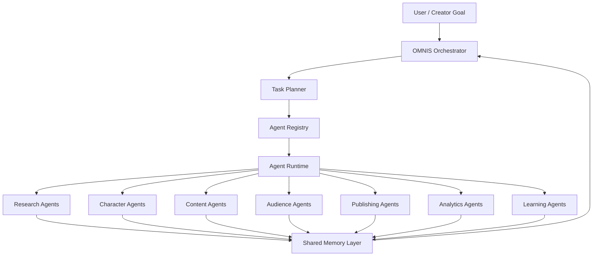

---

## 2. اصول بنیادین

### 2.1 تخصص‌گرایی

هر Agent باید یک مسئولیت روشن داشته باشد. Agent نباید بدون دلیل به یک عامل همه‌کاره تبدیل شود.

### 2.2 ترکیب‌پذیری

وظایف بزرگ باید از Agentهای کوچک‌تر ساخته شوند. برای مثال ساخت یک ویدیوی YouTube می‌تواند شامل Research، Fact Check، Script، Character Performance، Visual، Voice، Edit، Thumbnail، SEO، Publish و Analytics باشد.

### 2.3 وضعیت‌مند بودن

Agent در اجرای طولانی‌مدت باید بتواند وضعیت خود را حفظ کند؛ شامل task state، memory references، tool state، confidence، errors و learning signals.

### 2.4 قابل مشاهده بودن

هر تصمیم مهم Agent باید قابل ردیابی باشد. OMNIS باید بتواند مشخص کند چه Agentی، با چه ورودی، با چه ابزار، بر اساس چه شواهدی و با چه نتیجه‌ای تصمیم گرفته است.

### 2.5 شکست‌پذیری کنترل‌شده

Agentها ممکن است اشتباه کنند. سیستم باید retry، fallback، escalation، validation و human approval را پشتیبانی کند.

### 2.6 یادگیری بدون از دست دادن هویت

یادگیری باید مهارت و کیفیت را بهتر کند اما نباید هویت Character را به‌صورت ناخواسته تغییر دهد. Character Memory و Skill Memory باید از یکدیگر تفکیک شوند.

---

## 3. مدل Agent

هر Agent OMNIS حداقل دارای اجزای زیر است:

```text
Agent
├── Identity
├── Role
├── Goals
├── Capabilities
├── Constraints
├── Policies
├── Memory Access
├── Tools
├── Planner
├── Executor
├── Evaluator
├── Learning Loop
├── State
├── Telemetry
└── Version
```

مدل مفهومی:

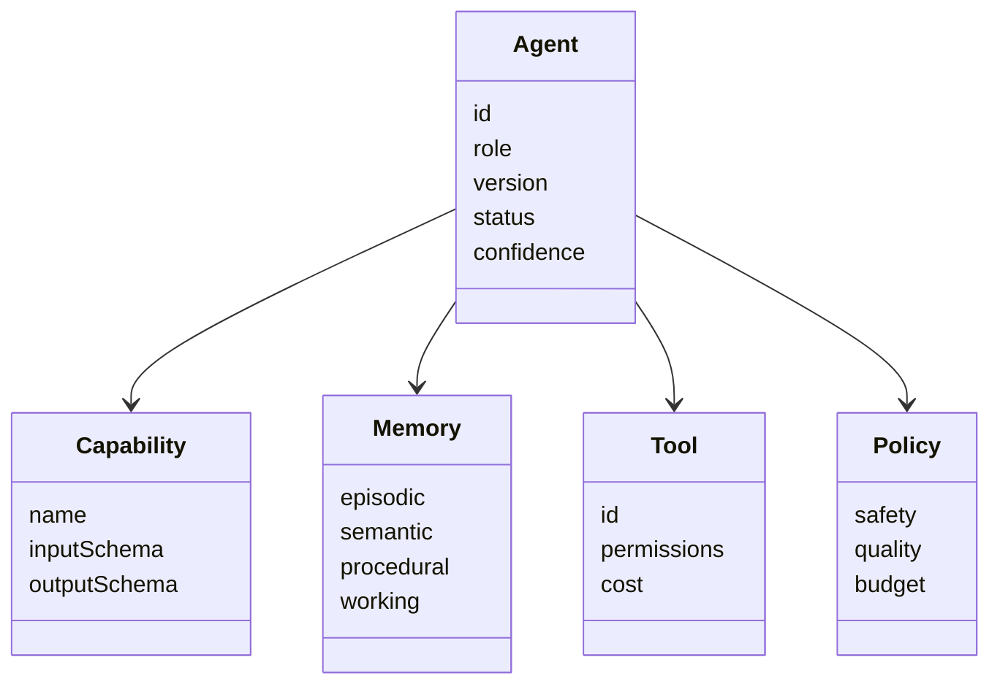

---

## 4. Agent Registry

تمام Agentها باید در Registry ثبت شوند. Registry منبع حقیقت برای شناسایی قابلیت‌ها، نسخه‌ها، سلامت، محدودیت‌ها و وضعیت Agentها است.

نمونه ساختار:

```yaml
agent:
  id: research.trends.youtube
  version: 1.4.0
  domain: research
  capabilities:
    - trend_detection
    - topic_scoring
    - source_discovery
  inputs:
    - topic
    - audience
    - locale
  outputs:
    - ranked_topics
    - evidence
  permissions:
    web: read
    publishing: none
  reliability:
    target: 0.95
```

Registry باید امکان discovery بر اساس capability، domain، latency، cost، reliability، language، jurisdiction و availability را داشته باشد.

---

## 5. Agent Runtime

Runtime محیط اجرای Agentها است. Runtime مسئول lifecycle و isolation است و نباید منطق کسب‌وکار تمام Agentها را در خود hard-code کند.

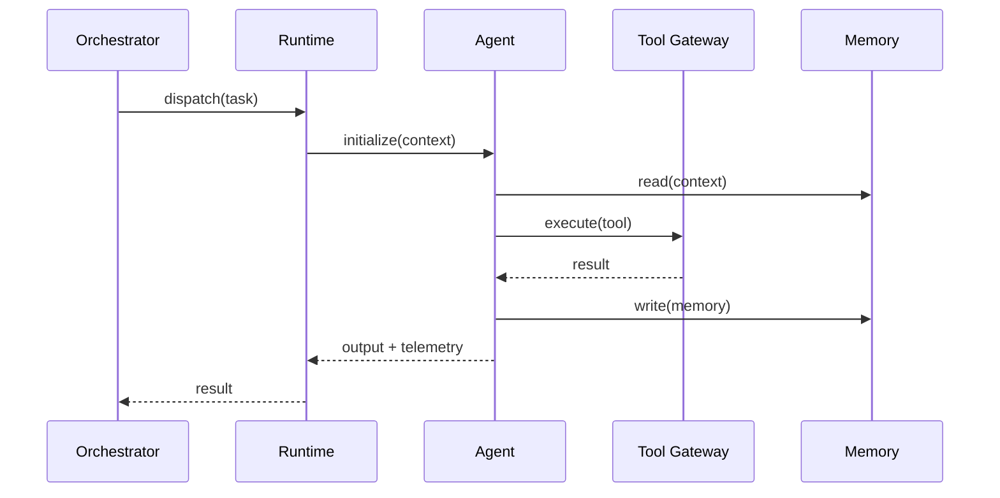

Runtime باید lifecycle زیر را پشتیبانی کند:

```text
CREATED
  ↓
QUEUED
  ↓
INITIALIZING
  ↓
RUNNING
  ↓
WAITING
  ↓
VALIDATING
  ↓
COMPLETED

RUNNING → RETRYING → RUNNING
RUNNING → FAILED → RECOVERY
RUNNING → ESCALATED
```

---

## 6. Orchestration

Orchestrator هدف سطح بالا را به task graph تبدیل می‌کند.

مثال:

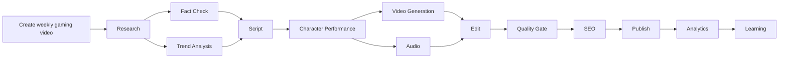

Orchestrator باید بتواند graph را به صورت DAG، sequential workflow، parallel workflow، event-driven workflow و long-running workflow اجرا کند.

---

## 7. Task Contract

هر Task باید contract مشخص داشته باشد.

```yaml
task:
  id: task_123
  type: research.topic
  priority: high
  owner: orchestrator
  inputs:
    channel_id: channel_001
    audience: gen_z
  constraints:
    max_latency_ms: 30000
    max_cost_usd: 0.20
  success:
    required_fields:
      - ranked_topics
      - evidence
```

Task contract از خروجی‌های مبهم جلوگیری می‌کند و امکان validation خودکار را فراهم می‌سازد.

---

## 8. ارتباط Agentها

Agentها نباید مستقیماً به شکل uncontrolled با یکدیگر ارتباط داشته باشند. ارتباط باید از Message Bus، Event Bus یا Orchestrator عبور کند.

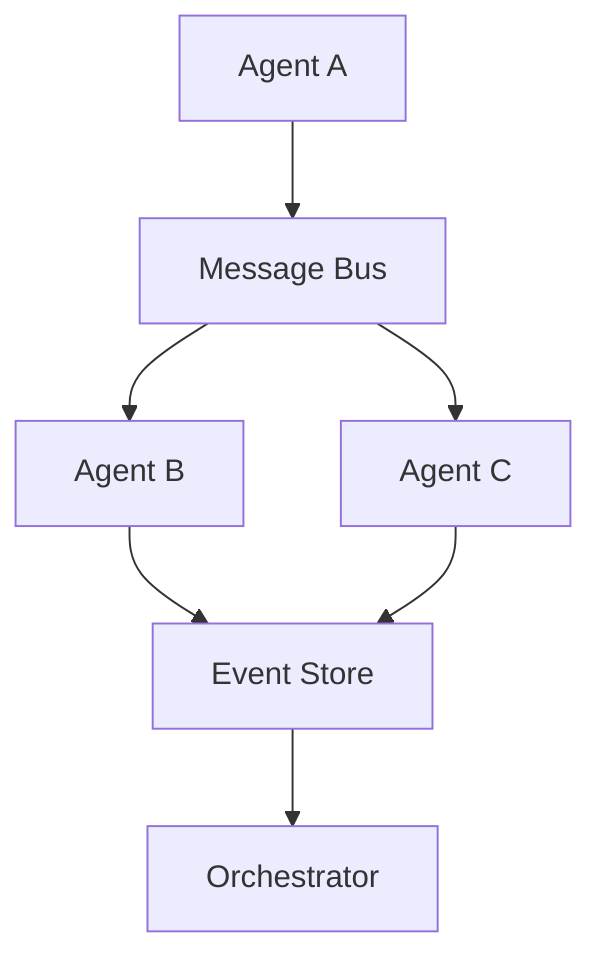

این معماری باعث کاهش coupling و افزایش قابلیت replay، audit و debugging می‌شود.

---

## 9. حافظه Agent

Memory باید چندلایه باشد:

| Memory | کاربرد |
|---|---|
| Working | اطلاعات اجرای فعلی |
| Episodic | تجربه‌های اجرای قبلی |
| Semantic | دانش عمومی و domain knowledge |
| Procedural | روش انجام کار |
| Relational | ارتباط با Agentها و Characterها |
| Organizational | قوانین و دانش OMNIS |

Agent نباید همه حافظه را دریافت کند. Memory Retrieval باید بر اساس task و permission انجام شود.

---

## 10. Tool Gateway

تمام دسترسی‌های خارجی باید از Tool Gateway عبور کنند.

نمونه ابزارها:

```text
Web Search
Browser
GitHub
GitLab
Reddit
YouTube API
Instagram API
TikTok API
Weather
Calendar
Analytics
Storage
Image Generation
Video Generation
Voice Generation
Transcription
Translation
Database
Vector Store
```

Tool Gateway باید permission، rate limit، cost، timeout، audit و retry داشته باشد.

---

## 11. Agentهای Character

یکی از مهم‌ترین کاربردهای Agent Mesh، مدیریت شخصیت‌های مجازی OMNIS است.

هر Character می‌تواند یک Character Agent اصلی داشته باشد که با Agentهای تخصصی همکاری می‌کند.

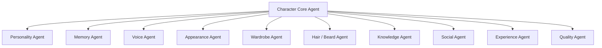

Character Core باید هویت پایدار را نگه دارد و Agentهای تخصصی نباید بدون authorization آن را تغییر دهند.

---

## 12. Audience Agents

OMNIS باید Agentهای اختصاصی برای تحلیل مخاطب داشته باشد.

وظایف:

- خواندن کامنت‌ها
- تحلیل پیام‌های خصوصی
- استخراج درخواست‌های مخاطبان
- تشخیص موضوعات پرتکرار
- شناسایی اعضای وفادار
- تشخیص sentiment
- تشخیص intent
- دسته‌بندی درخواست‌ها
- اولویت‌بندی درخواست‌ها
- انتقال درخواست‌های ارزشمند به Content Queue
- شناسایی feedback درباره شخصیت

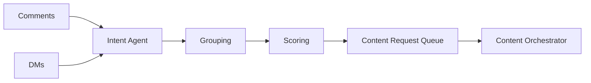

---

## 13. Learning Agents

Agentهای یادگیری باید از نتایج واقعی استفاده کنند.

مثال:

```text
Video Published
      ↓
Performance Data
      ↓
Analytics Agent
      ↓
Hypothesis Agent
      ↓
Experiment Design
      ↓
New Content
      ↓
Result Comparison
      ↓
Skill Update
```

یادگیری نباید صرفاً با افزایش تعداد نمونه‌ها تعریف شود. سیستم باید quality، retention، CTR، engagement، audience satisfaction و business outcomes را نیز در نظر بگیرد.

---

## 14. Experience Loop

هر Agent باید بتواند تجربه را به skill تبدیل کند.

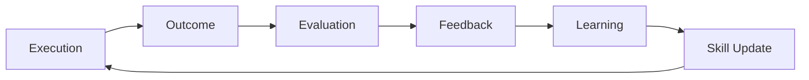

Experience باید immutable history داشته باشد تا نسخه‌های قبلی قابل بررسی باشند.

---

## 15. Multi-Agent Debate

برای وظایف حساس می‌توان چند Agent را برای تولید و بررسی پاسخ به کار گرفت.

```text
Generator Agent
      ↓
Critic Agent 1 ─┐
Critic Agent 2 ─┼→ Judge Agent → Final Result
Critic Agent 3 ─┘
```

این روش برای fact checking، script review، safety review و quality control مناسب است.

---

## 16. Confidence

هر خروجی مهم باید confidence داشته باشد.

```yaml
result:
  confidence: 0.91
  evidence_count: 12
  validators:
    - fact_checker
    - domain_expert
  unresolved_questions: []
```

Confidence نباید صرفاً عدد تولیدشده توسط مدل باشد. باید ترکیبی از شواهد، agreement، validator results و historical reliability باشد.

---

## 17. Failure Recovery

خطاها باید طبقه‌بندی شوند:

```text
Transient
Permanent
Invalid Input
Tool Failure
Model Failure
Timeout
Policy Violation
Quality Failure
Dependency Failure
```

برای هر دسته strategy متفاوت لازم است.

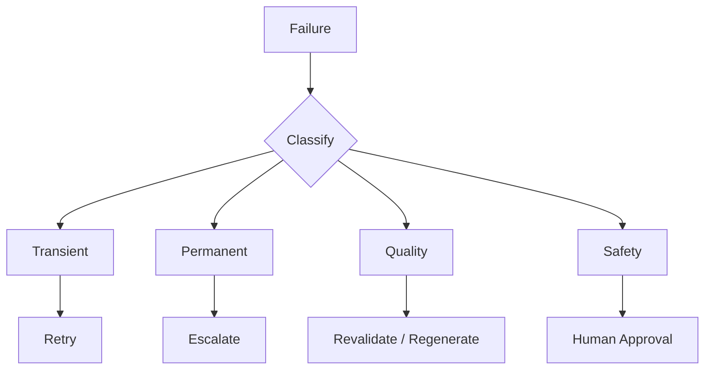

---

## 18. Priority System

Taskها باید بر اساس ارزش و فوریت رتبه‌بندی شوند.

نمونه معیارها:

```text
Business Value
Audience Demand
Urgency
Trend Velocity
Deadline
Cost
Risk
Expected Reach
Character Relevance
Learning Value
```

Priority باید dynamic باشد و در طول lifecycle task بتواند تغییر کند.

---

## 19. Budget Awareness

Agent Mesh باید هزینه را کنترل کند.

```text
Task Budget
├── Model Cost
├── Tool Cost
├── Compute Cost
├── Storage Cost
├── Generation Cost
└── External API Cost
```

Orchestrator باید بتواند مدل مناسب را با توجه به complexity انتخاب کند؛ task ساده نباید الزاماً با گران‌ترین مدل اجرا شود.

---

## 20. Model Routing

Model Router می‌تواند بین مدل‌های مختلف انتخاب کند.

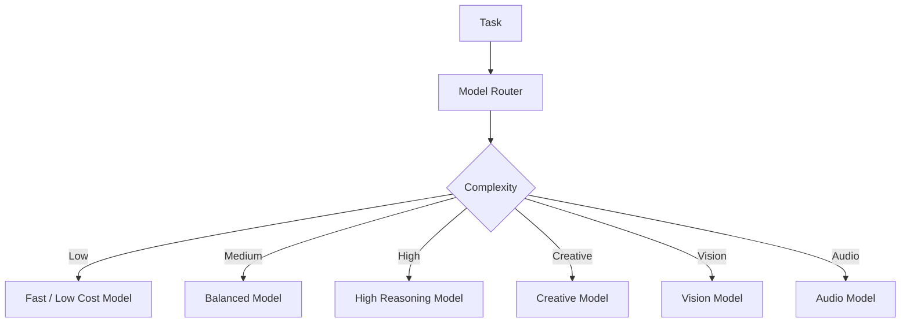

Routing باید قابل پیکربندی و قابل آزمایش باشد.

---

## 21. Character Continuity

برای شخصیت‌های مجازی، Agent Mesh باید continuity را به صورت distributed ولی controlled مدیریت کند.

مثال:

```text
Day 1: Beard = 8mm
Day 4: Beard = 9mm
Day 8: Beard trimmed → 3mm
Day 9: Beard ≈ 3mm
Day 12: Beard ≈ 4mm
```

همین اصل برای hair color، haircut، wardrobe، accessories، voice state و seasonal context اعمال می‌شود.

---

## 22. Human-Like Imperfection

Character Agent نباید شخصیت را به یک ماشین بی‌نقص تبدیل کند. با این حال، imperfections باید deterministic و context-aware باشند.

نمونه:

```text
Winter
→ mild cold
→ slightly hoarse voice
→ warmer clothes
→ lower energy
→ recovery over several days
```

این state باید در Character State Store ثبت شود و continuity داشته باشد.

---

## 23. Security Boundary

هر Agent باید حداقل permission لازم را داشته باشد.

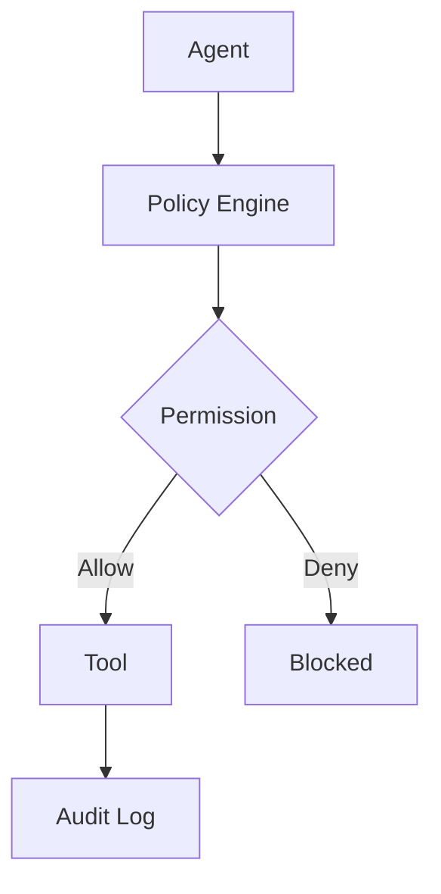

Agent نباید بتواند بدون permission به credential، payment، publishing یا private user data دسترسی داشته باشد.

---

## 24. Observability

برای هر execution باید telemetry ذخیره شود:

```yaml
telemetry:
  trace_id: trace_001
  agent_id: content.script
  task_id: task_123
  model: selected-model
  latency_ms: 1840
  token_usage: 9200
  tool_calls: 3
  retries: 0
  confidence: 0.94
  outcome: success
```

سه لایه اصلی observability:

```text
Logs
Metrics
Traces
```

---

## 25. Versioning

Agentها باید versioned باشند.

```text
research.trends@1.2.0
research.trends@1.3.0
research.trends@2.0.0
```

هر Character و workflow باید بتواند نسخه Agent مورد استفاده خود را ثبت کند تا اجرای قبلی قابل بازسازی باشد.

---

## 26. Agent Factory

OMNIS باید امکان ساخت Agent جدید بدون تغییر هسته Runtime را داشته باشد.

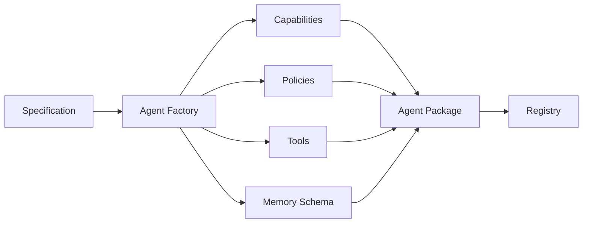

Agent Factory باید template، validation، testing، registration و deployment را پشتیبانی کند.

---

## 27. Agent Testing

هر Agent باید با مجموعه‌ای از tests ارزیابی شود:

- Unit tests
- Contract tests
- Tool tests
- Regression tests
- Safety tests
- Quality tests
- Load tests
- Adversarial tests
- Continuity tests

قبل از promotion به production، Agent باید Quality Gate را پاس کند.

---

## 28. Simulation Environment

قبل از اجرای واقعی، Agentها باید بتوانند در محیط simulation اجرا شوند.

```text
Simulation
├── Mock Web
├── Mock Audience
├── Mock APIs
├── Synthetic Events
├── Synthetic Comments
├── Synthetic Character State
└── Replayable History
```

این محیط برای آزمایش workflowهای پیچیده و جلوگیری از خطاهای پرهزینه ضروری است.

---

## 29. Human Approval

در عملیات حساس، سیستم باید human-in-the-loop داشته باشد.

موارد نمونه:

```text
Financial Action
Account Permission Change
High-Risk Publication
Legal-Sensitive Content
Sensitive Personal Data
Major Character Identity Change
```

Approval باید بخشی از workflow باشد، نه یک workaround خارجی.

---

## 30. Agent Fleet

OMNIS در مقیاس بزرگ با یک Agent اجرا نمی‌شود؛ یک Fleet از Agentها دارد.

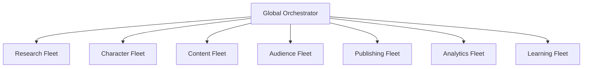

Fleet Manager باید capacity، health، scaling، throttling و routing را مدیریت کند.

---

## 31. Event Driven Architecture

بخش بزرگی از Agent Mesh باید event-driven باشد.

نمونه eventها:

```text
CommentReceived
MessageReceived
TrendDetected
TopicRequested
VideoPublished
VideoPerformanceUpdated
CharacterStateChanged
WeatherChanged
SeasonChanged
SkillUpdated
AgentFailed
QualityGateFailed
```

Eventها باید immutable و versioned باشند.

---

## 32. Content Request Pipeline

درخواست مخاطب نمونه‌ای از workflow چندعاملی است.

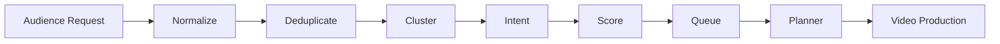

این pipeline باعث می‌شود درخواست‌های پراکنده مخاطبان به knowledge قابل استفاده برای تولید محتوا تبدیل شوند.

---

## 33. Dynamic Skill Growth

Agent باید skill profile داشته باشد.

```yaml
skill:
  name: scriptwriting.gaming
  level: 0.78
  executions: 142
  successful: 121
  last_updated: 2026-08-16
  trend: improving
```

Skill level نباید تنها بر اساس تعداد execution افزایش یابد؛ کیفیت نتیجه و feedback باید معیار اصلی باشد.

---

## 34. Governance

Agent Mesh باید تحت Governance Layer اجرا شود.

```text
Governance
├── Safety
├── Privacy
├── Permissions
├── Cost
├── Quality
├── Compliance
├── Audit
└── Human Oversight
```

Governance باید بالاتر از Agentها قرار گیرد و Agent نتواند policyهای آن را دور بزند.

---

## 35. معماری نهایی

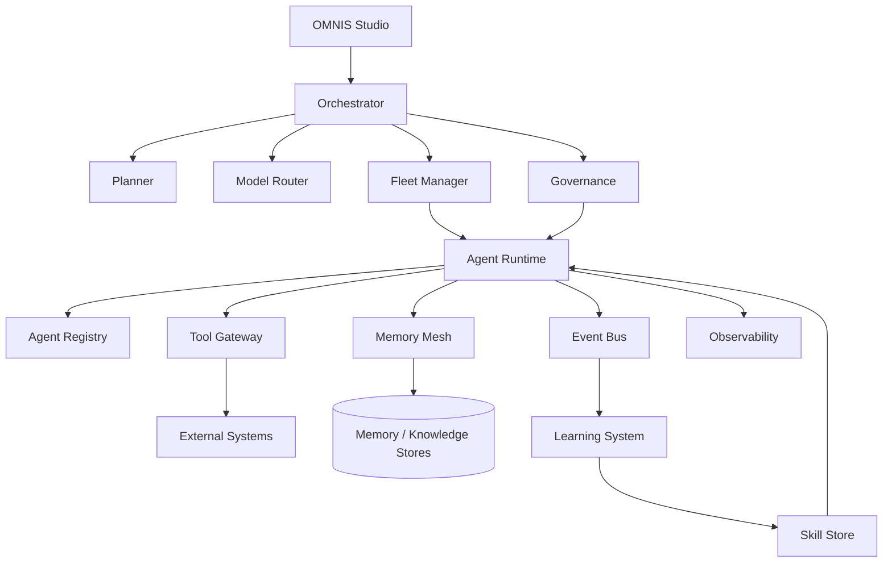

این معماری باید بتواند از چند Agent ساده در نسخه اولیه تا هزاران Agent تخصصی در نسخه‌های آینده scale شود.

---

## 36. Non-Goals

Agent Mesh نباید:

1. تمام منطق سیستم را داخل یک Agent قرار دهد.
2. Agentها را بدون permission به ابزارهای حساس متصل کند.
3. حافظه همه کاربران را در اختیار همه Agentها قرار دهد.
4. بدون validation خروجی Agent را معتبر فرض کند.
5. learning را برابر با self-modification بدون کنترل بداند.
6. برای هر task از بزرگ‌ترین و گران‌ترین مدل استفاده کند.
7. continuity شخصیت را صرفاً با prompt ثابت حل کند.

---

## 37. معیارهای موفقیت

Agent Mesh زمانی موفق تلقی می‌شود که بتواند:

- حداقل صدها Agent را مدیریت کند.
- Agentها را dynamically discover کند.
- task graphهای پیچیده را اجرا کند.
- failure recovery داشته باشد.
- memory access کنترل‌شده ارائه کند.
- مدل مناسب را انتخاب کند.
- هزینه را کنترل کند.
- خروجی را validate کند.
- Agentها را version و rollback کند.
- تجربه را به skill تبدیل کند.
- شخصیت‌ها را با continuity حفظ کند.
- feedback مخاطب را به task تبدیل کند.
- اجرای کامل را audit کند.

---

## 38. وضعیت پیاده‌سازی

این سند قرارداد معماری است و قبل از implementation باید به specificationهای دقیق‌تر شکسته شود:

```text
AGENT_RUNTIME_SPEC.md
AGENT_REGISTRY_SPEC.md
TASK_CONTRACT_SPEC.md
ORCHESTRATOR_SPEC.md
MEMORY_MESH_SPEC.md
TOOL_GATEWAY_SPEC.md
EVENT_BUS_SPEC.md
AGENT_SECURITY_SPEC.md
AGENT_EVALUATION_SPEC.md
AGENT_LEARNING_SPEC.md
CHARACTER_AGENT_SPEC.md
AUDIENCE_AGENT_SPEC.md
```

هر specification باید implementation-ready باشد و شامل interface، schema، lifecycle، error model، tests و observability requirements شود.

---

## 39. اصل نهایی

OMNIS نباید صرفاً «تعدادی Agent» داشته باشد. هدف، ساخت یک **Agent Operating Fabric** است؛ شبکه‌ای که در آن Agentها تخصص دارند، همکاری می‌کنند، تجربه کسب می‌کنند، تحت governance اجرا می‌شوند و در نهایت به یک سیستم واحد برای ساخت، مدیریت و رشد شخصیت‌ها و کانال‌های دیجیتال تبدیل می‌شوند.

```text
                 OMNIS
                   │
          ┌────────┴────────┐
          │  Agent Operating │
          │      Fabric      │
          └────────┬────────┘
                   │
       ┌───────────┼───────────┐
       │           │           │
   Characters   Content     Audience
       │           │           │
       └───────────┼───────────┘
                   │
              Experience
                   │
                Learning
                   │
               Evolution
```
