# OMNIS Digital Human OS

> **Document ID:** DOM-DH-001  
> **Status:** Draft — Domain Foundation  
> **Version:** 0.1.0  
> **Domain:** Digital Human OS  
> **Parent:** `docs/02-architecture/OMNIS_ARCHITECTURE.md`

---

## 1. Purpose

Digital Human OS is the subsystem responsible for representing, evolving, validating, and rendering persistent synthetic personalities inside OMNIS.

A Digital Human is not a prompt, an avatar, a face, a voice model, or a collection of generated videos. It is a persistent stateful entity with identity, appearance, personality, knowledge, skills, memories, relationships, preferences, habits, temporal state, experience, and governed behavior.

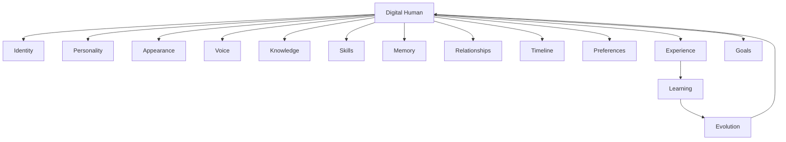

The central invariant is:

> **Generated media represents Digital Human state; generated media does not define Digital Human state.**

---

## 2. Design Goals

Digital Human OS must provide:

- persistent identity;
- temporal continuity;
- believable human variation;
- stable personality;
- controlled imperfection;
- appearance consistency;
- voice consistency;
- evolving skills;
- domain expertise;
- bounded memory;
- relationships;
- audience-aware behavior;
- experience-driven improvement;
- deterministic state snapshots;
- generation-ready context;
- evaluation and regression protection;
- governance and auditability.

---

## 3. Non-Goals

Digital Human OS is not responsible for:

- rendering every video itself;
- owning social-platform APIs;
- replacing the entire agent runtime;
- being the universal knowledge store;
- making unrestricted autonomous decisions;
- storing secrets in character profiles;
- treating generated media as authoritative identity state.

Those capabilities belong to other domains and communicate through contracts.

---

## 4. Digital Human Mental Model

The model is deliberately layered.

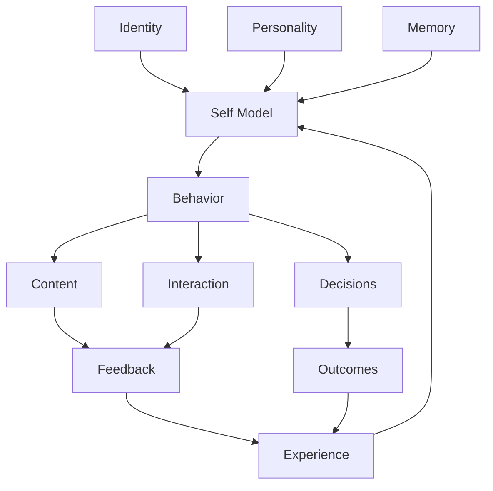

The architecture therefore treats experience as a source of learning rather than merely an analytics metric.

---

## 5. Canonical Character Identity

Identity contains relatively stable attributes that define who the character is.

Potential identity fields include:

```text
character_id
canonical_name
public_name
age_model
birth_date_model
origin
languages
timezone
pronouns
occupation
primary_domain
secondary_interests
identity_version
created_at
status
```

Age and similar attributes require special policy treatment. For synthetic personas representing minors, generation and interaction capabilities must be subject to stronger governance and platform-specific restrictions.

---

## 6. Identity Layers

Identity is divided into four conceptual layers.

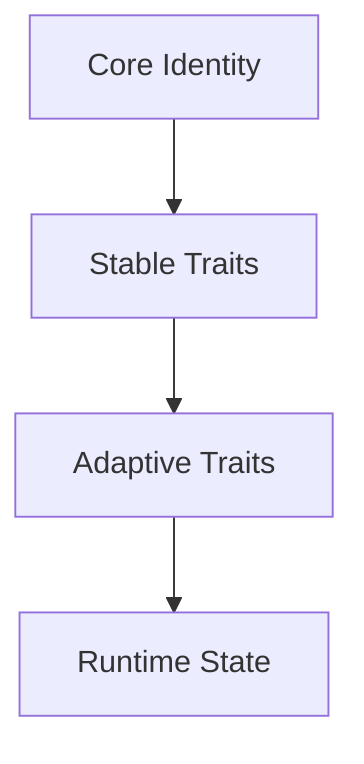

### Core Identity

Rarely changes.

### Stable Traits

Can evolve slowly through controlled processes.

### Adaptive Traits

Learned preferences, habits, and skills.

### Runtime State

Temporary conditions such as energy, mood, current outfit, or current activity.

---

## 7. Identity Immutability

Not every attribute should be mutable by agents.

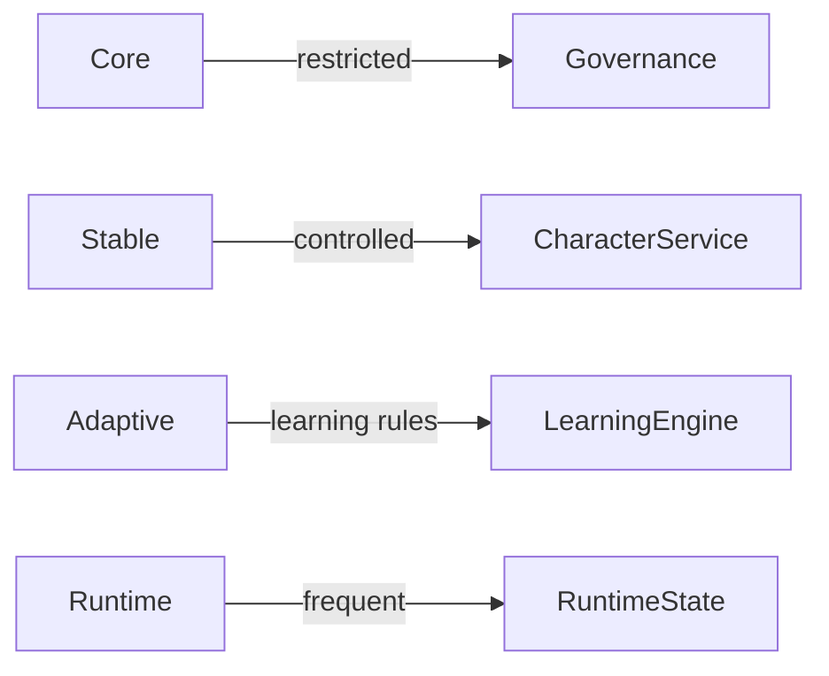

Core identity changes require explicit governance and versioning.

---

## 8. Personality Architecture

Personality is multi-dimensional rather than a single prompt paragraph.

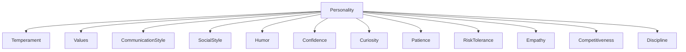

Each dimension has a bounded range, confidence, evidence history, and update policy.

---

## 9. Personality vs Behavior

Personality influences behavior but does not deterministically control it.

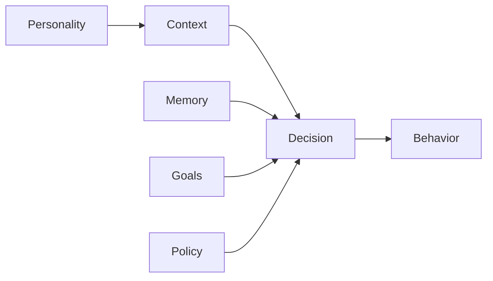

This allows the same character to behave differently in different contexts without becoming inconsistent.

---

## 10. Human-Like Imperfection

Believability requires controlled variation, not random defects.

Examples:

- occasional hesitation;
- variable energy;
- mild changes in speech rhythm;
- seasonal voice changes;
- occasional forgotten minor details;
- changing preferences;
- imperfect but recoverable mistakes;
- realistic repetition;
- different outfit combinations;
- changing hair or beard state.

Imperfection must be bounded by continuity rules.

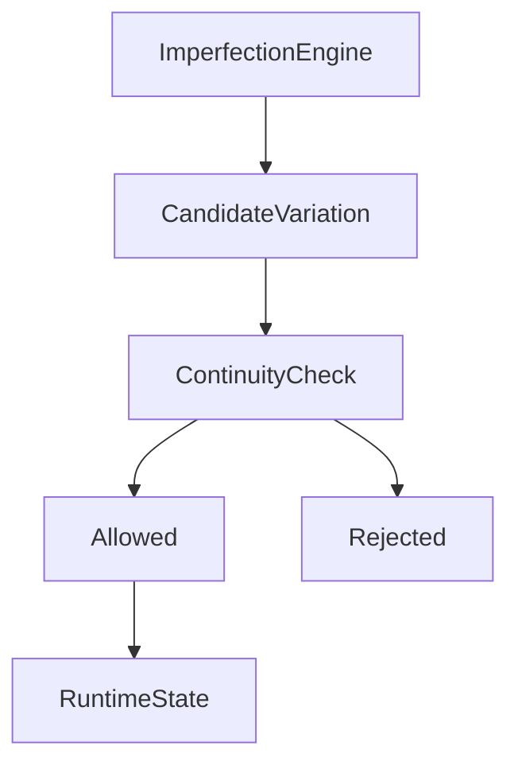

---

## 11. Imperfection Safety Rule

The system must never introduce an imperfection simply because randomness is desired.

An imperfection should have a plausible cause, probability, duration, and recovery path when appropriate.

For example:

```text
Cold weather
→ plausible mild hoarseness
→ voice state changes
→ persists for a bounded period
→ gradually recovers
→ normal voice restored
```

---

## 12. Runtime Human State

Runtime state captures temporary conditions.

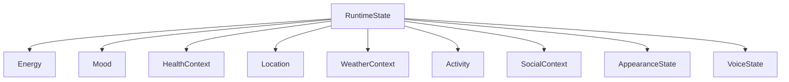

HealthContext is fictional character state and must not be confused with medical data about real people.

---

## 13. Temporal Model

Every mutable characteristic can be understood as a time series.

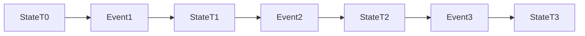

The current state is derived from an authoritative timeline rather than independently guessed by each generation model.

---

## 14. Character Timeline

The timeline records meaningful state transitions.

Examples:

```text
2026-08-01  Hair color changed
2026-08-04  New jacket purchased
2026-08-08  Beard trimmed
2026-08-11  Learned new game mechanic
2026-08-12  Audience requested retro-game series
2026-08-13  Character accepted challenge
```

Timeline events can influence future generation context.

---

## 15. Appearance OS

Appearance is decomposed into independently managed components.

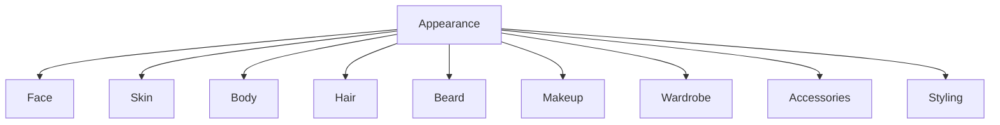

Each component maintains its own state and continuity rules.

---

## 16. Face Identity

Face identity requires a stable canonical representation.

The system should maintain:

- canonical identity reference;
- approved generation references;
- facial feature constraints;
- allowed aging range;
- lighting/style tolerance;
- expression range;
- consistency evaluation.

The image model must not freely redesign the face on every generation.

---

## 17. Body Identity

Body representation includes stable structural characteristics and bounded variation.

Potential state:

```text
height_model
body_type
proportions
fitness_state
posture_preferences
weight_band
movement_style
```

The exact representation should support continuity without encouraging unsafe or unrealistic body requirements.

---

## 18. Hair State

Hair is temporal.

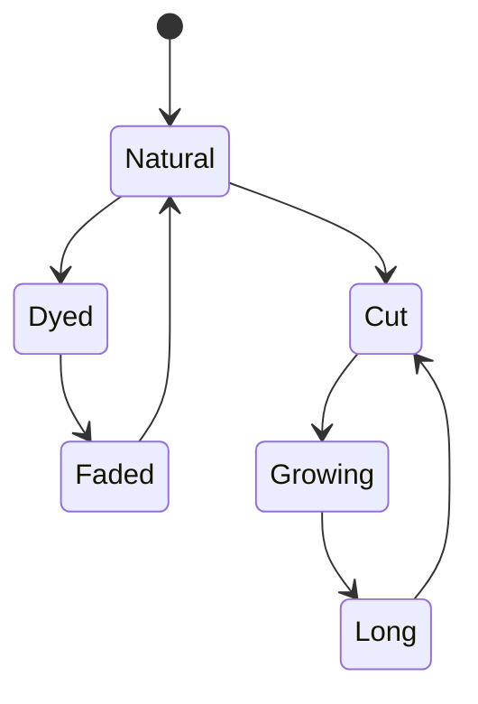

Hair changes require:

- timestamp;
- color;
- cut;
- length;
- styling;
- growth model;
- transition duration.

---

## 19. Hair Continuity

If a character changes hair color today, future content should inherit that color until the timeline indicates otherwise.

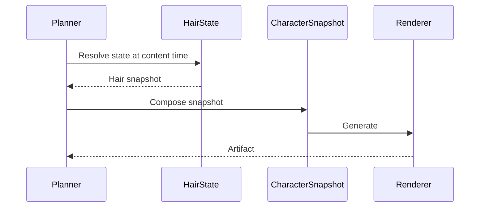

---

## 20. Beard and Facial Hair

Beard state follows growth and grooming events.

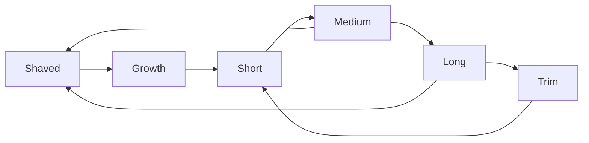

A character cannot logically appear clean-shaven in one clip and have a full beard immediately afterward without a modeled transition or explicit story context.

---

## 21. Makeup State

Makeup is contextual rather than permanent.

Inputs may include:

- event type;
- content category;
- season;
- time of day;
- character preference;
- current fashion preference;
- continuity;
- styling rules.

---

## 22. Wardrobe OS

Wardrobe is an inventory plus preference and usage history.

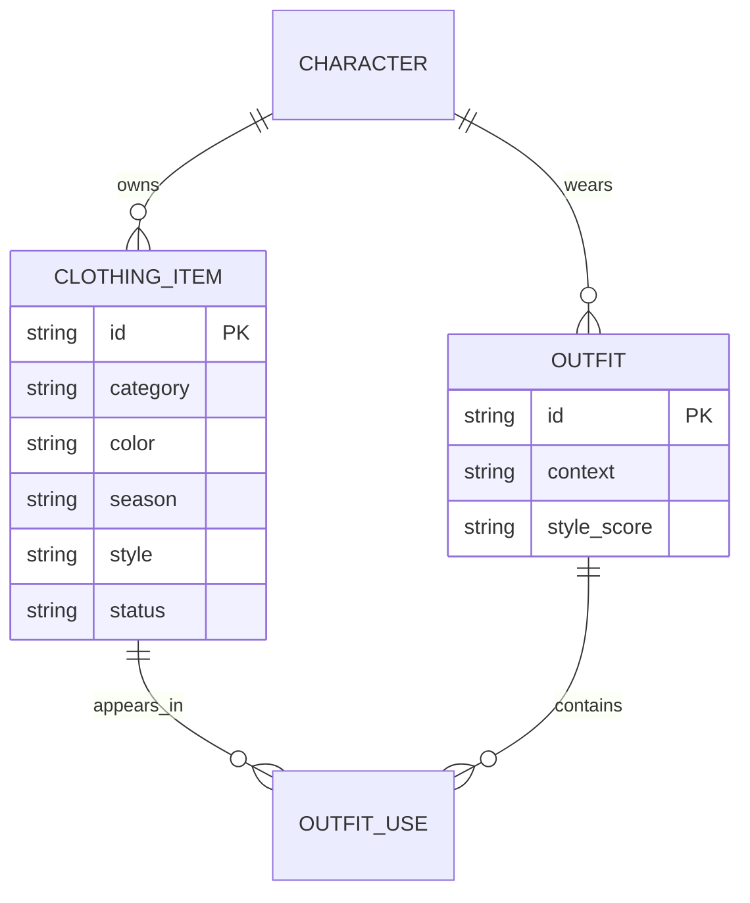

---

## 23. Clothing Reuse

Human-like wardrobe behavior requires reuse.

The system should not force every content item to use a brand-new outfit.

```text
Episode A → Black jeans + white shirt
Episode B → Same black jeans + leather jacket
Episode C → Different trousers + same white shirt
Episode D → Full new outfit
```

Reuse frequency is influenced by context, recency, season, and character preference.

---

## 24. Seasonal Wardrobe

Season is one input, not the only input.

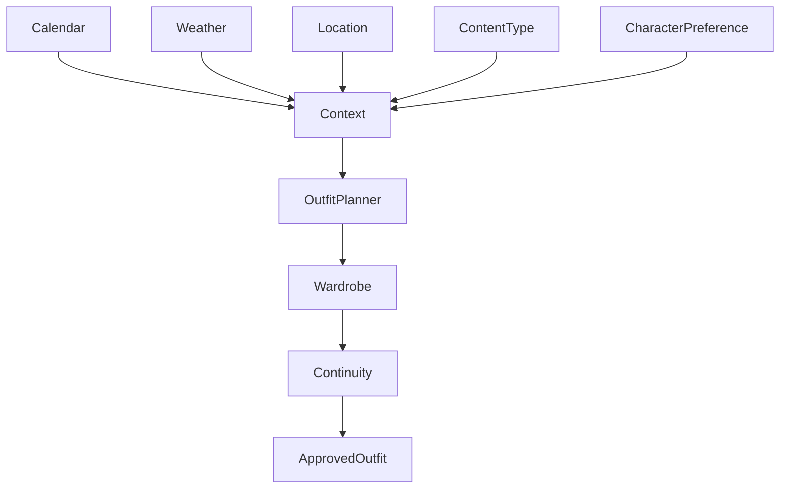

Weather-aware behavior should be realistic but not mechanically literal.

---

## 25. Weather Integration

A character in a cold environment may plausibly wear layers, a coat, scarf, or warmer footwear.

The exact response depends on:

- actual weather;
- indoor/outdoor context;
- location;
- activity;
- character style;
- content requirements.

---

## 26. Outfit Selection

The Outfit Planner scores candidates.

```text
Score =
  StyleFit
+ CharacterPreference
+ ContextFit
+ SeasonFit
+ WeatherFit
+ Novelty
+ ReuseNaturalness
+ Continuity
- ConflictPenalty
```

The exact mathematical model is implementation-specific and should be validated experimentally.

---

## 27. Voice Identity

Voice has both immutable identity features and adaptive performance state.

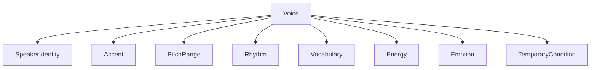

---

## 28. Voice Continuity

A voice model must preserve the recognizable speaker identity while allowing natural variation.

Possible temporary conditions:

- tiredness;
- excitement;
- mild seasonal hoarseness;
- emotional stress;
- quiet environment;
- loud environment.

These conditions should be modeled as controlled parameters rather than unrelated voices.

---

## 29. Speech Style

Each character has a communication profile.

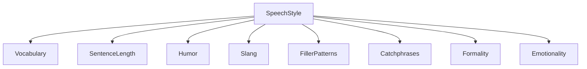

Catchphrases must be probabilistic and contextual so they do not become repetitive machine signatures.

---

## 30. Character Knowledge

Knowledge is domain-scoped.

A gaming influencer may have:

- game knowledge;
- hardware knowledge;
- basic historical context when discussing historical games;
- community knowledge;
- personal experience records.

They do not need to become a historian merely because a game has a historical setting.

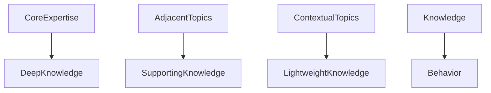

---

## 31. Knowledge Depth

Knowledge should have levels.

| Level | Meaning |
|---|---|
| 0 | No reliable knowledge |
| 1 | Basic contextual awareness |
| 2 | Working knowledge |
| 3 | Strong practical knowledge |
| 4 | Expert capability |
| 5 | Exceptional domain mastery |

The character should not confidently fabricate Level 4 or 5 knowledge when its state indicates Level 1.

---

## 32. Skill System

Skills differ from knowledge.

Knowledge means understanding.

Skill means the ability to perform.

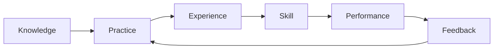

---

## 33. Skill Progression

Every meaningful skill can have:

```text
skill_id
level
confidence
practice_count
success_count
failure_count
last_practiced
learning_rate
specializations
```

Skill levels should increase through evidence rather than arbitrary model claims.

---

## 34. Experience Engine

Experience is a first-class domain concept.

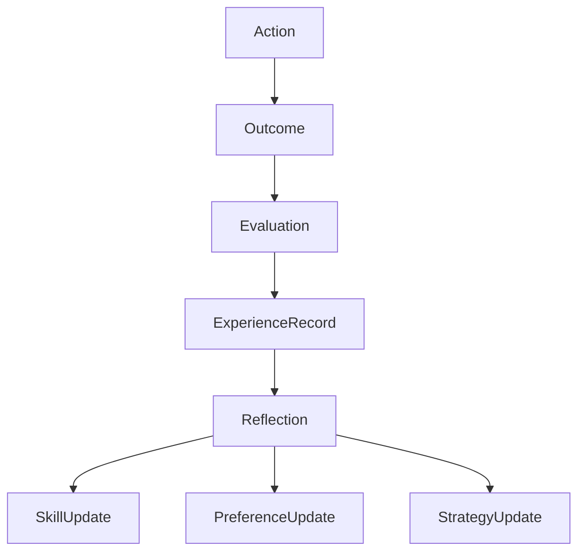

This is the foundation for the requirement that characters become better over time.

---

## 35. Experience Record

An experience record should capture:

```json
{
  "experience_id": "...",
  "character_id": "...",
  "domain": "gaming",
  "action": "published_review",
  "context": {},
  "outcome": {},
  "evaluation": {},
  "lessons": [],
  "confidence": 0.0,
  "occurred_at": "..."
}
```

---

## 36. Reflection

Reflection converts events into reusable lessons.

```mermaid
flowchart TD
    Experiences --> PatternDetection
    PatternDetection --> CandidateLesson
    CandidateLesson --> EvidenceCheck
    EvidenceCheck --> Lesson
    EvidenceCheck --> Reject
    Lesson --> Memory
    Lesson --> Skill
```

A single failure should rarely rewrite personality or strategy permanently.

---

## 37. Memory Architecture

Digital Human memory is separated by function.

```mermaid
graph TD
    Memory --> Working
    Memory --> Episodic
    Memory --> Semantic
    Memory --> Procedural
    Memory --> Relationship
    Memory --> Preference
    Memory --> Reflection
```

---

## 38. Working Memory

Working memory contains context needed for the current task.

It should be short-lived and aggressively summarized when no longer needed.

---

## 39. Episodic Memory

Episodic memory records meaningful experiences.

Examples:

```text
First viral video
First collaboration
Important audience request
Failed product review
Successful game challenge
Memorable live stream
```

---

## 40. Semantic Memory

Semantic memory contains learned facts relevant to the character.

It may contain:

- stable domain knowledge;
- learned preferences;
- recurring facts about collaborators;
- channel-specific knowledge.

---

## 41. Procedural Memory

Procedural memory stores learned ways of performing tasks.

Example:

```text
How this character prepares a game review
How she structures makeup tutorials
How he presents motorcycle maintenance
How the character responds to recurring audience questions
```

---

## 42. Relationship Memory

Relationship memory tracks interaction history with people, collaborators, and audience members under applicable privacy and platform rules.

```mermaid
flowchart TD
    Interaction --> RelationshipEvent
    RelationshipEvent --> RelationshipState
    RelationshipState --> FutureContext
```

---

## 43. Preference Memory

Preferences can evolve.

Examples:

- favorite colors;
- preferred games;
- disliked formats;
- preferred clothing combinations;
- recurring food references;
- content topics.

Preferences require confidence and recency weighting.

---

## 44. Character Goals

Characters may have goals that influence content and behavior.

```mermaid
flowchart TD
    Goals --> LongTerm
    Goals --> MediumTerm
    Goals --> Session
    LongTerm --> MediumTerm
    MediumTerm --> Session
    Session --> Actions
```

Goals must remain subordinate to platform, safety, workspace, and operator policies.

---

## 45. Motivation Model

Motivation can be represented as weighted drives.

Potential dimensions:

```text
Achievement
Curiosity
SocialConnection
Recognition
Creativity
Competition
Learning
Stability
```

Motivation is a behavioral simulation mechanism, not a claim of actual consciousness.

---

## 46. Emotional State

Emotion can influence expression, voice, pacing, and response selection.

```mermaid
flowchart TD
    Context --> EmotionModel
    Memory --> EmotionModel
    Personality --> EmotionModel
    Goals --> EmotionModel
    EmotionModel --> Expression
    EmotionModel --> Voice
    EmotionModel --> Behavior
```

Emotion should be bounded and explainable rather than random mood switching.

---

## 47. Emotional Continuity

A significant event can influence nearby interactions.

For example:

```text
Bad news
→ lower energy
→ calmer speech
→ different content preference
→ recovery
→ normal energy
```

The exact duration and intensity depend on the character configuration.

---

## 48. Habit Engine

Habits make characters recognizable.

```mermaid
flowchart LR
    Context --> HabitTrigger
    HabitTrigger --> HabitProbability
    HabitProbability --> Behavior
    Behavior --> Reinforcement
```

Habits should be probabilistic rather than executed every time.

---

## 49. Good and Bad Traits

Each character can contain strengths and weaknesses.

Examples:

```text
Strength: highly curious
Weakness: sometimes impatient
Strength: disciplined
Weakness: overthinks decisions
Strength: social
Weakness: occasionally talks too much
```

Weaknesses should create believable variation without making the character incompetent.

---

## 50. Trait Interaction

Traits interact with context.

```mermaid
flowchart TD
    TraitA[Curiosity] --> Decision
    TraitB[Impatience] --> Decision
    TraitC[Discipline] --> Decision
    Context --> Decision
    Decision --> Behavior
```

This avoids reducing a personality to a single adjective.

---

## 51. Character Consistency

Consistency has several dimensions.

| Dimension | Example |
|---|---|
| Identity | same person |
| Visual | face/body/hair continuity |
| Voice | recognizable speaker |
| Personality | recognizable behavior |
| Knowledge | plausible expertise |
| Timeline | state follows time |
| Relationships | history is remembered |
| Style | recognizable communication |

---

## 52. Consistency Engine

```mermaid
flowchart TD
    Candidate --> IdentityCheck
    Candidate --> VisualCheck
    Candidate --> VoiceCheck
    Candidate --> PersonalityCheck
    Candidate --> TimelineCheck
    Candidate --> KnowledgeCheck
    Candidate --> RelationshipCheck
    IdentityCheck --> Score
    VisualCheck --> Score
    VoiceCheck --> Score
    PersonalityCheck --> Score
    TimelineCheck --> Score
    KnowledgeCheck --> Score
    RelationshipCheck --> Score
```

Generation proceeds only when the resulting score meets the configured threshold or enters an explicit human-review path.

---

## 53. Character Snapshot

The generator receives a versioned snapshot.

```json
{
  "character_id": "char_123",
  "state_version": 42,
  "identity": {},
  "appearance": {},
  "voice": {},
  "personality": {},
  "runtime": {},
  "knowledge": {},
  "skills": {},
  "relationships": [],
  "timeline_context": []
}
```

Snapshots make generation reproducible.

---

## 54. Snapshot Rules

A snapshot must be:

- immutable;
- versioned;
- timestamped;
- traceable to source state;
- safe to serialize;
- compatible with the target generator.

---

## 55. Generation Context

A generation request combines:

```mermaid
flowchart TD
    ContentBrief --> GenerationContext
    CharacterSnapshot --> GenerationContext
    PlatformContext --> GenerationContext
    EnvironmentContext --> GenerationContext
    PolicyContext --> GenerationContext
    GenerationContext --> Generator
```

---

## 56. Scene State

A single piece of content can contain multiple scene-specific states.

```text
Character Snapshot
      ↓
Scene Context
      ↓
Wardrobe + Location + Activity + Emotion
      ↓
Scene Generation
```

Scene state must remain compatible with the broader character timeline.

---

## 57. Character-Channel Relationship

A Digital Human may operate one or more channels only when explicitly configured.

```mermaid
graph TD
    Character --> ChannelA
    Character --> ChannelB
    Character --> ChannelC
```

Channel-specific behavior must not accidentally rewrite global identity.

---

## 58. Character-Content Relationship

Content should reference the character state used during production.

```mermaid
erDiagram
    CHARACTER ||--o{ CONTENT : appears_in
    CHARACTER ||--o{ SNAPSHOT : creates
    SNAPSHOT ||--o{ CONTENT : governs
    CONTENT ||--o{ ARTIFACT : produces
```

---

## 59. Audience Interaction

Characters can respond to audience messages through a governed interaction pipeline.

```mermaid
flowchart TD
    Message --> Classification
    Classification --> ContextRetrieval
    ContextRetrieval --> CharacterSnapshot
    CharacterSnapshot --> ResponsePlanner
    ResponsePlanner --> Policy
    Policy --> Draft
    Draft --> QA
    QA --> Reply
```

---

## 60. Comment Personality

Responses should reflect character style without producing identical phrasing.

The response planner considers:

- personality;
- relationship state;
- message sentiment;
- topic expertise;
- conversation history;
- current emotional state;
- channel culture.

---

## 61. Private Messages

DMs have stricter permissions than public comments.

Possible classifications:

```text
General conversation
Content request
Support request
Business inquiry
Collaboration
Sensitive topic
Potential scam
Escalation required
```

High-impact or sensitive messages require escalation policies.

---

## 62. Audience Request Mining

Audience requests can feed the Content Opportunity Engine.

```mermaid
flowchart TD
    Comments --> RequestExtractor
    DMs --> RequestExtractor
    Community --> RequestExtractor
    RequestExtractor --> Normalizer
    Normalizer --> Deduplicator
    Deduplicator --> DemandScore
    DemandScore --> ContentQueue
```

This domain supplies character context; the final production queue belongs to Content OS.

---

## 63. Experience from Audience Interaction

Audience feedback can become experience evidence.

```mermaid
flowchart LR
    Interaction --> Feedback
    Feedback --> Evaluation
    Evaluation --> Lesson
    Lesson --> CharacterSkill
```

A character should improve in communication based on repeated evidence rather than one comment.

---

## 64. Collaboration State

Recurring collaborators should have relationship state.

```mermaid
stateDiagram-v2
    Unknown --> Introduced
    Introduced --> Collaborator
    Collaborator --> TrustedCollaborator
    TrustedCollaborator --> Conflict
    Conflict --> Collaborator
    Collaborator --> Inactive
    Inactive --> Collaborator
```

---

## 65. Character-to-Character Interaction

Multiple Digital Humans may interact in the same content.

The system must resolve both states before generation.

```mermaid
sequenceDiagram
    participant Planner
    participant CharacterA
    participant CharacterB
    participant Relationship
    participant Scene

    Planner->>CharacterA: Snapshot
    Planner->>CharacterB: Snapshot
    Planner->>Relationship: Resolve relationship
    Relationship-->>Planner: Relationship state
    Planner->>Scene: Compose interaction
```

---

## 66. Shared Memories

Shared memories may exist between characters, but each character can retain a different perspective.

```mermaid
flowchart LR
    Event --> MemoryA
    Event --> MemoryB
    MemoryA --> PerspectiveA
    MemoryB --> PerspectiveB
```

This allows natural disagreement without corrupting objective event provenance.

---

## 67. Perspective Model

A character's interpretation of an event may differ from the canonical event record.

```text
Canonical Event
      ↓
Character A interpretation
Character B interpretation
Audience interpretation
```

The canonical event remains separate from subjective character memory.

---

## 68. Character Expertise

Expertise should be represented as a graph rather than one label.

```mermaid
graph TD
    Gaming --> FPS
    Gaming --> RPG
    Gaming --> Strategy
    Gaming --> Hardware
    Hardware --> GPUs
    Hardware --> Consoles
    History --> AncientHistory
    History --> ModernHistory
```

Each node may have an independent skill and knowledge score.

---

## 69. Cross-Domain Knowledge

Characters can possess secondary knowledge without becoming specialists.

Example:

```text
Primary: Gaming — Expert
Secondary: Hardware — Strong
Secondary: Pop Culture — Strong
Context: Medieval History — Basic
```

This produces richer conversations while preserving believable limitations.

---

## 70. Knowledge Confidence

Knowledge retrieval must carry confidence and provenance.

```mermaid
flowchart TD
    KnowledgeClaim --> Source
    Source --> Reliability
    Reliability --> Confidence
    Confidence --> ResponsePolicy
```

Low-confidence facts should trigger verification or cautious phrasing.

---

## 71. Character Research Behavior

Characters should appear knowledgeable because the system supplies relevant knowledge, not because the model blindly roleplays expertise.

Research is performed through the Research and Knowledge domains.

---

## 72. Personal Taste

Taste is a learned preference system.

```mermaid
flowchart TD
    Exposure --> Reaction
    Reaction --> PreferenceEvidence
    PreferenceEvidence --> PreferenceScore
    PreferenceScore --> Taste
    Taste --> FutureSelection
```

Taste can change gradually.

---

## 73. Preference Decay

Some preferences should decay if not reinforced.

```text
Preference strength
100 → 90 → 78 → 64 ...
```

The exact decay model is domain-specific.

---

## 74. Character Aging

Aging is a controlled temporal process.

It may affect:

- appearance;
- voice;
- preferences;
- knowledge;
- behavior;
- wardrobe.

Age transitions must be explicit and governed.

---

## 75. Appearance Aging

Appearance aging should be gradual where configured.

```mermaid
flowchart LR
    AgeT0 --> AgeT1
    AgeT1 --> AgeT2
    AgeT2 --> AgeT3
```

The renderer should receive age-consistent parameters rather than reinventing age on each image.

---

## 76. Voice Aging

Voice may evolve with age according to the character model, but speaker identity must remain recognizable.

---

## 77. Fashion Evolution

Fashion preferences may change due to:

- personal taste;
- seasonal trends;
- content category;
- audience feedback;
- collaborations;
- life events.

```mermaid
flowchart TD
    Trends --> FashionSignal
    Audience --> FashionSignal
    CharacterTaste --> FashionSignal
    FashionSignal --> WardrobeEvolution
```

---

## 78. Grooming Evolution

Hair, beard, and makeup can evolve through deliberate events.

No generated scene should bypass the timeline without an explicit override.

---

## 79. Character Health Context

For fictional continuity, the system may model lightweight states such as:

```text
normal
fatigued
mild_cold
recovering
high_energy
```

These states affect performance but must remain clearly separated from real-person medical records.

---

## 80. Seasonal Voice Effects

Seasonal effects can influence performance without changing speaker identity.

```mermaid
flowchart TD
    Season --> Environment
    Environment --> TemporaryVoiceCondition
    TemporaryVoiceCondition --> VoiceRenderer
    VoiceRenderer --> Artifact
```

---

## 81. Character State Machine

```mermaid
stateDiagram-v2
    [*] --> Created
    Created --> Active
    Active --> Learning
    Learning --> Active
    Active --> Paused
    Paused --> Active
    Active --> Archived
    Archived --> [*]
```

A character may have internal state machines for appearance, skills, relationships, and emotional state simultaneously.

---

## 82. State Transition Engine

All important state transitions should pass through a transition engine.

```mermaid
flowchart TD
    ProposedChange --> Validation
    Validation --> Policy
    Policy --> Timeline
    Timeline --> NewState
    NewState --> Snapshot
```

---

## 83. Transition Causes

Transitions may originate from:

- operator action;
- agent recommendation;
- scheduled event;
- audience feedback;
- experience learning;
- environmental context;
- explicit narrative event.

Each transition records its cause.

---

## 84. Change Confidence

Not every observation should change state.

```mermaid
flowchart LR
    Observation --> Evidence
    Evidence --> Confidence
    Confidence --> Threshold
    Threshold -->|Pass| Proposal
    Threshold -->|Fail| Ignore
```

---

## 85. State Proposal

Learning systems should propose state updates rather than silently mutating canonical state.

```text
Learning Engine
      ↓
State Proposal
      ↓
Policy / Validation
      ↓
Accepted State Transition
```

---

## 86. State Versioning

Every accepted state transition increments a version.

```text
v41
 ↓
v42 — new jacket
 ↓
v43 — beard trim
 ↓
v44 — learned preference
```

Generation artifacts reference the exact version used.

---

## 87. Rollback

Incorrect learned state must be reversible.

```mermaid
flowchart LR
    v41 --> v42 --> v43
    v43 --> Rollback
    Rollback --> v42
```

Rollback should preserve audit history rather than deleting evidence.

---

## 88. Character QA

Character QA evaluates outputs before publication.

Dimensions include:

- face consistency;
- body consistency;
- wardrobe consistency;
- hair consistency;
- voice consistency;
- personality consistency;
- timeline consistency;
- factual plausibility;
- policy compliance.

---

## 89. Visual Consistency Evaluation

```mermaid
flowchart TD
    Artifact --> FaceEmbeddingCheck
    Artifact --> PoseCheck
    Artifact --> HairCheck
    Artifact --> ClothingCheck
    Artifact --> SceneCheck
    FaceEmbeddingCheck --> VisualScore
    PoseCheck --> VisualScore
    HairCheck --> VisualScore
    ClothingCheck --> VisualScore
    SceneCheck --> VisualScore
```

Exact model choices belong to the AI architecture.

---

## 90. Voice Consistency Evaluation

Voice evaluation may compare speaker embeddings, acoustic characteristics, and expected temporary state.

The system should distinguish intentional performance variation from identity drift.

---

## 91. Personality Evaluation

Personality QA can evaluate:

```text
Vocabulary alignment
Humor alignment
Formality
Catchphrase frequency
Emotional range
Decision tendencies
Relationship context
```

Evaluation should use longitudinal samples, not one response.

---

## 92. Longitudinal Evaluation

```mermaid
flowchart LR
    Output1 --> History
    Output2 --> History
    Output3 --> History
    OutputN --> History
    History --> DriftDetector
    DriftDetector --> Alert
```

Character drift is a first-class failure mode.

---

## 93. Character Drift

Drift occurs when a character gradually becomes a different personality without an authorized state transition.

Examples:

- vocabulary suddenly becomes formal;
- personality loses humor;
- fashion changes completely;
- expertise changes without learning evidence;
- voice identity drifts.

---

## 94. Drift Detection

```mermaid
flowchart TD
    Baseline --> Compare
    Current --> Compare
    Compare --> DriftScore
    DriftScore --> Threshold
    Threshold --> Alert
```

---

## 95. Recovery from Drift

Recovery should use the last known-good state and controlled reconditioning.

```text
Drift detected
→ freeze promotion
→ identify cause
→ restore canonical state
→ regenerate failed artifacts
→ resume after evaluation
```

---

## 96. Character Training / Conditioning

Character behavior can be conditioned through:

- system instructions;
- structured state;
- examples;
- memory retrieval;
- tool outputs;
- evaluation feedback.

Critical identity properties should remain structured rather than buried in examples.

---

## 97. Character Prompt Assembly

```mermaid
flowchart TD
    CoreIdentity --> Prompt
    Personality --> Prompt
    CurrentState --> Prompt
    RelevantMemory --> Prompt
    Knowledge --> Prompt
    Task --> Prompt
    Policy --> Prompt
    Prompt --> Model
```

Prompt assembly should be deterministic and traceable.

---

## 98. Prompt Versioning

Every important generation should record the prompt-template version.

```text
character_state_version
prompt_template_version
model_version
tool_versions
policy_version
```

This enables reproduction and debugging.

---

## 99. Character Tool Access

A Digital Human does not automatically receive every OMNIS tool.

```mermaid
flowchart TD
    Character --> CapabilityProfile
    CapabilityProfile --> ToolAuthorization
    ToolAuthorization --> AllowedTools
```

---

## 100. Capability Profiles

Examples:

```text
Gaming Creator
  research.games
  analyze.gameplay
  respond.comments
  draft.scripts
  publish.content

Fashion Creator
  research.fashion
  plan.outfits
  analyze.products
  respond.comments
  publish.content
```

Capabilities are configured per character/channel.

---

## 101. Autonomy Levels

Character autonomy is progressive.

```mermaid
flowchart LR
    Manual --> Assisted
    Assisted --> ApprovedAutomation
    ApprovedAutomation --> BoundedAutonomy
    BoundedAutonomy --> EvaluatedAutonomy
```

Each level requires evidence and policy approval.

---

## 102. Autonomous Response Limits

The character may autonomously answer routine public comments when permitted.

High-impact actions should escalate.

Examples requiring stricter policy:

- financial commitments;
- legal claims;
- medical advice;
- account/security changes;
- sensitive personal data;
- irreversible publishing actions.

---

## 103. Character Safety Boundary

Character personality must never override system policy.

```mermaid
flowchart TD
    CharacterIntent --> Policy
    Policy --> Allowed
    Policy --> Blocked
    Allowed --> Action
```

---

## 104. Synthetic Identity Governance

OMNIS should maintain metadata describing synthetic identity and provenance.

Where platform or legal requirements apply, the publishing layer must handle appropriate disclosure or labeling.

---

## 105. Real-Person Boundary

The Digital Human OS is designed for fictional/synthetic identities.

It must not silently convert a real person's likeness, voice, identity, or private information into a synthetic persona without appropriate authorization and governance.

---

## 106. Character Creation Pipeline

```mermaid
flowchart TD
    Concept --> IdentityDesign
    IdentityDesign --> PersonalityDesign
    PersonalityDesign --> ExpertiseDesign
    ExpertiseDesign --> AppearanceDesign
    AppearanceDesign --> VoiceDesign
    VoiceDesign --> InitialMemory
    InitialMemory --> CapabilityProfile
    CapabilityProfile --> QA
    QA --> Activated
```

---

## 107. Character Creation Package

A creation package should contain:

```text
Identity Spec
Personality Spec
Appearance Spec
Voice Spec
Knowledge Map
Skill Map
Memory Seeds
Relationship Seeds
Wardrobe Inventory
Capability Profile
Governance Profile
Evaluation Profile
```

---

## 108. Character Archetypes

OMNIS can provide templates without forcing identical personalities.

Examples:

- fashion creator;
- gaming creator;
- automotive expert;
- beauty creator;
- educational creator;
- entertainment reviewer;
- lifestyle creator.

Templates define starting priors; characters evolve independently.

---

## 109. Character Differentiation

Two characters in the same niche should differ in:

```mermaid
flowchart TD
    Niche --> SharedKnowledge
    Niche --> SharedCapabilities
    Niche --> CharacterAStyle
    Niche --> CharacterBStyle
    CharacterAStyle --> DistinctA
    CharacterBStyle --> DistinctB
```

This prevents the platform from generating hundreds of clones.

---

## 110. Character Diversity

Diversity can exist across:

- personality;
- visual style;
- speech;
- expertise;
- humor;
- pace;
- fashion;
- interests;
- habits;
- goals.

The system should optimize for useful differentiation rather than random diversity.

---

## 111. Character Popularity vs Character Integrity

Optimization for engagement must not automatically rewrite personality.

```mermaid
flowchart LR
    Analytics --> Recommendation
    Recommendation --> CharacterPolicy
    CharacterPolicy --> ApprovedLearning
    ApprovedLearning --> Evolution
```

A character can learn what performs well without becoming an entirely different person.

---

## 112. Audience Influence

Audience preferences are signals, not direct identity commands.

```text
Audience: “Do more racing videos.”
       ↓
Demand Signal
       ↓
Content Opportunity
       ↓
Character evaluates interest
       ↓
Content decision
```

---

## 113. Experience and Audience Feedback

Repeated feedback may improve a skill.

Example:

```text
10 videos
→ viewers repeatedly ask for clearer explanations
→ evaluation confirms issue
→ communication skill practice
→ next videos improve
→ evaluation confirms improvement
→ skill level increases
```

---

## 114. Skill Learning Loop

```mermaid
flowchart TD
    Practice --> Output
    Output --> Evaluation
    Evaluation --> Feedback
    Feedback --> Correction
    Correction --> Practice
```

---

## 115. Failure Learning

Failures should produce structured lessons.

```mermaid
flowchart LR
    Failure --> RootCause
    RootCause --> Lesson
    Lesson --> StrategyChange
    StrategyChange --> NextAttempt
```

The system must avoid overfitting to isolated failures.

---

## 116. Success Learning

Success also requires analysis.

A viral video should not cause the system to blindly repeat every feature of the video.

Instead it should identify candidate causal factors and validate them through future experiments.

---

## 117. Experience Confidence

Lessons receive confidence based on:

- repetition;
- sample size;
- consistency;
- evaluation quality;
- external evidence.

---

## 118. Character Learning Promotion

```mermaid
flowchart TD
    Observation --> Evidence
    Evidence --> CandidateLesson
    CandidateLesson --> Confidence
    Confidence --> PromotionRule
    PromotionRule --> PersistentLearning
```

---

## 119. Memory Consolidation

Working memory can become episodic or semantic memory after consolidation.

```mermaid
flowchart LR
    WorkingMemory --> Consolidation
    Consolidation --> EpisodicMemory
    Consolidation --> SemanticMemory
    Consolidation --> ProceduralMemory
```

---

## 120. Memory Forgetting

Human-like systems require selective forgetting or compression.

Not every interaction should remain equally important forever.

Importance may depend on:

```text
Recency
Emotional significance
Repetition
Relationship importance
Future usefulness
Explicit pinning
```

---

## 121. Memory Retrieval

Retrieval should rank memories by relevance rather than dumping all history into context.

```mermaid
flowchart TD
    Query --> CandidateMemories
    CandidateMemories --> Relevance
    Relevance --> Recency
    Recency --> Importance
    Importance --> ContextSelection
```

---

## 122. Relationship Strength

Relationship strength can be derived from interaction evidence.

It must not be presented as an objective measure of a real person's worth.

---

## 123. Relationship Boundaries

Audience relationships require privacy-aware retention and deletion mechanisms.

---

## 124. Character Scheduling

Characters may have routines.

Examples:

```text
Morning → preparation
Afternoon → production
Evening → audience interaction
Weekend → live content
```

Schedules are behavioral simulation inputs, not necessarily real-world claims.

---

## 125. Routine Variation

A routine should include controlled variation.

```mermaid
flowchart LR
    Routine --> Baseline
    Baseline --> Variation
    Variation --> ContextCheck
    ContextCheck --> Action
```

---

## 126. Character Context Resolver

Before major actions, OMNIS resolves context.

```mermaid
flowchart TD
    ActionRequest --> Time
    ActionRequest --> Location
    ActionRequest --> Weather
    ActionRequest --> Calendar
    ActionRequest --> CharacterState
    ActionRequest --> AudienceContext
    ActionRequest --> ContentContext
    Time --> Context
    Location --> Context
    Weather --> Context
    Calendar --> Context
    CharacterState --> Context
    AudienceContext --> Context
    ContentContext --> Context
```

---

## 127. Context Precedence

Safety and system policies have highest priority.

```text
System Policy
→ Workspace Policy
→ Channel Policy
→ Character Policy
→ Content Context
→ Runtime Context
→ Personal Preference
```

Lower layers cannot override higher-level constraints.

---

## 128. Character Decision Pipeline

```mermaid
flowchart TD
    Goal --> ContextResolver
    ContextResolver --> MemoryRetriever
    MemoryRetriever --> KnowledgeRetriever
    KnowledgeRetriever --> PersonalityModel
    PersonalityModel --> CandidateActions
    CandidateActions --> Policy
    Policy --> ActionSelection
    ActionSelection --> Execution
```

---

## 129. Decision Trace

Every important autonomous decision should be traceable.

```json
{
  "decision_id": "...",
  "character_id": "...",
  "goal": "...",
  "context_refs": [],
  "candidate_actions": [],
  "selected_action": "...",
  "policy_result": "allowed",
  "model_metadata": {},
  "timestamp": "..."
}
```

---

## 130. Character Evaluation Profile

Each character has an evaluation suite tailored to its role.

Gaming creator:

```text
GamingKnowledge
GameplayReasoning
HumorConsistency
SpeechStyle
VisualConsistency
AudienceInteraction
```

Fashion creator:

```text
FashionKnowledge
StylingConsistency
VisualConsistency
ProductReasoning
AudienceInteraction
```

---

## 131. Benchmarking

Characters should be evaluated periodically.

```mermaid
flowchart LR
    Character --> BenchmarkSuite
    BenchmarkSuite --> Scores
    Scores --> Trend
    Trend --> ImprovementPlan
```

---

## 132. Character Regression

A model update must not silently degrade character quality.

Regression tests compare:

- identity;
- voice;
- visual appearance;
- speech style;
- knowledge behavior;
- tool behavior.

---

## 133. Model Upgrade Safety

Before changing a production model:

```text
Candidate model
→ offline evaluation
→ character regression
→ safety evaluation
→ cost evaluation
→ limited rollout
→ monitoring
→ promotion
```

---

## 134. Character State Storage

Authoritative state should be stored transactionally.

Large media references should remain in object storage.

```mermaid
flowchart TD
    CharacterService --> RelationalState
    CharacterService --> ObjectReferences
    CharacterService --> EventStore
    CharacterService --> SearchIndex
```

---

## 135. State Event Schema

Conceptual event:

```json
{
  "event_type": "character.appearance.changed",
  "character_id": "...",
  "state_version": 43,
  "previous_version": 42,
  "change": {},
  "cause": {},
  "occurred_at": "..."
}
```

Exact contracts belong in `docs/04-contracts`.

---

## 136. Character API Boundary

The domain API should support:

```text
createCharacter
getCharacter
getSnapshot
proposeStateChange
applyStateChange
getTimeline
getMemories
getSkills
getRelationships
getCapabilities
```

External systems should not modify internal tables directly.

---

## 137. Character Events

Important events include:

```text
character.created
character.activated
character.appearance.changed
character.voice.changed
character.preference.updated
character.skill.improved
character.relationship.changed
character.memory.consolidated
character.experience.recorded
character.drift.detected
character.state.rollback
```

---

## 138. Character Commands

Examples:

```text
CreateCharacter
ActivateCharacter
PauseCharacter
ProposeAppearanceChange
ApproveStateChange
RecordExperience
PracticeSkill
GenerateSnapshot
EvaluateCharacter
RollbackState
```

---

## 139. Idempotency

Character state mutations must be idempotent where repeated commands could occur.

```mermaid
sequenceDiagram
    participant Agent
    participant CharacterOS
    participant Store

    Agent->>CharacterOS: Apply change + idempotency key
    CharacterOS->>Store: Check key
    alt New
        Store-->>CharacterOS: New
        CharacterOS->>Store: Commit transition
    else Existing
        Store-->>CharacterOS: Previous result
    end
    CharacterOS-->>Agent: Result
```

---

## 140. Concurrency

Concurrent agents may attempt to modify the same character.

The system must use optimistic concurrency or equivalent safeguards.

```text
Expected version = 42
Actual version = 43
→ reject stale mutation
→ refresh snapshot
→ recompute proposal
```

---

## 141. Character Locking

Long-running generation should not require holding a database lock for its entire duration.

Instead:

```text
Read snapshot v42
→ generate
→ validate against current state
→ publish only if compatible
```

---

## 142. Stale Snapshot Detection

Before publishing a generated artifact, OMNIS may verify that the character state has not changed in a conflicting way.

```mermaid
flowchart TD
    SnapshotV42 --> Generation
    Generation --> Candidate
    Candidate --> CurrentState
    CurrentState --> Compatibility
    Compatibility --> Publish
    Compatibility --> Regenerate
```

---

## 143. Character Content Contract

Content jobs should specify:

```text
character_id
channel_id
snapshot_version
content_goal
scene_context
platform
language
style
policy_context
```

---

## 144. Character Media Contract

Media generators receive resolved structured state.

They should not be expected to infer every property from natural language alone.

---

## 145. Identity Embeddings

Visual and voice identity representations may be used for consistency evaluation and generation control.

They are implementation details and must be protected as sensitive identity assets.

---

## 146. Identity Asset Registry

```mermaid
flowchart TD
    Character --> AssetRegistry
    AssetRegistry --> FaceAssets
    AssetRegistry --> VoiceAssets
    AssetRegistry --> ReferenceImages
    AssetRegistry --> StyleAssets
```

Each asset should have provenance and lifecycle state.

---

## 147. Asset Approval

Not every generated reference becomes canonical.

```mermaid
flowchart TD
    GeneratedAsset --> Evaluation
    Evaluation --> Approved
    Evaluation --> Rejected
    Approved --> Registry
```

---

## 148. Canonical Reference Set

A character may maintain a curated reference set for generation.

It can include:

- neutral portrait;
- expressions;
- multiple angles;
- full-body references;
- hair states;
- approved wardrobe references;
- voice samples.

---

## 149. Reference Set Versioning

Reference sets are versioned alongside character state.

```text
Character v42
Reference Set v8
```

---

## 150. Generation Reproducibility

A production artifact should be reconstructable from metadata when provider capabilities permit.

Required references may include:

```text
Character Snapshot
Reference Set
Prompt Version
Model Version
Seed / generation metadata
Tool Versions
Policy Version
Content Brief
```

---

## 151. Character Studio

The Studio UI exposes human-friendly controls over structured character state.

```mermaid
flowchart TD
    CharacterStudio --> IdentityPanel
    CharacterStudio --> PersonalityPanel
    CharacterStudio --> AppearancePanel
    CharacterStudio --> WardrobePanel
    CharacterStudio --> VoicePanel
    CharacterStudio --> KnowledgePanel
    CharacterStudio --> SkillsPanel
    CharacterStudio --> MemoryPanel
    CharacterStudio --> TimelinePanel
    CharacterStudio --> EvaluationPanel
```

---

## 152. Timeline UI

Operators should be able to inspect state transitions visually.

```text
Jan ── Hair dyed ── Feb ── Beard trimmed ── Mar ── New style
```

Timeline views should show cause and resulting artifacts.

---

## 153. Character Health / Runtime UI

Runtime conditions should be inspectable and explainable.

Example:

```text
Energy: 72%
Mood: Positive
Voice: Slightly hoarse
Weather: Cold
Activity: Outdoor shoot
```

---

## 154. Character Debug Mode

A developer/debug interface should expose:

- snapshot;
- timeline;
- retrieved memories;
- knowledge sources;
- skill scores;
- decisions;
- tool calls;
- generation metadata;
- evaluation scores.

This is essential for debugging autonomous behavior.

---

## 155. Character Explainability

When an operator asks “why did this character do that?”, the system should be able to reconstruct the relevant decision path.

```mermaid
flowchart LR
    Action --> DecisionTrace
    DecisionTrace --> Context
    DecisionTrace --> Memory
    DecisionTrace --> Personality
    DecisionTrace --> Policy
    DecisionTrace --> ModelMetadata
```

---

## 156. Character Cloning

OMNIS may support cloning a character configuration as a starting point.

The clone receives a new identity and state lineage.

```mermaid
flowchart LR
    CharacterA --> CloneTemplate
    CloneTemplate --> CharacterB
    CharacterB --> IndependentState
```

A clone must not accidentally share mutable personal memory with the original.

---

## 157. Character Templates

Templates provide initial priors for:

- personality;
- wardrobe;
- expertise;
- voice style;
- content preferences;
- capabilities.

They are starting configurations, not permanent identities.

---

## 158. Multi-Language Characters

A character may speak multiple languages while preserving personality.

Language-specific state can include:

```text
vocabulary
idioms
humor adaptation
formality
accent
catchphrases
```

Core personality remains shared unless explicitly configured otherwise.

---

## 159. Localization

A localized character should not be a word-for-word translation.

The language adapter should preserve intent, personality, cultural context, and appropriate idioms.

---

## 160. Character Content Styles

A character can have multiple content formats without becoming inconsistent.

Examples:

```text
Short-form
Long-form
Live
Podcast
Community post
Comment
DM
Interview
Collaboration
```

The communication style adapts to medium while preserving identity.

---

## 161. Format Adaptation

```mermaid
flowchart TD
    CharacterStyle --> FormatAdapter
    FormatAdapter --> ShortForm
    FormatAdapter --> LongForm
    FormatAdapter --> Live
    FormatAdapter --> Community
    FormatAdapter --> Interview
```

---

## 162. Content Performance Learning

Character learning and channel learning are related but distinct.

```text
Character learns:
  “I explain hardware better when I use examples.”

Channel learns:
  “Hardware comparison videos perform better on weekends.”
```

---

## 163. Learning Ownership

Character OS owns character-specific learning.

Channel/Growth OS owns channel-specific strategy.

This boundary prevents accidental cross-character contamination.

---

## 164. Cross-Character Knowledge

Shared knowledge can be provided through a common Knowledge Plane.

Personal memories remain isolated.

```mermaid
flowchart TD
    GlobalKnowledge --> CharacterA
    GlobalKnowledge --> CharacterB
    PrivateMemoryA --> CharacterA
    PrivateMemoryB --> CharacterB
```

---

## 165. Global Learning

Global learning may improve platform-level tooling but must not automatically alter every character.

For example:

```text
Global finding:
“Shorter intros improve retention in this format.”
```

This becomes a candidate strategy, not a forced personality change.

---

## 166. Character Autonomy Boundary

Character OS provides state and behavior context.

Agent Runtime provides execution.

```mermaid
flowchart LR
    CharacterOS --> Context
    Context --> AgentRuntime
    AgentRuntime --> Decision
    Decision --> CharacterOS
```

---

## 167. Character Agent

A character may have one or more specialized agents.

Examples:

```text
CharacterReasoningAgent
CharacterInteractionAgent
CharacterContentAgent
CharacterResearchAgent
CharacterLearningAgent
```

These agents share the character state but have separate responsibilities.

---

## 168. Agent Memory Access

Each agent receives minimum necessary memory.

```mermaid
flowchart TD
    Agent --> MemoryGateway
    MemoryGateway --> Permission
    Permission --> RelevantMemory
```

---

## 169. Character Research Agent

Research Agent responsibilities may include:

- gathering facts;
- validating sources;
- identifying relevant current events;
- building topic context;
- feeding evidence into Content OS.

It should not silently change character knowledge without the learning pipeline.

---

## 170. Character Interaction Agent

Interaction Agent handles:

- comments;
- community replies;
- approved DMs;
- recurring audience questions;
- relationship context.

---

## 171. Character Learning Agent

Learning Agent analyzes experience and proposes improvements.

```mermaid
flowchart TD
    Experiences --> LearningAgent
    LearningAgent --> Patterns
    Patterns --> Lessons
    Lessons --> StateProposals
    StateProposals --> CharacterOS
```

---

## 172. Character Content Agent

Content Agent uses character state to produce content decisions.

It may propose:

- topics;
- angles;
- scripts;
- formats;
- tone;
- visual style.

---

## 173. Character Governance Agent

A governance component evaluates whether proposed behavior is permitted.

It should be deterministic where practical and independent of the character's personality model.

---

## 174. Character Lifecycle

```mermaid
flowchart TD
    Concept --> Design
    Design --> Build
    Build --> Evaluate
    Evaluate --> Activate
    Activate --> Learn
    Learn --> Evolve
    Evolve --> Evaluate
    Activate --> Pause
    Pause --> Activate
    Activate --> Archive
```

---

## 175. Activation Criteria

A character becomes active only after minimum requirements are met:

```text
Identity complete
Personality complete
Appearance references approved
Voice approved
Knowledge map defined
Capabilities defined
Safety policy assigned
Evaluation suite passing
```

---

## 176. Character Pause

Paused characters retain state but do not perform autonomous production or interaction unless explicitly allowed.

---

## 177. Character Archive

Archived characters remain auditable.

Their content and state history should remain linked according to retention policy.

---

## 178. Character Deletion

Deletion must distinguish:

- logical deactivation;
- user-requested deletion;
- data retention requirements;
- artifact retention;
- audit retention.

The final data policy belongs in Security/Data documentation.

---

## 179. Performance Health

Character health metrics may include:

```text
Consistency score
Audience interaction quality
Knowledge accuracy
Skill progression
Drift score
Generation rejection rate
Response escalation rate
```

---

## 180. Character Dashboard

```mermaid
flowchart TD
    Dashboard --> Identity
    Dashboard --> CurrentState
    Dashboard --> Timeline
    Dashboard --> Skills
    Dashboard --> Memory
    Dashboard --> Relationships
    Dashboard --> Performance
    Dashboard --> Drift
```

---

## 181. Character KPIs

Character-specific KPIs should not be reduced to views.

Possible metrics:

- content quality;
- audience trust signals;
- response quality;
- consistency;
- learning velocity;
- skill progression;
- retention contribution;
- conversion contribution.

---

## 182. Character Learning Velocity

Learning velocity can describe how quickly validated skills improve.

```text
Skill score(t2) - Skill score(t1)
----------------------------------
        elapsed experience
```

It is an operational metric, not a measure of consciousness.

---

## 183. Character Quality Score

A composite score can combine:

```text
IdentityConsistency
+ PersonalityConsistency
+ ContentExpertise
+ AudienceInteraction
+ VisualQuality
+ VoiceQuality
+ LearningProgress
```

Weights must be configurable per character type.

---

## 184. Character Type Profiles

Different character types require different evaluation priorities.

```mermaid
flowchart TD
    Profile --> Gaming
    Profile --> Fashion
    Profile --> Automotive
    Profile --> Beauty
    Profile --> Education
    Profile --> Entertainment
```

---

## 185. Example: Gaming Character

A gaming character may have:

```text
Age model: young adult
Energy: high
Humor: playful
Expertise: gaming
Secondary: hardware
Weakness: impatience
Habit: talks faster during intense gameplay
Catchphrase: probabilistic
Learning goal: improve analysis
```

The actual character instance is stored separately from the archetype.

---

## 186. Example: Automotive Character

```text
Age model: mature adult
Energy: moderate
Style: experienced
Expertise: cars + motorcycles
Secondary: engineering basics
Weakness: occasionally nostalgic
Habit: compares modern technology with older designs
```

---

## 187. Example: Fashion Character

```text
Style: expressive
Expertise: fashion + beauty
Preferences: evolving
Wardrobe: large
Hair: frequently changing but timeline-controlled
Makeup: context-sensitive
Audience: trend-sensitive
```

---

## 188. Character Reality Rules

Characters should have internal rules about what they know, like, dislike, remember, and prefer.

The system must not contradict those rules merely to satisfy a generation prompt.

---

## 189. Contradiction Detection

```mermaid
flowchart TD
    NewClaim --> CharacterMemory
    NewClaim --> Knowledge
    NewClaim --> Timeline
    CharacterMemory --> Contradiction
    Knowledge --> Contradiction
    Timeline --> Contradiction
    Contradiction --> Resolve
```

---

## 190. Contradiction Resolution

Resolution priorities:

1. canonical identity;
2. authoritative timeline;
3. verified knowledge;
4. explicit recent preference;
5. uncertain memory;
6. generated assumption.

Generated assumptions have the lowest authority.

---

## 191. Character State Authority Hierarchy

```mermaid
flowchart TD
    CanonicalIdentity --> Timeline
    Timeline --> ApprovedState
    ApprovedState --> Snapshot
    Snapshot --> Generation
    Generation --> Artifact
```

Artifacts cannot overwrite higher-level state automatically.

---

## 192. Character Observation vs Fact

The system should distinguish:

```text
Observed: “Audience reacted positively.”
Fact: “Character prefers X.”
Hypothesis: “Character may prefer X.”
```

Only sufficiently supported hypotheses become persistent preferences.

---

## 193. Evidence Model

```mermaid
flowchart LR
    Observation --> Evidence
    Evidence --> Hypothesis
    Hypothesis --> Validation
    Validation --> Fact
```

---

## 194. Character Learning Safety

Learning should be conservative around identity-critical properties.

High-impact changes require stronger evidence or explicit approval.

---

## 195. State Change Categories

```text
LOW
  temporary mood
  outfit choice

MEDIUM
  preference
  skill level

HIGH
  core identity
  voice identity
  public persona
  relationship classification
```

---

## 196. Approval Matrix

```mermaid
flowchart TD
    LowChange --> Auto
    MediumChange --> EvaluatedAuto
    HighChange --> HumanApproval
```

Exact thresholds belong in Governance.

---

## 197. Character State Audit

Every high-impact state mutation records:

```text
who/what proposed it
why
source evidence
previous state
new state
policy decision
approval
version
```

---

## 198. Character Observability

Character-specific traces should expose:

- state resolution;
- memory retrieval;
- knowledge retrieval;
- decision reasoning metadata;
- generation inputs;
- evaluation outputs;
- learning proposals.

---

## 199. Character Cost Attribution

Costs should be attributable to:

```text
character
channel
content
agent
model
media job
```

This supports profitability analysis.

---

## 200. Character Economics

A Digital Human is also a business asset.

OMNIS should eventually measure:

```text
production_cost
content_revenue
sponsorship_value
conversion_value
support_cost
interaction_cost
learning_cost
```

Business logic remains in Growth & Business OS, while Character OS exposes relevant attribution identifiers.

---

## 201. Character Factory

OMNIS should support creating many characters without creating many bespoke codebases.

```mermaid
flowchart TD
    CharacterFactory --> Template
    Template --> IdentityGenerator
    Template --> PersonalityGenerator
    Template --> AppearanceGenerator
    Template --> VoiceGenerator
    Template --> KnowledgeGenerator
    Template --> CapabilityGenerator
    IdentityGenerator --> CharacterPackage
    PersonalityGenerator --> CharacterPackage
    AppearanceGenerator --> CharacterPackage
    VoiceGenerator --> CharacterPackage
    KnowledgeGenerator --> CharacterPackage
    CapabilityGenerator --> CharacterPackage
    CharacterPackage --> QA
    QA --> CharacterRegistry
```

---

## 202. Mass Character Creation

The system should support dozens or hundreds of characters through shared infrastructure and isolated state.

The unit of scale is the **character state**, not a custom application instance.

---

## 203. Character Fleet Management

```mermaid
flowchart TD
    FleetManager --> CharacterRegistry
    CharacterRegistry --> ActiveCharacters
    CharacterRegistry --> PausedCharacters
    CharacterRegistry --> EvaluationQueue
    CharacterRegistry --> DriftQueue
    CharacterRegistry --> LearningQueue
```

---

## 204. Fleet Health

Fleet dashboards should expose:

- active characters;
- production load;
- drift alerts;
- failed generations;
- cost;
- audience performance;
- learning progress.

---

## 205. Fleet-Level Diversity

OMNIS should detect character duplication.

```mermaid
flowchart TD
    CharacterProfiles --> SimilarityEngine
    SimilarityEngine --> Cluster
    Cluster --> DuplicateRisk
    DuplicateRisk --> Review
```

---

## 206. Character Portfolio

A portfolio contains multiple channels and characters with different market positions.

```mermaid
graph TD
    Portfolio --> FashionBrand
    Portfolio --> GamingBrand
    Portfolio --> AutomotiveBrand
    Portfolio --> EntertainmentBrand
    FashionBrand --> Character1
    GamingBrand --> Character2
    AutomotiveBrand --> Character3
    EntertainmentBrand --> Character4
```

---

## 207. Portfolio Learning

Portfolio-level learning identifies common operational patterns without copying personal identity state across characters.

---

## 208. Character Retirement

Retirement can occur when:

- audience demand falls;
- costs exceed value;
- policy changes;
- strategic priorities change;
- character is replaced.

Retirement should preserve historical analytics and provenance according to policy.

---

## 209. Character Revival

A retired character may be reactivated using its historical state, subject to compatibility checks.

```mermaid
flowchart LR
    Archived --> CompatibilityCheck
    CompatibilityCheck --> Reactivate
    CompatibilityCheck --> Rebuild
```

---

## 210. Character Version Migration

When the schema changes, existing characters must migrate through explicit versioned transformations.

```text
Character Schema v1
→ Migration
→ Character Schema v2
```

---

## 211. Schema Evolution

Backward-compatible fields should be preferred.

Breaking schema changes require migration and regression testing.

---

## 212. Character API Security

All APIs must enforce workspace, channel, character, and role permissions.

---

## 213. Memory Privacy

Memory retention must follow applicable privacy requirements.

Audience memories should have retention, deletion, and access controls.

---

## 214. Sensitive Data

Sensitive personal data should not be stored in character memory unless there is a documented legitimate requirement, proper authorization, and appropriate security controls.

---

## 215. Data Minimization

Store only what improves product behavior or is required operationally.

---

## 216. Character Export

An operator may need to export a character package.

```text
Identity
Personality
Appearance
Voice Metadata
Knowledge Map
Skills
Memory Export
Timeline
Relationships
Capabilities
```

Sensitive assets must follow access policy.

---

## 217. Character Import

Imported characters must pass schema validation, policy checks, and consistency evaluation before activation.

---

## 218. Character Backup

Character state should be backed up independently from generated media where practical.

---

## 219. Character Restore

Restore should produce a new versioned state rather than rewriting history silently.

---

## 220. Character Simulation

Before activation, OMNIS can simulate conversations and content scenarios.

```mermaid
flowchart TD
    CharacterPackage --> Simulation
    Simulation --> ConversationTests
    Simulation --> ContentTests
    Simulation --> ConsistencyTests
    Simulation --> PolicyTests
    ConversationTests --> Score
    ContentTests --> Score
    ConsistencyTests --> Score
    PolicyTests --> Score
```

---

## 221. Scenario Testing

Scenarios may include:

- hostile comment;
- enthusiastic fan;
- technical question;
- unfamiliar topic;
- collaboration;
- trend change;
- wardrobe conflict;
- timeline conflict;
- model failure.

---

## 222. Character Red-Team

Character behavior should be tested against attempts to:

- override personality rules;
- extract private memory;
- manipulate permissions;
- force unsafe actions;
- cause identity drift;
- trigger unauthorized publishing.

---

## 223. Prompt Injection Boundary

External content such as comments, websites, or documents must be treated as untrusted input.

```mermaid
flowchart TD
    ExternalContent --> Sanitization
    Sanitization --> Classification
    Classification --> ContextBuilder
    ContextBuilder --> Agent
```

External text must never automatically become system-level instructions.

---

## 224. Tool Injection Boundary

Tool results are data, not instructions, unless the tool contract explicitly defines instruction semantics.

---

## 225. Character Trust Model

The character may trust certain sources differently.

```text
Canonical State > Verified Knowledge > Trusted Source > Unknown Source
```

This hierarchy is used for reasoning and contradiction handling.

---

## 226. Character Source Preferences

A character may have domain-specific source preferences without treating them as infallible.

---

## 227. Character Citation Behavior

For factual content, the character may cite or reference sources according to channel style and platform constraints.

The underlying Knowledge system remains responsible for provenance.

---

## 228. Character Content Authenticity

The objective is believable continuity, not deception through false claims about a real human identity.

Synthetic identity governance remains a system-level requirement.

---

## 229. Character Interaction Style

Different characters can respond differently to the same message.

```mermaid
flowchart LR
    Message --> CharacterAStyle
    Message --> CharacterBStyle
    CharacterAStyle --> ReplyA
    CharacterBStyle --> ReplyB
```

---

## 230. Character Humor

Humor style is a structured personality dimension.

Potential dimensions:

```text
sarcasm
wordplay
self-deprecation
absurdity
observational
competitive
```

---

## 231. Catchphrase System

Catchphrases have:

```text
phrase
context
probability
cooldown
last_used
emotional_state
```

This prevents unnatural repetition.

---

## 232. Speech Filler System

Fillers can vary by character.

Examples include hesitation patterns and sentence transitions.

They should be used sparingly and evaluated for annoyance.

---

## 233. Generation Style Profiles

Characters can have visual style profiles:

```text
lighting
camera preference
framing
color preference
editing rhythm
background preference
```

These are separate from core identity.

---

## 234. Visual Continuity

Style can vary while identity remains stable.

```mermaid
flowchart LR
    IdentityStable --> StyleA
    IdentityStable --> StyleB
    IdentityStable --> StyleC
```

---

## 235. Scene Realism

Scene context should influence clothing, posture, expression, and voice.

Example:

```text
Outdoor winter shoot
→ coat
→ lower skin exposure
→ cold environment
→ slightly different voice performance
```

---

## 236. Character Location

Location may influence:

- weather;
- language;
- wardrobe;
- local context;
- time zone.

Location state must be explicitly defined rather than inferred from generated backgrounds.

---

## 237. Character Calendar

The calendar can influence:

- holidays;
- recurring routines;
- scheduled events;
- content themes;
- wardrobe context.

---

## 238. Character Time Zone

Every character should have an explicit default time zone.

Scheduling must use this value when relevant.

---

## 239. Currentness

Current events should come from the Research/Knowledge layer.

Character memory must not be assumed current simply because the character is persistent.

---

## 240. Character World State

For richer simulation, OMNIS can maintain a bounded world-state context.

```mermaid
flowchart TD
    WorldState --> Time
    WorldState --> Weather
    WorldState --> Trends
    WorldState --> Events
    WorldState --> PlatformState
    WorldState --> CharacterContext
```

---

## 241. Character Decision Context Budget

Context should be limited to what is relevant to the decision.

This reduces cost and improves reliability.

---

## 242. Memory Compression

Long histories should be summarized into durable memories.

```text
100 interactions
→ summary
→ 10 important episodes
→ 3 durable lessons
```

Compression must preserve critical facts and provenance.

---

## 243. Memory Conflict

If memories conflict, the system should compare source reliability and timestamps.

---

## 244. Character Learning from Mistakes

Mistakes should produce targeted corrective behavior.

Example:

```text
Incorrect game fact
→ verify source
→ record correction
→ increase verification behavior
```

---

## 245. Character Learning from Success

Successful patterns become hypotheses and are validated through repeated evidence.

---

## 246. Character Skill Specialization

A general skill can branch into specializations.

```mermaid
graph TD
    VideoEditing --> ShortFormEditing
    VideoEditing --> LongFormEditing
    VideoEditing --> LiveEditing
```

---

## 247. Skill Transfer

Experience in one skill may improve adjacent skills but with lower confidence.

```text
FPS analysis
→ tactical reasoning
→ possible improvement in strategy games
```

Transfer should be evidence-based.

---

## 248. Skill Decay

Unused skills may slowly lose confidence.

This creates realistic long-term evolution.

---

## 249. Character Mastery

Mastery should require sustained successful performance, not a single successful output.

---

## 250. Character Learning Summary

```mermaid
flowchart TD
    Experience --> Evidence
    Evidence --> Learning
    Learning --> Skill
    Learning --> Preference
    Learning --> Strategy
    Skill --> BetterPerformance
    Preference --> BetterPersonalization
    Strategy --> BetterDecisions
    BetterPerformance --> NewExperience
```

---

## 251. Domain Boundary Summary

Digital Human OS owns:

```text
Identity
Personality
Appearance
Voice
Character State
Memory
Skills
Experience
Relationships
Character Learning
Character-specific Behavior Context
Character QA
```

It delegates:

```text
Content strategy → Content/Growth OS
Model execution → AI Model Plane
Rendering → Media OS
Platform calls → Social OS
Global analytics → Analytics/Growth
Global knowledge → Knowledge OS
```

---

## 252. Integration Map

```mermaid
flowchart TD
    DigitalHumanOS --> AgentRuntime
    DigitalHumanOS --> KnowledgeOS
    DigitalHumanOS --> MediaOS
    DigitalHumanOS --> ContentOS
    DigitalHumanOS --> AudienceOS
    DigitalHumanOS --> GrowthOS
    DigitalHumanOS --> Governance
    DigitalHumanOS --> Observability
```

---

## 253. Required Contracts

Digital Human OS requires contracts for:

- Character;
- CharacterSnapshot;
- CharacterStateTransition;
- AppearanceState;
- VoiceState;
- PersonalityState;
- Memory;
- Skill;
- Experience;
- Relationship;
- CharacterCapability;
- CharacterEvaluation;
- CharacterEvent.

---

## 254. Required Events

Minimum initial events:

```text
character.created
character.activated
character.state.changed
character.appearance.changed
character.voice.changed
character.personality.updated
character.memory.created
character.memory.consolidated
character.skill.updated
character.experience.recorded
character.relationship.changed
character.drift.detected
character.evaluation.completed
```

---

## 255. Required Commands

Minimum command set:

```text
CreateCharacter
UpdateCharacter
ActivateCharacter
PauseCharacter
ArchiveCharacter
CreateSnapshot
ProposeStateChange
ApproveStateChange
RecordExperience
UpdateSkill
CreateMemory
ConsolidateMemory
EvaluateCharacter
DetectDrift
RollbackCharacter
```

---

## 256. Acceptance Criteria

Digital Human OS is considered architecture-ready when:

- every identity attribute has ownership;
- mutable attributes are versioned;
- appearance is temporal;
- voice is persistent;
- personality is structured;
- memory has defined classes;
- skills have measurable progression;
- experience produces evidence;
- state snapshots are reproducible;
- generation can be evaluated for drift;
- autonomous behavior is permission-bound;
- character data is isolated;
- contracts are documented;
- events are versioned;
- high-impact changes are governed.

---

## 257. Final Architecture

```mermaid
flowchart TD
    Character[Digital Human]
    Identity[Identity]
    Personality[Personality]
    Appearance[Appearance OS]
    Voice[Voice OS]
    Memory[Memory OS]
    Knowledge[Knowledge]
    Skills[Skill OS]
    Experience[Experience OS]
    Relationships[Relationship OS]
    Timeline[Timeline]
    Learning[Learning]
    Snapshot[Canonical Snapshot]
    Agents[Character Agents]
    Generation[Generation]
    QA[Character QA]
    Feedback[Audience / Performance Feedback]

    Character --> Identity
    Character --> Personality
    Character --> Appearance
    Character --> Voice
    Character --> Memory
    Character --> Knowledge
    Character --> Skills
    Character --> Experience
    Character --> Relationships
    Character --> Timeline

    Experience --> Learning
    Feedback --> Experience
    Learning --> Skills
    Learning --> Memory
    Learning --> Preferences
    Timeline --> Snapshot
    Identity --> Snapshot
    Personality --> Snapshot
    Appearance --> Snapshot
    Voice --> Snapshot
    Memory --> Snapshot
    Skills --> Snapshot
    Relationships --> Snapshot
    Snapshot --> Agents
    Agents --> Generation
    Generation --> QA
    QA --> Feedback
```

---

## 258. Architectural Invariants

| ID | Invariant |
|---|---|
| DH-I001 | Character identity has an authoritative owner. |
| DH-I002 | Generated media cannot silently redefine canonical identity. |
| DH-I003 | Mutable character state is versioned. |
| DH-I004 | Appearance changes are temporal. |
| DH-I005 | Voice identity remains stable across performance variation. |
| DH-I006 | Personality is structured and bounded. |
| DH-I007 | Learning requires evidence. |
| DH-I008 | High-impact identity changes require stronger governance. |
| DH-I009 | Character memories are isolated by scope. |
| DH-I010 | Character snapshots are immutable and traceable. |
| DH-I011 | Autonomous character actions are permission-bound. |
| DH-I012 | Character drift is measurable and recoverable. |
| DH-I013 | Skill progression is evidence-driven. |
| DH-I014 | Audience signals influence but do not directly control identity. |
| DH-I015 | Synthetic identity remains distinguishable from real-person identity in governance metadata. |

---

## 259. Open Questions

The following require ADRs or implementation specifications:

| ID | Question |
|---|---|
| DH-Q001 | Exact character-state database schema |
| DH-Q002 | Visual identity evaluation models |
| DH-Q003 | Voice identity evaluation strategy |
| DH-Q004 | Personality evaluation methodology |
| DH-Q005 | Skill scoring algorithm |
| DH-Q006 | Memory consolidation strategy |
| DH-Q007 | Preference decay model |
| DH-Q008 | Character simulation engine |
| DH-Q009 | Character fleet scaling model |
| DH-Q010 | Synthetic identity disclosure policy per platform |

---

## 260. Next Documents

The Digital Human domain will be refined by:

1. `04-contracts/CHARACTER_CONTRACTS.md`
2. `06-ai/CHARACTER_GENERATION_AI.md`
3. `07-agents/CHARACTER_AGENT_MESH.md`
4. `05-data/CHARACTER_DATA_MODEL.md`
5. `08-evaluation/CHARACTER_EVALUATION.md`
6. `09-security/CHARACTER_SECURITY.md`

---

## 261. Final Principle

> **A believable Digital Human is not generated once; it is maintained as a persistent evolving state across time, experience, relationships, appearance, knowledge, skills, and behavior.**

OMNIS therefore treats the Digital Human as a first-class operating-system domain rather than a media-generation feature.
