# OMNIS Agent Registry Specification

> Version: 1.0.0  
> Status: Implementation Specification  
> Domain: Agent Mesh  
> Scope: Agent registration, discovery, versioning, capabilities, lifecycle, health, compatibility, promotion, rollback and fleet governance.

---

## 1. Purpose

The Agent Registry is the authoritative catalog of executable Agent definitions inside OMNIS.

It answers a fundamental Runtime question: **which Agent implementation is allowed and suitable for a requested capability?**

The Registry MUST provide a stable identity for every Agent, preserve version history, expose capabilities, enforce admission requirements and support controlled evolution.

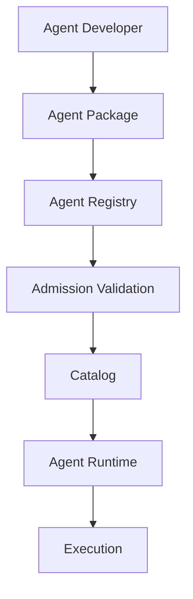

---

## 2. Registry Responsibilities

The Registry is responsible for:

- Agent identity;
- Agent metadata;
- version management;
- capability indexing;
- contract storage;
- dependency declarations;
- resource profiles;
- permission declarations;
- health status;
- compatibility information;
- release channels;
- promotion state;
- deprecation state;
- rollback metadata;
- discovery APIs;
- audit history.

It MUST NOT execute Agents. Execution belongs to Agent Runtime.

| Component | Responsibility |
|---|---|
| Registry | Catalog and governance |
| Runtime | Execution |
| Orchestrator | Workflow decisions |
| Evaluator | Quality assessment |
| Learning System | Improvement signals |
| Package Store | Artifact storage |

---

## 3. Agent Identity

Every Agent receives a globally unique logical identifier.

Recommended format:

```text
<domain>.<subdomain>.<capability>.<role>
```

Examples:

```text
research.trends.youtube.topic_discovery
content.script.longform.writer
character.personality.dialogue
character.wardrobe.stylist
social.audience.comment_analyzer
analytics.youtube.retention_optimizer
```

Identity MUST remain stable across implementation versions.

---

## 4. Identity vs Version

Agent identity and implementation version are separate concepts.

```text
Agent Identity
     │
     ├── v1.0.0
     ├── v1.1.0
     ├── v1.2.0
     └── v2.0.0
```

A version change MUST NOT silently create a new identity unless the capability contract has fundamentally changed.

---

## 5. Agent Manifest

Minimum manifest:

```yaml
agent:
  id: content.script.longform.writer
  version: 1.2.0
  display_name: Longform Script Writer
  description: Generates structured long-form scripts.
  owner: omnis-content
  status: candidate
  capabilities:
    - script_generation
    - narrative_structure
  runtime:
    protocol: agent-runtime-v1
  contracts:
    input: schemas/script-input.v1.json
    output: schemas/script-output.v1.json
```

The manifest is the Registry's primary metadata object.

---

## 6. Registry Object Model

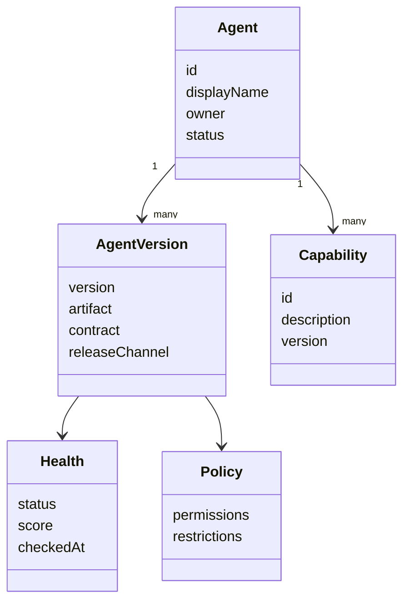

---

## 7. Capability Model

Capabilities describe what an Agent can do, not how it does it.

```yaml
capability:
  id: topic_discovery
  version: 1
  inputs:
    - niche
    - audience
    - timeframe
  outputs:
    - ranked_topics
  quality_dimensions:
    - relevance
    - novelty
    - evidence
```

Capabilities are indexed for discovery.

---

## 8. Capability Discovery

Runtime may ask:

```text
Find Agents capable of:
  capability = topic_discovery
  input = niche + audience
  output = ranked_topics
  quality >= target
  latency <= target
```

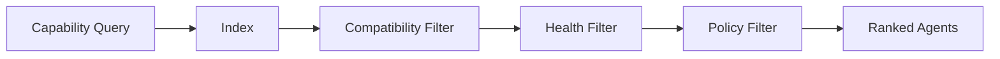

---

## 9. Discovery Ranking

Candidate ranking may consider:

```text
Capability Match
+ Quality Score
+ Reliability
+ Latency
+ Cost
+ Availability
+ Historical Task Success
+ Domain Expertise
```

The ranking function MUST be configurable and observable.

---

## 10. Agent Lifecycle

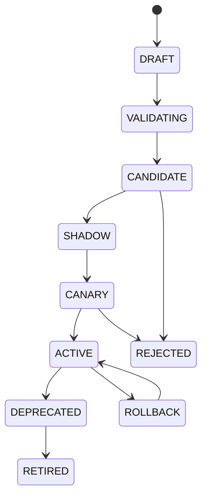

Every lifecycle transition MUST have an actor, timestamp and reason.

---

## 11. Release Channels

OMNIS supports controlled channels:

```text
experimental
alpha
beta
candidate
stable
deprecated
```

Channels allow different consumers to select different stability levels.

---

## 12. Versioning

Semantic versioning SHOULD be used.

```text
MAJOR.MINOR.PATCH
```

Interpretation:

| Change | Version |
|---|---|
| Breaking contract | MAJOR |
| Backward-compatible capability | MINOR |
| Bug / internal fix | PATCH |

Agent versions MUST be immutable after publication.

---

## 13. Immutable Releases

Once `1.2.0` is published, its executable artifact and contract cannot be modified in place.

```text
v1.2.0 ───────────── immutable
                         │
                         └── audit references remain valid
```

Corrections require a new version.

---

## 14. Package Structure

```text
agent-package/
├── manifest.yaml
├── contracts/
│   ├── input.schema.json
│   └── output.schema.json
├── capabilities/
├── policies/
├── runtime/
├── tests/
├── evaluation/
└── README.md
```

Package layout SHOULD remain predictable for AI-assisted development.

---

## 15. Artifact Integrity

Every executable artifact MUST have integrity metadata.

```yaml
artifact:
  digest: sha256:...
  size_bytes: 123456
  media_type: application/zip
  created_at: 2026-08-16T12:00:00Z
```

Runtime MUST verify artifact integrity before execution.

---

## 16. Admission Pipeline

No Agent enters the production Registry without validation.

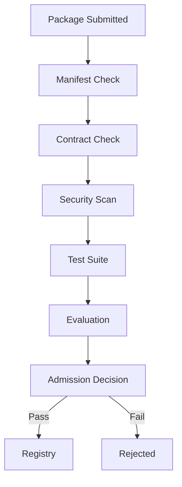

---

## 17. Manifest Validation

Required checks:

```text
Valid ID
Valid version
Owner exists
Capabilities exist
Schemas resolve
Runtime protocol supported
Resource profile valid
Permissions declared
```

Unknown fields may be rejected in strict mode.

---

## 18. Contract Validation

Input and output schemas MUST be machine-readable.

```yaml
contract:
  input_schema_version: 1
  output_schema_version: 1
  backward_compatible: true
```

The Registry should validate compatibility before release.

---

## 19. Dependency Graph

Agents may depend on models, tools, services or other Agents.

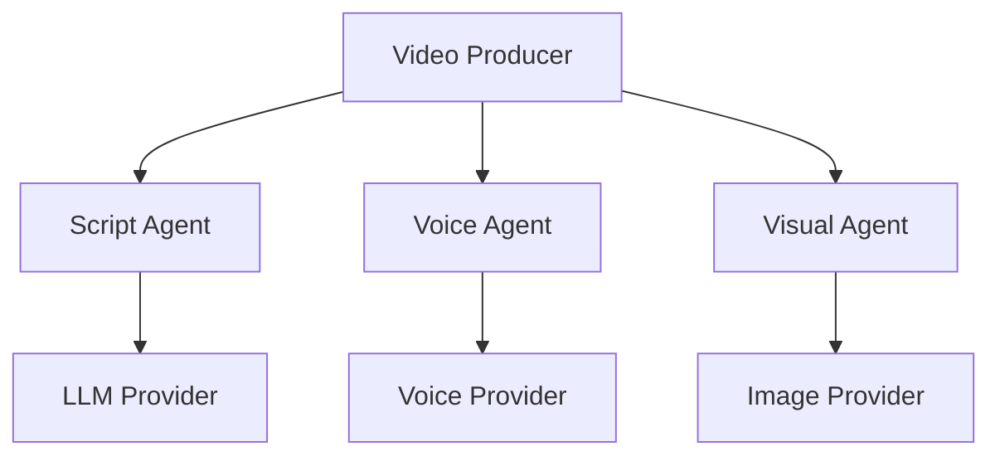

Dependencies MUST be explicitly declared.

---

## 20. Dependency Constraints

```yaml
dependencies:
  runtime: ">=1.0 <2.0"
  memory_gateway: "^2.1"
  tools:
    - web.search@^1.4
  agents:
    - fact_check@^2.0
```

Incompatible dependencies must prevent activation.

---

## 21. Compatibility Matrix

Registry maintains compatibility information.

| Agent | Runtime | Contract | Model | Status |
|---|---|---|---|---|
| script@1.2 | 1.x | v1 | model-A | compatible |
| script@2.0 | 2.x | v2 | model-B | compatible |
| script@1.0 | 1.x | v1 | model-C | legacy |

Compatibility checks occur before dispatch.

---

## 22. Health Model

Health is multi-dimensional.

```text
Operational Health
├── Availability
├── Error Rate
├── Dependency Health
├── Latency
├── Resource Stability
└── Recent Failure Rate
```

Quality is tracked separately.

---

## 23. Health Score

Conceptual health score:

```text
Health =
  Availability
+ Reliability
+ Dependency Stability
+ Latency Stability
- Error Rate
```

The score is normalized and versioned.

---

## 24. Health States

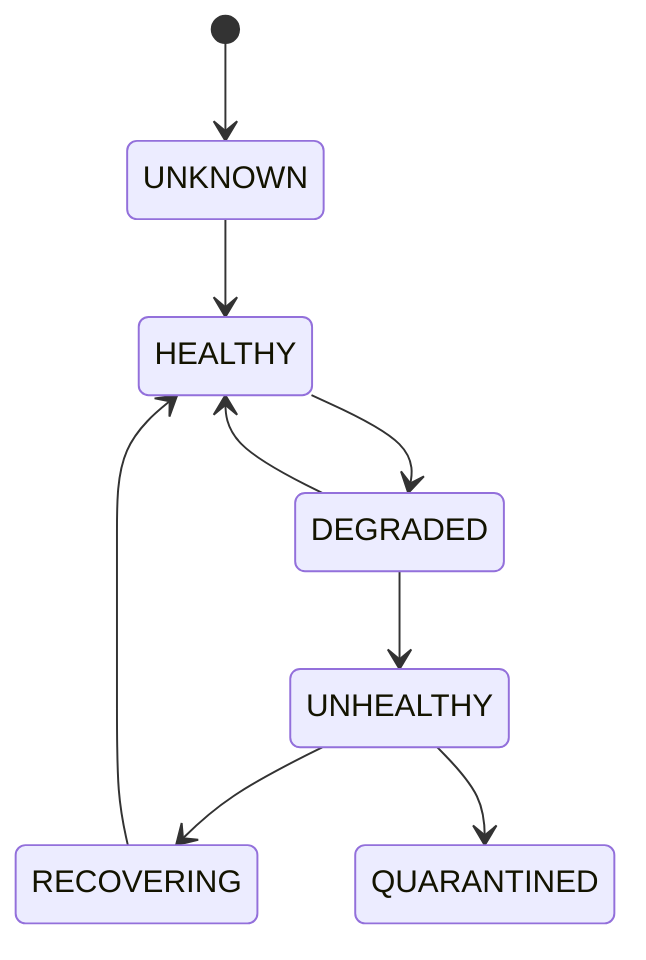

Quarantined Agents must not receive ordinary production traffic.

---

## 25. Health Checks

Checks may include:

```text
Process startup
Dependency connectivity
Model availability
Tool availability
Memory access
Contract execution
Synthetic test
```

Health probes MUST avoid destructive side effects.

---

## 26. Quality Profile

Each Agent version may maintain a quality profile.

```yaml
quality:
  overall: 0.91
  correctness: 0.94
  relevance: 0.92
  consistency: 0.89
  latency: 0.87
  cost_efficiency: 0.83
  sample_count: 18420
```

Scores MUST include sample size and evaluation period.

---

## 27. Quality vs Reliability

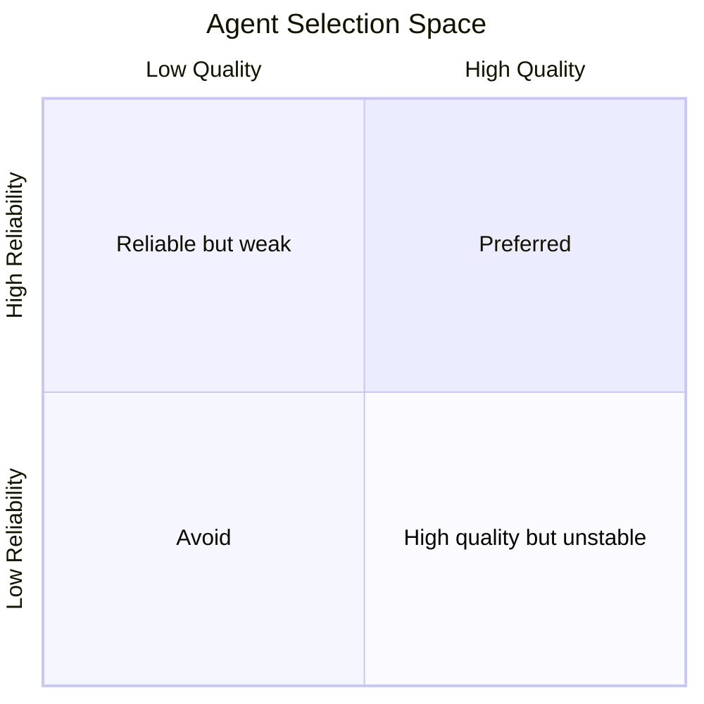

Routing SHOULD prefer Agents in the preferred region.

---

## 28. Evaluation History

The Registry stores references to evaluation results rather than replacing the Evaluation System.

```text
Agent Version
 ↓
Evaluation Runs
 ↓
Benchmark Results
 ↓
Quality Profile
 ↓
Routing Metadata
```

---

## 29. Shadow Deployment

New Agents can operate in shadow mode.

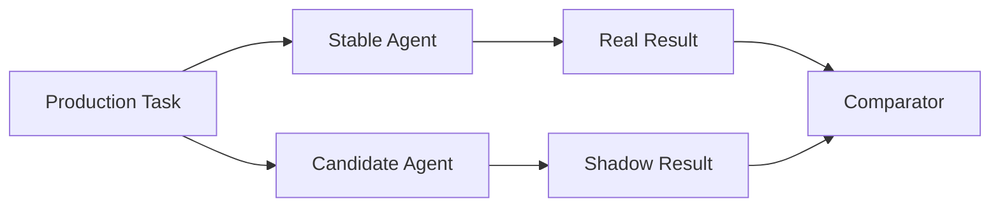

Shadow Agents must not perform unauthorized external side effects.

---

## 30. Canary Deployment

Canary gradually introduces a version.

```text
Stable:   95%
Candidate: 5%
```

Traffic percentages must be configurable.

---

## 31. Promotion Criteria

Promotion may require:

```text
minimum quality
minimum reliability
maximum error rate
maximum latency
maximum cost
zero critical policy violations
successful compatibility checks
```

Promotion rules are environment-specific.

---

## 32. Promotion Pipeline

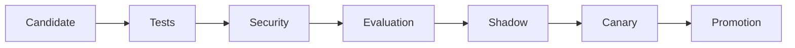

Every stage produces evidence.

---

## 33. Rollback

Rollback references an immutable known-good version.

```yaml
rollback:
  from: 2.1.0
  to: 2.0.4
  reason: quality_regression
  approved_by: governance
```

The Registry MUST preserve rollback history.

---

## 34. Deprecation

Deprecation is different from retirement.

```text
ACTIVE
  ↓
DEPRECATED
  ↓
RETIRING
  ↓
RETIRED
```

Deprecated Agents may continue serving existing workflows for a defined migration period.

---

## 35. Migration Metadata

```yaml
migration:
  replacement: content.script.writer@2.0
  deadline: 2026-12-01
  compatibility_adapter: script-v1-to-v2
```

Consumers should receive migration guidance during discovery.

---

## 36. Agent Aliases

Aliases provide stable logical references.

```text
content.script.writer@stable
content.script.writer@candidate
content.script.writer@latest
```

Aliases MUST resolve to immutable versions and their resolution MUST be auditable.

---

## 37. Pinned Versions

Production-critical workflows may pin exact versions.

```text
content.script.writer@2.0.4
```

Pinning increases reproducibility but reduces automatic improvements.

---

## 38. Version Constraints

Consumers may use constraints.

```text
^2.0
>=2.0 <3.0
2.0.x
```

The Registry resolves constraints deterministically using policy and compatibility rules.

---

## 39. Registry Query

Conceptual query:

```yaml
query:
  capability: audience.comment_analysis
  version: ^2.0
  quality_min: 0.85
  latency_max_ms: 1500
  cost_max_usd: 0.01
  release_channel: stable
```

Response should contain ranked candidates and evidence.

---

## 40. Discovery Response

```yaml
candidates:
  - agent: social.audience.comment_analyzer
    version: 2.4.1
    score: 0.94
    health: 0.98
    quality: 0.93
    estimated_cost: 0.004
    estimated_latency_ms: 820
```

---

## 41. Fleet View

The Registry should expose an operational fleet view.

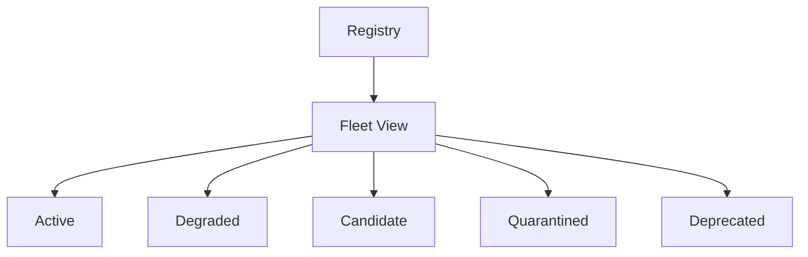

Fleet state is useful for operators and AI management systems.

---

## 42. Agent Ownership

Every Agent requires an owner.

```yaml
owner:
  team: omnis-content
  contact: internal
  escalation_policy: standard
```

Ownership defines responsibility for maintenance and incidents.

---

## 43. Domain Tags

Agents may be tagged by domain.

```text
content
research
character
social
audience
analytics
finance
security
media
orchestration
```

Tags improve discovery and fleet organization.

---

## 44. Expertise Profile

Some Agents become specialized through experience.

```yaml
expertise:
  domains:
    gaming:
      score: 0.94
      sample_count: 12000
    history:
      score: 0.62
      sample_count: 1200
```

Expertise metadata can improve Agent routing.

---

## 45. Learning Metadata

The Registry stores links to learning history.

```text
Agent
 ↓
Experiences
 ↓
Evaluation
 ↓
Skill Update
 ↓
New Candidate Version
```

The Registry remains the catalog; Learning System owns learning logic.

---

## 46. Character Agent Families

OMNIS may contain families of specialized Character Agents.

```text
character.virtual_creator
├── identity
├── personality
├── dialogue
├── voice
├── appearance
├── wardrobe
├── hair
├── makeup
├── health_state
├── knowledge
├── audience
└── continuity
```

Registry treats these as independently addressable capabilities while allowing composition into a Character Runtime.

---

## 47. Agent Composition

Multiple Agents may form a logical composite.

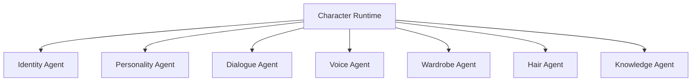

Composition metadata MUST declare dependencies and precedence.

---

## 48. Capability Conflict

Two Agents may provide overlapping capabilities.

Resolution factors:

```text
explicit preference
quality
health
cost
latency
specialization
policy
```

The Registry SHOULD expose the conflict rather than silently hiding it.

---

## 49. Exclusive Capabilities

Some capabilities may require exclusive ownership.

Example:

```text
character.identity.primary
```

Only one primary identity Agent may be active for a Character at a time.

---

## 50. Capability Composition

Capabilities can be composed.

```text
Research
 + Fact Check
 + Trend Analysis
 = Research Intelligence Pipeline
```

The Registry should support composition metadata without turning the Registry into the Orchestrator.

---

## 51. Policy Metadata

Each Agent declares requested permissions.

```yaml
permissions:
  network:
    - search
  memory:
    - character.read
  social:
    - comment.read
  publish: false
```

Runtime and Policy Engine decide whether permissions are actually granted.

---

## 52. Least Privilege

Declared permissions are maximum requested capabilities, not automatic grants.

```text
Agent Manifest
      ↓
Requested Permissions
      ↓
Policy Evaluation
      ↓
Granted Permissions
```

---

## 53. Sensitive Agent Classification

Agents handling sensitive operations require additional controls.

Examples:

```text
payment
account access
private messages
credential management
publishing
legal / compliance
```

These Agents may require human approval.

---

## 54. Registry Audit Trail

Every material Registry mutation must be auditable.

```text
Created
Updated Metadata
Published Version
Promoted
Rolled Back
Deprecated
Retired
Quarantined
Permissions Changed
```

Audit entries must be immutable.

---

## 55. Audit Event

```yaml
audit_event:
  type: agent.promoted
  agent_id: research.trends.youtube.topic_discovery
  version: 1.5.0
  actor: governance.system
  timestamp: 2026-08-16T12:00:00Z
  reason: benchmark_passed
```

---

## 56. Registry Storage Model

Logical storage can be divided into:

```text
Registry Database
├── Agent identities
├── Versions
├── Capabilities
├── Contracts
├── Dependencies
├── Health
├── Quality
├── Policies
├── Releases
└── Audit references
```

Large artifacts remain in Package Store.

---

## 57. Package Store

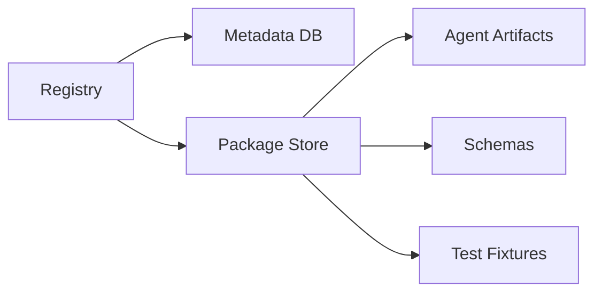

Registry stores references and metadata; Package Store stores immutable binaries and packages.

---

## 58. Registry API

Conceptual endpoints:

```text
registerAgent()
getAgent()
getAgentVersion()
searchAgents()
resolveCapability()
listVersions()
getHealth()
getQuality()
promoteVersion()
rollbackVersion()
deprecateVersion()
retireVersion()
```

---

## 59. Registration API

```yaml
register:
  manifest: manifest.yaml
  artifact_digest: sha256:...
  source_revision: git:abc123
```

Registration returns a validation report.

---

## 60. Validation Report

```yaml
validation:
  status: passed
  checks:
    manifest: passed
    contracts: passed
    security: passed
    tests: passed
    dependencies: passed
    policy: passed
```

Failed checks must include actionable diagnostics.

---

## 61. Git Integration

Agent packages SHOULD maintain source revision metadata.

```yaml
source:
  repository: github.com/afshin0095-lang/Omnis
  path: packages/agents/topic-discovery
  revision: abc123
```

This enables source-to-runtime traceability.

---

## 62. Build Provenance

```text
Source Revision
 ↓
Build
 ↓
Artifact Digest
 ↓
Registry Version
 ↓
Runtime Execution
```

Every production execution should be traceable back to source provenance.

---

## 63. AI-Assisted Development

Registry metadata MUST be sufficiently explicit for Codex, Claude Code and similar systems to understand Agent contracts without guessing.

Each Agent package should contain:

```text
README
ARCHITECTURE
CONTRACTS
EXAMPLES
TESTS
KNOWN_LIMITATIONS
```

---

## 64. Documentation Contract

Agent documentation should explain:

```text
Purpose
Inputs
Outputs
Capabilities
Dependencies
Permissions
Failure modes
Examples
Evaluation
Limitations
Version history
```

Documentation is part of the Agent package quality gate.

---

## 65. Registry Search for AI

AI systems should be able to query semantic metadata.

```text
"Find the best Agent that can analyze comments from Persian YouTube channels and cluster audience requests."
```

Registry may map natural-language requests to structured capability queries through an AI Discovery layer.

---

## 66. AI Discovery Layer

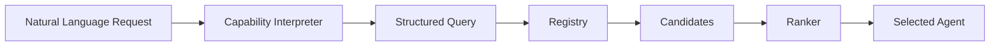

The AI layer MUST expose the resulting structured query for observability.

---

## 67. Registry Recommendations

The Registry may recommend Agents based on historical performance.

Recommendation evidence should include:

```text
quality
sample size
recent performance
cost
latency
health
specialization
```

Recommendations must never bypass policy.

---

## 68. Agent Reputation

Agents may accumulate reputation metadata.

```yaml
reputation:
  score: 0.91
  successful_tasks: 48210
  failed_tasks: 2100
  critical_incidents: 0
  last_30_days: 0.94
```

Reputation is an operational signal, not an absolute truth.

---

## 69. Freshness

Registry metrics require timestamps.

```yaml
metric:
  value: 0.94
  measured_at: 2026-08-16T11:00:00Z
  window: 30d
```

Stale metrics must not be treated as current health.

---

## 70. Quarantine

Agents can be quarantined when serious issues appear.

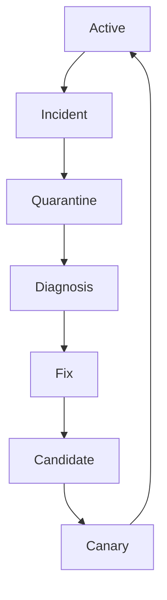

Quarantine must be reversible and auditable.

---

## 71. Incident Metadata

```yaml
incident:
  agent: content.script.writer
  version: 2.1.0
  severity: high
  detected_at: 2026-08-16T13:00:00Z
  symptom: quality_regression
  action: quarantine
```

---

## 72. Circuit Breaker

Registry may expose circuit-breaker state to Runtime.

```text
CLOSED → normal
OPEN → block traffic
HALF_OPEN → probe recovery
```

This prevents cascading failures.

---

## 73. Multi-Region Registry

Large OMNIS deployments may use regional Registry replicas.

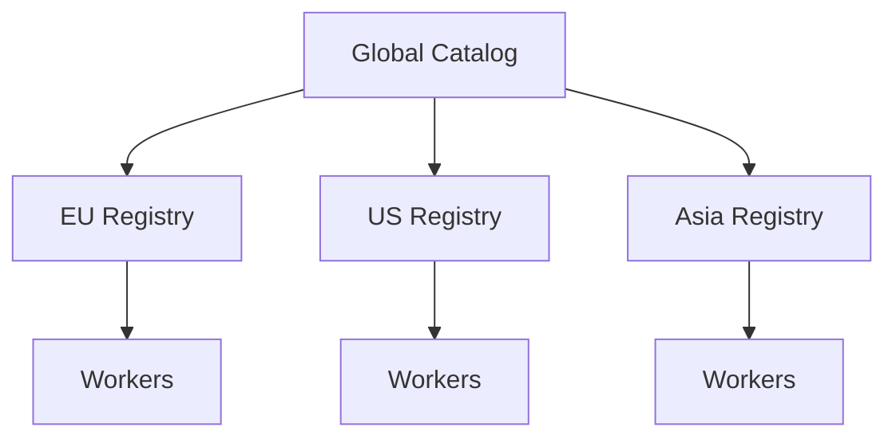

Global metadata and local operational health should be separated where necessary.

---

## 74. Consistency

Registry writes require strong consistency for lifecycle transitions.

Read replicas may be eventually consistent for search and analytics.

```text
Lifecycle / Promotion → strong consistency
Search / Analytics → eventual consistency acceptable
```

---

## 75. Caching

Agent discovery can be cached.

Cache keys should include:

```text
capability
version constraint
policy context
release channel
region
```

Lifecycle changes must invalidate affected caches.

---

## 76. Registry Events

Registry emits events such as:

```text
AgentRegistered
AgentVersionPublished
AgentPromoted
AgentRolledBack
AgentDeprecated
AgentRetired
AgentQuarantined
AgentHealthChanged
AgentQualityChanged
```

Runtime and Analytics consume these events.

---

## 77. Event Flow

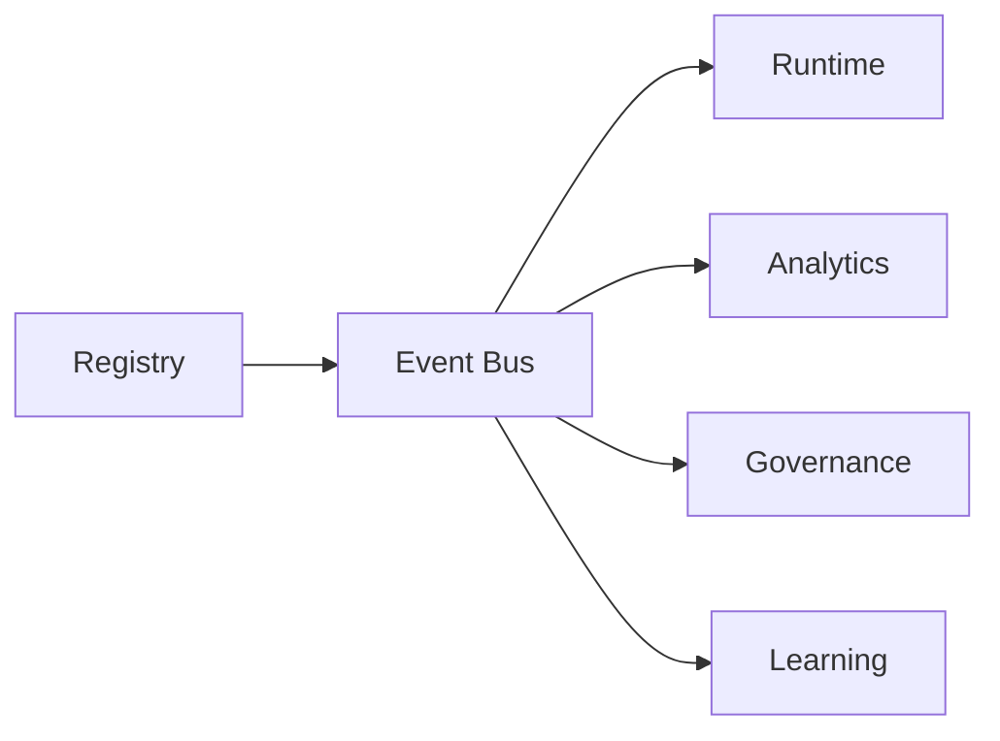

---

## 78. Fleet Analytics

Registry analytics should expose:

```text
Agent count
Active versions
Deprecated versions
Failure distribution
Quality distribution
Capability coverage
Unused Agents
Duplicate capabilities
Dependency hotspots
```

This helps prevent uncontrolled Agent proliferation.

---

## 79. Duplicate Detection

Multiple Agents may accidentally implement the same capability.

```text
Capability
├── Agent A
├── Agent B
├── Agent C
└── Agent D
```

Registry should identify overlap and allow operators to consolidate redundant implementations.

---

## 80. Capability Coverage

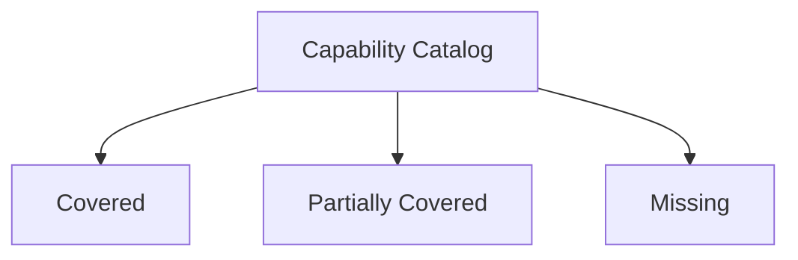

Missing capabilities become candidates for Agent Factory generation.

---

## 81. Agent Factory Integration

Agent Factory creates new Agent candidates.

```text
Capability Gap
 ↓
Agent Factory
 ↓
Generated Package
 ↓
Registry Admission
 ↓
Evaluation
 ↓
Candidate
```

Generated Agents MUST pass the same governance process as manually developed Agents.

---

## 82. Agent Factory Metadata

```yaml
provenance:
  generated_by: agent-factory
  specification: capability_gap_2026_0816
  parent_template: research-agent-v3
```

This makes generated Agent lineage visible.

---

## 83. Template Families

Registry may store templates for common Agent classes.

```text
Research Agent
Content Agent
Character Agent
Audience Agent
Analytics Agent
Tool Agent
Governance Agent
```

Templates accelerate safe Agent creation.

---

## 84. Agent Family Graph

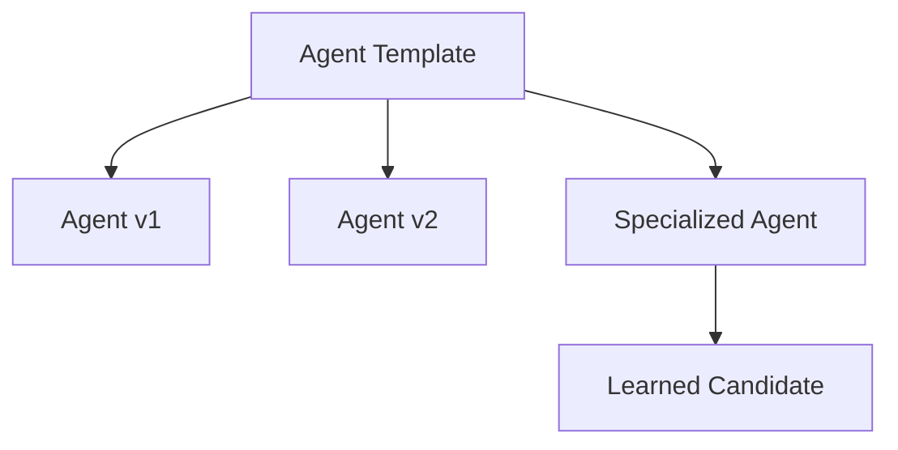

Lineage should remain traceable.

---

## 85. Experimental Agents

Experimental Agents may have weaker guarantees.

They MUST be isolated from stable traffic unless explicitly enabled.

```yaml
status: experimental
allowed_environments:
  - development
  - simulation
  - shadow
```

---

## 86. Production Admission

Production admission requires explicit evidence.

```text
✓ Contract
✓ Security
✓ Tests
✓ Evaluation
✓ Observability
✓ Ownership
✓ Rollback
✓ Documentation
✓ Policy
```

---

## 87. Operational Dashboard

Registry UI should visualize:

```text
Agent Fleet
Capability Map
Health
Quality
Versions
Dependencies
Incidents
Deployments
```

A graph-first UI is preferred for large fleets.

---

## 88. Dependency Visualization

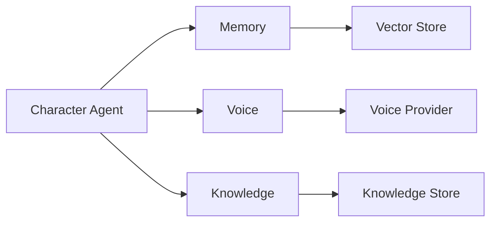

Operators should be able to identify dependency blast radius.

---

## 89. Blast Radius

When an Agent or dependency fails, Registry can identify affected consumers.

```text
Dependency Failure
 ↓
Reverse Dependency Index
 ↓
Affected Agents
 ↓
Affected Workflows
 ↓
Affected Channels
```

---

## 90. Dependency Risk Score

Conceptual risk:

```text
Risk =
Dependency Criticality
× Consumer Count
× Failure Probability
× Recovery Difficulty
```

Risk should influence maintenance priorities.

---

## 91. Agent Criticality

Agents may be classified:

```text
critical
high
normal
low
experimental
```

Critical Agents require stronger redundancy and recovery policies.

---

## 92. Redundancy

Critical capabilities should have fallback providers or Agents.

```mermaid
flowchart LR
    C[Critical Capability] --> A[Primary Agent]
    C --> B[Backup Agent]
    C --> D[Emergency Agent]
```

---

## 93. Availability Policy

```yaml
availability:
  minimum_healthy_instances: 2
  fallback_required: true
  max_error_rate: 0.03
```

The Registry provides policy metadata; Runtime enforces execution behavior.

---

## 94. Cost Profile

Each Agent version may declare expected cost.

```yaml
cost:
  estimated_per_execution_usd: 0.03
  token_profile: medium
  compute_profile: low
```

Actual costs come from Runtime telemetry.

---

## 95. Latency Profile

```yaml
latency:
  p50_ms: 700
  p95_ms: 1800
  p99_ms: 4200
  sample_window: 30d
```

Latency profiles support routing decisions.

---

## 96. Selection Contract

Registry selection returns evidence, not just an Agent ID.

```yaml
selection:
  agent: content.script.writer
  version: 2.0.4
  reasons:
    - capability_match
    - quality_target
    - healthy
    - cost_limit
  score: 0.93
```

This supports explainability.

---

## 97. Acceptance Criteria

Agent Registry v1 is accepted when:

- every Agent has stable identity;
- versions are immutable;
- capabilities are indexed;
- discovery supports constraints;
- manifests are validated;
- contracts are validated;
- dependencies are tracked;
- health is tracked;
- quality metadata is available;
- release channels exist;
- shadow and canary states exist;
- promotion is governed;
- rollback is supported;
- deprecation is supported;
- quarantine is supported;
- audit events are emitted;
- source provenance is traceable;
- Agent Factory integration is possible;
- fleet analytics are available.

---

## 98. Implementation Modules

Recommended module layout:

```text
registry/
├── core/
├── identity/
├── versions/
├── capabilities/
├── discovery/
├── contracts/
├── dependencies/
├── health/
├── quality/
├── releases/
├── promotion/
├── rollback/
├── quarantine/
├── provenance/
├── audit/
├── events/
├── storage/
├── api/
└── tests/
```

---

## 99. Integration Contract

```mermaid
flowchart TB
    FACTORY[Agent Factory] --> REG[Agent Registry]
    REG --> ORCH[Orchestrator]
    ORCH --> RT[Agent Runtime]
    RT --> AG[Agent]
    AG --> TOOLS[Tool Gateway]
    AG --> MEM[Memory Gateway]
    RT --> OBS[Observability]
    OBS --> EVAL[Evaluation]
    EVAL --> REG
    REG --> LEARN[Learning System]
    LEARN --> FACTORY
```

The Registry therefore becomes the controlled catalog connecting Agent creation, governance, execution and continuous improvement.

---

## 100. Final Registry Contract

The OMNIS Agent Registry MUST be treated as the authoritative source for **what Agents exist, what they can do, which versions are available, how trustworthy they are, what they depend on, what permissions they request, where they came from and whether they are eligible for execution**.

It MUST preserve immutable history while enabling controlled evolution.

It MUST be machine-readable enough for AI development systems to discover architecture and contracts without guessing.

It MUST expose enough metadata for Runtime, Orchestrator, Governance, Evaluation, Learning and Agent Factory to cooperate without collapsing their responsibilities into one service.

```mermaid
flowchart TB
    SPEC[Capability Specification] --> FACTORY[Agent Factory]
    FACTORY --> PACKAGE[Agent Package]
    PACKAGE --> ADMISSION[Admission]
    ADMISSION --> REG[Agent Registry]
    REG --> DISCOVERY[Capability Discovery]
    DISCOVERY --> ROUTING[Runtime Routing]
    ROUTING --> EXEC[Agent Runtime]
    EXEC --> OUT[Execution Outcome]
    OUT --> EVAL[Evaluation]
    EVAL --> REG
    EVAL --> LEARN[Learning]
    LEARN --> FACTORY
    REG --> GOV[Governance]
    REG --> OBS[Observability]
```

This closes the Registry lifecycle: **define → generate → validate → register → discover → execute → evaluate → learn → improve → register again**.
