# OMNIS Agent Runtime & Multi-Agent System Specification

> Version: 1.0.0  
> Status: Implementation Specification  
> Domain: Agent Runtime / Orchestration / Specialist Agents / Character OS

---

## 1. Purpose

The OMNIS Agent Runtime executes, coordinates and supervises specialized AI Agents operating across the platform.

The architecture is designed for hundreds or thousands of specialized agents without requiring every agent to run continuously.

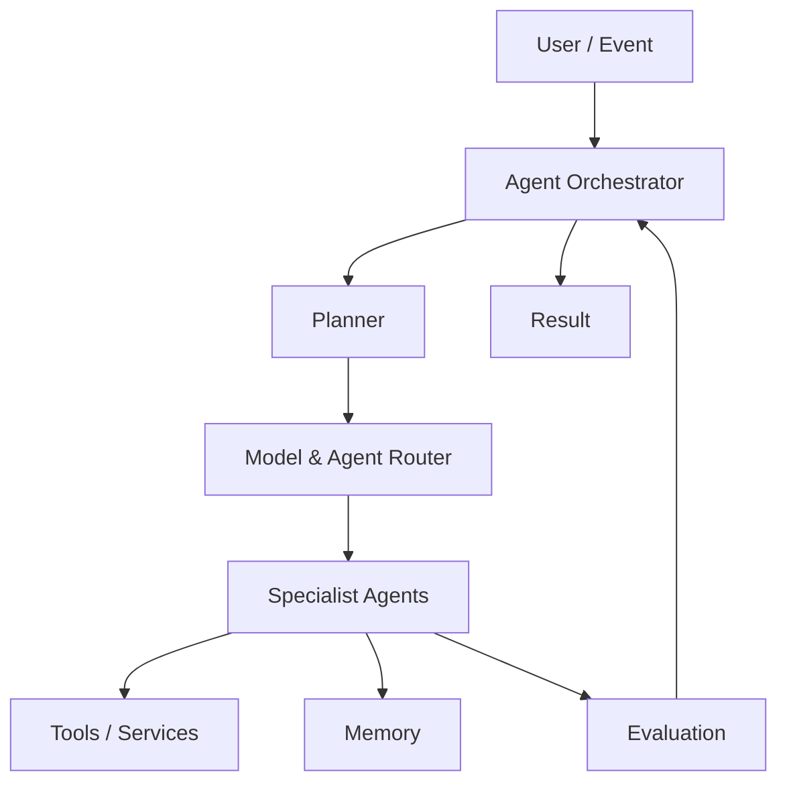

---

## 2. Core Principle

An Agent is an executable capability, not a personality prompt.

```text
Agent
= Goal
+ Capability
+ Policy
+ Tools
+ Context
+ Memory Access
+ Execution Strategy
+ Evaluation
```

---

## 3. Agent Registry

Every Agent is registered with metadata.

```yaml
agent:
  id: wardrobe.selector
  version: 1.0.0
  capabilities:
    - outfit_selection
  status: active
  max_concurrency: 20
```

---

## 4. Agent Classes

OMNIS supports:

```text
Planner Agents
Research Agents
Content Agents
Character Agents
Appearance Agents
Voice Agents
Audience Agents
Analytics Agents
Publishing Agents
Safety Agents
Evaluation Agents
Infrastructure Agents
```

---

## 5. Character Specialist Agents

Character OS may delegate to:

```text
Personality Agent
Memory Agent
Knowledge Agent
Skill Agent
Wardrobe Agent
Hair Agent
Beard Agent
Makeup Agent
Voice Agent
Emotion Agent
Audience Agent
Relationship Agent
```

---

## 6. Agent Lifecycle

```text
REGISTERED
 ↓
READY
 ↓
DISPATCHED
 ↓
RUNNING
 ↓
EVALUATING
 ↓
COMPLETED
```

Failures may transition to retry, escalation or cancellation.

---

## 7. Ephemeral Execution

Agents SHOULD be ephemeral by default.

```text
request
 ↓
spawn / allocate
 ↓
execute
 ↓
store result
 ↓
terminate
```

Persistent state belongs in governed stores, not in a continuously running Agent process.

---

## 8. Persistent Agent State

Long-lived Agent learning is stored externally.

```text
Agent
 ↓
Memory Store
 ↓
Skill Store
 ↓
Performance History
```

---

## 9. Agent Task

A task contains:

```yaml
task:
  id: task_001
  objective: select_outfit
  character_id: char_001
  priority: 0.8
  deadline: ...
  constraints: []
```

---

## 10. Task Decomposition

Complex objectives are decomposed into executable subtasks.

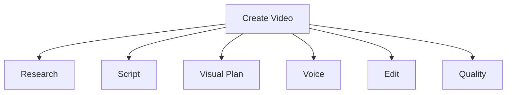

---

## 11. Planner

The Planner determines task dependencies and execution order.

```text
objective
 ↓
subtasks
 ↓
dependencies
 ↓
execution graph
```

---

## 12. Directed Acyclic Graph

Agent workflows are represented as DAGs where possible.

```text
Research → Script → Voice
Research → Visual
Voice + Visual → Edit
Edit → QA → Publish
```

---

## 13. Dependency Resolution

An Agent cannot execute until required dependencies are satisfied.

```text
Task A
 ↓
Task B
 ↓
Task C
```

---

## 14. Agent Router

The Router selects an Agent based on:

```text
capability
availability
cost
latency
quality
model compatibility
policy
priority
```

---

## 15. Model Router

Agent Runtime may select among multiple AI models.

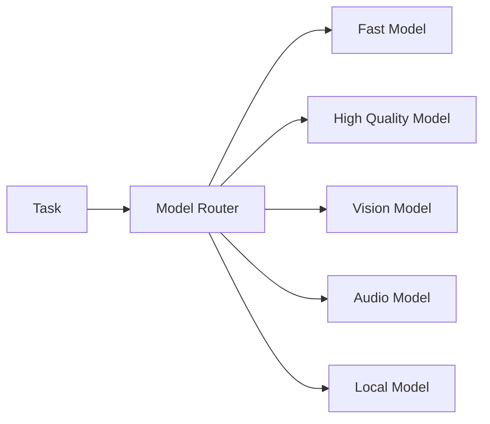

---

## 16. Capability Matching

Agent selection is capability-driven.

```text
required: image_generation
candidate A: image_generation ✓
candidate B: text_generation ✗
```

---

## 17. Tool Registry

Tools are registered independently from Agents.

```text
Agent
 ↓
Capability
 ↓
Tool Registry
 ↓
Tool
```

---

## 18. Tool Permissions

Each Agent receives explicit tool permissions.

```yaml
permissions:
  - web.search
  - image.generate
  - database.read
```

No implicit unrestricted access.

---

## 19. Credential Boundary

Agents never directly own publishing credentials.

```text
Agent
 ↓
Publishing Gateway
 ↓
Credential Vault
 ↓
Platform API
```

---

## 20. Context Assembly

Agent context is built from:

```text
task
character context
memory
knowledge
constraints
tool descriptions
prior results
```

---

## 21. Context Isolation

Each Agent receives minimum necessary context.

```text
Research Agent → research context
Wardrobe Agent → appearance context
Audience Agent → audience context
```

---

## 22. Shared Context

Agents can exchange structured artifacts instead of unrestricted conversation.

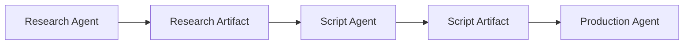

---

## 23. Agent Message

Messages SHOULD be structured.

```yaml
message:
  task_id: task_001
  sender: research.agent
  receiver: script.agent
  type: research_result
  payload: {}
  provenance: {}
```

---

## 24. Artifact Model

Artifacts are durable outputs of Agent work.

```text
ResearchArtifact
ScriptArtifact
VisualPlan
AudioArtifact
EditPlan
QAReport
```

---

## 25. Provenance

Every important artifact records:

```text
agent
model
version
inputs
sources
time
policy decisions
```

---

## 26. Agent Memory

Agents may have scoped memory.

```text
Agent memory
 ↓
specialized experience
 ↓
future task improvement
```

---

## 27. Memory Boundary

Agent memory MUST NOT automatically become Character memory.

```text
Agent observation
 ↓ validation
 ↓
Character memory candidate
```

---

## 28. Supervisor

The Supervisor monitors execution.

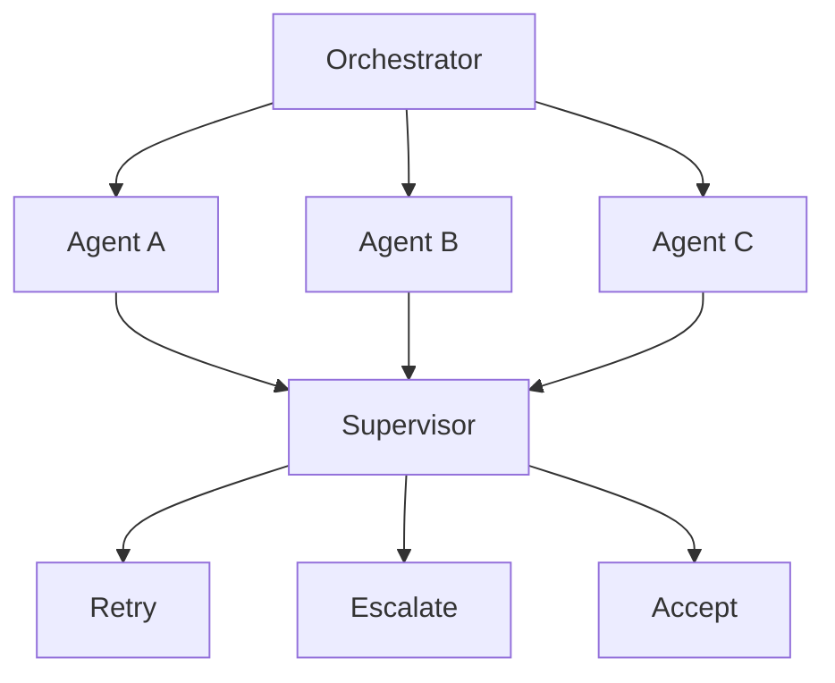

---

## 29. Evaluation Agent

Evaluation Agents independently assess outputs.

```text
producer
 ↓
artifact
 ↓
evaluator
 ↓
score
```

Producer and evaluator SHOULD be separated for critical workflows.

---

## 30. Quality Gates

Quality gates can inspect:

```text
factuality
identity consistency
visual consistency
audio consistency
policy compliance
brand compliance
technical validity
```

---

## 31. Retry Policy

Retries are bounded.

```text
failure
 ↓
classify
 ↓
retry if transient
 ↓
escalate if persistent
```

---

## 32. Failure Classification

```text
transient
provider failure
invalid input
policy rejection
quality failure
resource exhaustion
unknown
```

---

## 33. Escalation

Escalation moves unresolved tasks to a higher-capability Agent or human review when configured.

```text
specialist
 ↓ failure
supervisor
 ↓ failure
expert model / human review
```

---

## 34. Timeouts

Every task has an execution deadline.

```yaml
timeout:
  soft: 30s
  hard: 120s
```

---

## 35. Cancellation

Tasks can be cancelled when superseded, unsafe, obsolete or no longer valuable.

---

## 36. Priority Queue

The scheduler supports priority classes.

```text
critical
high
normal
low
background
```

---

## 37. Backpressure

When capacity is exhausted, the scheduler delays low-priority tasks rather than overwhelming providers.

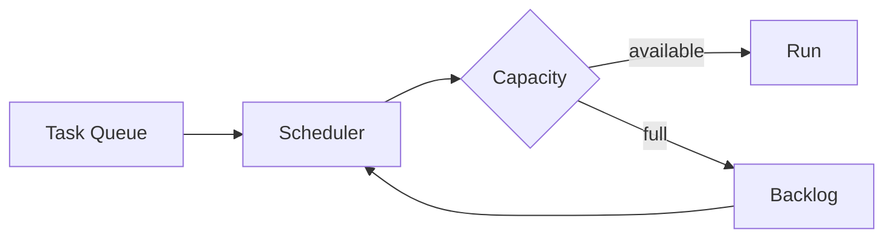

---

## 38. Concurrency

Each Agent declares concurrency limits.

```text
image.generate → 10
research.web → 30
publishing → 2
```

---

## 39. Rate Limiting

External provider limits are enforced centrally.

```text
Agent
 ↓
Rate Limiter
 ↓
Provider
```

---

## 40. Cost Governance

Every task can carry a cost budget.

```yaml
budget:
  max_usd: 0.50
  priority: quality
```

---

## 41. Model Fallback

Provider failure can trigger controlled fallback.

```text
Primary model
 ↓ failure
Secondary model
 ↓ failure
Local / deferred execution
```

---

## 42. Quality-Aware Routing

Fallback must consider quality requirements rather than blindly switching models.

---

## 43. Agent Teams

Complex workflows can form temporary Agent teams.

```text
Team
├── Lead
├── Researcher
├── Producer
├── Reviewer
└── QA
```

---

## 44. Team Coordination

The Lead Agent coordinates artifacts and dependencies.

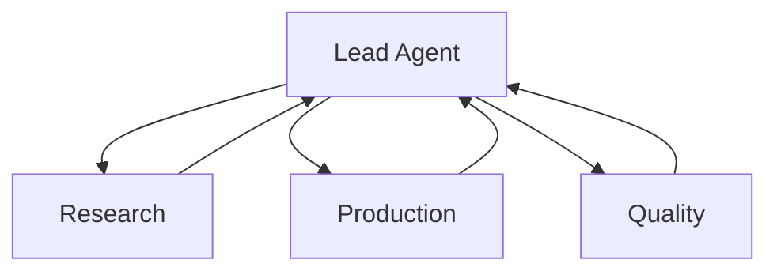

---

## 45. Debate / Review

For high-value tasks, multiple Agents may independently generate proposals.

```text
Agent A → proposal A
Agent B → proposal B
Agent C → proposal C
        ↓
Reviewer
        ↓
selected proposal
```

---

## 46. Consensus

Consensus is optional and should be used when disagreement is meaningful.

---

## 47. Agent Learning

Agents learn from outcomes through performance records.

```text
task
 ↓
result
 ↓
feedback
 ↓
performance history
 ↓
policy / strategy update
```

---

## 48. Agent Skill Model

```yaml
skill:
  capability: thumbnail_analysis
  level: 0.71
  evidence: 86
  success_rate: 0.79
```

---

## 49. Strategy Memory

Agents may maintain strategy hypotheses.

```text
hypothesis
 ↓
experiment
 ↓
result
 ↓
confidence
```

---

## 50. Experimentation

Agents should distinguish proven procedures from experiments.

```text
PROVEN
EXPERIMENTAL
UNKNOWN
```

---

## 51. Self-Evaluation

Agents can evaluate their own confidence but self-evaluation is not sufficient for critical acceptance.

---

## 52. Independent Evaluation

Critical outputs require independent evaluation.

```text
Producer ≠ Evaluator
```

---

## 53. Planner Verification

The Supervisor verifies that planned tasks are actually executed.

---

## 54. Tool Failure Handling

Tool failures are represented as structured errors.

```yaml
error:
  code: PROVIDER_TIMEOUT
  retryable: true
  provider: example
```

---

## 55. Idempotency

Consequential tasks SHOULD support idempotency keys.

```text
publish_video + idempotency_key
```

This prevents duplicate publication.

---

## 56. Transaction Boundaries

External side effects occur through explicit gateways.

```text
planning
 ↓
approval
 ↓
side effect
```

---

## 57. Dry Run

Agents can simulate execution before committing side effects.

```text
PLAN
 ↓
DRY RUN
 ↓
VALIDATE
 ↓
EXECUTE
```

---

## 58. Policy Engine

Policy checks are independent from Agent instructions.

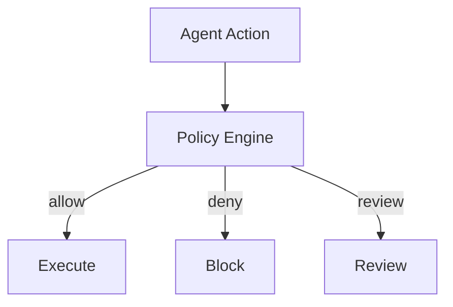

---

## 59. Prompt Injection Defense

External content is untrusted data.

```text
web page
comment
PDF
DM
 ↓
UNTRUSTED DATA
 ↓
parser
 ↓
Agent context
```

Instructions embedded in external content MUST NOT automatically become Agent instructions.

---

## 60. Agent Sandboxing

High-risk tools run inside isolated execution environments.

```text
Agent
 ↓
Sandbox
 ↓
Tool
```

---

## 61. Network Policy

Agents receive explicit network permissions.

---

## 62. Filesystem Policy

Agents receive scoped filesystem access.

```text
workspace/project
 ✓
secrets/
 ✗
other_character/
 ✗
```

---

## 63. Data Access

Database access is least-privilege.

```text
read character context
write artifact
no unrestricted database access
```

---

## 64. Agent Identity

Each execution receives a traceable execution identity.

```yaml
execution:
  id: exec_123
  agent: research.agent
  task: task_001
```

---

## 65. Observability

Track:

```text
latency
cost
tokens
tool calls
success rate
failure rate
quality score
```

---

## 66. Distributed Tracing

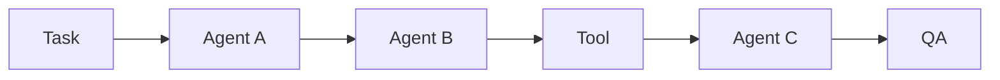

Every node participates in one trace.

---

## 67. Event Bus

Agents communicate asynchronously through an event bus where appropriate.

```text
Event
 ↓
Bus
 ↓
Subscribers
```

---

## 68. Event Types

```text
TaskCreated
TaskStarted
TaskCompleted
TaskFailed
ArtifactCreated
ReviewCompleted
CharacterUpdated
ContentPublished
```

---

## 69. Scheduling

The scheduler combines:

```text
priority
deadline
cost
resource availability
dependencies
provider limits
```

---

## 70. Long-Running Workflows

Long workflows use durable orchestration.

```text
workflow
 ↓ checkpoint
 ↓ wait
 ↓ resume
```

The system must survive process restarts.

---

## 71. Human Review

Human review can be inserted at configured gates.

```text
Agent output
 ↓
risk score
 ↓
low → automatic
high → human review
```

---

## 72. Approval Policies

Publishing, credential changes and other consequential operations may require explicit approval depending on policy.

---

## 73. Agent Communication Contract

Agent communication uses typed schemas rather than free-form hidden assumptions.

```text
sender
receiver
task_id
artifact_id
schema_version
payload
provenance
```

---

## 74. Schema Versioning

Agent messages and artifacts are versioned.

```text
schema v1
 ↓
schema v2
```

Compatibility rules prevent silent corruption.

---

## 75. Agent Discovery

Agents can advertise capabilities.

```text
capability
quality range
latency
cost
availability
```

---

## 76. Agent Marketplace Concept

Future OMNIS versions may support pluggable internal or external Agent packages.

All packages remain subject to policy and sandboxing.

---

## 77. Agent Templates

Common Agents can be instantiated from templates.

```text
ResearchAgentTemplate
AudienceAgentTemplate
WardrobeAgentTemplate
QAAgentTemplate
```

---

## 78. Agent Specialization

Agents can specialize through accumulated experience.

```text
base agent
 ↓
experience
 ↓
specialization
 ↓
expert agent
```

---

## 79. Agent Retirement

Poorly performing Agents can be deprecated.

```text
active
 ↓
under review
 ↓
deprecated
 ↓
archived
```

---

## 80. Agent Versioning

Agent prompts, tools, policies and model configurations are versioned.

```text
Agent v1
 ↓
Agent v2
```

---

## 81. Reproducibility

Critical executions record enough metadata to reproduce or audit decisions.

```text
model
prompt version
agent version
tools
inputs
random seed where supported
```

---

## 82. Deterministic Boundaries

Where deterministic behavior is required, randomness is isolated and controlled.

---

## 83. Non-Deterministic Generation

Creative generation may remain stochastic within configured quality boundaries.

---

## 84. Agent Output Contract

Every Agent returns:

```yaml
result:
  status: success
  artifact_id: art_001
  confidence: 0.82
  warnings: []
  provenance: {}
```

---

## 85. Confidence Propagation

Downstream Agents receive uncertainty with upstream artifacts.

```text
research confidence 0.82
 ↓
script confidence 0.76
 ↓
production confidence 0.74
```

---

## 86. Uncertainty Handling

Agents should preserve uncertainty instead of converting unknown information into false certainty.

---

## 87. Multi-Agent Content Factory

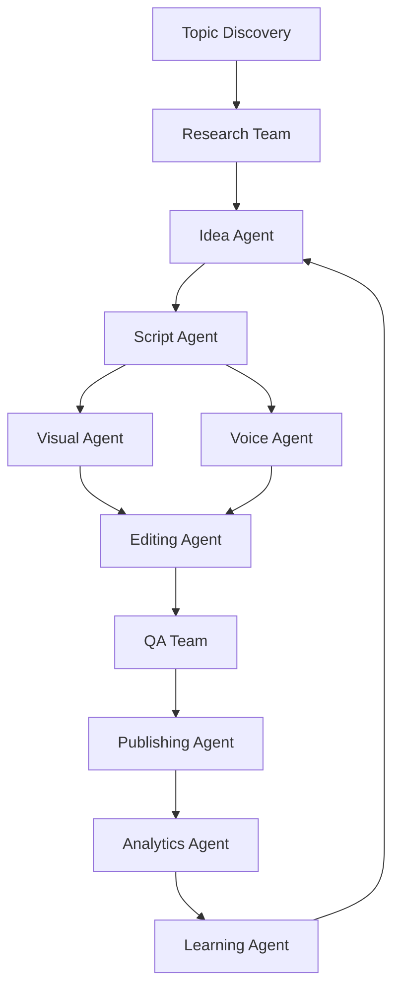

---

## 88. Character-Aware Orchestration

Every Character task receives the Character OS context relevant to the task.

```text
Task
 ↓
Character OS
 ↓
Agent Runtime
 ↓
Specialists
```

---

## 89. Character Agent Team

A Character may have a virtual internal team.

```text
Character
├── Manager Agent
├── Research Agent
├── Content Agent
├── Style Agent
├── Audience Agent
└── QA Agent
```

---

## 90. Audience Intelligence Team

Audience Agents aggregate:

```text
comments
DMs
community posts
requests
retention signals
feedback
```

They produce structured demand artifacts for the Content Factory.

---

## 91. Content Demand Queue

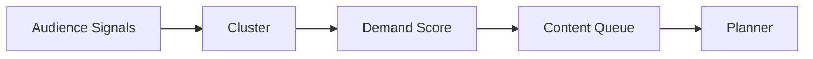

---

## 92. Learning Loop

Content performance feeds Agent learning.

```text
publish
 ↓
analytics
 ↓
feedback
 ↓
Agent learning
 ↓
next workflow
```

---

## 93. Agent Cooperation With Character Learning

Agent learning may propose updates to Character skills but Character OS owns the final state transition.

---

## 94. Supervisor Authority

The Supervisor can:

```text
pause
retry
cancel
reroute
escalate
request review
```

It cannot bypass policy.

---

## 95. Agent Runtime API

Conceptual operations:

```text
registerAgent()
discoverCapabilities()
createTask()
planTask()
dispatchTask()
executeTask()
cancelTask()
retryTask()
evaluateTask()
storeArtifact()
```

---

## 96. Runtime Metrics

Required metrics include:

```text
agent utilization
queue latency
task completion rate
retry rate
cost per task
quality per task
model fallback rate
policy rejection rate
```

---

## 97. Testing

Required tests:

```text
unit tests
contract tests
orchestration tests
failure tests
security tests
sandbox tests
load tests
chaos tests
quality regression tests
```

---

## 98. Scale Target

The architecture MUST support at least:

```text
1000+ registered Agent definitions
100+ concurrent workflows
10000+ scheduled tasks
hundreds of Characters
```

Actual deployment capacity depends on infrastructure and provider limits.

---

## 99. Canonical Agent Loop

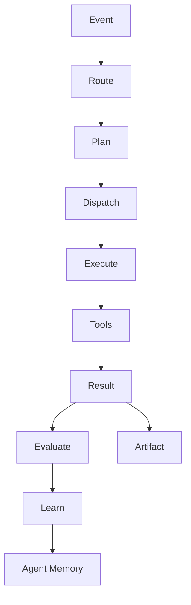

---

## 100. Final Contract

The OMNIS Agent Runtime is the execution fabric connecting Character OS, memory, models, tools, content workflows and learning systems.

```text
EVENT
 ↓
ORCHESTRATION
 ↓
SPECIALIST AGENTS
 ↓
TOOLS + MODELS + MEMORY
 ↓
ARTIFACT
 ↓
EVALUATION
 ↓
LEARNING
 ↓
BETTER FUTURE EXECUTION
```

The architecture MUST remain modular, observable, policy-controlled, horizontally scalable and capable of coordinating thousands of specialized Agents while preserving Character isolation, provenance, reliability, cost control and continuous learning.