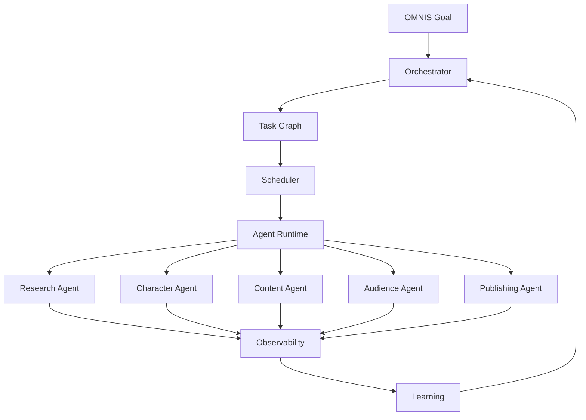
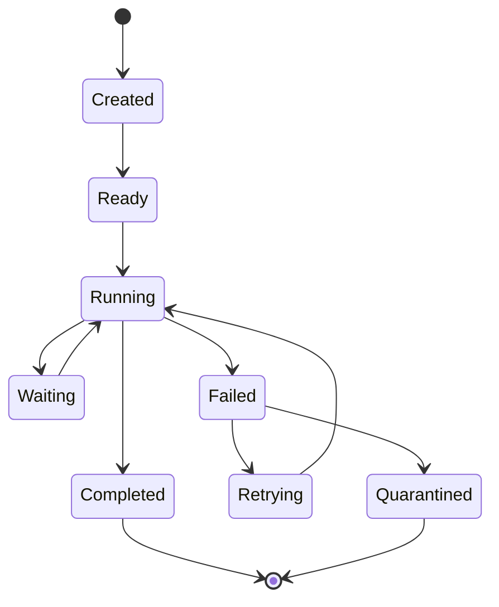
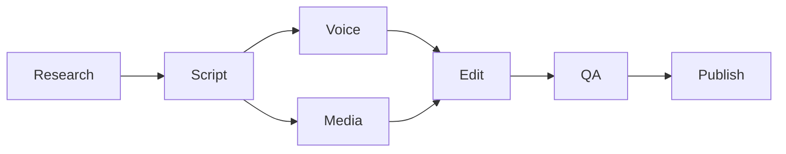
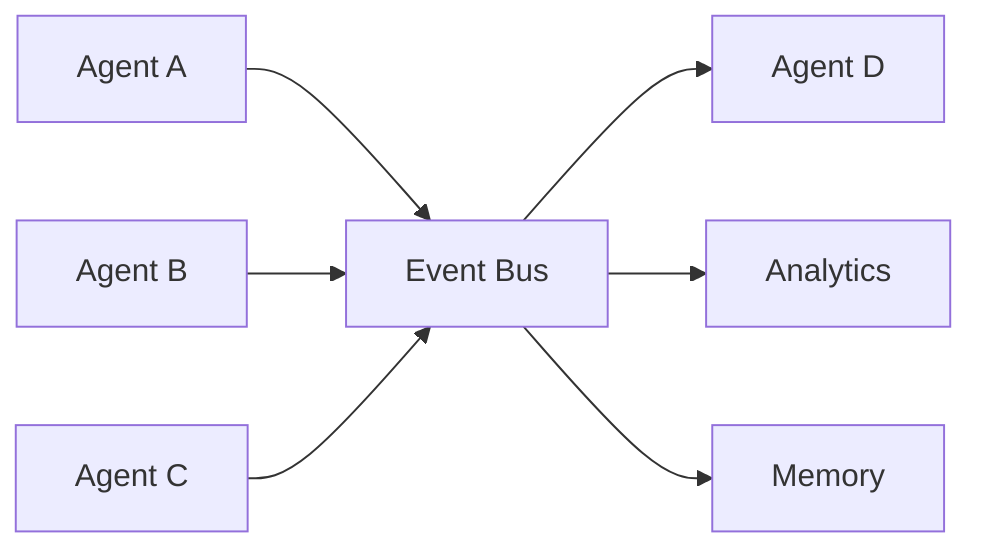
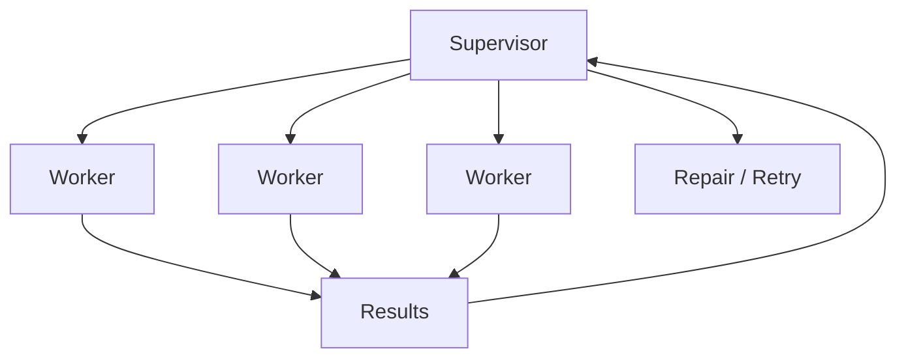
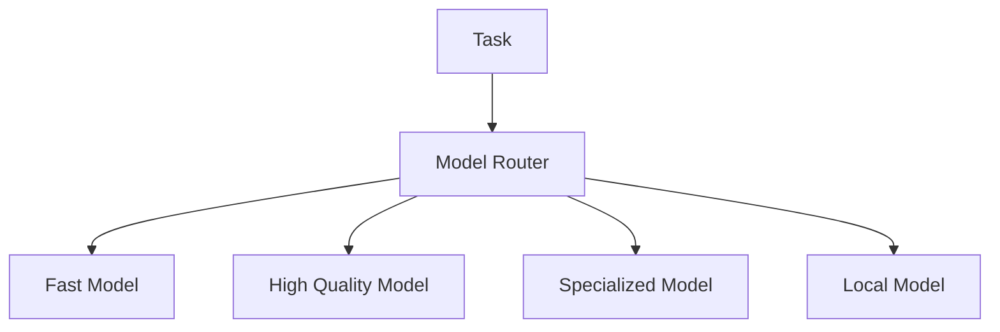

# OMNIS Agent Runtime & Orchestration Specification

> Version: 1.0.0  
> Status: Architecture Specification  
> Domain: Agent Runtime / Multi-Agent Orchestration / Scheduling / Delegation / Supervision / Recovery

## 1. Purpose

The Agent Runtime is the execution substrate for OMNIS agents. It enables thousands of specialized agents and sub-agents to perform bounded work while preserving identity, context, permissions, observability, resource budgets and system-wide goals.



## 2. Core Principle

An agent is a bounded worker with a clear responsibility, not an unrestricted autonomous process.

```text
Agent
=
Role
+ Goal
+ Context
+ Tools
+ Permissions
+ Memory
+ Budget
+ Policy
+ Output Contract
```

## 3. Agent Identity

Every agent receives a stable identifier and versioned definition.

```yaml
agent:
  id: agent.research.topic
  version: 1
  role: research
  status: active
```

## 4. Agent Classes

OMNIS supports:

```text
system agents
orchestrators
specialists
workers
reviewers
critics
monitors
learning agents
repair agents
```

## 5. Specialist Agents

A specialist owns a narrow domain.

Examples:

```text
weather agent
wardrobe agent
hair agent
beard agent
research agent
script agent
thumbnail agent
comment agent
analytics agent
```

## 6. Orchestrator Agents

Orchestrators coordinate multiple agents without necessarily performing the underlying work themselves.

## 7. Worker Agents

Workers execute atomic or bounded tasks.

## 8. Reviewer Agents

Reviewers validate outputs against explicit contracts.

## 9. Critic Agents

Critics search for weaknesses, inconsistencies and failure modes.

## 10. Repair Agents

Repair agents receive failed artifacts and attempt bounded corrections.

## 11. Agent Lifecycle



## 12. Task Model

Tasks are durable objects.

```yaml
task:
  id: task_001
  type: generate_script
  priority: 70
  status: queued
```

## 13. Task Contract

Each task defines:

```text
input
context
constraints
required tools
budget
deadline
output schema
validation rules
```

## 14. Task Graph

Complex work is represented as a directed acyclic graph where possible.



## 15. Dependency Resolution

A task becomes runnable only when required dependencies are satisfied.

## 16. Parallel Execution

Independent tasks execute concurrently when resources and policy permit.

## 17. Sequential Execution

Tasks with state dependencies execute in order.

## 18. Priority

Priority considers:

```text
business value
urgency
audience demand
trend window
deadline
resource cost
risk
```

## 19. Fairness

The scheduler prevents one workload from starving unrelated workloads.

## 20. Queues

OMNIS maintains logical queues by workload class.

```text
interactive
production
research
analytics
maintenance
learning
repair
```

## 21. Scheduling

The scheduler assigns runnable tasks to available execution capacity.

## 22. Capacity

Capacity is tracked by:

```text
CPU
GPU
memory
provider quota
API rate limit
agent concurrency
```

## 23. Resource Budget

Every task can have a bounded resource budget.

```yaml
budget:
  max_tokens: 20000
  max_tool_calls: 40
  timeout_seconds: 900
```

## 24. Budget Enforcement

Agents cannot silently exceed assigned budgets.

## 25. Tool Registry

Tools are registered capabilities with explicit contracts.

```yaml
tool:
  id: web.search
  permissions: [research]
```

## 26. Tool Permissions

An agent may call only tools granted by its policy.

## 27. Capability-Based Security

Permissions are attached to capabilities rather than relying solely on agent names.

## 28. Context Envelope

Each execution receives a bounded context envelope.

```text
identity
objective
task
relevant memory
relevant knowledge
constraints
permissions
budget
```

## 29. Context Isolation

Agents should not receive unrelated private or sensitive data.

## 30. Memory Access

Memory access is scoped to the task and Character where applicable.

## 31. Shared State

Shared state is accessed through explicit stores rather than uncontrolled global memory.

## 32. Agent Messaging

Agents communicate through typed messages.

```yaml
message:
  from: agent.research
  to: agent.script
  type: research.completed
  payload_ref: artifact_001
```

## 33. Event Bus

The event bus decouples producers from consumers.



## 34. Request/Response

Direct request/response is used when an immediate result is required.

## 35. Asynchronous Messaging

Long-running work uses asynchronous messages and durable task state.

## 36. Delegation

An orchestrator may delegate work to a specialist.

```text
Goal
 ↓
Decompose
 ↓
Delegate
 ↓
Execute
 ↓
Validate
 ↓
Merge
```

## 37. Delegation Contract

Delegation must specify expected output, deadline and validation criteria.

## 38. Recursive Delegation

Agents may delegate only when their policy permits it and a maximum depth is enforced.

## 39. Delegation Depth

```yaml
max_delegation_depth: 4
```

This prevents uncontrolled agent spawning.

## 40. Dynamic Agent Creation

Temporary agents may be instantiated for specialized tasks.

## 41. Ephemeral Agents

Ephemeral agents have short lifetimes and minimal persistent state.

## 42. Persistent Agents

Persistent agents retain configuration and selected state across executions.

## 43. Agent Pools

Frequently used agent types may run through pooled workers.

```text
Agent Definition
      ↓
Worker Pool
 ├── Worker 1
 ├── Worker 2
 └── Worker N
```

## 44. Concurrency Limits

Each agent type can define maximum concurrent executions.

## 45. Backpressure

When downstream capacity is exhausted, producers receive backpressure rather than creating unlimited work.

## 46. Cancellation

Tasks can be cancelled before or during execution where supported.

## 47. Cooperative Cancellation

Workers periodically check cancellation state at safe boundaries.

## 48. Deadlines

Tasks can define hard or soft deadlines.

## 49. Timeout Handling

Expired tasks become timed-out failures and enter policy-defined recovery paths.

## 50. Retry Policy

Retries are bounded and error-aware.

```text
transient error
 ↓
backoff
 ↓
retry
 ↓
success / terminal failure
```

## 51. Retry Classification

```text
transient
rate_limited
timeout
validation
permission
fatal
```

## 52. Idempotency

Retryable operations must expose idempotency keys where side effects are possible.

## 53. Checkpointing

Long-running tasks may persist checkpoints.

## 54. Resume

A resumable task continues from the latest valid checkpoint rather than restarting unnecessarily.

## 55. Failure Isolation

One failed agent must not automatically fail unrelated tasks.

## 56. Circuit Breaker

Repeated provider or tool failures trigger temporary isolation.

```text
Healthy
 ↓ failures
Degraded
 ↓ threshold
Open
 ↓ recovery
Half-open
 ↓ success
Healthy
```

## 57. Quarantine

Misbehaving agent versions may be quarantined until reviewed.

## 58. Dead Letter Queue

Tasks that repeatedly fail are moved to a dead letter queue for analysis.

## 59. Human Escalation

Critical unresolved failures can be escalated to an operator.

## 60. Supervisor

Supervisor agents monitor worker execution and contract compliance.



## 61. Output Validation

Every important artifact is validated before downstream consumption.

## 62. Schema Validation

Structured outputs must match their declared schema.

## 63. Semantic Validation

Reviewers evaluate whether the artifact actually satisfies the task.

## 64. Policy Validation

Policy agents evaluate applicable restrictions and publishing boundaries.

## 65. Character Validation

Character-related outputs are checked against Character OS state.

## 66. Content Validation

Content artifacts are checked against production requirements.

## 67. Confidence

Agents should expose confidence where meaningful.

```yaml
result:
  confidence: 0.82
  evidence_refs: [source_01, source_02]
```

## 68. Evidence

Research outputs should include provenance references where possible.

## 69. Uncertainty

Agents must distinguish known facts, uncertain claims and assumptions.

## 70. Agent Memory

Agents may maintain operational memory separately from Character memory.

```text
Character Memory
≠
Agent Operational Memory
```

## 71. Agent Operational Memory

Examples:

```text
successful strategies
failed tool calls
provider quirks
task templates
```

## 72. Learning Feedback

Agent performance can be evaluated after execution.

## 73. Agent Skill

The system may track agent-level performance metrics.

```text
success rate
latency
cost
rework rate
quality score
```

## 74. Strategy Learning

Repeated performance data can improve routing and task decomposition.

## 75. Model Routing

Different tasks may use different AI models based on capability, latency, cost and quality requirements.



## 76. Model Selection

Routing may consider:

```text
task type
context length
reasoning requirement
multimodal requirement
latency
cost
availability
```

## 77. Fallback Models

If a preferred provider is unavailable, policy-approved alternatives may be selected.

## 78. Model Evaluation

Model performance is continuously measured against task outcomes.

## 79. Prompt Versioning

Agent instructions are versioned artifacts.

## 80. Policy Versioning

Agent policies are independently versioned from prompts.

## 81. Tool Versioning

Tool contracts and implementations are versioned.

## 82. Reproducibility

Important executions record versions of:

```text
agent
prompt
model
tools
policy
input snapshot
```

## 83. Execution Trace

Every significant execution generates a trace.

```text
Task
 ↓
Agent
 ↓
Model
 ↓
Tool calls
 ↓
Artifacts
 ↓
Validation
 ↓
Outcome
```

## 84. Observability

Runtime telemetry includes logs, metrics and distributed traces.

## 85. Runtime Metrics

```text
active agents
queued tasks
queue latency
execution latency
failure rate
retry rate
cost
throughput
```

## 86. Cost Accounting

Usage is attributed to task, agent, Character, channel, campaign and project where possible.

## 87. Budget Guard

The runtime can pause or downgrade work when a budget threshold is reached.

## 88. Priority Escalation

Urgent work may increase priority within policy-defined limits.

## 89. Starvation Prevention

Low-priority queues receive bounded scheduling opportunities.

## 90. Multi-Character Isolation

A Character's agents must not accidentally use another Character's private state.

## 91. Multi-Channel Isolation

Channel-specific configuration remains isolated while shared infrastructure is reused.

## 92. Multi-Tenant Isolation

Tenant boundaries apply to all task, memory, artifact and connector access.

## 93. Artifact Store

Agents exchange large outputs through durable artifact references rather than copying large payloads into messages.

## 94. Artifact Lifecycle

```text
created
 ↓
validated
 ↓
consumed
 ↓
retained / archived
```

## 95. Orchestration Transaction

A multi-agent workflow records a durable execution state.

```yaml
workflow:
  id: workflow_001
  status: running
  current_step: qa
```

## 96. Saga Recovery

Long workflows use compensating actions where rollback is impossible.

```text
publish failed
 ↓
mark derivative invalid
 ↓
remove from queue
 ↓
repair
 ↓
resubmit
```

## 97. Human-in-the-Loop

Human review can be inserted at configured checkpoints without redesigning the workflow.

## 98. Emergency Controls

Operators can pause agents, queues, providers or the entire runtime.

```text
GLOBAL PAUSE
      ↓
Schedulers stop issuing new work
      ↓
Workers finish safe checkpoints
```

## 99. Final Contract

The Agent Runtime is the execution fabric of OMNIS.

```text
GOAL
 ↓
DECOMPOSE
 ↓
SCHEDULE
 ↓
DELEGATE
 ↓
EXECUTE
 ↓
OBSERVE
 ↓
VALIDATE
 ↓
RECOVER
 ↓
LEARN
 ↓
IMPROVE ORCHESTRATION
```

The runtime MUST support large-scale multi-agent execution while enforcing bounded autonomy, explicit permissions, durable state, isolation, observability, cost controls, reproducibility, failure recovery and policy-aware orchestration.