# OMNIS Agent Runtime Specification

> Version: 1.0.0  
> Status: Implementation Specification  
> Domain: Agent Mesh  
> Scope: Execution lifecycle, isolation, scheduling, state, retries, cancellation, resource control, observability and recovery.

---

## 1. Purpose

Agent Runtime is the execution substrate of OMNIS. It turns an Agent definition plus a Task Contract into a controlled, observable and recoverable execution.

The Runtime MUST NOT own business logic that belongs to individual Agents. It provides lifecycle management, context construction, capability loading, permission enforcement, tool access, memory access, execution control, telemetry and result validation.

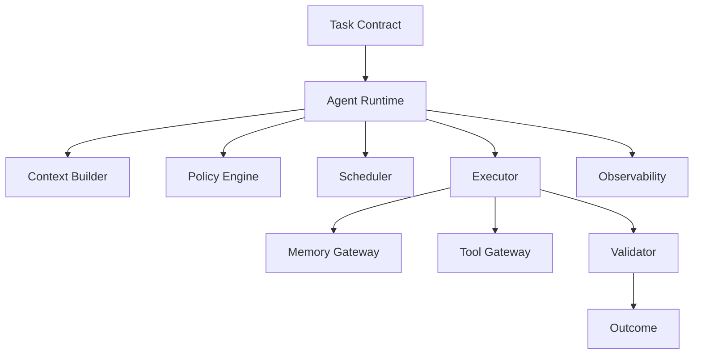

---

## 2. Runtime Responsibilities

The Runtime is responsible for:

- accepting valid task contracts;
- resolving an Agent version;
- building execution context;
- enforcing permissions;
- allocating resources;
- starting and stopping executions;
- persisting execution state;
- controlling retries;
- handling timeouts;
- collecting telemetry;
- validating outputs;
- emitting lifecycle events;
- recovering from transient failures;
- escalating unrecoverable failures.

The Runtime is NOT responsible for inventing domain-specific business decisions.

| Layer | Responsibility |
|---|---|
| Orchestrator | Decides what should happen |
| Runtime | Controls how an Agent executes |
| Agent | Performs domain work |
| Tool Gateway | Provides external capabilities |
| Memory Gateway | Provides authorized memory |
| Validator | Checks results |

---

## 3. Execution Unit

The fundamental Runtime unit is an `Execution`.

```yaml
execution:
  id: exec_01HXYZ
  task_id: task_01HABC
  agent_id: research.trends.youtube
  agent_version: 1.4.0
  status: queued
  priority: high
  created_at: 2026-08-16T12:00:00Z
  deadline: 2026-08-16T12:05:00Z
  attempt: 0
  max_attempts: 3
  budget:
    usd: 0.50
    tokens: 30000
```

An Execution MUST be uniquely identifiable and traceable across all Runtime components.

---

## 4. Lifecycle

The Runtime lifecycle is explicit and persisted.

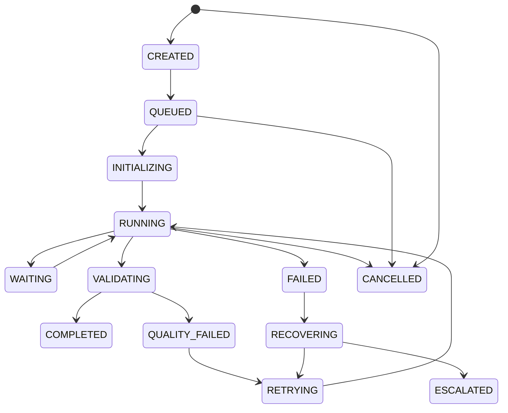

Every transition MUST be validated against the lifecycle state machine. Invalid transitions MUST be rejected.

---

## 5. State Model

Execution state is divided into four categories.

```text
Execution State
├── Identity State
├── Control State
├── Runtime State
└── Result State
```

Identity state contains task and Agent identifiers. Control state contains priority, deadline, cancellation and retry policy. Runtime state contains active tools, resources and checkpoints. Result state contains validated output, quality score and failure metadata.

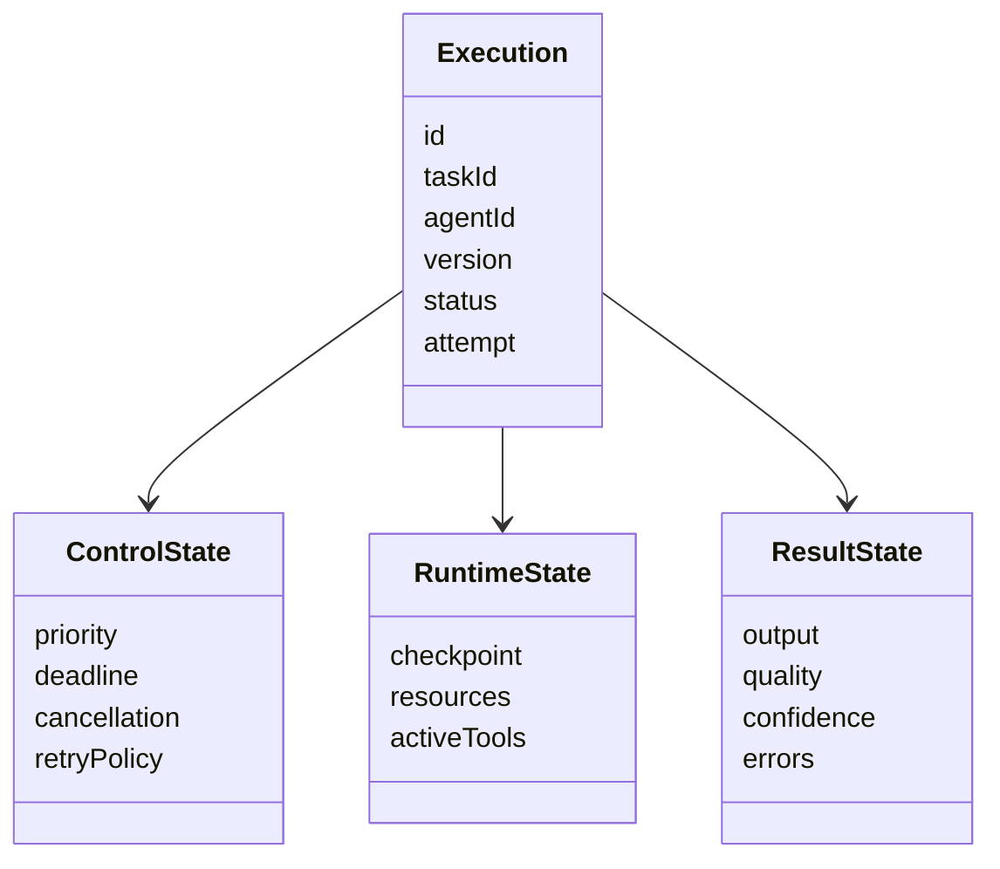

---

## 6. Context Construction

Before execution, Runtime constructs an isolated context.

```text
Execution Context
├── Agent Identity
├── Task Contract
├── User / Channel Context
├── Character Context (when authorized)
├── Relevant Memory
├── Tool Permissions
├── Policy Set
├── Budget
├── Deadline
└── Trace Context
```

Only information required for the task should enter the context. Context minimization is a security and performance requirement.

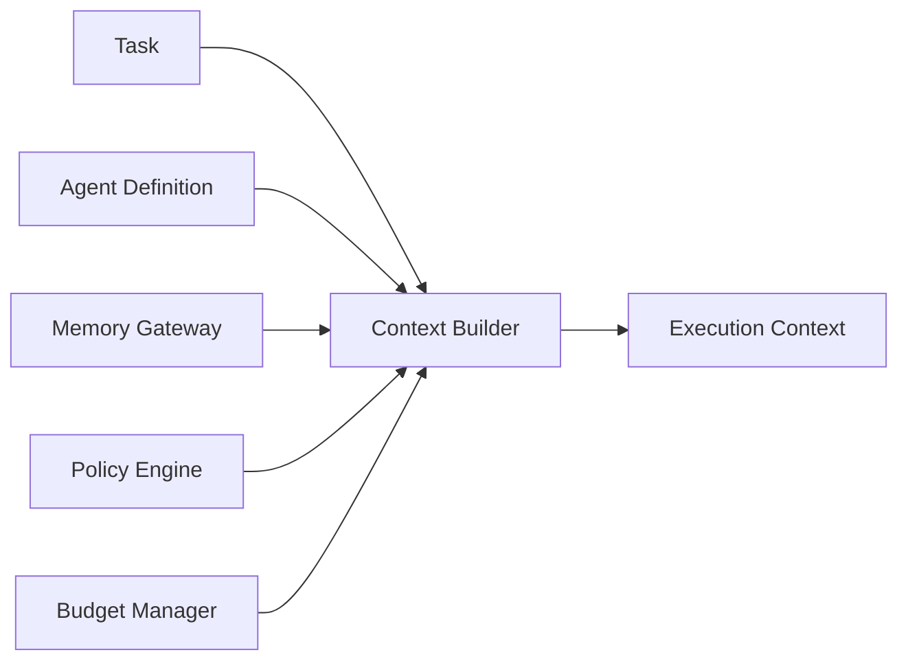

---

## 7. Context Isolation

Contexts MUST be isolated between executions unless explicit shared state is authorized.

A Character Agent execution for Character A must never inherit private memory from Character B.

```text
Character A Context
      │
      ├── A Memory
      ├── A Preferences
      └── A Audience State

Character B Context
      │
      ├── B Memory
      ├── B Preferences
      └── B Audience State
```

Shared organizational knowledge may be read through controlled references rather than direct unrestricted memory access.

---

## 8. Scheduling

The Scheduler selects queued executions based on priority and constraints.

Primary factors:

- priority;
- deadline proximity;
- dependency readiness;
- resource availability;
- budget availability;
- Agent capacity;
- estimated latency;
- historical reliability.

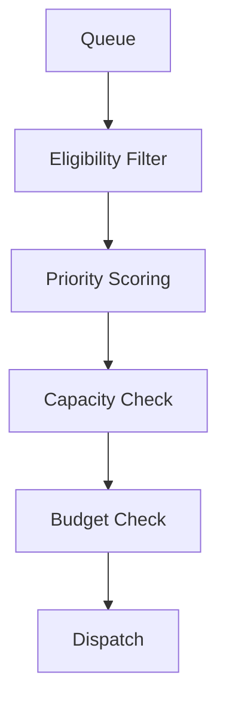

Scheduler decisions MUST be observable.

---

## 9. Priority Scoring

Priority is dynamic.

A conceptual score may combine:

```text
Priority =
  Business Value
+ Audience Demand
+ Urgency
+ Deadline Pressure
+ Trend Velocity
+ Learning Value
- Cost
- Risk
```

The exact formula MUST remain configurable. Domain-specific workflows may define additional terms.

---

## 10. Concurrency

Runtime must support controlled parallel execution.

Example content workflow:

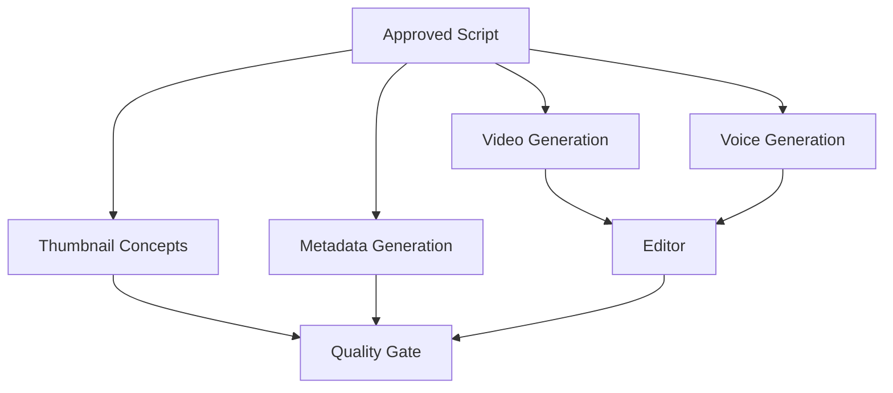

Independent tasks SHOULD execute in parallel. Dependent tasks MUST wait for their prerequisites.

Concurrency limits are required per Agent, tenant, channel, provider and global Runtime.

---

## 11. Resource Allocation

Each execution receives a resource envelope.

```yaml
resources:
  cpu_units: 2
  memory_mb: 4096
  gpu_required: false
  max_runtime_seconds: 120
  max_tool_calls: 20
  max_tokens: 30000
```

Resource usage must be measured and compared with the envelope.

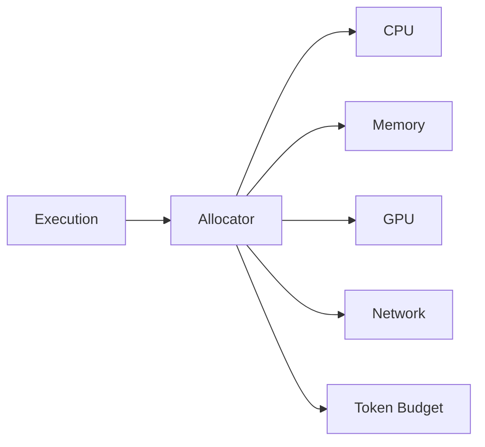

---

## 12. Agent Resolution

Runtime resolves the Agent from Registry using:

```text
agent_id
version constraint
capability
availability
region
policy compatibility
model compatibility
```

Resolution MUST be deterministic for replayable executions.

```yaml
agent_resolution:
  requested: research.trends.youtube
  constraint: ^1.4
  resolved: 1.4.2
  registry_revision: 8841
```

---

## 13. Agent Initialization

Initialization loads only required dependencies.

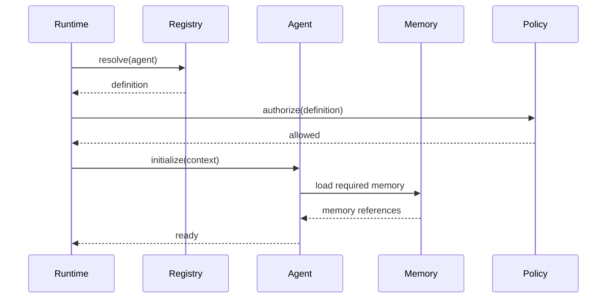

Initialization failure must stop execution before external side effects unless the workflow explicitly permits them.

---

## 14. Tool Execution

Agents access external capabilities through Tool Gateway.

```text
Agent
 ↓
Tool Request
 ↓
Permission Check
 ↓
Rate Limit
 ↓
Budget Check
 ↓
Tool Execution
 ↓
Result Validation
 ↓
Agent
```

Runtime must preserve tool-call metadata for auditing.

---

## 15. Tool Timeout

Every tool call must have a timeout.

Timeout behavior:

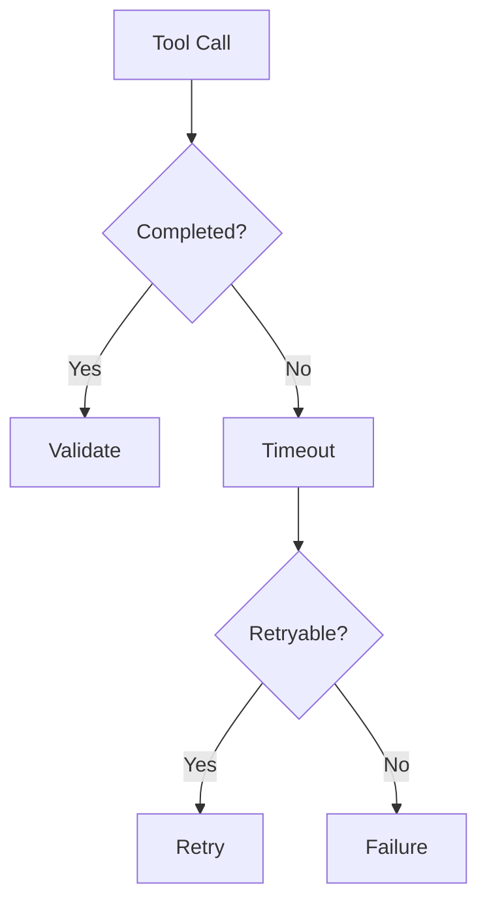

A timeout must never silently become a successful result.

---

## 16. Memory Access

Memory is accessed through a gateway rather than direct storage connections.

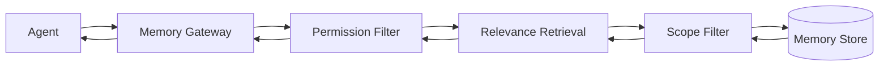

The gateway enforces tenant, character, channel and user boundaries.

---

## 17. Checkpointing

Long-running executions must support checkpoints.

A checkpoint may contain:

```yaml
checkpoint:
  sequence: 7
  completed_nodes:
    - research
    - fact_check
    - outline
  pending_nodes:
    - script
    - voice
  memory_refs:
    - mem_123
  artifacts:
    - artifact_456
```

After recoverable failure, Runtime may resume from the latest valid checkpoint rather than restarting the entire workflow.

---

## 18. Retry Policy

Retries must be policy-driven.

```yaml
retry_policy:
  max_attempts: 3
  backoff: exponential
  initial_delay_ms: 500
  max_delay_ms: 10000
  retry_on:
    - timeout
    - provider_unavailable
    - transient_network_error
```

Permanent policy violations must not be retried automatically.

---

## 19. Idempotency

Tasks that produce external side effects must have idempotency protection.

```text
publish_video(channel, video)
        │
        ↓
Idempotency Key
        │
   ┌────┴────┐
   │ Exists? │
   └────┬────┘
    Yes │ No
        │
 Return │ Execute
```

This prevents duplicate publishing, duplicate payments or duplicate external mutations after retries.

---

## 20. Cancellation

Cancellation must be cooperative whenever possible.

States affected:

```text
QUEUED → CANCELLED
RUNNING → CANCELLING → CANCELLED
WAITING → CANCELLING → CANCELLED
```

Active external operations must be stopped or allowed to complete according to their side-effect policy.

---

## 21. Deadline Handling

Execution deadlines are enforced at Runtime level.

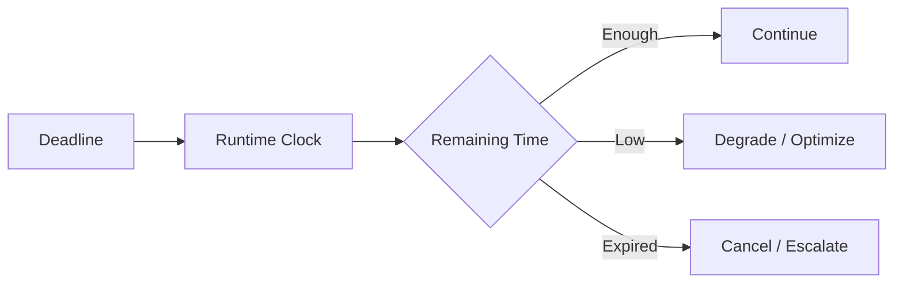

Deadline-aware degradation may select faster models or reduced workflow branches when policy allows.

---

## 22. Model Selection

Runtime may receive a model decision from Model Router or request one when no model is pinned.

```text
Task Complexity
      ↓
Model Router
      ↓
Capability Match
      ↓
Quality Target
      ↓
Latency Target
      ↓
Cost Target
      ↓
Selected Model
```

Model selection must be recorded for reproducibility.

---

## 23. Result Contract

Agent output must conform to a declared schema.

```yaml
result:
  status: success
  output:
    ranked_topics: []
    evidence: []
  confidence: 0.93
  warnings: []
```

Runtime validates structure before passing results to downstream tasks.

---

## 24. Validation Pipeline

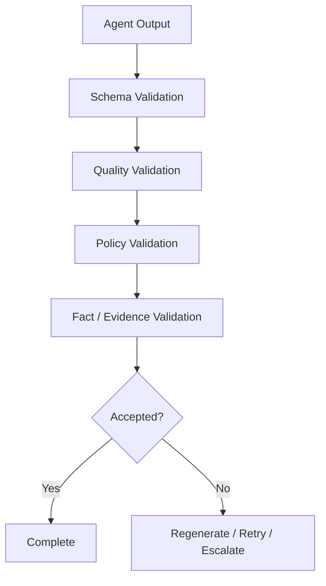

Validation level depends on task sensitivity.

---

## 25. Quality Gates

Quality Gate definitions should be domain-specific.

Example video script gate:

```text
Required:
✓ valid structure
✓ source evidence
✓ topic relevance
✓ character voice compatibility
✓ no unresolved critical claims
✓ audience fit
✓ policy compliance
```

A Quality Gate must return machine-readable reasons for failure.

---

## 26. Failure Classification

Runtime classifies failures into standard categories.

| Category | Default strategy |
|---|---|
| Timeout | Retry |
| Network | Retry |
| Provider unavailable | Retry / fallback |
| Invalid input | Fail |
| Schema failure | Regenerate |
| Quality failure | Regenerate |
| Permission denied | Escalate |
| Policy violation | Stop |
| Resource exhaustion | Reschedule |
| Unknown | Escalate |

---

## 27. Recovery Manager

Recovery is centralized.

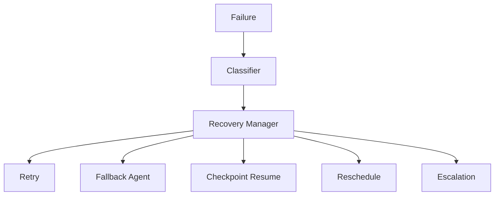

Recovery decisions must be policy-driven and observable.

---

## 28. Fallback Agents

Some Agent classes may define fallback implementations.

Example:

```yaml
fallback:
  primary: research.trends.youtube@1.4
  alternatives:
    - research.trends.generic@2.1
    - research.search.basic@1.8
```

Fallback must preserve the Task Contract whenever possible.

---

## 29. Event Emission

Runtime emits lifecycle events.

```text
ExecutionCreated
ExecutionQueued
ExecutionStarted
ExecutionWaiting
ToolCalled
MemoryRead
MemoryWritten
CheckpointCreated
ExecutionRetrying
ExecutionCompleted
ExecutionFailed
ExecutionCancelled
ExecutionEscalated
```

Events enable analytics, debugging, replay and learning.

---

## 30. Event Envelope

```yaml
event:
  id: evt_123
  type: ExecutionCompleted
  version: 1
  occurred_at: 2026-08-16T12:10:00Z
  trace_id: trace_001
  execution_id: exec_001
  actor:
    type: runtime
    id: runtime_01
  payload: {}
```

Events should be immutable and versioned.

---

## 31. Observability

Every execution requires logs, metrics and traces.

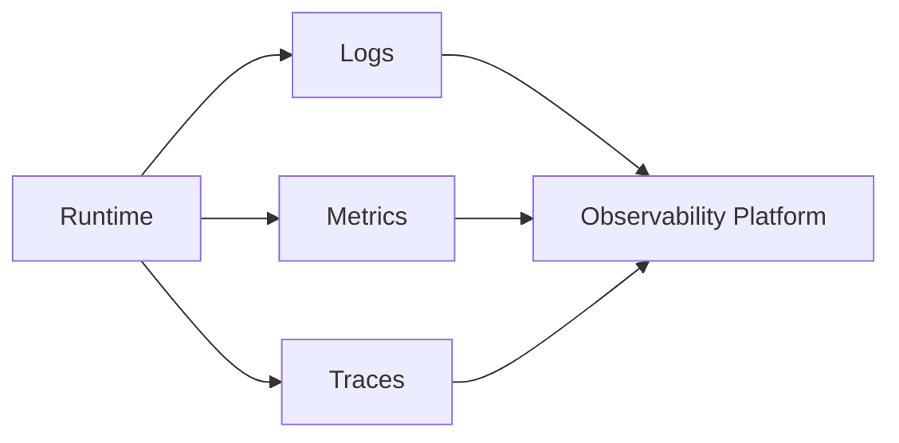

Minimum metrics:

```text
execution_count
success_rate
failure_rate
retry_rate
latency
queue_wait
cost
memory_reads
memory_writes
tool_calls
quality_score
```

---

## 32. Trace Propagation

Trace identifiers must propagate across Agent, Tool Gateway, Memory Gateway and external providers where supported.

```text
Orchestrator
  trace-001
      ↓
Runtime
  trace-001
      ↓
Agent
  trace-001
      ├── Tool Call A
      ├── Memory Read B
      └── Tool Call C
```

This enables end-to-end debugging of complex workflows.

---

## 33. Security Boundary

Runtime is a security boundary.

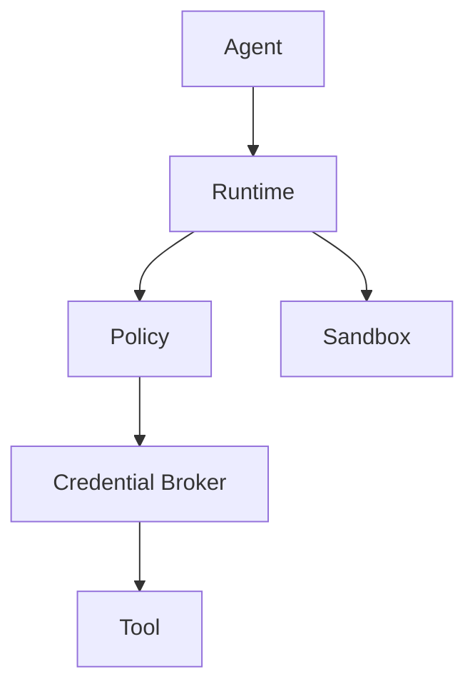

Agents must never receive unrestricted master credentials.

---

## 34. Credential Handling

Credentials must be short-lived where possible.

```text
Agent Request
 ↓
Permission Check
 ↓
Credential Broker
 ↓
Scoped Token
 ↓
Tool
 ↓
Token Expiry
```

Secrets must not appear in prompts, logs, traces or memory entries.

---

## 35. Sandbox

Untrusted or dynamically generated Agent code must execute in a sandbox.

Sandbox controls include:

- filesystem isolation;
- network restrictions;
- CPU limits;
- memory limits;
- process limits;
- execution timeout;
- syscall restrictions where supported.

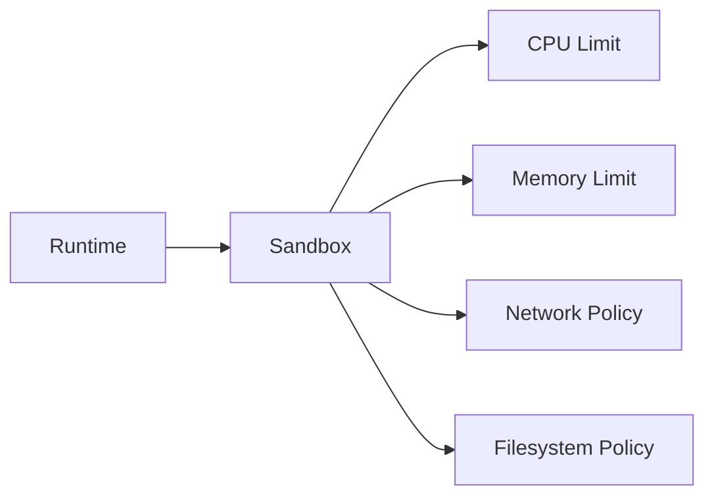

---

## 36. Multi-Tenant Isolation

OMNIS may manage many channels, brands and Characters. Tenant isolation is mandatory.

```text
Tenant A
├── Channels
├── Characters
├── Audience
└── Memory

Tenant B
├── Channels
├── Characters
├── Audience
└── Memory
```

Cross-tenant access must require explicit authorization.

---

## 37. Character Execution Context

Character-specific executions receive a Character Snapshot.

```yaml
character_snapshot:
  character_id: char_001
  identity_version: 12
  personality_version: 7
  appearance_version: 19
  wardrobe_state: 44
  voice_state: 8
  health_state: 3
  current_date: 2026-08-16
  current_weather: summer
```

The snapshot prevents mid-execution state changes from creating inconsistent outputs.

---

## 38. Character Continuity Lock

For content generation, relevant Character state may be locked for the execution window.

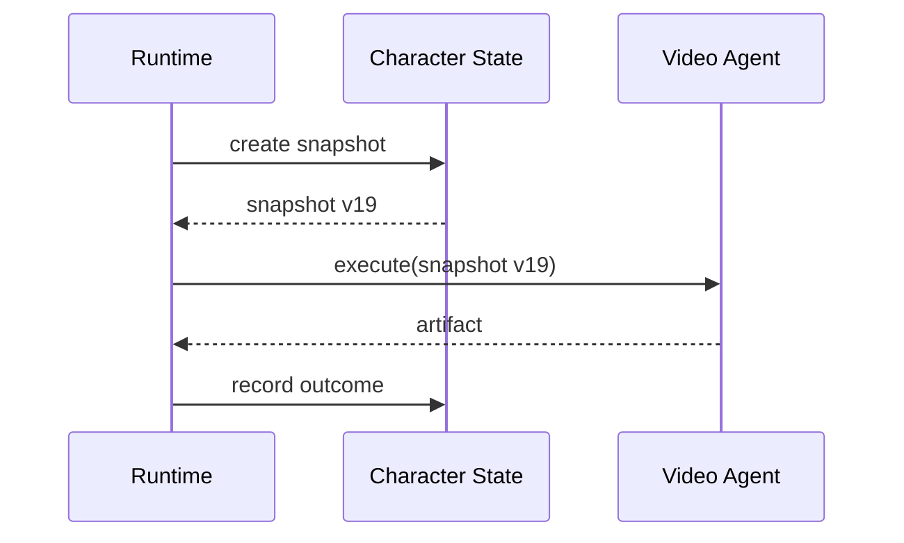

New state changes are applied after the execution according to continuity policy.

---

## 39. Human-Like State

Human-like imperfections must be represented as controlled state, not random prompt noise.

Examples:

```text
voice_hoarseness
energy_level
sleepiness
seasonal_clothing
hair_growth
beard_growth
makeup_state
minor_mood_variation
```

Each state has provenance, timestamp, duration and confidence where applicable.

---

## 40. State Evolution

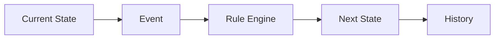

Example: beard length changes according to elapsed time and grooming events rather than random changes between clips.

---

## 41. Audience Interaction Runtime

Comments and messages may create asynchronous executions.

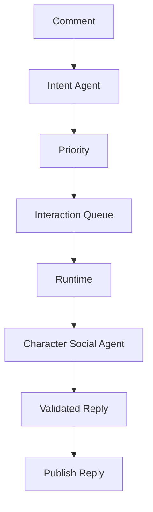

Private messages require stricter permission and privacy policies.

---

## 42. Long-Running Workflows

Some workflows may run for hours or days.

Examples:

```text
Content Series Production
Audience Request Campaign
Multi-day Research
Character Evolution
A/B Experiment
Analytics Learning Cycle
```

These workflows require durable state, checkpoints and event-driven wake-up rather than holding a worker continuously.

---

## 43. Durable Scheduling

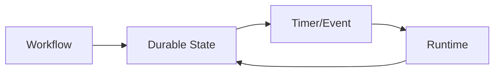

The system must tolerate worker restarts without losing workflow state.

---

## 44. Backpressure

When downstream capacity is lower than incoming demand, Runtime applies backpressure.

```text
Producer Rate > Consumer Capacity
              ↓
          Backpressure
              ↓
   Queue / Throttle / Prioritize
```

This is essential during viral events when audience requests may spike dramatically.

---

## 45. Queue Architecture

```mermaid
flowchart TD
    E[Events] --> Q1[High Priority Queue]
    E --> Q2[Normal Queue]
    E --> Q3[Background Queue]
    Q1 --> W[Workers]
    Q2 --> W
    Q3 --> W
```

Queue policy must prevent starvation of lower-priority work while preserving urgent execution capability.

---

## 46. Rate Limiting

Rate limits apply at multiple levels.

```text
Global
Tenant
Channel
Agent
Provider
Tool
User
```

A provider outage or rate limit must not cascade into uncontrolled retries.

---

## 47. Cost Control

Runtime tracks estimated and actual execution cost.

```yaml
cost:
  estimated_usd: 0.14
  actual_usd: 0.18
  model_usd: 0.11
  tool_usd: 0.05
  compute_usd: 0.02
```

Budget exhaustion should trigger downgrade, pause, reschedule or escalation according to policy.

---

## 48. Adaptive Execution

Runtime may adapt execution strategy when conditions change.

```mermaid
flowchart TD
    E[Execution] --> M[Monitor]
    M --> C{Condition Changed?}
    C -->|No| E
    C -->|Yes| A[Adapt]
    A --> D[Degrade]
    A --> F[Fallback]
    A --> R[Reschedule]
```

Adaptation must not violate the Task Contract or safety policies.

---

## 49. Replay

Executions should be replayable when external side effects are not repeated.

Replay uses:

```text
Task Contract
Agent Version
Model Version
Context Snapshot
Memory References
Tool Results
Events
Configuration
```

External side effects must be mocked or protected by idempotency during replay.

---

## 50. Determinism

Perfect determinism is not always possible for generative models. OMNIS therefore targets **reproducible execution context**, not necessarily byte-identical model output.

The Runtime must record all variables required to understand why an output was produced.

---

## 51. Runtime API Surface

Conceptual API:

```text
createExecution()
getExecution()
cancelExecution()
pauseExecution()
resumeExecution()
retryExecution()
getExecutionState()
getExecutionTrace()
getExecutionResult()
```

Administrative APIs may include:

```text
listExecutions()
listRunningExecutions()
listFailedExecutions()
inspectAgent()
inspectWorker()
```

---

## 52. Worker Model

Workers execute Runtime assignments.

```mermaid
flowchart LR
    S[Scheduler] --> W1[Worker 1]
    S --> W2[Worker 2]
    S --> W3[Worker N]
    W1 --> R[Runtime Services]
    W2 --> R
    W3 --> R
```

Workers should be replaceable and horizontally scalable.

---

## 53. Worker Health

Workers report:

```text
heartbeat
active executions
resource utilization
error rate
queue depth
provider health
```

Unhealthy workers should stop receiving new work while active executions follow recovery policy.

---

## 54. Autoscaling

Autoscaling signals include:

```text
Queue Depth
Execution Latency
CPU
Memory
GPU
Provider Limits
Deadline Pressure
```

```mermaid
flowchart TD
    Q[Queue Depth] --> S[Scaling Controller]
    L[Latency] --> S
    R[Resources] --> S
    S --> U[Scale Up]
    S --> D[Scale Down]
```

---

## 55. Plugin Architecture

Agents should be loadable as versioned packages.

```text
Agent Package
├── manifest
├── capability definitions
├── input schema
├── output schema
├── execution handler
├── tests
├── policies
└── metadata
```

Runtime loads packages through a controlled registry.

---

## 56. Agent Contract

Minimum contract:

```yaml
agent_contract:
  id: string
  version: string
  capabilities: []
  input_schema: object
  output_schema: object
  permissions: []
  resource_profile: object
  retry_policy: object
  health_check: object
```

No Agent should be admitted into production without a valid contract.

---

## 57. Health Checks

Agent health may include:

```text
Registry availability
Model availability
Tool availability
Memory availability
Dependency compatibility
Recent failure rate
```

Health status is separate from execution quality.

---

## 58. Quality vs Health

A healthy Agent can produce poor results. A temporarily unhealthy Agent may historically be excellent.

```mermaid
quadrantChart
    title Agent operational profile
    x-axis Low Quality --> High Quality
    y-axis Low Health --> High Health
    quadrant-1 Strong
    quadrant-2 Reliable but weak
    quadrant-3 Unusable
    quadrant-4 Capable but unstable
```

Routing should consider both dimensions.

---

## 59. Governance Hooks

Runtime exposes hooks before and after critical operations.

```text
before_execution
before_tool_call
before_memory_read
before_external_side_effect
after_tool_call
after_validation
after_execution
on_failure
on_escalation
```

Governance policies can use these hooks without modifying Agent code.

---

## 60. Human Approval Gate

```mermaid
flowchart TD
    E[Execution] --> G[Governance Check]
    G --> H{Approval Required?}
    H -->|No| C[Continue]
    H -->|Yes| P[Pending Approval]
    P --> A{Approved?}
    A -->|Yes| C
    A -->|No| X[Cancelled / Rejected]
```

Approval state must be durable.

---

## 61. Privacy

Runtime must classify data.

```text
Public
Internal
Private
Sensitive
Restricted
```

Data classification controls where memory and tool results may flow.

---

## 62. Data Retention

Execution logs, traces and artifacts require retention policies.

```yaml
retention:
  traces_days: 30
  detailed_logs_days: 30
  audit_logs_days: 365
  artifacts_days: 90
```

Actual values are environment-specific and must be configurable.

---

## 63. Artifact Management

Large outputs should be stored outside execution records.

```text
Execution
   │
   └── Artifact References
           ├── video
           ├── audio
           ├── image
           ├── report
           └── dataset
```

Execution records store metadata and references rather than large binary payloads.

---

## 64. Content Production Example

A complete video workflow may execute as:

```mermaid
flowchart TD
    G[Goal] --> R[Research]
    R --> F[Fact Check]
    F --> S[Script]
    S --> C[Character Context]
    C --> V[Voice]
    C --> P[Performance]
    V --> E[Edit]
    P --> E
    E --> Q[Quality]
    Q --> SEO[SEO]
    SEO --> PUB[Publish]
    PUB --> A[Analytics]
    A --> L[Learning]
```

Runtime coordinates these tasks without embedding the business logic of each domain Agent.

---

## 65. Audience Request Example

```text
Comment Cluster
      ↓
Intent Detection
      ↓
Demand Score
      ↓
Content Request
      ↓
Queue
      ↓
Planning
      ↓
Production
      ↓
Publication
      ↓
Audience Feedback
```

This closes the loop between audience demand and production.

---

## 66. Character Evolution Example

```mermaid
flowchart LR
    E[Character Experiences] --> M[Memory]
    M --> S[Skill Evaluation]
    S --> U[Skill Update]
    U --> C[Character Agent]
    C --> N[Future Execution]
```

Experience must improve capability without arbitrarily rewriting identity.

---

## 67. Runtime Configuration

Configuration must be declarative where possible.

```yaml
runtime:
  max_concurrency: 500
  default_timeout_seconds: 120
  checkpoint_interval_seconds: 30
  max_retries: 3
  tracing: enabled
  audit: enabled
  adaptive_execution: enabled
```

Environment-specific configuration must not be embedded in Agent code.

---

## 68. Feature Flags

New Runtime behavior should be protected by feature flags.

Examples:

```text
runtime.adaptive_model_routing
runtime.dynamic_priority
runtime.character_snapshot_v2
runtime.parallel_validation
runtime.experimental_recovery
```

Feature flags must support controlled rollout and rollback.

---

## 69. Deployment

Runtime deployment should support rolling upgrades.

```mermaid
flowchart LR
    V1[Runtime v1] --> C[Canary]
    C --> H[Health Check]
    H --> P[Progressive Rollout]
    P --> V2[Runtime v2]
    H -->|Failure| RB[Rollback]
```

Running executions should remain compatible during migration.

---

## 70. Compatibility

Compatibility must be considered across:

```text
Runtime Version
Agent Version
Task Contract Version
Tool Version
Memory Schema Version
Event Version
Model Version
```

Schema evolution must preserve backward compatibility or provide explicit migration.

---

## 71. Testing Strategy

Runtime tests must include:

```text
Unit
Integration
Contract
Concurrency
Failure Injection
Recovery
Security
Load
Chaos
Replay
Regression
```

```mermaid
flowchart TD
    CODE[Runtime Code] --> U[Unit]
    CODE --> I[Integration]
    CODE --> C[Contract]
    CODE --> L[Load]
    CODE --> F[Failure Injection]
    F --> R[Recovery Tests]
```

---

## 72. Failure Injection

The test environment should deliberately inject:

- network timeout;
- provider failure;
- memory failure;
- worker termination;
- invalid Agent output;
- malformed tool response;
- queue overload;
- budget exhaustion.

The Runtime passes reliability validation only when recovery behavior matches policy.

---

## 73. Chaos Testing

At scale, OMNIS should periodically test worker and dependency failures.

```text
Kill Worker
 ↓
Detect Missing Heartbeat
 ↓
Recover Execution
 ↓
Resume Checkpoint
 ↓
Validate Result
```

Chaos testing should run in controlled environments before production adoption.

---

## 74. Performance Targets

Initial engineering targets are configurable and should be validated empirically.

| Metric | Initial target |
|---|---:|
| Queue overhead | < 100 ms |
| Context construction | < 500 ms |
| State transition | < 50 ms |
| Event emission | < 100 ms |
| Cancellation acknowledgement | < 1 s |
| Scheduler decision | < 250 ms |

These are engineering targets, not externally measured guarantees.

---

## 75. Scalability Model

Runtime must scale from a single development worker to a distributed fleet.

```text
Level 1
1 Runtime / few Agents

Level 2
Multiple Workers / dozens of Agents

Level 3
Distributed Runtime / hundreds of Agents

Level 4
Agent Fleet / thousands of executions

Level 5
Multi-region OMNIS Fabric
```

Each level must preserve the same Agent Contract.

---

## 76. Development Mode

Development Runtime should provide:

```text
Verbose traces
Local tools
Mock providers
Synthetic memory
Replay
Step execution
Checkpoint inspection
State inspection
```

This mode is essential for building and debugging Agent workflows.

---

## 77. Debug Mode

A developer should be able to inspect an execution graph.

```mermaid
flowchart TD
    E[Execution] --> N1[Research ✓]
    E --> N2[Fact Check ✓]
    E --> N3[Script ✕]
    N3 --> N4[Voice pending]
    N3 --> N5[Video pending]
```

The UI should expose node status, latency, inputs, outputs, retries and errors subject to privacy controls.

---

## 78. Simulation Mode

Simulation mode replaces external side effects with deterministic mocks.

```text
Real Tool → Mock Tool
Real Publish → Mock Publish
Real Audience → Synthetic Audience
Real Payment → Simulated Payment
```

Simulation enables safe workflow development.

---

## 79. Replay Mode

Replay reconstructs an execution from recorded inputs and tool responses.

```mermaid
flowchart LR
    H[Execution History] --> R[Replay Engine]
    R --> C[Context]
    C --> A[Agent]
    A --> O[New Outcome]
    O --> D[Diff]
```

Replay is especially useful for regression testing Agent upgrades.

---

## 80. Diff Engine

Runtime should compare two executions.

```text
Input Diff
Context Diff
Tool Diff
Memory Reference Diff
Model Diff
Output Diff
Quality Diff
Cost Diff
```

This makes Agent evolution measurable.

---

## 81. Learning Integration

Runtime emits structured execution outcomes to Learning System.

```mermaid
flowchart TD
    R[Runtime] --> E[Execution Outcome]
    E --> A[Analytics]
    E --> L[Learning System]
    L --> S[Skill Store]
    S --> AR[Agent Registry]
```

Learning system may recommend new Agent versions but should not silently replace production behavior without governance.

---

## 82. Promotion Pipeline

Agent upgrades follow controlled promotion.

```text
Candidate
 ↓
Unit Tests
 ↓
Contract Tests
 ↓
Simulation
 ↓
Replay
 ↓
Shadow Traffic
 ↓
Canary
 ↓
Production
```

Each stage should have measurable acceptance criteria.

---

## 83. Shadow Execution

A candidate Agent can execute alongside the production Agent without causing external side effects.

```mermaid
flowchart LR
    T[Task] --> P[Production Agent]
    T --> S[Shadow Agent]
    P --> R1[Production Result]
    S --> R2[Shadow Result]
    R1 --> D[Comparator]
    R2 --> D
```

Shadow execution is valuable for model and Agent upgrades.

---

## 84. Canary Execution

Canary deployments route a small percentage of eligible tasks to the new version.

```text
95% → Stable
5%  → Candidate
```

Promotion depends on quality, reliability, latency and cost metrics.

---

## 85. Rollback

Rollback must be fast and deterministic.

```mermaid
flowchart TD
    C[Candidate] --> M[Metrics]
    M --> D{Healthy?}
    D -->|Yes| P[Promote]
    D -->|No| R[Rollback]
    R --> S[Stable Version]
```

Execution records must retain the exact Agent version used.

---

## 86. Runtime Safety Principles

1. Least privilege.
2. Explicit side effects.
3. Durable state.
4. Observable decisions.
5. Bounded resources.
6. Controlled retries.
7. Validated outputs.
8. Tenant isolation.
9. Versioned contracts.
10. Human escalation for sensitive operations.

---

## 87. Implementation Modules

Recommended implementation decomposition:

```text
runtime/
├── core/
├── lifecycle/
├── scheduler/
├── executor/
├── context/
├── state/
├── checkpoint/
├── retry/
├── recovery/
├── resources/
├── security/
├── memory/
├── tools/
├── validation/
├── events/
├── observability/
├── workers/
├── replay/
└── testing/
```

This decomposition is a reference architecture; implementation may consolidate modules where appropriate without violating boundaries.

---

## 88. Core Interfaces

Conceptual interfaces:

```text
ExecutionManager
LifecycleManager
Scheduler
ContextBuilder
AgentResolver
Executor
ResourceManager
CheckpointManager
RetryManager
RecoveryManager
MemoryGateway
ToolGateway
Validator
EventPublisher
TraceManager
PolicyEngine
```

Each interface should have one responsibility and a testable contract.

---

## 89. ExecutionManager

Responsibilities:

```text
create
start
pause
resume
cancel
retry
complete
fail
escalate
```

It coordinates lifecycle services but does not implement domain Agent behavior.

---

## 90. Scheduler Interface

```yaml
schedule_request:
  execution_id: exec_001
  priority: high
  deadline: 2026-08-16T12:30:00Z
  required_capabilities:
    - research
  resource_profile:
    gpu: false
```

The Scheduler returns a dispatch decision or a reason for deferral.

---

## 91. Executor Interface

The Executor receives:

```text
Execution Context
Agent Package
Resource Envelope
Cancellation Token
Trace Context
```

It returns:

```text
Execution Result
Telemetry
State Updates
Artifacts
```

---

## 92. Cancellation Token

All cooperative Agent operations should accept a cancellation token.

```text
if cancellation_requested:
    stop_before_next_side_effect()
    persist_checkpoint()
    return cancelled
```

Long-running operations must periodically check cancellation state.

---

## 93. Error Model

Errors should be structured.

```yaml
error:
  code: TOOL_TIMEOUT
  category: transient
  retryable: true
  message: provider did not respond
  source: tool_gateway
  details: {}
```

Agents should not return arbitrary strings as the only failure representation.

---

## 94. Error Codes

Initial standard codes:

```text
INVALID_TASK
AGENT_NOT_FOUND
AGENT_VERSION_UNAVAILABLE
PERMISSION_DENIED
RESOURCE_EXHAUSTED
TIMEOUT
TOOL_TIMEOUT
TOOL_FAILURE
MEMORY_FAILURE
SCHEMA_INVALID
QUALITY_FAILED
POLICY_BLOCKED
CANCELLED
DEPENDENCY_FAILED
UNKNOWN
```

The code set must be versioned.

---

## 95. Dependency Graph

Runtime should understand dependencies between execution nodes.

```mermaid
flowchart TD
    A[Research] --> B[Fact Check]
    B --> C[Script]
    C --> D[Voice]
    C --> E[Video]
    D --> F[Edit]
    E --> F
    F --> G[Quality]
```

A node becomes eligible only when all required predecessors succeed or are explicitly accepted by policy.

---

## 96. Partial Success

Some workflows can continue after non-critical failure.

```text
Required Node → failure → workflow blocked
Optional Node → failure → warning → workflow continues
```

Task contracts must declare which dependencies are required.

---

## 97. Human Escalation

Escalation payload:

```yaml
escalation:
  execution_id: exec_001
  reason: POLICY_REVIEW_REQUIRED
  summary: "External publication requires approval"
  evidence_refs: []
  requested_action: approve_or_reject
```

Human decisions must be recorded as workflow events.

---

## 98. Audit Trail

The audit trail must answer:

```text
Who / what executed?
Which Agent version?
Which model?
Which tools?
Which memory?
Which policies?
What changed?
What was published?
Who approved it?
```

This is essential for production governance.

---

## 99. Acceptance Criteria

Agent Runtime v1 is accepted when:

- lifecycle transitions are persisted;
- invalid transitions are rejected;
- Agent versions resolve deterministically;
- execution context is isolated;
- permissions are enforced;
- resource limits are enforced;
- tool calls are observable;
- memory access is scoped;
- retries are bounded;
- checkpoints can resume execution;
- cancellation works;
- outputs are validated;
- failures are classified;
- recovery follows policy;
- traces and metrics are emitted;
- audit records are durable;
- tenant boundaries are enforced;
- simulation and replay are supported.

---

## 100. Final Architecture Contract

```mermaid
flowchart TB
    OR[Orchestrator] --> RT[Agent Runtime]
    RT --> SCH[Scheduler]
    RT --> CTX[Context Builder]
    RT --> EX[Executor]
    RT --> ST[State Store]
    RT --> CP[Checkpoint Store]
    RT --> POL[Policy Engine]
    EX --> MEM[Memory Gateway]
    EX --> TOOL[Tool Gateway]
    EX --> VAL[Validator]
    RT --> EVT[Event Bus]
    RT --> OBS[Observability]
    RT --> REC[Recovery Manager]
    REC --> EX
    OBS --> ANA[Analytics]
    EVT --> LEARN[Learning System]
```

The Agent Runtime is therefore the controlled execution fabric between OMNIS orchestration and individual Agents. It provides the operational guarantees required for a system that must eventually coordinate hundreds or thousands of specialized Agents, persistent Characters, audience interaction workflows, content production pipelines and continuous learning cycles.
