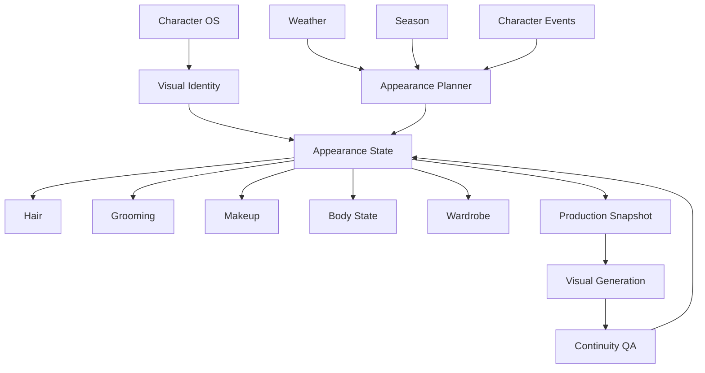
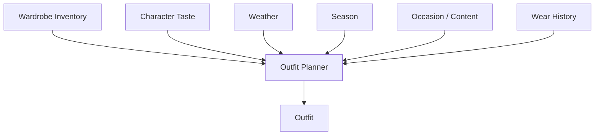
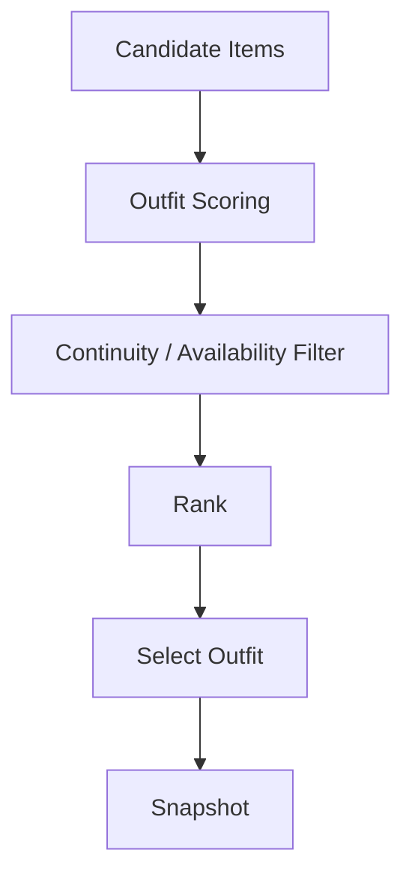
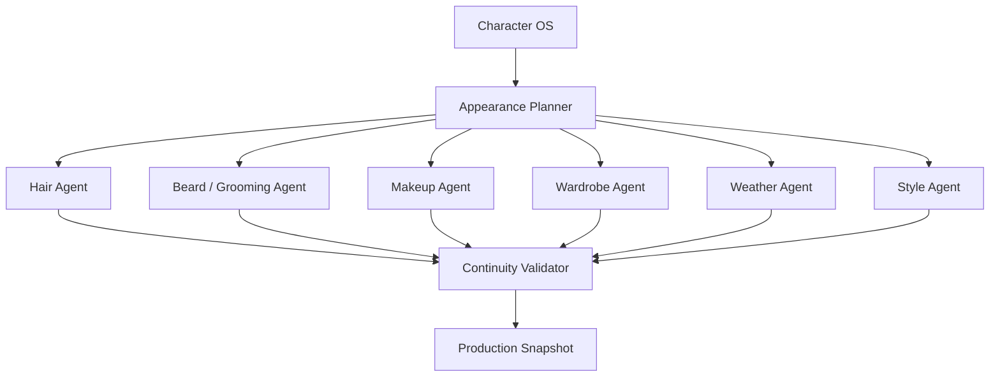

# OMNIS Appearance Continuity Engine Specification

> Version: 1.0.0  
> Status: Architecture Specification  
> Domain: Identity / Appearance / Hair / Grooming / Makeup / Wardrobe / Weather / Seasonal Continuity

## 1. Purpose

The Appearance Continuity Engine maintains a believable, evolving visual identity for every OMNIS Character across images, videos, live interactions and time.



## 2. Core Principle

A Character must remain recognizable without remaining visually frozen.

```text
IDENTITY STABILITY
+
NATURAL VARIATION
+
TEMPORAL CONTINUITY
+
CONTEXT APPROPRIATENESS
=
BELIEVABLE APPEARANCE
```

## 3. Visual Identity

Visual identity contains stable and mutable properties.

```text
Stable:
face geometry
identity markers
base body proportions
voice-linked visual cues

Mutable:
hair
facial hair
makeup
skin condition
clothing
accessories
expression
temporary physical state
```

## 4. Identity Lock

Stable identity attributes are protected from accidental generation drift.

## 5. Appearance State

```yaml
appearance_state:
  hair:
    style: medium_wavy
    color: dark_brown
  grooming:
    beard_length_mm: 3
  makeup:
    intensity: light
  outfit_id: outfit_014
  accessories: [watch_02]
```

## 6. Temporal State

Every mutable appearance attribute is associated with a timeline.

```text
state(t0)
   ↓
state(t1)
   ↓
state(t2)
   ↓
state(t3)
```

## 7. Production Snapshot

Before generation, OMNIS freezes a deterministic appearance snapshot for the production window.

## 8. Snapshot Contents

```text
identity reference
hair state
grooming state
makeup state
outfit
accessories
body state
season
weather context
location
```

## 9. Hair Engine

The Hair Engine controls hairstyle, length, color, texture and growth history.

## 10. Hair Growth

Hair length changes gradually unless an explicit haircut event occurs.

```text
length(t+Δt) = length(t) + growth_rate × Δt
```

## 11. Haircut Event

A haircut creates a timeline event that changes the current hair state.

## 12. Hair Color

Color changes persist until another coloring event or a configured fading model changes the state.

## 13. Color Fade

Dye can fade gradually over time when the Character profile specifies such behavior.


## 14. Hairstyle Memory

Recent hairstyles are retained to avoid implausible random switching.

## 15. Style Frequency

Characters have personal preferences that influence hairstyle selection.

## 16. Beard Engine

The Beard Engine tracks facial-hair growth and grooming events for applicable Characters.

## 17. Beard Growth

Beard length progresses according to a Character-specific growth profile.

## 18. Shave Event

A clean shave resets visible beard length near zero at the event timestamp.

## 19. Beard Continuity

A later production cannot jump from clean-shaven to a long beard unless sufficient simulated time has elapsed or a valid external event explains it.

## 20. Mustache State

Mustache length and styling are independently tracked where appropriate.

## 21. Makeup Engine

Makeup is modeled as a contextual state rather than a permanent visual label.

```text
base preference
+
occasion
+
weather
+
content format
+
current style
→
makeup plan
```

## 22. Makeup Continuity

Makeup state can persist across scenes in the same production day.

## 23. Makeup Variation

Variation is bounded by Character taste, context and current fashion preferences.

## 24. Skin State

Temporary skin conditions can be represented when appropriate without changing core identity.

## 25. Physical Condition

Appearance may reflect temporary conditions such as fatigue, mild illness or lack of sleep when the Character simulation contains a valid state event.

## 26. Wardrobe Engine

The Wardrobe Engine maintains an inventory rather than generating a completely new outfit for every scene.



## 27. Wardrobe Inventory

Inventory entries include:

```text
item_id
category
color
material
style
seasonality
formality
brand metadata
purchase date
wear count
last worn
condition
```

## 28. Clothing Categories

```text
tops
bottoms
outerwear
dresses
shoes
sportswear
formalwear
accessories
```

## 29. Outfit Composition

Outfits are compositions of items rather than immutable single assets.

## 30. Reuse Logic

Items may be reused naturally.

```text
shirt A + jeans B
→ video 01

shirt A + jacket C
→ video 07

shirt A + trousers D
→ video 15
```

## 31. Wear History

The engine records when and where an item was used.

## 32. Repetition Control

The engine avoids implausibly frequent repetition without forcing artificial uniqueness.

## 33. Reuse Probability

Reuse probability depends on personal taste, item popularity, context and elapsed time.

## 34. Seasonal Wardrobe

Seasonality changes available outfit candidates.

```text
winter → coats / knitwear / boots
spring → layers / lighter fabrics
summer → breathable clothing
autumn → jackets / layers
```

## 35. Weather Integration

Weather is an input to outfit selection when content context corresponds to a real location and time.

## 36. Weather Signals

Relevant signals include:

```text
temperature
feels-like temperature
precipitation
snow
wind
humidity
UV
weather warnings
```

## 37. Location Context

The engine uses the Character's simulated or production location when weather-aware clothing is required.

## 38. Forecast Window

Future content may use forecast data with explicit uncertainty handling.

## 39. Weather Uncertainty

Outfit planning should avoid overfitting to uncertain long-range forecasts.

## 40. Occasion Awareness

Clothing considers the occasion.

```text
casual
studio
street
sport
business
formal
nightlife
travel
```

## 41. Content Awareness

The outfit should fit the video's subject and visual language.

## 42. Fashion Taste

Each Character has a persistent fashion preference model.

## 43. Fashion Evolution

Taste can evolve through experience, trends and Character development.

## 44. Style Boundaries

Evolution must not destroy the Character's recognizable aesthetic without a meaningful transition.

## 45. Accessories

Accessories have their own inventory and reuse history.

## 46. Signature Items

Characters may have recurring signature accessories that strengthen identity.

## 47. Clothing Condition

Items can have a condition state and may eventually require replacement.

## 48. Laundry / Availability

A realistic wardrobe system may temporarily mark an item unavailable due to laundry, damage or travel.

## 49. Purchase Events

New items can enter the wardrobe through simulated or explicit events.

## 50. Disposal Events

Old items can leave the wardrobe through wear, loss, donation or replacement.

## 51. Outfit Scoring

Candidate outfits can be scored using:

```text
weather fit
season fit
occasion fit
Character taste
content fit
recent-use penalty
color harmony
style harmony
availability
```

## 52. Outfit Planner



## 53. Color Coordination

The engine evaluates compatible color combinations within the Character's style preferences.

## 54. Fit and Silhouette

Outfit planning considers silhouette and body-proportion compatibility.

## 55. Accessories Coordination

Accessories are selected according to outfit, occasion and personal taste.

## 56. Hair + Outfit Coordination

Hair styling can influence outfit selection and vice versa.

## 57. Makeup + Outfit Coordination

Makeup intensity and palette may coordinate with clothing and occasion.

## 58. Grooming + Context

Grooming adapts to context while preserving Character identity.

## 59. Travel Continuity

When a Character is traveling, wardrobe availability should be constrained by the simulated luggage inventory.

## 60. Location Continuity

Appearance may reflect regional climate and cultural context while respecting the Character's established style.

## 61. Time-of-Day

Time of day can influence clothing, makeup, hair and grooming choices.

## 62. Event Continuity

Special events can produce temporary appearance states.

```text
photoshoot
wedding
holiday
concert
vacation
brand campaign
```

## 63. Campaign Wardrobe

Sponsored campaigns may define approved wardrobe constraints.

## 64. Brand Safety

Campaign constraints must not silently override Character identity without explicit configuration.

## 65. Appearance Memory

Past appearance states are retained as timeline records.

## 66. Continuity Retrieval

The production engine retrieves the most relevant previous appearance states before generating a new scene.

## 67. Continuity Window

Continuity checks may use:

```text
previous scene
same day
previous episode
recent episodes
long-term history
```

## 68. Scene-Level Continuity

Shots within the same continuous scene should share compatible appearance states unless a visible transition occurs.

## 69. Episode-Level Continuity

Content produced within a simulated day should maintain appropriate appearance continuity.

## 70. Cross-Episode Continuity

Cross-episode continuity balances realistic repetition with natural change.

## 71. Visual Reference Pack

Every production receives an approved reference pack.

```text
face reference
hair reference
body reference
outfit reference
makeup reference
accessory reference
style reference
```

## 72. Generation Constraints

Visual generation systems consume structured references instead of relying on uncontrolled textual descriptions alone.

## 73. Identity QA

The Identity QA Agent checks whether generated visuals remain consistent with stable Character identity.

## 74. Appearance QA

Appearance QA checks hair, grooming, makeup, clothing and accessories against the production snapshot.

## 75. Temporal QA

Temporal QA checks for impossible appearance jumps between consecutive scenes.

## 76. Artifact Detection

The engine flags visual artifacts that can alter identity or appearance.

## 77. Regeneration

Failed generations are regenerated using the same approved state unless the failure is caused by the state itself.

## 78. State Correction

If the appearance state is invalid, the Character OS is corrected before regeneration.

## 79. State Immutability

Historical production snapshots remain immutable for reproducibility.

## 80. State Versioning

Current appearance state references the version from which it was derived.

## 81. Appearance Events

Events use a common schema.

```yaml
appearance_event:
  id: evt_001
  character_id: char_001
  type: haircut
  timestamp: 2026-08-17T10:00:00Z
  before_ref: state_101
  after_ref: state_102
```

## 82. Event Types

```text
haircut
hair_color
shave
beard_trim
makeup_change
purchase
wear
remove
repair
replacement
special_event
```

## 83. Event Ordering

Events are processed chronologically.

## 84. Conflict Resolution

Conflicting appearance events require explicit ordering or human/system resolution.

## 85. Rollback

A bad appearance update can be rolled back without rewriting historical media.

## 86. Branching

Alternative appearance states may be explored in simulation branches before committing to Character history.

## 87. Production Lock

Once production begins, the snapshot is locked against unrelated future appearance events.

## 88. Post-Production Update

A completed production may optionally record the appearance state as an observed historical event.

## 89. Agent Architecture

Specialized agents operate over the same state model.



## 90. Agent Responsibilities

No single agent owns unrestricted Character state. Agents propose state transitions through controlled interfaces.

## 91. Planner / Executor Separation

Planner agents recommend changes; state services validate and commit them.

## 92. Permission Model

Appearance agents receive only the capabilities they require.

## 93. Auditability

Every committed appearance change is attributable to an event, agent and source.

## 94. Learning

Appearance outcomes can be evaluated using audience feedback, performance and Character preferences.

## 95. Fashion Learning

Successful styling patterns may increase future ranking probability without permanently locking the Character into one look.

## 96. Diversity Control

The system prevents excessive visual repetition while preserving realistic reuse.

## 97. Authentic Imperfection

Natural appearance includes controlled imperfections such as slightly messy hair, repeated clothing, tired styling or seasonal skin changes when appropriate.

## 98. Realism Boundary

Imperfection must support believable continuity rather than intentionally degrading output quality.

## 99. Final Pipeline

```text
CHARACTER STATE
      ↓
TIME + LOCATION
      ↓
SEASON + WEATHER
      ↓
OCCASION + CONTENT
      ↓
PERSONAL TASTE
      ↓
WARDROBE / HAIR / GROOMING / MAKEUP PLANNING
      ↓
CONTINUITY VALIDATION
      ↓
PRODUCTION SNAPSHOT
      ↓
VISUAL GENERATION
      ↓
APPEARANCE QA
      ↓
PUBLISHABLE MEDIA
      ↓
HISTORICAL STATE
```

## 100. Final Contract

The Appearance Continuity Engine MUST preserve stable Character identity while allowing realistic temporal variation in hair, grooming, makeup, clothing, accessories and physical presentation. It MUST integrate Character OS, Digital Human Simulation, time, location, weather, season, wardrobe history and production context. It MUST prevent impossible continuity jumps and provide deterministic production snapshots, auditability, recovery and learning.
