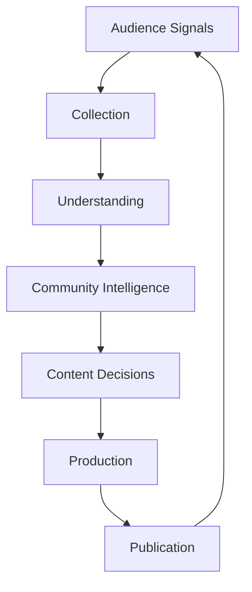
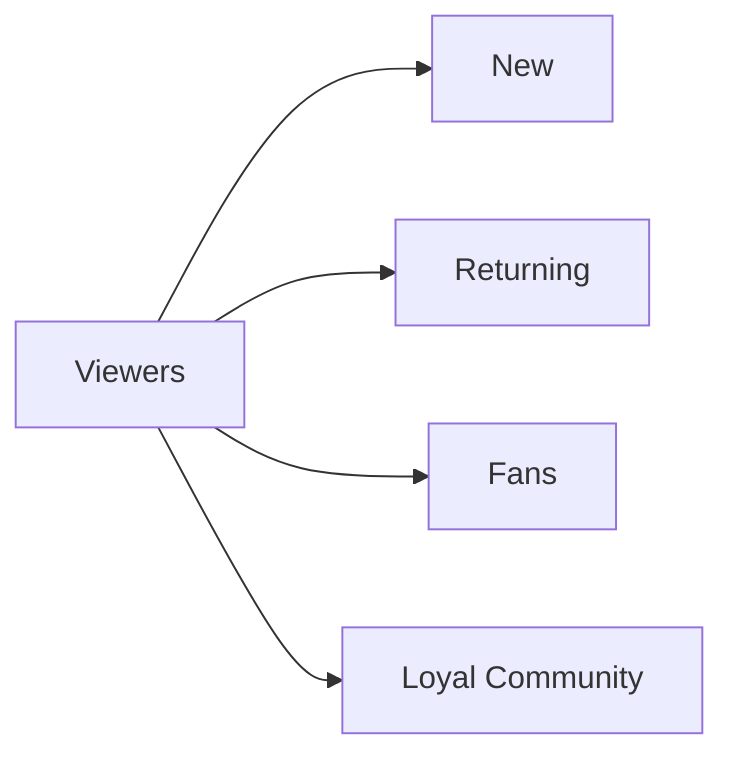
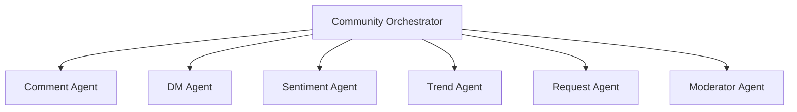

# OMNIS Audience Intelligence and Community Engine Specification

> Version: 1.0.0
> Domain: Audience Understanding / Community / Engagement / Feedback Intelligence

## 1. Purpose

The Audience Intelligence and Community Engine transforms audience activity into actionable intelligence. It enables OMNIS Characters and channels to understand viewers, build relationships, discover demand and continuously improve content strategy.



## 2. Core Principle

Audience members are not only metrics. They are participants in a living community.

```text
Views -> Engagement -> Relationship -> Community -> Loyalty
```

## 3. Signal Sources

The engine collects signals from:

- Comments
- Direct messages
- Likes
- Shares
- Saves
- Polls
- Community posts
- Search behavior
- Viewer retention
- Repeated requests
- Sentiment

## 4. Comment Intelligence

Comments are analyzed for:

- Topic requests
- Questions
- Problems
- Emotions
- Satisfaction
- Criticism
- Ideas
- Community trends

## 5. Request Mining

Viewer requests become structured content opportunities.

```yaml
request:
  topic: AI tools
  demand: high
  source: comments
  urgency: medium
  suggested_action: video
```

## 6. Audience Segmentation

Viewers are grouped by behavior, interests and relationship strength.



## 7. Community Relationship Model

The system tracks meaningful interaction history while respecting privacy boundaries.

## 8. Feedback Loop

```text
Audience
 ↓
Understanding
 ↓
Content Request
 ↓
Production Queue
 ↓
Published Content
 ↓
Audience Reaction
 ↓
Learning
```

## 9. Character Interaction

Responses must match Character personality, knowledge and communication style.

## 10. Community Agents



## 11. Priority Scoring

Requests are ranked by demand, strategic value, timing and audience importance.

## 12. Audience Memory

Important recurring community interactions can influence future responses and content planning through controlled memory systems.

## 13. Final Contract

The Audience Intelligence and Community Engine MUST convert audience behavior into actionable intelligence, strengthen relationships, discover demand, support content decisions and create a continuous improvement loop between OMNIS Characters, channels and communities.