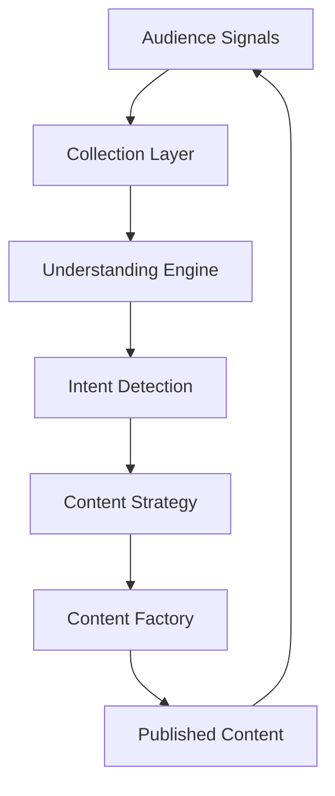
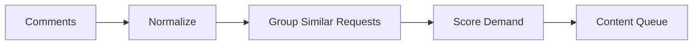
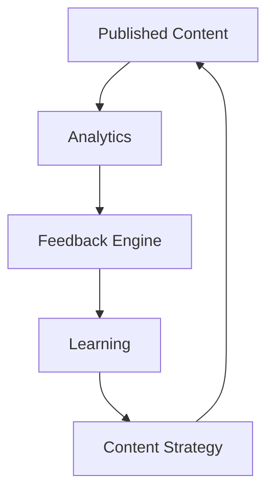

# OMNIS Audience Intelligence Engine Specification

> Version: 1.0.0
> Domain: Audience Understanding / Community Intelligence / Feedback Learning

## 1. Purpose

Audience Intelligence is the perception system of OMNIS. It observes audience signals, understands needs, identifies opportunities and feeds learning back into Characters, Content Factory and Strategy systems.



## 2. Signal Sources

```text
Comments
Direct Messages
Community Posts
Likes
Shares
Saves
Watch Patterns
Search Behavior
Polls
Feedback Forms
```

## 3. Audience Memory

OMNIS stores aggregated audience knowledge without exposing unnecessary personal data.

```text
Audience Pattern
    ↓
Preference Model
    ↓
Strategy Improvement
```

## 4. Comment Intelligence

The Comment Agent classifies comments:

```text
question
request
praise
criticism
confusion
suggestion
spam
risk
```

## 5. Request Mining

Repeated requests become content opportunities.



## 6. Demand Scoring

Signals include:

```text
frequency
recency
engagement
sentiment
strategic value
production cost
```

## 7. Community Relationship

The system supports meaningful interaction with audiences while preserving Character identity.

## 8. Character Reply Agent

Replies must follow:

```text
Character personality
knowledge boundaries
conversation context
platform rules
```

## 9. Sentiment Analysis

The engine detects audience emotional trends.

```text
positive
neutral
negative
confused
excited
```

## 10. Trend Detection

Audience changes can reveal emerging topics before traditional trend systems.

## 11. Audience Segments

```text
new followers
casual viewers
active community
loyal fans
experts
critics
```

## 12. Feedback Loop



## 13. Learning Contract

Audience intelligence MUST improve future decisions through measurable feedback.

## 14. Privacy Boundary

Audience analysis must respect platform permissions, privacy requirements and applicable regulations.

## 15. Final Contract

Audience Intelligence is the sensory system connecting humans and OMNIS Characters. It transforms conversations into understanding and understanding into better content.