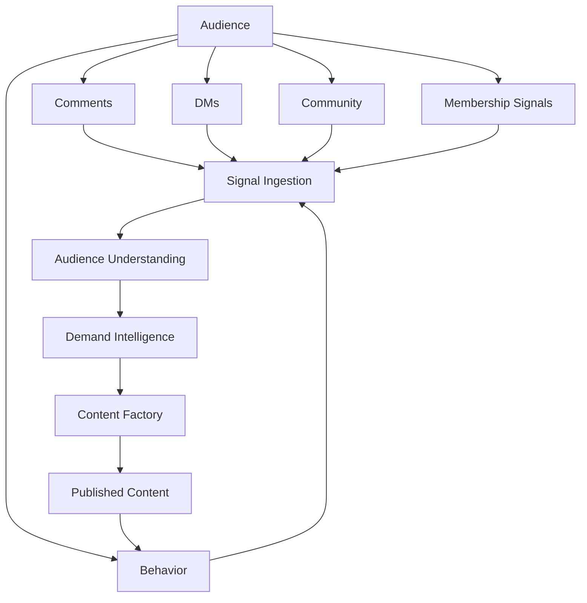
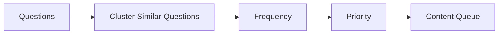
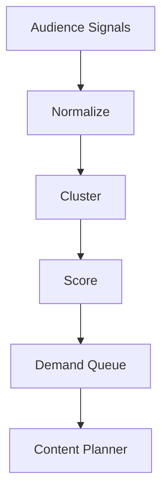
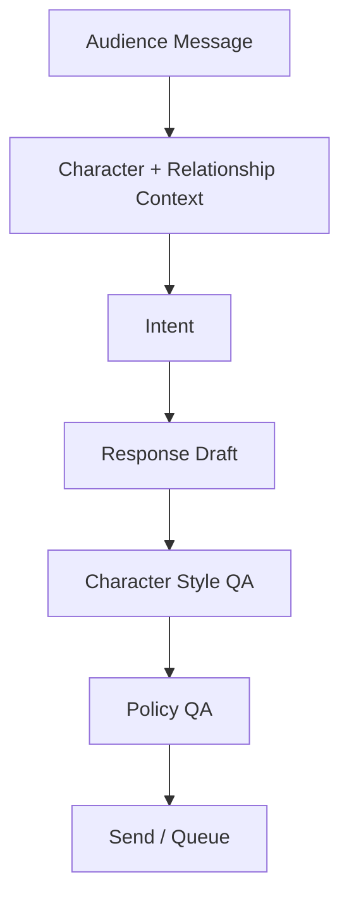
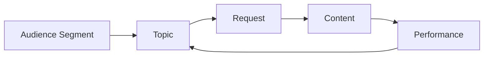
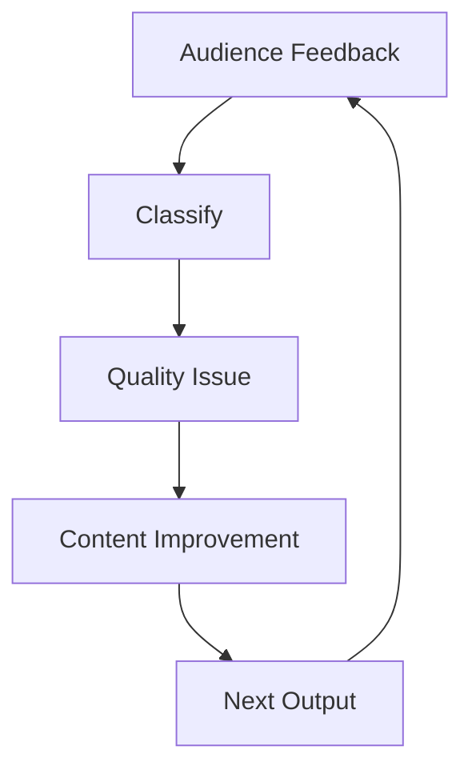
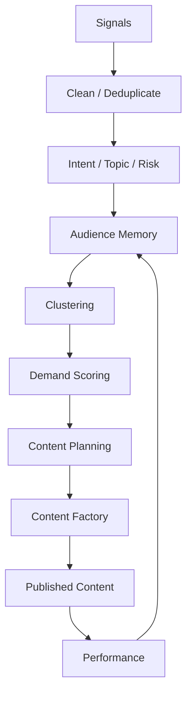

# OMNIS Audience Intelligence Specification

> Version: 1.0.0  
> Status: Architecture Specification  
> Domain: Audience Intelligence / Community / Feedback / Demand / Relationship Intelligence

## 1. Purpose

Audience Intelligence converts audience behavior, comments, direct messages, community posts, requests and performance signals into structured knowledge that improves Characters, channels and the Content Factory.

The audience is not treated only as a metric. It is an active source of product requirements, content ideas, relationship signals and quality feedback.



## 2. Core Principle

Every audience interaction is a signal, but not every signal is a requirement.

```text
signal
→ classify
→ validate
→ aggregate
→ score
→ decide
```

## 3. Signal Types

OMNIS recognizes:

```text
comment
reply
DM
community post
poll response
like
share
save
subscription
membership
watch behavior
search behavior
content request
complaint
praise
question
correction
suggestion
```

## 4. Ingestion Boundary

External platform content is untrusted input.

```text
Platform
 ↓
Connector
 ↓
Normalizer
 ↓
Trust Boundary
 ↓
Audience Intelligence
```

## 5. Normalized Interaction

```yaml
interaction:
  id: interaction_001
  platform: youtube
  channel_id: channel_001
  content_id: video_001
  author_ref: audience_member_hash
  type: comment
  text: "Make a full video about this topic"
  timestamp: ...
```

## 6. Privacy Boundary

Audience identity must be minimized and protected.

The intelligence layer should retain only information necessary for legitimate product, relationship and moderation functions.

## 7. Consent and Platform Rules

Platform policies, applicable privacy requirements and configured retention policies MUST be respected.

## 8. Language Detection

Incoming signals are language-detected before semantic analysis.

```text
message
 ↓
language detection
 ↓
language-specific analysis
```

## 9. Translation

Translation may be used for cross-language aggregation while preserving the original text for provenance where permitted.

## 10. Spam Detection

Signals are classified for spam, duplication, bot-like behavior and irrelevant content before demand scoring.

## 11. Toxicity / Abuse Classification

Abusive or unsafe messages are routed to moderation workflows and MUST NOT automatically become content requirements.

## 12. Intent Classification

Audience messages can represent:

```text
question
request
feedback
complaint
correction
recommendation
praise
purchase intent
collaboration
support
```

## 13. Topic Extraction

Each interaction may produce one or more normalized topics.

```text
comment
 ↓
entities
 ↓
topics
 ↓
intent
```

## 14. Entity Extraction

The system identifies relevant entities such as games, cars, people, products, technologies, locations and events.

## 15. Sentiment

Sentiment is one signal among many and MUST NOT be treated as ground truth.

## 16. Emotion

Where useful, the system may estimate audience emotion such as excitement, confusion, frustration or curiosity.

## 17. Question Mining

Repeated questions are candidates for FAQ, short-form or long-form content.



## 18. Request Mining

Explicit content requests are extracted from comments, DMs and community posts.

## 19. Request Normalization

Different phrasings of the same request are merged.

```text
"Do a video about X"
"Can you explain X?"
"Please cover X"
        ↓
     Topic X
```

## 20. Request Clustering

Semantic clustering groups related requests.

## 21. Demand Score

Demand combines multiple signals.

```text
Demand Score
=
frequency
+ engagement
+ recency
+ member importance
+ strategic fit
+ trend alignment
+ feasibility
```

## 22. Recency Weight

Recent requests receive greater weight when the topic is time-sensitive.

## 23. Frequency Weight

Repeated independent requests increase confidence that a topic has audience demand.

## 24. Engagement Weight

Requests generating meaningful discussion, saves or shares may receive higher priority.

## 25. Member Signal

Configured membership and loyalty signals may influence prioritization, without allowing a single individual to dominate the entire content strategy.

## 26. Strategic Fit

A request is evaluated against channel positioning and Character expertise.

## 27. Trend Alignment

Audience demand can be combined with external trend intelligence.

```text
Audience Demand
      +
Trend Momentum
      +
Channel Fit
      ↓
Opportunity Score
```

## 28. Feasibility

A highly requested topic may still be delayed when production cost, rights, safety or factual verification requirements are too high.

## 29. Demand Queue



## 30. Queue States

```text
observed
candidate
validated
prioritized
planned
in production
published
measured
closed
```

## 31. Content Request Object

```yaml
request:
  id: request_001
  topic: "AI announcement"
  demand_score: 0.91
  request_count: 184
  recency_score: 0.88
  channel_fit: 0.95
  status: prioritized
```

## 32. Duplicate Prevention

Requests already satisfied by existing content are linked to that content instead of creating unnecessary duplicates.

## 33. Content Gap Detection

Audience questions can reveal missing coverage in existing videos.

```text
Existing video
 ↓
Repeated unanswered questions
 ↓
Content Gap
```

## 34. Series Detection

Multiple related requests can become a series or playlist.

```text
Request A
Request B
Request C
 ↓
SERIES OPPORTUNITY
```

## 35. Playlist Demand

When requests share a coherent theme, the system may propose a playlist rather than isolated videos.

## 36. Long-Form Demand

Repeated deep questions are candidates for long-form content.

## 37. Short-Form Demand

Simple recurring questions are candidates for Shorts/Reels/TikTok-style responses.

## 38. Community Polls

Polls are treated as structured preference signals, with awareness of sampling bias.

## 39. Audience Segments

Audience may be segmented by meaningful behavioral or content preferences.

```text
Gaming
Cars
Tech
Fashion
Education
Entertainment
```

## 40. Segment Discovery

Segments can emerge from behavior rather than only manually configured categories.

## 41. Segment Stability

Segments should not change dramatically from small amounts of noisy data.

## 42. Loyal Audience

The system may identify recurring high-engagement audience members using privacy-preserving references and platform-permitted signals.

## 43. Relationship Memory

Where permitted, the system can retain bounded interaction history to improve future responses.

```text
Audience Member
 ↓
Relationship Context
 ↓
Character Response
```

## 44. Character Relationship

Audience interactions are associated with the correct Character and channel context.

## 45. Character Voice

Responses must preserve Character-specific:

```text
language
vocabulary
humor
energy
catchphrases
boundaries
knowledge level
```

## 46. Human-Like Interaction

The system should avoid producing identical robotic replies to similar messages.

## 47. Response Generation



## 48. Response Modes

```text
automatic
assisted
human approval
no-response
```

## 49. High-Risk Messages

Sensitive, legal, financial, medical, threatening or otherwise high-risk interactions can require human review according to policy.

## 50. Comment Reply Queue

```text
incoming
 ↓
classify
 ↓
prioritize
 ↓
respond / ignore / escalate
```

## 51. Reply Priority

Priority may consider:

```text
question value
community value
loyalty signal
recency
visibility
risk
```

## 52. Public Replies

Public responses are treated as brand-visible actions and pass policy checks.

## 53. DM Responses

Private responses use stricter privacy and safety controls.

## 54. Conversation Continuity

A Character should remember relevant conversational context when retention policy permits.

## 55. Conversation Expiration

Relationship memory has configurable retention and decay.

## 56. Audience Knowledge Graph

OMNIS maintains a graph of audience topics, questions, requests and content relationships.



## 57. Topic Momentum

Each topic may have a momentum score based on recent activity.

## 58. Momentum Decay

Topic interest decays unless refreshed by new signals.

```text
high momentum
 ↓ time
medium
 ↓ time
low
```

## 59. Emerging Topic Detection

Sudden increases in requests may identify emerging audience interests.

## 60. Request Velocity

The system monitors the rate of new requests, not only total request count.

## 61. Cross-Platform Demand

Demand may be aggregated across YouTube, Instagram, TikTok and other connected platforms.

```text
YouTube ─┐
Instagram ├→ Unified Demand Model
TikTok ───┤
Reddit ───┘
```

## 62. Platform Bias

Signals from different platforms are weighted according to reliability and audience characteristics.

## 63. Reddit / Community Discovery

External communities can provide trend and topic signals but do not automatically become authoritative sources.

## 64. External Signal Trust

Every external signal receives provenance and confidence metadata.

## 65. Source Provenance

```yaml
source:
  platform: youtube
  content_id: video_001
  observed_at: ...
  confidence: 0.94
```

## 66. Fact Corrections

Audience corrections can enter the research queue.

```text
Audience correction
 ↓
Research verification
 ↓
Confirmed / rejected
 ↓
Knowledge update
```

## 67. Knowledge Correction Safety

No single comment may directly overwrite trusted knowledge.

## 68. Community Expertise

Repeated high-quality corrections can increase a topic's verification priority, but remain evidence rather than automatic truth.

## 69. Feedback Classification

Feedback is categorized as:

```text
content quality
accuracy
presentation
character
voice
editing
thumbnail
title
posting time
product request
technical issue
```

## 70. Quality Feedback Loop



## 71. Negative Feedback

Negative feedback is not automatically ignored or treated as hostility. Valid criticism becomes improvement data.

## 72. Positive Feedback

Positive feedback helps identify successful creative patterns.

## 73. Pattern Mining

Repeated positive reactions may reveal:

```text
hook style
video length
editing style
Character behavior
topic choice
thumbnail style
```

## 74. Audience Fatigue

Repeated formats may cause declining engagement even when topics remain relevant.

## 75. Fatigue Score

The system monitors diminishing response to recurring formats.

```text
Format A
 ↓ repeated use
engagement decay
 ↓
fatigue signal
```

## 76. Diversity Recommendation

High fatigue can trigger format, topic, visual or storytelling variation.

## 77. Preference Learning

Audience preferences evolve over time.

```text
observe
 ↓
hypothesis
 ↓
experiment
 ↓
measure
 ↓
update preference model
```

## 78. Exploration vs Exploitation

The system balances known successful formats with new experiments.

## 79. Content Experiments

Audience Intelligence can recommend controlled experiments.

```text
known format
   +
new variable
   ↓
experiment
```

## 80. Experiment Variables

```text
hook
thumbnail
title
length
posting time
format
Character behavior
topic framing
```

## 81. Experiment Attribution

Results should be attributed to the tested variable where statistically and operationally reasonable.

## 82. Request-to-Content Traceability

Every published response to an audience request can reference its originating demand signals.

```text
request
 ↓
content
 ↓
publish
 ↓
performance
```

## 83. Request Fulfillment

The system tracks whether an audience request was actually fulfilled.

## 84. Fulfillment Feedback

After publication, the system monitors whether request-originating users respond positively.

## 85. Content Satisfaction

Satisfaction is estimated from multiple signals rather than a single metric.

## 86. Audience Retention Signals

Watch behavior can identify where audience interest rises or falls.

## 87. Retention-to-Topic Mapping

Audience retention patterns can be mapped back to topic segments and narrative structures.

## 88. Comment-to-Retention Correlation

Comments can be compared with retention windows to identify discussion-triggering moments.

## 89. Conversion Signals

Where platform data permits, the system tracks subscription, membership, click and other relevant conversions.

## 90. Revenue-Aware Demand

Content prioritization can consider expected business value without allowing monetization alone to override quality or audience trust.

## 91. Audience Trust

Trust is treated as a long-term asset.

```text
accuracy
+ consistency
+ transparency
+ responsiveness
= trust
```

## 92. Trust Protection

The system should avoid misleading engagement tactics that damage long-term trust.

## 93. Character Authenticity

Characters may have imperfections and personality traits, but responses MUST remain consistent with the defined Character identity and platform policy.

## 94. Relationship Boundaries

Characters must not fabricate private relationships or make commitments that the system cannot fulfill.

## 95. Disclosure Policy

Synthetic media and virtual Character disclosure requirements are controlled by policy and applicable platform or legal requirements.

## 96. Audience Agent Team

```text
Audience Manager
├── Comment Analyst
├── DM Analyst
├── Request Miner
├── Topic Clusterer
├── Sentiment / Emotion Analyst
├── Loyalty Analyst
├── Trend Analyst
├── Feedback Analyst
└── Demand Planner
```

## 97. Audience Intelligence Runtime



## 98. Metrics

Required metrics include:

```text
request volume
request velocity
topic momentum
response rate
response latency
question resolution
request fulfillment
sentiment distribution
engagement quality
loyalty signals
audience retention
content satisfaction
fatigue score
```

## 99. Testing

Required tests include:

```text
classification tests
clustering tests
privacy tests
policy tests
response consistency tests
demand ranking tests
feedback-loop tests
load tests
cross-platform connector tests
```

## 100. Final Contract

Audience Intelligence is the feedback nervous system of OMNIS.

```text
AUDIENCE
   ↓
SIGNALS
   ↓
UNDERSTANDING
   ↓
DEMAND
   ↓
CONTENT
   ↓
PUBLISH
   ↓
REACTION
   ↓
LEARNING
   ↓
BETTER CONTENT
```

The system MUST transform audience participation into actionable intelligence while preserving privacy, safety, provenance, Character consistency and long-term trust. Audience requests should become first-class inputs to the Content Factory, enabling OMNIS to discover what people actually want and continuously improve what it creates.