# OMNIS Character OS Specification

> Version: 1.0.0  
> Status: Implementation Specification  
> Domain: Digital Human / Character Runtime / Identity / Personality / Continuity

---

## 1. Purpose

Character OS is the runtime system responsible for creating, maintaining and evolving persistent digital Characters inside OMNIS.

A Character is not a prompt, avatar or voice preset. It is a long-lived computational identity with memory, personality, knowledge, skills, preferences, relationships, appearance, voice, behavioral tendencies and temporal state.

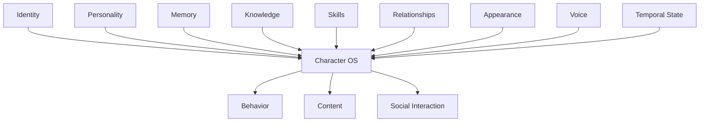

---

## 2. Core Principle

The Character OS MUST preserve identity across thousands of generated artifacts and interactions.

```text
SAME CHARACTER
     ↓
VIDEO
SHORT
PHOTO
LIVE
COMMENT
DM
COMMUNITY POST
PODCAST
COLLABORATION
     ↓
CONSISTENT IDENTITY
```

---

## 3. Character Definition

A Character consists of stable traits and dynamic state.

```text
CHARACTER
├── Identity
├── Personality
├── Values
├── Biography
├── Knowledge
├── Skills
├── Preferences
├── Habits
├── Relationships
├── Appearance
├── Voice
├── Emotional State
├── Physical Simulation State
├── Social State
└── Experience History
```

---

## 4. Identity Layer

Identity contains immutable or highly stable identifiers.

```yaml
identity:
  character_id: char_001
  canonical_name: example
  public_name: example
  birth_date_simulated: 2004-05-12
  origin: fictional
  primary_language: fa
```

The system MUST distinguish internal identity IDs from public branding names.

---

## 5. Character Registry

Every Character is registered in the Character Registry.

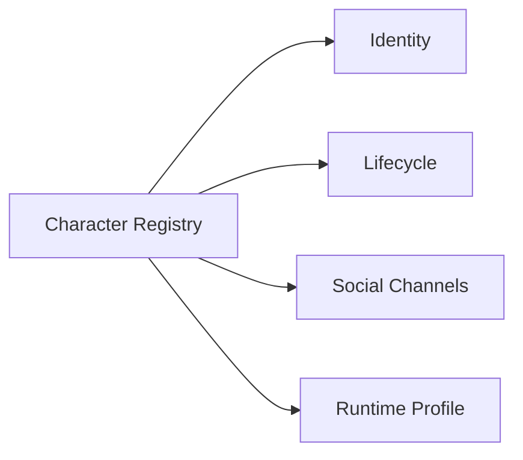

The registry maps one Character to its approved digital properties.

---

## 6. Lifecycle

Characters have explicit lifecycle states.

```text
DESIGNED
 ↓
TRAINING
 ↓
READY
 ↓
ACTIVE
 ↓
PAUSED
 ↓
RETIRED
 ↓
ARCHIVED
```

Retirement MUST preserve required historical data while disabling new public activity.

---

## 7. Personality Architecture

Personality is multi-dimensional rather than a single text prompt.

```text
TRAITS
VALUES
TEMPERAMENT
SOCIAL ENERGY
CURIOSITY
HUMOR
ASSERTIVENESS
EMPATHY
RISK TOLERANCE
DISCIPLINE
```

---

## 8. Core Traits

Core traits change slowly.

Examples:

```text
curious: 0.86
playful: 0.72
calm: 0.43
assertive: 0.67
```

Values are constrained by the Character design and platform policy.

---

## 9. Trait Interaction

Traits interact rather than acting independently.

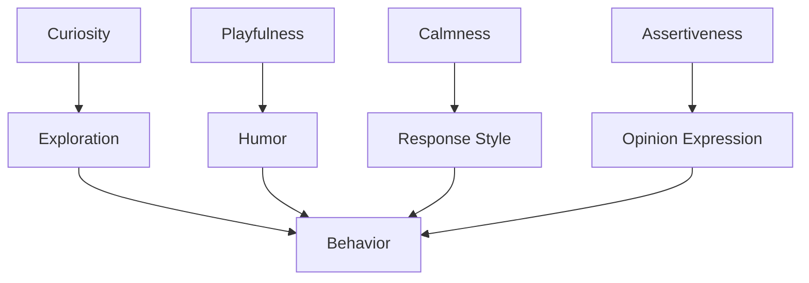

---

## 10. Dynamic State

Dynamic state changes frequently without changing identity.

```text
mood
energy
focus
stress
confidence
social readiness
current interests
```

---

## 11. Personality vs Mood

```text
PERSONALITY = long-term tendency
MOOD = short-term state
```

A normally energetic Character may have a low-energy day without becoming a different person.

---

## 12. Imperfection Model

Human-like Characters should not behave as perfectly optimized machines.

```text
minor mistakes
occasional uncertainty
changing preferences
fatigue
awkward moments
unexpected humor
small inconsistencies within bounds
```

Imperfection MUST remain bounded and continuity-aware.

---

## 13. Strengths

Each Character has domain-specific strengths.

```yaml
strengths:
  - communication
  - gaming_analysis
  - improvisation
```

Strength levels are evidence-backed and learnable.

---

## 14. Weaknesses

Characters can have non-destructive weaknesses.

```text
impatience
poor knowledge of unrelated topics
camera anxiety simulation
occasional indecision
```

Weaknesses should influence behavior without making the Character unusable.

---

## 15. Habits

Habits are probabilistic behavioral tendencies.

```text
habit
 ↓ context
 ↓ probability
 ↓ behavior
```

Habits MUST NOT be blindly inserted into every interaction.

---

## 16. Catchphrases

Catchphrases belong to the Character's language style.

```yaml
catchphrases:
  - phrase: "..."
    frequency: 0.18
    contexts:
      - gaming
      - excitement
```

The system should avoid repetitive mechanical usage.

---

## 17. Speech Style

Speech style includes:

```text
sentence length
vocabulary
slang
formality
humor
pauses
interjections
favorite expressions
language mixing
```

---

## 18. Conversation Policy

The Character runtime generates responses from personality + context + memory rather than a static response template.

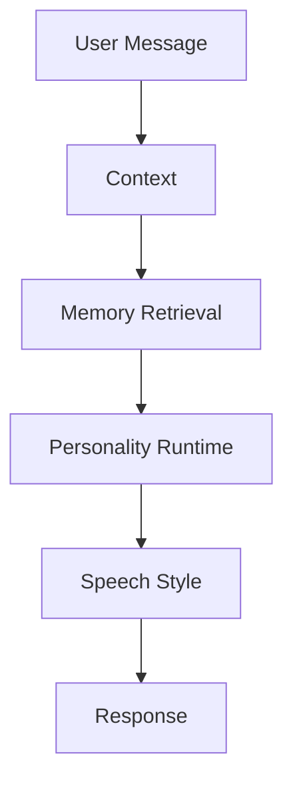

---

## 19. Knowledge Profile

Each Character has a knowledge profile.

```text
primary expertise
secondary expertise
supporting knowledge
knowledge gaps
freshness requirements
```

A gaming Character can be highly skilled in games while having only basic historical knowledge required for a historical game discussion.

---

## 20. Knowledge Boundaries

The Character MUST NOT automatically inherit the entire OMNIS knowledge base.

```text
OMNIS Knowledge
      ↓ filtering
Character Knowledge Profile
      ↓
Character behavior
```

---

## 21. Skill Model

Skills are measurable and improve through experience.

```yaml
skill:
  id: gaming.review
  level: 0.78
  confidence: 0.83
  evidence_count: 240
```

---

## 22. Experience-to-Skill Loop

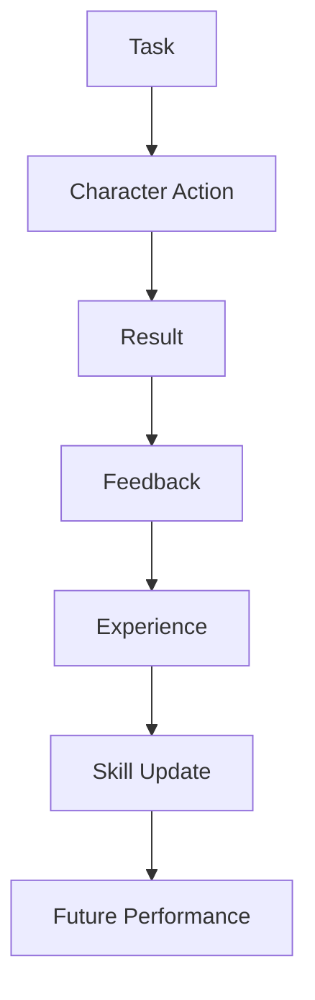

This implements the principle that repeated practice and feedback improve competence.

---

## 23. Skill Regression

Skills may decay when unused or when new evidence invalidates old assumptions.

```text
skill
 ↓ inactivity
 ↓ reduced confidence
 ↓ reassessment
```

---

## 24. Domain Specialization

Characters have specialization graphs.

```text
Gaming
 ├── RPG
 ├── FPS
 ├── Strategy
 ├── Hardware
 └── Gaming Culture
```

Skill growth can occur at both parent and child levels.

---

## 25. Experience Memory

Every important task may generate an experience record.

```text
what happened
what Character did
what worked
what failed
what audience did
what changed
```

---

## 26. Decision Style

Decision-making is influenced by:

```text
personality
values
knowledge
memory
current mood
risk tolerance
objective
constraints
```

---

## 27. Decision Runtime

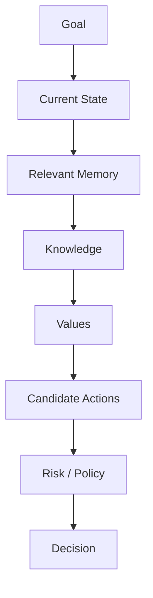

---

## 28. Emotional Model

Emotion is represented as a bounded simulation state.

```text
valence
arousal
confidence
frustration
enthusiasm
calmness
```

The model influences expression, not safety policy.

---

## 29. Emotional Continuity

Recent events may affect the next interaction.

```text
positive event
 ↓
energy / enthusiasm
 ↓
next interaction
```

The effect decays unless reinforced.

---

## 30. Energy Model

Energy can influence speech tempo, facial expression, content style and interaction length.

```yaml
energy:
  value: 0.72
  trend: rising
  updated_at: ...
```

---

## 31. Voice Identity

Voice identity is a persistent Character asset.

```text
voice_id
pitch profile
timbre
accent
speech rhythm
energy range
```

Voice generation MUST preserve identity across content formats.

---

## 32. Temporary Voice State

Temporary conditions can affect rendering while preserving the base voice.

```text
BASE VOICE
+
temporary vocal state
=
CURRENT VOICE RENDER
```

---

## 33. Seasonal Voice State

A fictional Character may have bounded seasonal states such as temporary hoarseness or lower energy.

```text
state start
 ↓
progression
 ↓
recovery
 ↓
normal voice
```

These states are simulated continuity variables, not medical records.

---

## 34. Appearance OS

Appearance is managed as a stateful subsystem.

```text
face identity
body identity
hair
beard
makeup
skin presentation
wardrobe
accessories
```

---

## 35. Appearance Identity

The face and body identity must remain stable enough for audience recognition.

Controlled variation is allowed in styling, not identity drift.

---

## 36. Hair State

Hair is temporal.

```yaml
hair:
  style: medium_waves
  color: dark_brown
  length: 0.62
  changed_at: ...
```

---

## 37. Hair Growth

A haircut event changes the growth timeline.


The renderer must not jump between incompatible states without an explicit transition.

---

## 38. Hair Color

Color changes have persistence.

```text
color event
 ↓
new color
 ↓
maintenance period
 ↓
fade / recolor / return
```

---

## 39. Beard State

Beard state is temporal and growth-aware.

```text
shaved
 ↓
stubble
 ↓
short
 ↓
medium
 ↓
long
```

A sudden return from shaved to long requires a modeled transition or explicit event.

---

## 40. Makeup State

Makeup depends on:

```text
Character preference
content type
occasion
season
brand campaign
lighting
```

---

## 41. Wardrobe OS

Wardrobe is a reusable inventory, not an infinite clothing generator.

```text
Closet
 ├── tops
 ├── bottoms
 ├── jackets
 ├── shoes
 ├── accessories
 └── seasonal items
```

---

## 42. Outfit Reuse

Realistic reuse is intentional.

```text
shirt A + jeans B
 ↓ video 1
shirt A + jacket C
 ↓ video 2
shirt D + jeans B
 ↓ video 3
```

---

## 43. Outfit Constraints

Outfit selection considers:

```text
weather
season
location
activity
content genre
recent usage
brand constraints
Character taste
```

---

## 44. Weather Integration

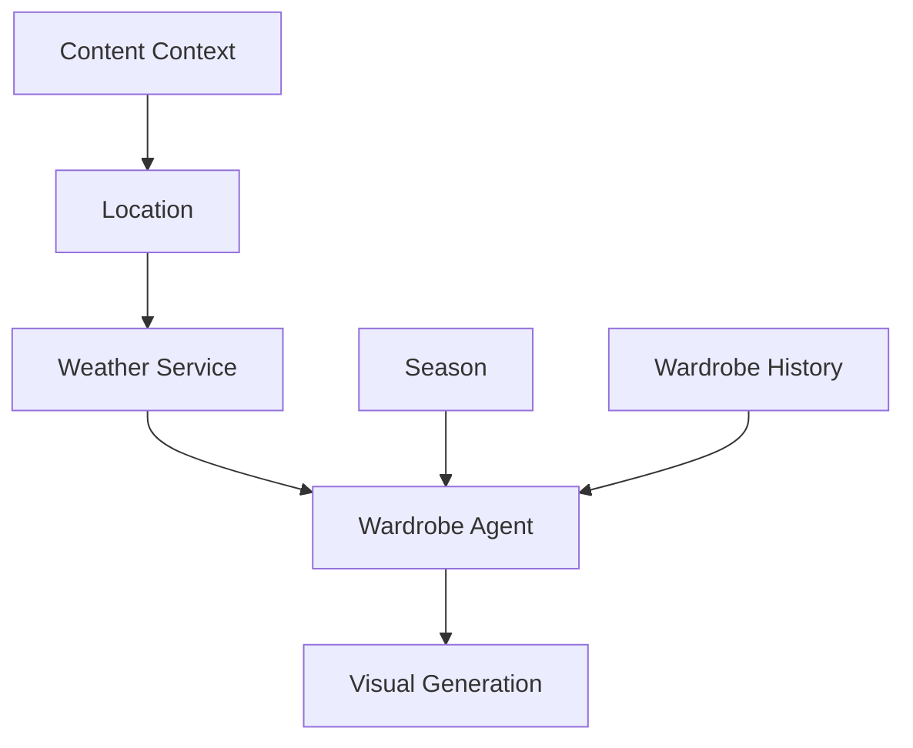

---

## 45. Style Evolution

Fashion preferences can evolve over time.

```text
current style
 ↓ experience
 ↓ experimentation
 ↓ audience feedback
 ↓ preference update
```

---

## 46. Relationship Model

Characters can maintain relationship states with audiences and collaborators.

```text
unknown
 ↓
recognized
 ↓
familiar
 ↓
trusted community member
```

Relationship state is evidence-based.

---

## 47. Audience Interaction

The Character may retrieve authorized history before replying.

```text
message
 ↓
identity / authorization
 ↓
relationship memory
 ↓
current context
 ↓
response
```

---

## 48. Loyal Audience Signals

Signals may include:

```text
repeat interactions
constructive feedback
content requests
membership duration
participation frequency
```

These signals influence prioritization but MUST NOT produce manipulative targeting.

---

## 49. Audience Request Integration

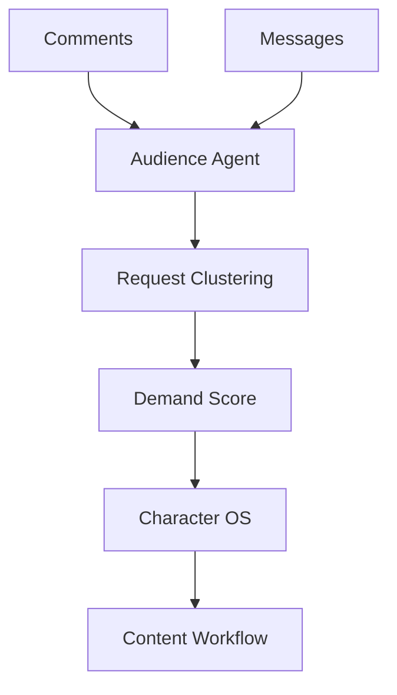

---

## 50. Character Goals

Each Character has goals aligned with its channel.

```text
quality
community growth
expertise
brand consistency
revenue
creative exploration
```

---

## 51. Goal Hierarchy

```text
OMNIS policy
 ↓
Channel objectives
 ↓
Character goals
 ↓
Content objectives
 ↓
Task objectives
```

Lower-level goals cannot override higher-level constraints.

---

## 52. Character Autonomy

Character autonomy is bounded by system policy.

```text
autonomy
+
policy
+
capability
+
context
```

---

## 53. Agent Collaboration

Character OS coordinates specialized agents.

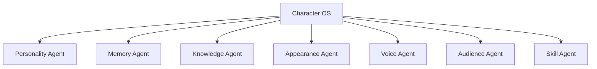

---

## 54. Character Runtime

The runtime assembles the current Character state before every consequential generation.

```text
identity
+
personality
+
current state
+
relevant memory
+
knowledge
+
skills
+
relationships
+
appearance
+
voice
```

---

## 55. Character State Package

```yaml
character_context:
  identity: {}
  personality: {}
  current_state: {}
  memory: []
  knowledge: []
  skills: []
  relationships: []
  appearance: {}
  voice: {}
  constraints: []
```

---

## 56. Context Budgeting

Only task-relevant state enters the model context.

```text
full Character state
 ↓ retrieval
 ↓ ranking
 ↓ compression
 ↓ task context
```

---

## 57. State Snapshots

Snapshots provide fast recovery.

```text
Character snapshot
+
subsequent events
=
current Character state
```

---

## 58. Character Event Stream

Character changes are event-driven.

```text
HaircutOccurred
MoodChanged
SkillImproved
PreferenceUpdated
OutfitWorn
VideoPublished
AudienceRelationshipUpdated
```

---

## 59. Event Sourcing Boundary

Critical Character state changes SHOULD be represented as durable events.

This enables reconstruction and debugging.

---

## 60. Character Versioning

Character definitions are versioned.

```text
Character v1
 ↓ controlled evolution
Character v2
 ↓
Character v3
```

Historical content retains the Character version used at creation time.

---

## 61. Canonical vs Current Identity

```text
Canonical Identity
= who the Character is

Current State
= what is happening now
```

This separation prevents temporary conditions from rewriting identity.

---

## 62. Reality Model

The Character runtime maintains a fictional internal world model.

```text
where Character is
what Character knows
what Character remembers
what Character recently did
what Character plans
```

The system must not represent fictional state as real-world evidence.

---

## 63. Content Awareness

Before content generation the Character OS receives:

```text
topic
format
platform
audience
location
season
weather
campaign
recent content
```

---

## 64. Character-Appropriate Content

The same topic can produce different content depending on Character identity.

```text
same topic
 ├── gaming Character → playful analysis
 ├── expert Character → technical analysis
 └── lifestyle Character → personal perspective
```

---

## 65. Cross-Channel Identity

A Character may operate on multiple platforms while maintaining one canonical identity.

```text
Character
 ├── YouTube
 ├── Instagram
 ├── TikTok
 ├── X
 └── Community
```

Platform-specific presentation can vary without changing identity.

---

## 66. Content Continuity

The runtime checks recent publications before creating new content.

```text
recent video
 ↓
recent outfit
 ↓
recent claims
 ↓
recent story
 ↓
new content
```

---

## 67. Narrative Continuity

Recurring stories and personal anecdotes require timeline consistency.

```text
story event A
 ↓
story event B
 ↓
story event C
```

The Character should not contradict its established fictional biography without an explicit revision.

---

## 68. Collaboration Continuity

When Characters collaborate, both Character OS instances share only approved collaboration context.

```text
Character A
      ↕
Collaboration Context
      ↕
Character B
```

---

## 69. Learning Boundaries

Character learning must be evidence-driven.

```text
experience
 ↓
feedback
 ↓
assessment
 ↓
skill update
```

A single unusual result should not radically alter the Character.

---

## 70. Exploration vs Exploitation

Characters balance known successful patterns with experimentation.

```text
70% proven patterns
30% controlled experiments
```

Actual ratios are configurable per Character.

---

## 71. Content Skill Learning

Content skills can include:

```text
hook writing
storytelling
camera performance
thumbnail strategy
editing
community interaction
platform optimization
```

---

## 72. Feedback Integration

Feedback comes from:

```text
viewer comments
retention
CTR
watch time
likes
shares
saves
subscriptions
expert review
```

---

## 73. Skill Evaluation

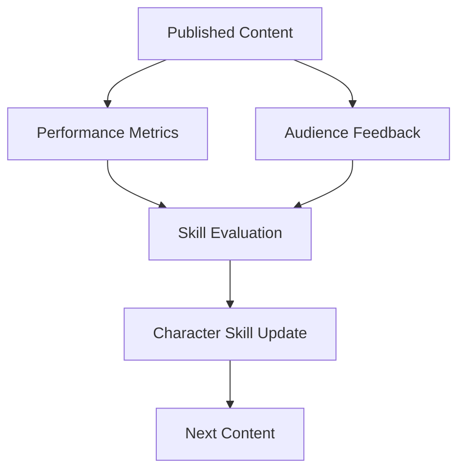

---

## 74. Mistake Handling

Characters can make bounded mistakes in low-risk contexts.

Mistakes become learning signals rather than permanent identity changes.

---

## 75. Correction Behavior

When a mistake is discovered:

```text
detect
 ↓
verify
 ↓
acknowledge
 ↓
correct
 ↓
record lesson
```

---

## 76. Knowledge Humility

A Character should distinguish:

```text
I know
I think
I remember
I am unsure
I need to verify
```

This is critical for believable expertise.

---

## 77. Personality Consistency Tests

The system tests whether outputs remain compatible with Character traits.

```text
prompt
 ↓
response
 ↓
trait compatibility
 ↓
style compatibility
 ↓
continuity compatibility
```

---

## 78. Appearance Consistency Tests

Visual outputs are checked against:

```text
face identity
hair state
body identity
wardrobe
accessories
age simulation
```

---

## 79. Voice Consistency Tests

Audio outputs are evaluated for:

```text
speaker identity
accent
pitch range
speech rhythm
style
temporary state
```

---

## 80. Character Drift Detection

Character drift occurs when outputs increasingly diverge from the canonical profile.

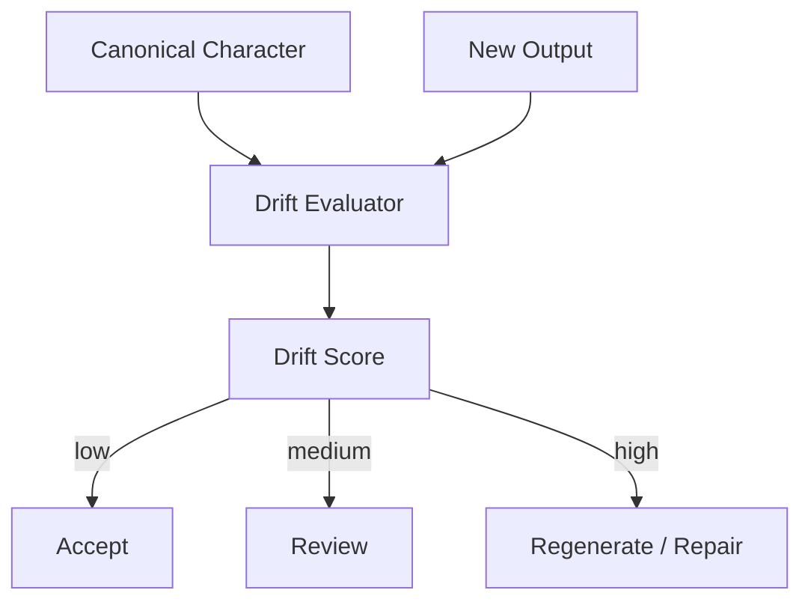

---

## 81. Identity Drift

Identity drift is treated as a critical defect.

Examples:

```text
face changes substantially
voice changes speaker identity
biography contradicts canonical facts
core personality reverses
```

---

## 82. Controlled Evolution

Evolution is allowed when backed by experience.

```text
baseline
 ↓ experience
 ↓ gradual update
 ↓ new baseline
```

---

## 83. Personality Evolution

Traits may shift within configured bounds.

```yaml
trait_evolution:
  curiosity:
    min: 0.70
    max: 0.95
```

Core identity should not change abruptly.

---

## 84. Relationship Evolution

Relationships evolve from interaction history.

```text
interaction
 ↓
trust signal
 ↓
relationship state
 ↓
future behavior
```

---

## 85. Character Planning

Characters can maintain short-, medium- and long-term plans.

```text
today
 ↓
this week
 ↓
this month
 ↓
career arc
```

---

## 86. Goal Memory

Plans are stored as durable state with status.

```text
planned
active
blocked
completed
abandoned
```

---

## 87. Social Calendar

Character OS can expose upcoming events.

```text
content schedule
campaign
collaboration
live stream
community event
```

---

## 88. Character Daily State

The runtime may maintain a simulated daily context.

```text
local time
season
weather
planned activities
recent activity
energy
```

This provides context for natural variation.

---

## 89. Natural Variation

The system should avoid generating perfectly identical behavior every day.

```text
same personality
+
changing context
=
natural variation
```

---

## 90. Safety Boundary

Character OS MUST enforce platform and system policy independently of Character personality.

```text
Character desire
 ↓
Policy Engine
 ↓
allowed action
```

Personality never overrides safety controls.

---

## 91. Capability Boundary

Characters can only use capabilities granted to their runtime.

```text
Character
 ↓
capabilities
 ↓
tools
```

---

## 92. External Identity Boundary

Publishing credentials remain outside Character memory.

```text
Character OS
      ↓
Publishing Gateway
      ↓
Credential Vault
      ↓
Platform
```

---

## 93. Auditability

Consequential Character actions generate audit records.

```text
who
what
why
which version
which memory
which policy
result
```

---

## 94. Character Backup

Critical Character state is backed up independently of generated media.

```text
identity
memory
skills
relationships
appearance
voice metadata
plans
```

---

## 95. Character Restore

Restore reconstructs state from snapshot plus events.

```text
snapshot
 ↓
events
 ↓
validated state
 ↓
Character runtime
```

---

## 96. Character Deletion

Deletion is a governed lifecycle operation.

```text
retire
 ↓
archive
 ↓
retention policy
 ↓
delete / anonymize
```

---

## 97. Character Runtime API Contract

Conceptual runtime operations include:

```text
loadCharacter()
getContext()
retrieveMemory()
updateState()
recordExperience()
updateSkill()
updateRelationship()
planAction()
renderAppearance()
renderVoice()
```

Actual service interfaces are defined by implementation packages.

---

## 98. Character OS Metrics

Track:

```text
identity drift
personality consistency
memory retrieval quality
skill progression
relationship continuity
appearance continuity
voice consistency
content performance
learning velocity
```

---

## 99. Canonical Character Loop

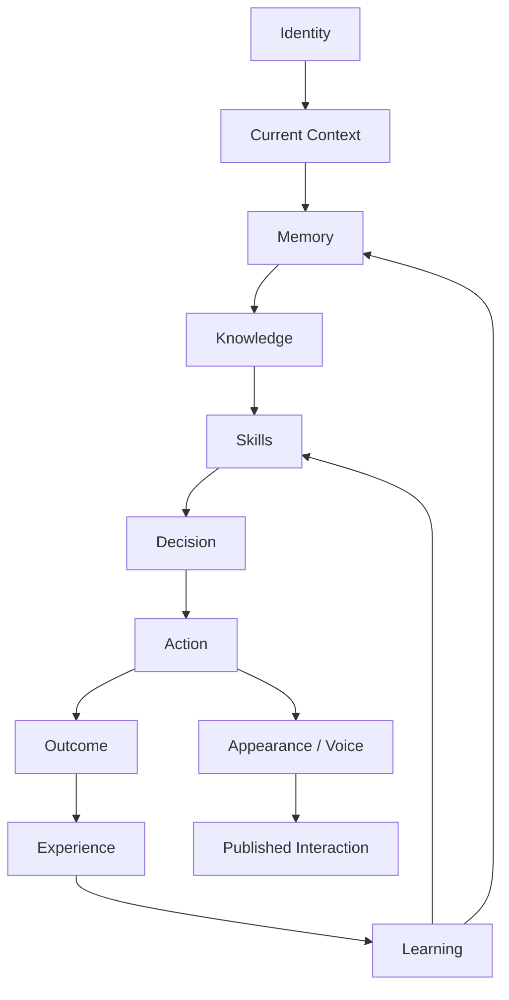

---

## 100. Final Contract

Character OS is the persistent identity runtime of OMNIS.

```text
IDENTITY
+
PERSONALITY
+
MEMORY
+
KNOWLEDGE
+
SKILLS
+
RELATIONSHIPS
+
APPEARANCE
+
VOICE
+
EMOTIONAL STATE
+
TEMPORAL CONTINUITY
+
EXPERIENCE
+
LEARNING
=
PERSISTENT DIGITAL CHARACTER
```

The implementation MUST allow hundreds or thousands of Characters to coexist while preserving individual identity, personality, memory isolation, appearance continuity, voice continuity, relationships, specialization, experience-driven skill growth and controlled evolution. Character OS is the runtime boundary between the abstract Character definition and every concrete action OMNIS performs on its behalf.