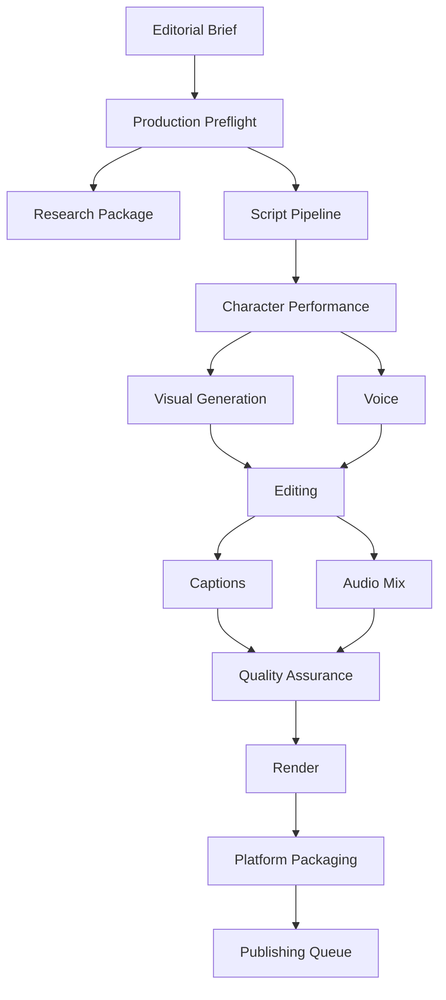
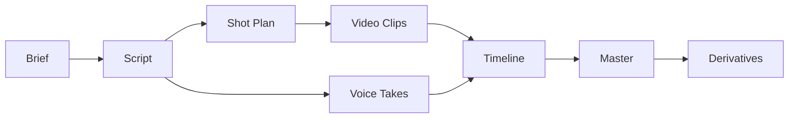
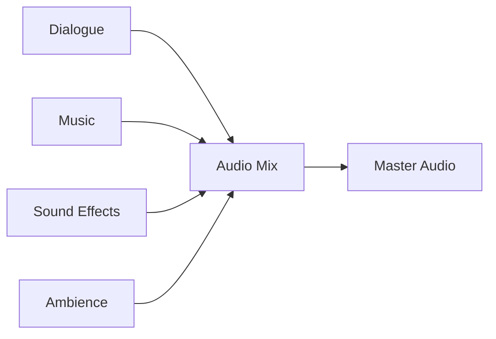
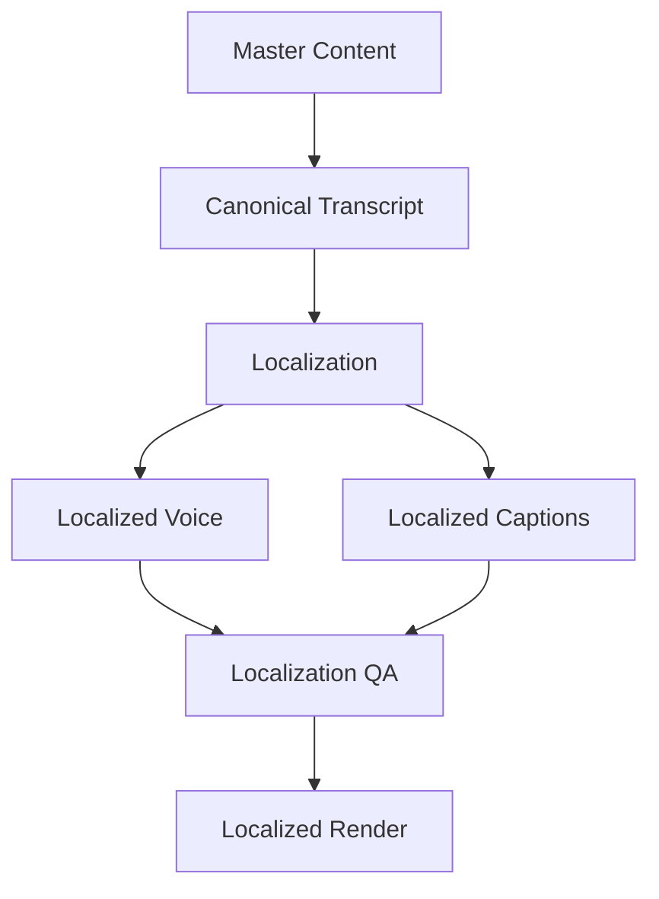
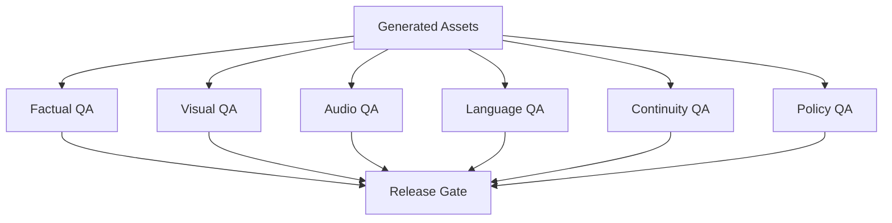
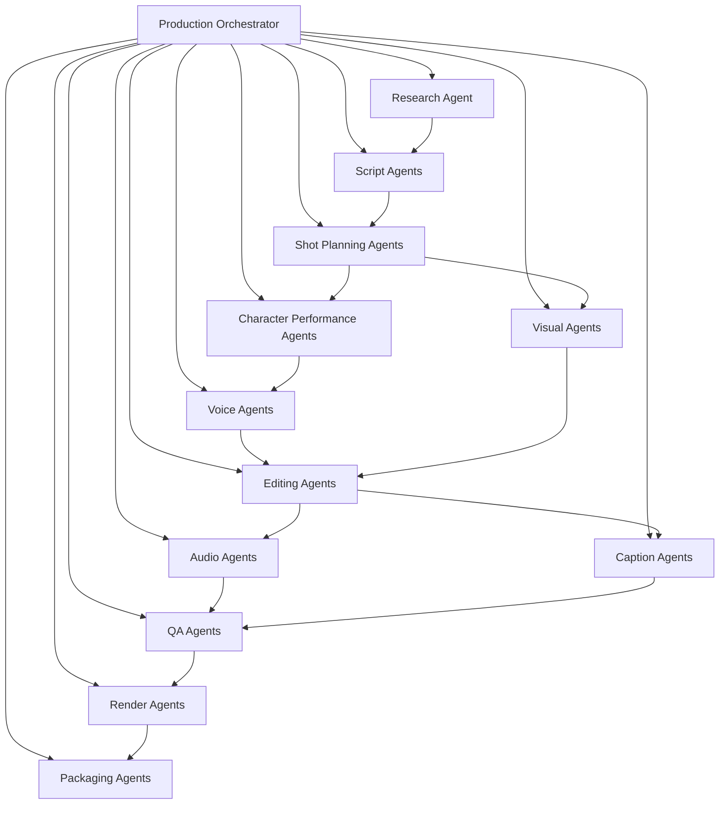

# OMNIS Content Factory and Production Engine Specification

> Version: 1.0.0  
> Status: Architecture Specification  
> Domain: Content Production / Media Generation / Editing / QA / Rendering / Publishing Preparation

## 1. Purpose

The Content Factory is the execution layer that transforms an approved editorial brief into production-ready, quality-controlled and platform-ready media assets. It coordinates research packages, scripts, Characters, voice, visuals, music, editing, captions, thumbnails, quality assurance and rendering.



## 2. Core Principle

Production is an orchestrated pipeline of deterministic, inspectable stages rather than one opaque generation call.

```text
BRIEF
 ↓
PLAN
 ↓
RESEARCH
 ↓
SCRIPT
 ↓
CHARACTER PERFORMANCE
 ↓
VOICE + VISUALS
 ↓
EDIT
 ↓
QA
 ↓
RENDER
 ↓
PACKAGE
 ↓
PUBLISH
```

## 3. Production Job

Every content item is represented as a versioned Production Job.

```yaml
production_job:
  id: job_001
  channel_id: gaming_001
  character_id: char_007
  brief_id: brief_102
  status: production
  priority: high
  target_platforms:
    - youtube
    - instagram
```

## 4. Job Isolation

Production jobs must be isolated so a failure in one job does not corrupt another job or Character state.

## 5. Idempotency

Repeatable stages should be idempotent whenever possible.

## 6. Artifact Graph

Every generated asset is linked to its parent stage and source inputs.



## 7. Production Manifest

Each job has a manifest containing versions, assets, model configuration, prompts, parameters, approvals and hashes where applicable.

## 8. Reproducibility

A production should be reproducible as closely as the underlying external models and services permit.

## 9. Preflight

Before generation begins, the system validates Character state, research freshness, required assets, platform constraints, deadlines and resource availability.

## 10. Research Gate

Time-sensitive scripts require fresh research before production proceeds.

## 11. Script Gate

The script must satisfy editorial objectives, factual requirements, Character voice and format constraints.

## 12. Script Structure

```text
hook
context
setup
main beats
examples
turning point
conclusion
CTA
```

## 13. Narrative Beats

Long-form productions are represented as structured narrative beats rather than only raw text.

## 14. Shot Plan

Each visual beat can map to one or more shots.

```yaml
shot:
  id: shot_012
  beat: 5
  purpose: demonstration
  duration_target: 4.5
  character_required: true
  broll_required: true
```

## 15. Character Performance

Character OS supplies identity, personality, emotional state, appearance state, wardrobe state and performance constraints.

## 16. Character Continuity

The production engine must consume the latest valid Character state before generating appearance or performance assets.

## 17. Physical State

Voice, appearance and performance can reflect temporary state such as fatigue, weather context or configured illness simulation when appropriate and explicitly modeled.

## 18. Appearance State

Hair, makeup, beard, wardrobe and accessories are resolved through Character continuity systems.

## 19. Wardrobe Resolution

The wardrobe engine selects clothing based on Character taste, season, weather, context, previous outfits and continuity.

## 20. Outfit Reuse

Realistic wardrobe behavior allows an outfit or individual garment to reappear over time rather than forcing a new outfit for every video.

## 21. Hair / Grooming Continuity

Hair and grooming changes must respect elapsed time and previous Character state.

## 22. Voice Profile

Voice generation uses the Character's persistent vocal identity rather than generating an unrelated voice for every job.

## 23. Voice State

Voice can incorporate configured temporary conditions such as tiredness, excitement, seasonal roughness or other modeled states.

## 24. Speech Style

Vocabulary, rhythm, filler words, catchphrases and conversational patterns come from Character Personality and Communication Style.

## 25. Voice QA

Generated audio is checked for pronunciation, continuity, artifacts, clipping, unnatural pauses and unwanted variation.

## 26. Visual Generation

Visual assets may include Character shots, environments, B-roll, illustrations, product imagery, motion graphics and generated scenes.

## 27. Character Identity Lock

Character visual generation must preserve identity-defining features across shots.

## 28. Scene Continuity

Camera position, lighting, wardrobe, environment and Character state should remain consistent when the narrative requires continuity.

## 29. B-Roll

B-roll is selected or generated to support the narrative rather than merely fill empty space.

## 30. Asset Provenance

Every externally sourced or generated asset should retain provenance metadata.

## 31. Asset Licensing

The asset system records usage rights, license constraints and attribution requirements where applicable.

## 32. Music

Music selection is driven by emotional objective, Character identity, pacing and licensing constraints.

## 33. Sound Effects

Sound effects support narrative clarity and immersion without overwhelming dialogue.

## 34. Audio Architecture



## 35. Audio Mixing

Dialogue intelligibility is prioritized while music and effects are dynamically balanced.

## 36. Loudness

Platform-specific loudness and peak constraints are validated during QA.

## 37. Editing Timeline

The editor operates on a structured timeline rather than destructive direct media manipulation.

## 38. Timeline Elements

```text
video tracks
audio tracks
captions
graphics
transitions
markers
metadata
```

## 39. Automated Editing

Agents can propose cuts, pacing, transitions, B-roll placement, captions and graphics based on the editorial brief.

## 40. Human-Style Pacing

Pacing models should preserve natural pauses, reactions and conversational rhythm instead of maximizing cuts blindly.

## 41. Emotional Editing

Cut timing can respond to Character emotion, narrative tension and audience attention goals.

## 42. Attention Management

The engine may use pattern variation to reduce monotony while preserving comprehension.

## 43. Retention Safety

Retention optimization must not rely on deceptive hooks or materially misleading titles and visuals.

## 44. Caption Generation

Captions are generated from the final approved dialogue track.

## 45. Caption QA

Captions are checked for timing, spelling, speaker association and readability.

## 46. Localization

Approved content can be adapted into additional languages while preserving Character identity and editorial meaning.

## 47. Localization Pipeline



## 48. Thumbnail Production

The Thumbnail Engine receives the editorial objective, topic, Character and platform requirements.

## 49. Thumbnail Testing

Multiple candidate thumbnails may be generated and evaluated before publication when platform capabilities support testing.

## 50. Title Packaging

Title, thumbnail and description form a coordinated packaging unit.

## 51. Description

Descriptions are generated from verified content metadata and platform-specific requirements.

## 52. Tags / Metadata

Metadata is selected from validated topic and content information rather than fabricated keywords.

## 53. Platform Packaging

Each platform receives a native package.

```text
YouTube:
video + title + description + thumbnail + captions + chapters

Instagram:
reel/video + caption + cover + hashtags/metadata

TikTok:
video + caption + cover + metadata
```

## 54. Derivative Generation

A master production can produce multiple derivatives.

## 55. Derivative Policy

Derivatives must preserve factual and Character consistency with the master content.

## 56. Shorts Extraction

Long-form videos can generate candidate short segments based on narrative completeness and standalone value.

## 57. Clip Scoring

Candidate clips are scored for hook strength, context completeness, emotional intensity and audience fit.

## 58. Community Assets

The factory can generate posts, polls, questions and discussion prompts associated with a production.

## 59. Live Assets

A published or planned production can generate live discussion briefs and talking points.

## 60. QA Architecture

Quality assurance is multi-layered.



## 61. Factual QA

Claims are checked against the approved research package.

## 62. Visual QA

Visual output is checked for artifacts, identity drift, anatomy errors, continuity problems and unwanted elements.

## 63. Audio QA

Audio is checked for clipping, noise, distortion, pronunciation and Character voice consistency.

## 64. Language QA

Language quality includes grammar, coherence, pronunciation metadata and localization accuracy.

## 65. Continuity QA

The engine compares generated assets with Character and story state.

## 66. Policy QA

Platform, brand, safety and configured content policies are checked before release.

## 67. Brand QA

Typography, colors, logos, visual motifs and channel identity are validated against brand rules.

## 68. Accessibility QA

Captions, contrast, readable text and other configured accessibility requirements are validated.

## 69. Release Gate

No production reaches the publishing queue until required QA gates pass or an authorized override is recorded.

## 70. Human Review

High-risk or high-value productions can require human approval.

## 71. Review Priority

Review requirements can depend on topic risk, commercial importance, Character novelty and production confidence.

## 72. Failed QA

Failed assets return to the smallest appropriate upstream stage rather than restarting the entire job unnecessarily.

## 73. Retry Policy

Retries use controlled parameters and preserve failed outputs for diagnostics.

## 74. Model Fallback

If a generation model fails, the orchestrator can route the task to an approved fallback model.

## 75. Model Routing

Model selection depends on quality, task type, latency, cost, availability and policy constraints.

## 76. Cost Control

Production jobs track model usage and estimated cost per stage.

## 77. Quality / Cost Tradeoff

Critical scenes can receive higher-quality models while low-impact assets use cheaper models.

## 78. Batch Processing

Compatible jobs can be batched to improve throughput.

## 79. Parallelism

Independent assets can be generated concurrently while respecting resource and provider limits.

## 80. Dependency Scheduling

Dependent stages wait for required artifacts while unrelated stages continue.

## 81. Agent Architecture



## 82. Agent Permissions

Specialized agents operate within explicit stage boundaries and cannot silently modify upstream Character identity or trusted knowledge.

## 83. Orchestration

The Production Orchestrator manages dependencies, retries, model routing, capacity and state transitions.

## 84. State Machine

```text
created
→ preflight
→ researching
→ scripting
→ asset_generation
→ editing
→ qa
→ rendering
→ packaging
→ ready_to_publish
→ published
```

## 85. Cancellation

Jobs can be cancelled safely before irreversible external operations.

## 86. Resume

Interrupted jobs resume from the latest valid checkpoint.

## 87. Checkpointing

Expensive stages store reusable intermediate artifacts.

## 88. Artifact Retention

Retention policies balance reproducibility, storage cost and privacy.

## 89. Security

Credentials, private source data and provider secrets never belong in production artifacts or prompts unless explicitly required and protected.

## 90. Privacy

Private audience information is minimized and compartmentalized from content-generation agents.

## 91. Audit Log

Each job records state changes, model decisions, approvals, failures and publication events.

## 92. Observability

Production metrics include queue latency, stage latency, failure rate, retry rate, cost and quality scores.

## 93. Quality Metrics

```text
factual accuracy
visual consistency
audio quality
caption accuracy
continuity score
brand compliance
policy compliance
render success
publication success
```

## 94. Throughput Metrics

```text
jobs/day
assets/hour
average production time
parallel jobs
render utilization
agent utilization
```

## 95. Learning Feedback

Post-publication analytics can influence future script, hook, pacing, format and production strategies.

## 96. Performance Attribution

Production metadata should allow downstream analytics to connect outcomes to relevant production choices.

## 97. Golden Assets

Approved Character reference images, voice samples, brand assets and visual identity references can serve as stable production anchors.

## 98. Model Versioning

Model identifiers and configuration snapshots are stored with production manifests.

## 99. Final Pipeline


## 100. Final Contract

The Content Factory and Production Engine MUST transform approved editorial briefs into reproducible, inspectable and quality-controlled media packages. It MUST preserve Character identity and continuity, coordinate research, script, performance, voice, visuals, editing, audio, captions, thumbnails, localization, QA, rendering and platform packaging, support parallel multi-channel production, enforce stage boundaries and auditability, and provide structured feedback to the wider OMNIS learning system.
