# OMNIS Content Factory Specification

> Version: 1.0.0  
> Status: Core Implementation Specification  
> Domain: Content OS / YouTube / Instagram / TikTok / Social Media / Quality / Learning

---

## 1. Mission

The Content Factory is the primary production system of OMNIS. Its responsibility is not merely to generate media, but to discover valuable opportunities, design superior content, produce it at high quality, validate it, publish it, measure audience response and continuously improve future production.

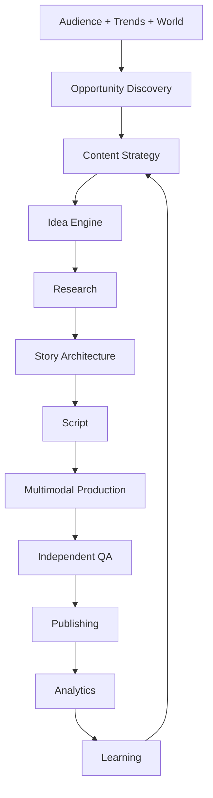

---

## 2. Quality Principle

OMNIS optimizes for audience value, not raw generation volume.

```text
VALUE
+ RELEVANCE
+ ORIGINALITY
+ ACCURACY
+ ENTERTAINMENT
+ RETENTION
+ PRODUCTION QUALITY
+ CHARACTER AUTHENTICITY
+ TIMELINESS
= CONTENT QUALITY
```

---

## 3. Content Unit

Every production begins as a Content Unit.

```yaml
content_unit:
  id: content_001
  channel_id: channel_001
  character_id: char_001
  platform: youtube
  format: long_form
  objective: educate_and_entertain
  topic: ...
  status: ideation
```

---

## 4. Content Lifecycle

```text
SIGNAL
 ↓
OPPORTUNITY
 ↓
IDEA
 ↓
RESEARCH
 ↓
DESIGN
 ↓
SCRIPT
 ↓
PRODUCTION
 ↓
QA
 ↓
PUBLISH
 ↓
MEASURE
 ↓
LEARN
```

Every transition is observable and recoverable.

---

## 5. Content Portfolio

A channel maintains a portfolio rather than producing unrelated videos.

```text
Evergreen
Trending
Community Requests
Experimental
Series
Commercial
Authority
Entertainment
```

Portfolio allocation is configurable per channel.

---

## 6. Channel Strategy

Content decisions inherit channel strategy.

```text
Brand
 ↓
Audience
 ↓
Positioning
 ↓
Content Pillars
 ↓
Formats
 ↓
Publishing Strategy
```

---

## 7. Content Pillars

Each channel defines primary and secondary pillars.

```yaml
pillars:
  primary:
    - gaming
  secondary:
    - hardware
    - gaming_history
```

---

## 8. Audience Intelligence

Audience signals are first-class production inputs.

```text
Comments
DMs
Community Posts
Search Queries
Retention
Shares
Saves
Likes
Dislikes where available
Membership Signals
```

---

## 9. Community Request Mining

Agents extract explicit requests from audience communication.

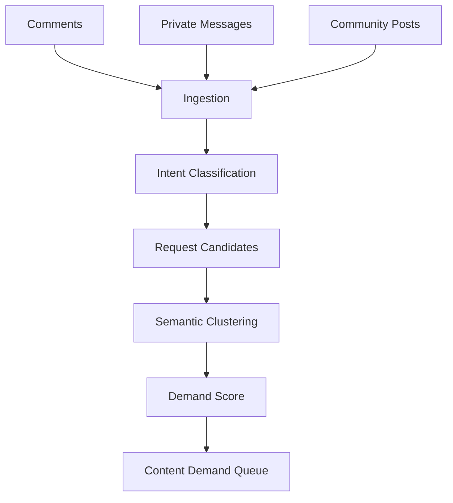

---

## 10. Request Deduplication

Equivalent requests are grouped into one demand cluster.

```text
"Make a video about X"
"Can you review X?"
"Please explain X"
        ↓
     Topic X
```

---

## 11. Demand Score

Demand considers frequency, recency, audience quality and strategic relevance.

```text
Demand Score
= frequency
+ velocity
+ recency
+ audience relevance
+ strategic fit
```

---

## 12. Loyal Audience Signals

Repeated constructive participation may increase request confidence, but never guarantees preferential treatment.

---

## 13. Trend Intelligence

Trend Agents monitor permitted sources and detect emerging topics.

```text
News
Search Trends
Social Trends
Creator Trends
Product Releases
Game Releases
Platform Events
```

---

## 14. Trend Velocity

Trend velocity estimates how rapidly attention is changing.

```text
low → stable
medium → growing
high → exploding
```

---

## 15. Trend Lifecycle

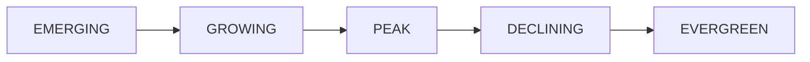

---

## 16. Opportunity Detection

A topic becomes an opportunity when demand and production feasibility align with strategic value.

```text
Opportunity
= Demand × Relevance × Timing × Differentiation × Feasibility
```

---

## 17. Topic Scoring

Topic scoring includes:

```text
Audience Demand
Trend Velocity
Search Potential
Competition
Novelty
Character Fit
Channel Fit
Monetization Potential
Production Cost
Time Sensitivity
```

---

## 18. Competition Analysis

OMNIS analyzes existing content to identify gaps, not to copy it.

```text
Existing Content
 ↓
Gap Analysis
 ↓
Differentiation Opportunity
```

---

## 19. Originality

The system must prefer original framing, research, storytelling and production over superficial duplication.

---

## 20. Idea Engine

The Idea Engine transforms opportunities into candidate concepts.

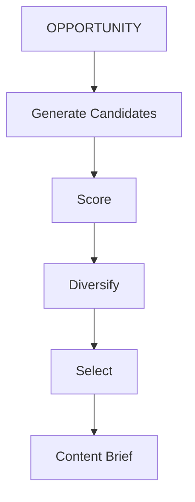

---

## 21. Idea Diversity

The system should generate multiple angles.

```text
explainer
review
story
comparison
experiment
reaction
investigation
list
challenge
interview
```

---

## 22. Idea Evolution

Winning ideas can evolve into series.

```text
Video A
 ↓ performance
Video B
 ↓ performance
Series
 ↓
Franchise
```

---

## 23. Content Brief

Every selected idea receives a production brief.

```yaml
brief:
  audience: ...
  promise: ...
  hook: ...
  thesis: ...
  emotional_arc: ...
  format: ...
  duration: ...
  platform: ...
```

---

## 24. Audience Promise

The brief must state what the viewer gains by watching.

```text
CLICK
 ↓
PROMISE
 ↓
DELIVERY
```

The title and opening must not promise something the video does not deliver.

---

## 25. Research Engine

Research is performed before factual claims are finalized.

```text
Question
 ↓
Search
 ↓
Source Collection
 ↓
Extraction
 ↓
Cross-check
 ↓
Evidence Graph
```

---

## 26. Source Quality

Sources are ranked by authority, relevance, freshness and corroboration.

```text
Primary
Official
Academic
Professional
Established journalism
Community
Unverified
```

---

## 27. Evidence Graph

Claims connect to supporting sources.

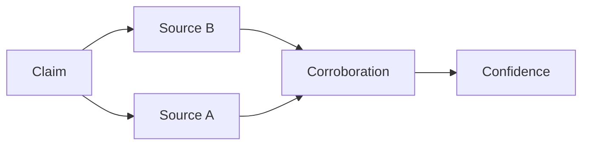

---

## 28. Fact Checking

Every consequential factual claim should have an evidence status.

```text
verified
probable
uncertain
unsupported
contradicted
```

---

## 29. Freshness

Time-sensitive claims carry an expiration or review requirement.

```yaml
claim:
  text: ...
  verified_at: ...
  freshness_ttl: 24h
```

---

## 30. Research Cutoff

Production records the research cutoff timestamp so later changes do not silently rewrite historical production decisions.

---

## 31. Story Architecture

The Story Architect designs the viewer journey before prose is generated.

```text
HOOK
 ↓
CONTEXT
 ↓
TENSION
 ↓
DISCOVERY
 ↓
PAYOFF
 ↓
CLOSURE
```

---

## 32. Hook Engineering

Hooks must establish curiosity, value, surprise or emotional relevance quickly.

```text
Question
Conflict
Unexpected fact
Challenge
Promise
Mystery
```

---

## 33. Retention Architecture

Retention is designed as a sequence of meaningful information or emotional transitions, not artificial withholding.


---

## 34. Script Engine

Script generation uses the Story Architecture and Character OS context.

```text
Brief
+
Research
+
Character
+
Story
+
Platform
=
Script
```

---

## 35. Character Voice

The script must sound like the selected Character rather than a generic model.

```text
Character traits
+ vocabulary
+ rhythm
+ humor
+ opinions
+ habits
= character voice
```

---

## 36. Human-Like Imperfection

Minor natural variation can be introduced when appropriate.

```text
pauses
self-correction
small reactions
contextual humor
natural hesitation
```

It must not damage clarity or intentionally introduce factual errors.

---

## 37. Script Review

Scripts pass multiple evaluations.

```text
FACTUALITY
CHARACTER FIT
STRUCTURE
HOOK
RETENTION
ORIGINALITY
POLICY
```

---

## 38. Visual Direction

The Visual Director translates the script into shots.

```yaml
shot:
  id: shot_001
  purpose: hook
  duration: 3.2
  framing: close_up
  camera: handheld
  environment: ...
  character_state: ...
```

---

## 39. Shot List

Every visual segment has an explicit purpose.

```text
Narration
 ↓
Shot purpose
 ↓
Visual asset
 ↓
Motion
 ↓
Transition
```

---

## 40. Cinematic Continuity

The production system tracks:

```text
location
lighting
camera
character position
wardrobe
hair
props
time
weather
```

---

## 41. Character Continuity

Visual generation receives Character OS state snapshots.

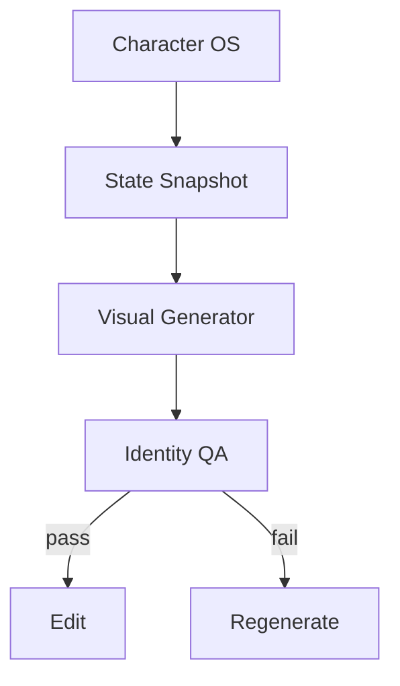

---

## 42. Wardrobe Continuity

The same outfit can reappear naturally across scenes and content.

```text
Outfit State
 ↓
Shot 1
 ↓
Shot 2
 ↓
Shot 3
```

---

## 43. Environment Continuity

Location and environment state are persistent across connected shots.

---

## 44. Image Generation

Image generation uses structured visual prompts derived from shot specifications.

---

## 45. Video Generation

Video generation may combine generated clips, animation, recorded assets and stock/media assets where licensed.

---

## 46. Asset Registry

All media assets are registered.

```yaml
asset:
  id: asset_001
  type: video
  source: generated
  license: internal
  provenance: {}
```

---

## 47. Asset Provenance

OMNIS records how each asset was produced or obtained.

```text
source
provider
model
prompt version
input assets
license
timestamp
```

---

## 48. Voice Production

Voice generation receives:

```text
Character voice
emotion
energy
script
pronunciation
scene context
```

---

## 49. Speech Performance

Speech performance controls:

```text
pace
pitch
volume
pauses
emphasis
emotion
breath simulation
```

---

## 50. Lip Synchronization

Character facial animation and generated speech must be temporally aligned.

```text
Audio
 ↓ phoneme timing
 ↓
Facial Animation
 ↓
Visual QA
```

---

## 51. Editing Engine

Editing is an intelligent assembly process.

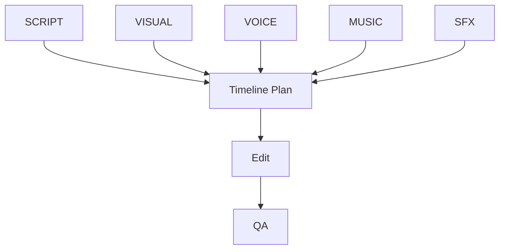

---

## 52. Editing Objectives

The editor optimizes:

```text
clarity
pacing
continuity
emotion
information density
audio quality
visual variety
brand identity
```

---

## 53. Pacing

Pacing varies according to genre and Character rather than applying one universal cut frequency.

---

## 54. Music Engine

Music selection considers:

```text
mood
tempo
scene
platform
licensing
Character identity
```

---

## 55. Sound Design

Sound effects should reinforce action and immersion without overwhelming narration.

---

## 56. Audio Mastering

Audio QA checks:

```text
loudness
clipping
noise
speech intelligibility
music balance
channel consistency
```

---

## 57. Subtitle Engine

Subtitles are generated from the final speech timeline and validated against audio.

---

## 58. Localization

Content can be adapted for multiple languages while preserving Character identity and meaning.

```text
Original
 ↓
Semantic Translation
 ↓
Character Localization
 ↓
Voice Localization
 ↓
Subtitle Localization
```

---

## 59. Thumbnail Engine

Thumbnails are treated as a separate creative product.

```text
Video promise
 ↓
Thumbnail concept
 ↓
Visual hierarchy
 ↓
Readability
 ↓
Variant generation
```

---

## 60. Thumbnail Constraints

Thumbnail generation considers:

```text
mobile readability
subject prominence
contrast
brand consistency
curiosity
truthfulness
```

---

## 61. Title Engine

Title candidates optimize clarity, relevance and curiosity without deceptive claims.

---

## 62. Metadata Engine

Metadata may include:

```text
description
tags
chapters
hashtags
category
playlist
keywords
```

---

## 63. SEO / Discovery

Discovery optimization uses available platform signals and current search behavior.

---

## 64. Platform Adaptation

One master production can produce platform-specific variants.

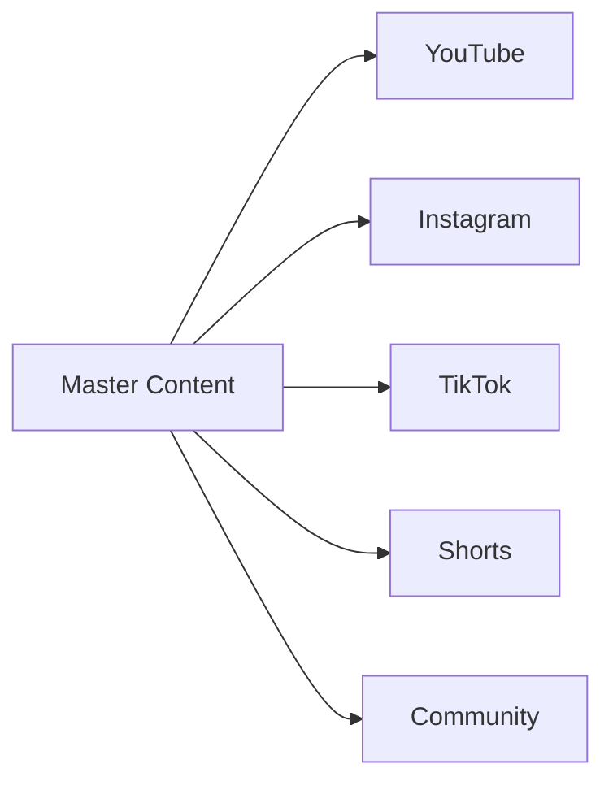

---

## 65. Format Repurposing

Long-form content can become:

```text
Shorts
Reels
TikToks
Quotes
Carousels
Community Posts
Stories
```

Repurposing must preserve context and avoid misleading excerpts.

---

## 66. Quality Architecture

Quality is multi-dimensional.

```text
FACTUAL
STORY
CHARACTER
VISUAL
AUDIO
EDIT
BRAND
PLATFORM
SAFETY
```

---

## 67. Producer / Critic Separation

Production and critical evaluation are separate roles.

```text
PRODUCER
   ↓
ARTIFACT
   ↓
CRITIC
   ↓
REPAIR
   ↓
CRITIC
```

---

## 68. Quality Score

A composite quality score is produced from independent dimensions.

```text
Q = f(F, S, C, V, A, E, B, P)
```

The exact weighting is channel-configurable.

---

## 69. Factual QA

Checks claims against the Evidence Graph.

---

## 70. Character QA

Checks:

```text
voice
personality
appearance
knowledge boundaries
biography
behavior
```

---

## 71. Visual QA

Checks:

```text
identity
hands / anatomy where relevant
continuity
artifacts
resolution
composition
lighting
```

---

## 72. Audio QA

Checks speech identity and technical quality.

---

## 73. Story QA

Checks promise fulfillment, pacing, structure and payoff.

---

## 74. Policy QA

Checks platform and system policy independently from creative quality.

---

## 75. Technical QA

Checks:

```text
codec
resolution
frame rate
audio tracks
subtitle format
file integrity
```

---

## 76. Repair Engine

Failed artifacts are repaired at the smallest possible scope.

```text
bad sentence → regenerate sentence
bad shot → regenerate shot
bad audio → re-render audio
bad timeline → rebuild timeline
```

Full regeneration is used only when necessary.

---

## 77. QA Loop

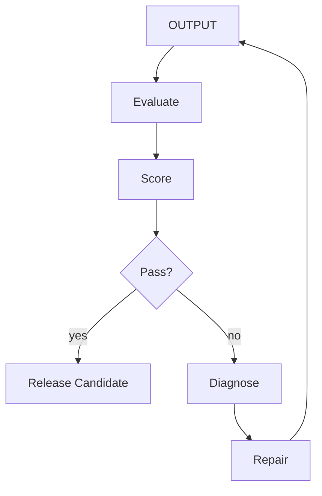

---

## 78. Human Review

High-impact content can require human approval before publication.

---

## 79. Publishing Gateway

Publishing is isolated from production.

```text
Content Factory
 ↓
Publishing Gateway
 ↓
Credential Vault
 ↓
Platform API
```

---

## 80. Scheduling

Publishing considers:

```text
audience timezone
platform behavior
content urgency
campaign schedule
channel cadence
```

---

## 81. Publishing Safety

The system must prevent duplicate publication and accidental cross-channel publishing.

---

## 82. Analytics Ingestion

After publication, OMNIS collects permitted platform metrics.

```text
views
watch time
retention
CTR where available
likes
comments
shares
saves
subscriptions
revenue signals
```

---

## 83. Early Performance Window

The system observes early signals without prematurely declaring a winner.

---

## 84. Performance Attribution

Metrics are attributed to:

```text
idea
hook
title
thumbnail
Character
format
topic
platform
publishing time
```

---

## 85. Experiment Engine

Controlled experiments compare variants.

```text
Variant A
Variant B
 ↓
Controlled comparison
 ↓
Evidence
```

---

## 86. Learning Engine

The Learning Engine converts outcomes into reusable knowledge.

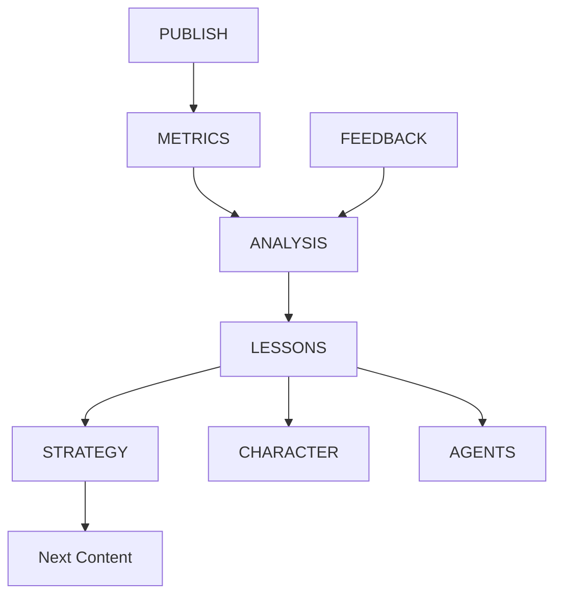

---

## 87. Learning Scope

Learning can update:

```text
channel strategy
content formats
Character skills
Agent strategies
topic priorities
thumbnail patterns
hook patterns
```

---

## 88. Avoiding Overfitting

One successful video must not rewrite the entire strategy.

```text
single result
 ≠
permanent truth
```

---

## 89. Evidence Weighting

Learning confidence increases with repeated evidence.

```text
1 result → weak evidence
10 results → moderate evidence
100 results → stronger evidence
```

Actual statistical treatment is defined by Analytics specifications.

---

## 90. Content Memory

Every content unit stores production history.

```text
idea
research
script
assets
edits
QA
publication
performance
lessons
```

---

## 91. Content Graph

Content relationships form a graph.

```text
Topic
 ├── Idea
 ├── Video
 ├── Short
 ├── Community Post
 └── Audience Request
```

---

## 92. Series Management

Series maintain shared narrative and visual identity.

---

## 93. Evergreen Management

Evergreen content is periodically reviewed for factual freshness and relevance.

---

## 94. Breaking Content

Time-sensitive content uses accelerated workflows with stricter freshness checks.

```text
breaking signal
 ↓
rapid research
 ↓
fast verification
 ↓
accelerated production
 ↓
priority QA
```

---

## 95. Commercial Content

Sponsored or commercial content must be represented explicitly in the Content Unit and follow platform disclosure requirements.

---

## 96. Brand Safety

Brand suitability is evaluated before publication where required.

---

## 97. Content Diversity

The scheduler prevents a channel from becoming repetitive.

```text
same topic
same format
same hook
same visual style
        ↓
   repetition risk
```

---

## 98. Creative Exploration

A configurable portion of the portfolio explores new formats and topics.

---

## 99. Content Calendar

The calendar combines:

```text
planned series
trends
community requests
campaigns
evergreen slots
experiments
```

---

## 100. Calendar Optimization

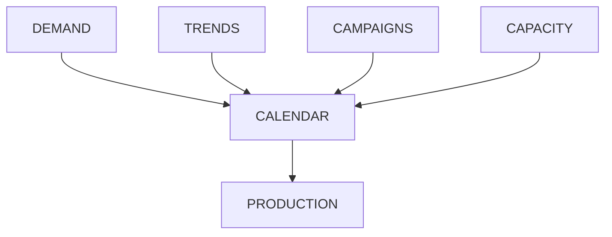

---

## 101. Production Capacity

The scheduler accounts for:

```text
GPU capacity
model quotas
Agent capacity
editing capacity
render capacity
human review capacity
```

---

## 102. Cost Optimization

OMNIS selects the cheapest model that can satisfy the required quality threshold rather than always selecting the most expensive model.

---

## 103. Quality Escalation

If a cheap model fails quality checks, the task escalates to a stronger model.

```text
fast model
 ↓ QA fail
strong model
 ↓ QA fail
expert workflow
```

---

## 104. Model Ensemble

High-value tasks may use multiple models for generation and critique.

---

## 105. Deterministic Assets

Reusable brand assets should be cached and reused where appropriate.

---

## 106. Asset Caching

```text
Character reference
Brand intro
Sound identity
Reusable environment
Product reference
```

Caching improves consistency and cost efficiency.

---

## 107. Render Graph

Production is represented as a graph of assets and transformations.

```text
Script
 ↓
Voice
 ↓
Timeline
 ↑
Visuals
 ↑
Music
 ↓
Master
```

---

## 108. Incremental Rendering

Only changed segments should be re-rendered where technically possible.

---

## 109. Failure Recovery

A failed render resumes from the latest valid artifact rather than restarting the entire pipeline.

---

## 110. Observability

Every content unit exposes:

```text
current stage
agent
model
cost
latency
quality score
failure reason
retry count
```

---

## 111. Audit Trail

Consequential decisions record:

```text
who/agent
what
when
why
inputs
model
policy
result
```

---

## 112. Security

External content is untrusted.

```text
internet
 ↓
untrusted data
 ↓
source parser
 ↓
validated evidence
 ↓
production context
```

---

## 113. Prompt Injection Defense

Research content cannot silently alter Agent instructions.

---

## 114. Copyright / Licensing

The Asset Registry MUST track licensing metadata where applicable.

```text
asset
 ↓
license
 ↓
usage constraints
 ↓
publication eligibility
```

---

## 115. Source Attribution

When content requires attribution, the publishing workflow carries attribution metadata to the final artifact.

---

## 116. Synthetic Media Transparency

OMNIS should support platform-appropriate labeling and disclosure workflows for synthetic or materially altered media where required.

---

## 117. Character Disclosure Boundary

The Content Factory must not fabricate real-person identities or falsely represent a synthetic Character as an actual real-world individual.

---

## 118. Audience Trust

Long-term optimization must prioritize trust over short-term deceptive engagement.

```text
SHORT-TERM CLICK
        ↓
TRUST?
        ↓
LONG-TERM VALUE
```

---

## 119. Virality Model

Virality is treated as a probabilistic outcome, not a guaranteed property.

```text
Reach Potential
×
Click Potential
×
Retention Potential
×
Share Potential
```

---

## 120. Viral Safety

The system must not manufacture false emergencies, fabricated evidence or deceptive claims merely to increase reach.

---

## 121. Content Quality Benchmark

Each channel maintains internal benchmark content.

```text
Benchmark
 ↓
New Content
 ↓
Comparison
 ↓
Regression Detection
```

---

## 122. Golden Samples

Golden samples are manually approved examples representing desired quality.

---

## 123. Regression Testing

Changes to prompts, models or Agents are tested against golden samples before rollout.

---

## 124. A/B Model Testing

Model changes can be evaluated offline before affecting production channels.

---

## 125. Production Canary

New workflows can be released to a small portion of production before full deployment.

---

## 126. Rollback

A degraded model or workflow version can be rolled back.

```text
v3
 ↓ regression
v2
 ↓ restore
stable
```

---

## 127. Channel Personality

Channel-level style remains distinct from Character-level personality.

```text
Channel Brand
      ↓
Character Personality
      ↓
Content Format
```

---

## 128. Character Freedom

Characters may interpret the same channel strategy differently according to their established identity.

---

## 129. Multi-Character Collaboration

Collaborative content coordinates multiple Character OS instances.

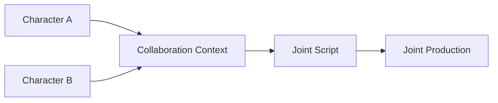

---

## 130. Audience Feedback Loop

```text
Audience
 ↓
Comments / Requests
 ↓
Audience Intelligence
 ↓
Content Queue
 ↓
Production
 ↓
Publication
 ↓
Audience
```

This is the core community growth loop.

---

## 131. Request-to-Video Traceability

Every accepted community request should be traceable to resulting content where appropriate.

```text
request_cluster_id
 ↓
content_unit_id
 ↓
publication_id
```

---

## 132. Audience Response Attribution

The system measures whether fulfilling a request actually improved audience outcomes.

---

## 133. Content Backlog

Backlog states include:

```text
candidate
approved
queued
scheduled
in production
blocked
published
archived
```

---

## 134. Priority Rules

Priority considers:

```text
urgency
request volume
strategic importance
trend velocity
revenue potential
production cost
capacity
```

---

## 135. Deadline Handling

Time-sensitive content can preempt lower-priority evergreen work within configured limits.

---

## 136. Editorial Calendar Intelligence

The calendar must avoid clustering nearly identical content.

---

## 137. Topic Saturation

If the channel recently covered a topic heavily, the planner can reduce its priority unless new information justifies another publication.

---

## 138. Audience Fatigue

Repeated formats or topics can trigger a fatigue signal.

```text
frequency ↑
engagement ↓
        ↓
fatigue signal
```

---

## 139. Creative Recovery

When fatigue is detected, the Idea Engine searches for alternate framing rather than simply stopping production.

---

## 140. Content Franchises

Successful recurring concepts can become franchises with standardized production templates.

---

## 141. Template System

Templates may define:

```text
structure
visual language
intro
outro
music
thumbnail layout
QA rules
```

Character-specific elements remain dynamic.

---

## 142. Dynamic Templates

Templates are not rigid scripts. They provide constraints while allowing creative variation.

---

## 143. Content Generation Modes

OMNIS supports:

```text
AUTONOMOUS
ASSISTED
EDITORIAL
EXPERIMENTAL
EMERGENCY
```

---

## 144. Autonomous Mode

The system can execute the full workflow when channel policy permits.

---

## 145. Assisted Mode

Humans approve selected stages while Agents perform the remaining work.

---

## 146. Editorial Mode

Humans define the creative direction and Agents execute production.

---

## 147. Experimental Mode

The system intentionally tests novel formats under bounded risk and budget.

---

## 148. Emergency Mode

Time-critical topics use accelerated production while preserving mandatory QA.

---

## 149. Content Factory API

Conceptual operations:

```text
createContentUnit()
scoreOpportunity()
generateIdeas()
createResearchPlan()
runResearch()
buildStory()
generateScript()
createShotList()
produceAssets()
assembleTimeline()
runQualityGates()
publish()
ingestAnalytics()
learnFromOutcome()
```

---

## 150. Canonical Production State Machine

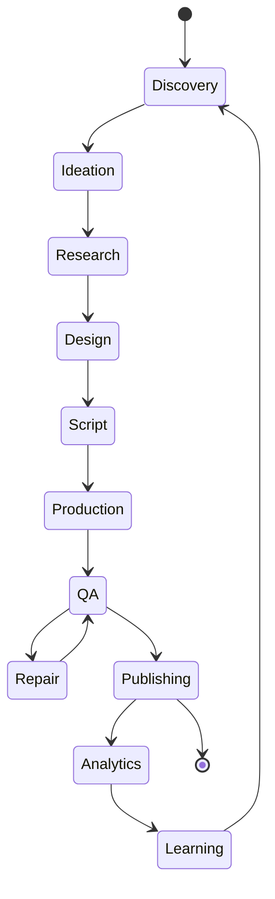

---

## 151. Final Contract

The OMNIS Content Factory is a closed-loop content operating system.

```text
AUDIENCE
   ↓
DEMAND
   ↓
OPPORTUNITY
   ↓
IDEA
   ↓
RESEARCH
   ↓
STORY
   ↓
SCRIPT
   ↓
PRODUCTION
   ↓
QUALITY
   ↓
PUBLISH
   ↓
ANALYTICS
   ↓
LEARNING
   ↓
BETTER CONTENT
```

The implementation MUST treat content as an engineered product with strategy, evidence, creative direction, production, independent evaluation, distribution, measurement and learning. Volume is subordinate to quality. Every successful result becomes evidence for future decisions, while every failure becomes a bounded learning signal. The Content Factory is therefore the central commercial engine connecting Audience Intelligence, Character OS, Agent Runtime, model orchestration, media generation, publishing and the OMNIS learning system.