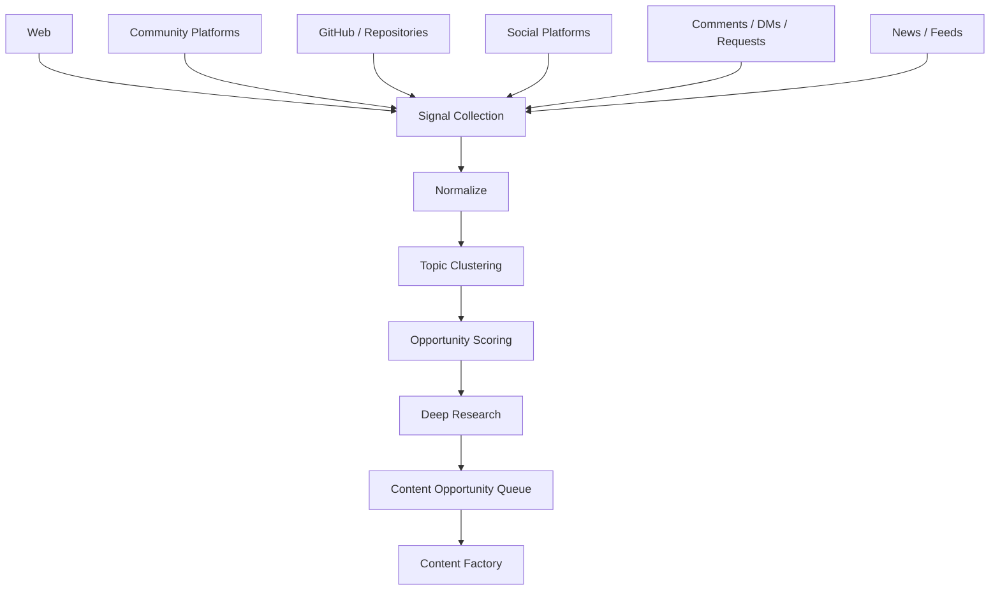
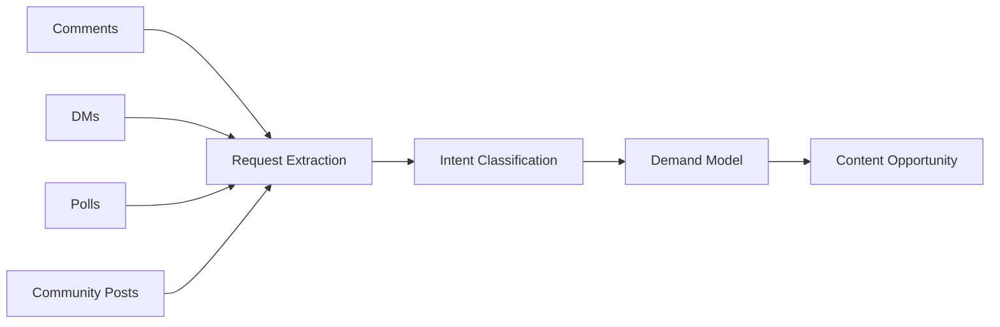
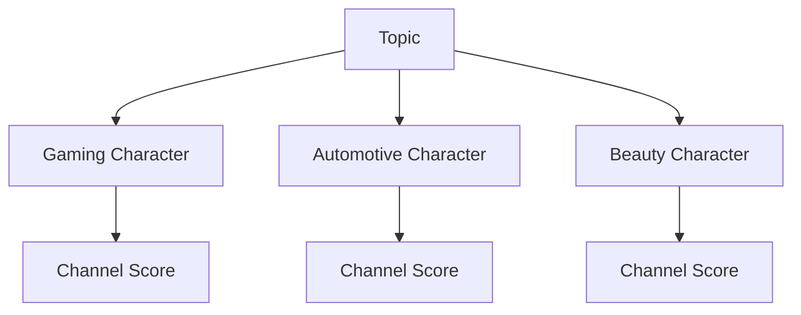
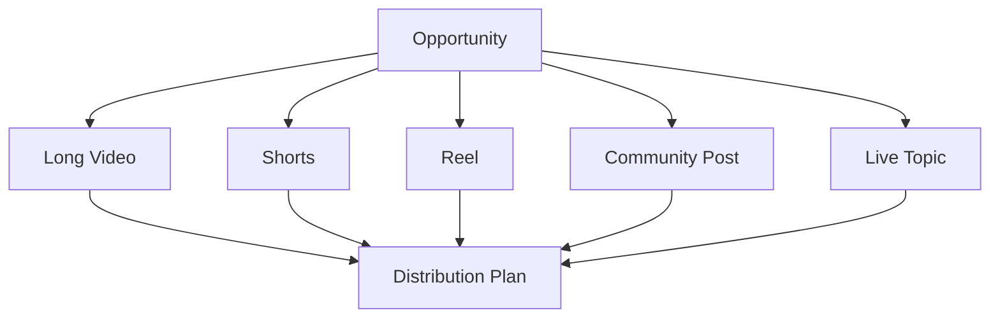
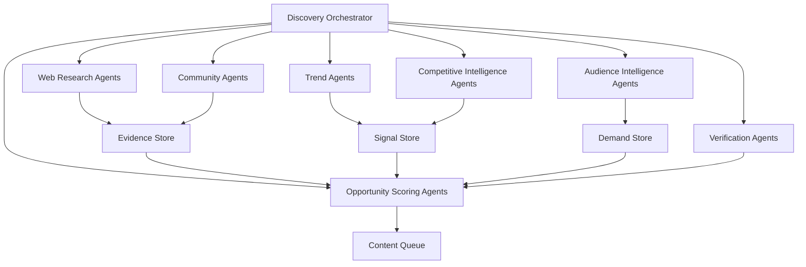

# OMNIS Content Research and Discovery Engine Specification

> Version: 1.0.0  
> Status: Architecture Specification  
> Domain: Research / Discovery / Trends / Competitive Intelligence / Topic Intelligence / Content Opportunities

## 1. Purpose

The Content Research and Discovery Engine continuously discovers, evaluates and prioritizes content opportunities for every OMNIS channel. It converts internet signals, audience requests, platform activity, creator ecosystems and Character expertise into evidence-backed production candidates.



## 2. Core Principle

OMNIS should not wait for a human to provide every topic. It should continuously discover what is relevant, valuable, timely and appropriate for each Character.

```text
SIGNALS
+
AUDIENCE DEMAND
+
CHARACTER EXPERTISE
+
TREND MOMENTUM
+
CONTENT GAP
+
BUSINESS VALUE
+
QUALITY POTENTIAL
=
CONTENT OPPORTUNITY
```

## 3. Discovery Scope

The engine monitors approved public information sources and connected platform data according to configured permissions and terms of service.

## 4. Signal Categories

```text
breaking news
search trends
community discussions
comments
DM requests
creator activity
competitor activity
new products
new games
software releases
scientific publications
GitHub projects
industry announcements
memes
cultural events
seasonal events
```

## 5. Source Registry

Every source connector is registered with capabilities, freshness, reliability and access policy.

```yaml
source:
  id: reddit_public
  type: community
  freshness: high
  reliability: variable
  capabilities:
    - discussions
    - sentiment
    - topic_discovery
```

## 6. Source Governance

Source collection must respect authentication, authorization, platform policies, rate limits and applicable law.

## 7. Web Research

Web research discovers current information, background context, primary sources and emerging topics.

## 8. Community Research

Community sources reveal questions, pain points, reactions and emerging interests that may not appear in formal news.

## 9. Reddit Intelligence

Reddit can provide community language, practical experiences, objections, recurring questions and early topic signals. It is treated as community evidence rather than automatically authoritative fact.

## 10. GitHub Intelligence

GitHub can reveal new tools, releases, projects, repositories, developer activity and emerging technical topics.

## 11. Repository Analysis

Repository signals may include release frequency, stars, forks, issues, documentation activity and ecosystem adoption where available.

## 12. Social Signals

Connected social platforms can provide topic velocity, audience reactions, creator activity and content performance signals subject to available APIs and permissions.

## 13. News Signals

News feeds are used for event detection, freshness and topic discovery.

## 14. Search Signals

Search trend information can identify rising interest and recurring questions.

## 15. Audience Signals

Audience comments and requests are first-class discovery inputs.



## 16. Request Classification

Requests are classified into categories such as:

```text
new_video
long_form
short_form
series
playlist
live_stream
review
tutorial
comparison
explanation
news_update
community_post
```

## 17. Duplicate Requests

Semantically equivalent requests are clustered so one demand signal can represent many messages.

## 18. Demand Strength

Demand is influenced by frequency, velocity, uniqueness, audience importance and recency.

## 19. Loyal Audience Weight

Requests from long-term engaged members can receive a configurable priority weight without excluding broader audience demand.

## 20. Request Queue

Validated audience requests enter the same opportunity system as externally discovered topics.

## 21. Topic Extraction

Raw signals are transformed into normalized topic entities.

```text
RAW SIGNAL
   ↓
ENTITY EXTRACTION
   ↓
TOPIC NORMALIZATION
   ↓
RELATED TOPICS
   ↓
TOPIC CLUSTER
```

## 22. Topic Identity

Each topic receives a stable internal identifier for tracking across time.

## 23. Topic Cluster

Related articles, posts, videos, repositories and requests can belong to one cluster.

## 24. Topic Lifecycle

```text
emerging
rising
peak
stable
declining
archived
```

## 25. Trend Momentum

Trend momentum estimates how quickly interest is changing rather than simply measuring total popularity.

## 26. Trend Acceleration

A rapidly increasing topic may receive more priority than a larger but declining topic.

## 27. Freshness

Time-sensitive opportunities include explicit expiration timestamps.

## 28. Evergreen Opportunities

Evergreen topics can remain eligible for production when demand and quality remain strong.

## 29. Seasonality

Seasonal opportunities are linked to calendar events and expected audience behavior.

## 30. Event Awareness

Major releases, holidays, sporting events, cultural events and industry announcements can trigger discovery workflows.

## 31. Character Fit

A topic is scored against the Character's expertise, personality, audience and channel identity.

## 32. Channel Fit

The same topic can receive different scores across different channels.



## 33. Expertise Match

High-confidence domain expertise increases the potential quality score.

## 34. Audience Match

Historical audience interests influence topic ranking.

## 35. Content Gap

OMNIS identifies questions with high demand but insufficient high-quality coverage.

## 36. Competitive Coverage

The system measures how heavily a topic is already covered and identifies differentiation opportunities.

## 37. Competitor Discovery

Competitor analysis focuses on public content patterns and performance signals available through legitimate sources.

## 38. Competitive Topics

The system tracks competitor topic choices, formats, hooks and audience reactions where data is available.

## 39. Differentiation

A crowded topic can remain valuable when OMNIS has a distinctive angle, expertise or production advantage.

## 40. Quality Opportunity

The engine estimates whether OMNIS can produce a materially better or more useful treatment.

## 41. Business Value

Opportunity scoring can include monetization potential, sponsorship fit, audience growth and strategic importance.

## 42. Production Cost

Expected research, generation, editing and distribution costs influence priority.

## 43. Risk

Content risk includes factual uncertainty, policy risk, copyright complexity and brand suitability.

## 44. Opportunity Score

A configurable scoring model ranks candidates.

```text
Opportunity Score =
  Demand
+ Trend Momentum
+ Character Fit
+ Audience Fit
+ Content Gap
+ Business Value
+ Quality Potential
- Production Cost
- Risk
```

## 45. Score Normalization

All score components are normalized before aggregation.

## 46. Confidence

Every opportunity has a confidence estimate based on signal quality and evidence.

## 47. Explainability

The system records why a topic received its score.

## 48. Opportunity Record

```yaml
opportunity:
  id: opp_001
  topic: "new_ai_model"
  demand: 0.88
  momentum: 0.94
  character_fit: 0.91
  confidence: 0.86
  status: candidate
```

## 49. Research Depth Selection

Low-risk simple topics may receive quick research; important topics trigger deep research.

## 50. Research Modes

```text
quick
standard
deep
continuous
breaking-news
```

## 51. Deep Research

Deep research decomposes the topic into claims, questions, primary sources, counterclaims and unresolved issues.

## 52. Primary Source Preference

Important claims should prefer primary sources where available.

## 53. Source Triangulation

High-impact claims should be checked against multiple credible sources when feasible.

## 54. Contradiction Detection

Research detects conflicting claims and routes them for resolution.

## 55. Uncertainty

Uncertain information remains marked uncertain instead of being silently converted into fact.

## 56. Research Package

```text
executive_summary
key_claims
sources
confidence
counterclaims
chronology
statistics
quotes_metadata
open_questions
recommended_angles
```

## 57. Angle Discovery

One topic may produce multiple content angles.

```text
news angle
explainer angle
controversy angle
history angle
beginner angle
expert angle
comparison angle
reaction angle
story angle
```

## 58. Format Discovery

The engine recommends format based on topic characteristics.

## 59. Format Types

```text
short
long-form
series
playlist
live
community post
podcast
interview
review
tutorial
```

## 60. Hook Discovery

Potential opening hooks are generated and ranked according to audience fit and factual support.

## 61. Title Intelligence

Candidate titles are evaluated for clarity, curiosity, search relevance and accuracy.

## 62. Thumbnail Intelligence

Visual concepts can be proposed from topic and Character context without making unsupported claims.

## 63. Content Bundle

One opportunity can generate a coordinated content package.



## 64. Series Detection

Related opportunities can be grouped into multi-episode series.

## 65. Playlist Detection

A recurring audience request for related topics can trigger playlist creation.

## 66. Content Queue

Approved opportunities enter a prioritized production queue.

## 67. Queue Priority

Priority considers urgency, demand, freshness, production readiness, business value and channel strategy.

## 68. Queue States

```text
candidate
researching
validated
queued
scheduled
in_production
published
measuring
archived
```

## 69. Expiration

Expired opportunities are automatically deprioritized or archived.

## 70. Revalidation

A previously archived topic may return if new evidence or demand appears.

## 71. Audience-to-Queue Loop

```text
VIEWER REQUEST
      ↓
CLASSIFY
      ↓
CLUSTER
      ↓
DEMAND SCORE
      ↓
RESEARCH
      ↓
VALIDATE
      ↓
CONTENT QUEUE
      ↓
PRODUCTION
```

## 72. Feedback Loop

Published content returns performance data to discovery models.

## 73. Performance Signals

```text
CTR
watch time
retention
shares
comments
saves
likes
subscribers gained
returning viewers
revenue
```

## 74. Performance Attribution

Signals are connected to topic, format, hook, Character, publication timing and distribution where possible.

## 75. Learning

Discovery models learn which opportunity patterns produce valuable outcomes.

## 76. Avoiding Feedback Bias

High historical performance must not permanently suppress novel opportunities.

## 77. Exploration vs Exploitation

The scheduler balances proven topics with experiments.

```text
EXPLOIT
known winners

EXPLORE
new topics
new formats
new angles
new audiences
```

## 78. Experiment Budget

Each channel can reserve a configurable percentage of production capacity for exploration.

## 79. Trend Manipulation Resistance

The engine should distinguish genuine audience demand from obvious spam, coordinated manipulation or low-quality engagement signals.

## 80. Bot / Spam Filtering

Suspicious repetitive requests and artificial engagement patterns are downweighted.

## 81. Community Diversity

Discovery models should avoid allowing a tiny vocal subgroup to represent the entire audience without sufficient evidence.

## 82. Audience Segmentation

Requests may be segmented by viewer cohorts.

## 83. Cohorts

```text
new viewers
casual viewers
returning viewers
subscribers
members
loyal fans
high-value community members
```

## 84. Personalized Opportunities

Some topics may be appropriate for a specific audience segment rather than the entire channel.

## 85. Channel Portfolio

OMNIS can coordinate opportunities across multiple Character channels while preventing unwanted duplication.

## 86. Cross-Channel Routing

A topic may be routed to the Character best suited to explain it.

## 87. Topic Collision

When several Characters are eligible, the orchestrator selects based on expertise, audience fit and strategic goals.

## 88. Shared Research

Common research can be reused across Characters while preserving Character-specific framing.

## 89. Research Cache

Validated research packages can be cached with freshness metadata.

## 90. Cost Optimization

Research results should be reused when still valid rather than repeatedly rediscovered.

## 91. Agent Architecture



## 92. Agent Permissions

Discovery agents may collect and analyze signals but cannot publish content without passing downstream production controls.

## 93. Human Override

Authorized operators can approve, reject, reprioritize or freeze opportunities.

## 94. Auditability

Every opportunity stores its input signals, score components, research package and decision history.

## 95. Observability

The system exposes collection health, research latency, source failures, queue growth and scoring behavior.

## 96. Metrics

```text
opportunities discovered
research success rate
source freshness
verification rate
request-to-production rate
trend prediction quality
content gap accuracy
production conversion
cost per opportunity
```

## 97. Failure Handling

Source failures, stale data and API limits must degrade gracefully without corrupting opportunity state.

## 98. Security and Privacy

Private audience data must remain within configured access boundaries and should not be exposed to unrelated agents or external providers.

## 99. Final Pipeline

```mermaid
flowchart LR
    SIGNALS[Internet + Platforms + Audience] --> DISCOVERY[Discovery]
    DISCOVERY --> CLUSTERING[Topic Intelligence]
    CLUSTERING --> SCORING[Opportunity Scoring]
    SCORING --> RESEARCH[Research]
    RESEARCH --> VALIDATION[Validation]
    VALIDATION --> QUEUE[Production Queue]
    QUEUE --> FACTORY[Content Factory]
    FACTORY --> PUBLISH[Distribution]
    PUBLISH --> ANALYTICS[Performance]
    ANALYTICS --> LEARNING[Discovery Learning]
    LEARNING --> DISCOVERY
```



## 100. Final Contract

The Content Research and Discovery Engine MUST continuously transform approved external and audience signals into evidence-backed, explainable and prioritized content opportunities. It MUST support web research, community intelligence, GitHub intelligence, trend detection, audience requests, competitive analysis, content-gap discovery, deep research, source verification, opportunity scoring, production queues and continuous learning while respecting source governance, privacy, platform policies and applicable law.
