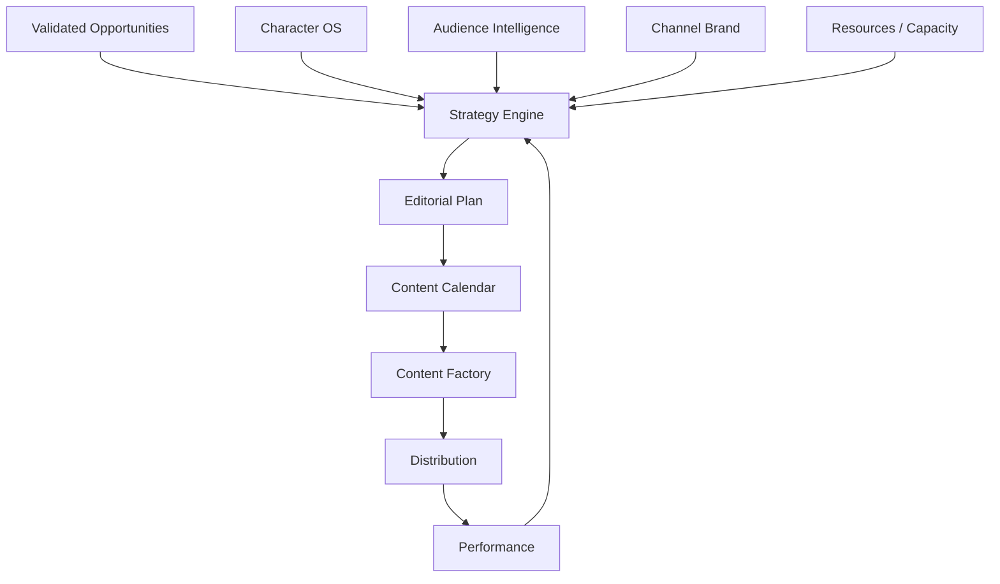
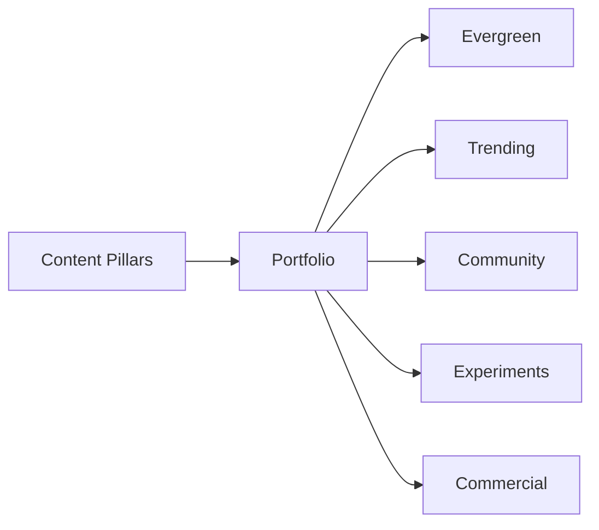
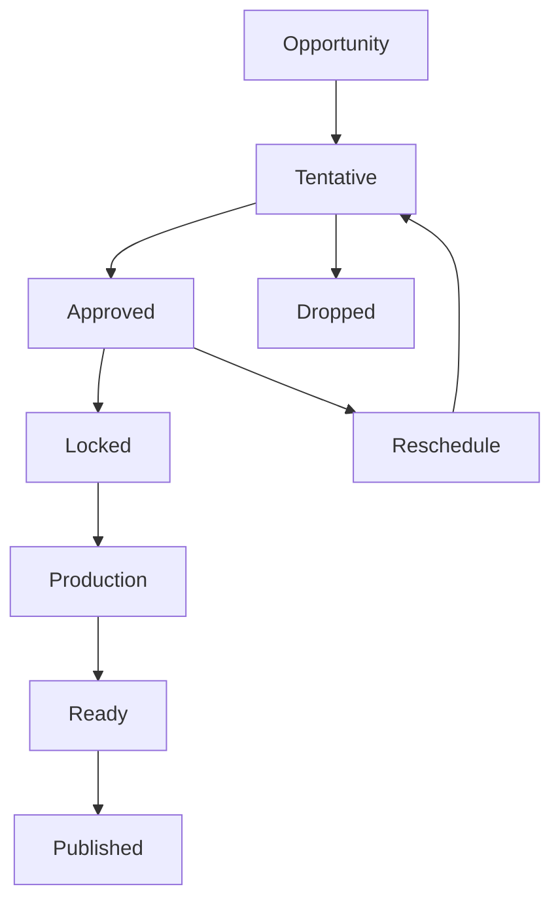
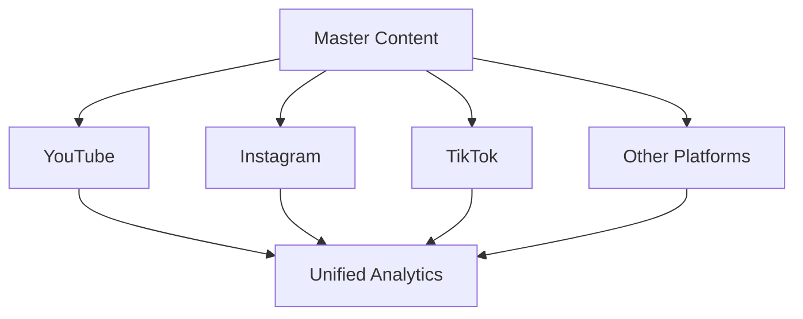
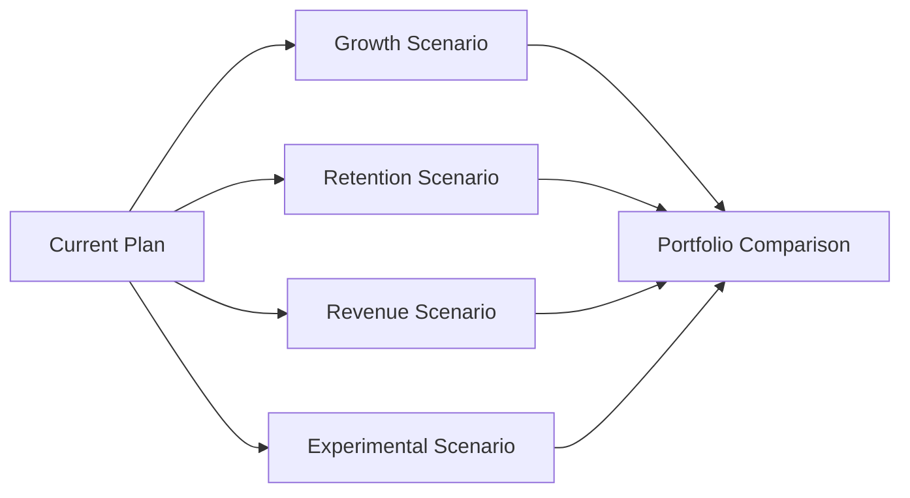
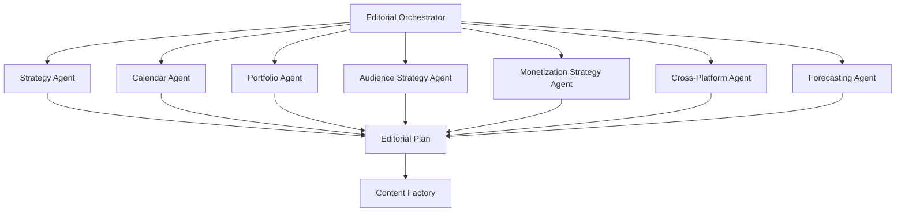
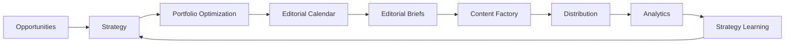

# OMNIS Content Strategy and Editorial Planning Engine Specification

> Version: 1.0.0  
> Status: Architecture Specification  
> Domain: Editorial Strategy / Content Planning / Scheduling / Portfolio Optimization / Audience Growth

## 1. Purpose

The Content Strategy and Editorial Planning Engine converts validated content opportunities into an executable editorial strategy for every OMNIS Character and channel. It decides what should be produced, for whom, in which format, with which narrative angle, at what time and with what portfolio priority.



## 2. Core Principle

Editorial planning optimizes the entire content portfolio rather than selecting isolated videos independently.

```text
OPPORTUNITIES
+
CHARACTER FIT
+
AUDIENCE DEMAND
+
BUSINESS GOALS
+
TIMING
+
CAPACITY
+
QUALITY
+
DIVERSITY
=
EDITORIAL STRATEGY
```

## 3. Channel Strategy

Every channel has a strategy profile describing its audience, promise, niche, growth stage and commercial objectives.

```yaml
channel_strategy:
  channel_id: gaming_001
  promise: "Energetic gaming entertainment"
  audience: gen_z_gamers
  primary_goal: growth
  secondary_goal: revenue
  formats:
    long_form: 0.35
    shorts: 0.45
    live: 0.20
```

## 4. Character Strategy

Character capabilities, personality and expertise constrain editorial choices.

## 5. Audience Strategy

The engine models what different audience segments need, enjoy and expect from the channel.

## 6. Business Strategy

Business goals may include growth, retention, monetization, sponsorship readiness, authority and community development.

## 7. Strategic Objectives

```text
growth
retention
engagement
authority
community
revenue
experimentation
brand expansion
```

## 8. Planning Horizon

The planner supports multiple horizons.

```text
today
this week
next week
this month
quarter
long-term
```

## 9. Long-Term Pillars

Content pillars define recurring areas that establish channel identity.

## 10. Pillar Examples

```text
gaming reviews
news
challenge videos
hardware
history
community stories
entertainment
```

## 11. Pillar Balance

The system prevents a channel from becoming unintentionally dominated by one temporary trend unless explicitly desired.

## 12. Portfolio Model



## 13. Content Mix

A strategy can allocate production capacity across evergreen, trending, community and experimental content.

## 14. Evergreen Content

Evergreen content supports long-term discovery and search value.

## 15. Trending Content

Trending content captures short-lived demand and requires rapid execution.

## 16. Community Content

Community content responds directly to audience relationships and requests.

## 17. Experimental Content

Experimental content tests new formats, angles, Characters or audiences.

## 18. Commercial Content

Commercial content supports monetization while preserving audience trust and Character identity.

## 19. Portfolio Diversity

The planner monitors topic, format, emotional tone, Character and publication diversity.

## 20. Topic Saturation

Repeated coverage of the same subject is detected before scheduling.

## 21. Audience Fatigue

High-frequency repetition can reduce audience interest and should influence scheduling.

## 22. Character Fatigue

Production plans consider simulated Character workload and continuity state.

## 23. Production Capacity

The planner considers available research, scripting, rendering, editing and publishing capacity.

## 24. Resource Model

```yaml
capacity:
  research_agents: 12
  writers: 8
  video_render_slots: 6
  editors: 4
  publishing_slots: 3
```

## 25. Priority Score

Candidate content receives a strategy priority based on opportunity value and portfolio context.

```text
Priority =
Opportunity Value
× Strategic Fit
× Timing Value
× Audience Value
× Production Readiness
÷ Estimated Cost
```

## 26. Urgency

Breaking topics can receive elevated priority while preserving quality gates.

## 27. Timing Value

Timing considers trend momentum, events, seasonality, audience activity and platform behavior.

## 28. Event Calendar

The planner integrates relevant calendar events.

```text
holidays
product launches
game releases
industry events
sports events
cultural events
seasonal moments
```

## 29. Weather Context

Where appropriate, weather and local conditions can influence Character presentation and content timing.

## 30. Character Appearance Coordination

Editorial scheduling passes timing context to Character Appearance, Wardrobe, Hair and Physical State systems.

## 31. Content Cadence

Each channel has a configurable publication cadence.

## 32. Cadence Example

```text
Mon → Short
Tue → Long-form
Wed → Community
Thu → Short
Fri → Long-form
Sat → Live
Sun → Community
```

## 33. Cadence Flexibility

The schedule may change when an important opportunity appears.

## 34. Schedule Stability

Frequent changes should be minimized to preserve operational predictability.

## 35. Editorial Calendar

The calendar stores planned, locked, tentative and experimental content.



## 36. Editorial Brief

Every planned production receives a structured editorial brief.

```yaml
editorial_brief:
  topic: "..."
  audience: "returning_viewers"
  format: "long_form"
  angle: "deep_explainer"
  objective: "retention"
  hook_strategy: "question"
  cta: "community_discussion"
```

## 37. Narrative Objective

The brief defines what the viewer should understand, feel or do.

## 38. Emotional Objective

Content can target curiosity, excitement, trust, surprise, humor or reflection.

## 39. Character Objective

The Character's personality should influence presentation without overriding editorial strategy.

## 40. Audience Segment Objective

A production may target a specific cohort while remaining compatible with overall channel identity.

## 41. Format Selection

Format is selected according to topic, audience behavior, production economics and strategic objectives.

## 42. Long-Form

Long-form content is preferred when depth, narrative or watch-time potential justifies production cost.

## 43. Short-Form

Short-form content is preferred when a concise hook, reaction or focused insight can deliver value quickly.

## 44. Live

Live content is selected when real-time interaction creates additional value.

## 45. Series

Related productions can be planned as a coherent sequence.

## 46. Playlist

The planner can create playlists when topic relationships support sequential viewing.

## 47. Cross-Platform Strategy

One editorial idea can be adapted across YouTube, Instagram, TikTok and other approved channels.



## 48. Adaptation

Cross-platform derivatives must be native to each platform rather than simple copies.

## 49. Canonical Content

One production can have a canonical source asset and multiple derived assets.

## 50. Derivative Graph

```text
MASTER VIDEO
├── Full YouTube
├── Short 01
├── Short 02
├── Reel 01
├── Community Post
├── Quote Card
└── Live Discussion
```

## 51. Content Dependencies

Some productions depend on research, assets, Characters or prior episodes.

## 52. Dependency Graph

The scheduler detects dependencies before assigning production slots.

## 53. Serialization

Series episodes may have ordered dependencies and continuity requirements.

## 54. Continuity

Editorial plans reference Character state and previous content when narrative continuity matters.

## 55. Recurring Segments

Recurring segments can have templates while retaining Character-specific delivery.

## 56. Signature Formats

Channels can develop recognizable formats that reinforce brand identity.

## 57. Hook Rotation

The system rotates hook patterns to reduce creative fatigue.

## 58. CTA Strategy

Calls to action are selected according to the current objective rather than appended mechanically.

## 59. Community CTA

Community-focused content can ask for opinions, requests, stories or participation.

## 60. Conversion CTA

Growth content can encourage appropriate subscriptions or follows without excessive repetition.

## 61. Monetization CTA

Commercial objectives are integrated where relevant and transparent.

## 62. Sponsorship Slots

Editorial planning reserves potential sponsorship positions without compromising the content's narrative quality.

## 63. Sponsorship Matching

Sponsor candidates can be evaluated against audience, Character, brand safety and editorial relevance.

## 64. Sponsor Separation

Commercial requirements must remain distinguishable from factual editorial claims.

## 65. Trend vs Evergreen Conflict

The planner resolves conflicts between urgent trends and long-term evergreen goals through portfolio optimization.

## 66. Exploration Budget

A configurable portion of the calendar is reserved for new ideas.

## 67. Exploitation Budget

Another portion can focus on proven formats and topics.

## 68. Portfolio Optimization

```text
PROVEN WINNERS ─────── 60%
TRENDING ───────────── 20%
COMMUNITY ──────────── 10%
EXPERIMENTS ────────── 10%
```

These values are examples and must remain configurable.

## 69. Scenario Planning

The engine can simulate alternative calendars before committing one.

## 70. Scenario A

Growth-focused planning increases discovery-oriented content.

## 71. Scenario B

Retention-focused planning increases series, community and returning-viewer content.

## 72. Scenario C

Revenue-focused planning increases commercially suitable high-value content while preserving audience trust.

## 73. Scenario Comparison



## 74. Forecasting

Forecasts estimate likely outcomes but do not guarantee performance.

## 75. Uncertainty

Every forecast retains confidence intervals or uncertainty metadata where possible.

## 76. Decision Trace

The planner records why a production was selected, delayed, rejected or rescheduled.

## 77. Human Override

Authorized operators can override editorial decisions.

## 78. Override Audit

Manual changes are logged and can later be analyzed as strategic signals.

## 79. Learning From Editorial Outcomes

Published performance feeds back into strategy models.

```text
EDITORIAL PLAN
      ↓
PRODUCTION
      ↓
PUBLICATION
      ↓
PERFORMANCE
      ↓
AUDIENCE RESPONSE
      ↓
STRATEGY LEARNING
      ↓
NEXT PLAN
```

## 80. Avoiding Local Optima

The system must not optimize only for immediate views at the expense of long-term audience quality.

## 81. Audience Quality

Returning viewers, meaningful engagement and community health are considered alongside raw reach.

## 82. Revenue Quality

Revenue should be evaluated together with audience trust, retention and brand safety.

## 83. Content Debt

Repeatedly postponed high-value content is tracked as editorial debt.

## 84. Stale Queue Detection

Items remaining too long in the queue are re-evaluated.

## 85. Cancellation

Low-value or obsolete plans can be cancelled before expensive production begins.

## 86. Replanning

The engine can replan future content when major new information appears.

## 87. Lock Window

Near-publication content can enter a lock window to prevent unnecessary last-minute changes.

## 88. Emergency Override

Major events may trigger emergency editorial replanning.

## 89. Agent Architecture



## 90. Agent Permissions

Strategy agents recommend plans. Only approved orchestration workflows can commit production schedules.

## 91. Capacity Awareness

Scheduling agents must query current production capacity before locking deadlines.

## 92. Conflict Resolution

When multiple high-priority productions compete for the same resources, the planner ranks strategic value and urgency.

## 93. SLA

Breaking opportunities can have stricter research-to-publication service-level targets.

## 94. Observability

The engine tracks calendar utilization, schedule changes, queue age, production delays and strategic outcomes.

## 95. Metrics

```text
plan adherence
content throughput
portfolio diversity
average queue age
reschedule rate
opportunity-to-publication rate
retention impact
growth impact
revenue impact
experimental win rate
```

## 96. Governance

Editorial strategy must respect platform policies, Character boundaries, privacy, disclosure requirements and configured brand rules.

## 97. Reproducibility

An editorial decision must be reconstructable from its strategy snapshot, opportunity set, Character state and planning configuration.

## 98. Final Pipeline



## 99. Architectural Relationship

Discovery answers **what might be worth producing**. Editorial Strategy answers **what OMNIS should actually commit to producing and why**. The Content Factory answers **how the committed production should be created**.

## 100. Final Contract

The Content Strategy and Editorial Planning Engine MUST transform validated opportunities into explainable, capacity-aware and continuously improving editorial plans. It MUST coordinate Character identity, audience demand, content pillars, portfolio balance, timing, formats, cross-platform adaptation, monetization, experimentation, production capacity, continuity, analytics and strategic learning while preserving human override, auditability and platform governance.
