# OMNIS Data Architecture Specification

> Version: 1.0.0  
> Status: Implementation Specification  
> Domain: Data / Memory / Events / Analytics / Storage

---

## 1. Purpose

The OMNIS Data Architecture defines how operational state, character state, memory, content assets, events, analytics and learning data are stored, queried, transported, governed and evolved.

OMNIS is not a single-database application. It is a polyglot data system because different information has fundamentally different access patterns.

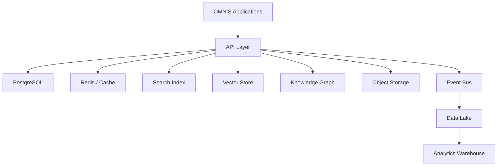

---

## 2. Core Principles

The data architecture follows:

```text
SOURCE OF TRUTH
SCHEMA EXPLICITNESS
EVENTUAL CONSISTENCY WHERE APPROPRIATE
IMMUTABILITY FOR EVENTS
PROVENANCE
TENANT ISOLATION
DATA MINIMIZATION
VERSIONING
REPLAYABILITY
OBSERVABILITY
```

---

## 3. Data Domains

OMNIS data is organized into domains rather than arbitrary tables.

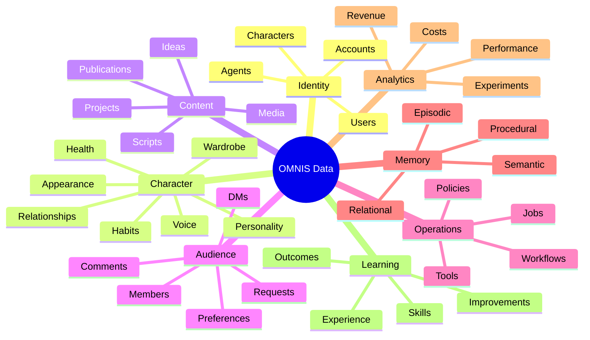

---

## 4. System of Record

Each domain MUST have a clearly defined authoritative store.

```text
Identity → PostgreSQL
Character state → PostgreSQL
Events → Event Store / Event Bus
Media → Object Storage
Semantic memory → Vector Store
Relationships → Graph Store
Search → Search Index
Analytics → Warehouse
```

No secondary index is considered authoritative.

---

## 5. PostgreSQL

PostgreSQL is the primary transactional store for strongly consistent business state.

Examples:

```text
users
workspaces
characters
agents
accounts
content_projects
campaigns
jobs
policies
subscriptions
```

---

## 6. Transaction Boundaries

Transactions MUST protect invariants.

```text
BEGIN
 ↓
validate
 ↓
write state
 ↓
write outbox event
 ↓
COMMIT
```

The outbox pattern prevents state changes from being committed without their corresponding domain event.

---

## 7. Multi-Tenancy

Every protected entity carries tenant ownership.

```yaml
tenant_id: tenant_001
workspace_id: workspace_42
```

Database policies MUST prevent cross-tenant reads and writes.

---

## 8. Character Data Model

A virtual character is a composite data entity.

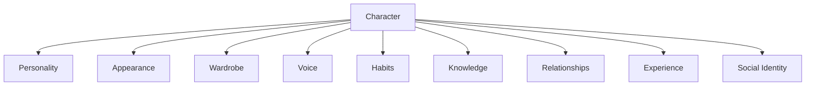

Each subsystem has its own schema while preserving a shared character identifier.

---

## 9. Temporal Character State

Character state is temporal.

Examples:

```text
hair color
beard length
hair style
clothing
voice condition
mood
knowledge
skill level
```

The system MUST be able to answer:

```text
"What did this character look like on date X?"
```

---

## 10. State Snapshots

Long-lived entities SHOULD support snapshots.

```yaml
snapshot:
  entity: character_001
  version: 84
  valid_from: ...
  valid_to: ...
```

---

## 11. Event Sourcing

Events capture meaningful state transitions.


Not every table requires full event sourcing, but critical character and workflow transitions SHOULD be event-driven.

---

## 12. Domain Events

Examples:

```text
CharacterCreated
CharacterAppearanceChanged
WardrobeWorn
HairColorChanged
BeardTrimmed
VoiceConditionChanged
ContentCreated
VideoPublished
CommentReceived
AudienceRequestDetected
SkillImproved
```

---

## 13. Event Envelope

```yaml
event:
  id: evt_123
  type: CharacterAppearanceChanged
  version: 1
  occurred_at: ...
  tenant_id: tenant_001
  workspace_id: workspace_42
  actor_id: agent_007
  entity_id: character_001
  payload: {}
  trace_id: trace_123
```

---

## 14. Event Ordering

Events SHOULD preserve ordering per aggregate where ordering is semantically required.

```text
Character 001
  Event 1
  Event 2
  Event 3
```

Global ordering is not required.

---

## 15. Event Idempotency

Consumers MUST tolerate duplicate delivery.

```yaml
consumer_checkpoint:
  consumer: analytics
  event_id: evt_123
```

---

## 16. Event Bus

The Event Bus distributes domain events.

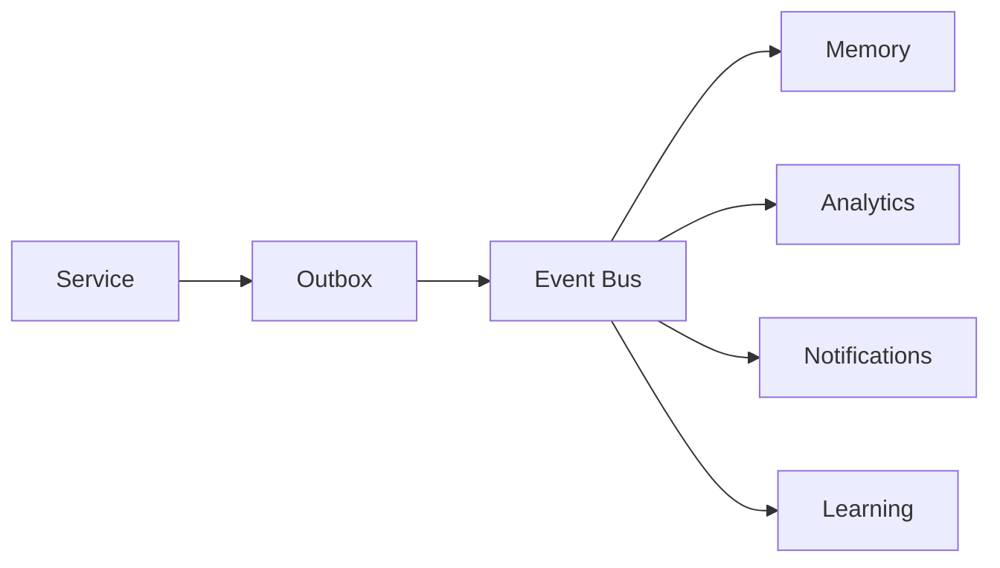

---

## 17. Outbox Pattern

Transactional services write an outbox row in the same transaction as business state.

```text
DB Transaction
 ├── business state
 └── outbox event
       ↓
publisher
       ↓
event bus
```

---

## 18. Event Retention

Retention depends on domain importance.

```text
security events → long retention
character history → long retention
operational events → configurable
telemetry → shorter retention
```

---

## 19. Event Replay

Events SHOULD be replayable for rebuilding projections.

```text
Event Store
 ↓ replay
Projection v2
 ↓
new read model
```

---

## 20. CQRS

Read-heavy workloads may use separate read models.

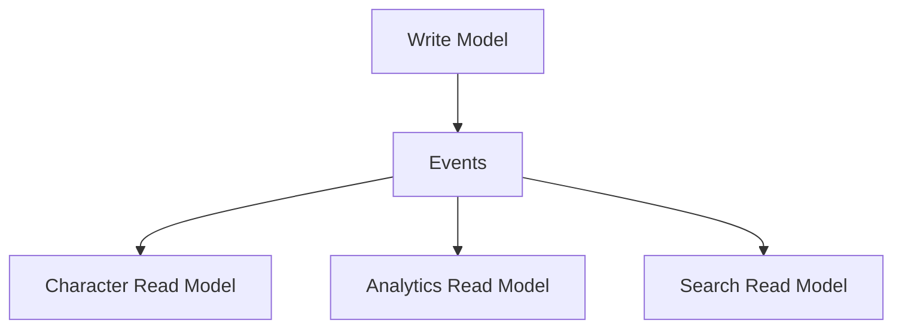

---

## 21. Cache

Redis or equivalent is used for low-latency ephemeral state.

Examples:

```text
sessions
rate limits
locks
short-lived context
job progress
hot character state
```

Cache is never the authoritative source for critical state.

---

## 22. Cache Invalidation

Domain events SHOULD invalidate affected cache entries.

```text
CharacterUpdated
 ↓
cache invalidation
 ↓
next read
 ↓
authoritative DB
```

---

## 23. Distributed Locks

Locks are used sparingly for coordination.

```text
character render
 ↓
lock character state
 ↓
render
 ↓
release
```

Lock ownership must have expiration.

---

## 24. Object Storage

Large binary assets belong in object storage.

```text
images
video
audio
3D assets
project files
exports
thumbnails
```

PostgreSQL stores metadata and references, not large media blobs by default.

---

## 25. Object Metadata

```yaml
asset:
  id: asset_123
  type: video
  mime: video/mp4
  size_bytes: 123456789
  content_hash: sha256:...
  storage_key: media/2026/08/asset_123
```

---

## 26. Content Addressing

Important immutable assets SHOULD use content hashes.

```text
bytes
 ↓ SHA-256
content hash
 ↓
immutable identity
```

---

## 27. Media Versioning

Generated media is versioned.

```text
video_v1
 ↓ edit
video_v2
 ↓ final
video_v3
```

Previous versions remain available according to retention policy.

---

## 28. Search Index

Search indexes support fast retrieval across documents and operational records.

```text
PostgreSQL
 ↓ indexer
Search Engine
 ↓
query
```

---

## 29. Full-Text Search

Search should support:

```text
exact terms
fuzzy terms
language-aware search
filters
facets
recency
ranking
```

---

## 30. Vector Store

Vector storage supports semantic retrieval.

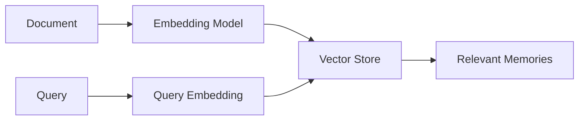

---

## 31. Embedding Provenance

Every embedding MUST retain enough metadata to identify its source.

```yaml
embedding:
  id: emb_123
  source_id: memory_456
  model: embedding-model-x
  model_version: 3
  created_at: ...
```

---

## 32. Embedding Versioning

Changing embedding models requires versioning.

```text
embedding_v1
embedding_v2
```

Old vectors may coexist during migration.

---

## 33. Semantic Memory

Semantic memory contains durable knowledge.

Examples:

```text
character preferences
stable facts
learned domain knowledge
audience preferences
brand rules
```

---

## 34. Episodic Memory

Episodic memory records experiences.

```text
"Character published video X and audience reacted strongly."
```

Episodes preserve time and context.

---

## 35. Procedural Memory

Procedural memory stores learned methods.

```text
best thumbnail workflow
successful editing sequence
preferred research process
```

---

## 36. Relational Memory

Relationships are represented separately from simple text memories.


---

## 37. Knowledge Graph

Graph storage is useful for relationships and multi-hop reasoning.

```text
Character
 ↓ created
Content
 ↓ discusses
Game
 ↓ developed by
Studio
```

---

## 38. Graph Entities

Typical nodes:

```text
Person
Character
Organization
Product
Game
Vehicle
Topic
Content
Platform
```

---

## 39. Graph Edges

Examples:

```text
created_by
likes
follows
mentions
owns
related_to
published_on
```

---

## 40. Knowledge Provenance

Graph facts SHOULD preserve source references.

```yaml
fact:
  subject: game_123
  predicate: developed_by
  object: studio_456
  source: source_789
  confidence: 0.98
```

---

## 41. Data Lineage

Every important derived artifact should be traceable.


---

## 42. Provenance Graph

Lineage connects:

```text
source
 ↓
claim
 ↓
script
 ↓
media
 ↓
publication
 ↓
metric
 ↓
learning
```

---

## 43. Audience Data

Audience data includes:

```text
comments
messages
requests
likes
shares
watch behavior
subscriptions
feedback
```

Sensitive personal data must be minimized.

---

## 44. Audience Requests

Requests become structured demand signals.

```yaml
request:
  id: req_123
  topic: "AI announcement"
  desired_format: long_video
  frequency: 37
  sentiment: positive
  confidence: 0.91
```

---

## 45. Demand Aggregation

Individual requests can be clustered.

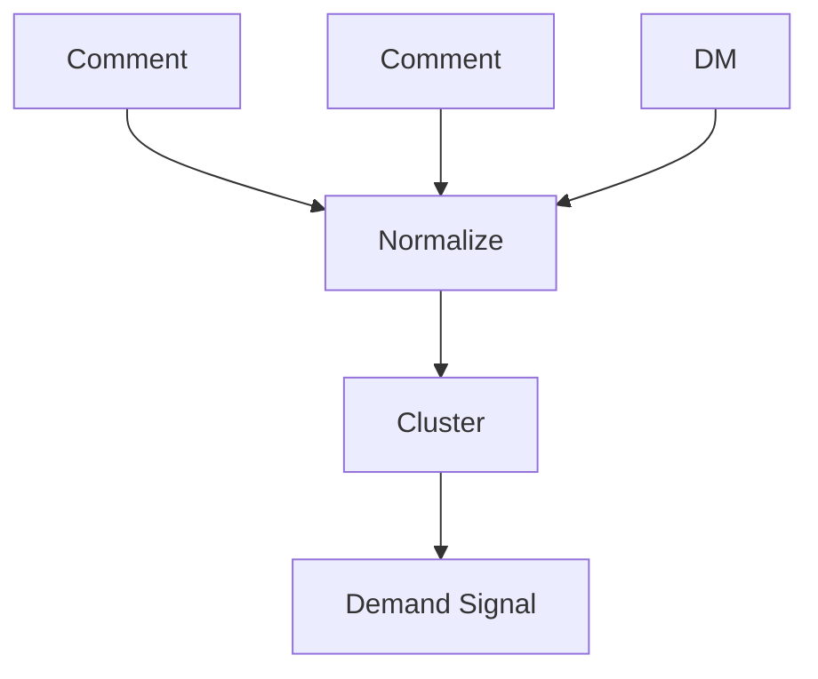

---

## 46. Audience Preference Model

The system can maintain aggregate preferences.

```text
Topic affinity
Format affinity
Length preference
Upload-time preference
Style preference
```

Aggregate data should not expose unnecessary individual identities.

---

## 47. Analytics Data

Operational analytics SHOULD be separated from transactional state.

```text
application events
 ↓
event stream
 ↓
warehouse
 ↓
analytics
```

---

## 48. Metrics Fact Model

A metric record should include dimensions.

```yaml
metric:
  platform: youtube
  character_id: char_001
  content_id: video_123
  metric: watch_time
  value: 12345
  observed_at: ...
```

---

## 49. Time-Series Data

High-volume metrics may use time-series optimized storage.

```text
views(t)
retention(t)
watch_time(t)
revenue(t)
```

---

## 50. Revenue Data

Revenue records must preserve attribution context.

```text
platform
content
campaign
character
period
revenue
currency
```

---

## 51. Cost Data

Cost events include:

```text
model usage
rendering
storage
API usage
research
publishing
```

---

## 52. Unit Economics


---

## 53. Experiment Data

Experiments require explicit identifiers.

```yaml
experiment:
  id: exp_42
  hypothesis: thumbnail_a_outperforms_b
  variant: A
  content_id: video_123
```

---

## 54. A/B Testing

Variant assignments SHOULD be deterministic where appropriate.

```text
viewer
 ↓ hash
variant
```

---

## 55. Learning Data

Learning data connects actions to outcomes.

```text
action
 ↓
result
 ↓
feedback
 ↓
experience
 ↓
skill update
```

---

## 56. Experience Record

```yaml
experience:
  id: exp_123
  agent_id: agent_7
  character_id: char_001
  task: thumbnail_generation
  outcome: successful
  reward: 0.83
  lessons: []
```

---

## 57. Skill State

```yaml
skill:
  id: gaming.commentary
  level: 0.74
  confidence: 0.81
  evidence_count: 184
```

Skill state is derived from evidence rather than arbitrary labels.

---

## 58. Data Quality

Data quality dimensions include:

```text
completeness
accuracy
consistency
freshness
uniqueness
validity
```

---

## 59. Quality Checks

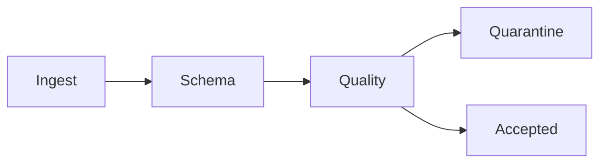

Invalid data is quarantined rather than silently accepted.

---

## 60. Schema Registry

Events and shared messages require versioned schemas.

```text
EventType v1
EventType v2
```

Consumers declare compatible versions.

---

## 61. Schema Evolution

Compatible changes are preferred.

```text
add optional field → compatible
remove required field → breaking
change meaning → breaking
```

---

## 62. Database Migrations

Migrations are version-controlled.

```text
migration_001
migration_002
migration_003
```

Production migrations require rollback or forward-fix strategy.

---

## 63. Zero-Downtime Migration

Large migrations use expand/contract.


---

## 64. Data Encryption

Sensitive data is encrypted in transit and at rest.

```text
TLS
+
storage encryption
+
application-level encryption where required
```

---

## 65. Field-Level Encryption

Highly sensitive values may use field-level encryption.

Examples:

```text
private messages
platform identifiers
sensitive credentials references
```

---

## 66. Retention

Retention policies vary by data class.

```text
security → long
operational → medium
telemetry → short
raw external data → policy-defined
```

---

## 67. Deletion

Deletion MUST respect dependencies and legal/policy requirements.

```text
delete request
 ↓
find references
 ↓
remove / anonymize
 ↓
verify
```

---

## 68. Tombstones

Deleted entities may leave tombstones to prevent accidental recreation or stale event application.

```yaml
tombstone:
  entity_id: char_001
  deleted_at: ...
```

---

## 69. Backup Architecture

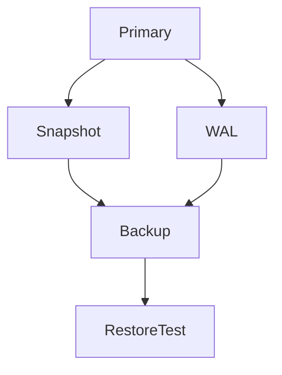

Backups require encryption and access control.

---

## 70. Restore Testing

A backup is not considered reliable until restoration has been tested.

```text
backup
 ↓ restore
isolated environment
 ↓ validation
PASS / FAIL
```

---

## 71. Disaster Recovery

Critical stores should have defined RPO and RTO.

```text
RPO → acceptable data loss
RTO → acceptable recovery time
```

---

## 72. Regional Strategy

The architecture may support regional replicas for critical services.

```text
Region A → primary
Region B → replica
```

---

## 73. Data Residency

Tenant policies may define where data can be stored.

```yaml
residency:
  region: eu
  strict: true
```

---

## 74. Data Access Layer

Services SHOULD access data through domain repositories rather than arbitrary SQL scattered across application code.

```text
Service
 ↓
Repository
 ↓
Data Adapter
 ↓
Store
```

---

## 75. Data Contracts

Cross-service payloads require explicit contracts.

```yaml
content_created:
  content_id: ...
  character_id: ...
  created_at: ...
```

---

## 76. Read Models

Read models are optimized for consumers.

Examples:

```text
character_dashboard
content_dashboard
audience_dashboard
agent_dashboard
```

---

## 77. Materialized Views

Materialized views may accelerate expensive analytics queries.

```text
raw events
 ↓
aggregation
 ↓
materialized view
```

---

## 78. Search Synchronization

Search indexes consume authoritative events.

```text
EntityChanged
 ↓
Indexer
 ↓
Search Index
```

Index failures MUST be observable and recoverable.

---

## 79. Vector Synchronization

Semantic indexes follow the same pattern.

```text
MemoryChanged
 ↓
Embedding Worker
 ↓
Vector Store
```

---

## 80. Graph Synchronization

```text
RelationshipChanged
 ↓
Graph Projection
 ↓
Knowledge Graph
```

---

## 81. Data Pipeline

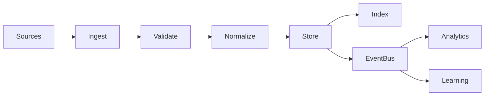

---

## 82. Batch vs Streaming

Streaming is preferred for:

```text
comments
notifications
metrics
character events
workflow state
```

Batch processing is appropriate for:

```text
large historical analytics
model retraining datasets
backfills
```

---

## 83. Data Freshness

Every derived dataset SHOULD declare freshness expectations.

```yaml
freshness:
  target_seconds: 60
```

---

## 84. Backpressure

Pipelines MUST tolerate bursts.

```text
producer burst
 ↓
queue
 ↓
controlled consumers
```

---

## 85. Dead Letter Queue

Failed messages go to a DLQ after retry exhaustion.

```text
Event
 ↓ retry
 ↓ retry
 ↓ failure
DLQ
 ↓
operator / repair
```

---

## 86. Replay Safety

Consumers must be idempotent so historical events can be replayed safely.

---

## 87. Data Observability

Monitor:

```text
row counts
latency
lag
schema errors
quality failures
DLQ size
index lag
vector lag
```

---

## 88. Lineage Metadata

Derived artifacts SHOULD retain parent identifiers.

```yaml
lineage:
  parents:
    - source_123
    - research_456
```

---

## 89. Content Provenance

A published video should be traceable to its inputs.

```text
Video
 ↓
Script
 ↓
Research
 ↓
Sources
```

---

## 90. Character Continuity Data

Continuity state is treated as durable data.

```text
last outfit
hair state
beard state
recent locations
voice condition
recent emotional state
```

---

## 91. Wardrobe History

Wardrobe data tracks reuse.

```yaml
wear:
  garment_id: jacket_17
  worn_at: ...
  combination_id: outfit_88
```

This allows realistic outfit repetition without accidental contradictions.

---

## 92. Appearance History

Appearance changes are event records.

```text
hair dyed
 ↓
roots grow
 ↓
color changes
 ↓
dye refreshed
```

---

## 93. Health-State Continuity

Temporary states can have duration.

```yaml
state:
  type: cold
  start: ...
  expected_end: ...
  severity: mild
```

This is simulation state for fictional characters, not medical diagnosis.

---

## 94. Voice Continuity

Voice state can reference:

```text
baseline voice
fatigue
hoarseness
emotion
energy
```

---

## 95. Relationship Memory

Fan relationships can accumulate over time.

```text
member
 ↓ repeated interactions
relationship profile
 ↓
preferences / history
```

---

## 96. Audience Privacy

Individual audience data is separated from aggregate demand analytics.

```text
Member-level data → restricted
Aggregate trends → analytics
```

---

## 97. Data Governance

Governance covers:

```text
ownership
access
retention
classification
lineage
quality
privacy
residency
```

---

## 98. Canonical Architecture

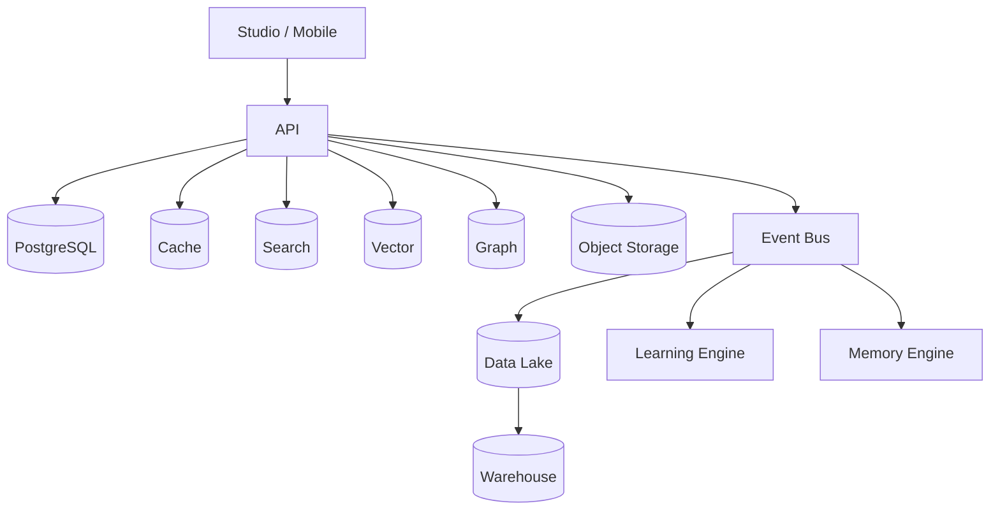

---

## 99. Implementation Rule

Every new data requirement MUST answer:

```text
What is the source of truth?
What is the schema?
What is the retention policy?
What is the tenant boundary?
What events are emitted?
What indexes are required?
What is the recovery strategy?
```

---

## 100. Final Contract

The OMNIS data platform is the persistent memory and evidence layer of the system.

It connects identity, character state, content, audience, tools, analytics and learning without turning every workload into a single database problem.

```text
TRANSACTIONAL STATE
        ↓
EVENTS
        ↓
MEMORY / SEARCH / GRAPH
        ↓
ANALYTICS
        ↓
EXPERIENCE
        ↓
LEARNING
        ↓
BETTER DECISIONS
```

The architecture MUST preserve provenance, temporal continuity, tenant isolation, replayability and operational observability while remaining scalable to hundreds or thousands of virtual characters and their Agents.