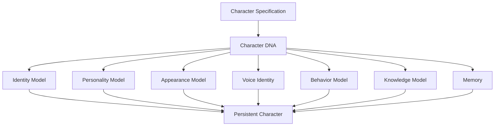
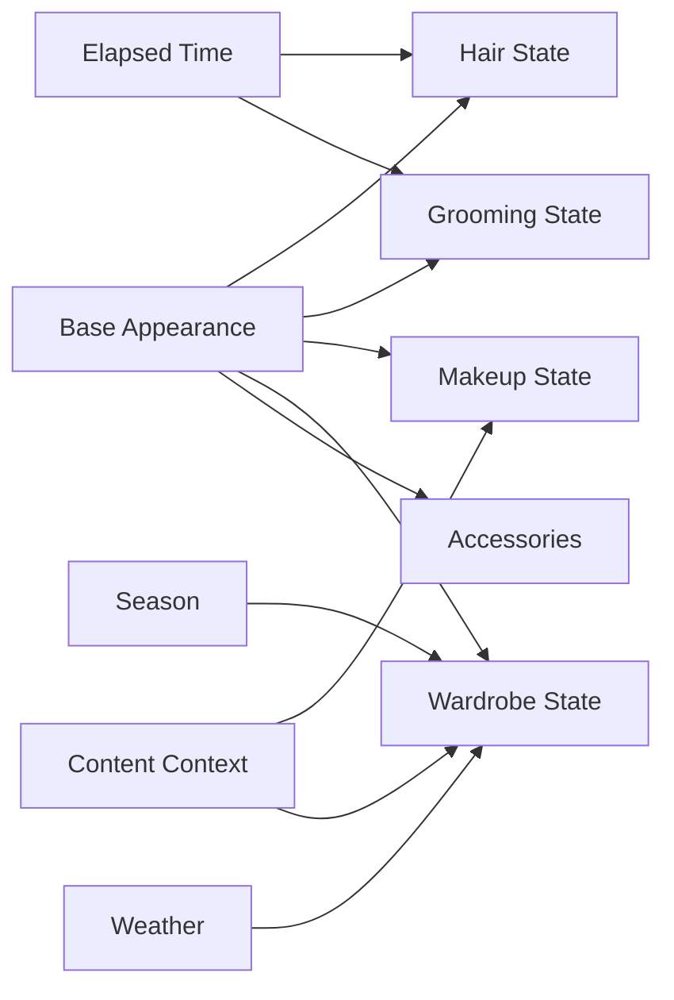
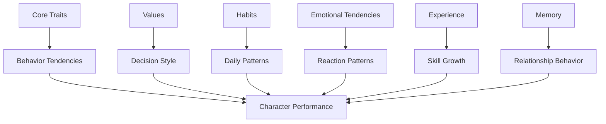
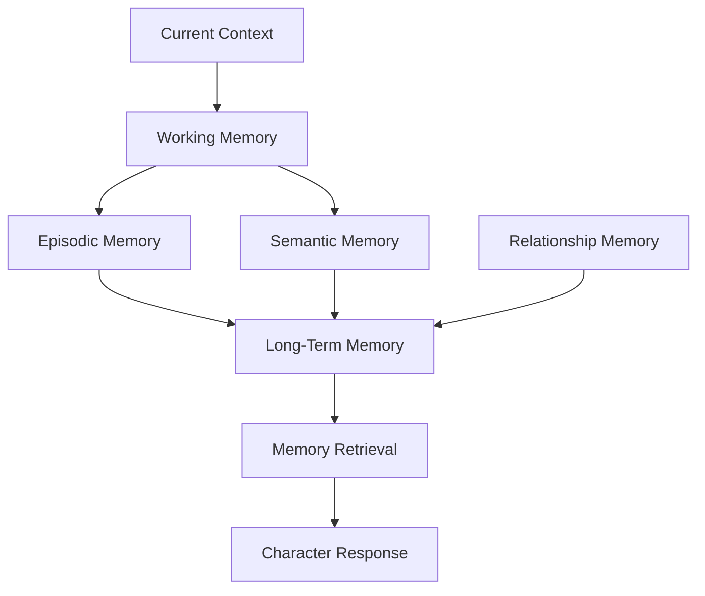
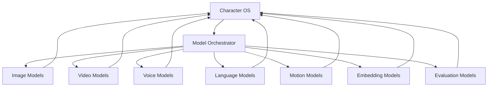
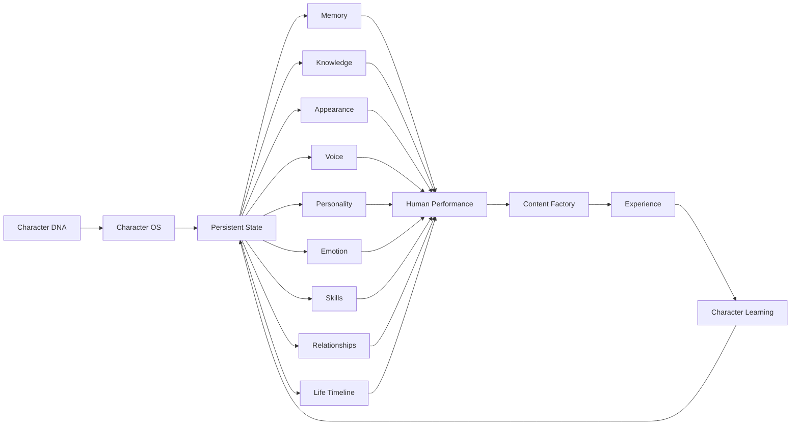

# OMNIS Digital Human and Character Generation Engine Specification

> Version: 1.0.0  
> Status: Architecture Specification  
> Domain: Digital Humans / Character OS / Identity / Personality / Appearance / Behavior / Continuity / Evolution

## 1. Purpose

The Digital Human and Character Generation Engine creates persistent virtual people for OMNIS channels. A Character is not a single image, prompt or voice. It is a versioned digital-human state composed of identity, appearance, body, voice, personality, memory, habits, knowledge, emotional tendencies, preferences, relationships, skills, limitations and evolving life state.



## 2. Core Principle

A digital human must behave as a persistent entity across time and productions rather than being regenerated from scratch for every video.

```text
CHARACTER
=
IDENTITY
+
BODY
+
FACE
+
VOICE
+
PERSONALITY
+
MEMORY
+
KNOWLEDGE
+
HABITS
+
EMOTION
+
PREFERENCES
+
SKILLS
+
LIMITATIONS
+
LIFE STATE
+
RELATIONSHIPS
+
CONTINUITY
```

## 3. Character Registry

Every Character receives a globally unique immutable identifier.

```yaml
character:
  id: char_00042
  version: 1.0
  status: active
  channel_ids:
    - channel_001
  created_at: 2026-08-17T00:00:00Z
```

## 4. Character DNA

Character DNA is the high-level specification from which specialized state models derive.

## 5. Identity Layer

Identity includes stable attributes that should not casually change.

```text
identity_id
name
alias
age_model
origin
language
accent
cultural_context
core_values
identity_markers
```

## 6. Immutable vs Mutable Identity

Some attributes are stable while others evolve.

```text
STABLE
face identity
core personality
voice identity
origin

EVOLVING
hair
clothing
fitness
skills
knowledge
relationships
mood
```

## 7. Face Identity

Face identity is represented by persistent reference embeddings, visual anchors and generation constraints.

## 8. Identity Anchors

Identity anchors may include facial proportions, eye characteristics, skin features, hairstyle baseline and other approved visual markers.

## 9. Identity Drift

Every visual generation is evaluated for deviation from approved identity anchors.

## 10. Body Model

The body model represents stable physical characteristics and configurable evolution.

## 11. Physical Continuity

Body proportions should remain stable unless an explicit long-term state change occurs.

## 12. Appearance State

Appearance is time-dependent.



## 13. Hair State

Hair length, style, color and condition are persisted across productions.

## 14. Hair Growth

Hair changes can be modeled continuously over time rather than changing arbitrarily between clips.

## 15. Hair Color

Color changes create a state transition with persistence.

## 16. Color Fade

If a Character dyes hair, the color can remain stable, fade gradually or transition according to a configured biological and stylistic model.

## 17. Grooming State

Beard and facial-hair state is persistent for Characters that have it.

## 18. Beard Growth

Beard length can advance according to elapsed time and grooming events.

## 19. Shaving Event

A shaving event creates a new grooming state and subsequent growth resumes from that point.

## 20. Makeup State

Makeup depends on Character preference, context, event, season and editorial requirements.

## 21. Wardrobe Engine

Wardrobe is a persistent inventory, not a random costume generator.

## 22. Clothing Inventory

```yaml
wardrobe:
  - item_id: jacket_04
    type: jacket
    color: black
    style: casual
    usage_count: 7
    last_worn: 2026-08-11
```

## 23. Garment Reuse

Garments can recur naturally across productions.

## 24. Outfit Composition

The system selects combinations rather than always selecting complete outfits.

```text
shirt A + pants B
shirt A + jacket C
shirt D + pants B
shirt D + jacket E
```

## 25. Seasonal Wardrobe

Season and weather influence clothing selection.

## 26. Weather Context

Connected weather information may influence wardrobe and performance context when relevant.

## 27. Geographic Context

The Character's configured location and travel state can influence weather and cultural wardrobe decisions.

## 28. Occasion Context

Formal events, gaming sessions, street content, gym content and outdoor shoots can require different wardrobe states.

## 29. Wardrobe Memory

The system tracks recent outfits to prevent unrealistic repetition while allowing normal human reuse.

## 30. Voice Identity

Voice identity is persistent and must remain recognizable across productions.

## 31. Voice Attributes

```text
timbre
pitch range
accent
speech rate
resonance
articulation
breath pattern
vocal energy
```

## 32. Voice Variation

Natural variation is permitted within Character-specific boundaries.

## 33. Temporary Voice State

Voice may vary due to modeled conditions such as fatigue, excitement, cold weather or temporary illness states.

## 34. Voice Recovery

Temporary voice changes must resolve over modeled time instead of disappearing arbitrarily in the next scene.

## 35. Speech Style

Every Character has a persistent communication style.

```yaml
speech_style:
  vocabulary: casual
  sentence_length: medium
  humor: playful
  slang: moderate
  catchphrases:
    - "let's go"
  filler_words:
    - "honestly"
```

## 36. Catchphrase Control

Catchphrases have usage probabilities and cooldowns to prevent robotic repetition.

## 37. Humor Model

Humor preferences vary by Character and context.

## 38. Conversational Rhythm

Characters can have different pause patterns, interruptions, sentence structures and reactions.

## 39. Personality Architecture

Personality is represented as interacting traits rather than a single adjective.



## 40. Trait Model

Traits may include confidence, curiosity, patience, impulsivity, sociability, discipline and competitiveness.

## 41. Strengths

Each Character has domain and personality strengths.

## 42. Weaknesses

Each Character has bounded weaknesses that influence behavior without making the Character incompetent.

## 43. Contradictory Traits

Human-like Characters can contain productive contradictions such as confident but anxious in unfamiliar environments.

## 44. Preferences

Preferences include food, music, games, fashion, entertainment and conversational subjects.

## 45. Dislikes

Dislikes influence reactions and recommendations.

## 46. Habits

Habits represent recurring behaviors that emerge across time.

## 47. Habit Strength

Each habit has a strength, trigger and probability rather than being deterministic.

## 48. Routines

Routines can vary between weekdays, weekends, seasons and life events.

## 49. Imperfection Model

Human-like realism requires bounded imperfections.

```text
occasional hesitation
minor memory uncertainty
small pronunciation variation
natural pauses
occasional tiredness
changing mood
minor wardrobe repetition
unexpected preferences
```

## 50. Imperfection Guardrails

Imperfections must improve realism without creating unsafe, defamatory or misleading behavior.

## 51. Emotion Model

Emotion is represented as transient state influenced by events, memory, personality and context.

## 52. Emotional State

```yaml
emotion:
  valence: 0.72
  arousal: 0.81
  dominant: excited
  confidence: 0.88
```

## 53. Emotional Decay

Emotional states naturally decay toward Character baseline unless reinforced.

## 54. Emotional Triggers

Triggers can include audience reactions, success, failure, criticism, surprises and story events.

## 55. Mood vs Emotion

Mood is slower-moving background state; emotion is a shorter-lived reaction.

## 56. Stress State

Stress can influence speech, attention and decision behavior within bounded parameters.

## 57. Energy State

Energy influences pacing, expressiveness and activity selection.

## 58. Memory Architecture

Character memory is layered.



## 59. Working Memory

Working memory contains the current conversation and immediate production context.

## 60. Episodic Memory

Episodic memory stores meaningful events and experiences.

## 61. Semantic Memory

Semantic memory stores learned facts and generalized knowledge.

## 62. Relationship Memory

Relationship memory stores meaningful interactions with recurring people or audience members.

## 63. Memory Importance

Not every event becomes long-term memory.

## 64. Memory Consolidation

Important repeated or emotionally significant experiences receive higher consolidation probability.

## 65. Memory Decay

Low-value memories can decay or become less accessible over time.

## 66. Memory Retrieval

Retrieval is relevance-based and must respect Character privacy boundaries.

## 67. Knowledge Architecture

Character knowledge has domain expertise plus general background knowledge.

## 68. Domain Expertise

A gaming Character should have deep knowledge of games, genres, mechanics, hardware and gaming culture appropriate to its expertise level.

## 69. Supporting Knowledge

A Character discussing a historical game may use basic historical context without pretending to be a historian.

## 70. Knowledge Boundaries

Characters should distinguish expertise from uncertainty.

## 71. Knowledge Freshness

Time-sensitive domain knowledge is refreshed through the Research and Discovery system.

## 72. Learning From Experience

Skills improve through repeated activities and evaluated outcomes.

## 73. Skill Model

```yaml
skill:
  id: game_analysis
  level: 0.74
  confidence: 0.81
  practice_hours: 142
  recent_performance: 0.88
```

## 74. Skill Growth

Successful repeated tasks increase skill gradually rather than instantly.

## 75. Skill Failure

Failure can produce learning signals when feedback is reliable.

## 76. Experience Log

Every meaningful production can generate structured experience data.

## 77. Reflection

Characters can have internal reflection summaries that influence future decisions without exposing hidden system data to viewers.

## 78. Behavioral Adaptation

Repeated audience responses can influence presentation style within Character boundaries.

## 79. Audience Relationship

Characters maintain relationship states with audience cohorts and recurring community members.

## 80. Relationship Strength

Relationship strength can be based on meaningful interaction history rather than raw message count alone.

## 81. Comment Response

The Character can respond using its own tone, knowledge, memory and relationship context through the Audience Interaction Engine.

## 82. DM Response

Private messages require stricter privacy, safety and escalation controls.

## 83. Multi-Character Relationships

Characters may have configured relationships with other OMNIS Characters.

## 84. Relationship Continuity

A Character should not suddenly forget established relationships without an explicit state change.

## 85. Life Timeline

Characters have a chronological timeline of important state transitions.

```text
created
→ first appearance
→ first publication
→ first viral event
→ skill milestones
→ style changes
→ relationship milestones
→ career evolution
```

## 86. Aging Model

If configured, age can advance over long periods while preserving identity.

## 87. Life Events

Life events can modify preferences, skills, knowledge, wardrobe, routines and emotional patterns.

## 88. Character Evolution

Character evolution is gradual and evidence-based.

## 89. Evolution Guard

Core identity should not drift because of a single random interaction.

## 90. Character Snapshot

Every production captures the Character state used for that production.

```yaml
snapshot:
  character_version: 4.18
  appearance_version: 9.02
  voice_version: 3.11
  personality_version: 2.40
  knowledge_cutoff: 2026-08-16T20:00:00Z
  wardrobe_state: 12.4
```

## 91. Snapshot Reproducibility

A historical video must be traceable to the Character state that generated it.

## 92. Multi-Model Architecture

OMNIS should not depend on one model provider for every Character capability.



## 93. Model Routing

Model selection depends on task quality, identity fidelity, latency, cost and availability.

## 94. Reference Assets

Golden reference assets are stored for identity-critical generation.

## 95. Generation Context

Every generation receives only the necessary Character context for the task.

## 96. Prompt Compilation

Character state is compiled into structured generation instructions rather than manually rewritten prompts.

## 97. Identity Evaluation

Generated outputs are scored for face, voice, body, wardrobe and behavioral consistency.

## 98. Human Review

High-value or uncertain Character changes can require human approval.

## 99. Final Architecture



## 100. Final Contract

The Digital Human and Character Generation Engine MUST create persistent, versioned and continuously evolving virtual Characters whose identity, appearance, voice, personality, memory, knowledge, habits, emotions, relationships, skills and physical continuity remain coherent across time and content. It MUST support realistic bounded variation, human-like imperfections, experience-driven skill growth, multi-model generation, identity preservation, Character snapshots, wardrobe and grooming continuity, audience relationships and controlled evolution. It MUST integrate with Character OS, Research, Audience Interaction, Content Factory, Model Orchestration and Learning systems while maintaining auditability, privacy, safety and explicit state boundaries.
