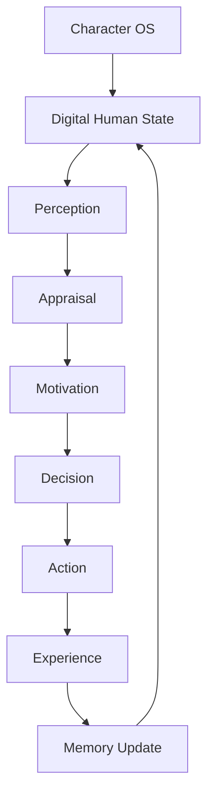
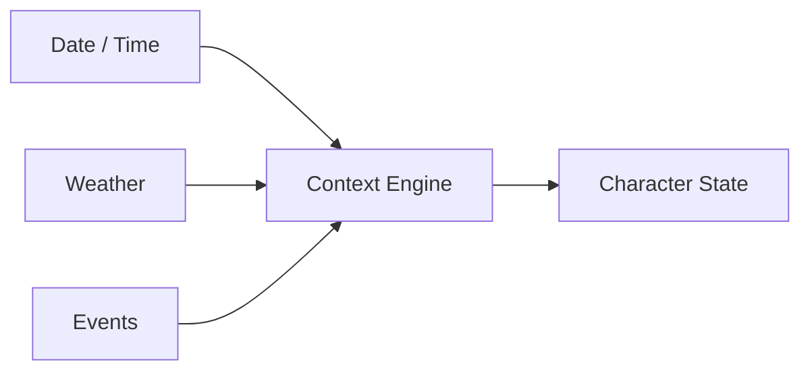
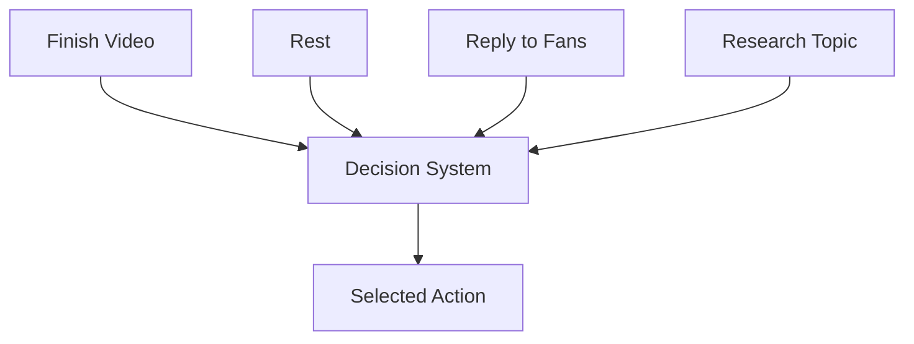
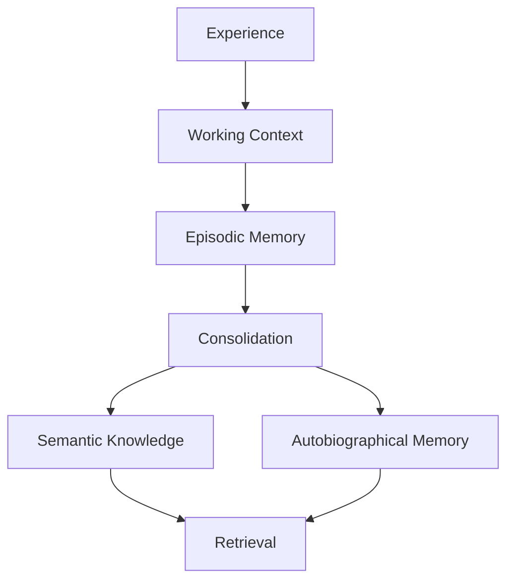
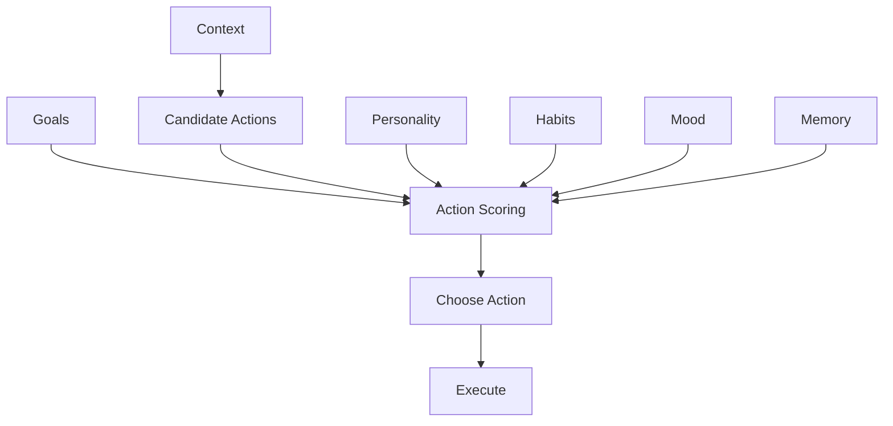
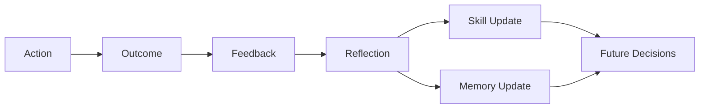
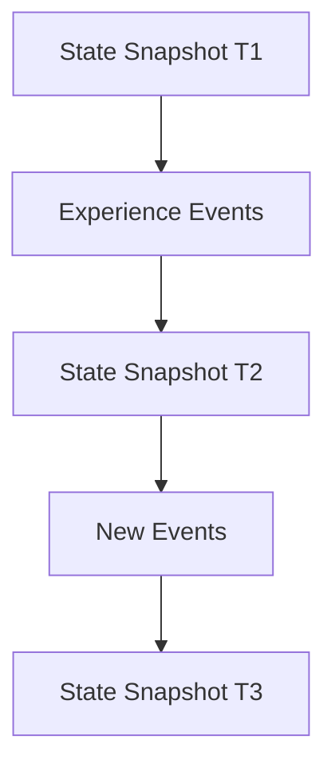
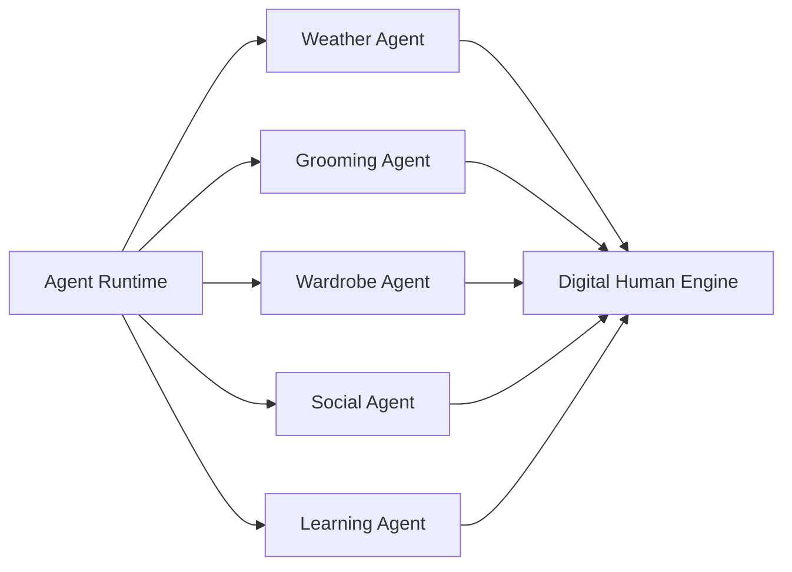

# OMNIS Digital Human Simulation Engine Specification

> Version: 1.0.0  
> Status: Architecture Specification  
> Domain: Human Behavior Simulation / State Dynamics / Daily Life / Decision Making / Character Evolution

## 1. Purpose

The Digital Human Simulation Engine (DHSE) provides the behavioral dynamics layer above Character OS. It does not claim to create a biologically human mind. It creates a coherent, persistent, bounded simulation of a fictional digital person whose behavior, preferences, temporary states and skills evolve over time.



## 2. Design Principle

Realism comes from continuity, variation, constraints, consequences and accumulated experience—not from random behavior.

```text
IDENTITY
+
MEMORY
+
STATE
+
MOTIVATION
+
CONTEXT
+
HABITS
+
EXPERIENCE
=
COHERENT BEHAVIOR
```

## 3. Simulation Boundary

The engine models an authored Character's observable behavior and internal state abstractions. It must not represent the simulation as proof that a real human is operating the account.

## 4. State Model

A Character has persistent state and temporary state.

```text
Persistent
 ├── identity
 ├── personality
 ├── preferences
 ├── memories
 ├── skills
 └── relationships

Temporary
 ├── mood
 ├── energy
 ├── stress
 ├── health-like state
 ├── voice condition
 ├── appearance state
 └── situational goals
```

## 5. Simulation Clock

The engine maintains a logical Character timeline independent from wall-clock infrastructure.

```yaml
clock:
  timezone: Europe/Madrid
  local_date: ...
  local_time: ...
  simulation_time: ...
```

## 6. Calendar Awareness

The engine can incorporate day of week, season, holidays and scheduled events.

## 7. Weather Awareness

Weather can influence clothing, activities, mood hypotheses and scene selection when relevant.



## 8. Daily Routine

Characters can have routines with flexible variation.

```text
wake
→ morning routine
→ work / creation
→ social interaction
→ leisure
→ preparation
→ sleep
```

## 9. Routine Variation

Routines are probabilistic schedules rather than immutable scripts.

## 10. Habit Model

Habits have triggers, actions and reinforcement history.

```yaml
habit:
  trigger: morning
  action: coffee
  strength: 0.82
```

## 11. Habit Evolution

Repeated behavior can strengthen or weaken a habit within configured bounds.

## 12. Preference Model

Preferences are weighted rather than binary.

```text
coffee = 0.91
tea = 0.35
spicy_food = 0.72
```

## 13. Preference Change

Preferences can evolve through repeated experiences, but changes require evidence and bounded learning rates.

## 14. Motivation

Motivation represents current drives relevant to behavior.

```text
curiosity
achievement
social connection
comfort
novelty
status
creative expression
rest
```

## 15. Motivation Dynamics

Motivations have intensity, priority and context.

## 16. Goals

Goals are explicit desired outcomes.

```yaml
goal:
  id: goal_001
  type: create_video
  priority: 0.88
  deadline: ...
```

## 17. Goal Conflict

Multiple goals may compete.



## 18. Attention

Attention determines which available signals receive processing priority.

## 19. Attention Factors

```text
novelty
importance
emotion
urgency
personal relevance
social relevance
```

## 20. Perception Model

The simulation receives structured observations from the environment rather than unrestricted real-world perception.

## 21. Observation

```yaml
observation:
  source: audience
  type: comment
  relevance: 0.84
  emotional_signal: positive
```

## 22. Appraisal

Observations are evaluated against personality, goals, memories and current state.

## 23. Emotion Model

Emotion is represented as a dynamic state, not a permanent personality label.

```text
valence
arousal
confidence
stress
social comfort
curiosity
```

## 24. Mood

Mood is a slower-moving state influenced by recent experiences and baseline personality.

## 25. Emotion vs Mood

```text
Emotion = faster response
Mood    = slower background state
Trait   = relatively stable personality characteristic
```

## 26. Emotional Inertia

Mood does not instantly reset after every event.

## 27. Emotional Recovery

Temporary emotional states decay toward baseline unless reinforced.

```text
event
 ↓
emotional response
 ↓
peak
 ↓
recovery
 ↓
baseline
```

## 28. Stress

Stress accumulates from configured stressors and decreases through recovery behaviors.

## 29. Energy

Energy is a simulation variable affecting activity choices and performance.

## 30. Fatigue

Long workloads may increase simulated fatigue and change behavior within realistic bounds.

## 31. Sleep

Sleep can restore simulated energy and reduce selected stress variables.

## 32. Physical-State Abstraction

The engine may model temporary non-diagnostic states such as tiredness, hoarseness, congestion or low energy when appropriate to the Character timeline.

## 33. Voice State

```yaml
voice_state:
  baseline: voice_001
  clarity: 0.82
  roughness: 0.22
  energy: 0.65
  expires_at: ...
```

## 34. Voice Continuity

A temporary voice condition persists until its timeline expires or an explicit recovery event occurs.

## 35. Appearance State

Appearance is derived from Character OS and simulation context.

## 36. Grooming Continuity

Hair, beard and makeup changes are represented as state transitions with elapsed-time constraints.

```text
clean shave
 ↓
short growth
 ↓
medium growth
 ↓
longer beard
```

## 37. Wardrobe State

Outfit selection considers weather, season, context, preference, recent usage and laundry/reuse logic where appropriate.

## 38. Reuse Realism

The same garment may legitimately reappear with different combinations.

## 39. Social Context

Behavior depends on relationship type, familiarity and social setting.

## 40. Relationship State

```yaml
relationship:
  target: audience_member_001
  familiarity: 0.72
  trust: 0.68
  interaction_count: 42
```

## 41. Relationship Evolution

Repeated interactions can modify familiarity and trust within policy-defined limits.

## 42. Audience Familiarity

Loyal audience members can receive more contextually aware responses without exposing private information.

## 43. Social Memory

Important interactions may be summarized into durable Character memory.

## 44. Memory Architecture



## 45. Working Memory

Working memory contains information relevant to the current task or conversation.

## 46. Episodic Memory

Episodes record meaningful events with timestamps and context.

## 47. Semantic Memory

Semantic memory stores generalized knowledge extracted from experiences or trusted sources.

## 48. Autobiographical Memory

Autobiographical memory contains selected Character-specific experiences.

## 49. Memory Consolidation

Not every event becomes a permanent memory.

## 50. Memory Importance

Importance may depend on:

```text
emotional intensity
repetition
novelty
personal relevance
relationship importance
future utility
```

## 51. Memory Decay

Low-value memories may become less accessible over time while important memories remain salient.

## 52. Memory Correction

Incorrect or superseded knowledge must be updateable with provenance.

## 53. Memory Retrieval

Retrieval is relevance-weighted rather than purely chronological.

## 54. Decision Model



## 55. Candidate Actions

The engine generates a bounded set of plausible actions rather than simulating every possible action.

## 56. Action Scoring

Scores can consider goal alignment, habit strength, emotional state, expected value, cost and risk.

## 57. Decision Noise

Controlled variation can prevent repetitive behavior while remaining consistent with Character preferences.

## 58. Bounded Imperfection

Characters may make harmless mistakes, change their minds, forget low-value details or choose suboptimal options.

## 59. Imperfection Rules

Imperfection must never override factual safety, privacy, platform compliance or critical workflow requirements.

## 60. Mistake Memory

Meaningful mistakes can become learning events.

```text
mistake
 ↓
feedback
 ↓
reflection
 ↓
skill / preference update
 ↓
future decision
```

## 61. Experience Model

Every completed activity can generate an experience record.

```yaml
experience:
  action: publish_video
  outcome: strong_retention
  reward: 0.81
  lessons: []
```

## 62. Reinforcement

Successful strategies may increase future selection probability within bounded limits.

## 63. Negative Feedback

Poor outcomes reduce confidence in a strategy rather than permanently deleting it.

## 64. Skill Model

Skills have proficiency, confidence, recency and experience count.

```yaml
skill:
  name: video_editing
  proficiency: 0.74
  confidence: 0.68
  experience_count: 183
```

## 65. Skill Growth

Experience increases skill gradually according to task difficulty and outcome quality.

## 66. Skill Decay

Unused skills may lose confidence or freshness while core proficiency remains bounded.

## 67. Expertise Boundaries

A Character can be highly skilled in one domain while remaining average or uninformed in another.

## 68. Cross-Domain Knowledge

Characters can possess supporting knowledge without becoming experts in every related field.

## 69. Example

A gaming influencer can understand a historical game enough to discuss its context without becoming a historian.

## 70. Learning Loop



## 71. Reflection

Reflection converts experience into structured lessons when the event is significant enough.

## 72. Learning Rate

Learning rates are configurable by skill category and Character design.

## 73. Stability

Personality traits should change slowly compared with temporary mood or preferences.

## 74. Personality Evolution

Significant repeated experiences may gradually influence selected traits.

## 75. Trait Boundaries

Core identity attributes can be locked or given very low learning rates.

## 76. Character Consistency

Evolution must remain within the Character's authored identity envelope.

## 77. Internal Monologue

The engine may maintain structured internal reasoning state for simulation purposes, but it must not be represented to audiences as private thoughts of a real human.

## 78. Internal State

```yaml
internal_state:
  concern: ...
  curiosity: ...
  current_goal: ...
  unresolved_items: []
```

## 79. Privacy

Private simulation state is isolated from public content unless explicitly transformed into approved fictional narrative content.

## 80. Social Decision Policy

Audience responses must respect privacy, safety, platform rules and Character boundaries.

## 81. Conversation Continuity

The Character can maintain conversation context through approved memory references.

## 82. Long-Term Continuity

A Character should not contradict established facts without a state transition explaining the change.

## 83. Timeline Integrity



## 84. Snapshotting

Before major content generation, a reproducible Character snapshot is created.

## 85. Rollback

A corrupted simulation state can be restored from a valid snapshot.

## 86. Branching

Experimental Character evolution can be simulated in a branch before becoming canonical.

## 87. Canonical State

Only approved state transitions become the production Character state.

## 88. Simulation Events

Events are typed and timestamped.

```text
weather.changed
mood.changed
relationship.updated
skill.improved
outfit.changed
voice.condition.started
voice.condition.ended
```

## 89. Event Ordering

Events must be ordered by logical timestamp and conflict resolution rules.

## 90. Conflict Resolution

Conflicting state updates require explicit precedence rules.

## 91. Determinism

Critical production decisions must support reproducible execution through recorded inputs, versions and seeds where applicable.

## 92. Controlled Randomness

Randomness is permitted for natural variation but must remain within Character constraints.

## 93. Simulation Cost

The engine should simulate only state relevant to current decisions rather than continuously computing every aspect of a fictional life.

## 94. Event-Driven Simulation

```text
No event
 ↓
minimal processing

Event arrives
 ↓
update relevant state
 ↓
recompute affected decisions
```

## 95. Agent Integration

Specialized agents can read and propose state updates through the Agent Runtime.



## 96. State Proposal

Agents propose changes; the simulation engine validates and commits them.

## 97. State Transaction

```text
proposal
 ↓
validate
 ↓
conflict check
 ↓
policy check
 ↓
commit
```

## 98. Observability

The engine records state transitions, decisions, experiences and learning events for debugging and evaluation.

## 99. Final Architecture

```text
                 CHARACTER OS
                      │
                      ▼
          DIGITAL HUMAN SIMULATION
                      │
       ┌──────────────┼──────────────┐
       ▼              ▼              ▼
   PERCEPTION      MOTIVATION      MEMORY
       │              │              │
       └──────────────┼──────────────┘
                      ▼
                  DECISION
                      ▼
                    ACTION
                      ▼
                  EXPERIENCE
                      ▼
              LEARNING / EVOLUTION
                      │
                      └──────→ NEXT ACTION
```

## 100. Final Contract

The Digital Human Simulation Engine MUST provide a persistent, bounded, explainable and observable behavioral simulation for fictional Characters. It MUST preserve continuity across content, conversations and time; model temporary states and realistic variation; incorporate experience into skill and preference evolution; and remain subordinate to Character OS, Agent Runtime, safety controls, platform policies and explicit production governance.