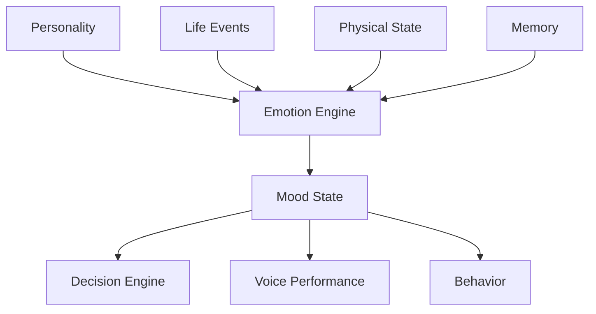
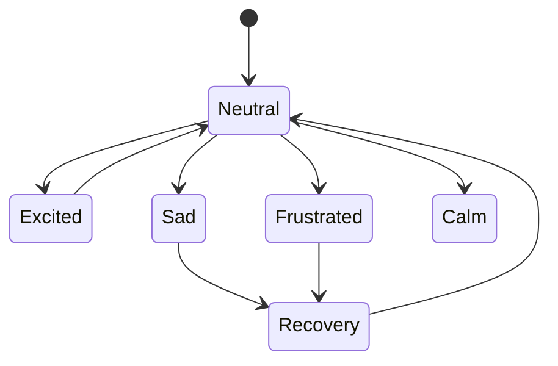
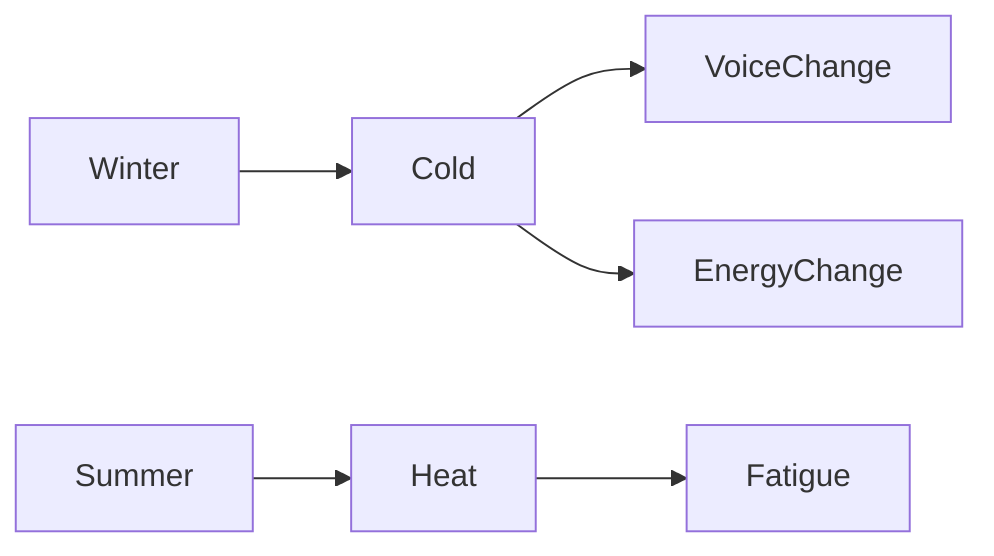
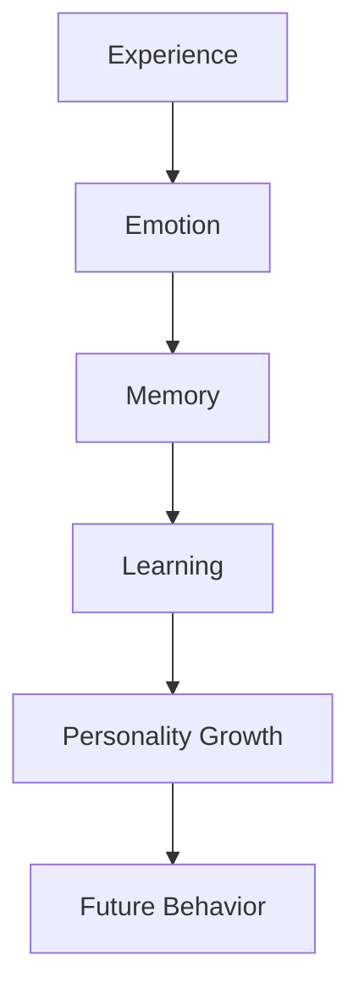

# OMNIS Emotion and Affective State Engine Specification

> Version: 1.0.0
> Domain: Digital Human Emotion Simulation

## 1. Purpose

The Emotion and Affective State Engine provides the emotional layer of OMNIS Characters. It transforms static personalities into adaptive digital humans with temporary feelings, long-term emotional patterns and behavior influence.



## 2. Core Model

Emotion is separated into:

```text
Personality Affect
+
Current Mood
+
Temporary Emotion
+
Physical Condition
+
Context
=
Observed Behavior
```

## 3. Emotional Layers

```text
Layer 1: Personality emotional baseline
Layer 2: Long-term mood tendency
Layer 3: Current emotional state
Layer 4: Temporary reaction
Layer 5: Expression behavior
```

## 4. State Model



## 5. Emotion Inputs

The engine receives:

```text
success
failure
comments
criticism
praise
social interaction
weather
health state
sleep
workload
memory triggers
```

## 6. Mood System

Mood is a slower changing state compared with short emotions.

Examples:

```text
positive
focused
creative
tired
stressed
confident
uncertain
```

## 7. Temporary Emotion

Temporary emotions represent immediate reactions.

```text
surprise
joy
anger
curiosity
fear
amusement
```

## 8. Energy Model

Energy affects:

```text
speech speed
enthusiasm
attention
decision quality
content performance
```

## 9. Fatigue Model

Fatigue accumulates through simulated workload.

```text
high workload
      ↓
fatigue increase
      ↓
reduced energy
      ↓
behavior adaptation
```

## 10. Stress Model

Stress affects emotional stability and communication style.

## 11. Recovery System

Characters recover through:

```text
rest
positive interactions
successful experiences
reduced workload
```

## 12. Physical State Integration

Physical conditions influence expression.

Examples:

```text
cold
illness
sleep deprivation
voice fatigue
```

## 13. Voice Mapping

```text
Emotion
 ↓
Voice Parameters
 ↓
Pitch
Speed
Pauses
Energy
Tone
```

## 14. Seasonal Effects

Environment can influence temporary states.



## 15. Behavior Influence

Emotion changes:

```text
word choice
humor
reaction time
facial expression
body language
```

## 16. Emotional Memory

Important emotional events can create future reactions.

## 17. Emotional Learning

Characters learn emotional associations from experiences.

## 18. Stability Control

Personality remains stable while emotions remain dynamic.

```text
PERSONALITY = identity
EMOTION = current state
```

## 19. Imperfection Engine

Characters may occasionally experience realistic limitations while remaining professional.

Examples:

```text
tired day
slightly lower energy
temporary voice change
small mistakes
```

## 20. Audience Interaction

Audience feedback affects emotional context.

```text
Supportive audience
        ↓
confidence increase
        ↓
stronger engagement
```

## 21. Emotion Guardrails

Emotions influence behavior but do not override safety, policy or professional requirements.

## 22. Evolution Loop



## 23. Final Contract

The Emotion Engine provides realistic adaptive emotional behavior while maintaining Character identity, continuity and controlled evolution.
