# OMNIS Event Bus and Workflow Specification

> Version: 1.0.0  
> Status: Implementation Specification  
> Domain: Events / Workflows / Scheduling / Distributed Execution

---

## 1. Purpose

This specification defines the event-driven execution backbone of OMNIS. It connects thousands of Agents, virtual Characters, content pipelines, memory systems, audience systems, analytics services and external platforms without requiring direct point-to-point coupling.

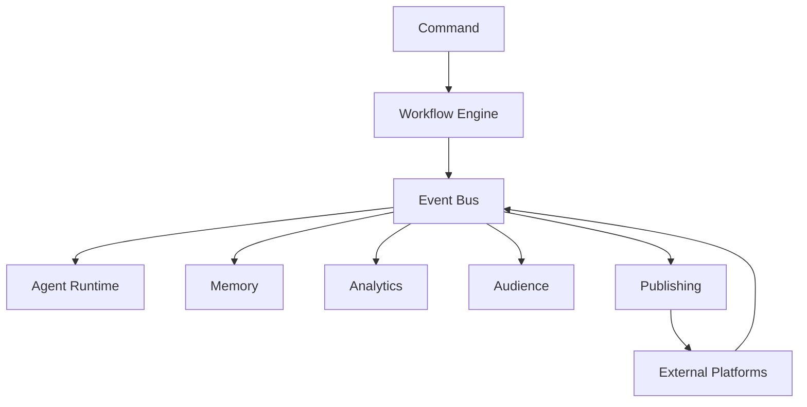

---

## 2. Core Principles

```text
EVENT DRIVEN
ASYNC BY DEFAULT
IDEMPOTENT
DURABLE
REPLAYABLE
OBSERVABLE
PRIORITIZED
CANCELABLE
RESUMABLE
FAIL SAFE
```

---

## 3. Event vs Command

A command requests an action.

```text
Command:
"Create a gaming video"
```

An event records something that happened.

```text
ContentProjectCreated
```

Commands are intent. Events are facts.

---

## 4. Event Envelope

```yaml
event:
  id: evt_123
  type: ContentProjectCreated
  version: 1
  occurred_at: 2026-08-17T00:00:00Z
  tenant_id: tenant_001
  workspace_id: workspace_001
  character_id: char_007
  actor_id: agent_orchestrator
  correlation_id: corr_123
  causation_id: cmd_456
  trace_id: trace_789
  payload: {}
```

---

## 5. Event Naming

Event names describe completed facts.

```text
CommentReceived
ResearchCompleted
ScriptApproved
VideoRendered
PublicationSucceeded
```

Avoid imperative names such as `PublishVideo` for events.

---

## 6. Command Envelope

```yaml
command:
  id: cmd_123
  type: GenerateScript
  actor_id: agent_42
  workflow_id: wf_99
  tenant_id: tenant_001
  priority: normal
  payload: {}
```

---

## 7. Correlation

Every distributed workflow carries correlation metadata.

```text
request
 ↓
workflow
 ↓
job
 ↓
agent task
 ↓
tool call
 ↓
event
```

All stages retain the same correlation identifier where applicable.

---

## 8. Causation

Each event may identify the command or event that caused it.

```text
Command A
 ↓
Event B
 ↓
Event C
```

This enables causal debugging.

---

## 9. Event Bus Architecture

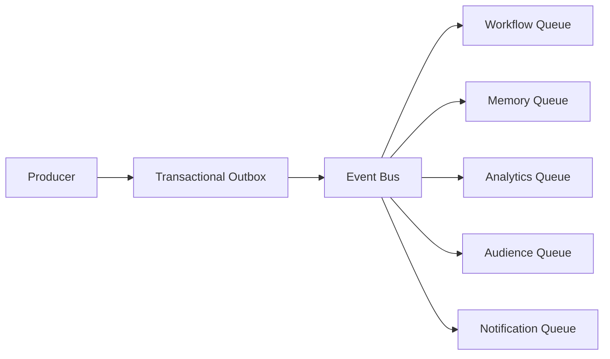

---

## 10. Topic Design

Topics SHOULD be organized by domain rather than individual service.

```text
omnis.character
omnis.content
omnis.audience
omnis.memory
omnis.analytics
omnis.security
omnis.publishing
```

---

## 11. Partitioning

Partition keys preserve ordering where required.

Recommended keys:

```text
character_id
workflow_id
content_id
account_id
```

Global ordering is not required.

---

## 12. Consumer Groups

Consumers use independent groups.

```text
Event
 ├── Memory Consumer
 ├── Analytics Consumer
 ├── Learning Consumer
 └── Notification Consumer
```

A slow consumer must not block unrelated consumers.

---

## 13. Durable Delivery

Important events require durable storage before acknowledgment.

```text
receive
 ↓
persist
 ↓
process
 ↓
ack
```

---

## 14. At-Least-Once Delivery

The default delivery guarantee is at-least-once.

Consumers MUST be idempotent.

```text
Event X
 ↓
process
 ↓
retry
 ↓
Event X again
```

The second delivery must not duplicate the business effect.

---

## 15. Idempotency Keys

```yaml
idempotency_key: publish:char_007:video_123:v4
```

External writes MUST use idempotency where the provider supports it.

---

## 16. Exactly-Once Semantics

OMNIS should not depend on global exactly-once delivery. Exactly-once business effects are implemented through idempotency, transactions and deduplication.

---

## 17. Retry Policy

Retries use bounded exponential backoff.

```text
attempt 1 → 1s
attempt 2 → 2s
attempt 3 → 4s
attempt 4 → 8s
```

Jitter SHOULD be applied to prevent synchronized retry storms.

---

## 18. Retry Classification

```text
transient → retry
rate limit → delayed retry
timeout → retry if safe
validation → no retry
authentication → refresh / reauthorize
permission → no blind retry
```

---

## 19. Dead Letter Queue

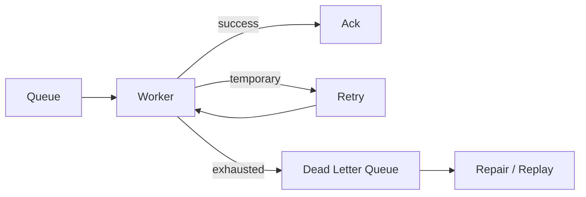

---

## 20. Poison Messages

Messages repeatedly failing due to malformed data are isolated in the DLQ and MUST NOT block healthy traffic.

---

## 21. Workflow Engine

The Workflow Engine executes durable multi-step plans.

```text
Research
 ↓
Script
 ↓
Review
 ↓
Assets
 ↓
Render
 ↓
Publish
 ↓
Measure
 ↓
Learn
```

---

## 22. Workflow Definition

```yaml
workflow:
  id: gaming_video_pipeline
  version: 7
  steps:
    - research
    - script
    - assets
    - render
    - review
    - publish
    - analytics
```

Workflow definitions are versioned.

---

## 23. Directed Acyclic Graph

Complex workflows are represented as DAGs.

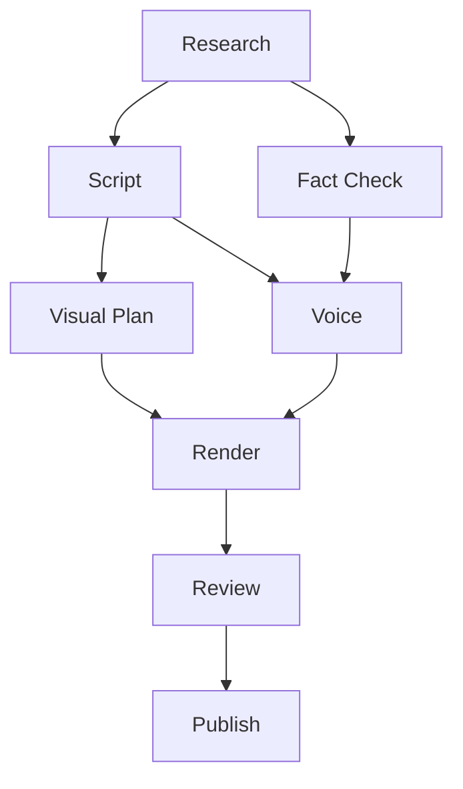

---

## 24. Parallel Tasks

Independent tasks execute concurrently.

```text
Research
 ├── source research
 ├── trend research
 ├── historical context
 └── audience signals
          ↓
       synthesis
```

---

## 25. Dependency Management

A task starts only after required dependencies succeed.

```yaml
depends_on:
  - research
  - fact_check
```

---

## 26. Conditional Branches

Workflows support policy-driven branching.

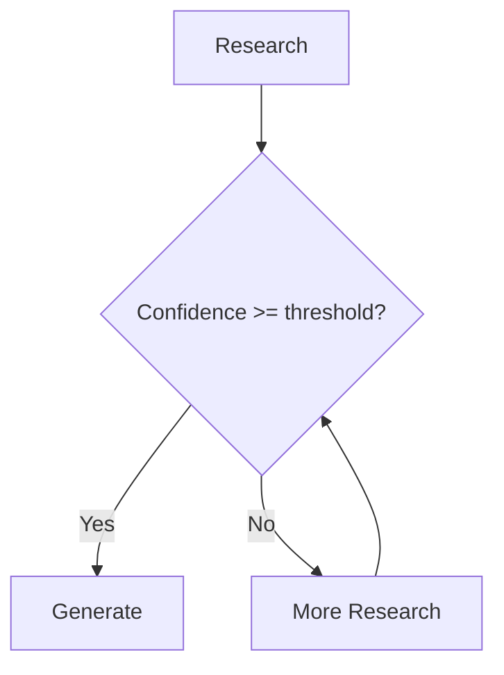

---

## 27. Human Gates

High-impact workflows can pause for human approval.

```text
workflow
 ↓
approval gate
 ↓
WAITING_FOR_HUMAN
 ↓
approved
 ↓
resume
```

---

## 28. Workflow State Machine

```text
CREATED
 ↓
QUEUED
 ↓
RUNNING
 ├── WAITING
 ├── PAUSED
 ├── RETRYING
 └── CANCEL_REQUESTED
 ↓
SUCCEEDED / FAILED / CANCELED
```

---

## 29. Durable Workflow State

Workflow state MUST survive process restart.

```yaml
workflow_state:
  workflow_id: wf_123
  status: running
  current_nodes: [render]
  completed_nodes: [research, script]
  checkpoint: cp_17
```

---

## 30. Checkpoints

Long-running workflows create checkpoints.

```text
render 60%
 ↓ checkpoint
worker crash
 ↓
restore checkpoint
 ↓
continue
```

---

## 31. Resume

A workflow MUST be resumable where the underlying task supports it.

---

## 32. Cancellation

Cancellation is cooperative for safe operations and immediate for dangerous operations.

```text
cancel requested
 ↓
stop new work
 ↓
finish safe work
 ↓
cleanup
```

---

## 33. Kill Switch Integration

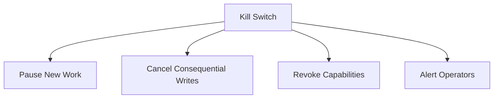

---

## 34. Scheduling

The scheduler supports:

```text
cron
interval
calendar time
event trigger
condition trigger
manual trigger
```

---

## 35. Time Zones

Schedules MUST store explicit time zones.

```yaml
schedule:
  timezone: Europe/Berlin
  local_time: "18:30"
```

---

## 36. Calendar Awareness

Content scheduling can incorporate:

```text
holidays
seasonality
platform events
campaign dates
character continuity
```

---

## 37. Weather-Aware Workflows

For location-dependent content, weather can become a workflow input.

```text
scheduled shoot
 ↓
weather check
 ↓
acceptable?
 ├── yes → execute
 └── no → reschedule
```

---

## 38. Priority

Jobs support priorities.

```text
CRITICAL
HIGH
NORMAL
LOW
BACKGROUND
```

Priority MUST NOT bypass security policy.

---

## 39. Fairness

A single Character or tenant MUST NOT starve all other workloads.

```text
weighted queues
per-tenant quotas
per-character concurrency
```

---

## 40. Concurrency Limits

Limits exist at multiple levels.

```text
global
provider
tenant
workspace
character
workflow
agent
```

---

## 41. Resource Reservations

Heavy workloads can reserve resources.

```yaml
resources:
  gpu: 1
  cpu: 8
  memory_gb: 32
```

---

## 42. Backpressure

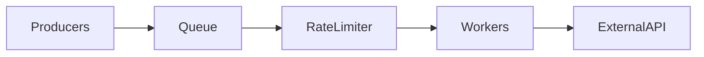

Queues absorb bursts while rate limiters protect downstream services.

---

## 43. Rate Limits

Rate limits are provider-aware.

```text
YouTube API
Model Provider
Image Provider
Search Provider
```

Each adapter exposes its current limits to the scheduler.

---

## 44. Adaptive Scheduling

The scheduler may reduce throughput when provider capacity falls.

```text
capacity ↓
 ↓
concurrency ↓
 ↓
queue grows safely
```

---

## 45. Circuit Breaker

```text
CLOSED
 ↓ failures
OPEN
 ↓ cooldown
HALF_OPEN
 ↓ success
CLOSED
```

Circuit breakers prevent cascading provider failures.

---

## 46. Timeouts

Every external task has a timeout.

```yaml
timeout:
  connect: 5s
  request: 60s
  total: 90s
```

---

## 47. Heartbeats

Long-running workers emit heartbeats.

```text
worker
 ↓ heartbeat
scheduler
```

Missing heartbeats trigger recovery logic.

---

## 48. Lease-Based Work

Workers lease jobs.

```text
queued
 ↓ lease
worker A
 ↓
completion
```

Expired leases return jobs to the queue.

---

## 49. Work Stealing

Workers may steal compatible queued work when safe.

This improves utilization without violating tenant or capability constraints.

---

## 50. Agent Task Model

```yaml
task:
  id: task_123
  workflow_id: wf_7
  agent_id: research_agent
  character_id: char_7
  capability: research.web
  priority: high
  input: {}
```

---

## 51. Agent Pool

Agents are selected by capability and context.

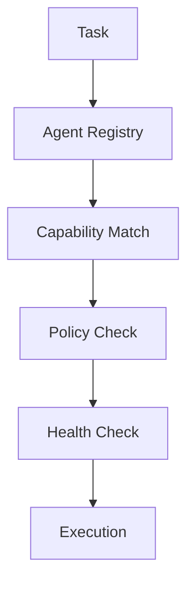

---

## 52. Model Routing

Agent tasks may select models dynamically.

```text
task
 ↓
model policy
 ↓
quality/cost/latency
 ↓
model
```

---

## 53. Cost-Aware Scheduling

A task can have a budget.

```yaml
budget:
  max_cost_usd: 2.50
```

The scheduler should stop or downgrade work when budget limits are reached.

---

## 54. Quality-Aware Scheduling

Critical tasks can require minimum model quality.

```text
quality threshold
 ↓
eligible models
 ↓
select best available
```

---

## 55. Multi-Agent Coordination

Agents communicate through durable events rather than hidden direct state mutation.

```text
Agent A
 ↓ event
Agent B
 ↓ event
Agent C
```

---

## 56. Blackboard Pattern

Shared workflow state can act as a controlled blackboard.

```text
Workflow Context
 ├── research
 ├── facts
 ├── script
 ├── assets
 └── review
```

Agents receive only authorized portions.

---

## 57. Human Collaboration

Humans are modeled as workflow participants.

```text
Agent → Human Review → Agent
```

---

## 58. Notifications

Workflow events can generate notifications.

```text
ApprovalRequired
 ↓
Notification Service
 ↓
Mobile / Studio
```

---

## 59. Event-Driven Audience Loop

Audience behavior can trigger content workflows.

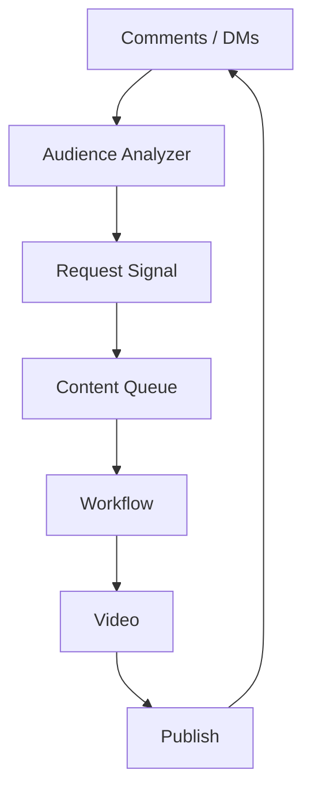

---

## 60. Demand Thresholds

Repeated audience requests can automatically cross a threshold.

```yaml
threshold:
  request_count: 25
  confidence: 0.80
  action: create_content_workflow
```

---

## 61. Priority Boosting

Requests from highly engaged communities can receive additional ranking weight without bypassing policy.

---

## 62. Character Continuity Trigger

A content workflow can trigger continuity updates.

```text
VideoPublished
 ↓
CharacterTimeline
 ↓
update recent outfit/location/context
```

---

## 63. Long-Running Campaigns

Campaign workflows can run for weeks or months.

```text
campaign
 ├── weekly videos
 ├── shorts
 ├── community posts
 └── analytics reviews
```

---

## 64. Recurring Workflows

Recurring workflows create new execution instances.

```text
schedule
 ↓
execution #1
 ↓
execution #2
 ↓
execution #3
```

Each execution has its own identity.

---

## 65. Workflow Versioning

Existing executions continue under the version they started with unless explicitly migrated.

```text
workflow v7
 ↓ execution
workflow v8 released
 ↓
old run remains v7
```

---

## 66. Migration

Running workflows can be migrated only through an explicit migration procedure.

---

## 67. Dry Run

Critical workflows support simulation.

```text
DRY RUN
 ↓
resolve dependencies
 ↓
estimate cost
 ↓
validate permissions
 ↓
NO EXTERNAL WRITE
```

---

## 68. Preview Mode

Content workflows can render previews without publishing.

```text
generate
 ↓
preview
 ↓
review
 ↓
publish
```

---

## 69. Transactional Boundaries

Workflow state transitions should be atomic where possible.

```text
current_state
 ↓ transaction
new_state + event
```

---

## 70. Saga Pattern

Distributed workflows use compensating actions where rollback is impossible.

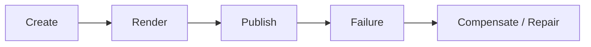

External publishing cannot always be rolled back, so the workflow records reconciliation actions.

---

## 71. External Side Effects

Side effects are classified:

```text
READ
REVERSIBLE WRITE
IRREVERSIBLE WRITE
```

The last category receives stronger controls.

---

## 72. Publish Barrier

Publishing is a final workflow barrier.

```text
Research ✓
Script ✓
Assets ✓
Render ✓
Review ✓
Policy ✓
Identity ✓
Publish →
```

---

## 73. Idempotent Publishing

A publication task stores an external idempotency reference when available.

```yaml
publication:
  internal_id: pub_123
  external_id: platform_456
  status: published
```

---

## 74. Reconciliation

Scheduled reconciliation compares OMNIS state with external platforms.

```text
OMNIS state
     ↕
Platform state
```

Differences create repair workflows.

---

## 75. Eventual Consistency

External platform state may lag OMNIS state.

The system MUST expose synchronization status rather than pretending consistency is immediate.

---

## 76. Event Ordering Conflicts

If events arrive out of order, consumers use sequence numbers or version checks where the domain requires ordering.

---

## 77. Stale Events

Stale events MUST NOT overwrite newer authoritative state.

```text
version 8
 ↑
version 7 arrives
 ↓
ignore / quarantine
```

---

## 78. Workflow Observability

Every execution exposes:

```text
status
latency
cost
retries
queue time
active node
failure reason
trace id
```

---

## 79. Event Metrics

Track:

```text
events/sec
consumer lag
processing latency
retry rate
DLQ rate
workflow success rate
workflow duration
```

---

## 80. Distributed Tracing

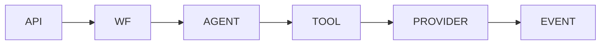

A shared trace ID connects all spans.

---

## 81. Audit Events

Security-sensitive workflow transitions emit audit events.

```text
ApprovalGranted
CapabilityDelegated
PublishAuthorized
KillSwitchActivated
```

---

## 82. Policy Events

Policy changes become versioned events.

```text
PolicyUpdated
PolicyActivated
PolicyRolledBack
```

---

## 83. Failure Domains

Failures are isolated by:

```text
provider
queue
tenant
character
agent
workflow
region
```

---

## 84. Bulkhead Isolation

```text
Character A queue ─┐
Character B queue ─┼→ isolated workers
Character C queue ─┘
```

A runaway character cannot consume all capacity.

---

## 85. Tenant Quotas

```yaml
quota:
  tenant_id: tenant_001
  concurrent_workflows: 20
  daily_model_budget_usd: 100
```

---

## 86. Character Quotas

Characters can have:

```text
max active workflows
max render concurrency
max publish frequency
max model spend
```

---

## 87. Backlog Management

When queues grow:

```text
measure backlog
 ↓
classify priority
 ↓
scale workers
 ↓
delay low priority
 ↓
protect critical work
```

---

## 88. Autoscaling

Worker pools scale based on:

```text
queue depth
CPU
GPU
latency
provider capacity
```

---

## 89. Warm Pools

Expensive media and model workers may use warm pools to reduce startup latency.

---

## 90. Scheduled Maintenance

The scheduler supports maintenance windows.

```text
maintenance
 ↓
stop new work
 ↓
finish safe jobs
 ↓
upgrade
 ↓
resume
```

---

## 91. Security Boundary

Workflow execution cannot bypass the Tool Gateway or Policy Engine.

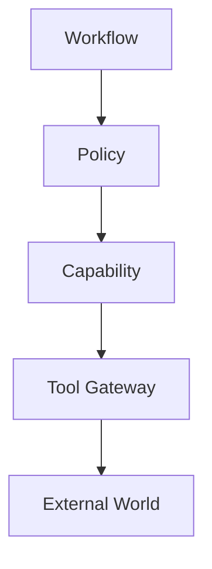

---

## 92. Tenant Boundary

Every job contains tenant and workspace context.

A worker MUST verify that the requested resource belongs to the execution context.

---

## 93. Character Boundary

A Character workflow cannot silently use another Character's private memory, credentials or social identity.

---

## 94. Human Override

Authorized operators can:

```text
pause
resume
cancel
retry
skip
approve
reject
quarantine
```

Every override is audited.

---

## 95. Manual Repair

Operators can create repair workflows rather than editing state directly.

```text
incident
 ↓ repair workflow
 ↓ validation
 ↓ state correction
```

---

## 96. Replay

Replay modes include:

```text
single event
workflow node
workflow execution
historical period
```

Replay MUST default to no external writes.

---

## 97. Simulation

Simulation can estimate:

```text
cost
runtime
provider usage
queue impact
policy decisions
```

---

## 98. Testing

Workflow infrastructure requires:

```text
unit tests
integration tests
contract tests
failure injection
load tests
replay tests
idempotency tests
security tests
```

---

## 99. Canonical OMNIS Execution Loop

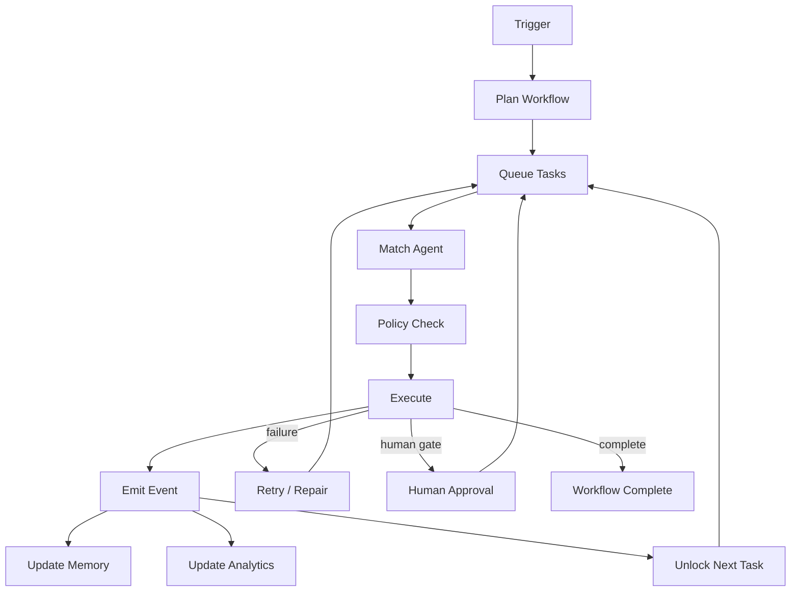

---

## 100. Final Contract

The OMNIS Event Bus and Workflow Engine form the execution nervous system of the platform.

```text
TRIGGER
 ↓
EVENT
 ↓
WORKFLOW
 ↓
AGENT
 ↓
TOOL
 ↓
EXTERNAL EFFECT
 ↓
EVENT
 ↓
MEMORY
 ↓
ANALYTICS
 ↓
LEARNING
 ↓
NEXT DECISION
```

The system MUST support thousands of concurrent tasks while preserving identity, authorization, tenant isolation, character continuity, idempotency, observability, cost controls, human intervention, replayability and safe recovery.