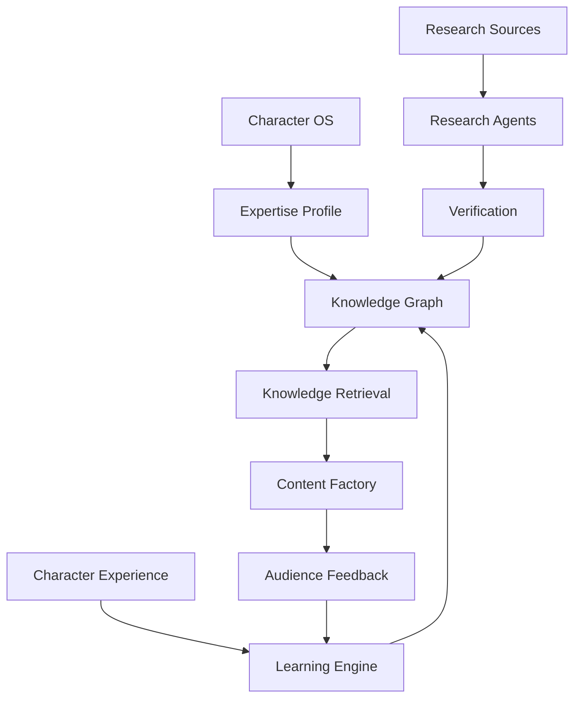
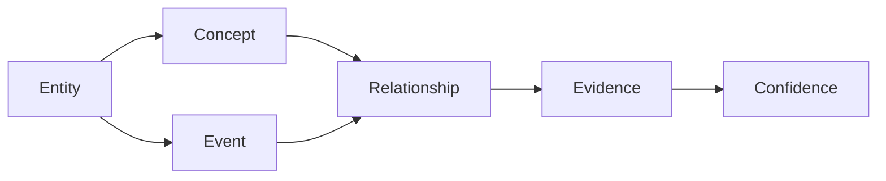
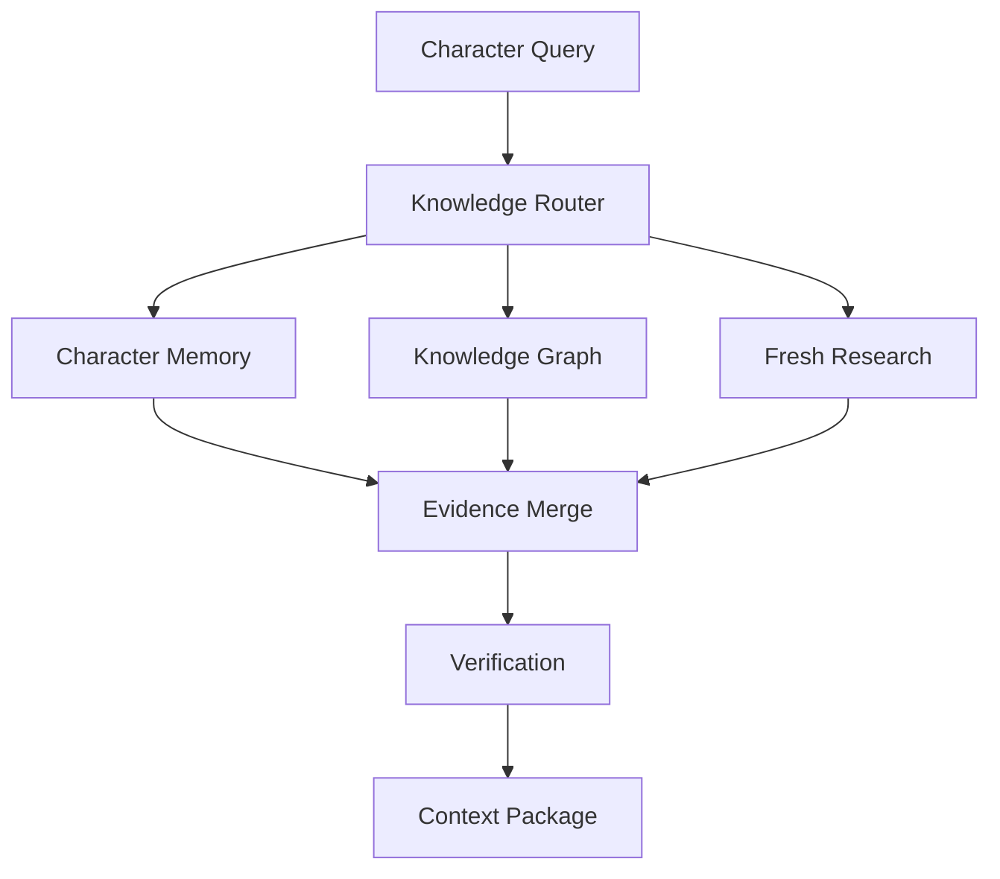
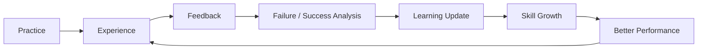
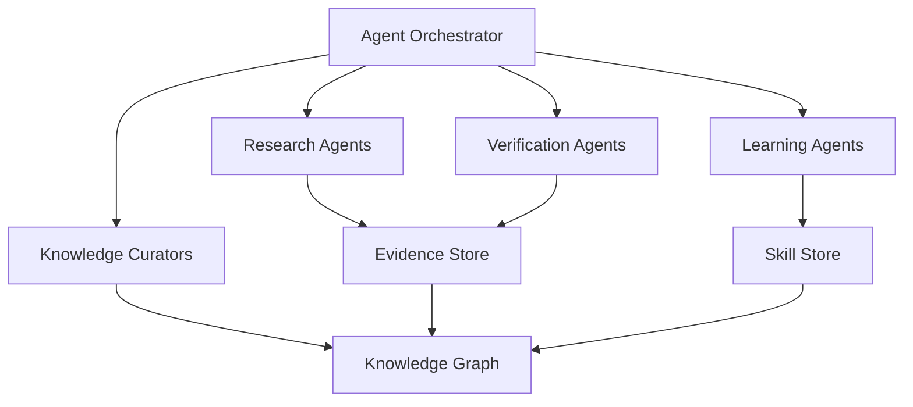
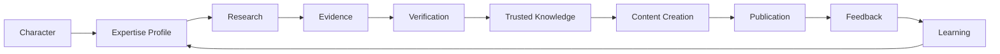

# OMNIS Knowledge and Expertise Engine Specification

> Version: 1.0.0  
> Status: Architecture Specification  
> Domain: Knowledge / Expertise / Research / Verification / Skill Growth / Learning

## 1. Purpose

The Knowledge and Expertise Engine gives each OMNIS Character a domain-specific knowledge model that can grow through research, experience, feedback and validated learning without turning every Character into an omniscient narrator.



## 2. Core Principle

Expertise is a bounded, evolving capability rather than a static prompt.

```text
DOMAIN SCOPE
+
KNOWLEDGE
+
SKILLS
+
EXPERIENCE
+
RESEARCH
+
VERIFICATION
+
LEARNING
=
EVOLVING EXPERTISE
```

## 3. Expertise Profile

Every Character has an explicit expertise profile.

```yaml
expertise:
  primary_domain: gaming
  level: advanced
  secondary_domains:
    - game_history
    - hardware
  confidence: 0.91
  boundaries:
    - medicine
    - law
```

## 4. Primary Domain

The primary domain defines where the Character is expected to demonstrate professional competence.

## 5. Secondary Domains

Secondary domains support richer content without claiming the same depth as the primary domain.

## 6. Knowledge Boundary

The Character must distinguish between what it knows, what it can research and what it does not know.

## 7. Expertise Levels

```text
novice
competent
intermediate
advanced
expert
specialist
```

## 8. Skill vs Knowledge

Knowledge represents information and concepts. Skill represents the ability to apply them.

## 9. Experience vs Knowledge

A Character may know a fact without having simulated personal experience with it.

## 10. Experience Claims

The system must not invent autobiographical experience merely because a Character is knowledgeable.

## 11. Character Perspective

When speaking from personal Character perspective, the runtime uses only experiences recorded in Character memory or explicitly defined fiction.

## 12. Knowledge Graph

Knowledge is represented as interconnected entities, concepts, events and relationships.



## 13. Knowledge Node

A knowledge node contains content, source provenance, confidence, timestamps and domain metadata.

## 14. Provenance

Every externally derived knowledge item should retain source provenance whenever technically and legally possible.

## 15. Source Types

```text
official documentation
academic paper
reputable journalism
industry publication
specialist database
community discussion
primary source
```

## 16. Source Reliability

Sources receive configurable reliability scores based on source type, recency, evidence and domain.

## 17. Source Diversity

High-impact claims should preferably be supported by more than one independent source.

## 18. Research Agent

Research Agents discover new information relevant to a Character's domain.

## 19. Research Scope

Research is constrained by Character domain, content objectives, freshness requirements and task priority.

## 20. Research Query Planning

The engine decomposes broad questions into searchable claims.

```text
QUESTION
   ↓
SUB-QUESTIONS
   ↓
CLAIMS
   ↓
SEARCH PLAN
   ↓
SOURCES
   ↓
EVIDENCE
```

## 21. Source Retrieval

The Research layer may use approved web, repository, database and document connectors.

## 22. Source Ranking

Retrieved sources are ranked by authority, relevance, freshness and evidentiary strength.

## 23. Evidence Extraction

Research agents extract claims and supporting passages rather than blindly copying source documents.

## 24. Claim Registry

Each important factual claim can be registered independently.

```yaml
claim:
  id: claim_001
  text: "..."
  confidence: 0.94
  sources:
    - source_01
    - source_07
  verified_at: 2026-08-17
```

## 25. Verification Engine

The Verification Engine checks factual claims before they enter trusted Character knowledge.

## 26. Verification Levels

```text
unverified
weakly_supported
supported
strongly_supported
verified
contradicted
```

## 27. Contradictions

Conflicting evidence is preserved rather than silently overwritten.

## 28. Conflict Resolution

The system evaluates source authority, evidence quality, date and context when resolving conflicts.

## 29. Historical Knowledge

Historical claims are time-indexed to avoid confusing past and current states.

## 30. Current Knowledge

Fast-changing topics receive explicit freshness requirements.

## 31. Knowledge Expiration

Time-sensitive knowledge may expire and require revalidation.

## 32. Refresh Policy

```text
stable fact → long refresh interval
industry trend → medium interval
breaking news → short interval
live data → near-real-time
```

## 33. Versioned Knowledge

Knowledge changes are versioned so content can be traced to the state available when it was produced.

## 34. Knowledge Snapshots

Production jobs use immutable knowledge snapshots for reproducibility.

## 35. Content Research

The Content Factory requests a task-specific knowledge package rather than querying the entire Character knowledge graph.

## 36. Knowledge Package

```text
facts
claims
sources
confidence
context
counterclaims
recent developments
open questions
```

## 37. Script Integration

Research results are transformed into structured facts and narrative material before script generation.

## 38. Fact / Opinion Separation

The system explicitly distinguishes factual claims from interpretation, opinion and Character perspective.

## 39. Uncertainty Language

Characters can communicate uncertainty naturally when evidence is incomplete.

## 40. Unknown State

The correct answer may be "I don't know" or "I need to check" when evidence is insufficient.

## 41. Hallucination Control

Knowledge retrieval must prefer verified evidence over unconstrained generation.

## 42. Retrieval Architecture



## 43. Character Memory Integration

Knowledge retrieval can be combined with autobiographical and episodic memory, but the two must remain semantically distinct.

## 44. Personal Experience Boundary

A Character can say it has played a game only when that experience exists in Character memory or is explicitly defined as fictional backstory.

## 45. Simulation Experience

Simulated practice sessions can generate experience records when the simulation actually executes the relevant task.

## 46. Skill Acquisition

Skills improve through deliberate practice, repeated tasks, feedback and successful application.

## 47. Skill Model

```yaml
skill:
  name: racing_game_analysis
  level: 0.76
  repetitions: 183
  recent_success: 0.84
  confidence: 0.79
  last_practiced: 2026-08-16
```

## 48. Learning Events

Learning events are stored as structured experiences.

## 49. Success Learning

Successful outcomes can strengthen a strategy when repeated evidence supports it.

## 50. Failure Learning

Failures become useful training signals rather than disappearing from memory.

## 51. Failure Analysis

The Learning Engine attempts to determine why a task failed before updating skill or strategy.

## 52. Strategy Evolution

A Character can develop preferred methods for recurring tasks.

## 53. Expertise Growth

Expertise grows from accumulated validated knowledge, practice and experience.



## 54. Skill Decay

Skills that are not practiced may decay according to configured models.

## 55. Knowledge Decay

Facts themselves are not assumed to disappear like skills; instead their relevance or freshness can decay.

## 56. Confidence Decay

Confidence may decrease when evidence becomes stale or contradictory.

## 57. Expertise Calibration

Self-assessed Character confidence is calibrated against observed performance and verification results.

## 58. Avoiding False Expertise

A Character's expertise score must not increase merely because it generated more text about a subject.

## 59. Evidence-Based Growth

Knowledge and skill updates require measurable evidence, practice or validated learning events.

## 60. Domain Transfer

Skills may transfer between related domains with a controlled transfer coefficient.

## 61. Cross-Domain Knowledge

A gaming Character may know enough history to explain a historical game context without becoming a historian.

## 62. Cross-Domain Confidence

Secondary-domain confidence remains lower unless supported by learning and evidence.

## 63. Research Depth

Research depth is selected based on content importance and risk.

## 64. Research Modes

```text
quick_check
standard_research
deep_research
continuous_monitoring
```

## 65. Breaking News

Breaking news requires stronger freshness checks and explicit timestamping.

## 66. Evergreen Content

Evergreen content may use stable knowledge snapshots with periodic refresh.

## 67. Trend Detection

Research agents monitor emerging topics relevant to each Character's niche.

## 68. Topic Opportunity

A knowledge discovery can become a candidate content opportunity when audience demand and strategic value are high.

## 69. Audience Feedback Integration

Audience requests can trigger research tasks.

## 70. Request-to-Knowledge Pipeline

```text
AUDIENCE REQUEST
      ↓
REQUEST CLASSIFIER
      ↓
RESEARCH TASK
      ↓
KNOWLEDGE PACKAGE
      ↓
CONTENT QUEUE
```

## 71. Source Governance

Only approved connector and retrieval mechanisms are used for external research.

## 72. Copyright Boundary

Research extracts facts and ideas while respecting source licensing and copyright constraints.

## 73. Citation Support

Content workflows may retain source references for internal verification and appropriate publication attribution.

## 74. Sensitive Topics

High-risk domains can require stronger verification and specialized review policies.

## 75. Professional Boundaries

Characters must not claim professional credentials that do not exist in their configured identity.

## 76. Medical / Legal / Financial Knowledge

If a Character discusses high-stakes domains, the system applies stronger verification and appropriate qualification boundaries.

## 77. Opinion Formation

Character opinions are derived from configured values, personality, experience and evidence rather than arbitrary random statements.

## 78. Belief Updating

Beliefs may change when sufficiently strong evidence and Character learning rules support an update.

## 79. Belief History

Major belief changes are recorded with evidence and timestamps.

## 80. Knowledge / Belief Separation

A Character can know a fact without personally agreeing with an interpretation of it.

## 81. Knowledge / Memory Separation

External knowledge and autobiographical memory use different provenance classes.

## 82. Agent Architecture



## 83. Agent Permissions

Research agents may discover evidence but cannot directly promote unverified claims into trusted knowledge.

## 84. Curator Role

Knowledge Curators merge, classify and version validated knowledge.

## 85. Learning Agent

Learning Agents update skill and strategy models based on structured experience.

## 86. Evaluation Agent

Evaluation Agents test Character expertise through benchmarks and task simulations.

## 87. Benchmarking

Each expert Character should have domain-specific evaluation suites.

## 88. Benchmark Types

```text
factual recall
reasoning
classification
comparison
recommendation
analysis
practical simulation
communication
```

## 89. Regression Tests

Knowledge and skill updates must not silently degrade previously validated capabilities.

## 90. Expertise Scorecard

```text
accuracy
reasoning quality
freshness
source quality
communication quality
practical performance
uncertainty calibration
```

## 91. Content Quality Feedback

Published content performance can identify knowledge gaps but cannot alone prove factual correctness.

## 92. Audience Corrections

Audience corrections are treated as signals requiring verification, not automatically accepted facts.

## 93. Community Knowledge

Community discussions can provide useful leads and practical experience while receiving lower default authority than primary sources where appropriate.

## 94. Continuous Learning

Characters can continuously learn from new verified information and structured experience.

## 95. Learning Safety

Continuous learning must not allow malicious or low-quality inputs to rewrite trusted identity or knowledge without validation.

## 96. Observability

Knowledge operations expose source, confidence, retrieval, verification and learning traces.

## 97. Metrics

```text
knowledge accuracy
source freshness
verification rate
research latency
research cost
skill growth
skill regression
uncertainty calibration
content correction rate
```

## 98. Production Contract

Every production requiring factual content should receive a versioned Knowledge Package containing relevant claims, evidence, confidence, freshness and known uncertainties.

## 99. Final Pipeline



## 100. Final Contract

The Knowledge and Expertise Engine MUST maintain bounded, source-aware, versioned and evolving expertise for every Character. It MUST distinguish knowledge from personal experience, fact from opinion, skill from information and confidence from certainty. It MUST support research, verification, learning, skill growth, regression testing, freshness management and integration with Character Memory, Audience Intelligence and the Content Factory.
