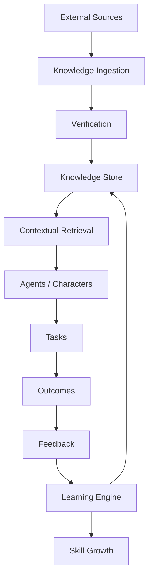
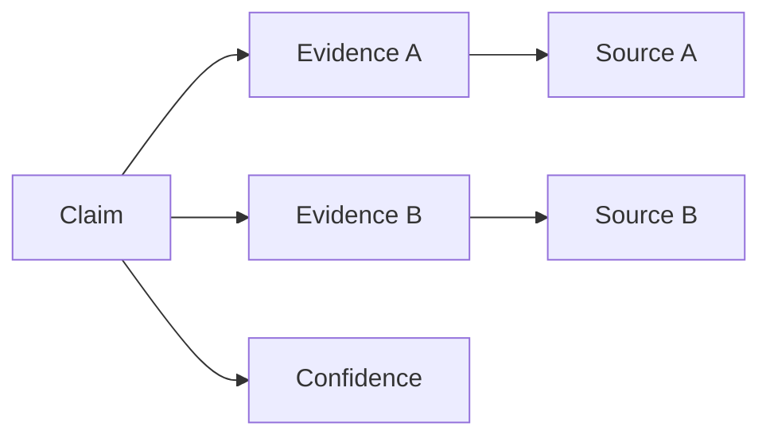
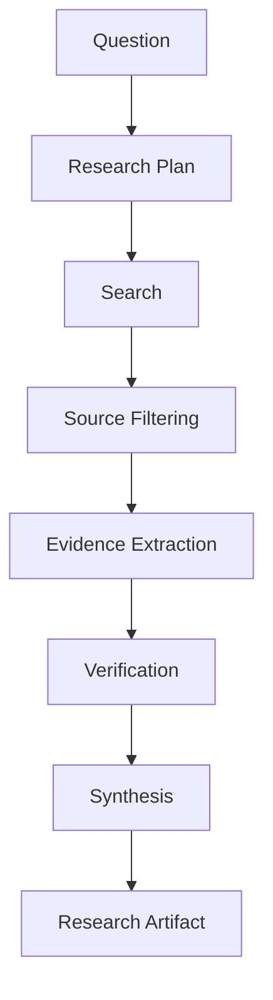
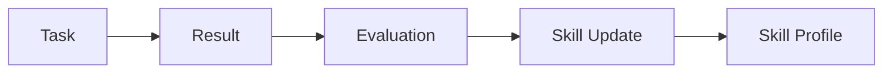
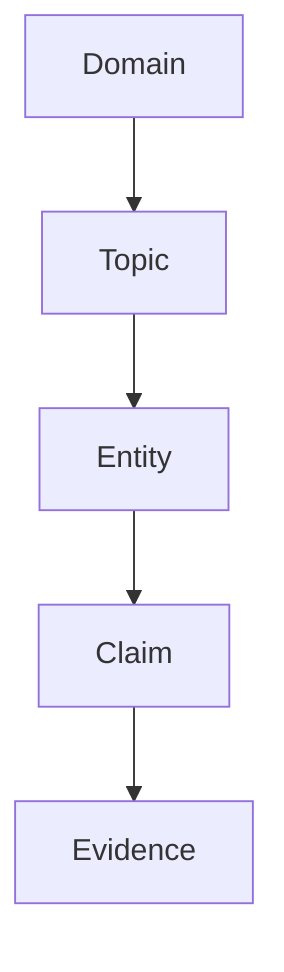
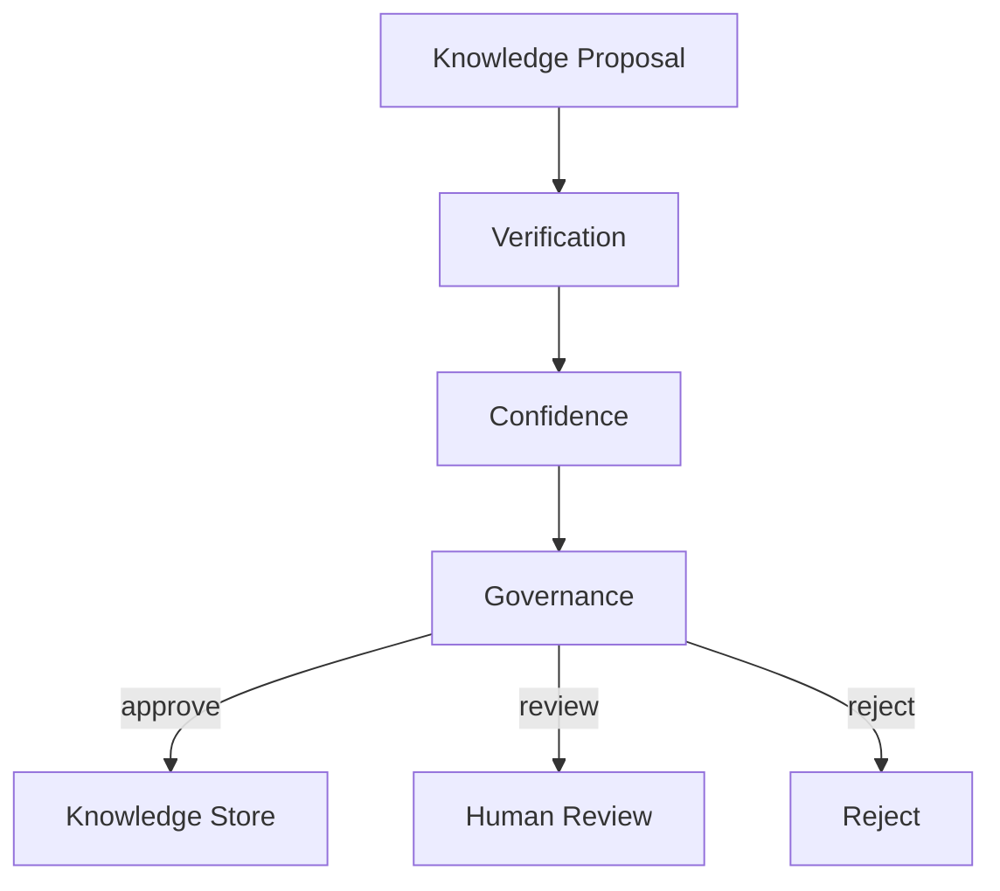
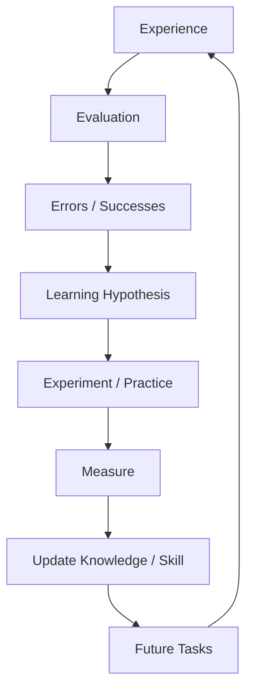

# OMNIS Knowledge & Learning Engine Specification

> Version: 1.0.0  
> Status: Architecture Specification  
> Domain: Knowledge / Research / Learning / Skill Growth / Evidence / Continuous Improvement

## 1. Purpose

The Knowledge & Learning Engine provides OMNIS Characters and Agents with current, domain-appropriate, evidence-aware knowledge and enables improvement through experience.

A Character must know enough to be highly competent in its specialization while retaining realistic knowledge boundaries. Learning must improve future performance without arbitrarily rewriting identity.



## 2. Core Principle

Knowledge, memory, skill and experience are different systems.

```text
Knowledge = what is known
Memory   = what was experienced/remembered
Skill    = what can be performed
Experience = evidence generated by action
```

## 3. Knowledge Domains

OMNIS supports:

```text
technology
science
history
gaming
cars
fashion
beauty
psychology
entertainment
business
culture
sports
news
platform knowledge
```

## 4. Character Knowledge Boundaries

A Character receives a domain profile rather than unrestricted global knowledge.

```text
Global Knowledge
      ↓ filtering
Domain Profile
      ↓
Character Knowledge
```

## 5. Primary Expertise

Each Character has primary expertise with higher expected competence.

```yaml
expertise:
  domain: gaming
  level: expert
  confidence: 0.91
```

## 6. Secondary Expertise

Secondary domains support richer conversations without making the Character universally expert.

## 7. Supporting Knowledge

Supporting knowledge enables contextual understanding.

Example:

```text
Gaming Character
→ game mechanics: expert
→ gaming culture: advanced
→ hardware: intermediate
→ history: contextual/basic
```

## 8. Knowledge Gaps

Explicit knowledge gaps are stored.

```yaml
gap:
  domain: medieval_history
  confidence: low
```

A knowledge gap is preferable to fabricated certainty.

## 9. Freshness Classes

Knowledge is classified by freshness requirement.

```text
static
slow-changing
current
real-time
```

## 10. Retrieval Requirement

Current or real-time claims require retrieval when configured by policy.

```text
question
 ↓
freshness classification
 ↓
retrieve if necessary
```

## 11. Source Types

Sources may include:

```text
official documentation
primary sources
academic papers
reputable journalism
trusted databases
web pages
community sources
GitHub repositories
Reddit discussions
```

Source reliability varies by domain.

## 12. Source Provenance

Every important knowledge item records provenance.

```yaml
source:
  url: ...
  publisher: ...
  observed_at: ...
  source_type: official
  confidence: 0.94
```

## 13. Evidence Levels

```text
verified
supported
probable
uncertain
unverified
contradicted
```

## 14. Evidence Graph



## 15. Claim Object

```yaml
claim:
  id: claim_001
  text: ...
  confidence: 0.87
  status: supported
  sources: []
```

## 16. Contradiction Detection

Conflicting sources are represented rather than silently merged.

```text
Claim
 ├── Evidence A → supports
 └── Evidence B → contradicts
```

## 17. Conflict Resolution

Resolution considers:

```text
source authority
recency
primary evidence
independent corroboration
methodology
```

## 18. Knowledge Versioning

Knowledge items are versioned.

```text
v1
 ↓ new evidence
v2
 ↓ correction
v3
```

## 19. Knowledge Expiration

Time-sensitive knowledge may expire.

```text
fresh
 ↓ time
stale
 ↓
refresh required
```

## 20. Research Tasks

Research Agents receive structured objectives.

```yaml
research_task:
  question: ...
  domain: ...
  freshness: current
  minimum_sources: 3
```

## 21. Research Planning



## 22. Search Diversity

Important claims should use multiple independent sources when practical.

## 23. Primary Source Preference

Primary sources receive preference for factual claims where available.

## 24. Source Ranking

Source ranking is domain-specific rather than globally fixed.

## 25. Citation Graph

Research artifacts preserve claim-to-source relationships.

## 26. Research Artifact

```yaml
research:
  question: ...
  claims: []
  sources: []
  uncertainties: []
  generated_at: ...
```

## 27. Knowledge Retrieval

Retrieval combines:

```text
semantic relevance
keyword relevance
recency
authority
Character relevance
task relevance
```

## 28. Context Assembly

```text
query
 ↓
retrieve
 ↓
rank
 ↓
compress
 ↓
context
```

## 29. Memory vs Knowledge

Character memories are not automatically authoritative facts.

```text
Memory: "I remember X"
Knowledge: "Evidence supports X"
```

## 30. Learning From Experience

Experience becomes learning evidence only after evaluation.

```text
action
 ↓
outcome
 ↓
evaluation
 ↓
lesson
```

## 31. Experience Record

```yaml
experience:
  task_id: task_001
  outcome: success
  quality: 0.84
  lessons: []
```

## 32. Skill Model

Skills have:

```text
level
confidence
practice count
success rate
recent performance
specialization
```

## 33. Skill Update



## 34. Skill Evidence

Skill improvement must be evidence-backed rather than based on arbitrary increments.

## 35. Learning Rate

Different skills may learn at different rates.

```text
new skill → faster improvement
advanced skill → slower refinement
```

## 36. Diminishing Returns

As expertise increases, improvements generally require more difficult practice.

## 37. Deliberate Practice

The system may generate targeted exercises for weak capabilities.

```text
weakness
 ↓
practice task
 ↓
feedback
 ↓
repeat
```

## 38. Error Taxonomy

Failures are classified.

```text
knowledge error
reasoning error
execution error
communication error
planning error
technical error
```

## 39. Error Learning

Repeated error classes trigger targeted remediation.

## 40. Success Pattern Mining

Successful workflows are analyzed for reusable strategies.

```text
success
 ↓
pattern extraction
 ↓
hypothesis
 ↓
future strategy
```

## 41. Strategy Confidence

Strategies have confidence based on evidence.

## 42. Experimentation

Learning may require controlled experiments.

```text
hypothesis
 ↓
experiment
 ↓
measurement
 ↓
update confidence
```

## 43. Exploration / Exploitation

OMNIS balances known successful strategies with new approaches.

## 44. Learning Policy

No experiment may bypass platform, safety, legal or business constraints.

## 45. Character Skill Growth

Character skill growth is connected to actual tasks performed by the Character.

```text
CONTENT
 ↓
CHARACTER PERFORMANCE
 ↓
AUDIENCE FEEDBACK
 ↓
EVALUATION
 ↓
SKILL UPDATE
```

## 46. Character Reflection

After meaningful work, a Character may receive a structured reflection artifact.

```yaml
reflection:
  what_worked: []
  what_failed: []
  next_time: []
```

## 47. Reflection Safety

Reflection cannot overwrite authoritative knowledge without verification.

## 48. Knowledge Correction

Corrections require evidence.

```text
correction proposal
 ↓
verification
 ↓
knowledge update
```

## 49. Audience Corrections

Audience corrections enter a verification queue rather than directly modifying knowledge.

## 50. Community Expertise

Repeated high-quality community contributions may increase research priority.

## 51. Knowledge Compression

Large knowledge collections are compressed into useful summaries while retaining source links.

## 52. Hierarchical Knowledge

```text
Domain
 ↓
Topic
 ↓
Subtopic
 ↓
Claim
 ↓
Evidence
```

## 53. Knowledge Graph

Entities and relationships are represented as a graph.



## 54. Entity Resolution

The system resolves aliases and duplicate entities.

## 55. Temporal Knowledge

Facts can have validity intervals.

```yaml
fact:
  valid_from: ...
  valid_until: ...
```

## 56. Historical State

The system can answer questions using knowledge valid at a specified historical date when evidence permits.

## 57. News Knowledge

News is treated as time-sensitive and source-dependent.

## 58. Trend Knowledge

Trend signals are separated from established facts.

```text
TREND ≠ FACT
```

## 59. Opinion Knowledge

Opinions are labeled as opinions and attributed to sources where appropriate.

## 60. Rumor Handling

Rumors are stored only as unverified claims when necessary and must not be presented as facts.

## 61. Knowledge Safety

High-risk domains require stricter verification and escalation rules.

## 62. Hallucination Control

The retrieval layer should prefer abstention over unsupported certainty.

```text
insufficient evidence
 ↓
uncertain / retrieve more / abstain
```

## 63. Confidence Calibration

Confidence scores should be calibrated against historical correctness.

## 64. Evaluation Dataset

Knowledge evaluation uses curated factual test sets.

## 65. Regression Testing

Knowledge updates must not silently break established high-confidence answers.

## 66. Model Evaluation

Different AI models can be benchmarked on domain-specific tasks.

## 67. Model Routing by Task

```text
simple extraction → efficient model
complex synthesis → reasoning model
visual research → vision model
voice task → audio model
```

## 68. Learning From Multiple Models

Models can provide independent proposals for difficult tasks.

## 69. Reviewer Model

A separate model or Agent may evaluate generated knowledge artifacts.

## 70. Human Review

Critical knowledge updates can require human approval.

## 71. Knowledge Governance



## 72. Source Change Monitoring

Important sources can be monitored for updates.

## 73. Documentation Monitoring

Technical Characters can refresh knowledge from official documentation and repositories.

## 74. GitHub Knowledge

Repositories may be analyzed for software, architecture and implementation knowledge while respecting repository permissions and licenses.

## 75. Community Knowledge

Reddit and similar communities can provide experience reports and emerging topics but are not automatically authoritative.

## 76. Knowledge Provenance UI

Human operators should be able to inspect why a knowledge item exists.

```text
Claim
 ↓
Evidence
 ↓
Sources
 ↓
Confidence
```

## 77. Learning Dashboard

Metrics include:

```text
skill growth
knowledge freshness
research accuracy
error rate
learning velocity
confidence calibration
```

## 78. Character Progression

Character expertise can evolve visibly in internal analytics.

## 79. Expertise Thresholds

```text
novice
competent
advanced
expert
specialist
```

These labels are internal abstractions unless exposed intentionally.

## 80. Expertise Verification

A Character should not become an expert solely because a model says so. Expertise requires accumulated evidence.

## 81. Cross-Domain Transfer

Knowledge from one domain can support another when relationships are justified.

## 82. Analogical Learning

Agents may use known concepts to generate hypotheses in unfamiliar areas, but hypotheses require verification.

## 83. Forgetting

Low-value knowledge can be deprioritized or archived to keep retrieval efficient.

## 84. Retrieval Decay

Stale knowledge receives lower retrieval priority when freshness matters.

## 85. Learning Cost

Learning workflows have compute and provider budgets.

## 86. Learning Queue

```text
Learning Tasks
 ↓
Priority Queue
 ↓
Scheduler
 ↓
Research / Practice / Evaluation
```

## 87. Priority Rules

Priority considers:

```text
business value
Character relevance
error severity
freshness
frequency
cost
```

## 88. Learning Checkpoints

Long learning workflows persist intermediate state.

## 89. Learning Rollback

Bad learning updates can be rolled back to a previous verified state.

## 90. Learning Isolation

Experimental knowledge should not immediately contaminate production knowledge.

```text
experimental
 ↓ validation
production
```

## 91. Canary Learning

New strategies may be tested on a limited subset of tasks before broad adoption.

## 92. Performance Attribution

Learning changes must be associated with subsequent outcomes.

```text
update X
 ↓
performance change
 ↓
attribution evidence
```

## 93. Learning Audit

Every significant learning update records:

```text
trigger
previous state
new state
evidence
confidence
approver
```

## 94. Skill and Knowledge Separation

A Character may know how something works without being skilled at doing it, and vice versa.

## 95. Meta-Learning

OMNIS may learn which learning strategies work best for different domains and Characters.

```text
Character A
→ practice works best

Character B
→ observation works best
```

## 96. Continuous Learning Loop



## 97. Testing

Required tests include:

```text
retrieval tests
citation tests
freshness tests
conflict tests
knowledge boundary tests
skill update tests
regression tests
calibration tests
rollback tests
load tests
```

## 98. Scale

The system MUST support large shared knowledge stores while maintaining Character-specific retrieval boundaries.

```text
Global Knowledge
      ↓
Shared Index
      ↓
Character / Agent Filters
      ↓
Task Context
```

## 99. Operational Contract

Knowledge updates are governed, versioned, observable and reversible.

## 100. Final Contract

The Knowledge & Learning Engine makes OMNIS capable of becoming better through evidence and experience rather than merely generating more text.

```text
RESEARCH
   ↓
KNOWLEDGE
   ↓
ACTION
   ↓
EXPERIENCE
   ↓
FEEDBACK
   ↓
LEARNING
   ↓
SKILL + KNOWLEDGE GROWTH
   ↓
BETTER FUTURE PERFORMANCE
```

The engine MUST preserve provenance, uncertainty, knowledge boundaries, rollback capability and Character identity while continuously improving the intelligence available to the OMNIS ecosystem.