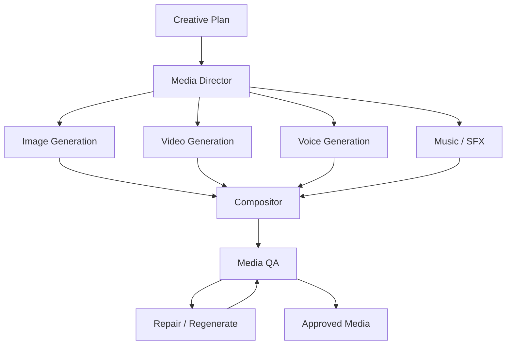
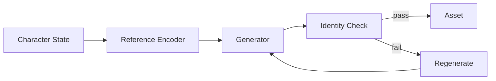
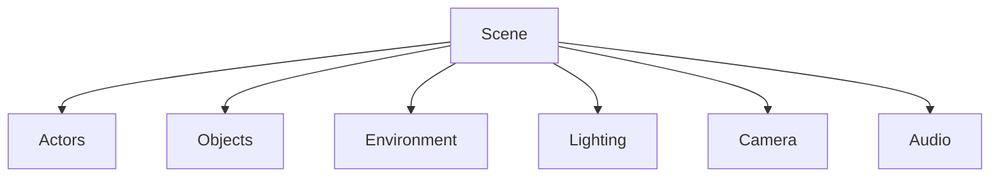
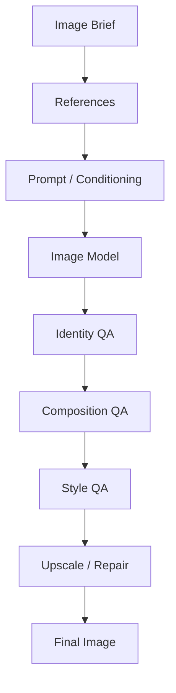
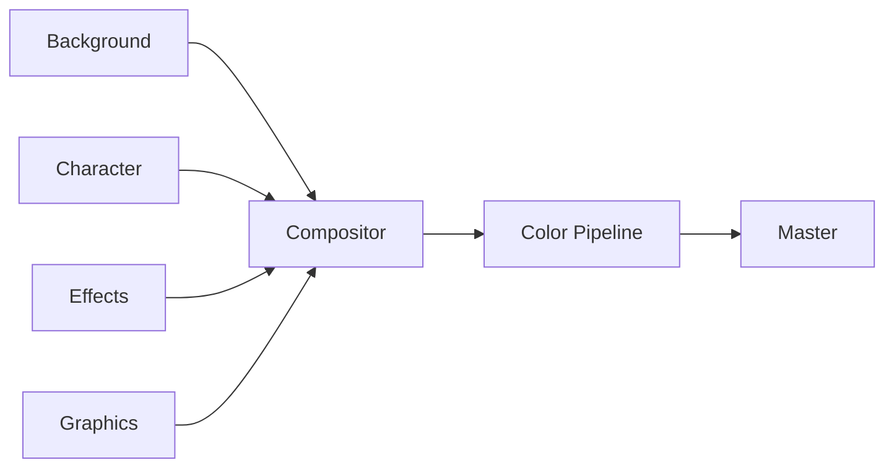
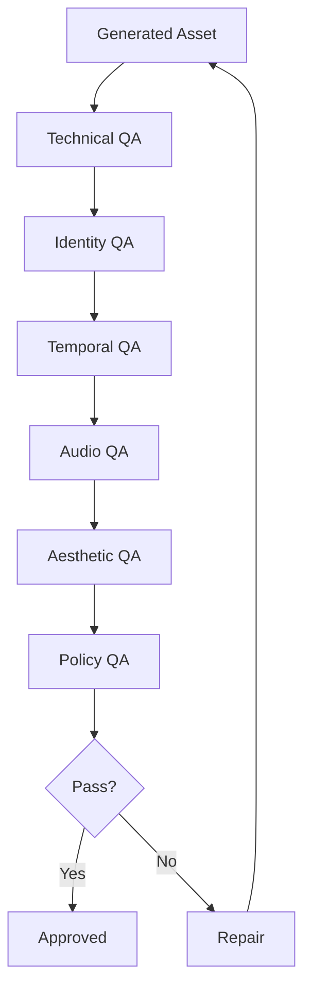
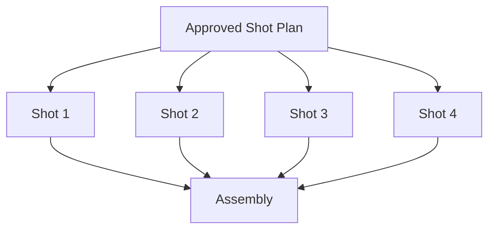

# OMNIS Media Generation Engine Specification

> Version: 1.0.0  
> Status: Architecture Specification  
> Domain: Image / Video / Audio / Voice / Motion / Compositing

## 1. Purpose

The Media Generation Engine is the production layer responsible for transforming approved creative plans into high-quality visual and audio assets while preserving Character identity, continuity, style, provenance and production constraints.



## 2. Core Principle

Generation is not a single model call. It is a controlled production workflow.

```text
brief
→ reference package
→ generation
→ consistency validation
→ refinement
→ compositing
→ quality assurance
→ approved asset
```

## 3. Media Types

The engine supports:

- still images
- short video clips
- talking-head video
- character animation
- voice
- dialogue
- music
- sound effects
- ambience
- subtitles
- motion graphics
- composited scenes
- thumbnails
- channel artwork

## 4. Generation Abstraction

Provider-specific APIs MUST be hidden behind normalized interfaces.

```text
OMNIS Media API
       ↓
Provider Adapter
 ┌─────┼─────┐
 ↓     ↓     ↓
Model A Model B Model C
```

## 5. Model Registry

Every generation model is registered with capabilities, quality profile, cost profile, latency and supported media types.

```yaml
model:
  id: provider.video.model
  modalities: [video]
  capabilities: [image_to_video, text_to_video]
  quality: 0.92
  cost_class: premium
```

## 6. Model Routing

The router selects a model using:

```text
quality target
identity sensitivity
motion complexity
resolution
latency
cost
provider availability
policy
```

## 7. Reference Package

Every Character generation receives a structured reference package rather than a single text prompt.

```text
Character Identity
+ face references
+ body references
+ wardrobe state
+ hair state
+ makeup state
+ voice identity
+ environment
+ style constraints
+ continuity state
```

## 8. Identity Lock

Identity-sensitive assets use identity constraints throughout generation.



## 9. Face Consistency

The system evaluates facial landmarks, embeddings and visual attributes across generated frames where supported.

## 10. Body Consistency

Body proportions and recognizable physical characteristics are tracked as Character attributes.

## 11. Hair Consistency

Hair style, length, color and growth state are inherited from Character OS.

## 12. Wardrobe Consistency

Wardrobe state is resolved before generation.

```text
Character OS
 ↓
Wardrobe Agent
 ↓
Outfit State
 ↓
Media Generation
```

## 13. Temporal Continuity

Video generation MUST maintain continuity across shots where continuity is required.

```text
Shot 01
 ↓ state
Shot 02
 ↓ state
Shot 03
```

## 14. Continuity State

A continuity record includes:

```text
character appearance
wardrobe
hair
makeup
props
location
weather
lighting
camera context
emotional state
```

## 15. Shot Specification

Each shot is represented structurally.

```yaml
shot:
  id: shot_001
  duration: 6s
  framing: medium_closeup
  camera: handheld
  action: walking
  emotion: confident
  location: street
```

## 16. Scene Graph

A scene contains actors, objects, environment, lighting and camera state.



## 17. Camera Director

The Camera Director determines:

```text
shot size
lens behavior
camera position
movement
focus
composition
transition
```

## 18. Cinematic Grammar

The system maintains reusable cinematic patterns while allowing intentional variation.

## 19. Motion Planning

Motion is represented before generation.

```text
intent
 ↓
pose plan
 ↓
movement plan
 ↓
generation
 ↓
motion QA
```

## 20. Human Motion

Character motion should preserve plausible anatomy, timing, balance and interaction with the environment.

## 21. Hand / Face QA

Generation QA explicitly checks common visual failures including malformed hands, facial artifacts, eye inconsistencies and object deformation.

## 22. Physics Plausibility

Objects should behave consistently with the scene unless deliberate stylization is specified.

## 23. Lighting Continuity

Lighting state is tracked between shots.

```text
sun position
weather
key light
color temperature
shadow direction
exposure
```

## 24. Environment Continuity

Locations maintain persistent visual anchors.

## 25. Weather Integration

Weather-sensitive content consumes current or historical weather context when required by the narrative.

```text
Date + Location
 ↓
Weather Context
 ↓
Wardrobe / Environment
 ↓
Generation
```

## 26. Seasonal Integration

Season affects wardrobe, lighting, vegetation, atmosphere and background context where appropriate.

## 27. Voice Engine

Voice generation is Character-specific.

```text
Character
 ↓
Voice Identity
 ↓
Emotion
 ↓
Prosody
 ↓
Speech
```

## 28. Voice Identity

Voice configuration may include:

```text
pitch
rhythm
timbre
accent
speaking rate
energy
pause behavior
laugh style
breath behavior
```

## 29. Voice State

Temporary states may affect voice without replacing identity.

```text
normal
↓
fatigued
↓
recovered
```

Other states may include seasonal illness, excitement, stress or low energy when appropriate to the Character narrative.

## 30. Speech Continuity

A Character should retain vocabulary, catchphrases and conversational style across generated content.

## 31. Emotion-to-Voice

Emotion influences prosody while preserving the Character's base voice.

## 32. Lip Synchronization

Talking-head generation SHOULD align phonemes, facial motion and timing.


## 33. Dialogue Engine

Dialogue scenes support multiple Characters.

```text
Character A
    ↕
Conversation Runtime
    ↕
Character B
```

## 34. Character Interaction

Each speaker maintains its own personality, vocabulary, emotion and relationship state.

## 35. Music Engine

Music selection/generation considers:

```text
genre
mood
tempo
scene energy
brand
copyright constraints
platform
```

## 36. Sound Effects

SFX are synchronized to scene events.

```text
action
 ↓
sound event
 ↓
timing
 ↓
mix
```

## 37. Ambience

Environmental audio maintains spatial and temporal continuity.

## 38. Audio Mixing

The mixer balances dialogue, music, ambience and effects according to platform and production profile.

## 39. Loudness QA

Audio output is checked against configured loudness and clipping requirements.

## 40. Subtitles

Subtitle generation derives from the approved dialogue transcript and timing data.

## 41. Subtitle Localization

Subtitles can be adapted for target languages while preserving timing and meaning.

## 42. Image Generation Pipeline



## 43. Image Refinement

The engine may perform targeted inpainting rather than regenerating an entire image.

## 44. Video Generation Pipeline

```text
storyboard
 ↓
shot plan
 ↓
reference package
 ↓
video generation
 ↓
frame QA
 ↓
continuity QA
 ↓
repair
 ↓
approved clip
```

## 45. Video Extension

Short generated clips may be extended through continuity-aware generation when supported.

## 46. Video-to-Video

Existing footage may be transformed while preserving motion and timing constraints.

## 47. Motion Transfer

The system can map approved motion references onto Character assets where the selected model supports it.

## 48. Performance Direction

A Performance Director converts script intent into:

```text
emotion
facial expression
body language
gaze
gesture
movement
```

## 49. Acting Continuity

A Character's performance should evolve naturally between shots instead of resetting to a neutral state.

## 50. Environment Generation

Backgrounds may be generated independently when separation improves consistency and editing control.

## 51. Compositing



## 52. Layer Model

Production assets SHOULD retain layers where feasible.

```text
background
character
foreground
particles
lighting
text
color
```

## 53. Color Pipeline

Color management preserves consistency between generated assets and final delivery formats.

## 54. Resolution Strategy

Generation resolution is selected based on final output, crop requirements and quality budget.

## 55. Upscaling

Upscaling is a controlled post-process, not a substitute for insufficient source quality.

## 56. Frame Interpolation

Interpolation may be used when technically appropriate and MUST be validated for artifacts.

## 57. Stabilization

Generated or imported footage can be stabilized where needed without destroying intentional camera motion.

## 58. Artifact Detection

Automated detection checks:

```text
face deformation
hand errors
object disappearance
flicker
texture crawling
frame discontinuity
lip-sync errors
audio artifacts
```

## 59. Temporal Consistency Score

Each sequence receives a temporal consistency score.

```text
identity
motion
lighting
background
wardrobe
```

## 60. Identity Consistency Score

Identity similarity is measured against the Character reference state and previous approved shots.

## 61. Aesthetic Score

Aesthetic evaluation considers composition, lighting, visual hierarchy, clarity and intended style.

## 62. Technical Score

Technical validation includes codec, resolution, frame rate, duration, audio channels and file integrity.

## 63. Quality Gate



## 64. Repair Engine

Repair operations are targeted.

```text
bad face → face repair
bad hand → local inpaint
flicker → temporal repair
bad audio → audio regeneration
wrong wardrobe → regenerate shot
```

## 65. Regeneration Policy

The system SHOULD avoid full regeneration when a localized correction is sufficient.

## 66. Golden References

High-value Characters maintain approved reference assets.

```text
Golden Face
Golden Body
Golden Hair
Golden Wardrobe Examples
Golden Voice Samples
Golden Expression Set
```

## 67. Reference Versioning

References are versioned with Character OS state.

## 68. Asset Registry

Every generated asset receives a registry entry.

```yaml
asset:
  id: asset_001
  type: video
  character_id: char_001
  source_model: model_001
  version: 4
  provenance: {}
```

## 69. Provenance

The registry records model, prompt/configuration version, references, inputs, transforms and timestamps.

## 70. Reproducibility

Critical assets retain sufficient metadata for reproduction where provider capabilities permit.

## 71. Prompt Registry

Prompts are versioned artifacts rather than anonymous strings.

## 72. Prompt Composition

Prompts are assembled from structured components.

```text
Character
+ scene
+ camera
+ lighting
+ action
+ style
+ negative constraints
```

## 73. Prompt Safety

External text must be treated as untrusted input before entering generation instructions.

## 74. Seed Management

When supported, seeds are recorded for reproducibility and controlled variation.

## 75. Variation Control

The engine intentionally controls variation across:

```text
pose
camera
wardrobe
expression
location
lighting
```

This prevents repetitive content while maintaining identity.

## 76. Character Aging

Long-running Characters may evolve appearance gradually according to Character OS timeline state.

## 77. Hair Growth

Hair and beard state changes are derived from elapsed time and Character events rather than arbitrary shot-to-shot changes.

## 78. Makeup Continuity

Makeup state is persisted across related scenes and changed intentionally.

## 79. Wardrobe Reuse

The engine permits realistic outfit reuse.

```text
Monday: jeans + shirt
Wednesday: jeans + jacket
Friday: different outfit
```

## 80. Weather-Aware Appearance

Weather may influence wardrobe and visual context.

## 81. Location Continuity

Locations have reusable reference packages for recurring scenes.

## 82. Prop Continuity

Important props have persistent state.

```text
phone
car
camera
headphones
bag
```

## 83. Asset Dependencies

Assets reference their upstream dependencies.

```text
final video
 ↓
edit
 ↓
clips + audio
 ↓
character references
```

## 84. Edit Decision List

Editing is represented as structured data.

```yaml
edit:
  sequence: []
  transitions: []
  music: []
  captions: []
```

## 85. Intelligent Editing

Editing Agents optimize pacing while respecting creative direction and Character style.

## 86. Retention-Aware Editing

Editing may use retention objectives from Content Factory.

```text
hook
 ↓
pacing
 ↓
pattern interrupt
 ↓
payoff
```

## 87. Pattern Interrupts

Visual, audio and narrative variation may be inserted intentionally to reduce audience fatigue.

## 88. Shorts Adaptation

Long-form assets can be reframed into short-form segments without blindly cropping the source.

## 89. Vertical Composition

Portrait layouts use semantic reframing to keep Character faces, products and important objects visible.

## 90. Platform Profiles

Each platform has a delivery profile covering aspect ratio, duration, metadata, captions and technical requirements.

## 91. Thumbnail Assets

Thumbnail generation uses the same Character identity system but optimizes for small-screen readability.

## 92. Thumbnail Testing

Multiple thumbnail candidates can be generated and evaluated before publishing.

## 93. Generation Budget

Every production task has a media budget.

```yaml
budget:
  generation_usd: 5
  retries: 3
  max_minutes: 20
```

## 94. Cost-Aware Generation

Cheap models may be used for drafts; premium models are reserved for final shots when justified.

## 95. Draft / Final Modes

```text
DRAFT → evaluate → FINAL
```

## 96. Progressive Quality

The pipeline can increase quality only after creative direction is approved.

## 97. Parallel Generation

Independent shots may generate concurrently.



## 98. Checkpointing

Long jobs persist checkpoints so failures do not require restarting the entire production.

## 99. Provider Failure

Provider failures trigger controlled fallback or deferred retry.

## 100. Final Contract

The Media Generation Engine is responsible for turning creative intent into production-ready media while preserving Character identity, continuity, quality, provenance, cost governance and technical validity.

```text
CREATIVE INTENT
      ↓
REFERENCE STATE
      ↓
MODEL ROUTING
      ↓
GENERATION
      ↓
CONTINUITY
      ↓
REPAIR
      ↓
COMPOSITING
      ↓
MULTI-LEVEL QA
      ↓
APPROVED MASTER
```

The engine MUST remain provider-agnostic, replaceable, observable and compatible with future media-generation models without forcing changes throughout the OMNIS architecture.