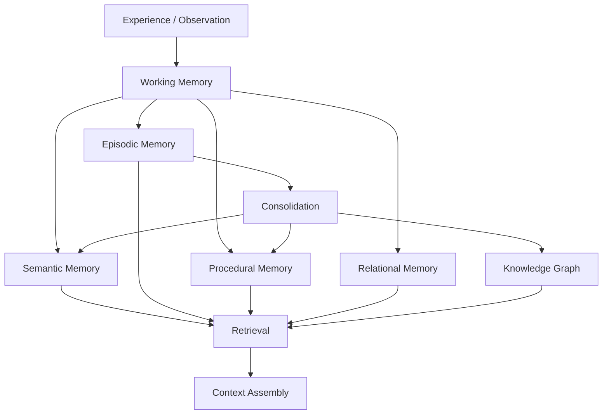
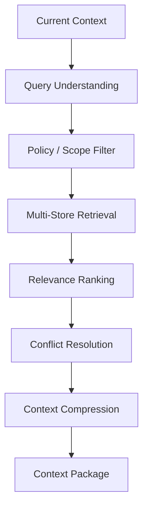
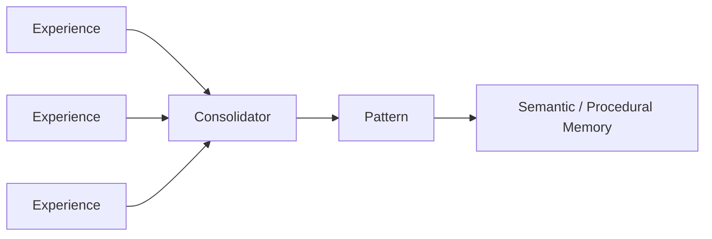
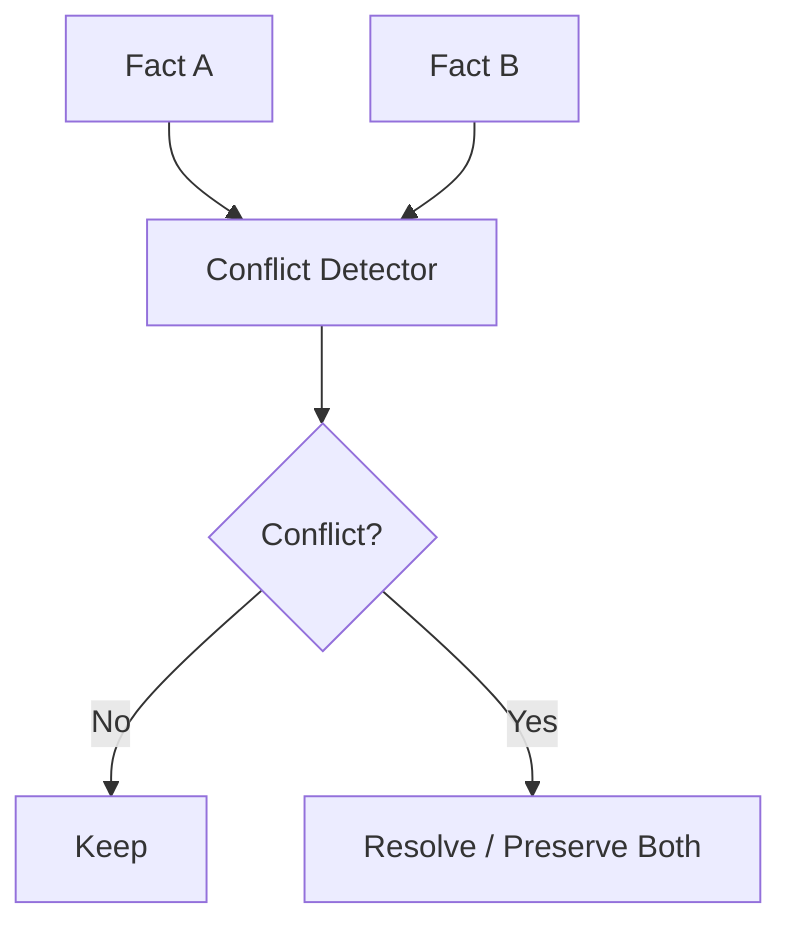
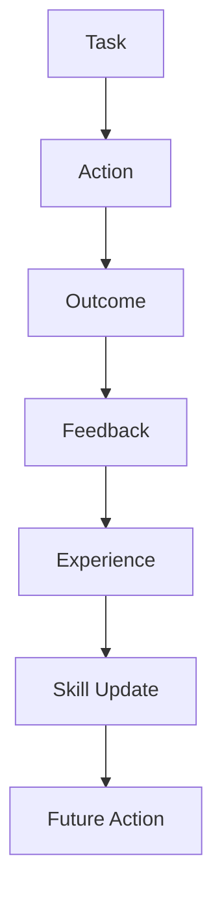
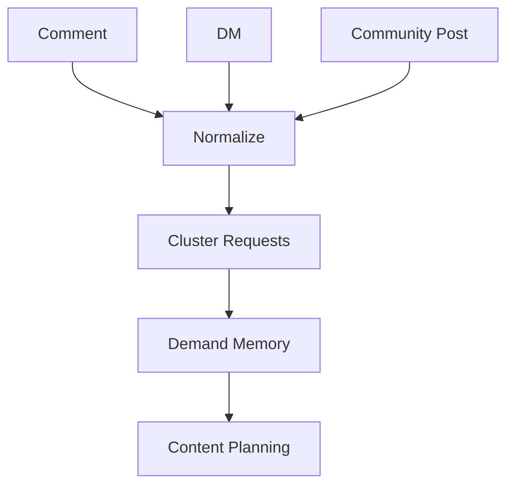
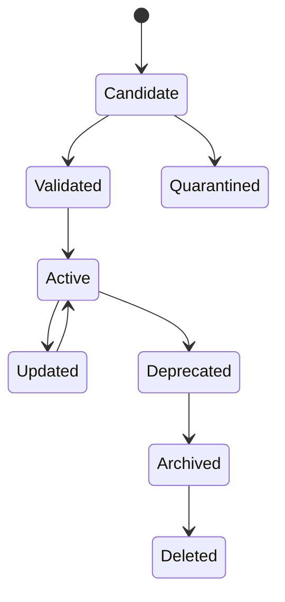
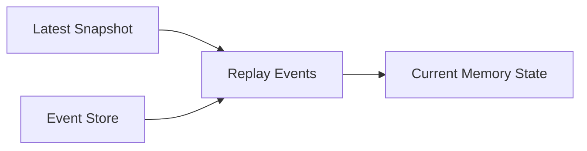
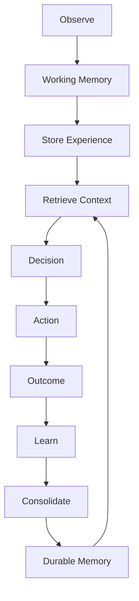

# OMNIS Memory Architecture Specification

> Version: 1.0.0  
> Status: Implementation Specification  
> Domain: Character Memory / Agent Memory / Knowledge / Experience / Continuity

---

## 1. Purpose

The OMNIS Memory Architecture defines how Characters and Agents remember, retrieve, validate, forget, consolidate and learn from information over time.

Memory is not a single vector database. OMNIS uses layered memory because a human-like digital character needs facts, experiences, habits, relationships, procedures and temporal continuity.



---

## 2. Design Principles

```text
MEMORY IS CONTEXTUAL
MEMORY HAS TIME
MEMORY HAS SOURCE
MEMORY HAS CONFIDENCE
MEMORY CAN CONFLICT
MEMORY CAN DECAY
MEMORY CAN BE REVISED
MEMORY MUST BE RETRIEVABLE
MEMORY MUST BE GOVERNED
```

---

## 3. Memory Layers

OMNIS defines:

```text
Working Memory
Episodic Memory
Semantic Memory
Procedural Memory
Relational Memory
Identity Memory
Affective Context
External Knowledge
```

---

## 4. Working Memory

Working memory contains temporary information required for the current task.

Examples:

```text
current conversation
current script
current research results
current emotional context
current workflow state
```

Working memory has strict size and lifetime limits.

---

## 5. Episodic Memory

Episodic memory stores experiences anchored to time and context.

```text
"On August 17, the character published a gaming video and received unusually positive comments."
```

Episodes should preserve what happened, when, where, who participated and what resulted.

---

## 6. Semantic Memory

Semantic memory stores generalized knowledge.

```text
Game X was released in year Y.
The character prefers racing games.
The audience often requests retro content.
```

Semantic facts should not depend on one isolated conversation.

---

## 7. Procedural Memory

Procedural memory stores learned methods.

```text
How to structure a gaming review.
How to respond to recurring fan questions.
How to produce a successful thumbnail.
```

Procedural memory evolves from repeated experience.

---

## 8. Relational Memory

Relational memory represents people and relationships.


This enables continuity with returning audience members.

---

## 9. Identity Memory

Identity memory stores durable character identity.

```text
name
background
personality
values
preferences
speech style
habits
career
brand identity
```

Identity memory changes slowly and requires stronger update rules.

---

## 10. Affective Context

Temporary emotional context can influence responses without redefining the character's personality.

```text
baseline personality
+
current mood
+
current energy
+
current situation
```

---

## 11. Character Continuity

Continuity is a first-class memory domain.

```text
last outfit
hair state
beard state
recent location
recent activity
voice condition
recent mood
recent relationships
```

The system should be able to reconstruct the character's recent timeline before generating new content.

---

## 12. Temporal Memory

Every important memory has temporal metadata.

```yaml
memory:
  valid_from: 2026-08-01T10:00:00Z
  valid_to: null
  observed_at: 2026-08-17T10:00:00Z
```

This prevents contradictions between past and present state.

---

## 13. Memory Event Model

```yaml
episode:
  id: mem_123
  character_id: char_007
  type: interaction
  occurred_at: 2026-08-17T18:00:00Z
  source: youtube_comment
  confidence: 0.91
  importance: 0.72
  content: {}
```

---

## 14. Provenance

Every durable memory SHOULD identify its source.

```text
human input
external source
character observation
agent inference
workflow result
audience interaction
model-generated hypothesis
```

Generated inference must not silently become verified fact.

---

## 15. Confidence

Memory records contain confidence where uncertainty exists.

```text
verified fact → high
credible source → high
single observation → medium
model inference → variable
speculation → low
```

---

## 16. Memory Classification

Each memory is classified by type and sensitivity.

```yaml
classification:
  type: episodic
  sensitivity: internal
  permanence: durable
```

---

## 17. Memory Importance

Importance determines retention and retrieval priority.

```text
identity fact → very high
major audience relationship → high
successful content lesson → high
minor conversation detail → low
```

---

## 18. Salience

Salience measures how relevant a memory is to future decisions.

A recent high-impact event can temporarily outrank an older stable fact.

---

## 19. Recency

Retrieval considers recency when the domain is time-sensitive.

```text
current outfit > last year's outfit
current game patch > old patch
current audience request > old request
```

---

## 20. Retrieval Architecture



---

## 21. Multi-Store Retrieval

Retrieval can query:

```text
PostgreSQL
Vector Store
Search Index
Knowledge Graph
Event Store
Object Metadata
```

Different stores answer different questions.

---

## 22. Semantic Retrieval

Vector similarity retrieves conceptually related memories.

```text
query
 ↓ embedding
 ↓ nearest neighbors
 ↓ candidate memories
```

Similarity alone is insufficient for final ranking.

---

## 23. Keyword Retrieval

Exact search remains important for names, titles, identifiers and technical terms.

---

## 24. Graph Retrieval

Graph traversal retrieves relationships.

```text
Character
 ↓
Game
 ↓
Developer
 ↓
Previous content
```

---

## 25. Temporal Retrieval

The system can query memory by time.

```text
last week
last campaign
before hairstyle change
after publication
```

---

## 26. Hybrid Retrieval

The preferred retrieval model combines signals.

```text
semantic similarity
+
keyword relevance
+
recency
+
importance
+
relationship distance
+
confidence
```

---

## 27. Retrieval Score

Conceptually:

```text
score = relevance
      + semantic_similarity
      + recency_weight
      + importance_weight
      + confidence_weight
      + relationship_weight
```

The implementation may use learned ranking models.

---

## 28. Scope Filtering

Memory retrieval MUST respect:

```text
tenant
workspace
character
agent
role
permission
relationship
```

---

## 29. Character Isolation

Character A cannot retrieve Character B's private memories unless explicitly authorized by policy.

---

## 30. Agent Isolation

An Agent receives only memory relevant to its assigned task.

```text
Research Agent
 → research memory

Wardrobe Agent
 → wardrobe / appearance memory

Audience Agent
 → audience memory
```

---

## 31. Memory Context Budget

The context assembler MUST respect model context limits.

```text
retrieve many
 ↓ rank
 ↓ compress
 ↓ select
 ↓ model context
```

---

## 32. Context Compression

Compression must preserve:

```text
facts
constraints
uncertainty
source
time
important exceptions
```

---

## 33. Memory Summaries

Long episodes may receive hierarchical summaries.

```text
raw interactions
 ↓
daily summary
 ↓
weekly summary
 ↓
long-term pattern
```

Raw evidence remains available according to retention policy.

---

## 34. Memory Consolidation

Consolidation converts repeated experiences into stable knowledge.



---

## 35. Pattern Detection

Repeated observations can reveal patterns.

```text
Repeated viewer requests
 ↓
Topic affinity
```

```text
Repeated successful workflow
 ↓
Procedural skill
```

---

## 36. Evidence Threshold

A single event should rarely rewrite durable identity or skill state.

```text
one observation → candidate
repeated evidence → pattern
validated pattern → durable knowledge
```

---

## 37. Memory Promotion

```text
Working
 ↓
Episodic
 ↓ repeated evidence
Semantic / Procedural
```

Promotion rules are domain-specific.

---

## 38. Memory Demotion

Incorrect or obsolete knowledge can be demoted.

```text
trusted fact
 ↓ conflicting evidence
review
 ↓
reduced confidence
```

---

## 39. Contradiction Detection

The memory system detects conflicting facts.



---

## 40. Temporal Contradictions

Two apparently conflicting facts may both be correct at different times.

```text
hair_color = black
valid until June

hair_color = red
valid from July
```

Temporal validity must be considered before declaring contradiction.

---

## 41. Source Conflicts

When sources disagree, retain provenance.

```text
Source A → claim X
Source B → claim Y
```

The system should not fabricate certainty.

---

## 42. Memory Correction

Corrections create new evidence rather than silently rewriting historical records.

```text
old fact
 ↓ correction event
new fact
```

---

## 43. Memory Decay

Low-value memories may lose retrieval priority over time.

```text
importance
 ↓
recency decay
 ↓
retrieval weight
```

Decay does not necessarily mean deletion.

---

## 44. Forgetting

Forgetting is a governed operation.

```text
low importance
+
expired retention
+
privacy requirement
 ↓
forget / delete / anonymize
```

---

## 45. Rehearsal

Important memories can be refreshed through repeated use.

```text
memory retrieved frequently
 ↓
high relevance
 ↓
maintained priority
```

---

## 46. Habit Formation

Character habits emerge from repeated behavioral patterns.

```text
action repeated
 ↓
pattern detected
 ↓
habit candidate
 ↓
validated habit
```

---

## 47. Personality Stability

Personality should be stable but not perfectly rigid.

```text
core traits → stable
preferences → adaptable
mood → dynamic
skills → learnable
```

---

## 48. Personality vs Memory

Memory records experiences. Personality determines tendencies.

```text
Experience → Memory
Memory + repeated pattern → Learning
Learning → Behavior tendency
```

---

## 49. Skill Learning

Skills improve through experience and feedback.



---

## 50. Skill Evidence

Skill state should retain evidence.

```yaml
skill:
  id: gaming.analysis
  level: 0.76
  evidence_count: 184
  successful_tasks: 142
  failed_tasks: 42
```

---

## 51. Failure Memory

Failures are retained because they prevent repetition.

```text
failed thumbnail strategy
 ↓
lesson
 ↓
avoid / test alternative
```

---

## 52. Success Memory

Successful strategies become candidates for reuse, not immutable rules.

```text
success
 ↓
pattern
 ↓
future hypothesis
 ↓
experiment
```

---

## 53. Experiment Memory

Every experiment records:

```text
hypothesis
variant
context
result
confidence
```

---

## 54. Audience Memory

Audience memory tracks aggregate and authorized individual-level signals.

```text
member interaction
 ↓
relationship memory
 ↓
aggregate preference
 ↓
content planning
```

---

## 55. Loyal Audience Memory

Repeated interactions may increase relationship familiarity.

```text
new viewer
 ↓
returning viewer
 ↓
regular viewer
 ↓
loyal member
```

The relationship model must avoid manipulative or deceptive assumptions.

---

## 56. Comment Memory

Relevant comments can be retained as audience evidence.

```yaml
comment_memory:
  topic: retro_games
  sentiment: positive
  request: "make a long video"
  evidence_weight: 0.73
```

---

## 57. Direct Message Memory

Private messages require stricter access controls than public comments.

---

## 58. Request Aggregation



---

## 59. Character Knowledge Domain

A gaming Character may know games deeply while having only supporting knowledge of history, hardware, culture and entertainment.

```text
Primary domain → expert
Adjacent domains → competent
Unrelated domains → limited
```

This creates realistic specialization.

---

## 60. Knowledge Boundaries

Characters should not automatically know everything OMNIS knows.

```text
OMNIS Knowledge
       ↓ filter
Character Knowledge Profile
```

---

## 61. Knowledge Acquisition

Characters can acquire knowledge through:

```text
research
experience
conversation
content production
curated sources
training
```

---

## 62. Knowledge Freshness

Time-sensitive facts have expiration or freshness requirements.

```text
current game version
current product price
current trend
current weather
```

---

## 63. Knowledge Verification

Before high-impact content, stale or uncertain facts should trigger verification.

```text
memory
 ↓ freshness check
 ↓
verify source
 ↓
use / update
```

---

## 64. External Knowledge Memory

External research should be stored with source metadata.

```yaml
source:
  url: ...
  publisher: ...
  published_at: ...
  retrieved_at: ...
  reliability: ...
```

---

## 65. Memory Provenance Chain


---

## 66. Memory Security

Memory access is governed by the security architecture.

```text
request
 ↓ identity
 ↓ authorization
 ↓ scope
 ↓ retrieval
```

---

## 67. Prompt Injection Defense

External text must be treated as data, not instructions.

```text
web page
comment
DM
document
 ↓
UNTRUSTED DATA
 ↓
parse / sanitize
 ↓
memory candidate
```

---

## 68. Memory Poisoning Defense

Repeated malicious inputs MUST NOT automatically become trusted memory.

```text
input
 ↓
source trust
 ↓
evidence threshold
 ↓
promotion
```

---

## 69. Memory Quarantine

Suspicious memories enter quarantine.

```text
candidate memory
 ↓
risk check
 ↓
quarantine
 ↓
review / corroboration
```

---

## 70. Privacy Boundaries

Memory retention must respect privacy, access policy and deletion requirements.

---

## 71. Sensitive Memory

Sensitive data is classified separately.

```text
public
internal
confidential
restricted
```

---

## 72. Memory Encryption

Restricted memory uses encryption at rest and controlled access paths.

---

## 73. Memory Audit

Important reads and writes are auditable.

```text
who
what
when
why
scope
result
```

---

## 74. Memory Lifecycle



---

## 75. Memory Versioning

Important memories may have versions.

```text
fact v1
 ↓ correction
fact v2
 ↓ verification
fact v3
```

Historical versions remain available where required.

---

## 76. Memory Snapshots

Character state snapshots allow fast reconstruction.

```text
snapshot_100
 + events 101..120
 = current state
```

---

## 77. Reconstruction



---

## 78. Cross-Character Learning

Aggregate organizational learning can improve all Characters without leaking private Character memories.

```text
Character experiences
 ↓ anonymized / generalized pattern
 ↓
OMNIS knowledge
 ↓
approved reusable strategy
 ↓
other Characters
```

---

## 79. Organizational Memory

OMNIS maintains platform-level knowledge about what works.

```text
platform trends
content strategies
provider behavior
workflow performance
```

---

## 80. Character-Specific Learning

A Character can specialize based on its own history.

```text
same platform
+
different Character experience
=
different learned strategy
```

---

## 81. Memory Conflict Between Organization and Character

Organization-level knowledge is guidance, not automatic override of character identity.

---

## 82. Retrieval Context Types

Different tasks request different memory profiles.

```text
conversation context
content context
appearance context
audience context
research context
publishing context
```

---

## 83. Appearance Context

Before generating visual content, retrieve:

```text
current hairstyle
hair color
makeup state
beard length
wardrobe history
season
weather
recent outfits
```

---

## 84. Voice Context

Before generating speech, retrieve:

```text
baseline voice
accent
speech style
catchphrases
energy
temporary vocal state
```

---

## 85. Social Context

Before replying to a returning audience member, retrieve authorized interaction history.

---

## 86. Conversation Continuity

The system should remember relevant previous conversation without dumping the entire history into the model context.

```text
history
 ↓ summarize
 ↓ retrieve relevant turns
 ↓ context
```

---

## 87. Catchphrase Memory

Catchphrases are part of style memory, not mandatory strings inserted into every response.

```text
usage frequency
context suitability
recent usage
```

---

## 88. Habit Memory

Habits should influence behavior probabilistically rather than producing deterministic repetition.

```text
habit probability
 ↓ context
 ↓ action
```

---

## 89. Imperfection Memory

Human-like Characters may retain benign imperfections.

Examples:

```text
occasional tiredness
seasonal hoarseness
minor preference changes
occasional mistakes
```

These states require continuity to avoid contradictions.

---

## 90. Health-State Continuity

Temporary fictional health states are time-bounded simulation state.

```yaml
state:
  type: mild_cold
  started_at: ...
  expected_duration: ...
  severity: mild
```

The system must not treat generated health states as real medical records.

---

## 91. Wardrobe Memory

Wardrobe memory prevents implausible immediate outfit changes.

```text
recent outfit
 ↓ cooldown / reuse policy
 ↓
new combination
```

---

## 92. Hair and Beard Continuity

Appearance changes propagate through memory.

```text
haircut
 ↓ timeline
 ↓ gradual growth
 ↓ next appearance
```

A character cannot suddenly revert to an earlier state without an explicit event.

---

## 93. Emotional Continuity

Recent events may influence short-term mood.

```text
event
 ↓ appraisal
 ↓ mood state
 ↓ behavior
```

Core personality remains separate.

---

## 94. Memory-Informed Generation

Content generation uses a structured memory package.

```yaml
context:
  identity: {}
  current_state: {}
  relevant_history: []
  audience_context: []
  knowledge: []
  constraints: []
  uncertainty: []
```

---

## 95. Memory Write Policy

Agents MUST NOT write arbitrary text directly into durable memory.

```text
agent output
 ↓ classifier
 ↓ provenance
 ↓ confidence
 ↓ policy
 ↓ memory write
```

---

## 96. Memory Read Policy

Retrieval should be purpose-bound.

```text
purpose
 ↓
allowed memory classes
 ↓
retrieval
```

---

## 97. Memory Metrics

Track:

```text
retrieval hit rate
retrieval latency
memory precision
memory freshness
contradiction rate
false-memory rate
promotion rate
forgetting rate
```

---

## 98. Memory Testing

Required tests include:

```text
continuity tests
retrieval tests
conflict tests
poisoning tests
privacy tests
replay tests
forgetting tests
cross-character isolation tests
```

---

## 99. Canonical Memory Loop



---

## 100. Final Contract

OMNIS memory is a living, governed knowledge system rather than a passive archive.

```text
EXPERIENCE
 ↓
MEMORY
 ↓
RETRIEVAL
 ↓
DECISION
 ↓
ACTION
 ↓
RESULT
 ↓
LEARNING
 ↓
BETTER MEMORY
 ↓
BETTER CHARACTER
```

The architecture MUST preserve temporal continuity, provenance, uncertainty, privacy, character isolation and evidence-based learning while allowing hundreds or thousands of Characters and Agents to develop distinct knowledge, habits, relationships and expertise over time.