# OMNIS Memory Mesh Specification

> Version: 1.0.0  
> Status: Implementation Specification  
> Domain: Memory / Identity / Continuity / Learning  
> Purpose: Define the distributed memory architecture that gives OMNIS persistent, contextual, time-aware and auditable memory across Agents, characters, audiences, workflows and content.

---

## 1. Purpose

The Memory Mesh is the persistent cognitive substrate of OMNIS. It allows the system to remember what happened, what matters, what was learned, who said it, when it happened, how reliable it is, and which future decisions should be influenced by it.

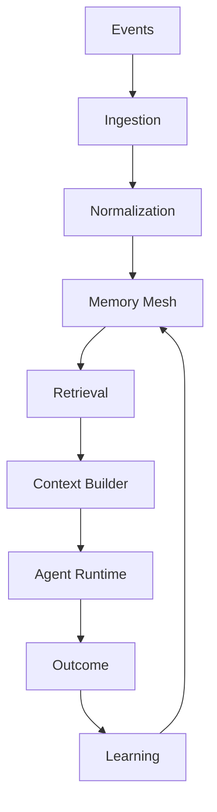

Memory is not a single vector database. It is a governed collection of complementary memory types.

---

## 2. Core Principle

OMNIS memory follows:

```text
EXPERIENCE
 ↓
ENCODE
 ↓
STORE
 ↓
INDEX
 ↓
RETRIEVE
 ↓
USE
 ↓
EVALUATE
 ↓
CONSOLIDATE
 ↓
FORGET / ARCHIVE / UPDATE
```

Memory must evolve with experience without silently rewriting history.

---

## 3. Memory Goals

The Memory Mesh MUST support:

- short-term working context;
- episodic memory;
- semantic knowledge;
- procedural knowledge;
- character identity;
- personality traits;
- preferences;
- relationship history;
- audience memory;
- content history;
- environmental context;
- experience records;
- skill progression;
- temporal continuity;
- provenance;
- confidence;
- contradiction handling;
- decay and forgetting;
- archival;
- retrieval policies.

---

## 4. Memory Is Not Truth

A memory is an observation or derived representation, not automatically ground truth.

```text
Memory
├── source
├── timestamp
├── confidence
├── provenance
├── interpretation
└── status
```

This distinction is essential when information changes.

---

## 5. Memory Taxonomy

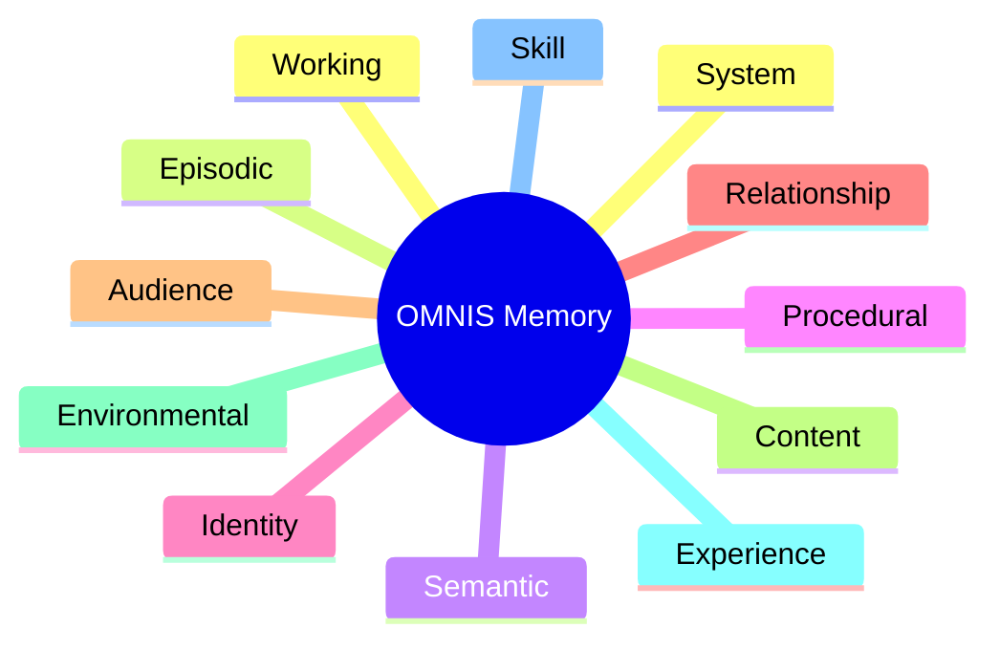

Each class has different retention and retrieval rules.

---

## 6. Working Memory

Working memory contains context required for the current execution.

```yaml
working_memory:
  task_id: task_123
  active_goal: "Create gaming review"
  recent_context: []
  constraints: []
  active_entities: []
```

Working memory is short-lived and aggressively scoped.

---

## 7. Episodic Memory

Episodic memory records events.

Examples:

```text
Character published video X
Character received criticism Y
Character played game Z
Audience member requested topic A
Campaign achieved result B
```

Events retain temporal order.

---

## 8. Semantic Memory

Semantic memory stores generalized knowledge.

```text
Fact
Concept
Entity
Relationship
Definition
Domain knowledge
```

Semantic memory may be derived from many episodes.

---

## 9. Procedural Memory

Procedural memory stores learned ways of doing things.

```text
How this character writes introductions
How a channel packages thumbnails
How a research Agent validates sources
How a creator responds to criticism
```

Procedural memories are candidate skills and must be evaluated before promotion.

---

## 10. Identity Memory

Identity memory defines persistent character properties.

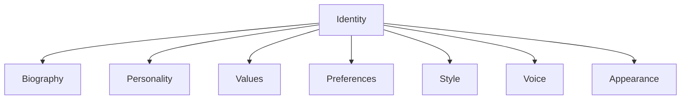

Identity changes must be explicit and temporally bounded.

---

## 11. Character Identity

A virtual influencer MUST have a stable identity model.

```yaml
character:
  id: char_001
  identity_version: 12
  traits:
    confidence: 0.82
    curiosity: 0.91
    humor: 0.76
  style:
    tone: energetic
    vocabulary: gen_z
```

The model is not a static prompt.

---

## 12. Personality Memory

Personality consists of relatively stable traits plus contextual states.

```text
Trait
 ↓
Disposition
 ↓
Current mood
 ↓
Behavior
```

Stable traits should not change because of one isolated event.

---

## 13. Habit Memory

Habits are repeated behavioral patterns.

```text
Repeated action
 ↓
Pattern detection
 ↓
Habit candidate
 ↓
Validation
 ↓
Habit memory
```

Habits can strengthen or weaken over time.

---

## 14. Quirks

Characters may have harmless quirks that improve realism.

Examples:

```text
favorite phrase
favorite snack
habitual greeting
specific reaction to failure
preferred editing style
```

Quirks must remain consistent without becoming repetitive.

---

## 15. Relationship Memory

Relationship memory records interactions between entities.

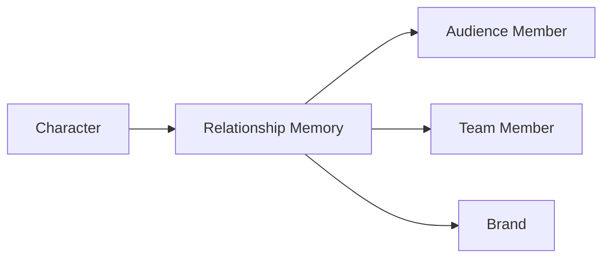

Relationships have history, strength and context.

---

## 16. Audience Memory

Audience memory stores aggregate and permitted individual-level interaction history.

```text
member request
 ↓
interaction
 ↓
preference signal
 ↓
relationship state
```

Privacy and authorization rules always apply.

---

## 17. Loyal Audience Members

The system may identify loyal members through permitted signals such as:

```text
repeat engagement
meaningful participation
support history
topic preferences
constructive feedback
```

Loyalty must never be inferred from protected or prohibited characteristics.

---

## 18. Audience Requests

Requests can become memories and production signals.

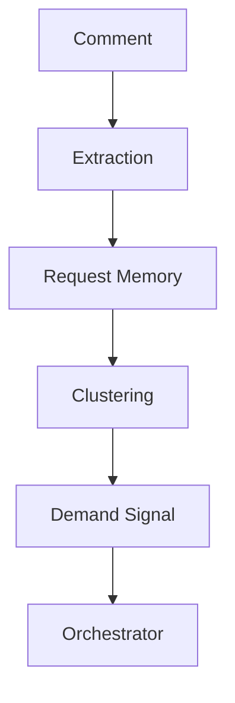

The original request remains traceable.

---

## 19. Content Memory

Content memory records the lifecycle of generated content.

```text
idea
research
script
assets
generation
edit
publish
performance
feedback
```

---

## 20. Content Continuity

A character should remember relevant previous content.

```text
Episode 1 → jacket A
Episode 2 → jacket B
Episode 3 → jacket A again
```

Reusing clothing is valid when temporally and stylistically plausible.

---

## 21. Appearance Memory

Appearance state includes:

```text
hair color
hair style
beard length
makeup
skin presentation
accessories
wardrobe
body presentation
```

Changes are events, not prompt decorations.

---

## 22. Hair Continuity

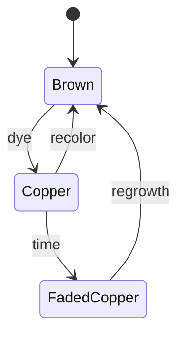

The generator MUST query the current state before rendering.

---

## 23. Beard Continuity

Beard length can be modeled as a temporal state.

```text
shave event
 ↓
0 mm
 ↓ days pass
stubble
 ↓ days pass
short beard
```

A future image cannot arbitrarily jump backward without a recorded grooming event.

---

## 24. Wardrobe Memory

Wardrobe memory records clothing items individually.

```yaml
item:
  id: jacket_black_01
  type: jacket
  first_seen: 2026-08-01
  last_seen: 2026-08-15
  wear_count: 4
```

This allows realistic reuse.

---

## 25. Outfit Memory

An outfit is a composition of items.

```text
jacket + shirt + trousers + shoes
```

The same item may appear in different combinations.

---

## 26. Seasonal Memory

Environmental memory can influence appearance.

```text
season
weather
temperature
location
event
```

This is retrieved during content planning.

---

## 27. Health-State Memory

Characters may have non-sensitive fictional state variables relevant to continuity.

Examples:

```text
voice roughness
energy level
fatigue
temporary cold
recovery status
```

These states must be treated as fictional character state rather than real-person medical records.

---

## 28. Voice Continuity

Voice state may vary gradually.


A temporary state should affect adjacent content where appropriate.

---

## 29. Mood Memory

Mood has a short temporal half-life.

```text
stable personality
      ↓
current mood
      ↓
current behavior
```

A mood event should not permanently redefine personality.

---

## 30. Memory Strength

Each memory has a strength score.

Conceptually:

```text
strength =
f(recency, repetition, importance, emotional_salience, outcome)
```

Exact weighting is configurable.

---

## 31. Recency

Recent memories normally receive higher retrieval priority.

```text
Today       ██████████
Last week   ███████
Last month  ████
Last year   ██
```

Recency MUST NOT override critical identity facts.

---

## 32. Importance

Importance can be explicit or inferred.

```text
identity change → very high
major audience event → high
routine interaction → low
```

Importance affects retention and retrieval.

---

## 33. Repetition

Repeated experiences strengthen candidate memories.

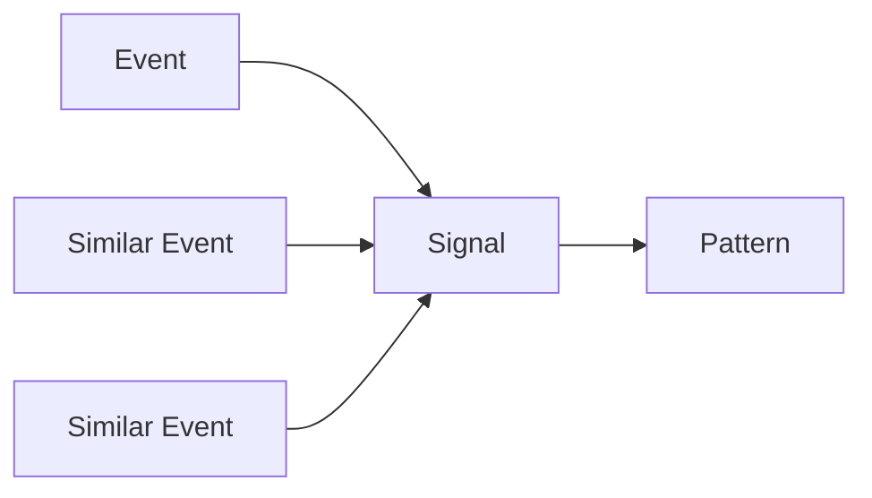

Pattern extraction must retain provenance to source events.

---

## 34. Emotional Salience

Fictional characters may retain stronger memories for meaningful experiences.

Examples:

```text
first viral video
major failure
important collaboration
favorite game release
memorable audience interaction
```

Salience affects ranking, not truth.

---

## 35. Confidence

Memory confidence represents confidence in the stored representation.

```yaml
confidence:
  value: 0.91
  basis:
    - official_source
    - repeated_observation
```

Confidence is distinct from importance.

---

## 36. Provenance

Every factual memory SHOULD retain provenance.

```yaml
provenance:
  source_type: web
  source_id: source_123
  captured_at: 2026-08-16T10:00:00Z
  extractor: research-agent-v4
```

---

## 37. Source Hierarchy

Sources may be ranked:

```text
official primary source
verified database
reputable secondary source
community source
inference
model-generated hypothesis
```

Retrieval can prefer higher-quality evidence.

---

## 38. Contradictions

Memory conflicts are expected.

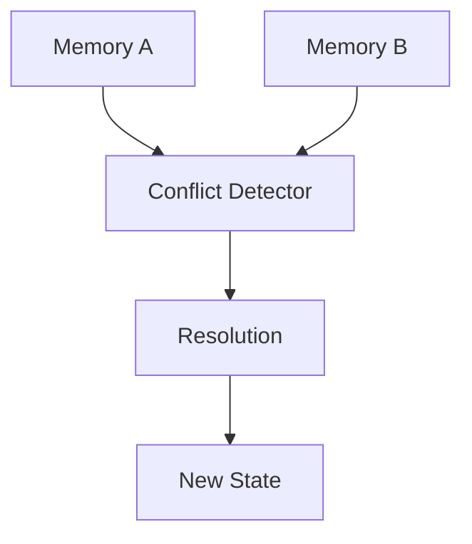

Old memories should not be silently overwritten.

---

## 39. Conflict Resolution

Resolution may use:

```text
source authority
recency
corroboration
scope
confidence
explicit correction
```

---

## 40. Temporal Validity

Facts can have validity intervals.

```yaml
validity:
  valid_from: 2026-01-01
  valid_until: 2026-08-10
```

This prevents stale information from appearing current.

---

## 41. Bi-Temporal Memory

For high-value records, OMNIS should track:

```text
valid time = when the fact was true
system time = when OMNIS learned it
```

This is essential for historical reconstruction.

---

## 42. Memory Updates

Updates should be append-oriented.

```text
v1
 ↓ correction
v2
 ↓ correction
v3
```

The history remains recoverable.

---

## 43. Memory Supersession

```yaml
memory:
  id: mem_123
  status: superseded
  superseded_by: mem_456
```

Retrieval normally excludes superseded records unless historical mode is requested.

---

## 44. Memory Deletion

Deletion is policy-controlled.

```text
active
 ↓ retention policy
archived
 ↓ deletion policy
purged
```

Legal, privacy and platform requirements take precedence.

---

## 45. Forgetting

Forgetting is not necessarily deletion.

```text
retrieval decay
 ≠
physical deletion
```

A memory may remain archived while becoming unlikely to retrieve.

---

## 46. Retrieval Architecture

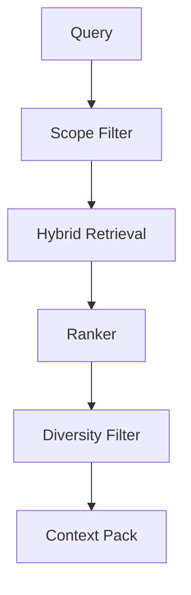

---

## 47. Hybrid Retrieval

OMNIS SHOULD combine:

```text
semantic similarity
keyword matching
metadata filtering
temporal ranking
relationship relevance
graph traversal
```

No single retrieval method is sufficient for character continuity.

---

## 48. Semantic Retrieval

Embeddings help locate conceptually similar memories.

```text
query → embedding → nearest candidates
```

Embeddings are retrieval aids, not authoritative truth.

---

## 49. Keyword Retrieval

Exact matching remains important for:

```text
names
game titles
product IDs
model numbers
quotes
dates
```

---

## 50. Graph Retrieval

Relationships can be traversed.


Graph traversal can recover context missed by embeddings.

---

## 51. Temporal Retrieval

Queries may request memories from a period.

```text
"What happened last winter?"
```

The retriever must understand temporal constraints.

---

## 52. Relationship-Aware Retrieval

When responding to a returning audience member, relevant prior interactions receive higher priority.

```text
current comment
 ↓
member identity
 ↓
relationship history
 ↓
relevant memories
```

---

## 53. Retrieval Scope

Every Agent receives a declared memory scope.

```yaml
memory_scope:
  character: true
  audience: limited
  finance: false
  private: false
```

Scope prevents accidental overexposure.

---

## 54. Context Budget

Memory retrieval must respect context limits.

```text
candidate memories
 ↓
rank
 ↓
compress
 ↓
select
 ↓
context budget
```

---

## 55. Context Compression

Repeated memories can be summarized while preserving source references.

```text
100 episodes
 ↓
summary
 ↓
source links
```

Summaries MUST NOT become the only copy for critical facts.

---

## 56. Memory Pack

A Memory Pack is the structured context delivered to an Agent.

```yaml
memory_pack:
  identity: []
  recent_events: []
  relevant_knowledge: []
  relationships: []
  constraints: []
  provenance: []
```

---

## 57. Memory Access Policy

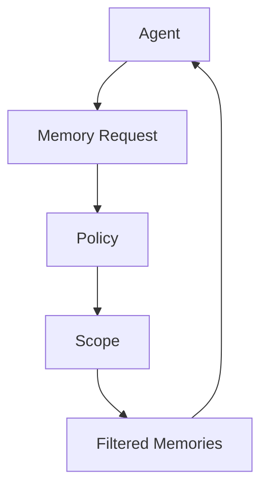

Memory is never an unrestricted global context dump.

---

## 58. Write Policy

Agents cannot freely write arbitrary memories.

Writes pass through:

```text
validation
classification
provenance
privacy
retention
confidence
```

---

## 59. Memory Types at Write Time

The writer classifies each candidate as:

```text
fact
observation
event
preference
trait
skill
relationship
hypothesis
summary
```

---

## 60. Hypothesis Memory

Uncertain beliefs may be stored explicitly.

```yaml
memory:
  type: hypothesis
  confidence: 0.54
  statement: "Audience may prefer shorter intros"
```

Hypotheses must not be presented as facts.

---

## 61. Learning Memory

Outcomes can become experience records.


---

## 62. Skill Progression

A character or Agent can improve with validated experience.

```text
novice
 ↓ repeated successful tasks
competent
 ↓
advanced
 ↓
expert
```

Skill levels must be evidence-based.

---

## 63. Experience Record

```yaml
experience:
  task_type: gaming.review
  attempts: 42
  successful: 37
  quality_score: 0.91
  lessons:
    - "Gameplay examples improve retention"
```

---

## 64. Learning Decay

Skills can become stale.

```text
recent performance ↑
old performance ↓
```

Retrieval should consider current competence.

---

## 65. Memory Consolidation

Short-term events can become long-term memories.

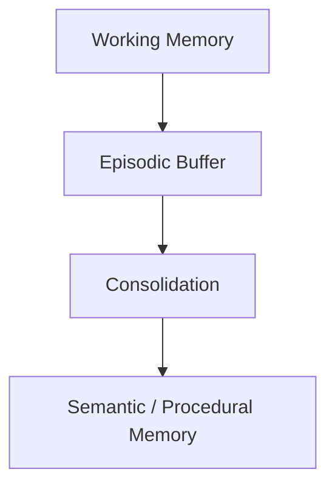

Consolidation may run asynchronously.

---

## 66. Consolidation Rules

Potential promotion signals:

```text
repetition
importance
successful outcome
explicit user instruction
stable pattern
```

---

## 67. Memory Rehearsal

Frequently relevant memories may be refreshed in ranking without changing their factual content.

```text
retrieved often
 ↓
relevance signal
```

---

## 68. Memory Decay

A conceptual retrieval weight may be:

```text
weight = base_strength × decay(time) × relevance
```

Decay parameters vary by memory type.

---

## 69. Identity Exception

Core identity records should have extremely slow decay or no automatic decay.

```text
identity ≠ transient event
```

---

## 70. Memory Relevance

Relevance combines:

```text
semantic similarity
recency
importance
relationship
task scope
confidence
```

---

## 71. Diversity

Retrieval should avoid returning ten near-duplicate memories.


---

## 72. Negative Evidence

The system should retain relevant failures.

```text
failed thumbnail strategy
failed topic
negative audience reaction
```

Negative evidence prevents repeated mistakes.

---

## 73. Success Evidence

Successful patterns are also stored.

```text
high retention
strong comments
subscriber growth
successful collaboration
```

---

## 74. Counterfactual Memory

OMNIS may store evaluated alternatives.

```yaml
counterfactual:
  chosen: A
  alternative: B
  reason: "A had stronger historical performance"
```

This supports better future planning.

---

## 75. Memory of Decisions

Important decisions should record:

```text
decision
context
evidence
constraints
outcome
```

---

## 76. Memory of Audience Feedback

Feedback can be clustered into durable preferences.

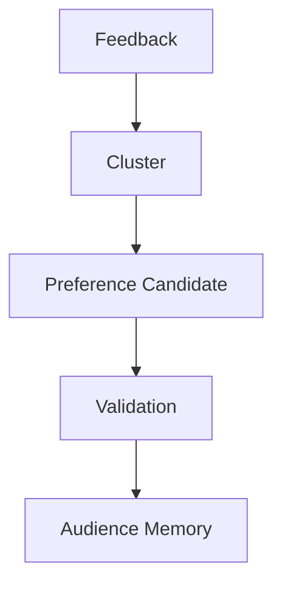

---

## 77. Audience Preference Evolution

Preferences are time-sensitive.

```text
old preference
 ↓ new evidence
updated preference
```

The system should avoid assuming a member always likes the same topics.

---

## 78. Character Preference Evolution

Characters may also evolve within configured boundaries.

```text
initial preference
 ↓ experiences
new preference candidate
 ↓ validation
updated preference
```

Core identity constraints remain authoritative.

---

## 79. Memory Boundaries

Different memory domains require isolation.

```text
Character
Audience
Finance
Operations
Security
```

Cross-domain access requires explicit policy.

---

## 80. Privacy

Memory systems MUST support:

```text
data minimization
access control
retention limits
redaction
user deletion requests
audit logs
```

---

## 81. Sensitive Data

Sensitive information should not be retained unless explicitly required and authorized.

The default is minimization.

---

## 82. Encryption

Persistent memory SHOULD use encryption at rest and secure transport.

Keys must be managed outside application source code.

---

## 83. Tenant Isolation

```yaml
memory:
  tenant_id: tenant_001
```

Cross-tenant retrieval is prohibited.

---

## 84. Audit Trail

Memory writes and critical reads should be auditable.

```text
who
what
when
why
policy
source
```

---

## 85. Memory Versioning

Memory schemas are versioned.

```text
memory.v1
memory.v2
memory.v3
```

Migration must preserve provenance.

---

## 86. Snapshotting

Large character state can be snapshotted.


Snapshots accelerate recovery and historical reconstruction.

---

## 87. Event Sourcing

High-value state should be reconstructable from events.

```text
Initial State
 + Events
 = Current State
```

---

## 88. Character Reconstruction

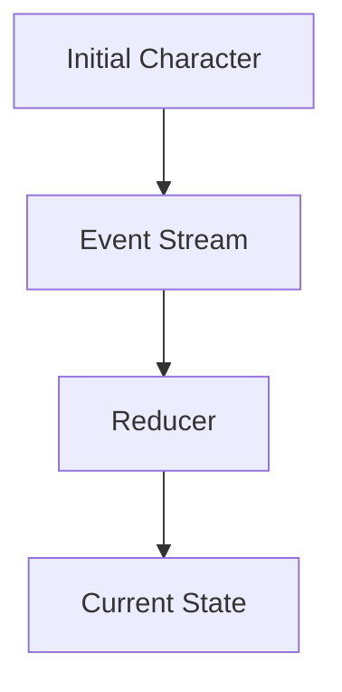

This is especially important for appearance continuity.

---

## 89. Memory Repair

If a derived state is corrupted:

```text
snapshot
 ↓
events
 ↓
rebuild
 ↓
validate
```

---

## 90. Memory Health

Metrics include:

```text
retrieval hit rate
retrieval latency
conflict rate
stale-memory rate
write rejection rate
context usefulness
memory growth
```

---

## 91. Retrieval Evaluation

A retrieval system should be evaluated using:

```text
precision
recall
relevance
context utility
hallucination reduction
latency
```

---

## 92. Memory Quality Gate

Before a memory becomes authoritative:

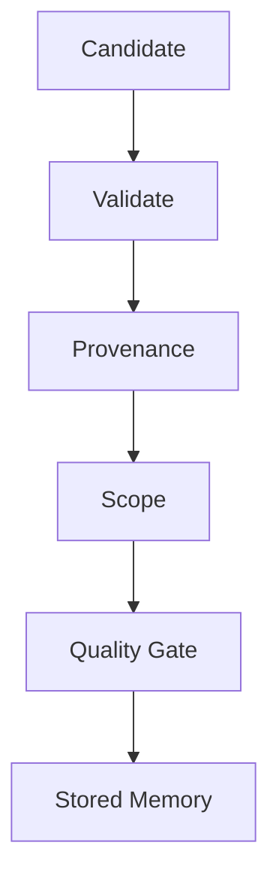

---

## 93. Memory Write Contract

```yaml
memory_write:
  type: observation
  scope: character
  subject_id: char_001
  statement: "Character prefers racing games"
  confidence: 0.77
  provenance: []
  retention: long
```

---

## 94. Memory Query Contract

```yaml
memory_query:
  subject_id: char_001
  scope: character
  query: "recent gaming preferences"
  temporal_window: 90d
  max_items: 12
```

---

## 95. Agent Integration

Agents interact with memory through a gateway.


Direct database access is forbidden for normal Agents.

---

## 96. Orchestrator Integration

The Orchestrator supplies task-scoped memory requirements.

```text
Task Contract
 ↓
Memory Scope
 ↓
Memory Gateway
 ↓
Memory Pack
 ↓
Agent
```

---

## 97. Character Generation Integration

Visual generation must receive current appearance state.

```text
Character ID
 ↓
Appearance Memory
 ↓
Temporal State
 ↓
Wardrobe Memory
 ↓
Visual Prompt / Control Data
```

---

## 98. Dialogue Integration

Dialogue generation receives:

```text
personality
current mood
relationship
conversation history
knowledge
speech style
```

This produces continuity without requiring the model to hallucinate past interactions.

---

## 99. Knowledge Integration

Domain knowledge should be retrieved separately from personality memory.

```mermaid
flowchart TD
    D[Dialogue Task] --> P[Personality Memory]
    D --> K[Knowledge Memory]
    D --> R[Relationship Memory]
    P --> C[Context]
    K --> C
    R --> C
```

This separation prevents fictional traits from contaminating factual knowledge.

---

## 100. Final Contract

The OMNIS Memory Mesh is the persistent cognitive substrate connecting identity, experience, knowledge, relationships, audience signals, content history, environmental context and learning.

Its canonical loop is:

```text
OBSERVE
 ↓
ENCODE
 ↓
STORE
 ↓
RETRIEVE
 ↓
ACT
 ↓
MEASURE
 ↓
LEARN
 ↓
CONSOLIDATE
 ↓
UPDATE STATE
```

Memory must be persistent but governed, rich but scoped, adaptive but auditable, and capable of preserving the continuity required for large populations of virtual characters and autonomous content-production Agents.