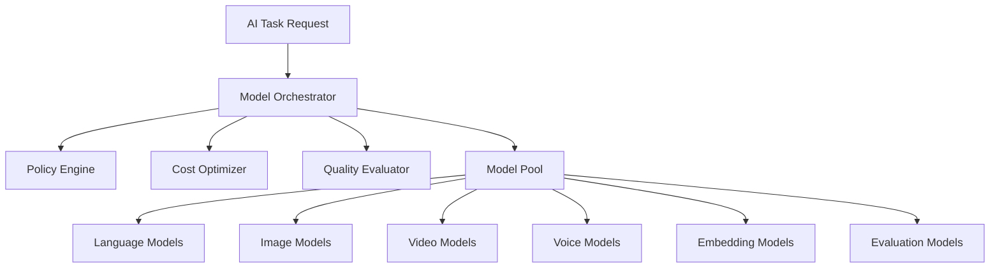
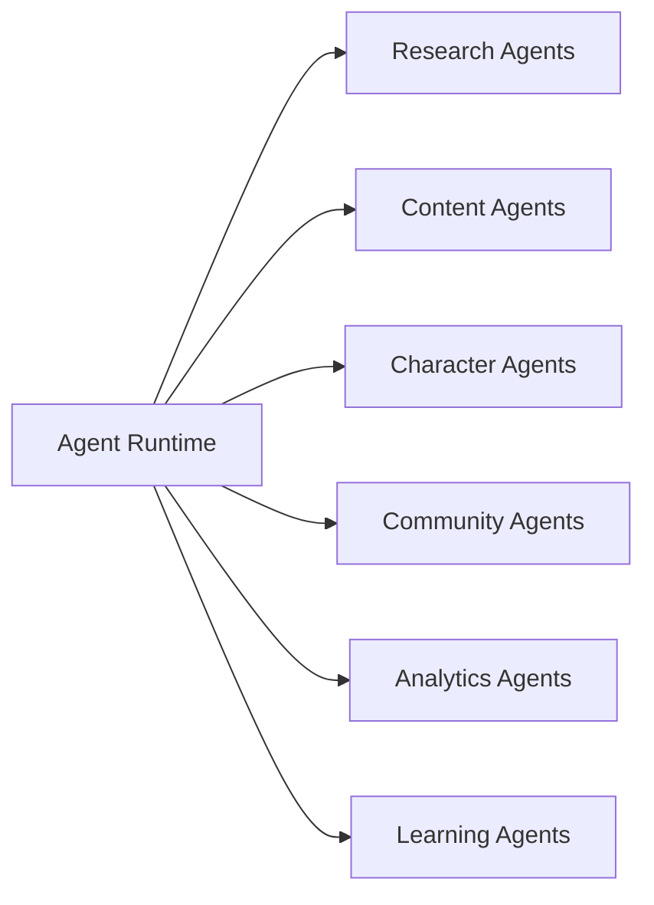
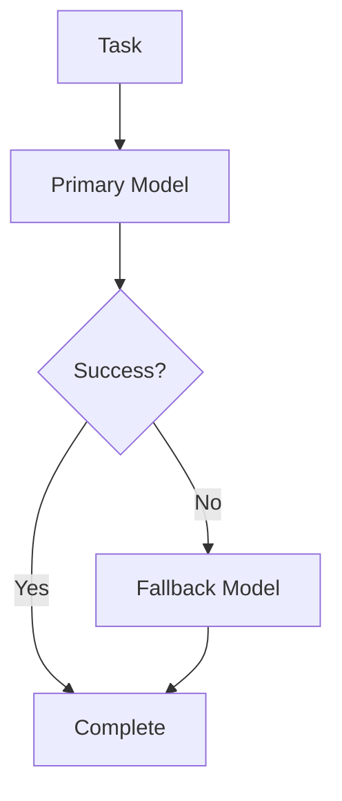
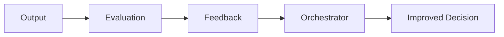

# OMNIS Model Orchestration and AI Agent Infrastructure Specification

> Version: 1.0.0
> Status: Architecture Specification
> Domain: AI Models / Agent Runtime / Multi Provider Intelligence

## 1. Purpose

The Model Orchestration and AI Agent Infrastructure is the intelligence coordination layer of OMNIS. It manages thousands of specialized agents and selects the optimal AI models for every task based on quality, cost, latency, availability and reliability.



## 2. Core Principle

OMNIS must not depend on a single AI provider. It must operate as a model-agnostic intelligence platform.

```text
Task
 ↓
Understand Requirement
 ↓
Select Agent
 ↓
Select Model
 ↓
Execute
 ↓
Evaluate
 ↓
Learn
```

## 3. Model Registry

Every connected AI model is registered with capabilities and constraints.

```yaml
model:
  id: model_001
  provider: provider_name
  type: language
  capabilities:
    - reasoning
    - writing
  cost_profile: medium
  quality_score: 0.92
```

## 4. Supported Model Categories

```text
Large Language Models
Vision Models
Image Generation Models
Video Generation Models
Speech Models
Music Models
Embedding Models
Ranking Models
Safety Models
Evaluation Models
```

## 5. Agent Runtime

Agents are autonomous specialized workers operating inside controlled boundaries.



## 6. Agent Identity

Every agent has a purpose, capability set, permissions and evaluation criteria.

## 7. Agent Lifecycle

```text
Created
 ↓
Configured
 ↓
Activated
 ↓
Executing
 ↓
Evaluated
 ↓
Improved
 ↓
Archived
```

## 8. Agent Specialization

Agents should be narrow experts rather than general workers.

Examples:

```text
Thumbnail Optimization Agent
Gaming Research Agent
Fashion Trend Agent
Audience Sentiment Agent
Voice Quality Agent
```

## 9. Agent Communication Bus

Agents communicate through structured messages rather than uncontrolled direct calls.

## 10. Task Routing

The orchestrator assigns tasks according to agent capability and availability.

## 11. Model Selection Algorithm

Model selection considers:

```text
quality
cost
latency
context size
availability
previous performance
```

## 12. Dynamic Routing

The same task may use different models depending on current conditions.

## 13. Fallback Architecture

If a provider fails, OMNIS automatically routes work to alternative models.



## 14. Quality Evaluation

Every generated output can be evaluated before acceptance.

## 15. Self Improvement Loop



## 16. Cost Optimization

OMNIS balances maximum quality with sustainable operating cost.

## 17. Intelligent Model Assignment

High-value content receives premium models while repetitive tasks can use optimized alternatives.

## 18. Context Management

Agents receive only required context to reduce cost and improve reliability.

## 19. Memory Integration

Agents can access approved memories through controlled interfaces.

## 20. Character-Aware Execution

Character-related agents must receive Character OS context before generating outputs.

## 21. Parallel Execution

Independent tasks execute simultaneously.

## 22. Queue Management

Large production workloads are managed through intelligent queues.

## 23. Priority System

Priority depends on:

```text
deadline
revenue potential
channel importance
trend opportunity
resource availability
```

## 24. Agent Monitoring

The system tracks:

```text
execution time
success rate
cost
quality score
failure patterns
```

## 25. Agent Evaluation

Agents improve through performance measurement.

## 26. Agent Versioning

Changes to agent behavior are versioned and auditable.

## 27. Prompt Engineering Layer

Prompts are generated dynamically from task requirements and system state.

## 28. Prompt Memory

Successful prompt patterns can become reusable strategies.

## 29. Security Boundary

Agents cannot access unauthorized systems or data.

## 30. Final Architecture Contract

The Model Orchestration and AI Agent Infrastructure MUST provide a scalable intelligence layer for OMNIS capable of coordinating thousands of specialized agents, routing tasks across multiple AI providers, optimizing cost and quality, supporting failures and recovery, learning from performance feedback, and integrating with Character OS, Content Factory, Audience Intelligence and the complete OMNIS ecosystem.
