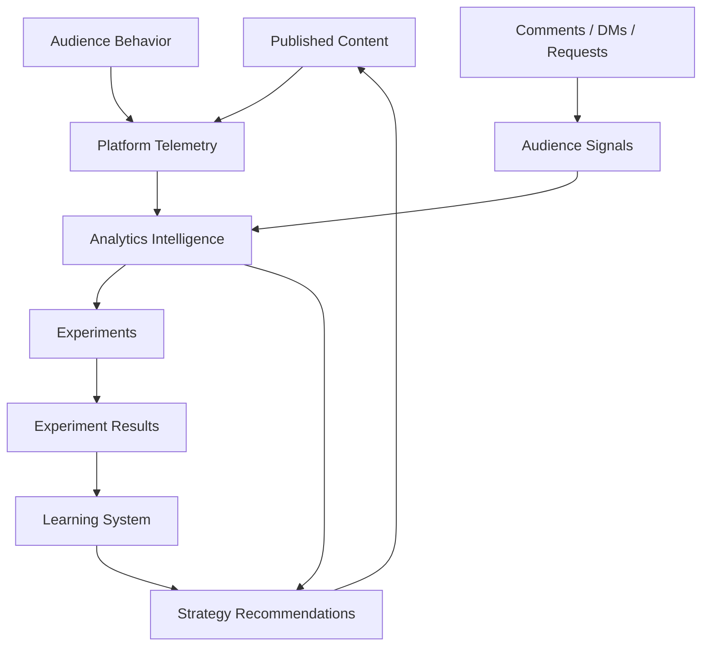
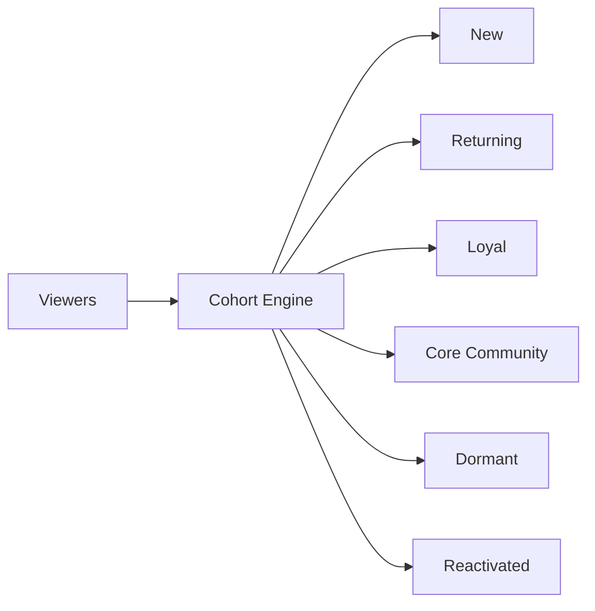
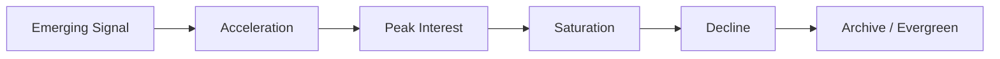
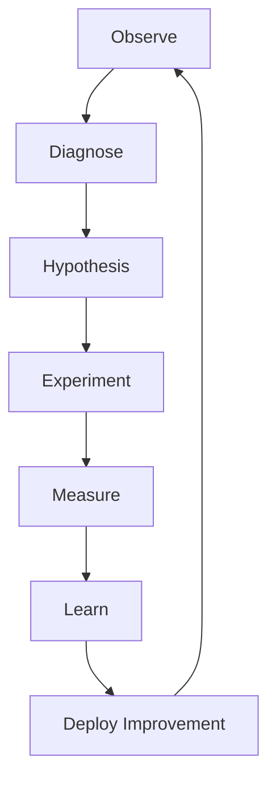
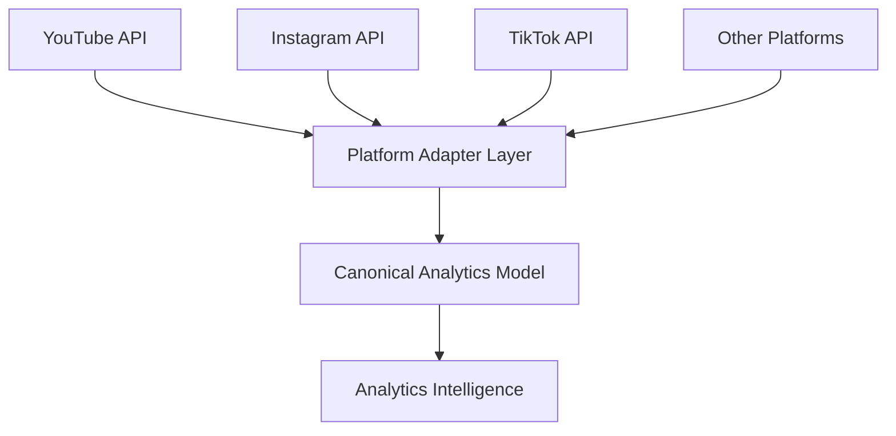
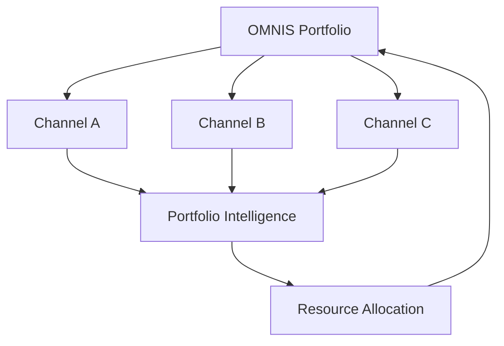
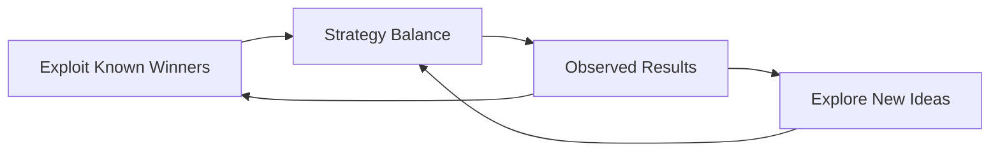
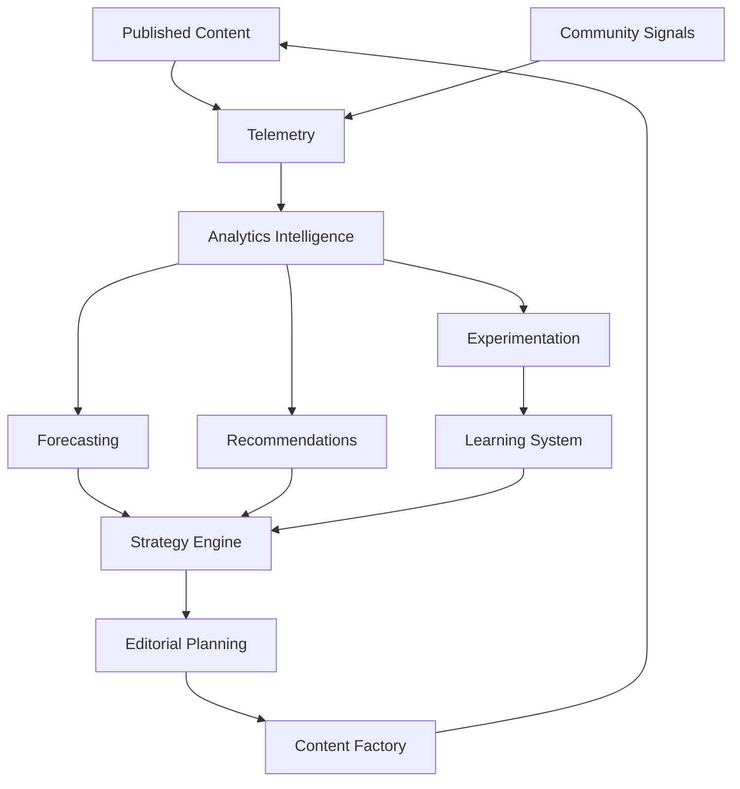

# OMNIS Analytics Intelligence and Growth Engine Specification

> Version: 1.0.0
> Status: Architecture Specification
> Domain: Analytics / Audience Intelligence / Growth / Experimentation / Revenue / Optimization

## 1. Purpose

The Analytics Intelligence and Growth Engine converts platform telemetry, audience behavior, content performance, community signals and business outcomes into actionable decisions for OMNIS channels and Characters.

The engine is not merely a dashboard. It is a closed-loop decision system.



## 2. Core Principle

OMNIS must optimize for durable audience value and business performance rather than a single vanity metric.

## 3. Measurement Layers

Analytics are divided into content, audience, channel, Character, platform and business layers.

```text
CONTENT
AUDIENCE
CHARACTER
CHANNEL
PLATFORM
BUSINESS
PORTFOLIO
```

## 4. Event Collection

All measurable production and publication events should use a canonical event model.

```yaml
event:
  id: evt_001
  type: video_published
  channel_id: channel_001
  content_id: content_001
  timestamp: 2026-08-18T12:00:00Z
```

## 5. Content Metrics

The engine tracks impressions, views, watch time, average view duration, retention, engagement, shares, saves, comments and conversion events where available.

## 6. Retention

Retention is modeled as a time series rather than a single score.

```text
viewer cohort
    ↓
0s → 5s → 15s → 30s → midpoint → end
```

## 7. Hook Analysis

The first seconds of a video are analyzed for drop-off, promise clarity, novelty, pacing and audience fit.

## 8. CTR Analysis

Click-through rate is evaluated alongside impressions, traffic source and audience context.

## 9. Thumbnail Intelligence

Thumbnail candidates are evaluated for clarity, topic recognition, Character consistency and packaging coherence.

## 10. Title Intelligence

Titles are evaluated for relevance, clarity, curiosity and alignment with the actual content.

## 11. Packaging Integrity

Optimization must not reward misleading packaging that causes severe viewer dissatisfaction after the click.

## 12. Engagement Quality

Comments, shares, saves and meaningful discussion can carry different weights from passive impressions.

## 13. Audience Cohorts

The engine segments audiences by behavior and relationship state.



## 14. Audience Lifecycle

Audience lifecycle analysis measures movement between cohorts.

## 15. Loyalty

Loyalty should be inferred from repeated meaningful engagement rather than subscriber count alone.

## 16. Community Health

Community health combines sentiment, participation, recurring members, constructive discussion and negative signals.

## 17. Character Performance

Character analytics compare content performance while controlling for topic, format, platform and audience.

## 18. Character Learning

Successful Character behaviors can become evidence for future Character strategy without erasing individual identity.

## 19. Channel Health Score

A composite channel health score can combine growth, retention, audience quality, publishing consistency, content quality and business performance.

## 20. Metric Guardrails

Composite scores must remain decomposable so operators can understand why a score changed.

## 21. Content Scoring

Each content candidate receives a pre-publication opportunity score.

```text
Opportunity Score
=
Audience Demand
× Topic Fit
× Character Fit
× Timing
× Production Quality
× Business Value
× Confidence
```

## 22. Post-Publication Score

Post-publication evaluation compares predicted and observed outcomes.

## 23. Forecasting

Forecasting estimates expected performance ranges rather than pretending to know exact future views.

## 24. Confidence Intervals

Predictions should expose uncertainty and confidence.

## 25. Trend Detection

Trend agents detect acceleration, persistence, novelty and saturation.

## 26. Trend Lifecycle



## 27. Trend Qualification

A detected trend requires source evidence and freshness validation before strategy adoption.

## 28. Competitor Intelligence

Public competitor signals may be analyzed for formats, topics, cadence, packaging patterns and audience response.

## 29. Competitive Boundaries

Competitor analysis must not involve unauthorized access or private information.

## 30. Opportunity Gaps

The engine identifies topics with strong audience demand and comparatively weak content coverage.

## 31. Content Portfolio

Channels maintain a portfolio of evergreen, trending, community, experimental and commercial content.

```text
PORTFOLIO
├── Evergreen
├── Trending
├── Community
├── Experimental
├── Search-driven
├── Brand / Commercial
└── Event-driven
```

## 32. Portfolio Balance

Portfolio allocation prevents over-dependence on short-lived trends.

## 33. Experimentation

OMNIS uses controlled experiments to learn which strategies improve outcomes.

## 34. Experiment Unit

An experiment has hypothesis, variables, population, duration, success metrics and stopping criteria.

```yaml
experiment:
  id: exp_001
  hypothesis: "shorter hooks improve qualified retention"
  variable: hook_length
  control: 12
  treatment: 7
  metric: qualified_retention
```

## 35. A/B Testing

A/B testing should be used where platform capabilities and sample sizes support meaningful inference.

## 36. Sequential Testing

The system can monitor experiments over time while avoiding premature conclusions.

## 37. Experiment Registry

All experiments are versioned and linked to affected content.

## 38. Experiment Memory

Results become reusable knowledge rather than isolated dashboard observations.

## 39. Hypothesis Generation

Agents can propose hypotheses from anomalies, audience requests and historical performance.

## 40. Hypothesis Evaluation

Hypotheses receive evidence, confidence and expected impact estimates.

## 41. Growth Loop



## 42. Recommendation Engine

Recommendations must include evidence, expected impact, confidence and implementation cost.

## 43. Recommendation Types

```text
create
modify
pause
scale
repurpose
retire
experiment
investigate
```

## 44. Autonomous Actions

Low-risk actions may be automated according to policy.

## 45. Approval Gates

High-impact changes can require operator approval.

## 46. Content Timing

Publishing recommendations consider audience activity, topic freshness, competition and production readiness.

## 47. Cadence Optimization

Cadence is optimized for sustainable quality rather than maximum posting volume.

## 48. Fatigue Detection

The engine detects signs of audience fatigue caused by repetitive topics, formats or Character behavior.

## 49. Format Diversification

Successful formats should not become an excuse to repeat the same structure indefinitely.

## 50. Character Diversification

Different Characters can cover overlapping niches with distinct voices and audience relationships.

## 51. Cross-Platform Analytics

A canonical metric layer normalizes platform-specific telemetry without pretending all metrics are identical.

## 52. Platform Adapters

Each platform adapter maps native metrics into canonical OMNIS metrics.



## 53. Data Freshness

Metrics are timestamped and freshness is exposed to downstream decision systems.

## 54. Data Quality

Missing, delayed or inconsistent platform data must be marked explicitly.

## 55. Attribution

Content outcomes should be connected to relevant production metadata where attribution is possible.

## 56. Production Attribution

The engine can relate outcomes to script versions, Character state, thumbnail version, title version and publication timing.

## 57. Revenue Analytics

Business analytics can include advertising revenue, sponsorship, affiliate revenue, memberships and other configured sources.

## 58. Revenue Per Content

Revenue analysis can estimate value per content item while accounting for attribution uncertainty.

## 59. Revenue Forecasting

Forecasting provides ranges based on historical performance and current signals.

## 60. Monetization Optimization

The engine can recommend content portfolios that balance audience growth and monetization potential.

## 61. Commercial Fit

Commercial recommendations must respect Character identity, audience trust and channel positioning.

## 62. Sponsorship Intelligence

Sponsor opportunities can be scored against audience fit, Character fit, expected revenue and brand risk.

## 63. Audience Trust

Aggressive monetization that damages audience trust should reduce long-term strategy scores.

## 64. Long-Term Value

Optimization considers lifetime audience value rather than only immediate views.

## 65. Viral Prediction

Viral prediction is probabilistic and should produce confidence bands rather than deterministic promises.

## 66. Viral Signals

Signals may include velocity, novelty, retention, sharing, discussion, external interest and audience mismatch risk.

## 67. Early Warning

The engine can flag content that is underperforming relative to its expected trajectory.

## 68. Recovery Actions

Possible recovery actions include packaging experiments, improved distribution, derivative clips or updated community communication.

## 69. Winner Detection

Strong-performing content is analyzed for transferable patterns.

## 70. Pattern Extraction

Patterns can include topic structure, hook types, pacing, Character behavior, visual style and packaging.

## 71. Pattern Generalization

Patterns must be generalized carefully to avoid overfitting to one viral event.

## 72. Content Repurposing

High-value content can produce clips, shorts, posts, discussions and localized versions.

## 73. Repurposing Score

Repurposing considers standalone value, freshness, audience overlap and production cost.

## 74. Channel Portfolio Management

The system manages multiple channels as a portfolio while preserving individual identities.



## 75. Resource Allocation

Compute, production capacity and editorial attention can be allocated according to expected value and strategic importance.

## 76. Capacity Constraints

Growth recommendations must consider actual production capacity.

## 77. Queue Optimization

Content queues are prioritized by urgency, value, freshness, audience demand and dependencies.

## 78. Opportunity Decay

Trend opportunities lose value as freshness decreases.

## 79. Evergreen Value

Evergreen content can retain value over longer periods and should be evaluated accordingly.

## 80. Audience Request Impact

Repeated audience requests can increase content opportunity scores when supported by sufficient evidence.

## 81. Community Feedback Loop

Audience Intelligence feeds analytics and analytics feeds community strategy.

## 82. Negative Feedback

Negative feedback is segmented into useful criticism, dissatisfaction, spam and abuse rather than treating every negative signal equally.

## 83. Sentiment Context

Sentiment is interpreted alongside topic, audience cohort and interaction context.

## 84. Anomaly Detection

Sudden changes in performance can trigger investigation agents.

## 85. Anomaly Examples

```text
unexpected CTR drop
retention collapse
sudden audience growth
unusual comment volume
sudden revenue change
platform distribution change
```

## 86. Root Cause Analysis

Agents correlate anomalies with recent content, packaging, platform conditions and audience changes.

## 87. Causal Caution

Correlation must not automatically be treated as causation.

## 88. Decision Log

Every significant autonomous recommendation is recorded with evidence and confidence.

## 89. Explainability

Operators must be able to inspect why the system recommended an action.

## 90. Governance

Growth automation must operate within channel, platform, legal, brand and safety policies.

## 91. Rate Limits

Platform API limits are tracked by adapters and schedulers.

## 92. Data Privacy

Audience analytics should use only authorized data and minimize retention of sensitive information.

## 93. Model Evaluation

Predictive models are evaluated against historical outcomes and monitored for drift.

## 94. Strategy Drift

The engine detects when previously successful strategies stop working.

## 95. Exploration vs Exploitation



## 96. Strategy Evolution

Successful validated strategies become reusable playbooks with version history.

## 97. Playbooks

A playbook defines reusable decisions for a channel, Character or content format.

## 98. Continuous Improvement

Analytics, audience signals, production outcomes and experiments converge into the OMNIS Learning System.

## 99. Final Architecture



## 100. Final Contract

The Analytics Intelligence and Growth Engine MUST transform authorized platform, audience, community, production and business signals into explainable, confidence-aware decisions. It MUST support retention analysis, packaging intelligence, forecasting, trend detection, experimentation, audience lifecycle analysis, portfolio optimization, monetization analysis, anomaly detection, resource allocation and continuous learning. It MUST preserve platform-specific semantics, expose uncertainty, prevent misleading optimization, respect privacy and governance requirements, and feed validated learning back into OMNIS strategy, editorial planning, Character development and content production.
