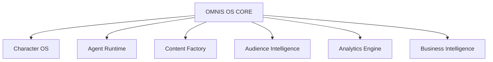
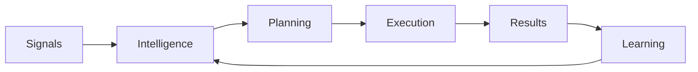
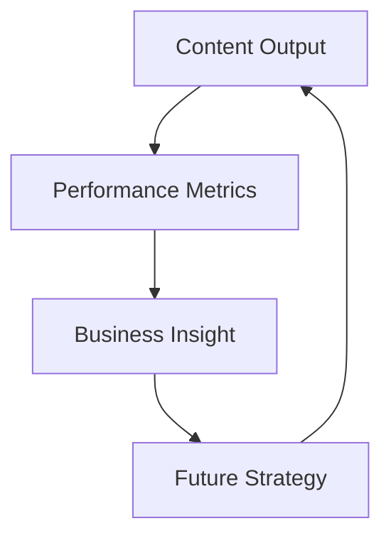

# OMNIS Autonomous Content Operating System Specification

> Version: 1.0.0
> Domain: AI Content Operating System

## 1. Purpose

OMNIS is designed as an autonomous operating system for digital content creation, management and growth. It coordinates Characters, Agents, Models, Content Factory, Audience Intelligence, Analytics and Business systems.



## 2. Operating System Philosophy

OMNIS does not only execute commands. It observes, plans, acts, evaluates and improves.

```text
Observe
 ↓
Understand
 ↓
Plan
 ↓
Execute
 ↓
Measure
 ↓
Learn
 ↓
Improve
```

## 3. Core Subsystems

```text
OMNIS CORE
├── Character OS
├── Agent Runtime
├── Model Orchestration
├── Memory System
├── Content Factory
├── Audience Intelligence
├── Analytics
├── Monetization
└── Governance
```

## 4. Autonomous Decision Loop



## 5. Channel Operating Model

Each channel operates as an independent business unit with its own Character, audience, strategy and goals.

## 6. Character Operating Model

Characters are persistent digital entities connected to production, audience and learning systems.

## 7. Autonomous Planning

The planning engine creates production priorities based on:

- audience demand
- trends
- business goals
- available resources
- historical performance

## 8. Resource Management

OMNIS manages:

- AI model usage
- GPU resources
- agent capacity
- production queues
- cost limits

## 9. Agent Coordination

Specialized agents collaborate through the Agent Runtime instead of direct uncontrolled communication.

## 10. Self Optimization

The system continuously improves workflows using measured outcomes.

## 11. Business Intelligence

Business intelligence connects content performance with revenue decisions.



## 12. Monetization Awareness

OMNIS considers:

- advertising
- sponsorship
- affiliate opportunities
- digital products
- memberships
- partnerships

## 13. Governance

Every autonomous action requires:

- traceability
- permissions
- audit logs
- safety checks

## 14. Evolution Loop

```text
Production
 ↓
Experience
 ↓
Knowledge
 ↓
Better Decisions
 ↓
Better Production
```

## 15. Final Contract

OMNIS MUST operate as an intelligent content operating system capable of managing autonomous Characters, Agents, production pipelines, audiences and business objectives while continuously learning and improving through feedback loops.
