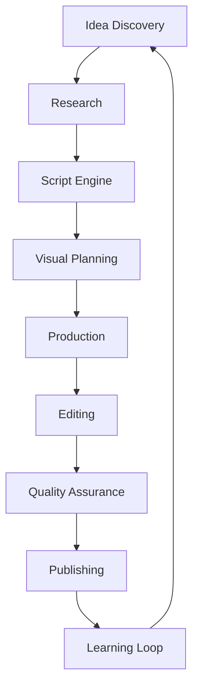
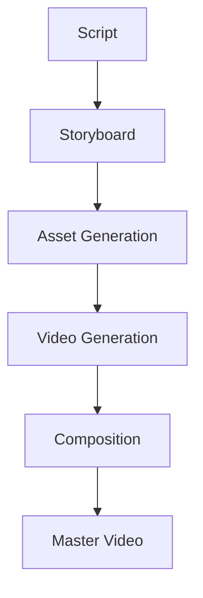
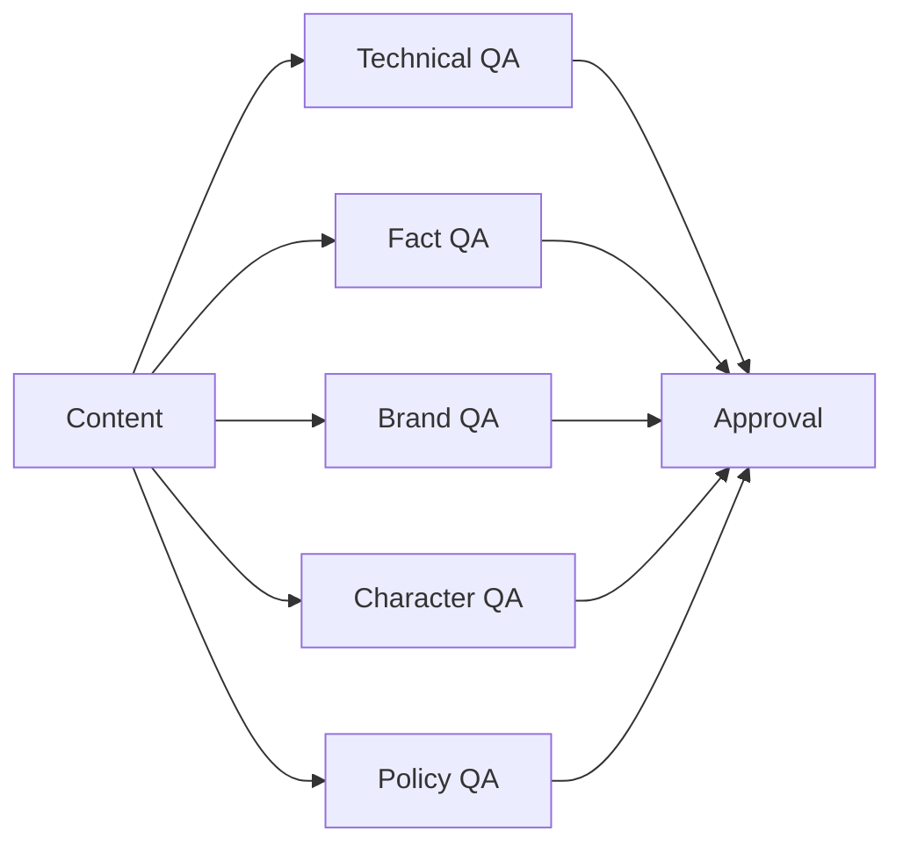
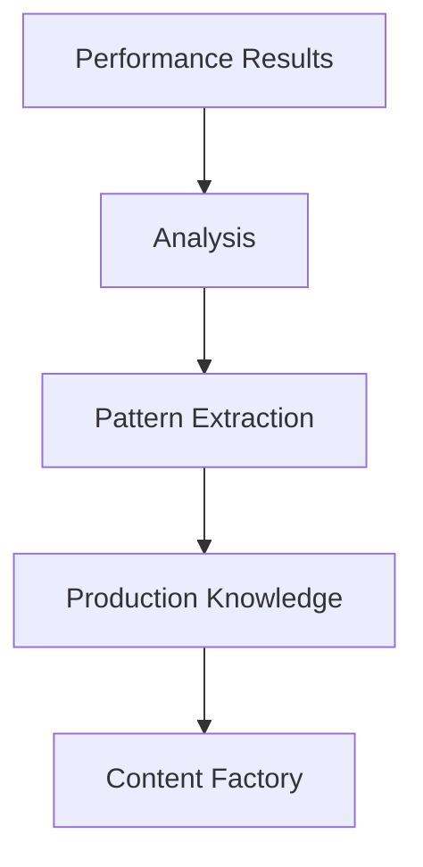

# OMNIS Content Factory Pipeline and Production Engine Specification

> Version: 1.0.0
> Domain: Content Creation / Production Automation / Quality / Optimization

## 1. Purpose

The Content Factory is the production heart of OMNIS. It transforms ideas, audience signals and strategic decisions into high-quality digital content.



## 2. Production Philosophy

OMNIS does not maximize quantity alone. It optimizes for quality, audience value, consistency and long-term channel growth.

## 3. Idea Discovery Engine

Ideas are generated from:

```text
Audience Requests
Trend Signals
Character Expertise
Search Demand
Competitor Patterns
Historical Performance
Editorial Strategy
```

## 4. Research Pipeline

Every content idea enters a research workflow before production.


## 5. Research Agents

Specialized agents gather information, compare sources and prepare production-ready briefs.

## 6. Fact Checking

Claims are evaluated with confidence levels and source references.

## 7. Script Engine

The Script Engine creates content while preserving Character identity, tone and audience expectations.

## 8. Story Architecture

Scripts support:

```text
Hook
Context
Conflict
Development
Payoff
Call To Action
```

## 9. Character Voice Integration

Every script is adapted to the speaking style, vocabulary and personality of the selected Character.

## 10. Script Variants

The system can generate multiple approaches for evaluation.

```text
Educational
Entertainment
Emotional
Controversial
Story Driven
Fast Format
Deep Analysis
```

## 11. Visual Planning

Before generation, content is converted into visual plans.

```text
Scene
Camera
Character State
Location
Lighting
Motion
Duration
Audio
```

## 12. Scene Continuity

Characters, clothing, environments and props must remain consistent across scenes.

## 13. Video Generation Pipeline



## 14. Digital Human Integration

Character OS provides:

```text
Face Identity
Voice
Emotion
Wardrobe
Movement Style
Personality
Memory Context
```

## 15. Voice Production

Voice generation considers:

```text
Character Voice
Emotion
Energy
Age
Context
Temporary Conditions
```

## 16. Human Variation

Generated voices may include realistic variation while preserving identity.

## 17. Editing Engine

Editing agents manage:

```text
Cuts
Transitions
Pacing
Captions
Effects
Music
Sound Design
Color
```

## 18. Retention Optimization

Editing decisions are evaluated against expected viewer retention.

## 19. Audio Intelligence

Audio systems analyze:

```text
Voice Clarity
Music Balance
Emotional Timing
Sound Effects
Silence Usage
```

## 20. Thumbnail Factory

Thumbnail generation considers:

```text
Character Recognition
Topic Clarity
Emotion
Contrast
Platform Rules
Audience Expectation
```

## 21. Title Generation

Titles are generated and scored using audience fit, curiosity and accuracy.

## 22. Quality Assurance

Before publication content passes automated reviews.



## 23. Character QA

Checks whether the content matches the established identity of the Character.

## 24. Continuity QA

Detects:

```text
Wrong Clothing
Wrong Hair State
Impossible Timeline
Personality Inconsistency
Voice Mismatch
```

## 25. Content Scoring

Each production receives scores:

```text
Quality Score
Audience Fit
Novelty
Retention Potential
Brand Fit
Production Confidence
```

## 26. Repurposing Engine

Long content can become:

```text
Shorts
Reels
Clips
Posts
Threads
Community Content
```

## 27. Localization

Content can be adapted for different languages and cultures while preserving Character identity.

## 28. Production Memory

Successful production patterns are stored for future improvement.

## 29. Learning Loop



## 30. Final Contract

The Content Factory MUST transform strategic intent into consistent, high-quality content through research, scripting, visual planning, digital human integration, generation, editing, quality assurance, optimization and continuous learning.