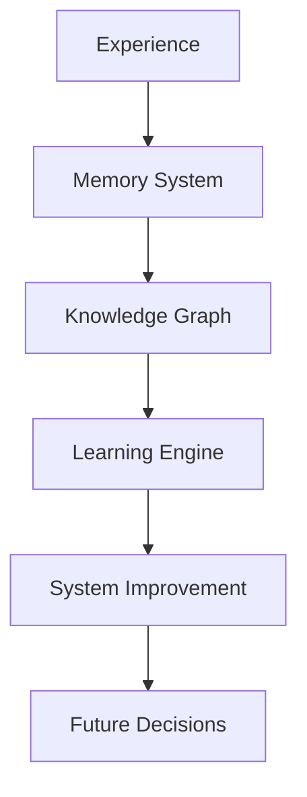
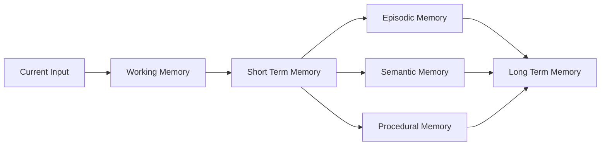
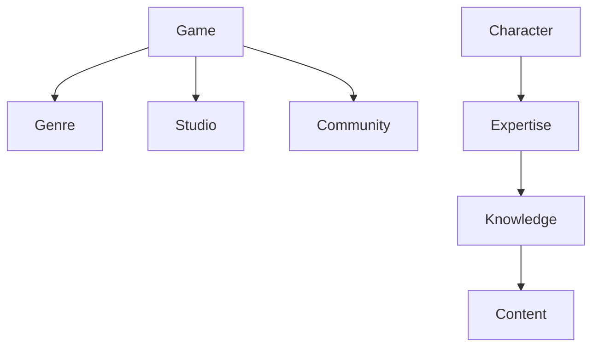
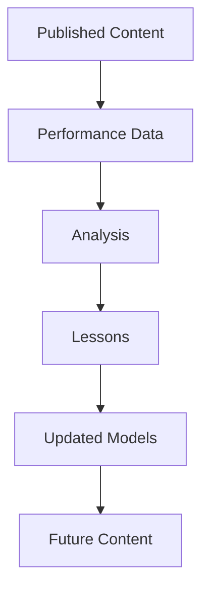

# OMNIS Memory, Knowledge and Learning System Specification

> Version: 1.0.0
> Domain: Memory / Knowledge / Experience / Learning / Evolution

## 1. Purpose

The OMNIS Memory, Knowledge and Learning System provides persistent intelligence for the entire platform. It enables Characters, Agents and the operating system itself to learn from experience, preserve important information and improve over time.



## 2. Core Principle

OMNIS must not behave as a stateless generation tool. Every meaningful action creates potential learning signals.

```text
Action
 ↓
Observation
 ↓
Evaluation
 ↓
Memory
 ↓
Learning
 ↓
Better Future Decision
```

## 3. Memory Layers



## 4. Working Memory

Stores immediate context required for current tasks.

## 5. Short Term Memory

Maintains recent interactions, tasks and temporary context.

## 6. Episodic Memory

Stores meaningful events:

- successful videos
- failed experiments
- audience reactions
- Character experiences
- important conversations

## 7. Semantic Memory

Stores generalized knowledge:

- concepts
- facts
- relationships
- domain information

## 8. Procedural Memory

Stores how tasks are performed:

- workflows
- production methods
- successful patterns

## 9. Character Memory

Every Character owns isolated memory space.

```text
Character
 ├── Personal Experiences
 ├── Audience Relationships
 ├── Preferences
 ├── Skills
 ├── Career History
 └── Learned Behavior
```

## 10. Channel Memory

Each channel maintains its own history:

- audience profile
- successful formats
- failed topics
- brand evolution
- content patterns

## 11. OMNIS Global Memory

Shared system knowledge includes reusable insights without exposing private Character data.

## 12. Memory Importance Scoring

Not every event becomes permanent memory.

```text
Importance =
Impact
+
Repetition
+
Emotional Weight
+
Future Usefulness
```

## 13. Memory Consolidation

Important experiences are promoted into long-term storage.

## 14. Memory Retrieval

Retrieval uses relevance, time, importance and context.

## 15. Knowledge Graph

Knowledge is represented as connected entities.



## 16. Knowledge Sources

Sources may include:

- research agents
- verified databases
- audience insights
- production history
- analytics

## 17. Knowledge Freshness

Time-sensitive knowledge must have freshness metadata.

## 18. Experience Database

Every production generates structured experience data.

```yaml
experience:
  event: video_published
  result: successful
  metrics:
    retention: 0.72
    engagement: 0.81
  lessons:
    - strong_hook
    - audience_liked_format
```

## 19. Learning Loop



## 20. Skill Evolution

Characters and Agents improve through repeated practice.

## 21. Skill Model

```yaml
skill:
  name: storytelling
  level: 0.82
  confidence: 0.76
  experience_points: 540
```

## 22. Failure Learning

Failures create learning signals.

Examples:

- weak hook
- poor topic selection
- low retention
- audience mismatch

## 23. Success Patterns

Successful patterns become reusable strategies.

## 24. Experiment Memory

OMNIS records experiments to avoid repeating ineffective approaches.

## 25. Audience Learning

Audience behavior continuously improves content decisions.

## 26. Feedback Integration

Comments, reactions and requests become learning signals.

## 27. Model Improvement

Performance data can improve routing and generation decisions.

## 28. Knowledge Safety

Memory must preserve provenance and confidence levels.

## 29. Confidence Model

Every learned fact can include:

```text
source
confidence
created_at
last_verified
```

## 30. Final Architecture Contract

The OMNIS Memory, Knowledge and Learning System MUST provide persistent, secure and evolving intelligence for Characters, Agents and the platform. It MUST transform experiences into knowledge, knowledge into improved decisions and improved decisions into better future content production while preserving provenance, isolation, privacy and auditability.
