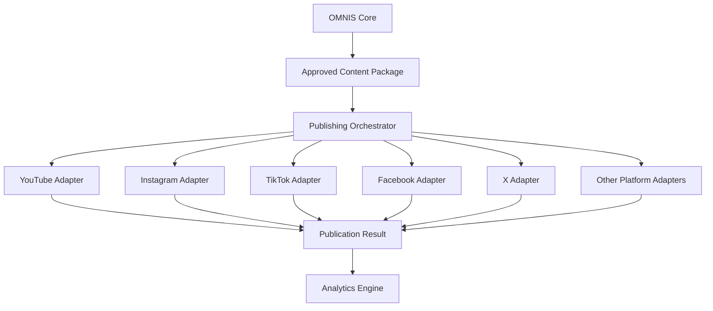
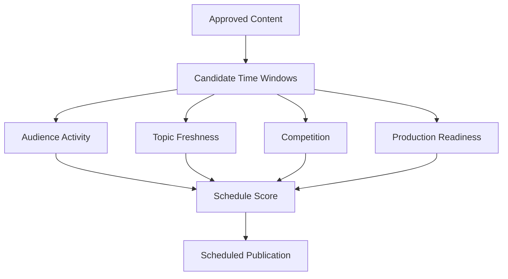
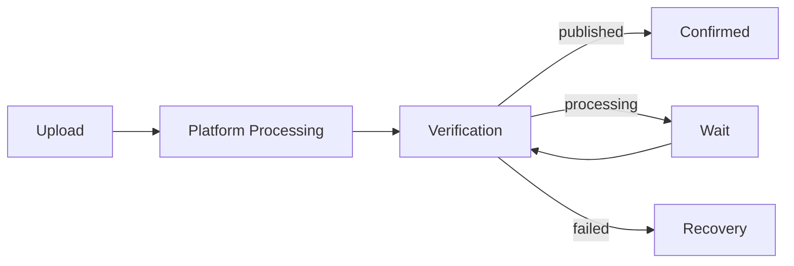
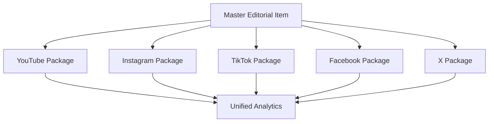
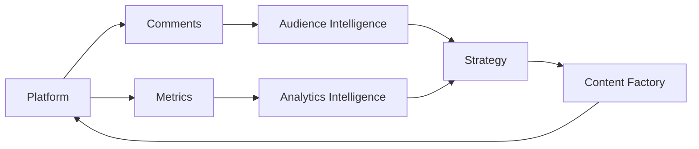
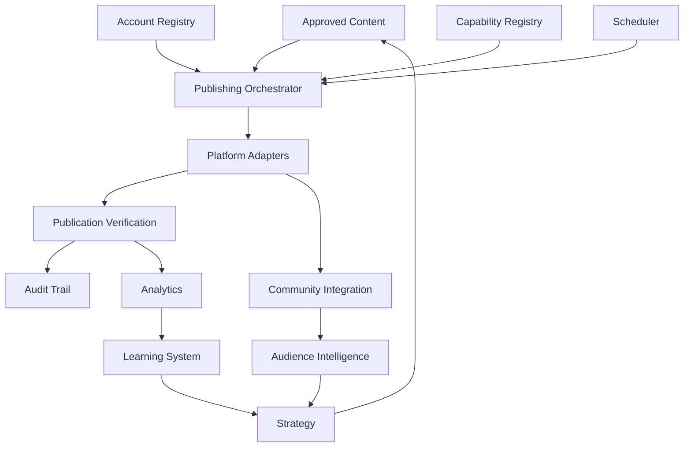

# OMNIS Platform Integration and Publishing Engine Specification

> Version: 1.0.0  
> Status: Architecture Specification  
> Domain: Social Platform Integration / Publishing / Account Management / Scheduling / Community / Analytics

## 1. Purpose

The Platform Integration and Publishing Engine connects OMNIS to authorized social platforms and converts approved OMNIS content packages into platform-native publication operations.

The engine must treat each platform as a distinct capability surface while exposing a canonical internal publishing model.



## 2. Core Principle

Publishing is an audited state transition, not a simple upload button.

```text
DRAFT
→ APPROVED
→ SCHEDULED
→ UPLOAD_PREPARATION
→ UPLOADING
→ PLATFORM_PROCESSING
→ PUBLISHED
→ VERIFIED
```

## 3. Platform Registry

OMNIS maintains a registry describing platform capabilities, authentication requirements, upload constraints and supported metadata.

```yaml
platform:
  id: youtube
  capabilities:
    video_upload: true
    scheduling: true
    captions: true
    playlists: true
    comments: true
    analytics: true
```

## 4. Capability Discovery

The registry allows the publishing engine to determine what operations are supported before creating a platform job.

## 5. Canonical Content Package

All approved content enters publishing through a normalized package.

```yaml
content_package:
  id: package_001
  content_id: content_001
  master_asset: master.mp4
  title: "Example title"
  description: "Example description"
  captions: captions.vtt
  thumbnail: thumbnail.jpg
  tags: []
  chapters: []
```

## 6. Platform Projection

The same canonical package can produce different platform projections.

## 7. Native Packaging

A platform projection may modify dimensions, duration, captions, cover image, metadata or formatting while preserving the approved editorial intent.

## 8. Account Registry

Every connected social account is represented by a managed account entity.

```yaml
account:
  id: account_001
  platform: youtube
  channel_id: channel_001
  status: connected
```

## 9. Multi-Account Support

OMNIS must support many accounts across multiple platforms and channels.

## 10. Account Isolation

Credentials and tokens must remain isolated by account and never be exposed to ordinary content agents.

## 11. OAuth

Platform authentication uses supported OAuth or equivalent official authorization mechanisms.

## 12. Token Lifecycle

Access tokens and refresh tokens are stored through a secure credential subsystem.

## 13. Token Rotation

Expired or rotated credentials trigger controlled reauthorization workflows.

## 14. Permission Scopes

Only the minimum required platform scopes should be requested.

## 15. Credential Boundary

Publishing agents receive scoped capabilities rather than raw credentials whenever possible.

## 16. Upload Preparation

Before upload, the engine validates media format, duration, dimensions, audio tracks, captions and metadata.

## 17. Media Validation

```text
codec
container
resolution
frame rate
audio sample rate
channel layout
duration
file integrity
```

## 18. Thumbnail Validation

Thumbnail assets are validated against platform dimensions, file size and content requirements.

## 19. Caption Validation

Caption files are validated for syntax, timing and encoding.

## 20. Metadata Validation

Titles, descriptions, tags, chapters and other metadata are validated before transmission.

## 21. Scheduling

The Scheduling Engine determines when an approved package should be published.



## 22. Schedule Constraints

Schedules must respect campaign deadlines, platform limits, channel cadence and production dependencies.

## 23. Time Zones

Publication schedules use explicit time zones and preserve the intended local publication time.

## 24. Calendar Integration

Content schedules can be projected into the OMNIS calendar and external calendar systems where authorized.

## 25. Queue Priority

Publishing jobs are prioritized by deadline, freshness, strategic value and dependencies.

## 26. Trend Expiration

Trend-sensitive content receives urgency based on expected opportunity decay.

## 27. Evergreen Scheduling

Evergreen content can be scheduled around long-term audience and portfolio objectives.

## 28. Batch Publishing

Compatible platform jobs can be queued in batches while respecting platform rate limits.

## 29. Upload Resumption

Interrupted uploads should resume when supported rather than restarting unnecessarily.

## 30. Retry Policy

Retries use bounded exponential backoff and platform-specific error classification.

## 31. Error Classification

```text
AUTH_ERROR
RATE_LIMIT
NETWORK_ERROR
MEDIA_ERROR
METADATA_ERROR
PLATFORM_ERROR
POLICY_ERROR
UNKNOWN_ERROR
```

## 32. Dead Letter Queue

Repeatedly failed jobs enter a dead letter queue for diagnosis and controlled intervention.

## 33. Idempotency

Publishing operations use idempotency keys where supported to prevent duplicate publication.

## 34. Duplicate Prevention

Before retrying a failed publication, OMNIS verifies whether the platform already accepted the content.

## 35. Publication Verification

A successful API response is not necessarily the final publication state.

## 36. Verification Loop



## 37. Publication Receipt

Every successful publication produces a receipt containing platform identifiers, timestamps and relevant metadata.

## 38. Publication State

```text
CREATED
VALIDATED
SCHEDULED
UPLOADING
PROCESSING
PUBLISHED
VERIFIED
FAILED
CANCELLED
```

## 39. Audit Trail

Every state transition is recorded.

## 40. Platform IDs

External platform IDs are stored alongside internal OMNIS identifiers.

## 41. URL Mapping

Where platform APIs expose canonical URLs, they are stored as publication references.

## 42. Analytics Binding

Publication records become the primary link between published assets and platform analytics.

## 43. Comment Integration

Where authorized APIs permit, the engine can ingest comments associated with published content.

## 44. Comment Actions

Supported actions depend on platform capabilities and authorization scopes.

```text
read
reply
moderate
hide
report
like/react
```

## 45. Community Posts

Where supported, OMNIS can schedule or publish community-oriented posts through platform adapters.

## 46. Playlist Management

Where supported, published videos can be assigned to configured playlists.

## 47. Series Management

Content can be associated with logical series even when platform-specific representations differ.

## 48. Cross-Platform Publishing

One editorial item may produce several native publications.



## 49. Cross-Platform Adaptation

Each derivative can adapt hook, duration, captions, aspect ratio and metadata for the destination platform.

## 50. Canonical Identity

Cross-platform publications retain a shared OMNIS content identity for attribution.

## 51. Campaigns

Campaigns group related publications, assets and analytics.

## 52. Campaign State

```yaml
campaign:
  id: campaign_001
  status: active
  content_ids: []
  platforms:
    - youtube
    - instagram
```

## 53. Publishing Windows

Campaigns may define preferred and forbidden publication windows.

## 54. Platform Constraints

Each adapter must expose platform-specific limits rather than hiding them inside generic business logic.

## 55. API Rate Limits

Rate limits are tracked per provider, account and operation where applicable.

## 56. Rate-Limit Scheduler

The scheduler delays non-critical jobs when limits are exhausted.

## 57. Backpressure

High publishing volume must not overwhelm platform APIs or internal workers.

## 58. Concurrency

Concurrency is controlled per platform and account.

## 59. Webhooks

Where supported, webhooks may update publication state without polling.

## 60. Polling Fallback

If webhooks are unavailable, controlled polling verifies processing and publication status.

## 61. Platform Adapter Contract

Each adapter implements a stable internal interface.

```text
connect()
validate()
prepare()
upload()
schedule()
verify()
fetch_metrics()
fetch_comments()
perform_action()
```

## 62. Adapter Isolation

Platform-specific implementation details must not leak into the core publishing domain model.

## 63. API Versioning

Adapters record platform API versions and capability versions.

## 64. Capability Changes

A platform capability change must not silently break unrelated publishing jobs.

## 65. Feature Flags

New platform capabilities can be rolled out through feature flags.

## 66. Dry Run

Publishing jobs support dry-run validation without external publication.

## 67. Sandbox

Where platforms provide sandbox or test environments, integration tests should use them.

## 68. Test Fixtures

Platform adapters maintain deterministic fixtures for API responses and error conditions.

## 69. Security

Publishing credentials, tokens and private account information are treated as secrets.

## 70. Secret Storage

Secrets are stored in the designated secure credential service rather than repository files.

## 71. Agent Security

Content agents cannot directly obtain arbitrary publishing credentials.

## 72. Approval Policy

Publishing authority can be configured per channel, platform, content class and risk level.

## 73. Human Approval

High-risk, commercial or sensitive publications may require explicit operator approval.

## 74. Autonomous Publishing

Low-risk content may be published autonomously only when the account policy permits it.

## 75. Emergency Stop

Operators must be able to stop scheduled or pending publishing jobs globally or by channel.

## 76. Channel Kill Switch

Each channel has an independent emergency publishing disable switch.

## 77. Account Disable

A compromised or disconnected account can be immediately disabled.

## 78. Reconciliation

The engine periodically reconciles OMNIS publication records with platform state.

## 79. Orphan Detection

Unexpected platform publications or missing OMNIS records are flagged for investigation.

## 80. Drift Detection

Metadata and publication-state differences between OMNIS and the platform are detected.

## 81. Analytics Synchronization

Publication IDs are used to associate analytics with the correct content version.

## 82. Content Versioning

A content item may have multiple approved versions but only explicitly selected versions may be published.

## 83. Rollback

Where platform capabilities allow editing or replacement, recovery workflows can be initiated without corrupting historical records.

## 84. Deletion Policy

Destructive platform operations require explicit authorization and audit logging.

## 85. Moderation Integration

Authorized moderation operations are exposed through a controlled community subsystem rather than arbitrary agents.

## 86. Audience Feedback

Comments and community signals flow into the Audience Intelligence Engine.



## 87. Platform-Specific Metadata

Adapters may add platform-native metadata without changing the canonical editorial source.

## 88. Localization

Localized content can be published as platform-specific derivatives while preserving content lineage.

## 89. Content Lineage

Every publication points back to the canonical content, Character state, production job and approved package.

## 90. Publication Lineage

```text
Character Snapshot
      ↓
Editorial Brief
      ↓
Production Job
      ↓
Master Asset
      ↓
Platform Derivative
      ↓
Publication
      ↓
Analytics
```

## 91. Observability

The publishing system exposes queue depth, upload latency, failure rate, API errors, rate-limit usage and verification latency.

## 92. Alerts

Alerts can be generated for repeated authentication failures, publication failures, abnormal API behavior or account state changes.

## 93. Cost Tracking

Where platform APIs or infrastructure incur measurable costs, publishing operations can be attributed to channels and campaigns.

## 94. Reliability

The publishing engine should be designed for eventual consistency with external platforms.

## 95. Disaster Recovery

Publication state, schedules and credentials metadata must be recoverable according to configured backup policies.

## 96. Data Retention

Audit and publication records follow configurable retention policies.

## 97. Platform Expansion

Adding a new platform should require a new adapter and capability declaration rather than rewriting the core publishing engine.

## 98. Final Architecture



## 99. Operational Contract

The Platform Integration and Publishing Engine MUST securely connect authorized accounts, validate approved content packages, project canonical content into platform-native formats, schedule and publish content, handle retries and rate limits, verify external state, maintain publication lineage, integrate comments and analytics where authorized, support emergency controls, and remain extensible through isolated platform adapters.

## 100. Final Contract

The engine MUST never treat external platform APIs as trusted deterministic systems. It MUST use explicit state machines, idempotency, reconciliation, audit trails, scoped credentials, capability discovery, error classification and verification. It MUST preserve the relationship between Character state, editorial intent, production artifacts, platform derivatives, publications, audience feedback and analytics so that OMNIS can operate a large multi-channel media portfolio safely and continuously.
