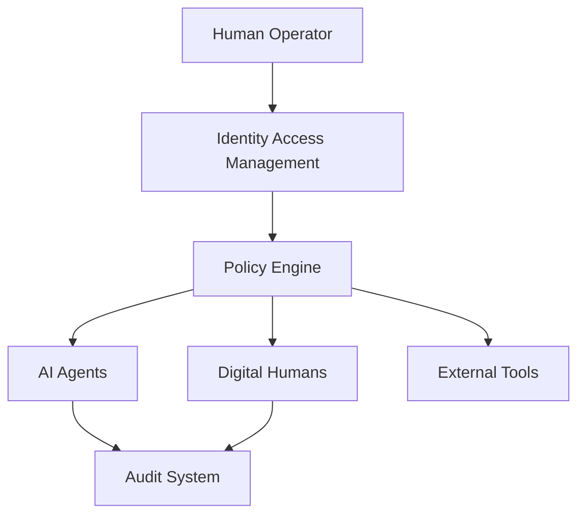
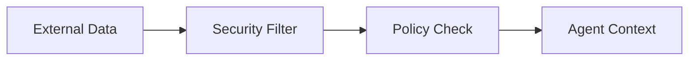
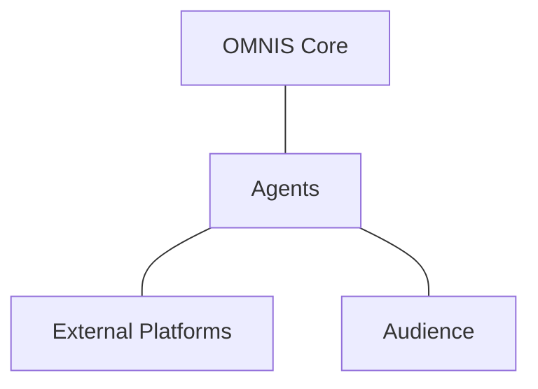

# OMNIS Security Privacy Governance and Trust Specification

> Version: 1.0.0
> Domain: Security / Privacy / Governance / Trust

## 1. Purpose

This specification defines the security foundation for OMNIS as an autonomous AI content operating system managing Characters, Agents, social accounts, memories, audience data and external integrations.



## 2. Security Philosophy

OMNIS follows a zero-trust architecture:

```text
Never trust by default
Verify every identity
Limit every permission
Record every important action
```

## 3. Identity Model

Entities requiring identity:

- Human operators
- Characters
- Agents
- Services
- Platform accounts
- External integrations

## 4. Access Control

Permissions are capability based.

```text
Agent
 ├── Can Research
 ├── Can Draft
 ├── Cannot Publish
 └── Cannot Access Secrets
```

## 5. Agent Permissions

Every Agent receives only the minimum permissions required for its task.

## 6. Character Isolation

Each Digital Human has isolated:

- Memory
- Personality
- Credentials
- Audience relationships
- Content history

## 7. Secrets Management

API keys, tokens and credentials must never exist inside source code.

## 8. OAuth Security

External platform access uses secure authorization flows and scoped permissions.

## 9. Memory Privacy

Character memories and audience interactions require controlled access policies.

## 10. Audience Data Protection

Audience intelligence must collect and process only authorized information.

## 11. Prompt Injection Defense

Agents must treat external content as untrusted input.



## 12. Tool Sandboxing

Agents operate inside controlled execution environments.

## 13. Human Approval Gates

High-impact actions may require human approval:

- Publishing sensitive content
- Financial actions
- Account changes
- Destructive operations

## 14. Audit System

Important events are recorded:

```text
Who
What
When
Why
Result
```

## 15. Policy Engine

Central policy evaluation controls autonomous behavior.

## 16. Content Governance

Content decisions consider:

- Platform rules
- Brand identity
- Audience trust
- Legal requirements

## 17. Trust Boundaries



## 18. Monitoring

Security monitoring detects:

- Unusual agent behavior
- Permission escalation
- Failed authentication
- Data access anomalies

## 19. Incident Response

Security incidents follow:

```text
Detect
Analyze
Contain
Recover
Learn
```

## 20. Emergency Controls

OMNIS must provide:

- Global stop
- Agent disable
- Channel disable
- Account disconnect

## 21. Final Contract

OMNIS security architecture MUST preserve user trust, protect credentials, isolate autonomous systems, enforce permissions, maintain auditability and allow safe scaling from a small content system to thousands of AI-driven Characters and Agents.
