# OMNIS Orchestrator Specification

> Version: 1.0.0  
> Status: Implementation Specification  
> Domain: Core Runtime / Agent Mesh  
> Purpose: Define how OMNIS decomposes goals, schedules Tasks, coordinates Agents, enforces budgets and policies, handles failures, and closes the learning loop.

---

## 1. Purpose

The Orchestrator is the control plane of OMNIS. It converts high-level objectives into governed executable work while preserving task contracts, identity, policy, context, resources, provenance and learning signals.

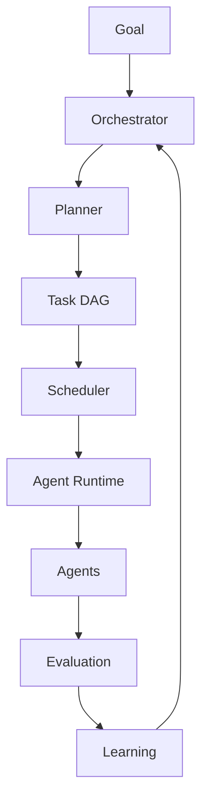

The Orchestrator does not replace Agents. It coordinates them.

---

## 2. Core Principle

OMNIS follows:

```text
Goal
  ↓
Plan
  ↓
Contracts
  ↓
Schedule
  ↓
Execute
  ↓
Observe
  ↓
Evaluate
  ↓
Learn
  ↓
Re-plan
```

The system must remain observable and interruptible at every stage.

---

## 3. Responsibilities

The Orchestrator is responsible for:

- goal interpretation;
- workflow creation;
- task decomposition;
- dependency management;
- Agent selection;
- model routing;
- scheduling;
- budget allocation;
- concurrency control;
- retry and recovery decisions;
- escalation;
- cancellation;
- aggregation;
- workflow state;
- provenance;
- evaluation routing;
- learning-event emission.

---

## 4. Non-Responsibilities

The Orchestrator MUST NOT own:

```text
Agent reasoning
Long-term memory contents
Provider-specific model internals
Raw secret storage
UI rendering
Platform-specific publishing logic
```

These belong to specialized subsystems.

---

## 5. Control Plane vs Data Plane

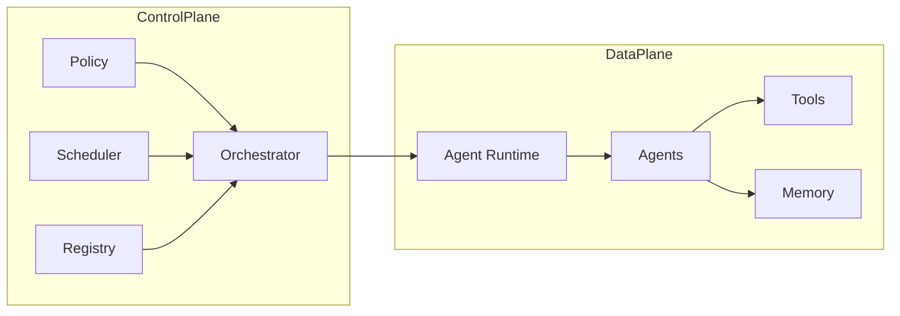

The control plane governs execution; the data plane performs work.

---

## 6. Goal Object

```yaml
goal:
  id: goal_01
  type: content.campaign.create
  objective: "Create a complete weekly campaign"
  owner: system
  priority: high
```

Goals are converted into workflows.

---

## 7. Workflow Object

```yaml
workflow:
  id: wf_01
  goal_id: goal_01
  status: planning
  priority: high
  budget_usd: 25
  deadline: 2026-08-17T12:00:00Z
```

A workflow contains one or more Tasks.

---

## 8. Workflow Lifecycle

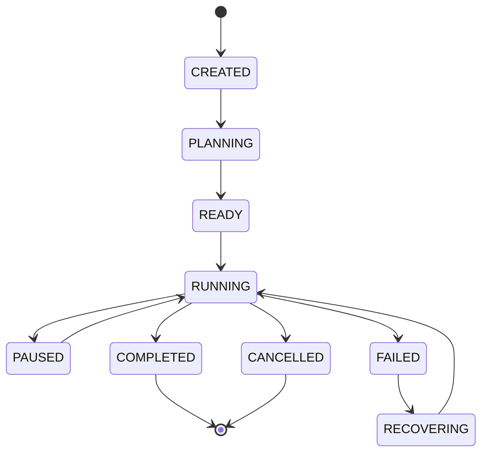

---

## 9. Planning

Planning converts the goal into a task graph.

```text
Goal
 ↓
Constraints
 ↓
Capabilities
 ↓
Task decomposition
 ↓
Dependencies
 ↓
Budget allocation
 ↓
Executable DAG
```

Planning may use deterministic rules, LLM reasoning, historical plans or a hybrid.

---

## 10. Planner Architecture

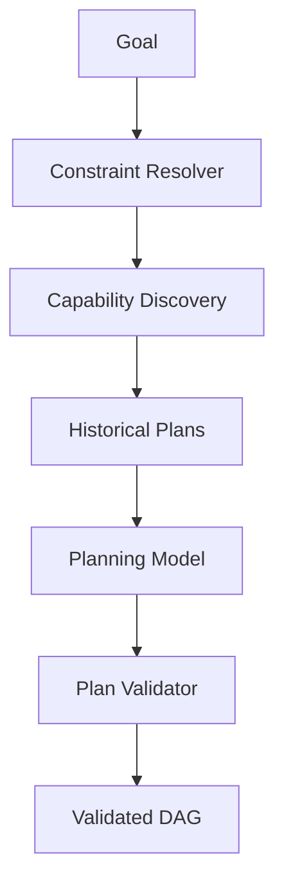

Plans MUST pass validation before execution.

---

## 11. Capability Discovery

The Planner queries the Agent Registry for capabilities.

Example:

```text
Need: historical gaming research

Candidates:
- research.gaming.v3
- research.history.v2
- factcheck.general.v4
```

Capability matching is preferable to hard-coded Agent names.

---

## 12. Agent Selection

Selection considers:

```text
capability
quality
availability
latency
cost
policy
language
specialization
historical performance
```

The best Agent is not always the most powerful model.

---

## 13. Agent Score

Conceptual score:

```text
Score =
  capability_fit
+ quality_score
+ reliability
+ historical_success
- cost_penalty
- latency_penalty
- risk_penalty
```

Weights are configurable by policy.

---

## 14. Dynamic Routing

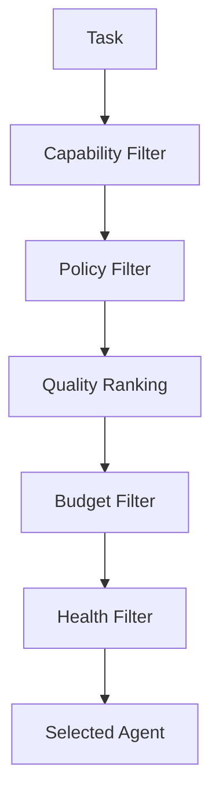

Routing happens immediately before execution to account for current health.

---

## 15. Task Queue

The scheduler maintains logical queues.

```text
critical
interactive
production
batch
background
learning
maintenance
```

Queues may map to different resource pools.

---

## 16. Scheduling

Scheduling considers:

```text
priority
deadline
dependencies
resource availability
Agent capacity
cost budget
fairness
rate limits
```

---

## 17. Fairness

One workflow must not monopolize the entire Agent fleet.

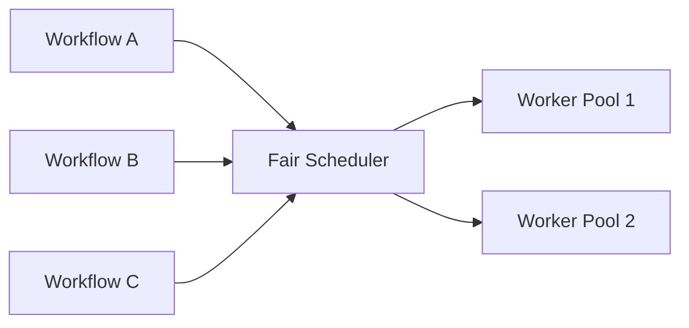

Fairness policies are configurable.

---

## 18. Priority Inversion

High-priority tasks may be blocked by low-priority dependencies.

The scheduler SHOULD detect this condition and temporarily elevate required dependencies.

```text
High Task
   ↓
Low Task dependency
   ↓
Priority inheritance
```

---

## 19. Deadline Awareness

Tasks near deadline receive scheduling preference when safe.

```text
deadline distance
      ↓
urgency score
      ↓
scheduling priority
```

Deadline urgency MUST NOT override security or policy controls.

---

## 20. DAG

The canonical workflow representation is a Directed Acyclic Graph.

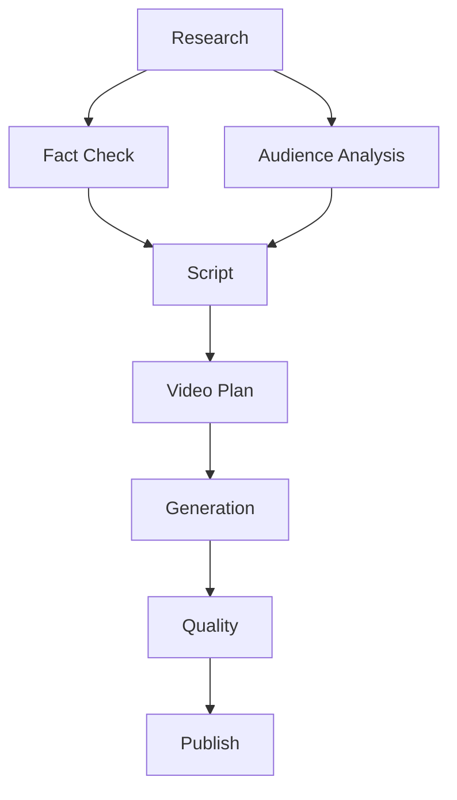

---

## 21. Dependency Semantics

Dependencies can mean:

```text
completion dependency
successful dependency
data dependency
approval dependency
resource dependency
```

The contract MUST specify which semantics apply.

---

## 22. Parallel Execution

Independent tasks should execute concurrently when budget permits.

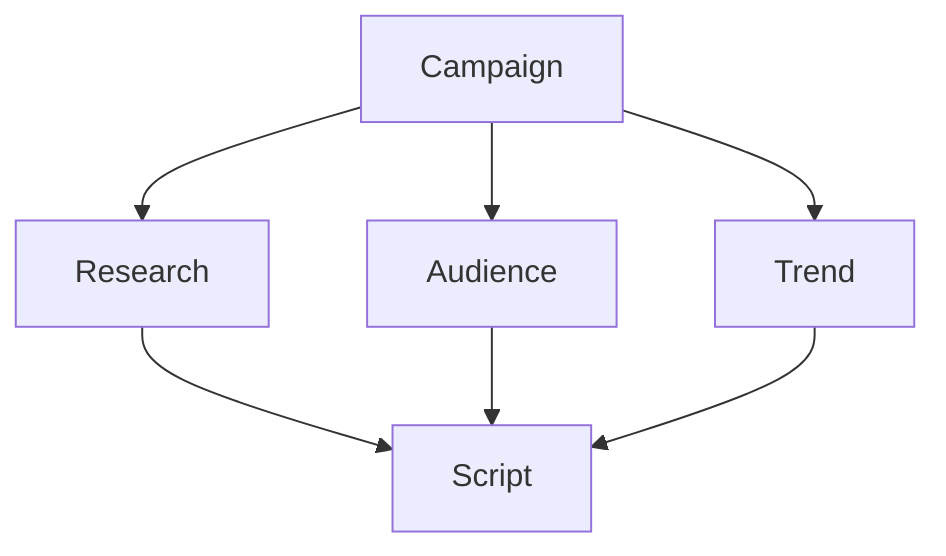

Parallelism reduces latency without sacrificing correctness.

---

## 23. Concurrency Limits

Every workflow may declare:

```yaml
execution:
  max_parallel_tasks: 10
```

Global policy may impose lower limits.

---

## 24. Backpressure

When workers are saturated:

```text
Queue grows
 ↓
Backpressure detector
 ↓
Throttle task creation
 ↓
Preserve critical capacity
```

Backpressure is mandatory for large Agent fleets.

---

## 25. Queue Admission

Before accepting work the Orchestrator checks:

```text
policy
budget
capacity
deadline
dependency validity
```

Rejected work receives an explicit reason.

---

## 26. Resource Allocation

Budget may be allocated top-down.

```text
Workflow $25
├── Research $5
├── Script $4
├── Production $10
├── QA $3
└── Reserve $3
```

---

## 27. Adaptive Budgeting

Unused budget may be reassigned according to policy.

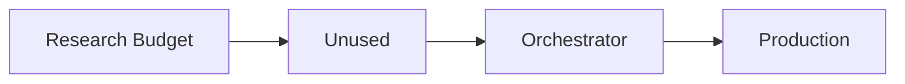

Budget reallocation must be auditable.

---

## 28. Cost-Aware Routing

When two Agents meet quality requirements, lower expected cost SHOULD be preferred.

```text
Agent A: quality .92 / $0.80
Agent B: quality .90 / $0.20

If minimum = .88 → B
```

---

## 29. Quality-Aware Routing

If minimum quality is high:

```text
minimum = .95
A = .92
B = .97

Select B
```

Quality requirements override cost optimization.

---

## 30. Model Cascade

A task may begin with a low-cost model and escalate when required.

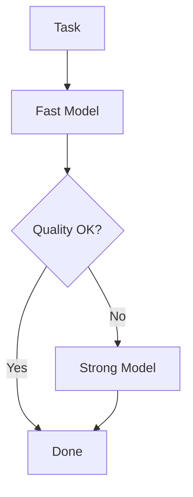

Escalation consumes additional budget.

---

## 31. Fallback Agents

If the selected Agent fails:

```text
Primary
 ↓ failure
Fallback 1
 ↓ failure
Fallback 2
 ↓
Recovery / human escalation
```

Fallback compatibility must be checked against the Task Contract.

---

## 32. Retry Controller

Retries are orchestrated centrally.

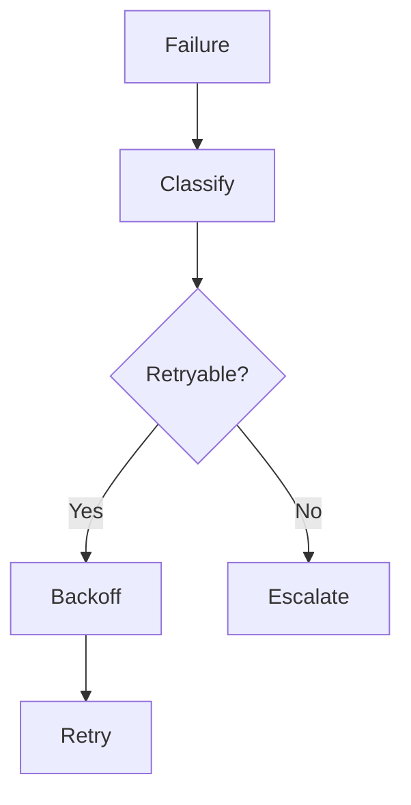

Agents should not implement uncontrolled retry loops.

---

## 33. Circuit Breaker

Repeated Agent failures trigger isolation.

```text
Healthy
  ↓ failures
Degraded
  ↓ threshold
Open
  ↓ cooldown
Half-Open
  ↓ success
Healthy
```

---

## 34. Agent Health

The Orchestrator consumes health signals:

```text
availability
error rate
latency
quality drift
cost anomalies
rate-limit state
```

---

## 35. Agent Quarantine

Agents with severe failures may be quarantined.

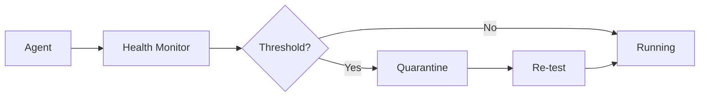

---

## 36. Human Escalation

The Orchestrator can create human-review tasks.

```yaml
escalation:
  type: human_review
  reason: quality_failure
  deadline: 2h
```

Human review is a first-class workflow node.

---

## 37. Approval Gates

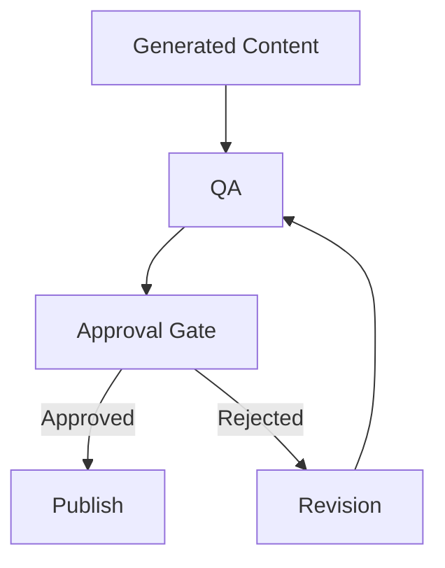

---

## 38. Policy Engine

Every execution passes policy checks.

```text
Task
 ↓
Policy Engine
 ↓
Allowed / Denied / Escalate
```

The Orchestrator cannot bypass policy.

---

## 39. Policy Categories

```text
security
privacy
content safety
financial
publishing
data residency
age restrictions
platform rules
```

---

## 40. Permission Propagation

Child tasks inherit only permitted authority.

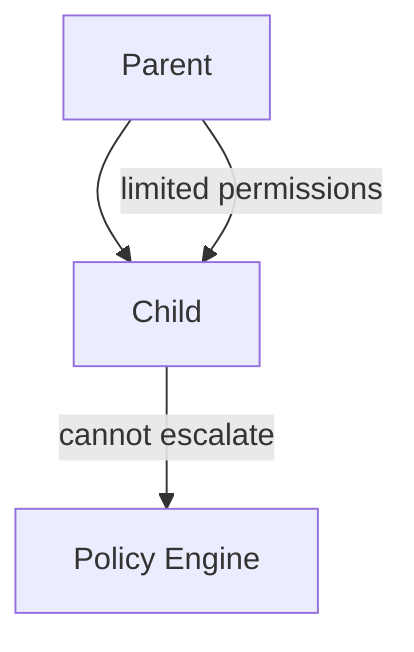

---

## 41. Context Assembly

Before dispatch, the Orchestrator requests context.

```text
Task Contract
 + Character State
 + Audience State
 + Relevant Memory
 + Environment
 = Execution Context
```

Context assembly is relevance-based.

---

## 42. Character Workflow

Virtual influencer workflows may include:

```text
identity
personality
knowledge
mood
health
voice
appearance
wardrobe
hair
makeup
continuity
audience relationships
```

These states are orchestrated as coordinated tasks rather than a single monolithic prompt.

---

## 43. Character State DAG

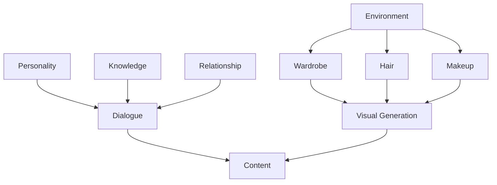

---

## 44. Audience Request Pipeline

Member requests can become production tasks.

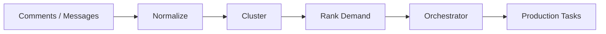

This closes the audience-to-content loop.

---

## 45. Demand Ranking

Signals may include:

```text
request count
unique members
recency
loyalty
engagement
trend velocity
commercial value
content fit
```

Ranking must not expose private member data to unrelated Agents.

---

## 46. Content Factory Workflow

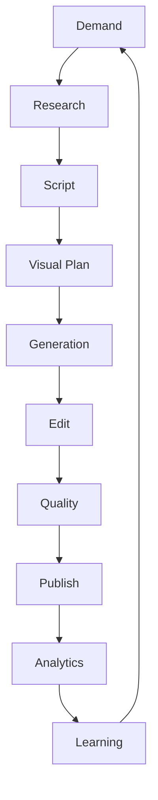

The factory is therefore a feedback system, not a linear pipeline.

---

## 47. Trend Response

Time-sensitive trends can trigger accelerated workflows.

```text
Trend detected
 ↓
Relevance check
 ↓
Audience demand
 ↓
Deadline estimation
 ↓
Fast-track workflow
```

Fast-track still obeys policy and quality gates.

---

## 48. Seasonal Context

For characters, scheduling may consider:

```text
season
weather
local time
holidays
location
recent wardrobe history
```

This supports visual continuity.

---

## 49. Temporal Consistency

The Orchestrator can require state continuity across generated content.

```text
Episode 10
hair = brown
beard = 12mm
jacket = black

Episode 11
→ inherited unless an explicit change event exists
```

---

## 50. State Change Events

Changes should be explicit.

```yaml
event:
  type: character.hair.color_changed
  character_id: char_01
  from: brown
  to: copper
  effective_at: 2026-08-16
```

---

## 51. Experience Loop

Agents improve through outcomes.

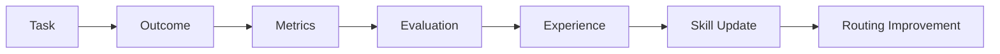

The Orchestrator uses experience indirectly through Registry and Learning systems.

---

## 52. Skill-Aware Routing

An Agent with stronger historical performance in a domain receives a routing advantage.

```text
Gaming research
Agent A: 0.81
Agent B: 0.94

→ prefer B
```

Historical performance must be statistically meaningful and freshness-aware.

---

## 53. Exploration vs Exploitation

The scheduler may occasionally test new Agents.

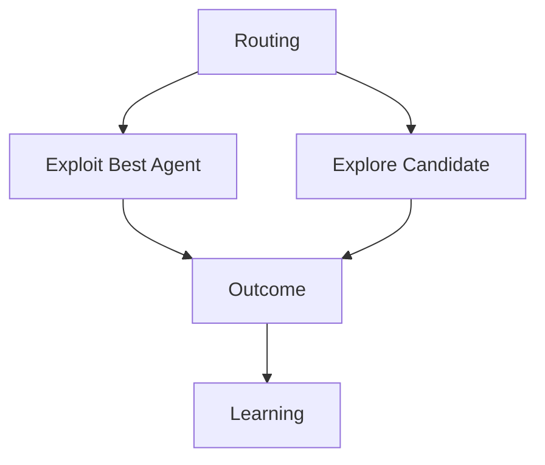

Exploration budgets must be capped.

---

## 54. Canary Execution

New Agent versions can receive a small percentage of tasks.

```text
Stable: 95%
Canary: 5%
```

Promotion requires quality and reliability evidence.

---

## 55. A/B Evaluation

The Orchestrator can route equivalent workloads to competing strategies.

```text
Plan A → 50%
Plan B → 50%
```

Evaluation compares normalized outcomes.

---

## 56. Workflow Versioning

Plans are versioned.

```text
workflow v1
workflow v2
workflow v3
```

Running workflows retain their original execution plan unless explicitly migrated.

---

## 57. Plan Migration

Migration requires:

```text
compatibility check
state mapping
budget reconciliation
approval
rollback plan
```

---

## 58. Long-Running Workflows

Some workflows may last hours, days or weeks.

The Orchestrator must persist:

```text
workflow state
pending tasks
completed tasks
budgets
checkpoints
external references
```

---

## 59. Checkpointing

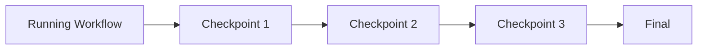

Checkpointing enables recovery after infrastructure failures.

---

## 60. Resume Semantics

After restart:

```text
Load workflow
 ↓
Validate checkpoint
 ↓
Reconcile external state
 ↓
Resume pending tasks
```

Completed idempotent tasks should not be repeated unnecessarily.

---

## 61. External State Reconciliation

Publishing and social APIs may change outside OMNIS.

```text
OMNIS state
    ↕
Platform state
    ↓
Reconciliation Agent
```

External truth must be checked before destructive actions.

---

## 62. Event-Driven Orchestration

Events can trigger new workflows.

```mermaid
flowchart LR
    E[Event Bus] --> O[Orchestrator]
    O --> W[Workflow]
    W --> T[Tasks]
```

Examples:

```text
video.published
comment.spike_detected
trend.detected
member.request_clustered
agent.degraded
```

---

## 63. Event Deduplication

Events require idempotent processing.

```yaml
event:
  id: evt_123
```

Duplicate events MUST NOT create duplicate workflows unless explicitly allowed.

---

## 64. Workflow Triggers

Triggers can be:

```text
scheduled
manual
event-driven
threshold-driven
content-demand-driven
system-driven
```

---

## 65. Scheduling Calendar

The Orchestrator should support:

```text
publication calendar
campaign windows
platform peak hours
seasonal campaigns
trend deadlines
Agent maintenance windows
```

---

## 66. Multi-Platform Coordination

A single campaign can produce platform-specific Tasks.

```mermaid
flowchart TD
    C[Campaign] --> Y[YouTube]
    C --> I[Instagram]
    C --> T[TikTok]
    C --> X[X]
    C --> S[Shorts]
```

Each platform task has its own contract.

---

## 67. Platform Adaptation

The Orchestrator should not simply duplicate content.

```text
Master Content
 ↓
Platform Adaptation
 ├── YouTube Long
 ├── Shorts
 ├── Instagram Reel
 └── TikTok
```

---

## 68. Content Repurposing

Repurposing is a workflow graph.

```mermaid
flowchart TD
    M[Master Video] --> L[Long Form]
    M --> S1[Short 1]
    M --> S2[Short 2]
    M --> R[Reel]
    M --> P[Post]
```

---

## 69. Publishing Safety

Publishing Tasks require:

```text
correct account
correct target
approved content
valid credentials
idempotency key
platform policy check
```

---

## 70. Revenue Workflows

OMNIS may orchestrate monetization-related tasks:

```text
sponsor discovery
affiliate opportunity
product matching
campaign analysis
revenue analytics
```

Financial actions require appropriate authorization.

---

## 71. Analytics Loop

```mermaid
flowchart LR
    P[Published Content] --> A[Analytics]
    A --> D[Diagnosis]
    D --> R[Recommendations]
    R --> O[Orchestrator]
    O --> N[Next Campaign]
```

---

## 72. KPI-Aware Planning

Plans can optimize for:

```text
CTR
retention
watch time
engagement
subscriber conversion
revenue
return viewers
```

Metrics should be weighted according to campaign objective.

---

## 73. Reward Function

Conceptual campaign reward:

```text
Reward =
  retention * w1
+ engagement * w2
+ conversion * w3
+ revenue * w4
- cost * w5
```

The exact formula is policy-configurable.

---

## 74. Learning Feedback

Analytics should not directly mutate Agents.

```text
Analytics
 ↓
Evaluation
 ↓
Learning System
 ↓
Validated update
 ↓
Registry / Memory
```

This protects system stability.

---

## 75. Prompt / Strategy Versioning

Orchestration strategies are versioned.

```text
planner-v1
planner-v2
router-v3
```

Execution records the exact strategy version.

---

## 76. Observability

Every workflow must be traceable.

```text
Goal
 └─ Workflow
     ├─ Task
     │   └─ Attempt
     │       └─ Tool call
     └─ Task
```

Trace IDs connect the entire hierarchy.

---

## 77. Execution Timeline

The system should record:

```text
queued_at
started_at
completed_at
attempts
state transitions
resource consumption
```

This enables latency diagnosis.

---

## 78. Explainability

For major decisions the Orchestrator should record structured reasons.

```yaml
decision:
  selected_agent: gaming_research_v3
  reasons:
    - capability_fit
    - historical_quality
    - available_budget
```

Sensitive internal reasoning must not be exposed as unrestricted chain-of-thought.

---

## 79. Decision Audit

```mermaid
flowchart TD
    D[Decision] --> C[Constraints]
    D --> E[Evidence]
    D --> M[Metrics]
    D --> P[Policy]
    D --> O[Outcome]
```

This provides auditable decision provenance.

---

## 80. Security Boundaries

The Orchestrator communicates through explicit gateways.

```text
Orchestrator
├── Agent Registry
├── Policy Gateway
├── Runtime Gateway
├── Memory Gateway
├── Tool Gateway
└── Event Bus
```

Direct arbitrary infrastructure access is forbidden.

---

## 81. Tenant Isolation

Workflows are tenant-scoped.

```yaml
workflow:
  tenant_id: tenant_001
```

Every downstream Task inherits tenant identity.

---

## 82. Rate Limits

The scheduler must respect:

```text
provider limits
platform API limits
Agent concurrency limits
workflow limits
tenant limits
```

---

## 83. Adaptive Throttling

```mermaid
flowchart LR
    U[Usage] --> M[Monitor]
    M --> T[Throttle Controller]
    T --> S[Scheduler]
```

Throttling should protect both cost and external integrations.

---

## 84. Failure Domains

Failures should be isolated by domain.

```text
Provider failure
≠
Agent fleet failure
≠
Workflow failure
```

The Orchestrator should recover at the narrowest possible scope.

---

## 85. Bulkhead Isolation

Separate pools may be maintained for:

```text
interactive
production
publishing
learning
maintenance
```

A publishing incident should not stop interactive chat.

---

## 86. Disaster Recovery

Persistent workflow state must support recovery from:

```text
process crash
node failure
provider outage
database restart
network partition
```

---

## 87. Recovery Strategy

```mermaid
flowchart TD
    F[Failure] --> C[Checkpoint]
    C --> R[Restore]
    R --> V[Validate State]
    V --> X[Resume]
```

---

## 88. Multi-Region Orchestration

Large deployments may use regional schedulers.

```mermaid
flowchart TD
    G[Global Control] --> EU[EU Scheduler]
    G --> US[US Scheduler]
    G --> APAC[APAC Scheduler]
    EU --> W1[Workers]
    US --> W2[Workers]
    APAC --> W3[Workers]
```

Data residency rules determine routing.

---

## 89. Global vs Local State

```text
Global:
workflow identity
policy version
campaign metadata

Local:
worker health
regional queues
latency
```

State ownership must be explicit.

---

## 90. API Surface

Conceptual Orchestrator API:

```text
createWorkflow()
getWorkflow()
pauseWorkflow()
resumeWorkflow()
cancelWorkflow()
createTask()
getTask()
retryTask()
approveTask()
getExecutionGraph()
```

---

## 91. Event API

Events include:

```text
workflow.created
workflow.started
workflow.paused
workflow.completed
workflow.failed
task.created
task.started
task.completed
task.failed
agent.selected
agent.fallback
budget.exhausted
approval.required
```

---

## 92. Persistence Model

Recommended logical stores:

```text
Workflow Store
Task Store
Execution Store
Budget Store
Checkpoint Store
Decision Audit Store
```

These may share physical infrastructure but must preserve logical ownership.

---

## 93. State Consistency

Critical workflow state should use transactional semantics where required.

Examples:

```text
Task completion + budget settlement
Publication record + idempotency key
Approval + publish authorization
```

---

## 94. Testing Strategy

The Orchestrator requires:

```text
unit tests
contract tests
DAG tests
failure injection
load tests
chaos tests
replay tests
security tests
cost tests
```

---

## 95. Simulation Mode

A simulation mode should execute plans without external side effects.

```yaml
execution:
  mode: simulation
```

Useful for validating large workflows before production.

---

## 96. Dry Run

Dry run answers:

```text
What Agents would run?
What tools would be used?
What would it cost?
What dependencies exist?
What policies apply?
```

No irreversible side effects occur.

---

## 97. Acceptance Criteria

Orchestrator v1 is accepted when it can:

- create and persist workflows;
- validate plans;
- construct task DAGs;
- discover Agent capabilities;
- route Tasks;
- enforce budgets;
- schedule priorities;
- limit concurrency;
- propagate policies;
- execute retries;
- trigger fallbacks;
- quarantine unhealthy Agents;
- handle cancellation;
- support approvals;
- checkpoint workflows;
- recover failed workflows;
- emit lifecycle events;
- preserve provenance;
- coordinate audience-driven tasks;
- coordinate character continuity tasks;
- integrate analytics and learning;
- support simulation and dry-run execution.

---

## 98. Reference Architecture

```mermaid
flowchart TB
    API[Studio/API] --> O[Orchestrator]
    O --> PL[Planner]
    O --> SC[Scheduler]
    O --> PO[Policy Engine]
    O --> AR[Agent Registry]
    O --> RT[Agent Runtime]
    RT --> AG[Agent Fleet]
    AG --> TG[Tool Gateway]
    AG --> MG[Memory Gateway]
    O --> EB[Event Bus]
    EB --> AN[Analytics]
    AN --> EV[Evaluation]
    EV --> LE[Learning]
    LE --> AR
    O --> WS[Workflow Store]
    O --> OBS[Observability]
```

---

## 99. Operating Principle

The Orchestrator must make OMNIS behave like a coherent organization rather than a pile of independent AI Agents.

```text
Many Agents
     ↓
One governed execution fabric
     ↓
Coherent product
     ↓
Measured outcome
     ↓
Learning
     ↓
Better next execution
```

---

## 100. Final Contract

The OMNIS Orchestrator is the governed execution brain of the platform. It transforms objectives into validated workflows, assigns work to the best available capabilities, controls resources and permissions, coordinates thousands of Agents, handles failure and recovery, preserves continuity and provenance, and routes outcomes into evaluation and learning.

The canonical loop is:

```text
GOAL
 ↓
PLAN
 ↓
CONTRACT
 ↓
SCHEDULE
 ↓
EXECUTE
 ↓
OBSERVE
 ↓
EVALUATE
 ↓
LEARN
 ↓
RE-PLAN
```

This architecture allows OMNIS to scale from a single Agent performing one task to large autonomous content factories operating hundreds or thousands of coordinated Agents while maintaining explicit contracts, controlled authority, measurable quality and continuous improvement.