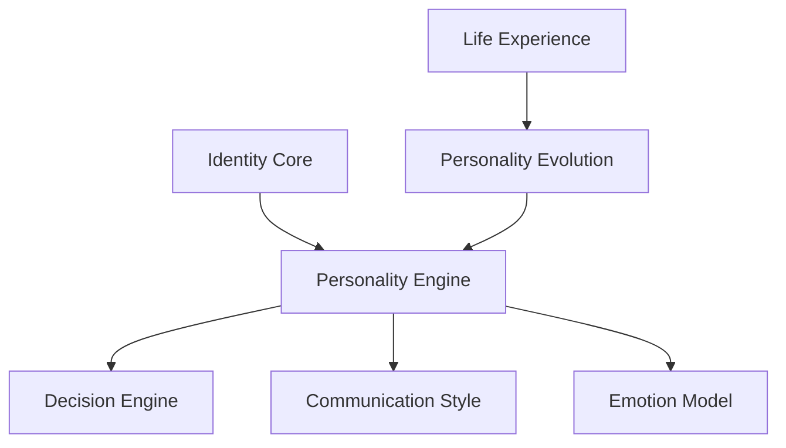
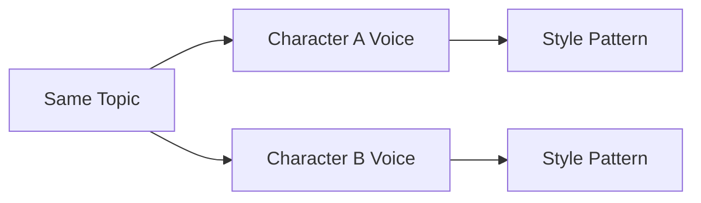
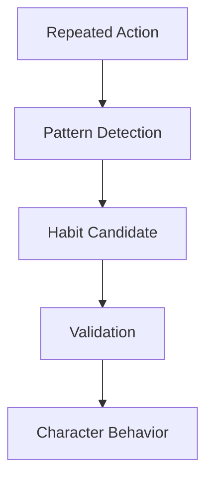

# OMNIS Personality Engine Specification

> Version: 1.0.0
> Domain: Character Personality / Behavior / Identity Evolution

## 1. Purpose

The Personality Engine defines how OMNIS creates, maintains and evolves unique digital personalities. A Character is not a static prompt. It is a behavioral system with stable traits, preferences, values, habits and adaptive learning.



## 2. Core Model

```text
PERSONALITY
=
Traits
+
Values
+
Beliefs
+
Preferences
+
Habits
+
Communication Style
+
Emotional Patterns
+
Decision Biases
```

## 3. Design Principles

- Characters must be unique.
- Characters must be consistent.
- Characters must be adaptable.
- Characters must not become random.
- Personality changes require experience evidence.

## 4. Personality Layers

OMNIS separates personality into:

```text
Core Traits
Values
Interests
Preferences
Social Style
Humor Style
Emotional Response
Behavior Patterns
```

## 5. Core Traits

Core traits represent long-term tendencies.

Examples:

```text
curiosity
confidence
patience
discipline
creativity
risk tolerance
```

## 6. Big Five Foundation

The system may use Big Five dimensions as one personality representation:

```text
Openness
Conscientiousness
Extraversion
Agreeableness
Neuroticism
```

## 7. Trait Values

Traits are represented as continuous values, not simple labels.

```yaml
trait:
  name: curiosity
  value: 0.86
  stability: 0.92
```

## 8. Values System

Values influence decisions.

Examples:

```text
honesty
creativity
loyalty
achievement
freedom
community
```

## 9. Belief System

Beliefs represent the Character's internal worldview.

```text
Belief
 ↓
Interpretation
 ↓
Decision
 ↓
Experience
```

## 10. Preferences

Preferences define likes and dislikes.

```text
favorite topics
favorite styles
favorite activities
preferred communication
```

## 11. Interest Model

Interests have:

```text
strength
freshness
experience
expertise
```

## 12. Expertise Boundary

A Character has specialized knowledge, not universal knowledge.

```text
Primary field: expert
Related field: competent
Other fields: limited
```

## 13. Humor Engine

Humor style is Character-specific.

```text
sarcasm
playfulness
storytelling
wordplay
observational humor
```

## 14. Communication Style

The engine controls:

```text
vocabulary
sentence length
energy
formality
catchphrases
expressions
```

## 15. Speech Identity

Two Characters discussing the same topic should sound different.



## 16. Emotional Reactivity

Characters have different emotional response patterns.

```yaml
emotion:
  excitement: 0.8
  frustration: 0.4
  empathy: 0.9
```

## 17. Motivation System

Motivation drives long-term behavior.

```text
Goal
 ↓
Motivation
 ↓
Action
 ↓
Result
 ↓
Learning
```

## 18. Strength Model

Every Character has strengths.

Examples:

```text
communication
analysis
creativity
leadership
entertainment
```

## 19. Weakness Model

Imperfections create realism.

Examples:

```text
impatience
forgetfulness
overthinking
risk avoidance
```

## 20. Controlled Imperfection

Weaknesses must create believable behavior, not reduce quality.

```text
human flaw
+
professional competence
=
realistic influencer
```

## 21. Decision Biases

Characters may have consistent preferences in decisions.

```text
optimistic
cautious
experimental
traditional
```

## 22. Habit Integration

Repeated actions can become habits.



## 23. Personality Evolution

Personality changes slowly through meaningful experiences.

```text
Experience
 ↓
Reflection
 ↓
Pattern
 ↓
Personality Adjustment
```

## 24. Evolution Limits

Core identity cannot change instantly.

```text
minor event → preference update
major event → value reconsideration
long history → trait evolution
```

## 25. Contextual Behavior

Behavior depends on:

```text
personality
mood
energy
location
relationship
goal
```

## 26. Audience Interaction Personality

Replies should match Character identity.

```text
Audience Message
 ↓
Emotion Detection
 ↓
Personality Filter
 ↓
Response Generation
```

## 27. Relationship Influence

Long-term relationships may influence communication style while preserving identity.

## 28. Personality Snapshot

Every production can freeze a personality state.

```yaml
snapshot:
  character: char_001
  personality_version: 12
  mood: energetic
```

## 29. Versioning

Personality definitions are versioned.

```text
v1
 ↓
experience
 ↓
v2
```

## 30. Final Architecture

```text
CHARACTER OS
      |
      ▼
PERSONALITY ENGINE
      |
 ┌────┼────┐
 ▼    ▼    ▼
Voice Emotion Decision
 ▼    ▼    ▼
Behavior Content Interaction
      |
      ▼
Experience
      |
      ▼
Evolution
```

The Personality Engine is the foundation that prevents OMNIS Characters from becoming repetitive AI avatars and enables believable long-term digital influencers.