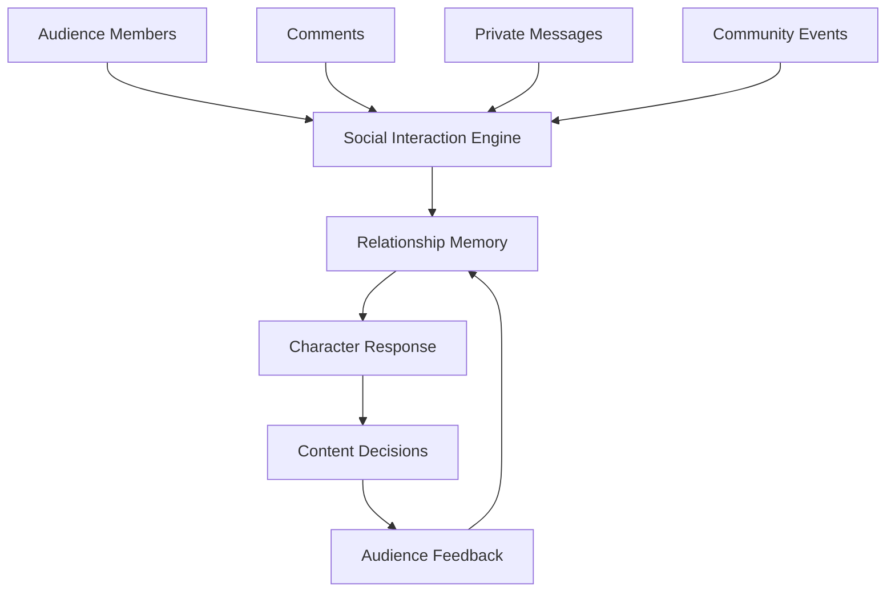
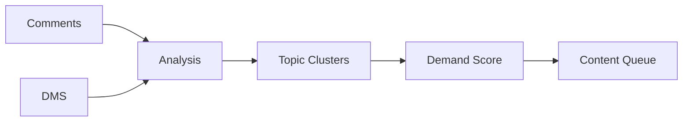
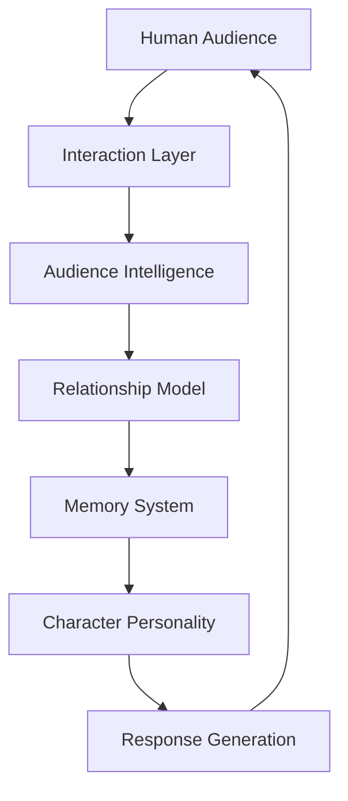

# OMNIS Relationship and Social Interaction Engine Specification

> Version: 1.0.0
> Status: Architecture Specification
> Domain: Audience Relationship / Social Interaction / Community Intelligence

## 1. Purpose

The Relationship and Social Interaction Engine gives every OMNIS Character the ability to build, maintain and evolve meaningful relationships with audiences and other entities.



## 2. Core Principle

Audience members are not only metrics. They are participants in a long-term community relationship.

```text
INTERACTION
+
MEMORY
+
EMOTION
+
PERSONALIZATION
+
BOUNDARIES
=
AUTHENTIC COMMUNITY
```

## 3. Relationship Model

Each audience member may have a relationship state.

```yaml
relationship:
  user_id: user_001
  history: []
  trust_score: 0.8
  interests: []
  preferred_topics: []
  last_interaction: timestamp
```

## 4. Relationship Types

```text
new viewer
regular viewer
subscriber
member
supporter
community leader
collaborator
```

## 5. Interaction Memory

Relevant interactions are stored according to privacy and policy rules.

## 6. Comment Intelligence

Comments are analyzed for:

```text
question
request
feedback
emotion
complaint
praise
trend signal
```

## 7. Request Mining

Repeated audience requests become content opportunities.



## 8. Sentiment Understanding

The system detects audience mood without reducing humans to simple labels.

## 9. Loyal Audience Recognition

Long-term supporters can receive improved interaction quality.

## 10. Personalization

Responses may adapt to known preferences while respecting privacy boundaries.

## 11. Reply Generation

Replies use:

```text
Character Personality
Voice Identity
Conversation Memory
Current Emotion
Audience Context
```

## 12. Relationship Boundaries

The system must avoid pretending to have relationships beyond configured interaction limits.

## 13. Community Intelligence

Audience patterns influence future strategy.

```text
Audience Signals
      ↓
Understanding
      ↓
Strategy
      ↓
Content
      ↓
Interaction
      ↓
Learning
```

## 14. Cross-Character Communities

Multiple OMNIS Characters may share controlled community intelligence without losing individual identity.

## 15. Social Learning Loop

Interactions improve future content decisions.

## 16. Safety

The engine must respect privacy, consent and platform policies.

## 17. Final Architecture



## 18. Contract

The Relationship and Social Interaction Engine MUST transform audience interaction into meaningful, privacy-aware, Character-consistent relationships while improving content strategy through continuous learning.
