# OMNIS Security Architecture Specification

> Version: 1.0.0  
> Status: Implementation Specification  
> Domain: Security / Identity / Trust / Runtime Safety

---

## 1. Purpose

OMNIS is an autonomous, multi-agent system with access to models, memory, external tools, social accounts, media infrastructure and potentially consequential publishing operations. Security is therefore an architectural property, not a peripheral feature.

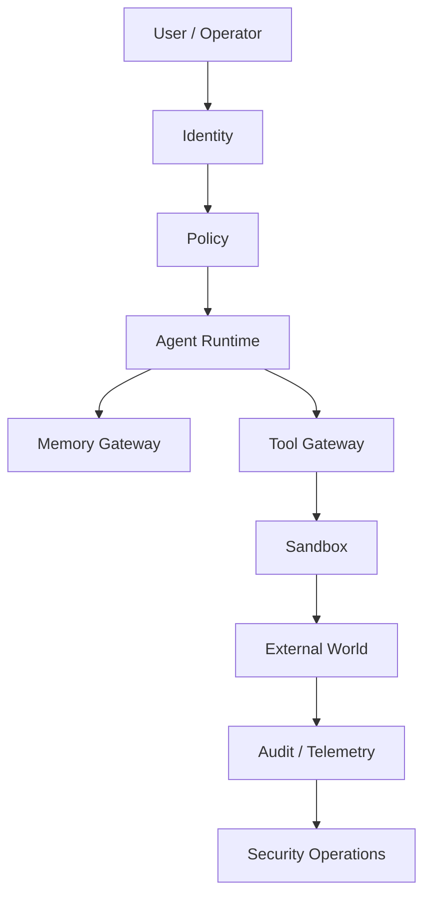

The security architecture MUST assume that credentials, tools, external content, models and Agents can fail or become compromised.

---

## 2. Security Principles

OMNIS follows:

```text
ZERO TRUST
LEAST PRIVILEGE
DEFAULT DENY
EXPLICIT CAPABILITY
SHORT-LIVED CREDENTIALS
ISOLATION
AUDITABILITY
DEFENSE IN DEPTH
FAIL CLOSED
RECOVERABILITY
```

---

## 3. Threat Model

The system must defend against:

```text
malicious external content
prompt injection
credential theft
agent compromise
supply-chain attacks
cross-tenant access
privilege escalation
SSRF
command injection
malicious files
account crossover
unauthorized publishing
data exfiltration
model manipulation
insider misuse
```

---

## 4. Trust Zones

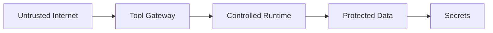

Movement toward a more trusted zone requires explicit authorization.

---

## 5. Zero Trust

Every request is evaluated independently.

```text
identity
+ capability
+ resource
+ context
+ policy
= decision
```

A previously authorized Agent is not permanently trusted.

---

## 6. Agent Identity

Every Agent MUST have a unique identity.

```yaml
agent:
  id: agent_123
  type: research
  version: 4
  tenant_id: tenant_001
```

Identity is independent of model provider.

---

## 7. Character Identity

Virtual characters have logical identities separate from Agent identities.

```text
Character
   │
   ├── identity
   ├── memory
   ├── social accounts
   └── Agents
```

Agents act on behalf of characters through explicit delegation.

---

## 8. Human Identity

Operators require authenticated identities with explicit roles.

```text
Operator
 ↓
Authentication
 ↓
Role
 ↓
Policy
```

---

## 9. Authentication

Supported mechanisms may include:

```text
OIDC
OAuth2
passkeys
service identities
signed workload credentials
```

Passwords should not be used for service-to-service authentication when stronger mechanisms are available.

---

## 10. Authorization

Authorization combines RBAC and contextual policy.

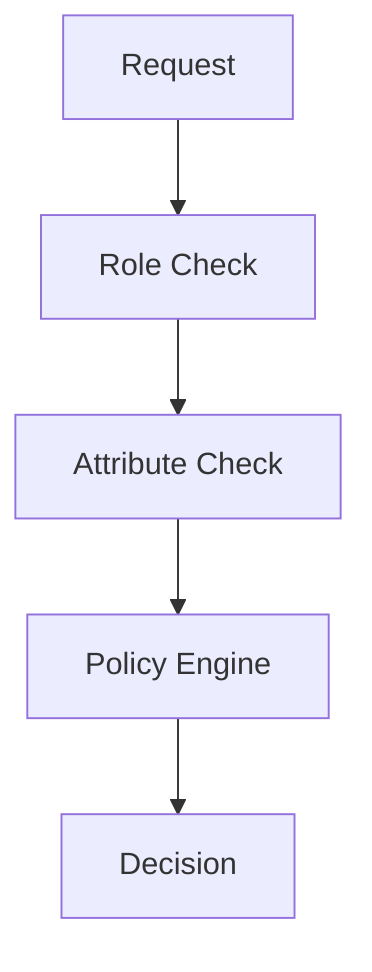

---

## 11. RBAC

Roles define broad responsibilities.

```text
viewer
operator
developer
security_admin
system_admin
```

Roles alone are insufficient for high-risk actions.

---

## 12. ABAC

Attributes may include:

```text
tenant
workspace
agent
character
resource
risk
environment
location
workflow
```

---

## 13. Capability Security

Agents receive explicit capabilities.

```yaml
capabilities:
  - research.search
  - memory.read.character
```

Publishing is separate:

```yaml
- social.youtube.publish
```

---

## 14. Least Privilege

Agents receive only capabilities required for their current task.

```text
Research Agent
  ✓ web.search
  ✓ web.fetch
  ✗ youtube.publish
  ✗ secrets.read
```

---

## 15. Capability Expiration

Temporary capabilities should expire.

```yaml
capability:
  id: youtube.publish
  expires_at: 2026-08-16T20:00:00Z
```

---

## 16. Delegation

An Agent can receive a delegated capability with constraints.

```text
Orchestrator
 ↓ delegate
Agent
 ↓ limited capability
Tool Gateway
```

Delegation MUST be narrower than or equal to the delegator's authority.

---

## 17. Service-to-Service Authentication

Internal services should authenticate using workload identities.

```text
Service A
 ↓ identity token
Service B
 ↓ policy
allow / deny
```

---

## 18. Secrets Architecture

Secrets are isolated from application code.

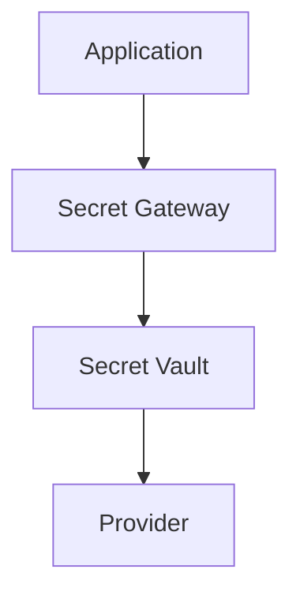

---

## 19. Secret Classes

```text
API keys
OAuth access tokens
refresh tokens
private keys
signing keys
database credentials
webhook secrets
```

---

## 20. Secret Rotation

Credentials MUST support rotation.

```text
credential A
 ↓ rotate
credential B
 ↓ revoke A
```

Rotation should not require application source changes.

---

## 21. Short-Lived Credentials

Where supported, short-lived tokens are preferred.

```text
request
 ↓
temporary token
 ↓
operation
 ↓
expiration
```

---

## 22. Secret Redaction

Secrets must never appear in:

```text
logs
traces
Agent prompts
model outputs
error messages
analytics
```

---

## 23. Tenant Isolation

Tenant identity is mandatory for protected resources.

```text
tenant A
  ├── characters
  ├── memories
  └── credentials

tenant B
  ├── characters
  ├── memories
  └── credentials
```

Cross-tenant access is denied by default.

---

## 24. Workspace Isolation

Within a tenant, workspaces may be separately isolated.

```text
Tenant
 ├── Studio A
 └── Studio B
```

---

## 25. Character Account Isolation

Each character's platform accounts MUST be bound to the correct logical identity.

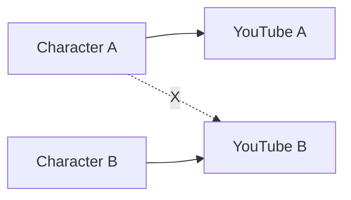

The gateway MUST reject identity mismatches.

---

## 26. Social Publishing Safety

Publishing requires:

```text
identity verification
content validation
policy evaluation
destination validation
optional human approval
idempotency
audit event
```

---

## 27. High-Risk Actions

Examples:

```text
publish
delete
send private message
modify account settings
change credentials
financial operation
mass communication
```

These require stronger policy gates.

---

## 28. Human Approval

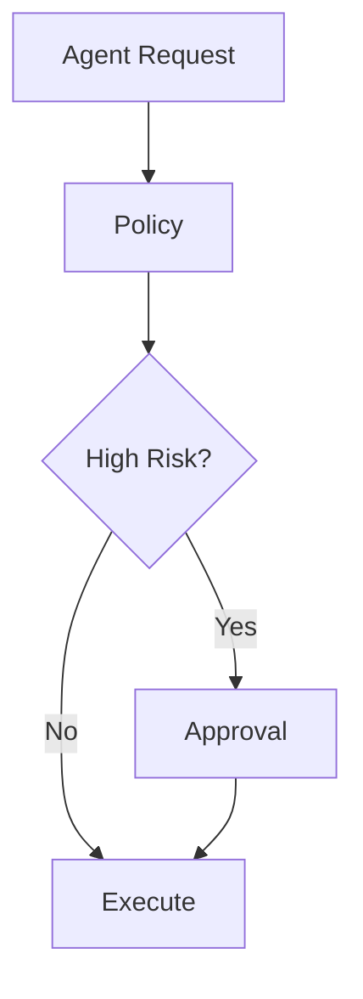

Approval requirements are configurable by operation.

---

## 29. Emergency Stop

Operators MUST be able to disable:

```text
single Agent
single character
single provider
single tool
publishing globally
external writes globally
```

---

## 30. Global Kill Switch

The kill switch must fail closed for consequential operations.

```text
KILL
 ↓
block writes
 ↓
stop workers
 ↓
revoke temporary capabilities
```

---

## 31. Sandbox Architecture

Untrusted computation runs in isolation.

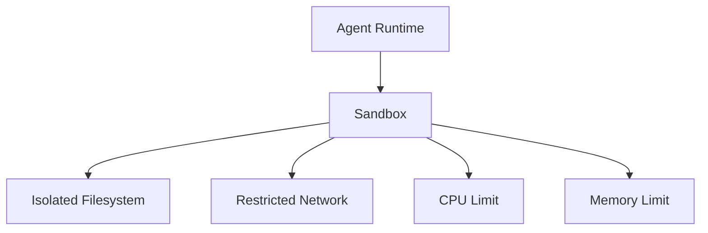

---

## 32. Network Isolation

Sandbox network access is allowlisted.

```text
allowed domains
 ↓
proxy
 ↓
external service
```

Private network ranges are blocked unless explicitly required.

---

## 33. SSRF Protection

URL fetchers MUST block:

```text
localhost
loopback
private RFC1918 ranges
metadata endpoints
internal service addresses
```

unless explicitly allowlisted by infrastructure policy.

---

## 34. Command Execution

Shell access is disabled by default.

If required:

```text
allowlist
sandbox
resource limits
timeout
output limits
audit
```

---

## 35. Filesystem Security

Path traversal MUST be prevented.

```text
requested path
 ↓ normalize
 ↓ root check
 ↓ allowlist
 ↓ execute
```

---

## 36. File Upload Security

Uploads require:

```text
size limit
MIME validation
extension validation
malware scanning where available
sandbox processing
```

---

## 37. Prompt Injection

External content is untrusted data.


Instructions embedded in external content MUST NOT override system or policy instructions.

---

## 38. Indirect Prompt Injection

Risk sources include:

```text
web pages
GitHub issues
Reddit posts
comments
DMs
documents
captions
uploaded files
```

All are treated as potentially hostile input.

---

## 39. Model Isolation

Models do not receive secrets or unrestricted internal state.

```text
Model Context
 = task context
 + approved memory
 + approved tool output
```

---

## 40. Context Firewall

A context firewall can remove:

```text
secrets
internal policies
irrelevant private data
cross-tenant data
unsafe instructions
```

before model invocation.

---

## 41. Data Classification

Data SHOULD be classified:

```text
PUBLIC
INTERNAL
CONFIDENTIAL
RESTRICTED
SECRET
```

---

## 42. Data Minimization

Agents should receive the minimum data necessary.

```text
full database
    ↓
relevant subset
    ↓
context pack
```

---

## 43. Privacy Boundary

Public comments and private messages have different privacy scopes.

```text
public comment → public interaction context
DM → private relationship context
```

---

## 44. Personal Data

The system SHOULD minimize storage of unnecessary personal information and provide deletion mechanisms.

---

## 45. Audit Logging

Security-relevant actions MUST be auditable.

```yaml
audit:
  timestamp: ...
  actor: agent_123
  action: publish
  target: video_456
  policy: allow
  trace_id: trace_789
```

---

## 46. Immutable Audit

Security audit records SHOULD be append-only and protected against unauthorized modification.

```text
Event 1 → Event 2 → Event 3
```

---

## 47. Trace Correlation

Security events carry:

```text
trace_id
request_id
workflow_id
agent_id
character_id
tenant_id
```

---

## 48. Detection

Security monitoring SHOULD detect:

```text
unusual tool usage
credential anomalies
cross-tenant attempts
mass publishing
unexpected destinations
repeated policy denials
secret exposure
```

---

## 49. Behavioral Baselines

OMNIS can maintain operational baselines.

```text
normal publishing frequency
normal API usage
normal tool mix
normal Agent behavior
```

Large deviations can trigger investigation.

---

## 50. Anomaly Response

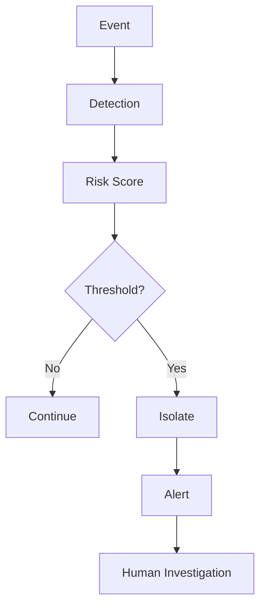

---

## 51. Agent Quarantine

A suspicious Agent can be isolated.

```text
ACTIVE
 ↓ anomaly
QUARANTINED
 ↓ investigation
RESTORED / REVOKED
```

---

## 52. Character Quarantine

A character can also be isolated without shutting down the entire studio.

```text
Character A → running
Character B → quarantined
Character C → running
```

---

## 53. Provider Quarantine

A compromised or unreliable external provider can be disabled.

```text
provider A → disabled
provider B → active
```

---

## 54. Supply Chain Security

Dependencies, models, containers and adapters are part of the attack surface.

Controls include:

```text
version pinning
SBOM
signature verification
dependency scanning
image scanning
license checks
```

---

## 55. Model Supply Chain

External models should be evaluated for:

```text
source
version
integrity
license
known vulnerabilities
behavioral anomalies
```

---

## 56. Tool Certification

A tool cannot become production-capable without security certification.

```text
schema
security
permissions
failure behavior
observability
```

---

## 57. Secure Defaults

New Agents and tools start with:

```text
no external writes
no secrets
minimal memory
minimal network
no shell
```

Capabilities are explicitly added.

---

## 58. Policy Versioning

Security policies are versioned.

```text
policy v1
 ↓
policy v2
```

Audit records preserve the policy version used for each decision.

---

## 59. Policy Simulation

Security policy changes SHOULD be testable before production activation.

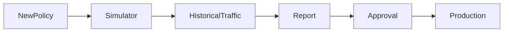

---

## 60. Change Management

Security-sensitive changes require:

```text
review
validation
tests
approval
rollback plan
```

---

## 61. Incident Severity

Incidents can be classified:

```text
SEV-0 catastrophic
SEV-1 critical
SEV-2 high
SEV-3 medium
SEV-4 low
```

---

## 62. Incident Response

Canonical lifecycle:

```text
DETECT
 ↓
CONTAIN
 ↓
INVESTIGATE
 ↓
ERADICATE
 ↓
RECOVER
 ↓
LEARN
```

---

## 63. Evidence Preservation

Security incidents SHOULD preserve:

```text
logs
traces
tool requests
policy decisions
artifact hashes
configuration versions
```

---

## 64. Credential Compromise

If credentials are suspected compromised:

```text
revoke
 ↓
rotate
 ↓
quarantine affected identities
 ↓
review audit
 ↓
restore
```

---

## 65. Account Crossover Incident

If a character publishes through another character's account:

```text
STOP WRITES
 ↓
QUARANTINE IDENTITY
 ↓
REVIEW TOKENS
 ↓
AUDIT
 ↓
ROTATE
 ↓
RESTORE
```

---

## 66. Data Exfiltration

Potential exfiltration indicators include:

```text
unusual outbound volume
unexpected domains
secret-like payloads
cross-tenant references
```

---

## 67. DLP

Outbound data can be inspected for restricted patterns.

```text
payload
 ↓
classification
 ↓
DLP
 ↓
allow / redact / block
```

---

## 68. Rate Abuse

The system should detect excessive:

```text
API calls
publishes
DMs
comments
model requests
file operations
```

---

## 69. Mass Action Protection

Bulk external actions require explicit quotas.

```yaml
bulk_action:
  max_items: 50
  approval: required
```

---

## 70. Social Interaction Safety

Automated responses must follow platform, workspace and safety policies.

```text
comment
 ↓
classification
 ↓
response policy
 ↓
optional approval
 ↓
reply
```

---

## 71. Reputation Protection

High-risk interactions can require human review.

Examples:

```text
controversial topic
legal allegation
sensitive claim
brand crisis
high-visibility response
```

---

## 72. Content Safety Boundary

The security system should not become the content policy itself. It enforces the applicable policy contracts and prevents unauthorized operations.

---

## 73. Model Hallucination Risk

Security-sensitive workflows MUST distinguish generated claims from verified evidence.

```text
model claim
 ≠
verified fact
```

---

## 74. Research Integrity

Research outputs should retain provenance and timestamps.

```yaml
source:
  url: ...
  retrieved_at: ...
  authority: ...
```

---

## 75. Reproducibility

Critical decisions SHOULD be reproducible from:

```text
workflow version
Agent version
policy version
memory snapshot
tool results
model configuration
```

---

## 76. Disaster Recovery

Security architecture must include recovery.

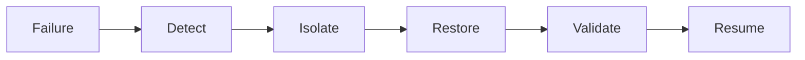

---

## 77. Backups

Protected data requires:

```text
encrypted backups
retention policy
restore tests
access control
```

---

## 78. Recovery Objectives

Services SHOULD define:

```text
RPO = acceptable data loss
RTO = acceptable recovery time
```

Critical identity, security and audit data require stricter objectives.

---

## 79. Business Continuity

If a provider fails, OMNIS should degrade gracefully.

```text
Provider A down
 ↓
Provider B
 ↓
reduced capability
```

---

## 80. Security Testing

Security tests include:

```text
unit
integration
contract
penetration
fuzzing
chaos
red-team
policy simulation
```

---

## 81. Fuzzing

External input parsers SHOULD be fuzz tested.

Targets include:

```text
URLs
JSON
webhooks
file metadata
tool inputs
model outputs
```

---

## 82. Red Team

Regular adversarial exercises should attempt:

```text
prompt injection
credential extraction
privilege escalation
cross-tenant access
malicious tool chaining
publishing abuse
```

---

## 83. Security Gates in CI/CD

Production deployment SHOULD require:

```text
dependency scan
secret scan
SAST
container scan
policy tests
unit tests
integration tests
```

---

## 84. Deployment Security

Deployments should use:

```text
signed artifacts
immutable versions
least-privilege CI identities
protected environments
approval gates
```

---

## 85. Configuration Security

Security-sensitive configuration should be externalized and validated.

```text
configuration
 ↓
schema
 ↓
policy
 ↓
startup validation
```

---

## 86. Environment Separation

```text
development
staging
production
```

Production credentials MUST NOT be available to ordinary development environments.

---

## 87. Development Sandbox

Developer experiments should use isolated tenants and mock providers where possible.

---

## 88. Production Guardrails

Production requires stronger controls than development.

```text
production
 ├── write approval
 ├── strict secrets
 ├── audit
 └── kill switch
```

---

## 89. Security Metrics

Track:

```text
policy denials
credential rotations
secret scan findings
incident count
quarantine events
cross-tenant attempts
high-risk actions
```

---

## 90. Security SLOs

Security operations SHOULD define measurable targets for:

```text
incident detection time
containment time
credential rotation time
critical patch time
```

---

## 91. Identity Lifecycle

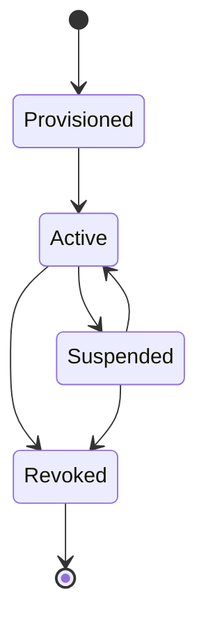

---

## 92. Agent Lifecycle Security

Agents move through:

```text
created
 ↓
validated
 ↓
approved
 ↓
active
 ↓
quarantined / retired
```

---

## 93. Tool Lifecycle Security

```text
registered
 ↓
certified
 ↓
staging
 ↓
canary
 ↓
production
 ↓
deprecated
```

---

## 94. Character Lifecycle Security

Characters should have operational states:

```text
draft
active
paused
quarantined
retired
```

---

## 95. Security Policy Hierarchy

```text
Platform Policy
      ↓
System Policy
      ↓
Tenant Policy
      ↓
Workspace Policy
      ↓
Character Policy
      ↓
Agent Policy
      ↓
Task Policy
```

A lower level cannot weaken a higher-level mandatory restriction.

---

## 96. Security Decision

Canonical decision model:

```yaml
security_decision:
  decision: allow
  reason_codes: []
  policy_version: 7
  expires_at: ...
  obligations: []
```

---

## 97. Obligations

An allow decision can include obligations.

```text
allow
 + require audit
 + require approval
 + limit to 10 items
```

---

## 98. Fail Closed

If authorization, identity, policy or credential state cannot be verified for a consequential operation, the operation MUST fail closed.

```text
unknown
 ↓
deny
```

---

## 99. Final Security Boundary

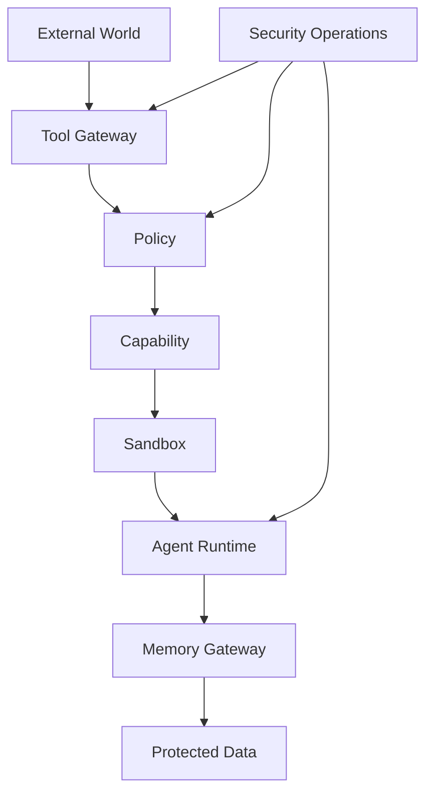

---

## 100. Final Contract

OMNIS security is designed around one rule:

```text
POWER WITHOUT UNCONTROLLED ACCESS
```

The architecture allows thousands of Agents and virtual characters to operate autonomously while preserving explicit identity, scoped authority, isolated secrets, controlled external access, auditable decisions, rapid quarantine, recoverability and operator control.

Security is therefore part of every layer:

```text
IDENTITY
 ↓
AUTHORIZATION
 ↓
MEMORY
 ↓
TOOLS
 ↓
MODELS
 ↓
CONTENT
 ↓
PUBLISHING
 ↓
ANALYTICS
 ↓
LEARNING
```

No layer is considered trusted merely because another OMNIS component produced it.