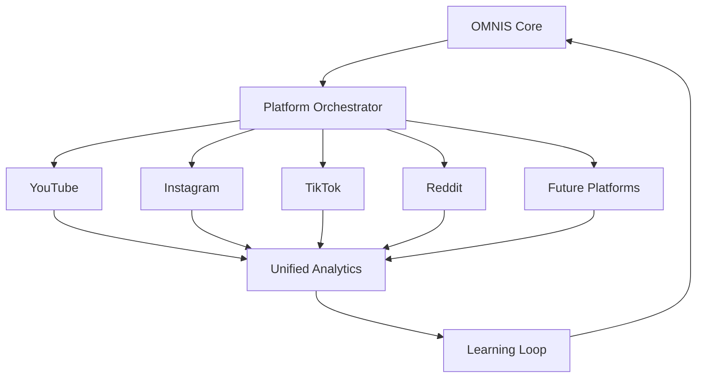
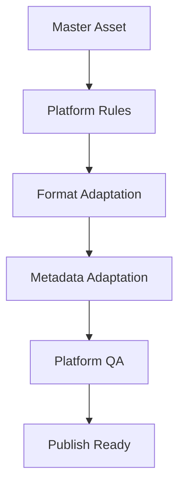
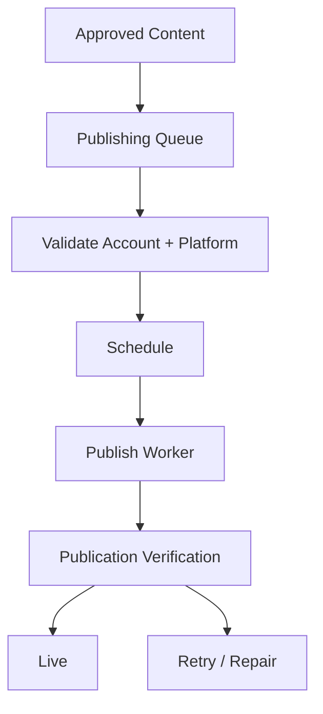
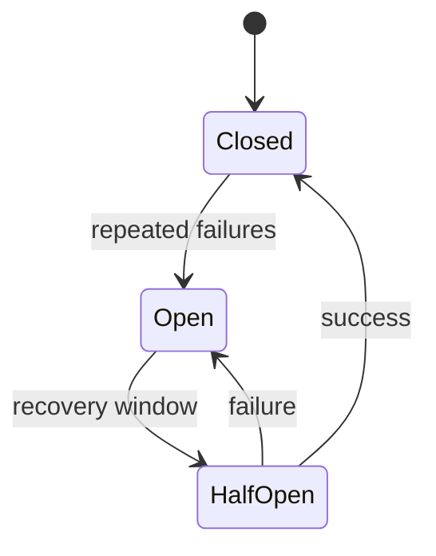
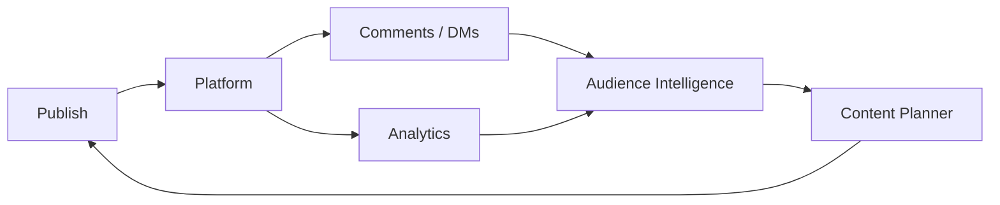
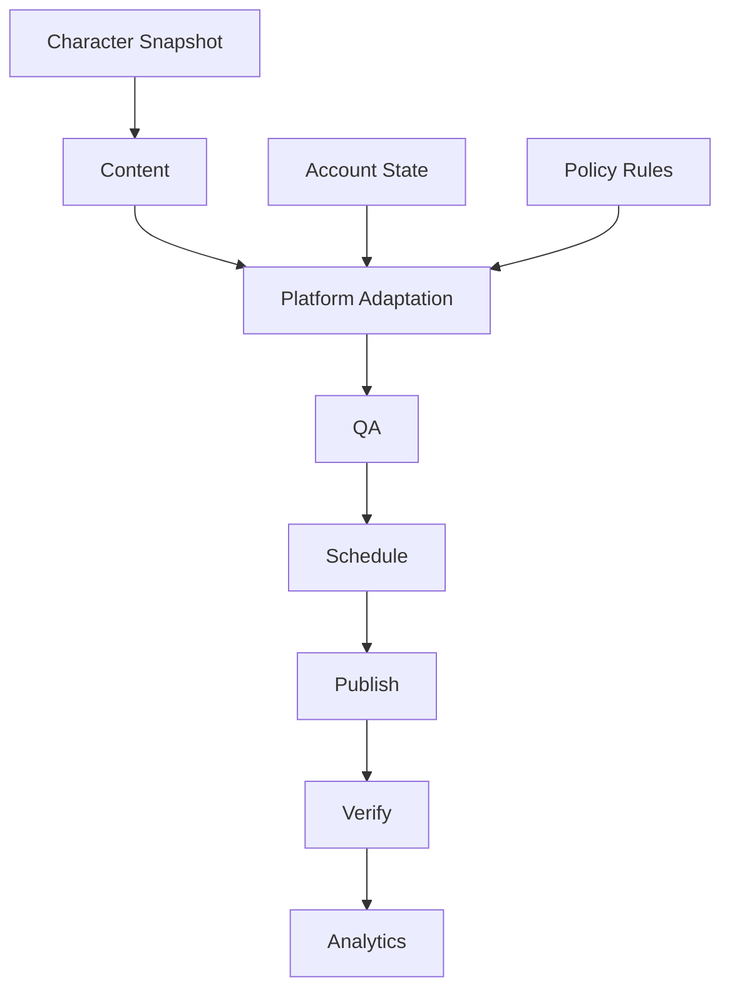

# OMNIS Social Platform Orchestration Specification

> Version: 1.0.0  
> Status: Architecture Specification  
> Domain: Social Platforms / Publishing / Community / Analytics / Multi-Channel Orchestration

## 1. Purpose

Social Platform Orchestration is the control plane connecting OMNIS to external publishing platforms. It coordinates accounts, channels, content adaptation, scheduling, publishing, comments, messages, analytics and platform-specific workflows.

OMNIS must treat every platform as a distinct environment while maintaining one coherent content and audience strategy.



## 2. Core Principle

A single source asset is not automatically a single platform asset.

```text
MASTER CONTENT
      ↓
PLATFORM ADAPTATION
 ├── YouTube
 ├── Instagram
 ├── TikTok
 └── Other
```

## 3. Platform Adapter

Each platform is accessed through a versioned adapter.

```yaml
adapter:
  platform: youtube
  version: 1
  capabilities:
    upload: true
    comments: true
    analytics: true
```

## 4. Capability Discovery

The orchestrator must know what each connected account can currently do.

Capabilities may include:

```text
publish
schedule
edit metadata
comments
DMs
community posts
analytics
media upload
thumbnail update
playlist management
```

## 5. Authentication

Platform credentials must be stored through secure secret management and never inside source-controlled content configuration.

## 6. Account Registry

OMNIS maintains a registry of connected platform accounts.

```yaml
account:
  id: account_001
  platform: youtube
  channel_ref: channel_001
  status: active
```

## 7. Channel Registry

A channel is associated with a Character, brand, niche and publishing policy.

```text
Character
   ↓
Channel
   ↓
Platform Account
```

## 8. Multi-Channel Scale

The architecture must support hundreds or thousands of channels without requiring separate application instances for each channel.

## 9. Tenant Isolation

Channel data, credentials, analytics and audience information must remain isolated by tenant/account boundaries.

## 10. Content Identity

Every content item receives a global OMNIS content ID.

```yaml
content:
  id: content_001
  master_asset: asset_master_001
  character: char_001
```

## 11. Platform Derivative

A platform-specific derivative references the master content without duplicating its identity.

```yaml
derivative:
  content_id: content_001
  platform: instagram
  format: reel
```

## 12. Adaptation Engine

The Adaptation Engine converts content to platform constraints.



## 13. Aspect Ratio

The engine supports platform-specific aspect ratios and safe regions.

## 14. Resolution

Media is rendered according to the current platform requirements discovered by the adapter.

## 15. Duration

Duration limits and recommended lengths are represented as configurable platform capabilities rather than hard-coded assumptions.

## 16. Encoding

The media pipeline chooses codecs, bitrate, audio settings and container formats appropriate to the target platform.

## 17. Caption Adaptation

Captions are adapted to platform style, length, formatting and audience context.

## 18. Title Adaptation

Titles may be rewritten for platform-specific conventions while preserving the content truth and Character voice.

## 19. Description Adaptation

Long descriptions can be shortened or expanded according to platform needs.

## 20. Hashtag Strategy

Hashtags are generated from topic, audience, platform and current strategy.

They are not inserted blindly into every post.

## 21. Mention Strategy

Mentions are validated against platform and campaign rules before publication.

## 22. Link Strategy

Platform-specific link limitations are represented by adapter capabilities.

## 23. Thumbnail Adaptation

The Thumbnail Engine generates platform-specific variants from approved creative concepts.

## 24. Cover Frame

Platforms that use a video frame or cover image may receive a dedicated derivative.

## 25. Publishing Queue



## 26. Queue Priority

Priority may consider:

```text
campaign
content urgency
trend momentum
audience demand
scheduled time
platform opportunity
business priority
```

## 27. Scheduling

Scheduling is timezone-aware.

## 28. Character Timezone

Channel schedules may follow the target audience timezone rather than the server timezone.

## 29. Seasonal Scheduling

The scheduler may incorporate seasonality and holidays when relevant.

## 30. Event Scheduling

Time-sensitive content can be linked to an event window.

```text
event
 ↓
publication window
 ↓
expiration
```

## 31. Idempotent Publishing

A publish operation must be safely retryable without creating unintended duplicate posts.

## 32. Publication State

```text
planned
validated
queued
uploading
published
verified
failed
retrying
cancelled
```

## 33. Upload Resilience

Large media uploads should support resumable mechanisms where the platform provides them.

## 34. Retry Policy

Retries use bounded exponential backoff and platform-aware error classification.

## 35. Error Classes

```text
authentication
rate limit
network
validation
media
platform outage
policy rejection
unknown
```

## 36. Rate Limiting

Each adapter maintains platform-specific rate-limit state.

```text
requests
 ↓
rate limiter
 ↓
platform
```

## 37. Quota Awareness

Quota consumption is tracked per account and operation.

## 38. Circuit Breaker

Repeated platform failures may open a circuit and delay further requests.



## 39. Platform Health

The orchestrator maintains platform health indicators.

## 40. Failover

Where possible, the system can postpone, reroute or adapt work when a provider is temporarily unavailable.

## 41. Cross-Posting

Cross-posting is an explicit strategy, not a default copy operation.

## 42. Cross-Posting Variants

```text
same master
→ different hook
→ different caption
→ different crop
→ different CTA
```

## 43. Platform-Native Content

Some content should be produced specifically for one platform rather than cross-posted.

## 44. Content Cannibalization

The planner should avoid publishing near-identical content across platforms in a way that damages audience experience or strategy.

## 45. Publishing Calendar

```text
Character A
 ├── YouTube Monday
 ├── Instagram Tuesday
 └── TikTok Wednesday

Character B
 ├── YouTube Tuesday
 └── Instagram Friday
```

## 46. Campaigns

Campaigns group related content across channels and platforms.

## 47. Campaign Object

```yaml
campaign:
  id: campaign_001
  objective: launch
  channels: [channel_001, channel_002]
  platforms: [youtube, instagram]
```

## 48. Campaign Consistency

Characters participating in the same campaign retain distinct personalities and voices.

## 49. Analytics Ingestion

Platform analytics are normalized into a common schema.

```text
Platform Analytics
        ↓
Normalizer
        ↓
Unified Metrics
```

## 50. Metric Registry

Metrics are defined with platform provenance.

```yaml
metric:
  name: views
  platform: youtube
  value: 100000
  observed_at: ...
```

## 51. Metric Semantics

Identically named metrics may have different meanings across platforms. The unified model must preserve platform semantics.

## 52. Performance Dimensions

```text
reach
views
watch time
retention
likes
comments
shares
saves
followers
subscribers
clicks
conversion
revenue
```

## 53. Retention Analytics

Where available, retention curves are captured and linked to content timeline segments.

## 54. Hook Analytics

Early-viewer behavior can be used to evaluate hook effectiveness.

## 55. CTA Analytics

Call-to-action performance can be compared across variants.

## 56. Audience Growth

Follower and subscriber changes are attributed to relevant content windows when feasible.

## 57. Revenue Analytics

Revenue metrics remain platform-specific and are normalized without losing source provenance.

## 58. Analytics Delay

Platform metrics may arrive late or change after publication. Metrics must support revision.

## 59. Immutable Observation

Raw observations are preserved before aggregation.

```text
raw observation
 ↓
normalized observation
 ↓
aggregate
```

## 60. Attribution

Performance is attributed to content, Character, campaign, platform and variant.

## 61. Audience Intelligence Integration

Audience signals flow back into the Audience Intelligence subsystem.



## 62. Comment Synchronization

New comments are ingested incrementally where platform APIs permit.

## 63. Reply State

OMNIS tracks whether a selected comment has been:

```text
unread
classified
queued
replied
escalated
ignored
```

## 64. DM Synchronization

DM synchronization is controlled by platform permissions and privacy policies.

## 65. Community Management

Community posts, polls and reactions may be integrated into the same audience signal pipeline.

## 66. Moderation Integration

Platform moderation signals are combined with OMNIS policy checks.

## 67. Policy Rejection

A platform rejection becomes a structured event.

```yaml
rejection:
  content_id: content_001
  platform: youtube
  reason: ...
  observed_at: ...
```

## 68. Rejection Learning

Repeated rejection patterns can update content validation rules.

## 69. Policy Knowledge

Platform policies must be treated as versioned, externally changing knowledge.

## 70. Platform Rule Updates

Adapters can update capabilities and validation rules without requiring a complete OMNIS redeployment.

## 71. Platform API Versioning

Each connector records API version and capability version.

## 72. Connector Contract

```yaml
connector:
  authenticate()
  capabilities()
  upload()
  publish()
  schedule()
  comments()
  messages()
  analytics()
```

## 73. Webhook Support

Where supported, webhooks are preferred for low-latency events.

## 74. Polling Fallback

Polling may be used where webhooks are unavailable.

## 75. Event Normalization

External events are converted into OMNIS event types.

```text
platform event
 ↓
adapter
 ↓
OMNIS event
```

## 76. Event Types

```text
content.published
content.rejected
comment.created
message.received
metric.updated
account.warning
quota.changed
```

## 77. Event Idempotency

Every externally sourced event must have a deduplication key where possible.

## 78. Audit Trail

Publishing and account actions are auditable.

## 79. Human Approval

Workflows may require human approval before publishing.

```text
AI Draft
 ↓
Review
 ↓
Approve
 ↓
Publish
```

## 80. Approval Policies

Approval requirements may depend on platform, Character, campaign, content category and risk level.

## 81. Emergency Stop

Operators must be able to halt publishing for one Character, channel, platform or the entire system.

## 82. Kill Switch

```text
GLOBAL STOP
   ↓
all publishing workers stop
```

## 83. Account Suspension

A suspended or disconnected account is removed from active scheduling until revalidated.

## 84. Token Expiration

Expired credentials create an authentication event and pause dependent jobs.

## 85. Secret Rotation

Credential rotation must not require content pipeline redesign.

## 86. Platform-Specific Policy

Each platform may define additional content, metadata and interaction policies.

## 87. Compliance Boundary

The platform layer MUST NOT attempt to bypass platform safeguards, access controls, rate limits or moderation systems.

## 88. Authenticity

OMNIS must preserve truthful provenance and comply with applicable synthetic-media disclosure requirements.

## 89. Automation Boundary

Automation should assist legitimate publishing and community management rather than create deceptive engagement, fake consensus or artificial audience manipulation.

## 90. Character Voice

Every platform derivative must preserve the Character's language and personality constraints.

## 91. Platform Voice Adaptation

Expression can adapt to platform culture without changing the underlying Character.

```text
same Character
      ↓
YouTube: detailed
Instagram: concise
TikTok: energetic
```

## 92. Localization

Platform derivatives may be localized by language, region and audience segment.

## 93. Translation QA

Localized content is validated for meaning, tone and Character consistency.

## 94. Publishing Dependency Graph



## 95. Observability

Every connector emits logs, metrics and traces.

## 96. Operational Metrics

```text
publish latency
success rate
retry rate
failure rate
quota usage
API latency
webhook delay
analytics freshness
```

## 97. Cost Tracking

Platform operations may incur infrastructure or API costs. Costs are attributed to account, channel, campaign and content where possible.

## 98. Testing

Required tests include:

```text
adapter contract tests
authentication tests
upload tests
idempotency tests
rate-limit tests
retry tests
analytics normalization tests
webhook tests
policy tests
cross-platform adaptation tests
```

## 99. Disaster Recovery

Publishing state, schedules and connector configuration must be recoverable from durable storage.

## 100. Final Contract

Social Platform Orchestration is the external execution nervous system of OMNIS.

```text
CONTENT
   ↓
ADAPT
   ↓
VALIDATE
   ↓
SCHEDULE
   ↓
PUBLISH
   ↓
VERIFY
   ↓
ANALYZE
   ↓
AUDIENCE INTELLIGENCE
   ↓
LEARN
   ↓
CONTENT STRATEGY
```

The system MUST provide a scalable, observable, resilient and policy-aware abstraction over social platforms while preserving platform-specific behavior, Character identity, audience relationships, analytics provenance and long-term learning.