# OMNIS Task Contract Specification

> Version: 1.0.0  
> Status: Implementation Specification  
> Domain: Agent Mesh / Orchestration  
> Purpose: Define the machine-readable contract exchanged between Orchestrator, Agent Runtime, Agents, Tools, Memory and Evaluation systems.

---

## 1. Purpose

The Task Contract is the formal execution agreement for every meaningful unit of work in OMNIS.

It prevents Agents from guessing what a task means, what inputs are valid, what outputs are required, what resources may be consumed, what permissions are available, how failure is handled and what evidence must be produced.

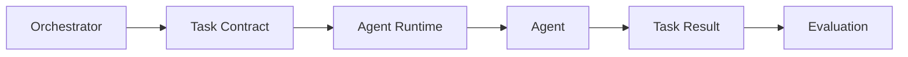

---

## 2. Core Principle

Every executable task MUST have an explicit contract.

```text
Task Intent
    ↓
Task Contract
    ↓
Validation
    ↓
Execution
    ↓
Result Contract
    ↓
Evaluation
```

The contract is authoritative for execution semantics but MUST NOT contain hidden business logic.

---

## 3. Contract Responsibilities

A Task Contract defines:

- task identity;
- task type;
- requester;
- target Agent capability;
- input schema;
- output schema;
- context;
- dependencies;
- permissions;
- resource budgets;
- deadlines;
- priority;
- retry policy;
- idempotency policy;
- state requirements;
- quality requirements;
- evidence requirements;
- observability requirements;
- cancellation behavior;
- failure semantics;
- security classification.

---

## 4. Contract Does Not Execute

The contract is declarative.

```text
Contract = WHAT + CONSTRAINTS + EXPECTATIONS
Runtime   = HOW + EXECUTION + CONTROL
Agent     = REASONING + ACTION
```

This separation is mandatory.

---

## 5. Contract Object

Canonical conceptual object:

```yaml
task:
  id: task_01J...
  type: content.script.generate
  version: 1
  requested_by: orchestrator
  capability: script_generation
  priority: high
  deadline: 2026-08-16T18:00:00Z
```

---

## 6. Full Contract Skeleton

```yaml
apiVersion: omnis.ai/v1
kind: TaskContract
metadata: {}
spec:
  intent: {}
  input: {}
  output: {}
  context: {}
  dependencies: {}
  permissions: {}
  resources: {}
  execution: {}
  quality: {}
  evidence: {}
  security: {}
  observability: {}
  cancellation: {}
  failure: {}
```

---

## 7. Task Identity

Task IDs MUST be globally unique.

Recommended format:

```text
UUIDv7 / ULID
```

Time-sortable identifiers are preferred for distributed tracing.

```yaml
metadata:
  task_id: 01J9TASK...
```

---

## 8. Correlation Identity

Every task may belong to a larger workflow.

```yaml
metadata:
  task_id: 01TASK
  workflow_id: 01WORKFLOW
  parent_task_id: 01PARENT
  trace_id: TRACE123
```

This allows full lineage reconstruction.

---

## 9. Task Type

Task type describes the semantic operation.

Examples:

```text
research.topic.discover
research.fact.verify
content.script.generate
content.video.plan
character.dialogue.respond
social.comment.classify
audience.request.cluster
analytics.performance.analyze
```

Task types SHOULD be versioned.

---

## 10. Contract Version

Contract versions are independent of Agent versions.

```text
TaskContract v1
     │
     ├── Agent A v2
     ├── Agent B v4
     └── Agent C v1
```

An Agent may implement multiple compatible task contract versions.

---

## 11. Intent

Intent defines why the task exists.

```yaml
intent:
  objective: "Generate a long-form video script about the latest AI model."
  desired_outcome: publishable_script
  audience: technology_enthusiasts
```

Intent should be human-readable and machine-interpretable.

---

## 12. Acceptance Criteria

Tasks SHOULD contain explicit acceptance criteria.

```yaml
acceptance:
  - factual_claims_have_sources
  - structure_contains_hook
  - target_duration_minutes: 12
  - tone: energetic
```

Acceptance criteria are later consumed by Evaluation.

---

## 13. Input Contract

Inputs MUST be typed.

```yaml
input:
  schema: content.script.input.v1
  data:
    topic: "New AI model"
    language: fa
    target_minutes: 12
```

Unvalidated input MUST NOT reach production Agents.

---

## 14. Input Validation

Validation stages:

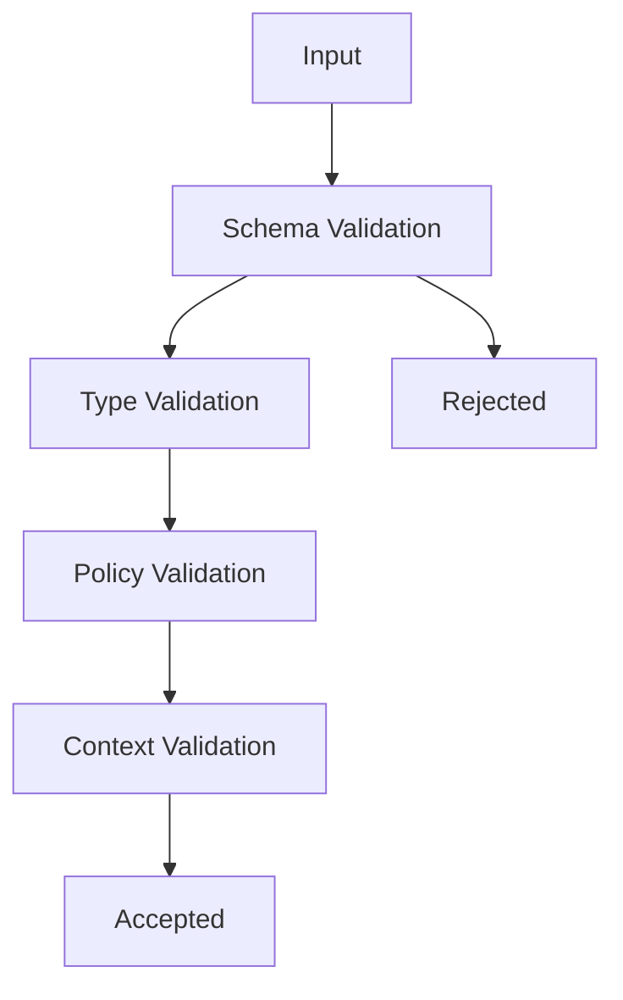

---

## 15. Input Normalization

Agents SHOULD receive normalized data.

Example:

```text
" YouTube "
      ↓
"youtube"
```

Normalization MUST be deterministic where possible.

---

## 16. Output Contract

Outputs MUST declare schema and semantic requirements.

```yaml
output:
  schema: content.script.output.v1
  required:
    - title
    - hook
    - sections
    - sources
```

---

## 17. Output Validation

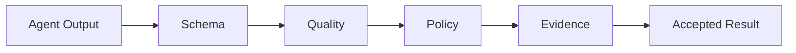

Invalid results MUST NOT be silently promoted to successful task completion.

---

## 18. Result Envelope

Every completed task SHOULD return a standard envelope.

```yaml
result:
  task_id: 01TASK
  status: succeeded
  output: {}
  evidence: []
  metrics: {}
  warnings: []
```

---

## 19. Task States

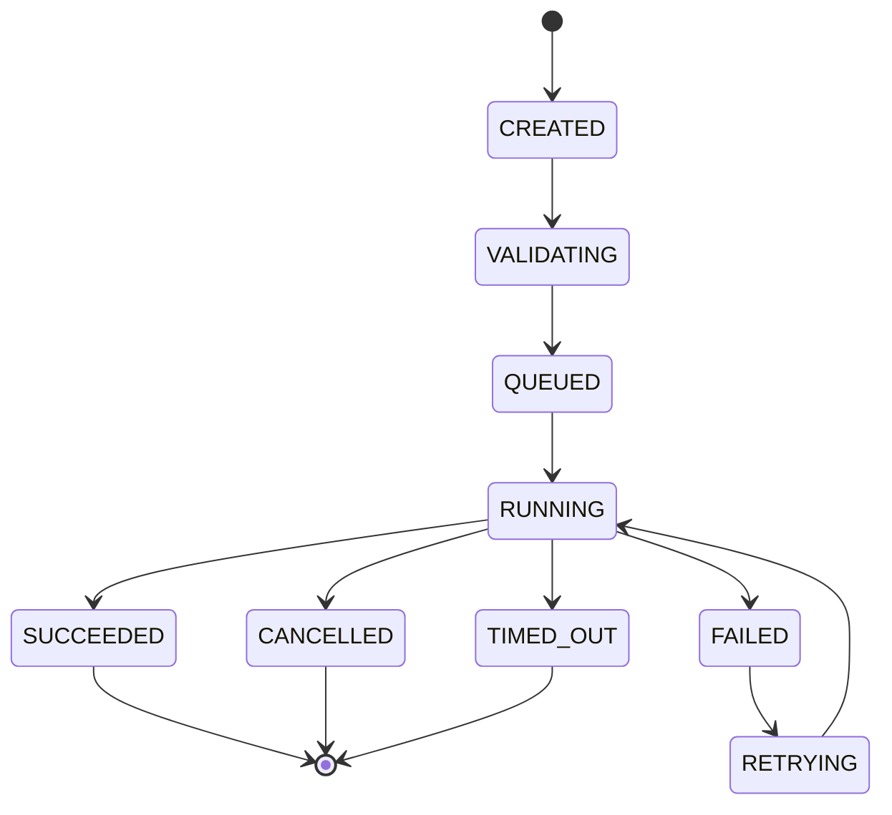

Every state transition MUST be observable.

---

## 20. State Transition Rules

Transitions MUST be validated.

```text
CREATED → VALIDATING
VALIDATING → QUEUED | REJECTED
QUEUED → RUNNING
RUNNING → SUCCEEDED | FAILED | CANCELLED | TIMED_OUT
FAILED → RETRYING | TERMINAL_FAILURE
```

Illegal transitions MUST be rejected.

---

## 21. Priority

Priority influences scheduling but cannot bypass safety controls.

```text
critical
high
normal
low
background
```

A low-priority task can never consume resources reserved for critical tasks without policy approval.

---

## 22. Deadline

```yaml
execution:
  deadline: 2026-08-16T18:00:00Z
```

Runtime MUST stop or degrade execution when the deadline expires according to failure policy.

---

## 23. Timeout

Timeout applies to a specific execution attempt.

```yaml
execution:
  timeout_ms: 120000
```

Deadline applies to the overall task; timeout applies to the current attempt.

---

## 24. Retry Policy

```yaml
failure:
  retry:
    max_attempts: 3
    backoff: exponential
    initial_delay_ms: 1000
    max_delay_ms: 30000
```

Retries MUST distinguish transient errors from permanent errors.

---

## 25. Retry Safety

Retries MUST respect idempotency.

```text
Read/Search → usually retryable
Generate draft → usually retryable
Publish → requires idempotency key
Payment → strict idempotency
```

---

## 26. Idempotency

```yaml
execution:
  idempotency_key: publish:channel123:video456
```

External side effects MUST use stable idempotency keys where supported.

---

## 27. Cancellation

Tasks may be cancelled by:

```text
User
Workflow
Policy Engine
Deadline Controller
Resource Governor
Security System
```

Cancellation must be propagated to child tasks where appropriate.

---

## 28. Cancellation Graph

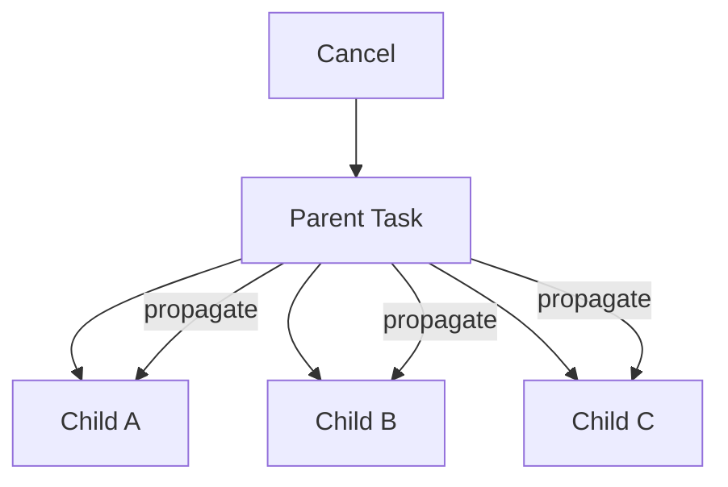

Propagation rules must be explicit.

---

## 29. Partial Completion

Some workflows permit partial results.

```yaml
failure:
  partial_result: allowed
  minimum_completion_ratio: 0.8
```

Example: 8 of 10 independent research sources successfully collected.

---

## 30. Failure Taxonomy

Failures MUST be classified.

```text
VALIDATION_ERROR
POLICY_DENIED
DEPENDENCY_ERROR
MODEL_ERROR
TOOL_ERROR
NETWORK_ERROR
RESOURCE_EXHAUSTED
TIMEOUT
CANCELLED
QUALITY_FAILURE
SECURITY_FAILURE
INTERNAL_ERROR
```

---

## 31. Failure Envelope

```yaml
error:
  code: DEPENDENCY_ERROR
  retryable: true
  message: "Search provider unavailable"
  dependency: web.search
  attempt: 2
```

Errors should be actionable without exposing secrets.

---

## 32. Resource Budget

Every task may declare resource limits.

```yaml
resources:
  max_duration_ms: 120000
  max_tokens: 50000
  max_tool_calls: 20
  max_memory_mb: 2048
  max_cost_usd: 0.50
```

Runtime MUST enforce hard limits.

---

## 33. Budget Accounting

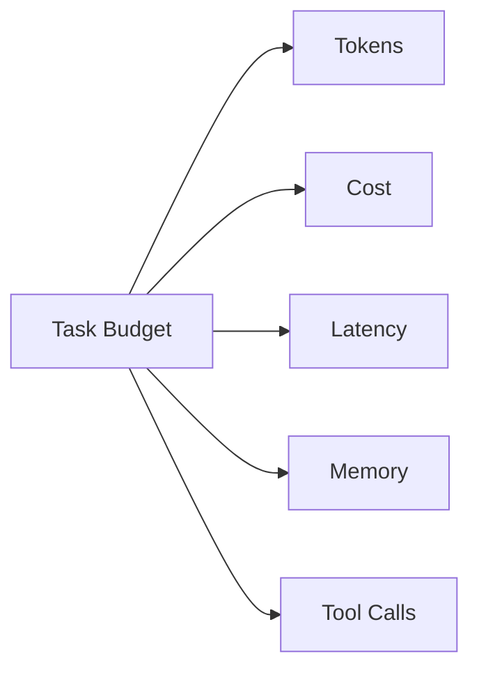

Consumption should be observable in real time.

---

## 34. Budget Escalation

An Agent MUST NOT silently exceed a declared budget.

Possible actions:

```text
stop
return partial result
request extension
switch model
switch Agent
```

Escalation requires policy approval.

---

## 35. Model Constraints

Tasks may specify model requirements.

```yaml
model:
  capability: reasoning.high
  minimum_context: 128k
  preferred_provider: provider-a
  fallback_providers:
    - provider-b
```

The Runtime resolves actual models.

---

## 36. Model Agnosticism

Task contracts SHOULD describe capabilities rather than hard-code providers.

```text
Preferred:
reasoning.high

Avoid:
providerX/modelY unless required
```

This keeps OMNIS portable.

---

## 37. Tool Requirements

Tasks can request tools.

```yaml
tools:
  required:
    - web.search
  optional:
    - web.image_search
```

Tools are granted through Tool Gateway policies.

---

## 38. Tool Limits

```yaml
tools:
  limits:
    web.search:
      max_calls: 10
    browser:
      max_calls: 5
```

Runtime tracks actual usage.

---

## 39. Memory Requirements

```yaml
memory:
  read:
    - character.identity
    - character.continuity
  write:
    - experience.task_summary
```

Memory access is scoped.

---

## 40. Memory Consistency

Tasks may specify consistency expectations.

```yaml
memory:
  consistency: strong
```

Examples:

```text
Character identity → strong
Analytics aggregate → eventual
Search cache → eventual
```

---

## 41. Context Envelope

Context supplies relevant information without dumping an entire memory store into the Agent.

```yaml
context:
  user:
    id: user_123
  character:
    id: character_007
  channel:
    id: channel_002
  recent_events: []
```

---

## 42. Context Budget

Context MUST be bounded.

```yaml
context:
  max_tokens: 20000
  relevance_threshold: 0.75
```

Context retrieval belongs to Context/Memory systems.

---

## 43. Character Context

For Character Agents, context may include:

```text
identity
personality
current mood
health state
weather
season
wardrobe state
hair state
makeup state
recent interactions
knowledge state
experience state
```

Only relevant context should be injected.

---

## 44. Temporal Context

Tasks may require real-world time.

```yaml
context:
  temporal:
    timezone: Europe/Amsterdam
    now: 2026-08-16T13:00:00+02:00
```

Temporal state is critical for continuity.

---

## 45. Environmental Context

For realism-oriented Agents:

```yaml
context:
  environment:
    season: summer
    weather: cloudy
    temperature_c: 22
```

This may influence wardrobe, visual generation and dialogue.

---

## 46. Audience Context

Audience-driven tasks may contain aggregated preferences.

```yaml
context:
  audience:
    segment: loyal_members
    top_requests:
      - new_ai_model
      - retro_car
```

Private user data must remain appropriately scoped.

---

## 47. Evidence Requirements

Research tasks may require citations.

```yaml
evidence:
  required: true
  minimum_sources: 3
  source_types:
    - official
    - academic
    - reputable_media
```

---

## 48. Evidence Object

```yaml
evidence:
  - id: ev1
    source: official.example
    claim: "Model released on date X"
    confidence: 0.97
```

Evidence should be traceable to source artifacts.

---

## 49. Evidence Graph

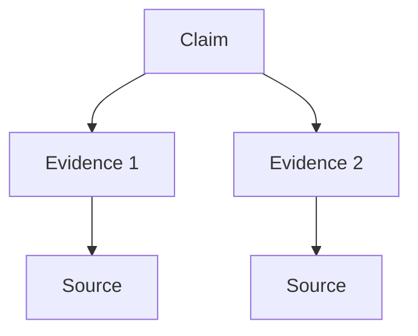

Evaluation can use this graph to verify claims.

---

## 50. Quality Contract

Tasks may define minimum quality.

```yaml
quality:
  minimum_score: 0.85
  dimensions:
    factuality: 0.95
    relevance: 0.90
    style: 0.80
```

Weights MUST be explicit.

---

## 51. Quality Gates


A result failing a mandatory gate is not successful.

---

## 52. Human Approval

Some tasks require human approval.

```yaml
approval:
  required: true
  stage: before_publish
```

Approval MUST be represented as an explicit state, not a hidden boolean.

---

## 53. Approval State

```text
NOT_REQUIRED
PENDING
APPROVED
REJECTED
EXPIRED
```

---

## 54. Security Classification

Tasks SHOULD declare sensitivity.

```text
PUBLIC
INTERNAL
CONFIDENTIAL
RESTRICTED
CRITICAL
```

Security policy is derived from this classification.

---

## 55. Permission Contract

```yaml
permissions:
  memory:
    read: [character.public]
  social:
    read: [comments]
    write: []
  publishing:
    allowed: false
```

Permission grants remain subject to runtime policy.

---

## 56. Secret Handling

Secrets MUST NOT appear in task payloads.

Instead:

```yaml
secrets:
  references:
    - provider.youtube.oauth
```

Runtime resolves secret references securely.

---

## 57. Data Residency

Tasks may declare geographic requirements.

```yaml
security:
  data_residency:
    allowed_regions:
      - EU
```

Routing must respect residency constraints.

---

## 58. Tenant Isolation

```yaml
metadata:
  tenant_id: tenant_001
```

Cross-tenant data access MUST be denied by default.

---

## 59. Trace Context

Every task should propagate distributed tracing.

```yaml
observability:
  trace_id: TRACE123
  span_id: SPAN456
```

Child tasks should inherit the workflow trace while creating their own spans.

---

## 60. Metrics

Minimum task metrics:

```text
queue_wait_ms
execution_ms
input_tokens
output_tokens
tool_calls
cost_usd
retry_count
quality_score
```

---

## 61. Structured Logging

Logs MUST include:

```text
task_id
workflow_id
agent_id
agent_version
attempt
state
trace_id
```

Sensitive payloads must be redacted.

---

## 62. Event Contract

Tasks emit lifecycle events.

```yaml
event:
  type: task.started
  task_id: 01TASK
  timestamp: 2026-08-16T13:00:00Z
```

Events are consumed asynchronously by Observability and Analytics.

---

## 63. Child Tasks

Agents may request child tasks only through Runtime/Orchestrator controls.

```text
Parent
├── Child Research
├── Child Fact Check
└── Child Draft
```

Child tasks inherit selected context and policy, not unrestricted authority.

---

## 64. Child Contract

```yaml
parent:
  task_id: PARENT
child:
  task_id: CHILD
  inherited:
    - trace
    - tenant
    - security
    - budget_fraction
```

Inheritance rules must be explicit.

---

## 65. Budget Delegation

Parent budget can be partitioned.

```text
Parent $1.00
├── Research $0.30
├── Writing  $0.40
├── Review   $0.20
└── Reserve  $0.10
```

Child tasks MUST NOT exceed allocated budget without escalation.

---

## 66. Parallelism

Contracts may specify maximum parallelism.

```yaml
execution:
  max_parallel_children: 5
```

This protects external systems and resource budgets.

---

## 67. Ordering

Tasks can specify dependencies.

```yaml
dependencies:
  - task: research
  - task: fact_check
    after: research
```

The Orchestrator resolves ordering.

---

## 68. DAG Representation

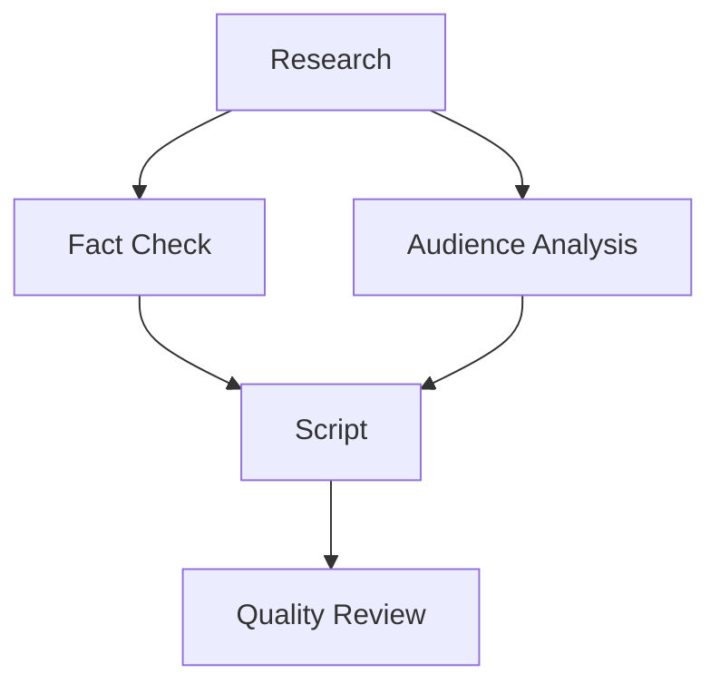

Tasks form a Directed Acyclic Graph where appropriate.

---

## 69. Dynamic Tasks

Some tasks generate new tasks based on runtime discoveries.

Example:

```text
Research finds 5 major claims
        ↓
5 fact-check tasks generated
```

Dynamic generation must obey the parent budget and policy.

---

## 70. Task Fan-Out

```yaml
execution:
  fanout:
    max_children: 20
```

This prevents accidental task explosions.

---

## 71. Task Fan-In

Fan-in defines aggregation.

```yaml
output:
  aggregation:
    strategy: ranked_merge
    minimum_successes: 8
```

---

## 72. Aggregation Strategies

Supported conceptual strategies:

```text
merge
ranked_merge
majority_vote
best_score
consensus
reduce
map_reduce
```

The strategy MUST be explicit.

---

## 73. Consensus

For high-value decisions, multiple Agents may be consulted.

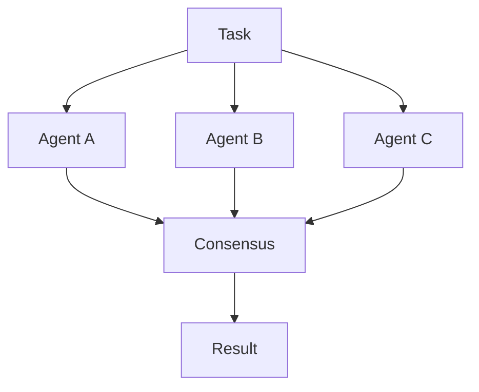

Consensus is an orchestration pattern, not an implicit Agent behavior.

---

## 74. Determinism

Tasks may request deterministic execution where possible.

```yaml
execution:
  determinism: preferred
  seed: 12345
```

Generative systems may still produce bounded nondeterminism.

---

## 75. Reproducibility

For reproducibility, record:

```text
Agent version
Model version
Prompt/template version
Tool versions
Input digest
Context digest
Random seed
```

---

## 76. Snapshot

A task can reference an execution snapshot.

```yaml
snapshot:
  id: snapshot_123
  immutable: true
```

Snapshots support replay and debugging.

---

## 77. Replay

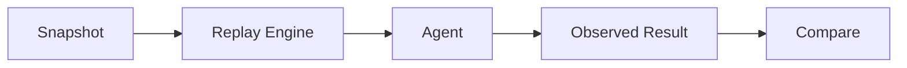

Replay MUST isolate external side effects.

---

## 78. Side Effects

Task contracts classify side effects.

```text
NONE
READ_ONLY
REVERSIBLE
IRREVERSIBLE
EXTERNAL_PUBLICATION
FINANCIAL
```

Higher-risk side effects require stronger controls.

---

## 79. Publication Contract

Publishing tasks require explicit target metadata.

```yaml
side_effects:
  type: external_publication
  target:
    platform: youtube
    channel_id: channel_001
```

No publication target should be inferred from ambiguous context.

---

## 80. Audience Interaction Tasks

For comment/message processing:

```yaml
task:
  type: audience.request.analyze
input:
  source: youtube.comments
output:
  clusters: []
  priorities: []
```

Private messages require stricter security classification.

---

## 81. Character Interaction Tasks

Character Agents may receive:

```yaml
context:
  character_id: char_007
  persona_snapshot: snapshot_44
  relationship_state: loyal_member
  current_mood: energetic
```

Continuity requirements should be explicit.

---

## 82. Human-Like Continuity

For realistic virtual influencers, contracts may require temporal consistency.

```yaml
quality:
  continuity:
    appearance: required
    wardrobe: required
    hair: required
    voice: required
    personality: required
```

---

## 83. Experience Updates

Tasks can produce experience events.

```yaml
experience:
  type: skill_practice
  domain: gaming
  outcome_score: 0.91
```

Learning Systems consume these events.

---

## 84. Skill Improvement

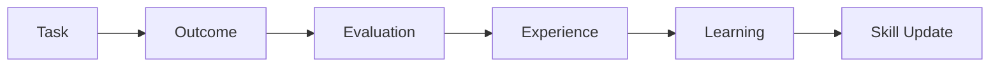

Task contracts therefore provide the structured evidence required for continuous Agent improvement.

---

## 85. Knowledge Freshness

Research tasks may specify freshness.

```yaml
knowledge:
  freshness:
    max_age_hours: 24
```

This prevents stale knowledge from being treated as current information.

---

## 86. Source Requirements

```yaml
knowledge:
  sources:
    required: true
    preferred:
      - official
      - primary
      - academic
```

Source selection remains a Research Agent responsibility.

---

## 87. Localization

```yaml
localization:
  language: fa-IR
  timezone: Europe/Amsterdam
  locale: fa-IR
```

Localization may affect formatting, tone and content selection.

---

## 88. Content Style

Content tasks may specify style constraints.

```yaml
style:
  tone: energetic
  audience_age: 18-34
  humor: moderate
  formality: low
```

Style is data, not hard-coded behavior.

---

## 89. Safety Constraints

Contracts can declare safety requirements.

```yaml
security:
  content_policy_profile: standard
  prohibited_topics: []
  review_required_for: []
```

Safety policies remain enforceable outside the Agent.

---

## 90. Contract Signing

High-value tasks may require cryptographic signing.

```yaml
signature:
  algorithm: ed25519
  key_reference: omnis.task.signing.key
  digest: sha256:...
```

This protects task integrity across distributed components.

---

## 91. Contract Integrity

Runtime SHOULD verify:

```text
schema
signature
expiration
tenant
policy
budget
```

before execution.

---

## 92. Contract Expiration

```yaml
metadata:
  expires_at: 2026-08-16T18:00:00Z
```

Expired contracts MUST NOT start new execution attempts.

---

## 93. Contract Mutation

Contracts SHOULD be immutable after execution begins.

Allowed approach:

```text
Contract v1
   ↓
Amendment v2
   ↓
New execution decision
```

Silent mutation is forbidden.

---

## 94. Contract Diff

Changes should be inspectable.

```text
Input schema: unchanged
Budget: $0.50 → $0.75
Deadline: +10m
Quality: 0.85 → 0.90
```

Every amendment must be auditable.

---

## 95. Backward Compatibility

Contract evolution SHOULD preserve compatibility where possible.

```text
v1 → v1.x = compatible
v1 → v2 = potentially breaking
```

Compatibility metadata must be explicit.

---

## 96. Error Recovery Contract

```yaml
failure:
  recovery:
    strategy: fallback_agent
    fallback_capability: script_generation
    preserve_context: true
```

Recovery actions must remain within budget and policy.

---

## 97. Acceptance Criteria

Task Contract v1 is accepted when:

- every task has unique identity;
- inputs are schema validated;
- outputs are schema validated;
- state transitions are explicit;
- deadlines and timeouts are distinct;
- budgets are enforced;
- retries are governed;
- idempotency is supported;
- cancellation is supported;
- permissions are explicit;
- memory scope is explicit;
- evidence requirements are supported;
- quality gates are supported;
- human approval is representable;
- child-task inheritance is controlled;
- fan-out/fan-in is bounded;
- tracing is supported;
- replay metadata exists;
- side effects are classified;
- security classification exists;
- provenance is preserved.

---

## 98. Implementation Layout

Recommended module structure:

```text
packages/task-contract/
├── schema/
├── validation/
├── normalization/
├── lifecycle/
├── budget/
├── policy/
├── identity/
├── serialization/
├── signing/
├── compatibility/
├── events/
└── tests/
```

---

## 99. System Integration

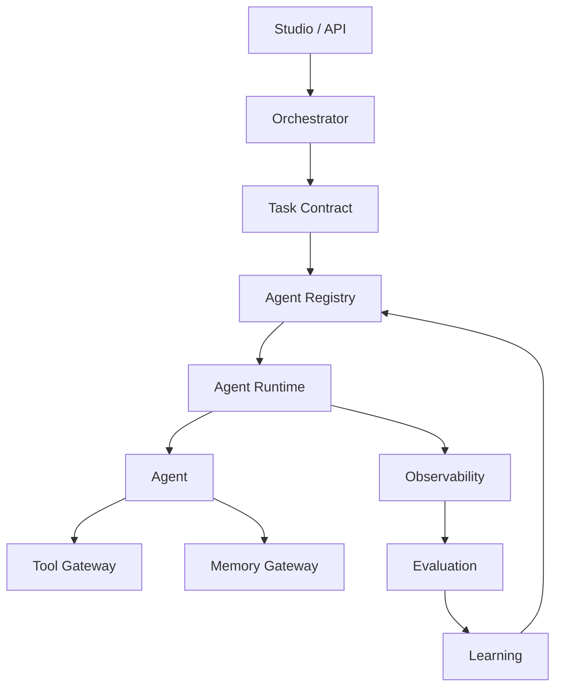

The contract is the common language connecting these systems.

---

## 100. Final Contract

The OMNIS Task Contract MUST make execution explicit enough that an independent Runtime implementation can execute a task without guessing the intended inputs, outputs, permissions, resources, quality requirements or failure semantics.

The contract MUST support ordinary short tasks as well as long-running workflows involving research, content production, audience analysis, virtual characters, publishing, evaluation and learning.

The canonical lifecycle is:

```text
DEFINE
  ↓
VALIDATE
  ↓
SCHEDULE
  ↓
EXECUTE
  ↓
OBSERVE
  ↓
VALIDATE RESULT
  ↓
EVALUATE
  ↓
COMPLETE / RECOVER
  ↓
LEARN
```

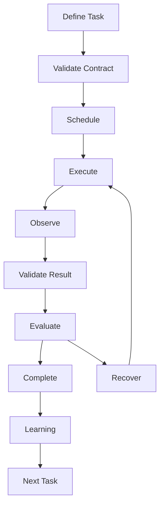

This specification establishes the execution contract required for OMNIS to operate as a deterministic, observable, secure and continuously improving AI content operating system.