# OMNIS Tool Gateway Specification

> Version: 1.0.0  
> Status: Implementation Specification  
> Domain: Tools / Integrations / Security / Agent Runtime

---

## 1. Purpose

The Tool Gateway is the controlled execution boundary between OMNIS Agents and external capabilities. Agents MUST NOT directly call arbitrary network endpoints, shells, credentials, social APIs, model APIs, databases or third-party services.

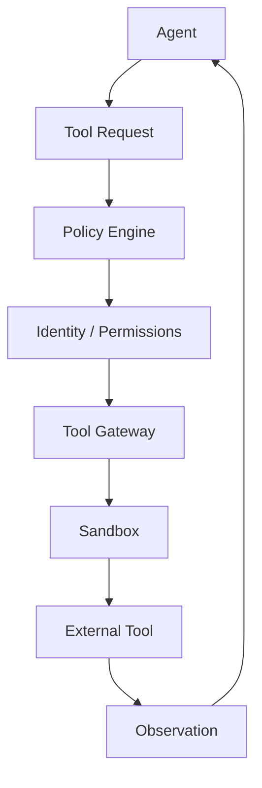

The gateway turns external capabilities into governed, observable and reusable tools.

---

## 2. Design Principles

The gateway MUST provide:

- explicit tool contracts;
- authentication isolation;
- authorization;
- tenant isolation;
- sandboxing;
- rate limiting;
- quotas;
- timeouts;
- retries;
- circuit breakers;
- validation;
- output normalization;
- secret protection;
- audit logging;
- cost tracking;
- provenance;
- policy enforcement.

---

## 3. Capability Model

Tools are grouped by capability rather than vendor.

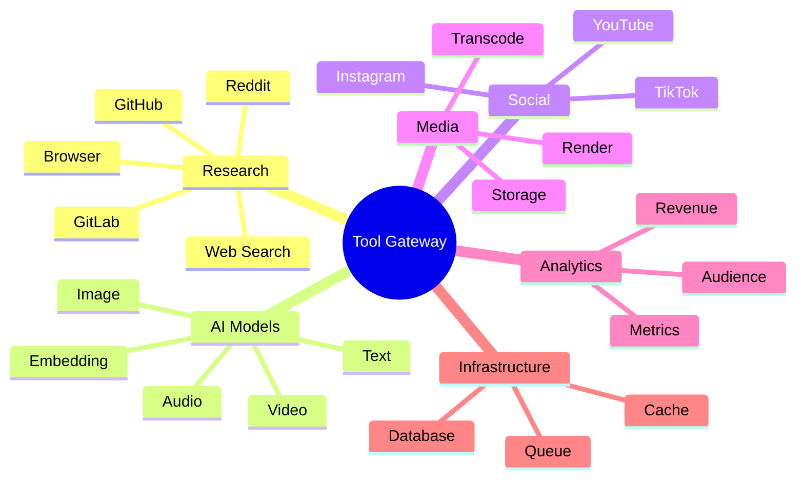

---

## 4. Tool Registry

Every tool MUST have a registry entry.

```yaml
tool:
  id: web.search
  version: 1.0
  provider: internal
  capability: research.search
  risk: low
  auth: none
  timeout_ms: 10000
```

The registry is the source of truth for discoverable capabilities.

---

## 5. Tool Contract

A tool contract defines:

```text
input schema
output schema
permissions
side effects
cost model
limits
failure modes
provenance
```

Agents consume contracts rather than implementation details.

---

## 6. Discovery

Agents request capabilities through semantic requirements.

```text
Need: "find current information about a game"
        ↓
Capability Resolver
        ↓
web.search
official-source-search
community-search
```

The Agent should not need to know which vendor implements the capability.

---

## 7. Routing

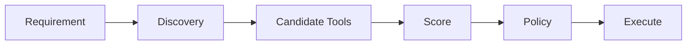

Routing may consider latency, cost, reliability, source quality and policy.

---

## 8. Tool Risk Classes

Tools SHOULD be classified:

```text
L0 informational
L1 read-only external
L2 authenticated read
L3 reversible write
L4 consequential write
L5 high-impact operation
```

Higher risk requires stronger controls.

---

## 9. Read vs Write

Read operations generally have lower risk than writes.

```text
GET data
  ↓
low risk

PUBLISH content
  ↓
high risk
```

Publishing, deletion, financial actions and account changes require explicit policy evaluation.

---

## 10. Side-Effect Declaration

Each tool MUST declare whether it changes external state.

```yaml
side_effects:
  reads: true
  writes: false
  deletes: false
  publishes: false
```

A tool that changes state cannot masquerade as read-only.

---

## 11. Authentication Isolation

Credentials MUST remain inside the gateway boundary.

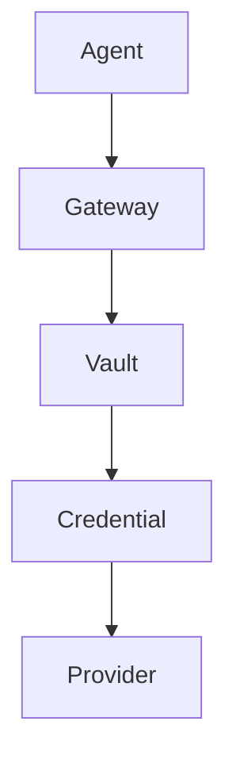

Raw secrets MUST NOT enter Agent context.

---

## 12. Secret Handling

Secrets include:

```text
API keys
OAuth tokens
refresh tokens
cookies
service credentials
signing keys
```

They MUST be redacted from logs and model-visible output.

---

## 13. OAuth

OAuth integrations should use scoped credentials.

```text
authorization
 ↓
minimum scopes
 ↓
short-lived access token
 ↓
gateway
```

---

## 14. Tenant Isolation

Every request carries tenant context.

```yaml
context:
  tenant_id: tenant_001
  workspace_id: workspace_42
  actor_id: agent_123
```

Cross-tenant access MUST fail closed.

---

## 15. Character Isolation

A character's credentials and social identity must be isolated from other characters.

```text
Character A → YouTube identity A
Character B → YouTube identity B
```

No accidental account crossover is permitted.

---

## 16. Platform Identity

The gateway maps logical identities to platform accounts.

```yaml
identity:
  logical_id: character_001
  platform: youtube
  account_ref: secret://youtube/character_001
```

Agents receive an opaque reference rather than credentials.

---

## 17. Browser Tool

Browser automation is a privileged capability.

It MUST provide:

```text
isolated browser profile
cookie isolation
navigation policy
domain allowlist
download limits
upload controls
```

---

## 18. Web Search

Search tools should return normalized results.

```yaml
result:
  title: ...
  url: ...
  source: ...
  published_at: ...
  snippet: ...
  provenance: ...
```

---

## 19. Web Fetch

Fetched documents SHOULD preserve:

```text
URL
retrieval timestamp
content hash
content type
source identity
```

This enables reproducible research.

---

## 20. Reddit Integration

Community research should preserve source provenance and distinguish user-generated claims from verified facts.

```text
Reddit post
 ↓
community signal
 ≠
verified fact
```

---

## 21. GitHub Integration

GitHub tools may support:

```text
repositories
issues
pull requests
files
commits
releases
workflow status
```

Write operations require repository and branch policy.

---

## 22. GitLab Integration

GitLab capability follows the same abstract contract as GitHub.

```text
SCM capability
 ↓
GitHub adapter
GitLab adapter
```

The Agent uses the capability contract, not vendor-specific logic.

---

## 23. Model Gateway

AI models are exposed through the same governed interface.

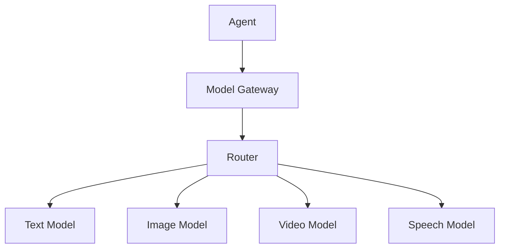

---

## 24. Model Selection

Routing may consider:

```text
quality
latency
cost
context length
modality
availability
policy
```

---

## 25. Model Fallback

```text
Primary Model
 ↓ failure
Secondary Model
 ↓ failure
Emergency Model
```

Fallback must preserve the task contract.

---

## 26. Image Generation Tools

Image tools MUST accept explicit generation contracts.

```yaml
image_request:
  character_id: char_001
  scene: studio
  continuity_required: true
  style_policy: ...
```

The gateway can inject validated character state without exposing internal databases to the model.

---

## 27. Video Generation

Video generation may require:

```text
script
character state
voice state
visual references
motion constraints
music policy
platform format
```

---

## 28. Audio / Voice

Voice tools should support:

```text
voice identity
emotion
prosody
accent
temporary voice state
loudness
language
```

Voice continuity is governed by Character OS and Memory Mesh.

---

## 29. Speech-to-Text

STT outputs SHOULD include timestamps and confidence.

```yaml
segment:
  start: 12.4
  end: 15.8
  text: "..."
  confidence: 0.94
```

---

## 30. Media Processing

Media tools may include:

```text
transcoding
cutting
captioning
thumbnail extraction
audio normalization
format conversion
quality inspection
```

---

## 31. Rendering

Rendering is asynchronous for long jobs.

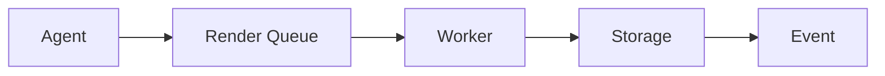

---

## 32. Storage

Storage tools MUST separate logical object identity from physical storage provider.

```yaml
object:
  id: media_123
  provider: object-storage
  uri: opaque://media_123
```

---

## 33. Analytics

Analytics tools provide normalized metrics.

```text
views
watch time
retention
likes
comments
shares
subscribers
revenue
```

Metrics MUST preserve platform and time-window context.

---

## 34. Social Publishing

Publishing is a high-risk operation.

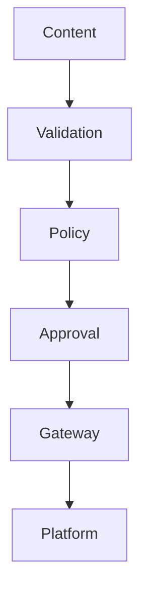

---

## 35. Publishing Contract

```yaml
publish:
  platform: youtube
  account: character_001
  asset: video_123
  title: ...
  description: ...
  visibility: scheduled
  scheduled_at: ...
```

---

## 36. Scheduling

The gateway accepts scheduling requests but the Orchestrator remains responsible for workflow decisions.

```text
Orchestrator
 ↓
publish contract
 ↓
Gateway
 ↓
platform scheduler
```

---

## 37. Comment Retrieval

Comment tools expose structured interaction data.

```yaml
comment:
  id: c_123
  platform: youtube
  author_ref: member_42
  text: ...
  created_at: ...
```

Privacy policies apply.

---

## 38. Comment Reply

Replies are consequential external writes.

```text
read comment
 ↓
classify
 ↓
compose response
 ↓
policy
 ↓
publish reply
```

---

## 39. Audience Request Pipeline

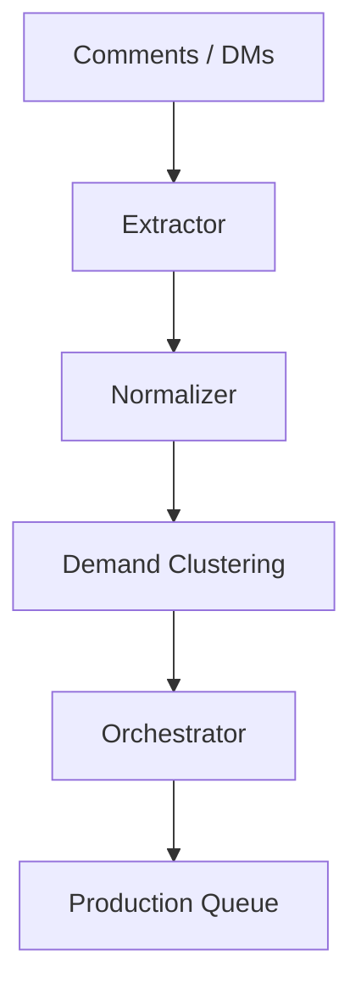

---

## 40. Direct Messages

DM access requires stronger privacy controls than public comments.

```text
DM
 ↓
private scope
 ↓
authorized Agent
```

---

## 41. Weather

Weather is a contextual tool for content continuity.

```text
location
 + date/time
 ↓
weather
 ↓
wardrobe context
```

The result should not override safety or explicit production constraints.

---

## 42. Calendar

Calendar integration supports:

```text
publication schedule
campaigns
seasonal events
brand commitments
character continuity
```

---

## 43. Time

Time is a first-class infrastructure capability.

```text
UTC storage
 ↓
workspace timezone
 ↓
character location timezone
```

---

## 44. Location

Location information should be minimized and scoped.

Exact personal location MUST NOT be exposed unless explicitly authorized and necessary.

---

## 45. Financial Tools

Financial operations are high-risk.

```text
read revenue → controlled
payout change → highly restricted
payment → approval required
```

---

## 46. Tool Budget

Each task receives a tool budget.

```yaml
tool_budget:
  max_calls: 50
  max_cost_usd: 2.00
  max_runtime_seconds: 120
```

---

## 47. Rate Limiting

Rate limits exist at multiple levels.

```text
tenant
agent
character
provider
endpoint
credential
```

---

## 48. Concurrency

Concurrency limits protect external services and system stability.

```text
provider capacity
 ↓
queue
 ↓
controlled workers
```

---

## 49. Timeout

Every remote operation MUST have a deadline.

```text
request
 ↓ timeout
cancel
 ↓
cleanup
 ↓
retry / fallback
```

---

## 50. Retry Policy

Retries MUST distinguish transient from permanent errors.

```text
429 / timeout → retry
400 / invalid auth → do not blindly retry
```

Exponential backoff is preferred.

---

## 51. Idempotency

Write operations SHOULD support idempotency keys.

```yaml
idempotency_key: publish:character_001:video_123:v1
```

This prevents duplicate publication.

---

## 52. Circuit Breaker

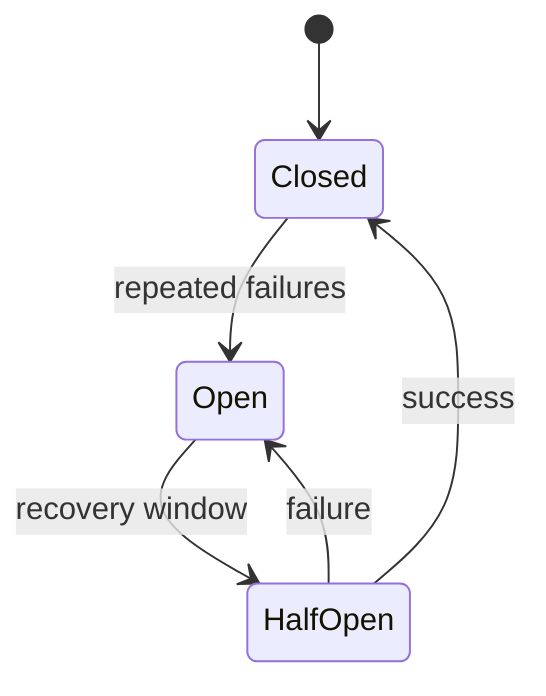

---

## 53. Bulkheads

Providers and high-cost capabilities should have isolated worker pools.

```text
Video workers ≠ Search workers ≠ Publishing workers
```

---

## 54. Sandbox

Untrusted tools MUST execute inside a sandbox where feasible.

Sandbox controls include:

```text
filesystem
network
processes
CPU
memory
time
```

---

## 55. Shell Execution

Shell access is disabled by default.

If enabled, it requires:

```text
explicit capability
allowlisted commands
isolated workspace
time limit
output limit
audit
```

---

## 56. Browser Uploads

Uploads require:

```text
file validation
mime validation
size limit
destination allowlist
malware scanning where available
```

---

## 57. External Data Validation

External tool output is untrusted input.

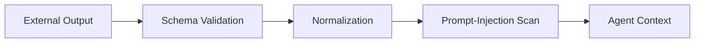

---

## 58. Prompt Injection Defense

Web pages, comments and documents may contain instructions intended to manipulate Agents.

The gateway MUST label external text as untrusted data and prevent it from becoming an implicit system instruction.

---

## 59. Output Sanitization

Tool output should be:

```text
schema-validated
size-limited
secret-redacted
normalized
provenance-tagged
```

---

## 60. Provenance

Every externally sourced observation SHOULD contain:

```yaml
provenance:
  provider: github
  resource: repo/path
  retrieved_at: ...
  content_hash: ...
```

---

## 61. Observability

Gateway telemetry includes:

```text
tool call count
latency
error rate
cost
provider
agent
character
tenant
```

---

## 62. Audit Events

Critical calls generate audit events.

```yaml
audit:
  actor: agent_123
  tool: youtube.publish
  action: publish
  target: video_123
  policy_decision: allow
```

---

## 63. Cost Tracking

Costs are attributed to:

```text
tenant
workspace
character
workflow
agent
tool
model
```

This enables profitability analysis.

---

## 64. Revenue Attribution

Content-generation cost can be correlated with performance.

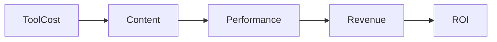

---

## 65. Tool Quality

Tools have reliability scores.

```yaml
quality:
  success_rate: 0.992
  p95_latency_ms: 1800
  freshness_score: 0.94
```

These metrics can influence routing.

---

## 66. Provider Failover

Multiple providers can implement one capability.

```text
image.generate
 ├── provider A
 ├── provider B
 └── provider C
```

---

## 67. Vendor Abstraction

OMNIS should avoid hard-coding a single AI vendor into Agent logic.

```text
Capability Contract
 ↓
Adapter Layer
 ↓
Provider
```

This keeps the architecture model-agnostic.

---

## 68. Versioning

Tool contracts are versioned.

```text
tool.v1
 ↓
tool.v2
```

Breaking changes require migration.

---

## 69. Compatibility

The gateway should support capability negotiation.

```text
Agent asks:
video.generate capabilities
 ↓
Gateway returns supported features
```

---

## 70. Dry Run

High-risk tools SHOULD support simulation.

```text
publish
 ↓
dry-run
 ↓
validation report
```

---

## 71. Approval Gates

Certain operations require human approval.

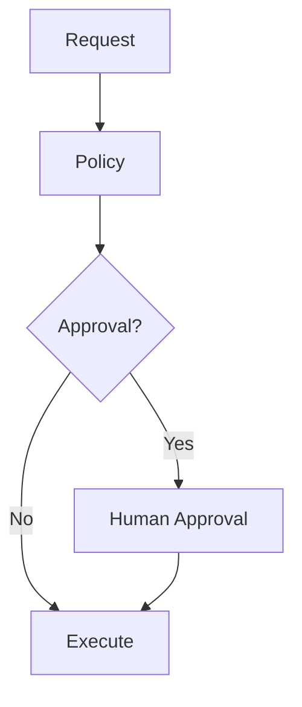

---

## 72. Emergency Stop

Operators MUST be able to disable:

```text
one tool
one provider
one character
one tenant
all publishing
all external writes
```

---

## 73. Kill Switch

A global kill switch MUST fail closed for consequential operations.

```text
KILL SWITCH
 ↓
block external writes
 ↓
allow safe reads where configured
```

---

## 74. Policy Engine

Policy evaluates:

```text
actor
capability
target
risk
context
budget
time
approval
```

---

## 75. Policy Example

```yaml
policy:
  capability: youtube.publish
  risk: L4
  requires_approval: true
  allowed_identity_scope: character-owned
```

---

## 76. Tool Composition

Tools may be composed into workflows.

```text
search
 ↓
fetch
 ↓
extract
 ↓
research
 ↓
script
```

The Orchestrator manages workflow semantics; the Gateway manages capability execution.

---

## 77. Parallel Calls

Independent tool calls may run concurrently.

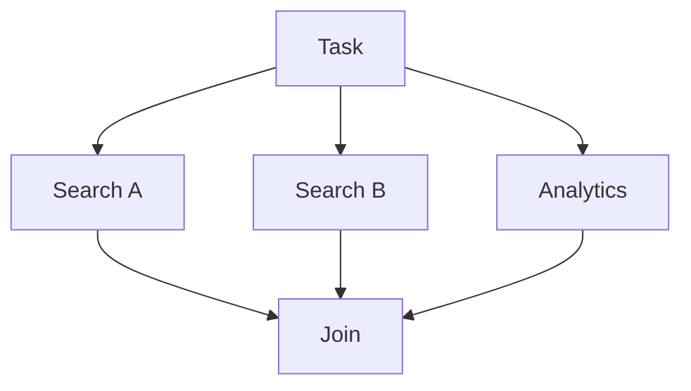

---

## 78. Cancellation

Cancellation propagates through the tool call chain.

```text
Task cancelled
 ↓
Agent cancellation
 ↓
Gateway cancellation
 ↓
Provider cancellation
```

---

## 79. Long-Running Jobs

Jobs return handles.

```yaml
job:
  id: job_123
  status: running
  progress: 0.42
```

Agents poll or subscribe to events.

---

## 80. Event Interface

Tool events include:

```text
started
progress
completed
failed
cancelled
```

---

## 81. Webhooks

External webhooks MUST be authenticated and validated.

```text
webhook
 ↓
signature validation
 ↓
schema validation
 ↓
event bus
```

---

## 82. Queue Integration

The gateway should integrate with the OMNIS event and job infrastructure.

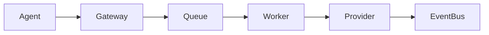

---

## 83. Failure Classification

```text
AUTH
VALIDATION
RATE_LIMIT
TIMEOUT
NETWORK
PROVIDER
POLICY
BUDGET
UNKNOWN
```

Failures are normalized across providers.

---

## 84. Error Contract

```yaml
error:
  code: RATE_LIMIT
  retryable: true
  provider: provider_x
  request_id: req_123
```

---

## 85. Agent-Facing Errors

Errors should be actionable rather than provider-specific.

```text
"YouTube rate limit exceeded"
```

rather than raw HTTP traces.

---

## 86. Security Boundary

The Tool Gateway is a trust boundary.

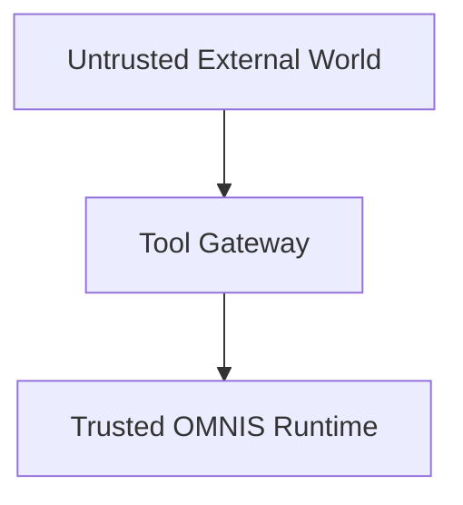

External content never becomes trusted merely because it passed through a tool.

---

## 87. Tool Certification

New tools should pass certification tests.

```text
schema
security
latency
failure
cost
provenance
```

---

## 88. Test Modes

```text
mock
sandbox
staging
canary
production
```

Production writes should never be used for ordinary development tests.

---

## 89. Contract Tests

Each adapter MUST implement common contract tests.

```text
input validation
output validation
timeout
retry
error normalization
auth failure
```

---

## 90. Chaos Testing

Gateway resilience should be tested with:

```text
latency injection
provider failure
429 storms
network failure
partial responses
expired credentials
```

---

## 91. Security Testing

Tests include:

```text
secret leakage
SSRF
prompt injection
path traversal
command injection
cross-tenant access
privilege escalation
```

---

## 92. SSRF Defense

URL-fetch tools MUST restrict network destinations.

```text
public internet
allowed

internal metadata endpoints
blocked
```

---

## 93. File Security

File paths are normalized and sandboxed.

```text
requested path
 ↓
normalize
 ↓
allowlist
 ↓
sandbox
```

---

## 94. Data Loss Prevention

Sensitive data scanners may inspect outbound tool payloads.

```text
Agent output
 ↓
DLP policy
 ↓
allow / redact / block
```

---

## 95. Observability Correlation

Every call carries:

```text
trace_id
span_id
request_id
workflow_id
agent_id
character_id
```

This enables complete execution tracing.

---

## 96. Replay

Read-only tool interactions SHOULD be replayable in development.

```text
recorded request
 + recorded response
 = deterministic replay
```

Secrets are excluded from recordings.

---

## 97. Simulation

Simulation mode allows workflow validation without external side effects.

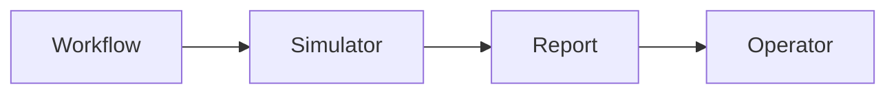

---

## 98. Agent Runtime Contract

The Agent Runtime expects a uniform interface:

```text
resolve(capability)
authorize(tool)
execute(request)
observe(result)
record(outcome)
```

---

## 99. Canonical Request

```yaml
tool_request:
  capability: research.search
  actor:
    tenant_id: tenant_001
    agent_id: agent_42
    character_id: char_007
  input: {}
  budget:
    cost: 1.0
    calls: 5
  deadline: ...
  idempotency_key: ...
```

---

## 100. Canonical Response

```yaml
tool_response:
  status: success
  output: {}
  provenance: []
  usage:
    latency_ms: 820
    estimated_cost: 0.01
  trace_id: trace_123
```

---

## 101. Architecture Boundary

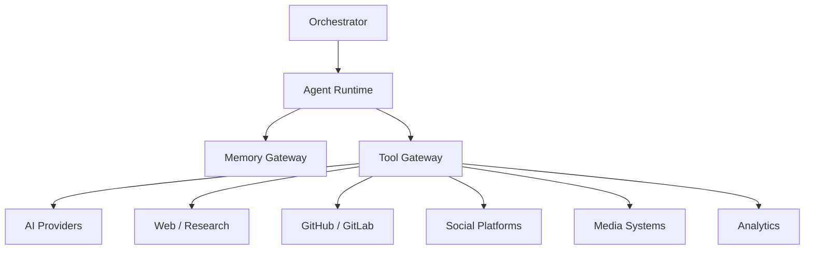

---

## 102. Final Contract

The Tool Gateway is the controlled nervous system through which OMNIS interacts with the external world.

It MUST keep Agents capable without making them unrestricted.

```text
CAPABILITY
 ↓
DISCOVERY
 ↓
AUTHORIZATION
 ↓
SANDBOX
 ↓
EXECUTION
 ↓
VALIDATION
 ↓
PROVENANCE
 ↓
OBSERVABILITY
 ↓
LEARNING
```

The resulting architecture allows hundreds or thousands of Agents and virtual characters to use diverse AI models, research systems, media engines, social platforms and infrastructure while maintaining security, continuity, cost control, auditability and operational independence.