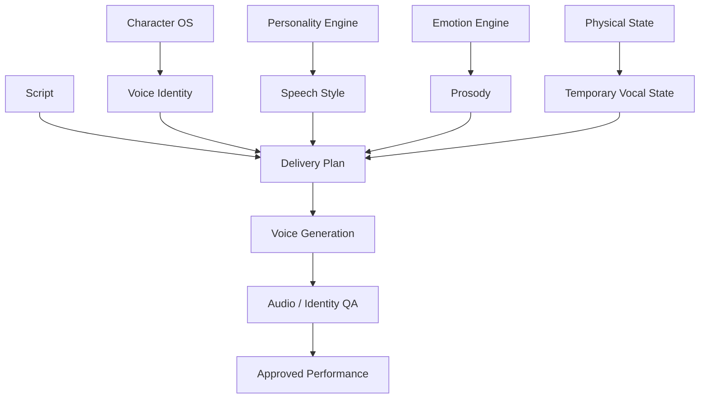
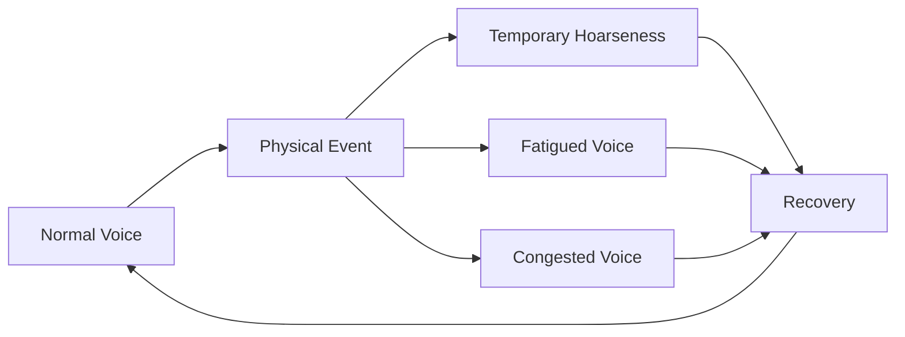
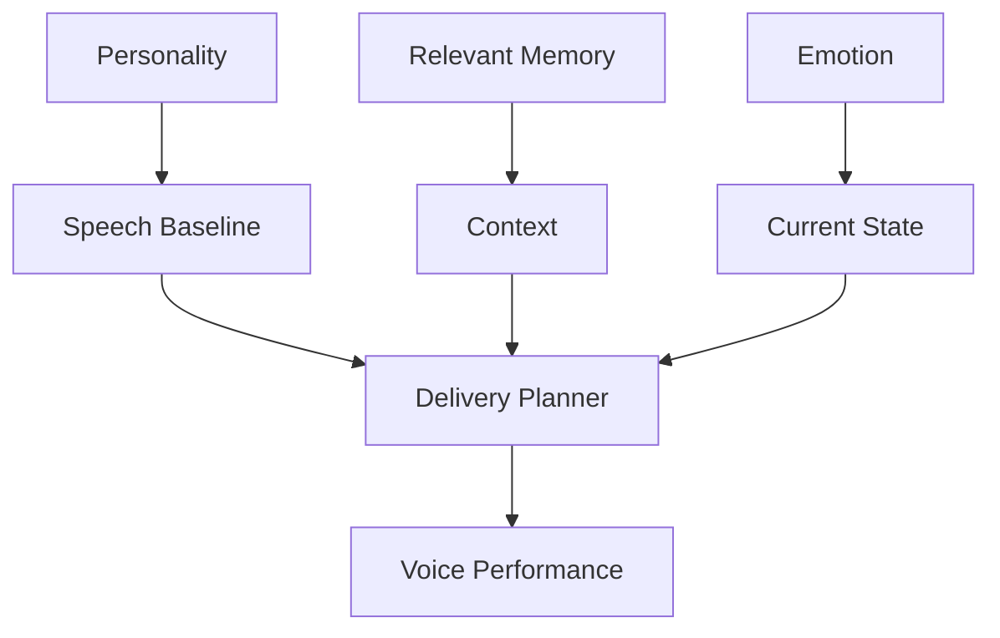
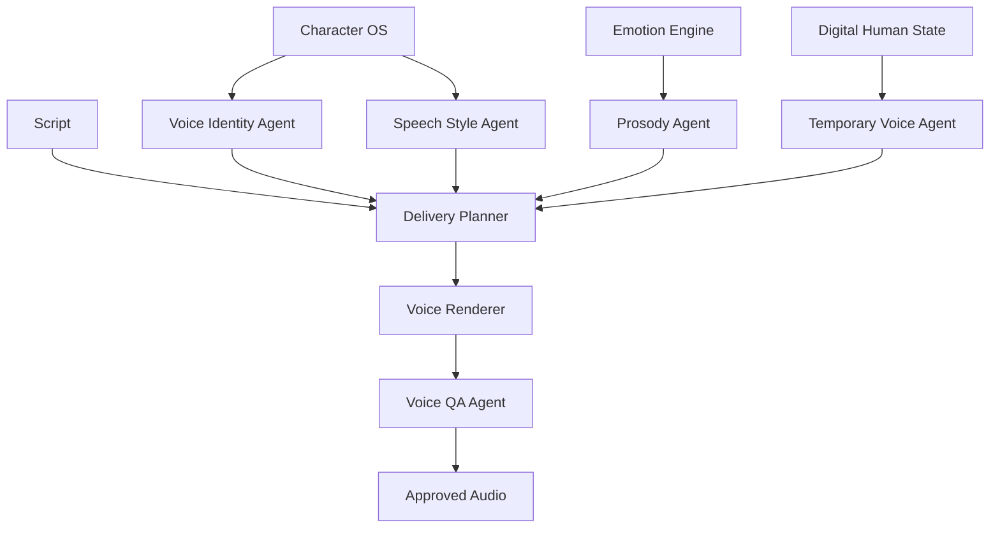
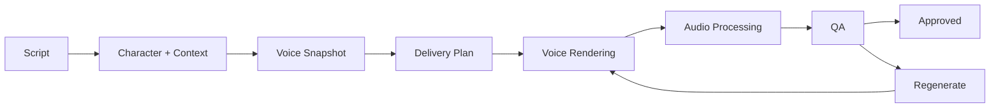

# OMNIS Voice and Speech Identity Engine Specification

> Version: 1.0.0  
> Status: Architecture Specification  
> Domain: Voice Identity / Speech / Prosody / Dialogue / Temporary Vocal State / Continuity

## 1. Purpose

The Voice and Speech Identity Engine gives every Character a persistent vocal identity while allowing natural variation caused by emotion, context, fatigue, illness, environment and experience.



## 2. Core Principle

The voice must be recognizable without sounding mechanically identical in every recording.

```text
VOICE IDENTITY
+
SPEECH PERSONALITY
+
EMOTIONAL PERFORMANCE
+
TEMPORARY PHYSICAL STATE
+
NATURAL VARIATION
=
BELIEVABLE CHARACTER VOICE
```

## 3. Voice Identity

A Voice Identity contains stable characteristics such as timbre, vocal range, accent profile and habitual delivery.

## 4. Stable Attributes

```text
timbre
base pitch range
resonance
accent profile
speech rhythm baseline
articulation profile
vocal energy baseline
```

## 5. Mutable Attributes

```text
pitch within range
pace
volume
pauses
energy
breathiness
roughness
emotional color
temporary hoarseness
```

## 6. Voice Snapshot

Every production receives a deterministic Voice Snapshot.

```yaml
voice_snapshot:
  voice_id: voice_001
  language: fa-IR
  baseline_energy: 0.72
  pace: 1.03
  emotional_state: excited
  temporary_state: normal
```

## 7. Speech Identity

Voice alone does not define speech identity. Each Character also has a linguistic fingerprint.

## 8. Vocabulary

Vocabulary is influenced by age, expertise, education profile, culture, personality and channel niche.

## 9. Sentence Structure

Characters have preferred sentence lengths, complexity and rhetorical patterns.

## 10. Catchphrases

Catchphrases are probabilistic habits rather than mandatory inserts.

## 11. Filler Words

Controlled filler-word patterns may contribute to natural speech while avoiding excessive repetition.

## 12. Humor Style

Humor is derived from Personality Engine preferences and context.

## 13. Slang

Slang is constrained by Character age, culture, language and profile.

## 14. Expertise Language

A Character can be highly skilled in a domain without sounding like an academic specialist in every conversation.

## 15. Cross-Domain Knowledge

When a topic crosses domains, the Character can use supporting knowledge without silently becoming an expert outside its profile.

## 16. Pronunciation Dictionary

Character-specific pronunciation rules may override generic pronunciation where appropriate.

## 17. Names and Terms

Recurring names, brands, games, locations and technical terms can have stored pronunciation preferences.

## 18. Prosody

Prosody controls the expressive structure of speech.

```text
pitch
stress
rhythm
pauses
intonation
speed
volume
```

## 19. Emotional Prosody

Emotion modifies prosody without replacing the stable Voice Identity.

## 20. Energy Mapping

High energy may increase pace, pitch movement and emphasis within Character-specific limits.

## 21. Calm Mapping

Calm states may reduce pitch variation, pace and intensity.

## 22. Anger Mapping

Anger may produce sharper articulation, stronger stress and increased intensity while remaining within safe vocal bounds.

## 23. Sadness Mapping

Sadness may reduce energy and pace and increase pauses.

## 24. Excitement Mapping

Excitement may increase speech rate, pitch movement and emphasis.

## 25. Fatigue Mapping

Fatigue can reduce energy and articulation consistency within realistic limits.

## 26. Temporary Illness

A Character may temporarily have a hoarse, congested or weakened voice when the Digital Human Simulation contains a valid physical-state event.



## 27. Temporal Continuity

A temporary vocal condition persists according to its simulated timeline.

## 28. Recovery

Recovery changes the vocal state gradually where appropriate rather than producing arbitrary jumps.

## 29. Voice State Timeline

```text
Day 1: normal
Day 2: mild hoarseness
Day 3: stronger hoarseness
Day 4: recovery
Day 5: normal
```

## 30. Environment

Room acoustics, microphone configuration and environment affect the rendered performance separately from Character identity.

## 31. Recording Context

The engine can model studio, outdoor, vehicle, live-stream and phone contexts.

## 32. Microphone Profile

Each channel or production environment can specify a microphone and processing profile.

## 33. Audio Processing

Processing may include controlled equalization, compression, noise reduction and loudness normalization.

## 34. Processing Boundary

Audio processing must not erase the Character's vocal identity or create unnatural artifacts.

## 35. Dialogue Performance

A script becomes a performance through delivery instructions.

```yaml
delivery:
  emotion: amused
  energy: 0.81
  pace: 1.08
  emphasis:
    - word: "واقعاً"
      strength: 0.7
  pause_after: ["خب"]
```

## 36. Scene Context

Delivery depends on scene location, relationship context and narrative objective.

## 37. Audience Context

A Character may speak differently to a close community member than to a first-time viewer while preserving identity.

## 38. Relationship-Aware Speech

Speech can incorporate known relationship state, stored preferences and conversation history.

## 39. Comment Replies

Comment replies use the same Voice and Speech Identity as scripted content.

## 40. DM Replies

Private replies use configurable intimacy and privacy boundaries while retaining Character style.

## 41. Conversation Memory

Relevant conversation memory is retrieved before generating personalized responses.

## 42. Avoiding Repetition

Repeated replies are detected and varied without changing the Character's core language style.

## 43. Live Interaction

Live interactions require low-latency speech planning while preserving state consistency.

## 44. Interruption

The runtime may support interruption and turn-taking events for conversational contexts.

## 45. Turn Taking

Speech generation considers whether the Character is answering, reacting, clarifying or closing a turn.

## 46. Backchanneling

Short reactions such as laughter or acknowledgement can be generated when appropriate.

## 47. Laughter

Laughter style can be Character-specific and influenced by emotional state.

## 48. Breathing

Breathing and pause patterns may contribute to natural performance but remain controlled to avoid distracting artifacts.

## 49. Hesitation

Controlled hesitation can represent uncertainty or natural conversational behavior.

## 50. Uncertainty

When the Character does not know something, speech should reflect the knowledge boundary rather than fabricate expertise.

## 51. Speech Errors

Minor natural disfluencies may be simulated when appropriate, but intentional errors must not reduce factual or accessibility quality.

## 52. Self-Correction

Characters can naturally correct themselves during conversational or scripted performance when the narrative calls for it.

## 53. Emotional Memory

Past emotional experiences can influence current delivery when retrieved by the Character runtime.

## 54. Personality Coupling

Personality controls baseline speech tendencies.



## 55. Age Consistency

Voice and speech remain consistent with the Character's configured age and development timeline.

## 56. Character Development

Speech can evolve with experience while retaining recognizable identity.

## 57. Skill Growth

As a Character gains expertise, technical vocabulary and explanation quality may improve within its learning model.

## 58. Language Learning

If enabled, language proficiency can evolve over time with explicit learning events.

## 59. Accent Stability

Accent should remain stable unless an explicit Character event or long-term evolution model changes it.

## 60. Code-Switching

Multilingual Characters may switch languages according to Character preferences and context.

## 61. Brand Voice

Channel-level brand rules can constrain speech without replacing Character personality.

## 62. Sponsorship Voice

Sponsored segments must preserve Character voice while satisfying campaign constraints.

## 63. Platform Adaptation

Short-form and long-form delivery can differ in pacing while maintaining the same identity.

## 64. Voice Variants

A Character may have controlled variants for different languages, environments or production formats.

## 65. Variant Registry

Each variant references the canonical Voice Identity.

## 66. Voice Versioning

Changes to a Character's voice model are versioned for reproducibility.

## 67. Model Abstraction

OMNIS must not couple Character identity to a single voice provider or model.

```text
Character Voice Identity
          ↓
Voice Abstraction Layer
          ↓
Provider Adapter
    ┌─────┼─────┐
    ▼     ▼     ▼
 Model A Model B Model C
```

## 68. Model Routing

The Orchestrator selects a suitable model based on quality, latency, language, cost and availability.

## 69. Fallback

If the preferred provider fails, the runtime can route to an approved compatible model while preserving Character parameters.

## 70. Provider Drift

Provider model changes must not silently redefine the canonical Character identity.

## 71. Reference Calibration

Voice identity can be recalibrated against approved reference material.

## 72. Identity QA

Voice QA evaluates whether output remains within the Character's approved vocal identity.

## 73. Speech QA

Speech QA checks vocabulary, tone, pronunciation, pacing and Character style.

## 74. Audio QA

Audio QA checks clipping, distortion, noise, synchronization and loudness.

## 75. Continuity QA

Adjacent clips and episodes are checked for unexplained vocal changes.

## 76. Safety QA

The system checks configured content, privacy and platform safety constraints before publication or delivery.

## 77. Synthetic Media Disclosure

Where required by platform rules or applicable law, OMNIS must support appropriate AI/synthetic-media disclosure metadata and presentation.

## 78. Consent and Identity Boundaries

Voice systems must not be used to impersonate real people without appropriate authorization.

## 79. Audit Trail

Voice generation records retain model, version, configuration and production references required for reproducibility.

## 80. Cost Tracking

Each voice generation records estimated and actual resource usage.

## 81. Cache

Approved reusable voice segments may be cached where content and policy allow.

## 82. Regeneration

Failed audio can be regenerated from the same Voice Snapshot and Delivery Plan.

## 83. Checkpointing

Long productions checkpoint generated dialogue and approved audio artifacts.

## 84. State Integrity

A Voice Snapshot must remain immutable during a production unless the production explicitly creates a new snapshot.

## 85. Agent Architecture



## 86. Agent Permissions

Agents propose changes through controlled interfaces and cannot arbitrarily mutate canonical Character identity.

## 87. Planner / Renderer Separation

Delivery planning and audio rendering remain separate so the system can change providers without rewriting Character logic.

## 88. Learning Loop

Performance data can influence future delivery recommendations.

```text
VOICE PERFORMANCE
      ↓
AUDIENCE RESPONSE
      ↓
ANALYTICS
      ↓
LEARNING MODEL
      ↓
DELIVERY HYPOTHESIS
      ↓
FUTURE PERFORMANCE
```

## 89. Experimentation

The system can test controlled variations in pacing, hooks and emotional delivery while preserving Character identity.

## 90. Experiment Isolation

Experiments must not permanently modify Character identity without an explicit learning decision.

## 91. Long-Term Evolution

Voice evolution may occur through explicit Character development events rather than random drift.

## 92. Recovery

A problematic voice update can be rolled back to the previous approved version.

## 93. Branching

Alternative voice evolution paths can be simulated before committing a new Character state.

## 94. Observability

The runtime exposes traceable information about voice planning, rendering and QA.

## 95. Metrics

```text
voice identity score
speech consistency
pronunciation accuracy
audio quality
latency
cost
regeneration rate
```

## 96. Production Pipeline



## 97. Naturalness Principle

Naturalness is achieved through bounded variation, state-aware performance and continuity rather than random noise or forced human imperfections.

## 98. Reliability Principle

Every generated performance must remain reproducible from its Character, Voice Snapshot, Delivery Plan and model configuration.

## 99. Final Contract

The Voice and Speech Identity Engine MUST maintain a stable, recognizable Character voice while allowing context-sensitive variation in speech, prosody and temporary physical state. It MUST integrate Character OS, Personality, Emotion, Memory, Digital Human Simulation and Content Factory. It MUST support provider abstraction, model routing, continuity, QA, recovery, learning and auditability.

## 100. Architectural Outcome

```text
CHARACTER
   ↓
PERSONALITY
   ↓
EMOTION + MEMORY + PHYSICAL STATE
   ↓
SPEECH IDENTITY
   ↓
DELIVERY PLAN
   ↓
VOICE PERFORMANCE
   ↓
AUDIENCE INTERACTION
   ↓
EXPERIENCE
   ↓
LEARNING
   ↓
EVOLVED CHARACTER
```
