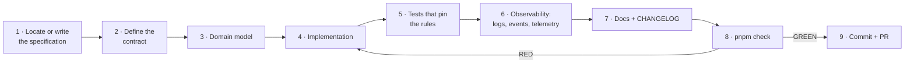

# Development Workflow

Status: Accepted · Sprint 0

How work actually gets done in this repository: the loop, the gates, the conventions and
the hardening that is deliberately deferred. Read
[CONTRIBUTING.md](../../CONTRIBUTING.md) for the rules and
[MONOREPO.md](MONOREPO.md) for the commands; this document is the working method.

## 1. The loop



A slice is complete only when every stage is done. Code without tests, observability or a
documentation update is not finished, whatever it looks like.

## 2. Before writing code

1. Find the specification for the code you are about to change
   ([docs/SUMMARY.md](../SUMMARY.md) is the map).
2. If it does not exist, write it first. Do not infer an architecture from a local file —
   the documentation is the design authority, and a guess becomes a boundary somebody else
   has to live with.
3. Check whether the change crosses a domain boundary, a package dependency rule, a
   contract version or the toolchain. If it does, it needs an ADR in
   [docs/07-decisions/](../07-decisions) **before** the implementation.

## 3. The gates, in the order they are cheapest to run

| Gate      | Command                 | Catches                                                                                            |
| --------- | ----------------------- | -------------------------------------------------------------------------------------------------- |
| structure | `pnpm verify:workspace` | layering violations, cycles, empty files, `any`, placeholders, broken doc links, untested packages |
| secrets   | `pnpm verify:secrets`   | credential-shaped material in any tracked file                                                     |
| types     | `pnpm typecheck`        | every type error, including in tests                                                               |
| style     | `pnpm lint`             | unused code, unsafe patterns, zero warnings tolerated                                              |
| behaviour | `pnpm test`             | 815 tests across 11 packages                                                                       |
| artefacts | `pnpm build`            | emit, declaration files, package entry points                                                      |
| all       | `pnpm check`            | the above, in dependency order                                                                     |

Run `pnpm check` before opening a pull request; CI runs exactly the same command. Never
report work as green on a partial run.

## 4. Conventions

### Commits

Conventional Commits, scoped by area:

```text
feat(events): add publishing.job.scheduled definition
fix(errors): redact bearer tokens in serialized metadata
test(telemetry): pin metric label cardinality rules
docs(adr): record the frontend stack decision
chore(workspace): pin vitest to the catalog
```

One vertical slice per commit where possible. Never rewrite published history, never
force-push a shared branch, never discard somebody else's work to make a gate pass.

### Branches

Short-lived branches off `main`, named for the work (`sprint-1-ai-core`,
`fix/redaction-bearer`). A pull request describes **why**, links the ADR or specification,
and includes the gate output.

### Code

- No `any`, no `@ts-ignore`, no `@ts-nocheck`, no `eslint-disable`, no `TODO`/`FIXME`
  markers, no empty files, no placeholder returns, no `debugger`/`console.log` left in
  source. All are checked mechanically, not by review.
- `import type` for type-only imports (`verbatimModuleSyntax` requires it).
- Branded identifiers at every boundary; a raw `string` is not an identifier.
- Errors are typed `OmnisError` subclasses with a stable code — never a bare `throw new
Error(...)` in a core path. When a capability is declared but not built yet, throw
  `NotImplementedError`, which is a classified, non-retryable failure rather than a
  surprise.
- Comments explain **why**, and name the failure a rule prevents. A comment that restates
  the code is noise; a comment that records a decision saves the next reader a day.

## 5. Writing tests that mean something

Every test should be able to answer "what would break if this assertion were removed?".

- Pin the **rule**, not the value: a payload test asserts why `null` is not `undefined`, a
  bus test asserts what a failing handler may not do to its neighbours, a redaction test
  asserts that a credential under a harmless key is still caught.
- Test the rejection case. A schema test with only a valid input documents nothing.
- Vocabulary-consistency tests are cheap and catch the most expensive class of bug: two
  packages disagreeing about a name.
- No test may depend on execution order or on a shared mutable singleton; create a fresh
  instance instead.
- Never fake production behaviour to make a test pass. If a test needs a fake, the fake
  must be an honest implementation of a real interface — the no-op telemetry and the
  in-memory bus are the sanctioned examples, and both say what they are.

## 6. Deferred hardening (tracked here on purpose)

These are known gaps with a reason, not oversights:

| Item                                                                                          | Why deferred                                                                                                                                                                          | When                    |
| --------------------------------------------------------------------------------------------- | ------------------------------------------------------------------------------------------------------------------------------------------------------------------------------------- | ----------------------- |
| Type-aware ESLint (`no-floating-promises`, `no-misused-promises`, `no-unnecessary-condition`) | Needs `parserOptions.projectService`, which requires every linted file to belong to a tsconfig project; enabling it half-way produces a gate that fails on config rather than on code | Sprint 1                |
| Coverage thresholds                                                                           | Meaningless until the domain packages exist; a threshold on foundation packages only encourages padding                                                                               | after Sprint 2          |
| Durable event transport                                                                       | The contract (grammar, envelope, registry, delivery semantics) had to be fixed first; a transport can be replaced, a persisted event format cannot                                    | when a service needs it |
| Concrete telemetry backend                                                                    | Interfaces and the bounded attribute vocabulary exist; the vendor choice is infrastructure, not architecture                                                                          | when deployment lands   |
| CI matrix across Node versions                                                                | One supported Node line (22.12+) until a deployment target requires another                                                                                                           | with deployment         |

## 7. When a gate fails

1. Read the actual error, not the summary line.
2. Identify the root cause. A gate failure is a fact about the code, not an obstacle to
   route around.
3. Fix the cause. Do not weaken `tsconfig.base.json`, do not disable a lint rule globally,
   do not add a suppression comment, do not delete the test.
4. Re-run the affected gate, then the whole `pnpm check`.
5. If the gate itself is wrong — a health rule that no longer matches the architecture —
   change the rule in `scripts/check-workspace-health.mjs` and say why in the commit
   message. The rules are code, and they are reviewed like code.
